<properties
  pageTitle="Forberede dit miljø til at sikkerhedskopiere arbejdsmængder ved hjælp af Azure Backup Server | Microsoft Azure"
  description="Sørg for, at dit miljø er korrekt parat til at sikkerhedskopiere arbejdsmængder ved hjælp af Azure Backup Server"
  services="backup"
  documentationCenter=""
  authors="pvrk"
  manager="shivamg"
  editor=""
  keywords="Azure sikkerhedskopiering serveren. Sikkerhedskopiering samling"/>

<tags
  ms.service="backup"
  ms.workload="storage-backup-recovery"
  ms.tgt_pltfrm="na"
  ms.devlang="na"
  ms.topic="article"
  ms.date="08/22/2016"
  ms.author="jimpark;trinadhk;pullabhk; markgal"/>

# <a name="preparing-to-back-up-workloads-using-azure-backup-server"></a>Forberedelse til at sikkerhedskopiere arbejdsmængder ved hjælp af Azure Backup Server

> [AZURE.SELECTOR]
- [Server til Azure sikkerhedskopiering](backup-azure-microsoft-azure-backup.md)
- [SCDPM](backup-azure-dpm-introduction.md)
- [Azure Backup Server (klassisk)](backup-azure-microsoft-azure-backup-classic.md)
- [SCDPM (klassisk)](backup-azure-dpm-introduction-classic.md)


Denne artikel handler om at forberede dit miljø til at sikkerhedskopiere arbejdsmængder ved hjælp af Azure Backup Server. Du kan beskytte arbejdsbelastninger som Hyper-V FOS, Microsoft SQL Server, SharePoint Server, Microsoft Exchange og Windows-klienter fra en enkelt konsol med Azure sikkerhedskopi-serveren.

>[AZURE.WARNING] Server til Azure sikkerhedskopiering arver funktionaliteten af Data Protection Manager (DPM) til arbejdsbelastningen sikkerhedskopi. Du kan finde markører til DPM dokumentationen til nogle af disse funktioner. Azure Backup Server beskytter på bånd dog ikke eller integrere med System Center.

## <a name="1-windows-server-machine"></a>1. Windows Server maskine


Det første trin til, hvordan du kommer Azure Backup Server og kører er at have en computer med Windows Server.

| Placering | Minimumkrav | Yderligere instruktioner |
| -------- | -------------------- | ----------------------- |
| Azure | Azure IaaS virtuel maskine<br><br>A2 Standard: 2 kerner, 3,5 GB RAM | Du kan starte med et enkelt galleriet billede af Windows Server 2012 R2 Datacenter. [Beskytte IaaS arbejdsmængder ved hjælp af Azure sikkerhedskopi Server (DPM)](https://technet.microsoft.com/library/jj852163.aspx) har mange små forskelle. Sørg for, at du læser artiklen helt før du anvender maskinen. |
| Lokalt | Hyper-V VM<br> VMWare VM<br> eller en fysisk vært<br><br>2 støbekerner og 4GB RAM | Du kan deduplicate DPM opbevaring ved hjælp af Windows Server Deduplication. Lær mere om, hvordan [DPM og deduplication](https://technet.microsoft.com/library/dn891438.aspx) fungerer sammen når implementeret i Hyper-V FOS. |

> [AZURE.NOTE] Det anbefales, at Azure Backup Server er installeret på en computer med Windows Server 2012 R2 Datacenter. Mange af forudsætningerne dækkes automatisk med den seneste version af Windows-operativsystemet.

Hvis du planlægger at deltage i denne server til et domæne på et tidspunkt, anbefales det, at den deltager i domæ aktivitet udføres før installationen af Azure sikkerhedskopi Server. Flytte en eksisterende Azure Backup Server-computer til et nyt domæne, når installationen er *ikke understøttet*.

## <a name="2-backup-vault"></a>2. sikkerhedskopiering samling


Uanset om du sende sikkerhedskopidata til Azure eller gemme den lokalt, skal være forbundet med Azure softwaren. Hvis du vil have mere specifikke, Azure sikkerhedskopiering servercomputeren skal være registreret hos en sikkerhedskopi samling af legitimationsoplysninger.

Sådan oprettes en sikkerhedskopi samling af legitimationsoplysninger:

1. Log på [administrationsportalen til](http://manage.windowsazure.com/).

2. Klik på **nyt** > **datatjenester** > **gendannelse Services** > **Sikkerhedskopiering samling** > **Hurtig oprettelse**. Hvis du har flere abonnementer, der er knyttet til din virksomhedskonto, Vælg det korrekte abonnement skal knyttes til den ekstra samling af legitimationsoplysninger.

3. Angiv et fuldt navn til at identificere samling af legitimationsoplysninger i **navnet**. Dette skal være entydige for hvert abonnement.

4. Vælg det geografiske område for samling af legitimationsoplysninger i **område**. Den samling område er typisk valgte baseret på dataene højhedsområde eller netværk ventetid begrænsninger.

    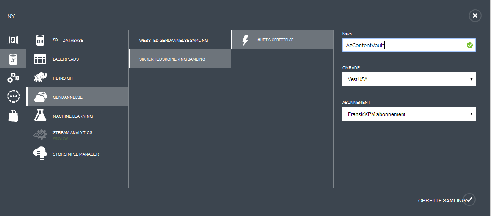

5. Klik på **Opret samling af legitimationsoplysninger**. Det kan tage et øjeblik, før den ekstra samling af legitimationsoplysninger skal oprettes. Overvåge status meddelelserne nederst på portalen.

    

6. En meddelelse bekræfter, at samling af legitimationsoplysninger er blevet oprettet, og det vises på siden gendannelsestjenester som aktiv.
    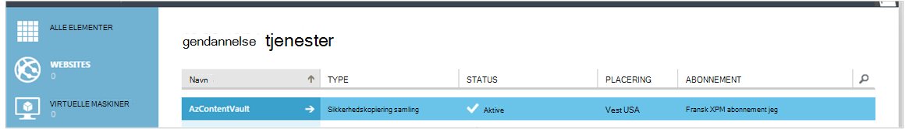

  > [AZURE.IMPORTANT] Sørg for, at indstillingen passende lager redundans er valgt, højre, når samling af legitimationsoplysninger er blevet oprettet. Få mere at vide om [geografisk overflødige](../storage/storage-redundancy.md#geo-redundant-storage) og [lokalt overflødige](../storage/storage-redundancy.md#locally-redundant-storage) indstillinger i denne [Oversigt](../storage/storage-redundancy.md).


## <a name="3-software-package"></a>3. programpakke


### <a name="downloading-the-software-package"></a>Hente programpakke

Svarer til samling legitimationsoplysninger, kan du hente Microsoft Azure sikkerhedskopiering for arbejdsbelastninger fra **Hurtig Start-siden** af den ekstra samling af legitimationsoplysninger.

1. Klik på **For arbejdsbelastninger (Disk til Disk til skyen)**. Derved kommer du til siden Overførselscenter fra hvor softwarepakken kan hentes.

    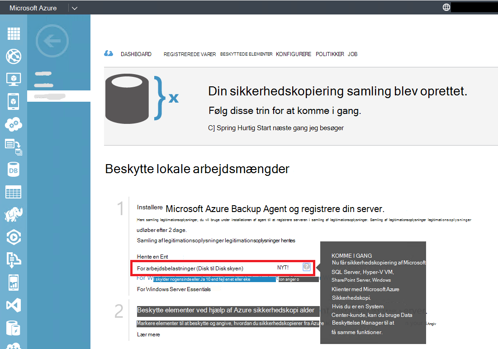

2. Klik på **Hent**.

    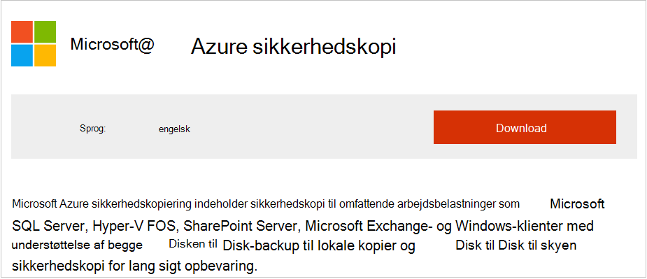

3. Vælg alle filerne, og klik på **Næste**. Hente alle de filer, der kommer fra Microsoft Azure Backup overførselssiden, og Placer alle filerne i den samme mappe.
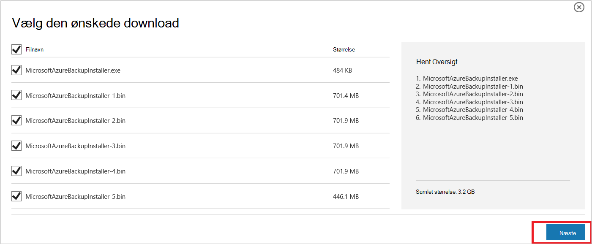

    Da overførselsstørrelse for alle filerne er sammen > 3G, på en 10Mbps link til overførsel det kan tage op til 60 minutter, før overførslen til at fuldføre.


### <a name="extracting-the-software-package"></a>Hente programpakke

Når du har hentet alle filerne, skal du klikke på **MicrosoftAzureBackupInstaller.exe**. Dette starter **Konfigurationsguiden til Microsoft Azure sikkerhedskopi** at udtrække installationsfiler til en placering, der er angivet af dig. Forsæt med guiden, og klik på knappen **udtrække** for at starte udtrækning af processen.

> [AZURE.WARNING] Mindst 4GB ledig plads er nødvendig for at udtrække filerne til installation.


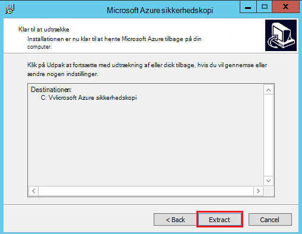

Markér afkrydsningsfeltet for at åbne den frisk udpakkede *setup.exe* for at starte installationen af Microsoft Azure Backup Server, og klik på knappen **Udfør** , når udtrækning af behandle fuldført.

### <a name="installing-the-software-package"></a>Installation af softwarepakken

1. Klik på **Microsoft Azure Backup** for at starte konfigurationsguiden.

    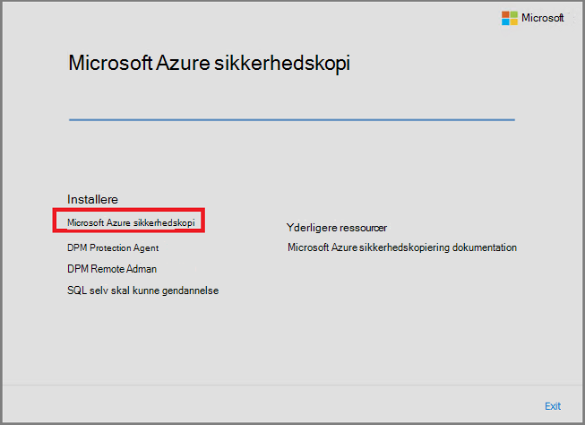

2. Klik på knappen **Næste** på velkomstsiden. Du føres til sektionen *Nødvendige kontrollerer* . På dette skærmbillede skal du klikke på knappen **kontrollere** til at bestemme, hvis hardware- og softwarekrav til Azure Backup Server er opfyldt. Hvis alle forudsætningerne er gået opfyldes korrekt, vises der en meddelelse, der angiver, at computeren opfylder kravene. Klik på knappen **Næste** .

    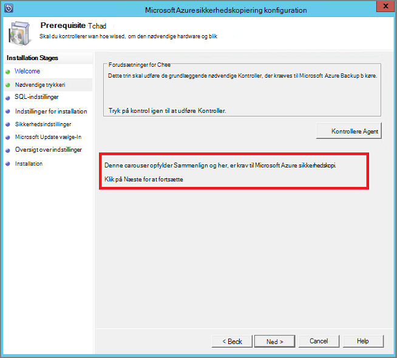

3. Microsoft Azure Backup Server kræver SQL Server Standard, og installationspakken Azure Backup Server leveres sammen med de relevante SQL Server-binære det er nødvendigt. Når du starter med en ny Azure Backup Server-installation, skal du vælge indstillingen **Installer ny forekomst af SQL Server med denne konfiguration** og klikke på knappen **Markér og installere** . Når forudsætningerne er installeret korrekt, skal du klikke på **Næste**.

    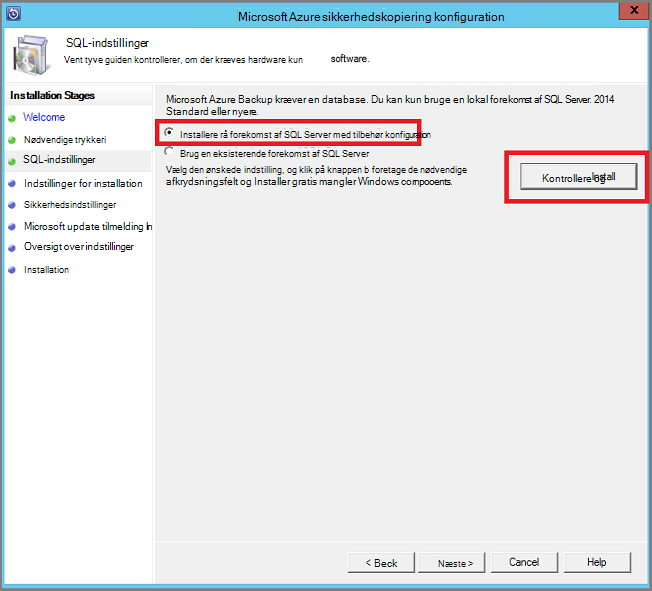

    Hvis der opstår fejl med en anbefaling at genstarte computeren, gøre det og klikke på **Kontrol igen**.

    > [AZURE.NOTE] Azure Backup Server fungerer ikke med en ekstern SQL Server-forekomst. Den forekomst, der bruges af Azure Backup Server skal være lokale.

4. Angive en placering for installationen af Microsoft Azure Backup serverfiler, og klik på **Næste**.

    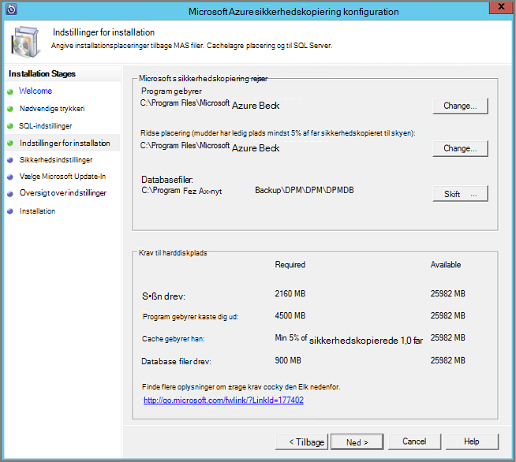

    Placeringen af arbejdsområ er et krav for tilbage op til Azure. Sikre, at den arbejdsområ placering er mindst 5% af de data, der er afsat til at blive sikkerhedskopieret til skyen. Disken beskyttelse ved skal separate diske konfigureres, når installationen er fuldført. Få flere oplysninger om lagerplads grupper, skal du se [konfigurere lagerplads grupper og lagerplads på disken](https://technet.microsoft.com/library/hh758075.aspx).

5. Giver en stærk adgangskode for begrænset lokale brugerkonti, og klik på **Næste**.

    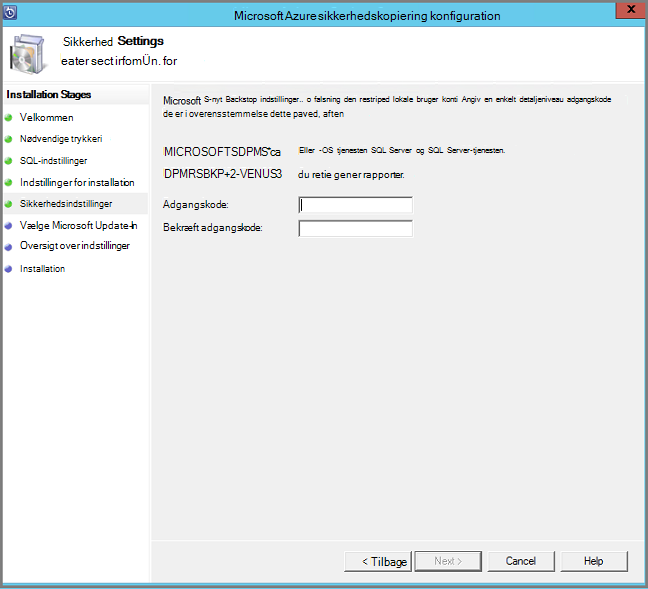

6. Vælg, om du vil bruge *Microsoft Update* til at søge efter opdateringer, og klik på **Næste**.

    >[AZURE.NOTE] Vi anbefaler, at du har Windows Update omdirigere til Microsoft Update, som indeholder sikkerhedsopdateringer og vigtige opdateringer til Windows og andre produkter som Microsoft Azure Backup Server.

    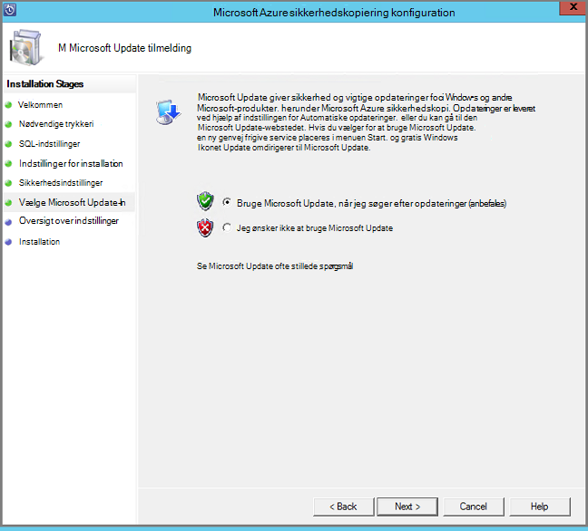

7. Gennemse *Oversigt over indstillinger* , og klik på **Installer**.

    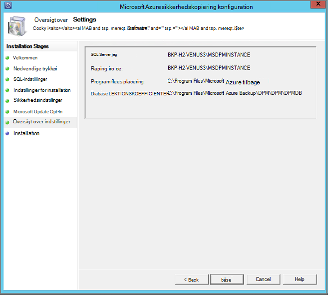

8. Installationen sker der i faser. I den første fase er på Microsoft Azure betroet Services installeret på serveren. Guiden kontrollerer også for forbindelse til internettet. Hvis der findes en forbindelse til internettet kan du fortsætte med installationen, hvis ikke, skal du angive proxy detaljer for at oprette forbindelse til internettet.

    Næste trin er at konfigurere Microsoft Azure betroet Services bruger. Som en del af konfigurationen, er du nødt til at angive, at du er samling legitimationsoplysningerne til at registrere maskinen til den ekstra samling af legitimationsoplysninger. Du kan også angive en adgangskode for at kryptere/dekryptere afsendte mellem Azure og dine lokale data. Du kan automatisk oprette en adgangskode eller angive dine egne mindste 16 tegn adgangskoden. Fortsæt med guiden, indtil agenten er blevet konfigureret.

    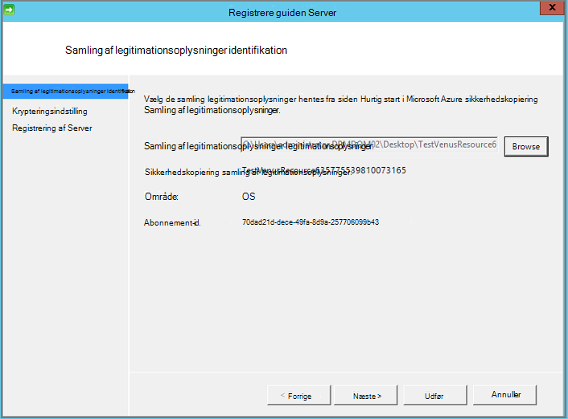

9. Når registrering af Microsoft Azure Backup server er fuldført, fortsætter overordnede konfigurationsguiden til installation og konfiguration af SQL Server og komponenter til Azure sikkerhedskopi Server. Når installationen af SQL Server-komponenten er fuldført, er Azure Backup Server-komponenterne installeret.

    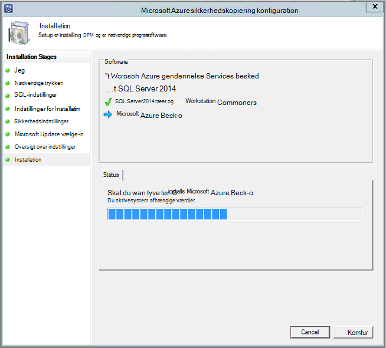


Når installationen er fuldført, der produktets ikoner på skrivebordet er blevet oprettet samt. Dobbeltklikke på ikonet for at starte produktet.

### <a name="add-backup-storage"></a>Tilføje ekstra lagerplads

Den første sikkerhedskopi er gemt på lagerplads, der er knyttet til Azure sikkerhedskopiering servercomputeren. Du kan finde flere oplysninger om tilføjelse af diske, se [konfigurere lagerplads grupper og lagerplads på disken](https://technet.microsoft.com/library/hh758075.aspx).

> [AZURE.NOTE] Du skal tilføje ekstra lagerplads, selvom du planlægger at sende data til Azure. I den aktuelle arkitektur i Azure Server til sikkerhedskopiering indeholder Azure sikkerhedskopiering samling *anden* kopien af dataene, mens det lokale lager indeholder sikkerhedskopien første (og obligatorisk).  

## <a name="4-network-connectivity"></a>4. netværksforbindelsen


Azure Backup-Server kræver forbindelse til tjenesten Azure sikkerhedskopi til produktet, så de fungerer korrekt. Hvis du vil validere, om computeren har forbindelse til Azure, skal du bruge den ```Get-DPMCloudConnection``` cmdlet accepterer i Azure sikkerhedskopi Server PowerShell console. Hvis output fra cmdlet accepterer er sand, og derefter connectivity findes, ellers der er ingen forbindelse.

Azure abonnementet skal være i en sund tilstand på samme tid. Log på [abonnement portal]( https://account.windowsazure.com/Subscriptions), til at finde ud af tilstanden for dit abonnement og til at styre den.

Når du kender tilstanden af Azure forbindelsen og Azure-abonnement, kan du bruge tabellen nedenfor til at finde ud af funktionen Sikkerhedskopiering/gendannelse tilbydes påvirkningen.

| Connectivity tilstand | Azure-abonnement | Sikkerhedskopi til Azure| Sikkerhedskopi til disk | Gendanne fra Azure | Gendanne fra disk |
| -------- | ------- | --------------------- | ------------------- | --------------------------- | ----------------------- |
| Forbindelse | Aktive | Tilladt | Tilladt | Tilladt | Tilladt |
| Forbindelse | Udløbet | Ikke længere | Ikke længere | Tilladt | Tilladt |
| Forbindelse | Fjernet | Ikke længere | Ikke længere | Holdt op med at og Azure gendannelse punkter slettet | Ikke længere |
| Tabt connectivity > 15 dage | Aktive | Ikke længere | Ikke længere | Tilladt | Tilladt |
| Tabt connectivity > 15 dage | Udløbet | Ikke længere | Ikke længere | Tilladt | Tilladt |
| Tabt connectivity > 15 dage | Fjernet | Ikke længere | Ikke længere |  Holdt op med at og Azure gendannelse punkter slettet | Ikke længere |

### <a name="recovering-from-loss-of-connectivity"></a>Gendanne fra tab af forbindelse
Hvis du har en firewall eller en proxy, der forhindrer adgang til Azure, skal du whitelist følgende domæne adresserne i firewall/proxy profilen:

- www.msftncsi.com
- \*. Microsoft.com
- \*. WindowsAzure.com
- \*. microsoftonline.com
- \*. windows.net

Når forbindelsen til Azure er blevet gendannet til Azure sikkerhedskopi servercomputeren, bestemmes de handlinger, der kan udføres af tilstanden Azure-abonnement. Ovenstående tabel indeholder oplysninger om de handlinger, der er tilladt, når maskinen er "oprettet".

### <a name="handling-subscription-states"></a>Håndtering af abonnement stater

Det er muligt at tage et Azure-abonnement fra en *udløbne* eller *ikke klargjort* tilstand til den *aktive* tilstand. Men det har nogle konsekvenserne på produkt funktionsmåde mens tilstanden ikke er *aktivt*:

- Et abonnement *ikke klargjort* mister funktionalitet for perioden, som det er fjernet. Om at slå *aktive*, er produktet funktionaliteten i Sikkerhedskopiering/gendannelse revived. De sikkerhedskopierede data på den lokale disk kan også hentes, hvis blev holdt med en tilstrækkeligt lang opbevaringsperiode. Sikkerhedskopidataene i Azure er dog uigenkaldeligt tabt, når abonnementet indsætter tilstanden *ikke klargjort* .
- Et *udløbne* abonnement mister kun funktionalitet til, indtil den har foretaget *aktive* igen. Kan ikke køre en hvilken som helst sikkerhedskopier, der er planlagt for perioden, at abonnementet er *udløbet* .


## <a name="troubleshooting"></a>Fejlfinding i forbindelse med

Hvis serveren til Microsoft Azure sikkerhedskopiering mislykkes med fejl under installation fase (eller sikkerhedskopiering eller Gendan), kan du referere til denne [fejl koder dokument](https://support.microsoft.com/kb/3041338) kan finde flere oplysninger.
Du kan også se til [Azure sikkerhedskopi relateret ofte stillede spørgsmål](backup-azure-backup-faq.md)


## <a name="next-steps"></a>Næste trin

Du kan få detaljerede oplysninger om at [forberede dit miljø til DPM](https://technet.microsoft.com/library/hh758176.aspx) på Microsoft TechNet-webstedet. Det indeholder også oplysninger om understøttede konfigurationer som Azure Backup Server kan installeres og bruges.

Du kan bruge følgende artikler til at få en bedre forståelse af arbejdsbelastningen beskyttelse ved hjælp af Microsoft Azure Backup server.

- [Sikkerhedskopiering af SQL Server](backup-azure-backup-sql.md)
- [Sikkerhedskopiering af SharePoint server](backup-azure-backup-sharepoint.md)
- [Alternativ server sikkerhedskopi](backup-azure-alternate-dpm-server.md)
