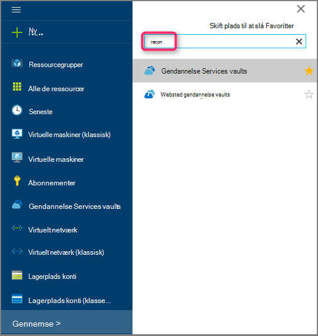
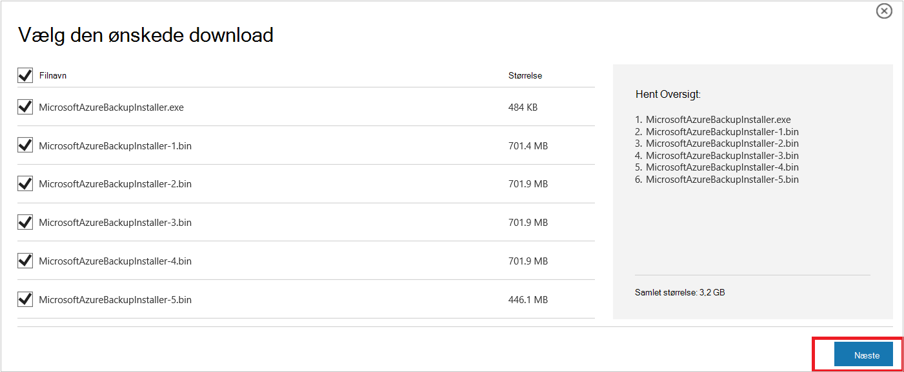
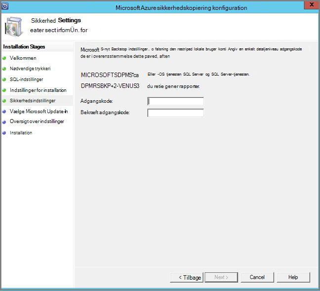
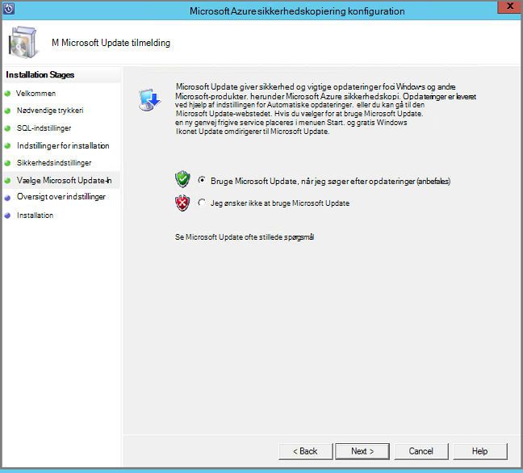
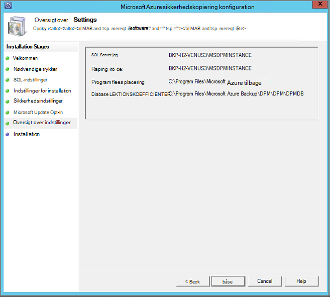
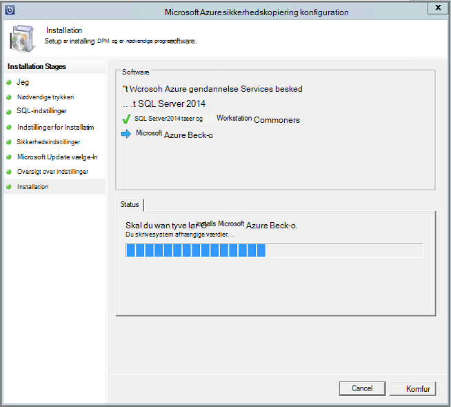

<properties
  pageTitle="Forberede dit miljø til at sikkerhedskopiere arbejdsmængder ved hjælp af Azure Backup Server | Microsoft Azure"
  description="Forberede dit miljø bruge Azure Backup Server til at beskytte eller sikkerhedskopiere arbejdsmængder."
  services="backup"
  documentationCenter=""
  authors="PVRK"
  manager="shivamg"
  editor=""
  keywords="Azure sikkerhedskopiering serveren. beskytte arbejdsbelastninger; sikkerhedskopiere arbejdsmængder"/>

<tags
  ms.service="backup"
  ms.workload="storage-backup-recovery"
  ms.tgt_pltfrm="na"
  ms.devlang="na"
  ms.topic="article"
  ms.date="09/27/2016"
  ms.author="jimpark;trinadhk;pullabhk;markgal"/>

# <a name="preparing-to-back-up-workloads-using-azure-backup-server"></a>Forberedelse til at sikkerhedskopiere arbejdsmængder ved hjælp af Azure Backup Server

> [AZURE.SELECTOR]
- [Server til Azure sikkerhedskopiering](backup-azure-microsoft-azure-backup.md)
- [SCDPM](backup-azure-dpm-introduction.md)
- [Azure Backup Server (klassisk)](backup-azure-microsoft-azure-backup-classic.md)
- [SCDPM (klassisk)](backup-azure-dpm-introduction-classic.md)

I denne artikel forklares, hvordan at forberede dit miljø til at sikkerhedskopiere arbejdsmængder ved hjælp af Azure Backup Server. Du kan beskytte arbejdsbelastninger som Hyper-V FOS, Microsoft SQL Server, SharePoint Server, Microsoft Exchange og Windows-klienter fra en enkelt konsol med Azure sikkerhedskopi-serveren. Du kan også beskytte oplysninger som en server (IaaS) arbejdsmængder som FOS i Azure.

> [AZURE.NOTE] Azure har to installation modeller til oprettelse og arbejde med ressourcer: [ressourcestyring og klassisk](../resource-manager-deployment-model.md). I denne artikel indeholder oplysninger og procedurer for at gendanne FOS installeres ved hjælp af Ressourcestyring modellen.

Server til Azure sikkerhedskopiering arver meget af funktionen arbejdsbelastningen sikkerhedskopiering fra Data Protection Manager (DPM). I denne artikel indeholder links til DPM dokumentation til at forklare nogle af de delte funktioner. Azure Backup Server deler via meget af de samme funktioner som DPM. Azure Backup-Server ikke sikkerhedskopiere på båndet, og ikke nødvendigvis kan den integreres med System Center.

## <a name="1-choose-an-installation-platform"></a>1. Klik på en installationsplatform

Det første trin til, hvordan du kommer Azure Backup Server og kører er at konfigurere en Windows-Server. Din server kan være i Azure eller i det lokale miljø.

### <a name="using-a-server-in-azure"></a>Brug af en server i Azure

Når du vælger en server til at køre Azure Backup Server, kan det anbefales, at du starter med et galleri med billede af Windows Server 2012 R2 Datacenter. I artiklen, [oprette din første virtuelle maskine til Windows Azure-portalen](..\virtual-machines\virtual-machines-windows-hero-tutorial.md), indeholder et selvstudium for at komme i gang med de anbefalede virtuelt i Azure, selvom du aldrig har brugt Azure før. Anbefalede minimumskravene til server virtual machine (VM) skal være: A2 Standard med 2 støbekerner og 3,5 GB RAM.

Beskytte arbejdsmængder med Azure Backup Server har mange små forskelle. I artiklen, [Installere DPM som en Azure virtuelt](https://technet.microsoft.com/library/jj852163.aspx), hjælper med at forklare disse små forskelle. Læs denne artikel helt før du anvender maskinen.

### <a name="using-an-on-premises-server"></a>Brug af en lokal server

Hvis du ikke vil køre base serveren i Azure, kan du køre serveren på et Hyper-V VM, en VMware VM eller en fysisk vært. Anbefalede minimumskravene for serverhardwaren, er 2 kerner og 4 GB RAM. Den følgende tabel vises de understøttede operativsystemer.

| Operativsystem        | Platform           | SKU  |
| :------------- |-------------| :-----|
|Windows Server 2012 R2 og seneste SPs| 64-bit| Som standard, Datacenter, Foundation|
|Windows Server 2012 og seneste SPs|    64-bit| Datacenter, Foundation, som er Standard|
|Windows Storage Server 2012 R2 og seneste SPs  |64-bit|    Som standard, arbejdsgruppe|
|Windows Storage Server 2012 og seneste SPs |64-bit |Som standard, arbejdsgruppe|


Du kan deduplicate DPM opbevaring ved hjælp af Windows Server Deduplication. Lær mere om, hvordan [DPM og deduplication](https://technet.microsoft.com/library/dn891438.aspx) fungerer sammen når implementeret i Hyper-V FOS.

> [AZURE.NOTE]  Du kan ikke installere Azure Backup Server på en computer, der kører som et domænenavn fra domænecontrolleren.

Du skal deltage i Azure Backup Server til et domæne. Hvis du vil flytte serveren til et andet domæne, kan det anbefales, at du deltager i serveren til det nye domæne før du installerer Azure Backup Server. Flytte en eksisterende Azure Backup Server-computer til et nyt domæne, når installationen er *ikke understøttet*.

## <a name="2-recovery-services-vault"></a>2. gendannelse Services samling

Uanset om du sende sikkerhedskopidata til Azure eller gemme den lokalt, skal være forbundet med Azure softwaren. Hvis du vil have mere specifikke, Azure sikkerhedskopi servercomputeren skal være registreret hos en gendannelse services samling af legitimationsoplysninger.

Sådan oprettes en gendannelse services samling af legitimationsoplysninger:

1. Log på [Azure-portalen](https://portal.azure.com/).

2. Klik på **Gennemse** , og skriv **Gendannelsestjenester**på listen over ressourcer, i menuen Hub. Når du begynder at skrive, på listen filtrerer baseret på dit input. Klik på **tjenester til genoprettelse samling**.

     <br/>

    På listen over tjenester til genoprettelse vaults vises.

3. Klik på **Tilføj**i menuen **gendannelse Services vaults** .

    

    Gendannelse Services samling blade åbnes, beder dig om at angive et **navn**, **abonnement**, **ressourcegruppe**og **placering**.

    

4. Angiv et fuldt navn til at identificere samling af legitimationsoplysninger for **navn**. Navnet skal være entydige for Azure abonnementet. Skriv et navn, der indeholder mellem 2 og 50 tegn. Det skal starte med et bogstav og kan indeholde kun bogstaver, tal og bindestreger.

5. Klik på **abonnement** for at se den tilgængelige liste over abonnementer. Hvis du ikke er sikker på, hvilket abonnement, der skal bruges, brug standarden (eller forslag) abonnement. Der vil være flere valgmuligheder, kun, hvis din virksomhedskonto er knyttet til flere Azure abonnementer.

6. **Ressourcegruppe** for at se den tilgængelige liste over grupper, eller klik på **Ny** for at oprette en ny ressourcegruppe. Se [Oversigt over Azure ressourcestyring](../azure-resource-manager/resource-group-overview.md) detaljerede oplysninger om grupper

7. Klik på **placering** for at vælge det geografiske område for samling af legitimationsoplysninger.

8. Klik på **Opret**. Det kan tage et øjeblik, før den gendannelse Services samling af legitimationsoplysninger skal oprettes. Overvåge status meddelelserne i området øverst til højre på portalen.
Når din samling af legitimationsoplysninger er oprettet, åbnes den i portalen.

### <a name="set-storage-replication"></a>Angive lagerplads gentagelse

Replikering datalager kan du vælge mellem geografisk overflødige lager og lokalt overflødige lagerplads. Som standard har din samling geografisk overflødige lagerplads. Lad indstillingen være angivet til geografisk overflødige lagerplads, hvis dette er den primære sikkerhedskopi. Vælg lokalt overflødige lagerplads, hvis du ønsker en billigere indstilling, der ikke er helt som robust. Få mere at vide om [geografisk overflødige](../storage/storage-redundancy.md#geo-redundant-storage) og [lokalt overflødige](../storage/storage-redundancy.md#locally-redundant-storage) indstillinger for lagring i [Azure-lager gentagelse oversigt](../storage/storage-redundancy.md).

Sådan redigerer du indstillingen lagerplads gentagelse:

1. Vælg din samling af legitimationsoplysninger til at åbne dashboardet samling af legitimationsoplysninger og bladet indstillinger. Hvis bladet **Indstillinger** ikke åbnes, skal du klikke på **alle indstillinger** i dashboardet samling af legitimationsoplysninger.

2. Bladet **Indstillinger** , klik på **Sikkerhedskopiér infrastruktur** > **Sikkerhedskopi konfiguration** til at åbne bladet **Sikkerhedskopi konfiguration** . Vælg gentagelse datalager til din samling på bladet **Sikkerhedskopi konfiguration** .

    

    Når du har valgt indstillingen lagerplads for dit samling, er du klar til at knytte VM til samling af legitimationsoplysninger. For at starte tilknytningen, skal du finde og registrere Azure virtuelle computere.

## <a name="3-software-package"></a>3. programpakke

### <a name="downloading-the-software-package"></a>Hente programpakke
1. Log på [Azure-portalen](https://portal.azure.com/).

2. Hvis du allerede har en gendannelse Services samling åben, kan du gå videre til trin 3. Hvis du ikke har en gendannelse Services samling, der er åben, men er i portalen Azure, i menuen Hub, klik på **Gennemse**.

    - Skriv **Gendannelsestjenester**på listen over ressourcer.
    - Når du begynder at skrive, på listen filtrerer baseret på dit input. Når du ser **gendannelse Services vaults**, kan du klikke på den.

    

    På listen over tjenester til genoprettelse vaults vises.

    - På listen over tjenester til genoprettelse vaults, Vælg en samling af legitimationsoplysninger.

    Det valgte samling dashboard åbnes.

    

3. Indstillinger for blade åbnes som standard. Hvis den er lukket, klikke på **Indstillinger** for at åbne bladet indstillinger.

    

4. Klik på **Sikkerhedskopiering** i **Introduktion** til at åbne guiden Introduktion.

    

5. På skærmbilledet Introduktion, der åbnes, bliver sikkerhedskopi mål skærmen automatisk markeret.
    

    Vælg *lokalt* til *, kører arbejdsbelastningen*i sektionen **sikkerhedskopi mål** .

    

6. Vælg de arbejdsbelastninger, som du vil beskytte ved hjælp af Azure Backup Server i *hvilke arbejdsbelastninger, som du vil beskytte* , og klik på **OK**.

    > [AZURE.NOTE] Hvis du planlægger at beskytte filer og mapper, derefter anbefaler vi bruge Azure Backup agent. Hvis du planlægger at beskytte flere arbejdsbelastninger end filer og mapper i fremtidige Hvis du planlægger at udvide beskyttelse behov Vælg eller alle disse arbejdsbelastninger.

    Dette ændrer guiden Introduktion for at forberede infrastruktur til at beskytte arbejdsbelastninger fra det lokale til Azure til.

    

7. Klik på **Hent** linkene til installere Azure Backup Server og Download samling legitimationsoplysninger i bladet **Forbered infrastruktur** , der åbnes. Du kan bruge samling legitimationsoplysningerne under registrering af Azure Backup Server til gendannelse services samling. Hyperlinkene fører til Download Center, hvor programpakke kan hentes.

    

8. Vælg alle filerne, og klik på **Næste**. Hente alle de filer, der kommer fra Microsoft Azure Backup overførselssiden, og Placer alle filerne i den samme mappe.

    

    Da overførselsstørrelse for alle filerne er sammen > 3G, på en 10Mbps link til overførsel det kan tage op til 60 minutter, før overførslen til at fuldføre.


### <a name="extracting-the-software-package"></a>Hente programpakke

Når du har hentet alle filerne, skal du klikke på **MicrosoftAzureBackupInstaller.exe**. Dette starter **Konfigurationsguiden til Microsoft Azure sikkerhedskopi** at udtrække installationsfiler til en placering, der er angivet af dig. Forsæt med guiden, og klik på knappen **udtrække** for at starte udtrækning af processen.

> [AZURE.WARNING] Mindst 4GB ledig plads er nødvendig for at udtrække filerne til installation.


Markér afkrydsningsfeltet for at åbne den frisk udpakkede *setup.exe* for at starte installationen af Microsoft Azure Backup Server, og klik på knappen **Udfør** , når udtrækning af behandle fuldført.

### <a name="installing-the-software-package"></a>Installation af softwarepakken

1. Klik på **Microsoft Azure Backup** for at starte konfigurationsguiden.

    

2. Klik på knappen **Næste** på velkomstsiden. Du føres til sektionen *Nødvendige kontrollerer* . På dette skærmbillede skal du klikke på knappen **kontrollere** til at bestemme, hvis hardware- og softwarekrav til Azure Backup Server er opfyldt. Hvis alle forudsætningerne er gået opfyldes korrekt, vises der en meddelelse, der angiver, at computeren opfylder kravene. Klik på knappen **Næste** .

    

3. Microsoft Azure Backup Server kræver SQL Server Standard, og installationspakken Azure Backup Server leveres sammen med de relevante SQL Server-binære det er nødvendigt. Når du starter med en ny Azure Backup Server-installation, skal du vælge indstillingen **Installer ny forekomst af SQL Server med denne konfiguration** og klikke på knappen **Markér og installere** . Når forudsætningerne er installeret korrekt, skal du klikke på **Næste**.

    

    Hvis der opstår fejl med en anbefaling at genstarte computeren, gøre det og klikke på **Kontrol igen**.

    > [AZURE.NOTE] Azure Backup Server fungerer ikke med en ekstern SQL Server-forekomst. Den forekomst, der bruges af Azure Backup Server skal være lokale.

4. Angive en placering for installationen af Microsoft Azure Backup serverfiler, og klik på **Næste**.

    

    Placeringen af arbejdsområ er et krav for tilbage op til Azure. Sikre, at den arbejdsområ placering er mindst 5% af de data, der er afsat til at blive sikkerhedskopieret til skyen. Disken beskyttelse ved skal separate diske konfigureres, når installationen er fuldført. Få flere oplysninger om lagerplads grupper, skal du se [konfigurere lagerplads grupper og lagerplads på disken](https://technet.microsoft.com/library/hh758075.aspx).

5. Giver en stærk adgangskode for begrænset lokale brugerkonti, og klik på **Næste**.

    

6. Vælg, om du vil bruge *Microsoft Update* til at søge efter opdateringer, og klik på **Næste**.

    >[AZURE.NOTE] Vi anbefaler, at du har Windows Update omdirigere til Microsoft Update, som indeholder sikkerhedsopdateringer og vigtige opdateringer til Windows og andre produkter som Microsoft Azure Backup Server.

    

7. Gennemse *Oversigt over indstillinger* , og klik på **Installer**.

    

8. Installationen sker der i faser. I den første fase er på Microsoft Azure betroet Services installeret på serveren. Guiden kontrollerer også for forbindelse til internettet. Hvis der findes en forbindelse til internettet kan du fortsætte med installationen, hvis ikke, skal du angive proxy detaljer for at oprette forbindelse til internettet.

    Næste trin er at konfigurere Microsoft Azure betroet Services bruger. Som en del af konfigurationen, er du nødt til at angive dine samling legitimationsoplysninger for at registrere maskinen til gendannelse services samling. Du kan også angive en adgangskode for at kryptere/dekryptere afsendte mellem Azure og dine lokale data. Du kan automatisk oprette en adgangskode eller angive dine egne mindste 16 tegn adgangskoden. Fortsæt med guiden, indtil agenten er blevet konfigureret.

    

9. Når registrering af Microsoft Azure Backup server er fuldført, fortsætter overordnede konfigurationsguiden til installation og konfiguration af SQL Server og komponenter til Azure sikkerhedskopi Server. Når installationen af SQL Server-komponenten er fuldført, er Azure Backup Server-komponenterne installeret.

    


Når installationen er fuldført, der produktets ikoner på skrivebordet er blevet oprettet samt. Dobbeltklikke på ikonet for at starte produktet.

### <a name="add-backup-storage"></a>Tilføje ekstra lagerplads

Den første sikkerhedskopi er gemt på lagerplads, der er knyttet til Azure sikkerhedskopiering servercomputeren. Du kan finde flere oplysninger om tilføjelse af diske, se [konfigurere lagerplads grupper og lagerplads på disken](https://technet.microsoft.com/library/hh758075.aspx).

> [AZURE.NOTE] Du skal tilføje ekstra lagerplads, selvom du planlægger at sende data til Azure. I den aktuelle arkitektur i Azure Server til sikkerhedskopiering indeholder Azure sikkerhedskopiering samling *anden* kopien af dataene, mens det lokale lager indeholder sikkerhedskopien første (og obligatorisk).

## <a name="4-network-connectivity"></a>4. netværksforbindelsen

Azure Backup-Server kræver forbindelse til tjenesten Azure sikkerhedskopi til produktet, så de fungerer korrekt. Hvis du vil validere, om computeren har forbindelse til Azure, skal du bruge den ```Get-DPMCloudConnection``` cmdlet i Azure sikkerhedskopi Server PowerShell console. Hvis output fra cmdlet er sand, og derefter connectivity findes, ellers der er ingen forbindelse.

Azure abonnementet skal være i en sund tilstand på samme tid. Log på [abonnement portal]( https://account.windowsazure.com/Subscriptions), til at finde ud af tilstanden for dit abonnement og til at styre den.

Når du kender tilstanden af Azure forbindelsen og Azure-abonnement, kan du bruge tabellen nedenfor til at finde ud af funktionen Sikkerhedskopiering/gendannelse tilbydes påvirkningen.

| Connectivity tilstand | Azure-abonnement | Sikkerhedskopi til Azure| Sikkerhedskopi til disk | Gendanne fra Azure | Gendanne fra disk |
| -------- | ------- | --------------------- | ------------------- | --------------------------- | ----------------------- |
| Forbindelse | Aktive | Tilladt | Tilladt | Tilladt | Tilladt |
| Forbindelse | Udløbet | Ikke længere | Ikke længere | Tilladt | Tilladt |
| Forbindelse | Fjernet | Ikke længere | Ikke længere | Holdt op med at og Azure gendannelse punkter slettet | Ikke længere |
| Tabt connectivity > 15 dage | Aktive | Ikke længere | Ikke længere | Tilladt | Tilladt |
| Tabt connectivity > 15 dage | Udløbet | Ikke længere | Ikke længere | Tilladt | Tilladt |
| Tabt connectivity > 15 dage | Fjernet | Ikke længere | Ikke længere |  Holdt op med at og Azure gendannelse punkter slettet | Ikke længere |

### <a name="recovering-from-loss-of-connectivity"></a>Gendanne fra tab af forbindelse
Hvis du har en firewall eller en proxy, der forhindrer adgang til Azure, skal du whitelist følgende domæne adresserne i firewall/proxy profilen:

- www.msftncsi.com
- \*. Microsoft.com
- \*. WindowsAzure.com
- \*. microsoftonline.com
- \*. windows.net

Når forbindelsen til Azure er blevet gendannet til Azure sikkerhedskopi servercomputeren, bestemmes de handlinger, der kan udføres af tilstanden Azure-abonnement. Ovenstående tabel indeholder oplysninger om de handlinger, der er tilladt, når maskinen er "oprettet".

### <a name="handling-subscription-states"></a>Håndtering af abonnement stater

Det er muligt at tage et Azure-abonnement fra en *udløbne* eller *ikke klargjort* tilstand til den *aktive* tilstand. Men det har nogle konsekvenserne på produkt funktionsmåde mens tilstanden ikke er *aktivt*:

- Et abonnement *ikke klargjort* mister funktionalitet for perioden, som det er fjernet. Om at slå *aktive*, er produktet funktionaliteten i Sikkerhedskopiering/gendannelse revived. De sikkerhedskopierede data på den lokale disk kan også hentes, hvis blev holdt med en tilstrækkeligt lang opbevaringsperiode. Sikkerhedskopidataene i Azure er dog uigenkaldeligt tabt, når abonnementet indsætter tilstanden *ikke klargjort* .
- Et *udløbne* abonnement mister kun funktionalitet til, indtil den har foretaget *aktive* igen. Kan ikke køre en hvilken som helst sikkerhedskopier, der er planlagt for perioden, at abonnementet er *udløbet* .


## <a name="troubleshooting"></a>Fejlfinding i forbindelse med

Hvis serveren til Microsoft Azure sikkerhedskopiering mislykkes med fejl under installation fase (eller sikkerhedskopiering eller Gendan), kan du referere til denne [fejl koder dokument](https://support.microsoft.com/kb/3041338) kan finde flere oplysninger.
Du kan også se til [Azure sikkerhedskopi relateret ofte stillede spørgsmål](backup-azure-backup-faq.md)


## <a name="next-steps"></a>Næste trin

Du kan få detaljerede oplysninger om at [forberede dit miljø til DPM](https://technet.microsoft.com/library/hh758176.aspx) på Microsoft TechNet-webstedet. Det indeholder også oplysninger om understøttede konfigurationer som Azure Backup Server kan installeres og bruges.

Du kan bruge følgende artikler til at få en bedre forståelse af arbejdsbelastningen beskyttelse ved hjælp af Microsoft Azure Backup server.

- [Sikkerhedskopiering af SQL Server](backup-azure-backup-sql.md)
- [Sikkerhedskopiering af SharePoint server](backup-azure-backup-sharepoint.md)
- [Alternativ server sikkerhedskopi](backup-azure-alternate-dpm-server.md)
