<properties
   pageTitle="Overvåge ressourcestyring installeret virtuel machine-sikkerhedskopiering | Microsoft Azure"
   description="Overvåge begivenheder og beskeder fra ressourcestyring installeret virtuelt sikkerhedskopier. Send mail baseret på beskeder."
   services="backup"
   documentationCenter="dev-center-name"
   authors="markgalioto"
   manager="cfreeman"
   editor=""/>

<tags
ms.service="backup"
ms.workload="storage-backup-recovery"
ms.tgt_pltfrm="na"
ms.devlang="na"
ms.topic="article"
ms.date="08/25/2016"
ms.author="trinadhk; giridham;"/>

# <a name="monitor-alerts-for-azure-virtual-machine-backups"></a>Overvåge beskeder for Azure virtuel machine-sikkerhedskopiering

Beskeder er svar fra den tjeneste, grænseværdi for en begivenhed er opfyldt eller hubber er overskredet. Viden om hvornår problemer start kan være meget vigtigt for at holde styr på business omkostninger. Beskeder typisk vises ikke på en tidsplan, og så det er praktisk at vide så tidligt som muligt efter beskeder. F.eks, når en sikkerhedskopi eller gendanne jobbet mislykkes, opstår der en besked i fem minutter til fejlen. I dashboard samling viser feltet sikkerhedskopi beskeder kritisk og advarselsniveau begivenheder. Du kan få vist alle begivenheder i indstillingerne for sikkerhedskopiering af beskeder. Men hvad skal du gøre, hvis der opstår en besked, når du arbejder på et andet problem? Hvis du ikke kender når påmindelsen sker, det kan være en mindre gener for brugerne, eller den kan få adgang til data. Konfigurere tjenesten til at sende påmindelser via mail for at sikre, at de korrekte folk har kendskab til en besked –, når det opstår. Du kan finde oplysninger om oprettelse af besked via mail, [Konfigurer beskeder](backup-azure-monitor-vms.md#configure-notifications).

## <a name="how-do-i-find-information-about-the-alerts"></a>Hvordan finder jeg oplysninger om de vigtige beskeder?

For at få vist oplysninger om begivenheden, der udløste en påmindelse, skal du åbne bladet sikkerhedskopi beskeder. Der er to måder at åbne bladet sikkerhedskopi beskeder: enten fra sikkerhedskopi beskeder flisen i dashboardet samling eller fra bladet beskeder og begivenheder.

Sådan åbnes bladet sikkerhedskopi beskeder fra sikkerhedskopi beskeder felt:

- Klik på feltet **Sikkerhedskopiering af beskeder** på dashboardet til samling **kritisk** eller **Advarsel** for at få vist de funktionsdygtige hændelser for det pågældende Alvorlighedsniveau.

    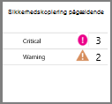


Sådan åbnes bladet sikkerhedskopi beskeder fra bladet beskeder og hændelser:

1. Klik på **Alle indstillinger**fra dashboardet samling af legitimationsoplysninger. 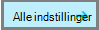

2. Klik på bladet **Indstillinger for** **beskeder og begivenheder**. 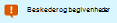

3. Klik på **Sikkerhedskopiér beskeder**på bladet **beskeder og begivenheder** . 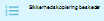

    Bladet **Sikkerhedskopi beskeder** åbnes og viser de filtrerede påmindelser.

    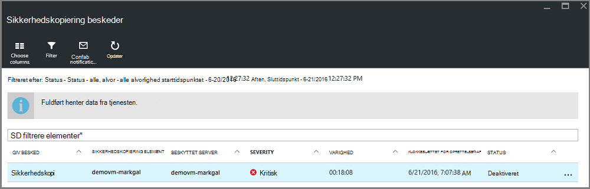

4. Klik på beskeden for at åbne dets **Detaljer** blade for at få vist detaljerede oplysninger om en bestemt meddelelse, på listen over begivenheder.

    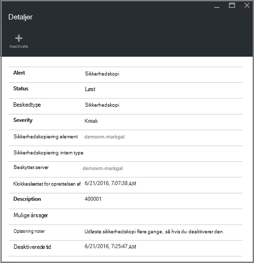

    For at tilpasse de attributter, der er vist på listen, skal du se [Yderligere begivenhed visningsattributter](backup-azure-monitor-vms.md#view-additional-event-attributes)

## <a name="configure-notifications"></a>Konfigurere beskeder

 Du kan konfigurere tjenesten til at sende mail meddelelser om de vigtige beskeder, der er indtruffet via den seneste time, eller når bestemte typer hændelser indtræffer.

Konfigurere mailbeskeder for beskeder

1. Klik på **Konfigurer beskeder** på menuen sikkerhedskopi beskeder

    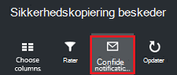

    Konfigurer beskeder blade åbnes.

    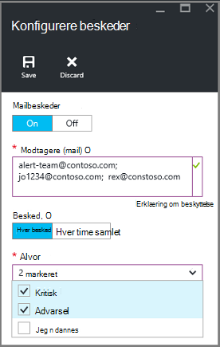

2. Klik **på**på bladet Konfigurer beskeder til e-mail-meddelelser.

    Modtagerne og alvor dialogbokse har en stjerne ud for dem, da disse oplysninger er påkrævet. Angive mindst én mailadresse, og Vælg mindst én alvor.

3. Skriv mailadresser for der modtager i meddelelser i dialogboksen **modtagere (mail)** . Bruge formatet: username@domainname.com. Adskille flere mailadresser med et semikolon (;).

4. Vælg **Per besked** til at sende meddelelse, når de angivne besked udløses, eller **Hver time samlet** til at sende en oversigt for den seneste time i området **Informer** .

5. Vælg en eller flere niveauer, du vil have besked mail i dialogboksen **alvor** .

6. Klik på **Gem**.
### <a name="what-alert-types-are-available-for-azure-iaas-vm-backup"></a>Hvilke typer af beskeder om findes til Azure IaaS VM sikkerhedskopi?
| Beskeder om niveau  | Beskeder, der er sendt |
| ------------- | ------------- |
| Kritisk | Sikkerhedskopiering mislykket nedbrud-fejl  |
| Advarsel  | Ingen |
| Informativ  | Ingen  |

### <a name="are-there-situations-where-email-isnt-sent-even-if-notifications-are-configured"></a>Er der situationer, hvor ikke sendes mail selvom meddelelser er konfigureret?

Der er situationer, hvor en besked ikke sendes, selvom meddelelserne har konfigureret korrekt. I følgende situationer e-mailen der sendes ikke meddelelser for at undgå beskeder om støj:

- Hvis meddelelser er konfigureret til hver time samlet og en besked opløftet og løst inden for en time.
- Jobbet er annulleret.
- Et sikkerhedskopieringsjob udløses og mislykkes, og en anden sikkerhedskopieringsjob er i gang.
- En planlagt sikkerhedskopiering for en ressourcestyring aktiverede VM starter, men hvor VM findes ikke længere.

## <a name="customize-your-view-of-events"></a>Tilpasse visningen af hændelser

Indstillingen **overvågningslogge** leveres med et foruddefinerede sæt af filtre og kolonner, der viser oplysninger om funktionsdygtige begivenhed. Du kan tilpasse visningen, så når bladet **hændelser, der** åbnes, skal den viser de ønskede oplysninger.

1. Gå til [samling dashboard](./backup-azure-manage-vms.md#open-a-recovery-services-vault-in-the-dashboard), og klik på **Overvågningslogge** for at åbne bladet **begivenheder** .

    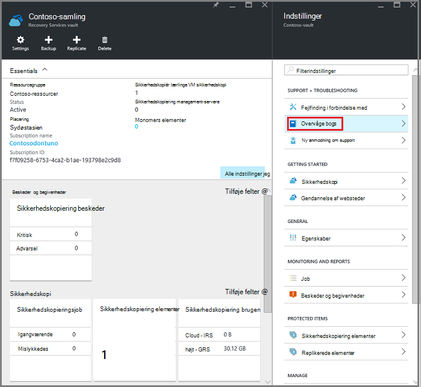

    Bladet **begivenheder** åbnes med de funktionsdygtige hændelser, der er filtreret lige efter den aktuelle samling af legitimationsoplysninger.

    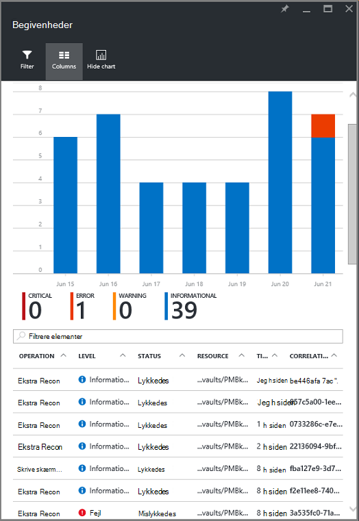

    Bladet viser listen over kritisk, fejl, advarsler og informative hændelser, der er opstået i den seneste uge. Tidsperioden er en standardværdi, der er angivet i **filteret**. Bladet **hændelser, der** viser også et liggende søjlediagram, registrering, når hændelserne, der opstod. Hvis du ikke vil se det liggende søjlediagram i menuen **begivenheder** , skal du klikke på **Skjul diagram** til at skifte fra diagrammet. Standardvisningen af hændelser, der viser oplysninger om handlingen, niveau, Status, ressource og klokkeslæt. Finde oplysninger om udsætte yderligere begivenhed attributter, den sektion, [udvide hændelsesoplysninger](backup-azure-monitor-vms.md#view-additional-event-attributes).

2. Klik på en funktionsdygtige begivenhed for at åbne dets blade for yderligere oplysninger om en funktionsdygtige begivenhed, i kolonnen **handling** . Bladet indeholder detaljerede oplysninger om hændelserne. Hændelser, der er grupperet efter deres korrelations-ID'ET og en liste over de hændelser, der er opstået i tidsperioden.

    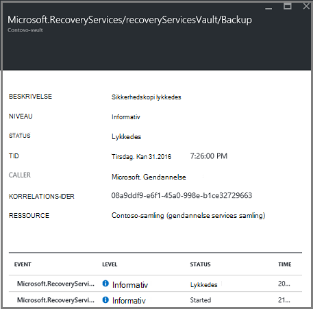

3. Klik på hændelsen for at åbne dets **Detaljer** blade for at få vist detaljerede oplysninger om en bestemt hændelse, på listen over begivenheder.

    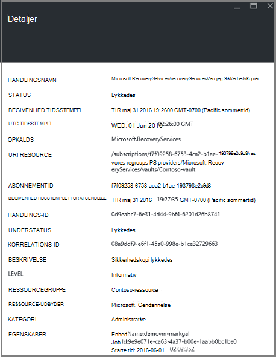

    Oplysningerne om begivenheden niveau er som beskrevet, som oplysninger, der bliver. Hvis du foretrækker at se så mange oplysninger om hver enkelt hændelse, og du gerne vil tilføje så mange detaljer til bladet **begivenheder** , kan du se afsnittet [udvide hændelsesoplysninger](backup-azure-monitor-vms.md#view-additional-event-attributes).


## <a name="customize-the-event-filter"></a>Tilpasse filteret begivenhed
Brug **Filter** til at justere eller vælge, hvilke oplysninger, der vises i en bestemt blade. Til at filtrere oplysningerne om begivenheden:

1. Gå til [samling dashboard](./backup-azure-manage-vms.md#open-a-recovery-services-vault-in-the-dashboard), og klik på **Overvågningslogge** for at åbne bladet **begivenheder** .

    

    Bladet **begivenheder** åbnes med de funktionsdygtige hændelser, der er filtreret lige efter den aktuelle samling af legitimationsoplysninger.

    

2. Klik på **Filter** for at åbne blade menuen **begivenheder** .

    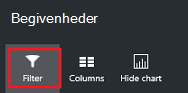

3. Juster de **niveau**, **dække, klokkeslæt**og **opkalds** filtre under bladet **Filter** . De andre filtre er ikke tilgængelige, fordi de er indstillet til at levere de aktuelle oplysninger om gendannelse Services samling.

    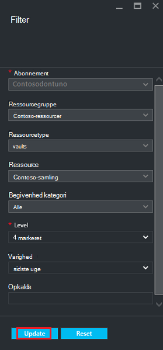

    Du kan angive **niveau** over den begivenhed: kritiske, fejl, advarsel eller information. Du kan vælge en hvilken som helst kombination af begivenhed niveauer, men du skal have mindst én valgt niveau. Slå niveauet, til eller fra. Filteret **tid dække,** kan du angive tidsrummet for registrering af begivenheder. Hvis du bruger et brugerdefineret tidsrum, kan du angive start- og sluttidspunkter.

4. Når du er klar til at forespørge loggene handlinger ved hjælp af filteret, skal du klikke på **Opdater**. Resultaterne vises i bladet **begivenheder** .

    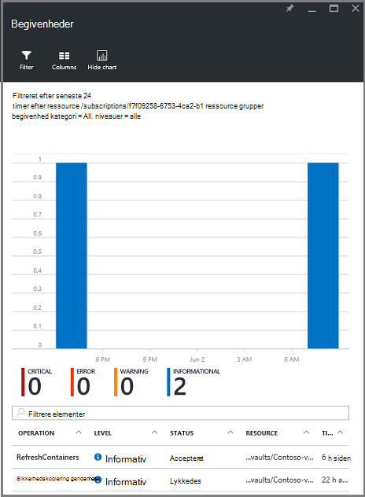


### <a name="view-additional-event-attributes"></a>Få vist yderligere begivenhed attributter
Ved hjælp af knappen **kolonner** , kan du aktivere flere begivenhed attributter, der skal vises på listen i bladet **begivenheder** . Standardlisten over hændelser, der viser oplysninger om handlingen, niveau, Status, ressource og klokkeslæt. Sådan aktiverer du yderligere attributter:

1. Klik på **spalter**under bladet **begivenheder** .

    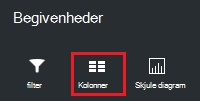

    **Vælg kolonner** blade åbnes.

    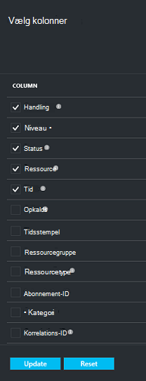

2. Klik på afkrydsningsfeltet for at vælge attributten. Afkrydsningsfeltet attribut skifter til og fra.

3. Klik på **Nulstil** for at nulstille listen over attributter i bladet **begivenheder** . Efter at tilføje eller fjerne attributter på listen, bruge **nulstille** til at få vist den nye liste over begivenhed attributter.

4. Klik på **Opdater** for at opdatere dataene i attributterne begivenhed. Den følgende tabel indeholder oplysninger om de enkelte attributter.

| Kolonnenavn      |Beskrivelse|
| -----------------|-----------|
| Handling|Navnet på handlingen|
| Niveau|Niveauet for handlingen, værdier kan være: informativ, advarsel, fejl eller kritisk|
|Status|Beskrivende tilstanden for handlingen|
|Ressource|URL-adresse, der identificerer ressourcen. også kendt som ressource-ID|
|Tid|Tid, målt fra det aktuelle klokkeslæt, hvor hændelsen indtraf|
|Opkalds|Hvem eller Hvad hedder eller udløste hændelsen; kan være systemet eller en bruger|
|Tidsstempel|Det tidspunkt, hvor hændelsen blev udløst|
|Ressourcegruppe|Den tilknyttede ressourcegruppe|
|Ressourcetype|Den interne ressourcetype, der bruges af Ressourcestyring|
|Abonnement-ID|Den tilknyttede abonnement-ID|
|Kategori|Kategori af begivenheden|
|Korrelations-ID|Almindelige-ID'ET til relaterede begivenheder|


## <a name="use-powershell-to-customize-alerts"></a>Bruge PowerShell til at tilpasse beskeder
Du kan få brugerdefinerede påmindelser for job på portalen. For at få disse job skal du angive PowerShell-baseret beskeder om regler på funktionsdygtige logfører hændelser. Brug *PowerShell version 1.3.0 eller nyere*.

Brug en kommando, som følgende script til at angive en brugerdefineret meddelelse om at give besked om for at finde sikkerhedskopien fejl:

```
PS C:\> $actionEmail = New-AzureRmAlertRuleEmail -CustomEmail contoso@microsoft.com
PS C:\> Add-AzureRmLogAlertRule -Name backupFailedAlert -Location "East US" -ResourceGroup RecoveryServices-DP2RCXUGWS3MLJF4LKPI3A3OMJ2DI4SRJK6HIJH22HFIHZVVELRQ-East-US -OperationName Microsoft.Backup/RecoveryServicesVault/Backup -Status Failed -TargetResourceId /subscriptions/86eeac34-eth9a-4de3-84db-7a27d121967e/resourceGroups/RecoveryServices-DP2RCXUGWS3MLJF4LKPI3A3OMJ2DI4SRJK6HIJH22HFIHZVVELRQ-East-US/providers/microsoft.backupbvtd2/RecoveryServicesVault/trinadhVault -Actions $actionEmail
```

**ResourceId** : Du kan åbne ResourceId overvågningslogge. ResourceId er en URL-adressen i kolonnen ressource i loggene på handlingen.

**OperationName** : OperationName er i formatet "Microsoft.RecoveryServices/recoveryServicesVault/*EventName*" hvor *EventName* kan være:<br/>
- Registrer <br/>
- Unregister <br/>
- ConfigureProtection <br/>
- Sikkerhedskopi <br/>
- Gendanne <br/>
- StopProtection <br/>
- DeleteBackupData <br/>
- CreateProtectionPolicy <br/>
- DeleteProtectionPolicy <br/>
- UpdateProtectionPolicy <br/>

**Status** : understøttede værdier er startet, lykkedes eller mislykkedes.

**ResourceGroup** : Dette er den ressourcegruppe, som ressourcen tilhører. Du kan føje kolonnen ressourcegruppe til loggene genererede. Ressourcegruppe er et af de tilgængelige typer hændelsesoplysninger.

**Navn** : navnet på reglen.

**CustomEmail** : angive den brugerdefinerede mailadresse, du vil sende en besked

**SendToServiceOwners** : denne indstilling sendes påmindelser til alle administratorer og medadministratorer af abonnementet. Det kan bruges i **Ny AzureRmAlertRuleEmail** cmdlet

### <a name="limitations-on-alerts"></a>Begrænsninger for beskeder
Begivenhed-baserede beskeder er underlagt følgende begrænsninger:

1. Påmindelser udløses på alle virtuelle maskiner i samling af legitimationsoplysninger gendannelsestjenester. Du kan ikke tilpasse beskeden for et undersæt af virtuelle maskiner i en samling af legitimationsoplysninger gendannelsestjenester.
2. Denne funktion er i Vis udskrift. [Lær mere](../monitoring-and-diagnostics/insights-powershell-samples.md#create-alert-rules)
3. Der sendes påmindelser fra "alerts-noreply@mail.windowsazure.com". I øjeblikket kan du ændre mail afsenderen.


## <a name="next-steps"></a>Næste trin

Hændelseslogfiler aktivere gode indlæg syn og overvåge support for sikkerhedskopiering handlinger. Der registreres følgende handlinger:

- Registrer
- Unregister
- Konfigurere beskyttelse
- Sikkerhedskopi (begge planlagt samt efter behov sikkerhedskopi)
- Gendanne
- Stop beskyttelse
- Slette sikkerhedskopierede data
- Tilføje politik
- Slette politik
- Opdater politik
- Annullere job

Til en bred forklaring af begivenheder artiklen handlinger og overvågningslogge på tværs af Azure tjenesterne, [Vis hændelser og overvågningslogge](../monitoring-and-diagnostics/insights-debugging-with-events.md).

Finde oplysninger om at oprette en virtuel maskine fra et gendannelsespunkt, se [Gendanne Azure FOS](backup-azure-restore-vms.md). Hvis du har brug for oplysninger om at beskytte din virtuelle maskiner, se [først se: sikkerhedskopiere FOS til en samling af legitimationsoplysninger gendannelse Services](backup-azure-vms-first-look-arm.md). Få mere at vide om administrationsopgaver for VM sikkerhedskopiering i artiklen, [administrere Azure virtuelt sikkerhedskopier](backup-azure-manage-vms.md).
