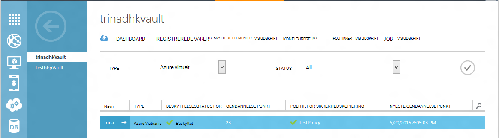
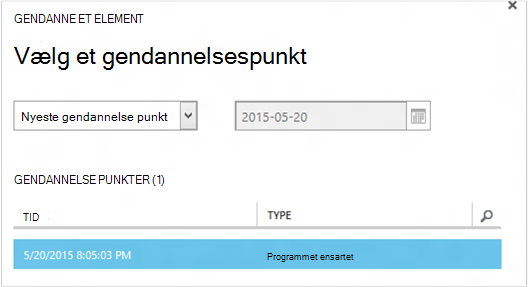
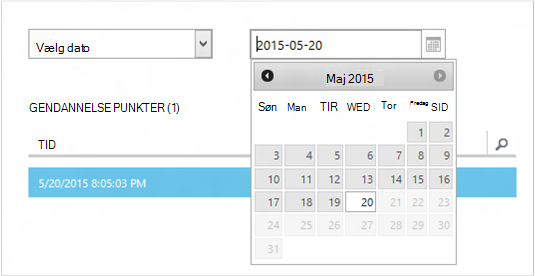
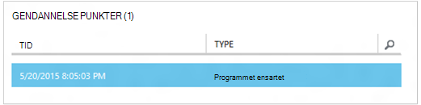
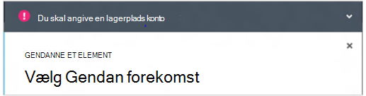
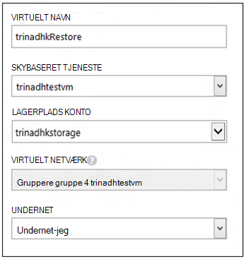
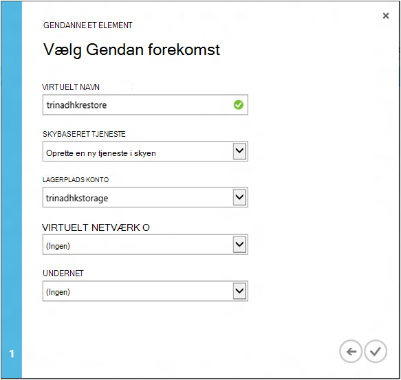
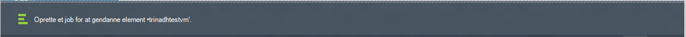
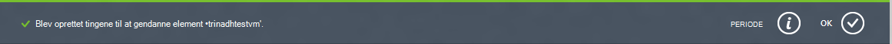
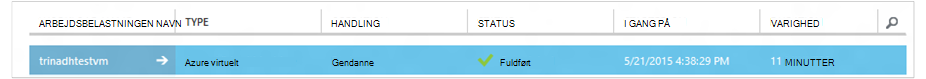

<properties
    pageTitle="Gendanne en virtuelle maskiner fra sikkerhedskopi | Microsoft Azure"
    description="Lær, hvordan du gendanner en Azure virtuelt fra et gendannelsespunkt"
    services="backup"
    documentationCenter=""
    authors="trinadhk"
    manager="shreeshd"
    editor=""
    keywords="gendanne sikkerhedskopi; Sådan gendannes; gendannelsespunkt;"/>

<tags
    ms.service="backup"
    ms.workload="storage-backup-recovery"
    ms.tgt_pltfrm="na"
    ms.devlang="na"
    ms.topic="article"
    ms.date="08/02/2016"
    ms.author="trinadhk; jimpark;"/>

# Gendanne virtuelle maskiner i Azure

> [AZURE.SELECTOR]
- [Gendanne FOS Azure-portalen](backup-azure-arm-restore-vms.md)
- [Gendanne FOS i klassisk portal](backup-azure-restore-vms.md)

Gendanne en virtuel maskine til en ny VM fra de sikkerhedskopier, der er gemt i en Azure sikkerhedskopiering samling med følgende trin.

## Gendanne arbejdsproces

### 1. Klik på et element for at gendanne

1. Gå til fanen **Beskyttet elementer** , og vælg den virtuelle maskine, du vil gendanne til en ny VM.

    

    Kolonnen **Gendannelse punkt** **Beskyttede elementer** på siden fortæller antallet af gendannelse point for et virtuelt. Kolonnen **Nyeste gendannelse punkt** fortæller dig tidspunktet for den seneste sikkerhedskopiering, et virtuelt kan gendannes.

2. Klik på **Gendan** for at åbne guiden **gendanne et element** .

    

### 2. Vælg et gendannelsespunkt

1. Du kan gendanne fra punktet nyeste gendannelse eller fra et tidligere tidspunkt på skærmbilledet **Vælg et gendannelsespunkt** . Standardindstillingen markeret, når guiden åbner er *Nyeste gendannelse punkt*.

    

2. Vælg indstillingen **Vælg dato** i rullemenuen for at vælge en tidligere punkt i gang, og vælg en dato i kalenderen ved at klikke på **kalenderikonet**. Alle datoer, der har gendannelse punkter er fyldt med en lys grå skygge i kontrolelementet og kan markeres af brugeren.

    

    Når du klikker på en dato i kalenderen, punkter at genoprettelsen tilgængelig på, dato, der skal vises i gendannelse punkter tabellen nedenfor. Kolonnen **klokkeslæt** angiver den tid, hvormed snapshot blev udført. Kolonnen **Type** viser [konsistens](https://azure.microsoft.com/documentation/articles/backup-azure-vms/#consistency-of-recovery-points) af punktet gendannelse. Tabeloverskriften viser antallet af gendannelse punkter tilgængelige på den pågældende dag i parentes.

    

3. Vælg gendannelsespunkt fra tabellen **Gendannelse punkter** , og klik på pilen Næste for at gå til det næste skærmbillede.

### 3. Angiv en destinationsplacering

1. Angiv oplysninger om hvor du vil gendanne den virtuelle maskine i skærmbilledet **Vælg Gendan forekomst** .

  - Angiv navnet på den virtuelle computer: I en given skybaseret tjeneste, virtuelt navnet skal være entydig. Vi understøtter ikke uberettiget skriver eksisterende VM. 
  - Vælg en skybaseret tjeneste til VM: Dette er obligatorisk for at oprette en VM. Du kan vælge enten bruge en eksisterende skytjeneste eller oprette en ny tjeneste i skyen.

        Whatever cloud service name is picked should be globally unique. Typically, the cloud service name gets associated with a public-facing URL in the form of [cloudservice].cloudapp.net. Azure will not allow you to create a new cloud service if the name has already been used. If you choose to create select create a new cloud service, it will be given the same name as the virtual machine – in which case the VM name picked should be unique enough to be applied to the associated cloud service.

        We only display cloud services and virtual networks that are not associated with any affinity groups in the restore instance details. [Learn More](../virtual-network/virtual-networks-migrate-to-regional-vnet.md).

2. Vælg en konto, lagring af VM: Dette er obligatorisk for at oprette VM. Du kan vælge fra eksisterende lagerplads konti i det samme område som Azure sikkerhedskopi samling. Vi understøtter ikke lagring konti, der er Zone overflødige eller af Premium lagerplads type.

    Hvis der ikke er nogen lagerplads konti med understøttet konfiguration, skal du oprette en lagerplads hensyn understøttet konfiguration før du starter gendannelsen.

    

3. Vælg et virtuelt netværk: det virtuelle netværk (VNET) til den virtuelle maskine skal være markeret på tidspunktet for oprettelse af VM. Indstillingen Gendan Brugergrænsefladen viser alle VNETs i dette abonnement, der kan bruges. Det er ikke obligatorisk at vælge en VNET af gendannede VM – du vil kunne oprette forbindelse til den gendannede virtuelle maskine via internettet, selvom VNET ikke anvendes.

    Hvis skytjenesten markeret er knyttet til et virtuelt netværk, kan du ændre det virtuelle netværk.

    

4. Vælg et undernet: I tilfælde af, at VNET har undernet, som standard det første undernet vælges. Vælg undernettet efter eget valg af indstillinger for rullemenuen. Gå til netværk lokalnummer i [portalen startsiden](https://manage.windowsazure.com/), gå til **Virtuelle netværk** og markere det virtuelle netværk og analysere ned i Konfigurer for at se oplysninger om undernet undernet få mere at vide.

    

5. Klik på ikonet **Send** i guiden for at sende oplysninger og oprette et Gendan-job.

## Registrere gendannelsen
Når du har indtastet alle oplysninger i guiden Gendannelse og sendt den forsøger Azure sikkerhedskopi at oprette et job for at registrere gendannelsen.

Hvis sagen oprettelse er gået igennem, vises der en toast meddelelse, der angiver, at jobbet er oprettet. Du kan få mere at vide ved at klikke på knappen **Vis sag** , som fører til **job** fane.

Når gendannelsen er fuldført, vil det blive markeret som fuldført i **job** fanen.

Efter gendannelse af den virtuelle maskine du muligvis installere den igen i eksisterende på den oprindelige VM og [ændre slutpunkterne](../virtual-machines/virtual-machines-windows-classic-setup-endpoints.md) til den virtuelle maskine i portalen Azure filtypenavne.

## Gendanne efter trin
Hvis du bruger en skybaseret initialisering baseret Linux fordeling som Ubuntu, af sikkerhedsmæssige årsager, adgangskode blokeres sende Gendan. Brug VMAccess lokalnummer på den gendannede VM at [nulstille adgangskoden](../virtual-machines/virtual-machines-linux-classic-reset-access.md). Vi anbefaler, at bruge SSH taster på disse salgsdistributioner for at undgå nulstilling af adgangskode indlæg Gendan. 

## Sikkerhedskopi til gendannede FOS
Hvis du har gendannet VM til samme skybaseret tjeneste med det samme navn, som oprindeligt blev sikkerhedskopieret VM, fortsætter sikkerhedskopi på VM indlæg gendannelsen. Hvis du har gendannet Vm til en anden skybaseret tjeneste eller et andet navn til gendannede VM har angivet, dette bliver behandlet som en ny VM og du skal bruge til konfiguration af sikkerhedskopi til gendannede VM.

## Gendanne en VM under Azure DataCenter nedbrud
Azure sikkerhedskopiering giver mulighed for gendannelse af sikkerhedskopieret FOS til parvis datacenteret, i tilfælde af de primære data center, hvor FOS kører oplevelser nedbrud, og du har konfigureret sikkerhedskopi samling af legitimationsoplysninger for at være geografisk overflødige. Under disse scenarier, skal du vælge en lagerplads konto, som findes i parvis datacenter, og resten af gendannelsen forbliver samme. Azure sikkerhedskopi bruger Beregn tjeneste fra parvis geografisk til at oprette den gendannede virtuelle maskine. 

## Gendanne domænecontroller FOS
Sikkerhedskopi af domæne Controller (DC) virtuelle maskiner er et understøttet scenarie med Azure sikkerhedskopiering. Men nogle skal være omhu under gendannelsen. Gendan-oplevelse er hvilket forskellig for domænecontroller FOS i en enkelt DC konfiguration kontra FOS i en konfiguration med flere DC.

### Enkelt DC
VM kan gendannes (som andre VM) fra Azure portal eller ved hjælp af PowerShell.

### Flere DCs
Når du har et multi-DC-miljø, har domænecontrollerne deres egen metode til at holde data synkroniseret. Når en ældre sikkerhedskopiering punkt er gendannet *uden de relevante foranstaltninger*, kan feltet USN rollback proces ødelægge i et multi-DC-miljø. Den korrekte måde til at gendanne sådanne VM er at starte i DSRM tilstand.

Udfordringen opstår, fordi DSRM tilstand ikke er til stede i Azure. Så for at gendanne sådanne VM, kan du bruge Azure portal. Den eneste understøttede Gendan sker diskbaserede gendannelse ved hjælp af PowerShell.

>[AZURE.WARNING] For domænecontroller FOS i et miljø med flere DC, Brug ikke portalen Azure til Gendan! Kun PowerShell baseret Gendan understøttes

Få mere at vide om [USN rollback problemet](https://technet.microsoft.com/library/dd363553) og strategier forslag til at løse problemet.

## Gendanne FOS med særlige netværkskonfigurationer
Azure sikkerhedskopi understøtter sikkerhedskopi til følge speciel netværkskonfigurationer af virtuelle maskiner.

- FOS under justering af belastning (interne og eksterne)
- FOS med flere reserveret IP'er
- FOS med flere netværkskort

Disse konfigurationer krav om følgende overvejelser i forbindelse med under gendannelse af dem.

>[AZURE.TIP] Brug PowerShell baseret Gendan flow for at genskabe speciel netværkskonfigurationen af FOS indlæg Gendan.

### Gendanne fra Brugergrænsefladen:
Under gendannelse fra Brugergrænsefladen i **altid vælge en ny tjeneste i skyen**. Vær opmærksom på, at da portal kun tager obligatorisk mister parametre under Gendan flow, FOS gendannes ved hjælp af Brugergrænsefladen på speciel netværkskonfiguration, de har. Det vil sige, bliver Gendan FOS normal FOS uden konfiguration af justering af belastning eller flere NIC eller flere IP-reserveret.

### Gendanne fra PowerShell:
PowerShell har mulighed for at gendanne lige VM diskene fra sikkerhedskopi og ikke oprette den virtuelle maskine. Dette er nyttigt, når du gendanner virtuelle maskiner, der kræver særlige netværk konfigurationer mentined ovenfor.

For at genoprette fuldt virtuelt indlæg diskene gendanne elementer, skal du følge disse trin:

1. Gendanne diskene fra sikkerhedskopien samling ved hjælp af [Azure sikkerhedskopiering PowerShell](../backup-azure-vms-classic-automation.md#restore-an-azure-vm)

2. Oprette VM config kræves til justering af belastning / flere NIC/multiplum reserveret IP-adresse ved hjælp af PowerShell-cmdletter og brug dem for at oprette VM af ønsket konfiguration.
    - Oprette VM i skybaseret tjeneste med [interne justering af belastning](https://azure.microsoft.com/documentation/articles/load-balancer-internal-getstarted/)
    - Oprette VM at oprette forbindelse til [via justering af belastning internettet] (https://azure.microsoft.com/en-us/documentation/articles/load-balancer-internet-getstarted/)
    - Oprette VM med [flere netværkskort](https://azure.microsoft.com/documentation/articles/virtual-networks-multiple-nics/)
    - Oprette VM med [flere reserveret IP'er](https://azure.microsoft.com/documentation/articles/virtual-networks-reserved-public-ip/)

## Næste trin
- [Foretage fejlfinding af Logonfejl](backup-azure-vms-troubleshoot.md#restore)
- [Administrere virtuelle maskiner](backup-azure-manage-vms.md)
