<properties
   pageTitle="Gendanne data til en Windows Server eller Windows-klient fra Azure ved hjælp af Ressourcestyring implementeringsmodel | Microsoft Azure"
   description="Lær, hvordan du kan gendanne fra en Windows Server eller Windows-klient."
   services="backup"
   documentationCenter=""
   authors="saurabhsensharma"
   manager="shivamg"
   editor=""/>

<tags
   ms.service="backup"
   ms.workload="storage-backup-recovery"
     ms.tgt_pltfrm="na"
     ms.devlang="na"
     ms.topic="article"
     ms.date="08/02/2016"
     ms.author="trinadhk; jimpark; markgal;"/>

# Gendanne filer til en Windows server eller Windows klienten på computeren ved hjælp af Ressourcestyring implementeringsmodel

> [AZURE.SELECTOR]
- [Azure-portalen](backup-azure-restore-windows-server.md)
- [Klassisk portal](backup-azure-restore-windows-server-classic.md)

I denne artikel beskrives de trin, der kræves for at udføre to typer Gendan handlinger:

- Gendanne data i den samme computer, hvorfra sikkerhedskopierne er taget.
- Gendanne data til en anden computer.

I begge tilfælde er dataene hentet fra Azure gendannelse Services samling.

[AZURE.INCLUDE [learn-about-deployment-models](../../includes/learn-about-deployment-models-rm-include.md)]Klassisk implementeringsmodel.

## Gendanne data til den samme maskine
Hvis du ved et uheld har slettet en fil og vil gendanne den til den samme maskine (som sikkerhedskopien hentes fra), kan følgende trin kan hjælpe dig med at gendanne dataene.

1. Åbn **Microsoft Azure Backup** Fastgør i.
2. Klik på **Gendan Data** for at starte arbejdsprocessen.

    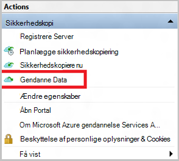

3. Vælg den * *denne server (*yourmachinename*) ** mulighed for at gendanne de sikkerhedskopierede fil på den samme computer.

    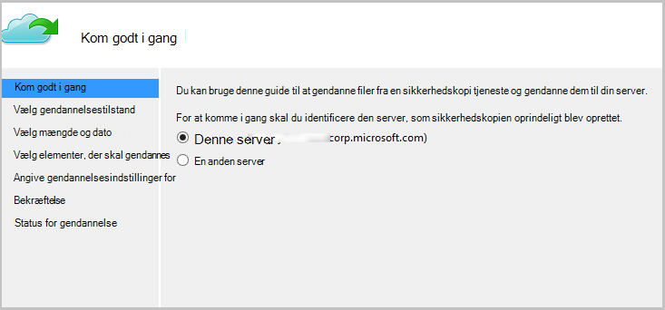

4. Vælg for at **søge efter filer** eller **søge efter filer**.

    Lad standardindstillingen, hvis du vil gendanne en eller flere filer, hvis sti kendes. Hvis du ikke er sikker om mappestrukturen, men gerne vil søge efter en fil, kan du vælge indstillingen **Søg efter filer** . I dette afsnit fortsætter vi med standardindstillingen.

    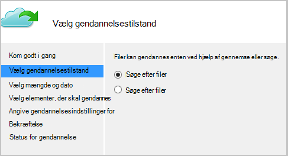

5. Vælg den enhed, hvorfra du vil gendanne filen.

    Du kan gendanne fra et vilkårligt sted i gang. Datoer, der vises i **fed** i kalenderen angiver tilgængeligheden af et gendannelsespunkt. Når en dato er markeret, baseret på tidsplanen sikkerhedskopiering (og en vellykket en sikkerhedskopiering), kan du vælge et punkt i tid fra **tid** slip ned.

    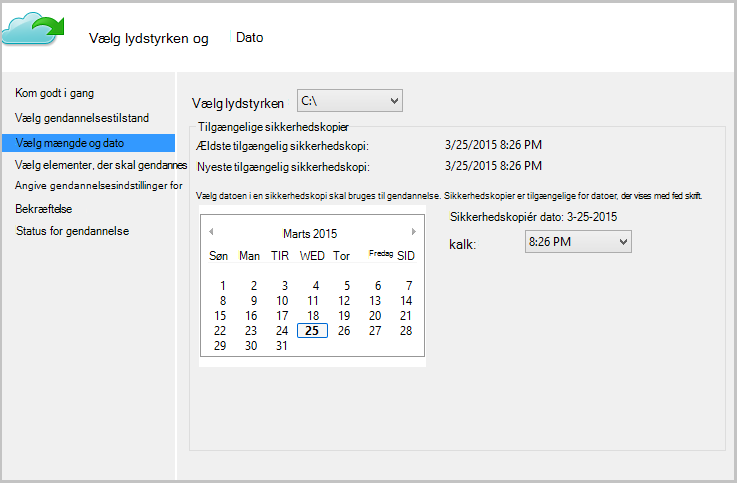

6. Vælg elementerne, der skal gendannes. Du kan markere flere mapper og filer, du vil gendanne.

    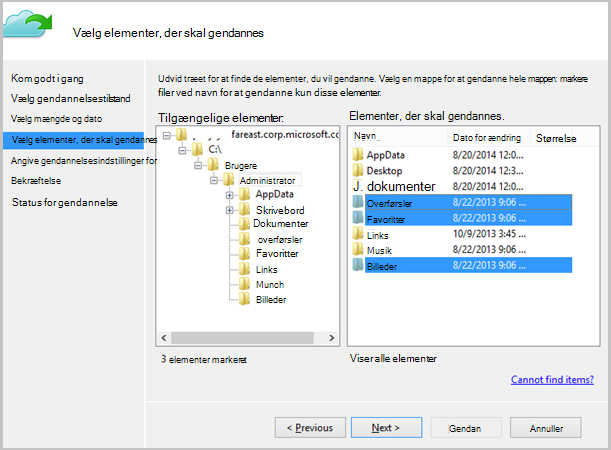

7. Angiv parametrene gendannelse.

    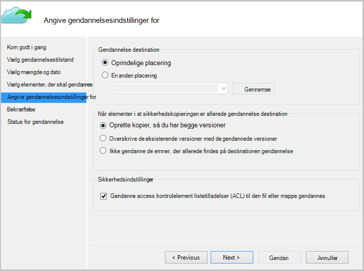

  - Du har en mulighed for at gendanne til den oprindelige placering (hvor filen eller mappen vil blive overskrevet) eller til en anden placering i den samme computer.
  - Hvis den filmappe, du vil gendanne findes i målplaceringen, kan du oprette kopier (to versioner af den samme fil), overskrive filerne i målplaceringen eller springe gendannelse for de filer, som findes i mållejerens.
  - Det anbefales, at du lader standard mulighed for at gendanne ACLs på de filer, som er gendannes.

8. Når disse oplysninger er angivet, skal du klikke på **Næste**. Gendannelse arbejdsprocessen, som gendanner filerne på denne computer, starter.

## Gendanne til en anden computer
Hvis din hele server går tabt, kan du stadig gendanne data fra Azure sikkerhedskopi til en anden computer. I følgende trin illustreres arbejdsprocessen.  

Den anvendte terminologi i disse trin omfatter:

- *Kilde maskine* – den oprindelige computer, som som sikkerhedskopien er taget, og som er tilgængelig i øjeblikket.
- *Target maskine* – den maskine, som dataene gendannes.
- *Eksempel samling* – feltet gendannelse Services samling *kilde maskine* og *mål maskine* er registreret.  

> [AZURE.NOTE] Sikkerhedskopier tages fra en computer kan ikke gendannes på en computer, der kører en tidligere version af operativsystemet. Eksempelvis hvis sikkerhedskopier er taget fra en Windows 7-computer, kan det gendannes på en Windows 8 eller over computer. Men i omvendt ikke indeholder SAND.

1. Åbn **Microsoft Azure Backup** Fastgør i på *Target computer*.
2. Sørg for, *Target maskine* og *kilde maskine* er registreret på den samme gendannelse Services samling af legitimationsoplysninger.
3. Klik på **Gendan Data** for at starte arbejdsprocessen.

    

4. Vælg **en anden server**

    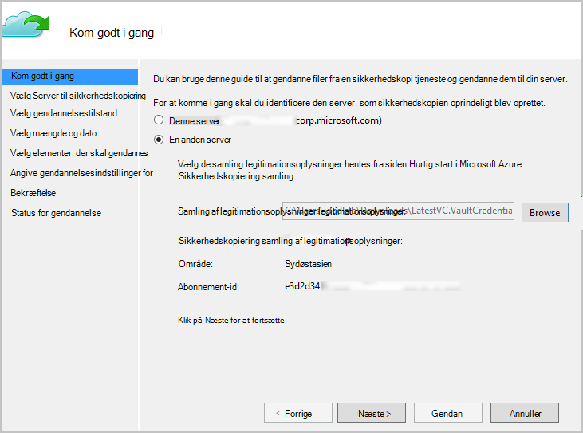

5. Give filen samling legitimationsoplysninger, der svarer til *eksempel samling*. Hvis filen samling legitimationsoplysninger er ugyldige (eller udløbet) kan du hente en ny samling legitimationsoplysninger fil fra *eksempel samling* i portalen Azure. Når filen samling legitimationsoplysninger er angivet, vises gendannelse Services samling mod filen samling legitimationsoplysninger.

6. Vælg den *kilde maskine* på listen over viste computere.

    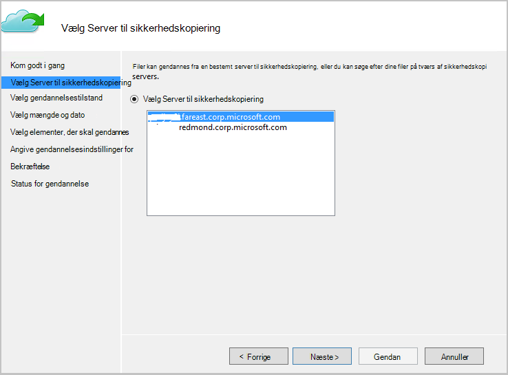

7. Vælg enten indstillingen **Søg efter filer** eller **søge efter filer** . Vi vil bruge indstillingen **Søg efter filer** i dette afsnit.

    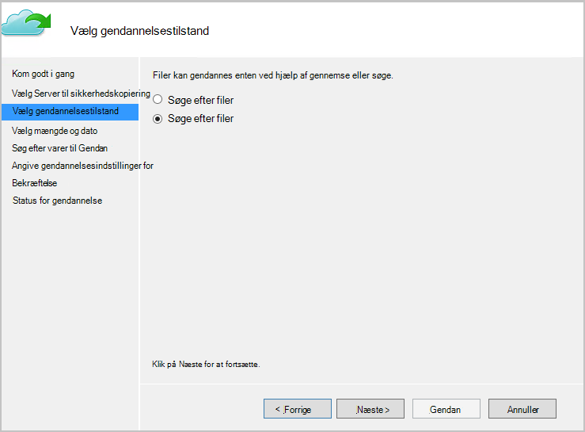

8. Vælg den mængde og dato i det næste skærmbillede. Søge efter navnet på mappen/fil, du vil gendanne.

    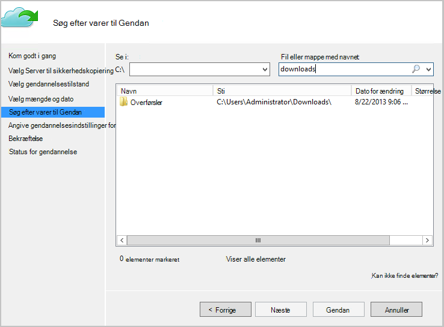

9. Vælg den placering, hvor filerne, der skal gendannes.

    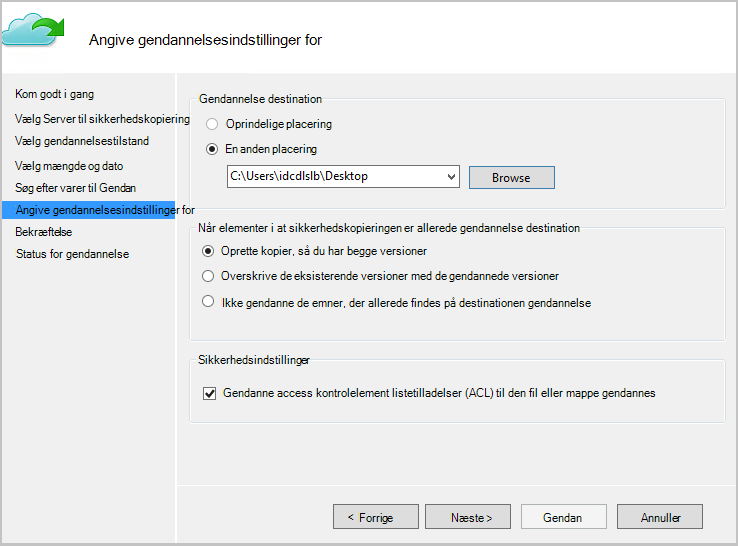

10. Angiv den kryptering adgangskoden, der har fået under registrering af *kilde maskine* *eksempel samling*.

    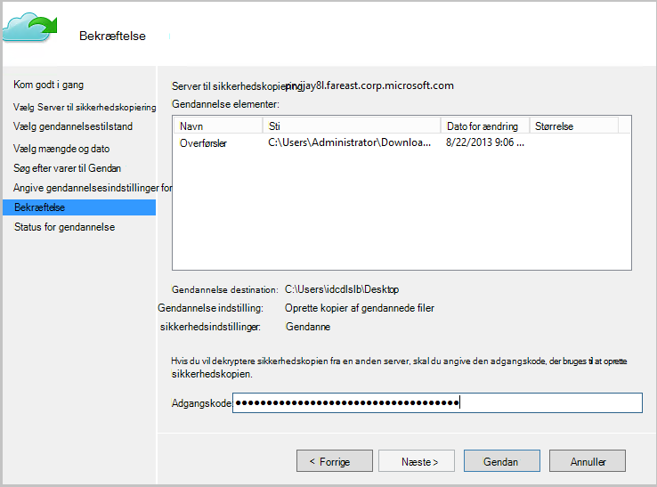

11. Når input leveres, kan du klikke på **Gendan**, som udløser gendannelse af sikkerhedskopierede filerne til den angivne destination.

## Næste trin
- Nu hvor du har gendannet dine filer og mapper, kan du [administrere dine sikkerhedskopier](backup-azure-manage-windows-server.md).
