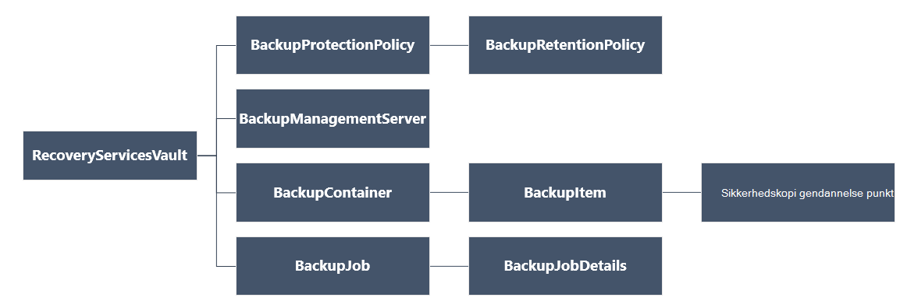

<properties
   pageTitle="Installere og administrere sikkerhedskopier til brug af Ressourcestyring FOS ved hjælp af PowerShell | Microsoft Azure"
   description="Bruge PowerShell til at installere og administrere sikkerhedskopier i Azure til brug af Ressourcestyring FOS"
   services="backup"
   documentationCenter=""
   authors="markgalioto"
   manager="cfreeman"
   editor=""/>

<tags
   ms.service="backup"
   ms.devlang="na"
   ms.topic="article"
   ms.tgt_pltfrm="na"
   ms.workload="storage-backup-recovery"
   ms.date="08/03/2016"
   ms.author="markgal; trinadhk"/>

# <a name="deploy-and-manage-backups-for-resource-manager-deployed-vms-using-powershell"></a>Installere og administrere sikkerhedskopier til brug af Ressourcestyring FOS ved hjælp af PowerShell

> [AZURE.SELECTOR]
- [Ressourcestyring](backup-azure-vms-automation.md)
- [Klassisk](backup-azure-vms-classic-automation.md)

I denne artikel viser, hvordan du bruger Azure PowerShell-cmdlet'er til at sikkerhedskopiere og gendanne en Azure VM (virtual machine) fra en samling af legitimationsoplysninger gendannelsestjenester. En samling af legitimationsoplysninger gendannelse Services er en Azure ressourcestyring ressource og bruges til at beskytte data og aktiver i både Azure sikkerhedskopiering og gendannelse af websteder Azure services. Du kan bruge en samling af legitimationsoplysninger gendannelse Services til at beskytte Azure Service Manager installeret FOS samt Azure ressourcestyring installeret FOS.

>[AZURE.NOTE] Azure har to installation modeller til oprettelse og arbejde med ressourcer: [ressourcestyring og klassisk](../resource-manager-deployment-model.md). I denne artikel er til brug med VM'er, der er oprettet ved hjælp af Ressourcestyring modellen.

I denne artikel vejledes du gennem ved hjælp af PowerShell til at beskytte en VM og gendanne data fra et gendannelsespunkt.

## <a name="concepts"></a>Begreber

Hvis du ikke er fortrolig med tjenesten Azure sikkerhedskopi for en oversigt over service skal du se [Hvad er Azure sikkerhedskopi?](backup-introduction-to-azure-backup.md) Inden du starter, kan du sikre dig, at du dækker vigtige oplysninger om de forudsætninger, der er behov for at arbejde med Azure sikkerhedskopiering og begrænsningerne i den aktuelle sikkerhedskopiering VM-løsning.

For at kunne bruge PowerShell effektivt, er det nødvendigt at forstå hierarkiet af objekter og skal starte fra.



Se [Azure sikkerhedskopi - gendannelse Services-cmdletter](https://msdn.microsoft.com/library/mt723320.aspx) i biblioteket Azure for at få vist AzureRmRecoveryServicesBackup PowerShell-cmdlet reference.
Se [Azure gendannelse af Tjenesteforbindelser](https://msdn.microsoft.com/library/mt643905.aspx)for at få vist AzureRmRecoveryServicesVault PowerShell-cmdlet reference.


## <a name="setup-and-registration"></a>Konfiguration og registrering

Starte:

1. [Hent den nyeste version af PowerShell](https://github.com/Azure/azure-powershell/releases) (den minimumversion påkrævet er: 1.4.0)

2. Finde de Azure sikkerhedskopi PowerShell-cmdletter tilgængelige ved at skrive følgende kommando:

```
PS C:\> Get-Command *azurermrecoveryservices*

CommandType     Name                                               Version    Source
-----------     ----                                               -------    ------
Cmdlet          Backup-AzureRmRecoveryServicesBackupItem           1.4.0      AzureRM.RecoveryServices.Backup
Cmdlet          Disable-AzureRmRecoveryServicesBackupProtection    1.4.0      AzureRM.RecoveryServices.Backup
Cmdlet          Enable-AzureRmRecoveryServicesBackupProtection     1.4.0      AzureRM.RecoveryServices.Backup
Cmdlet          Get-AzureRmRecoveryServicesBackupContainer         1.4.0      AzureRM.RecoveryServices.Backup
Cmdlet          Get-AzureRmRecoveryServicesBackupItem              1.4.0      AzureRM.RecoveryServices.Backup
Cmdlet          Get-AzureRmRecoveryServicesBackupJob               1.4.0      AzureRM.RecoveryServices.Backup
Cmdlet          Get-AzureRmRecoveryServicesBackupJobDetails        1.4.0      AzureRM.RecoveryServices.Backup
Cmdlet          Get-AzureRmRecoveryServicesBackupManagementServer  1.4.0      AzureRM.RecoveryServices.Backup
Cmdlet          Get-AzureRmRecoveryServicesBackupProperties        1.4.0      AzureRM.RecoveryServices
Cmdlet          Get-AzureRmRecoveryServicesBackupProtectionPolicy  1.4.0      AzureRM.RecoveryServices.Backup
Cmdlet          Get-AzureRMRecoveryServicesBackupRecoveryPoint     1.4.0      AzureRM.RecoveryServices.Backup
Cmdlet          Get-AzureRmRecoveryServicesBackupRetentionPolic... 1.4.0      AzureRM.RecoveryServices.Backup
Cmdlet          Get-AzureRmRecoveryServicesBackupSchedulePolicy... 1.4.0      AzureRM.RecoveryServices.Backup
Cmdlet          Get-AzureRmRecoveryServicesVault                   1.4.0      AzureRM.RecoveryServices
Cmdlet          Get-AzureRmRecoveryServicesVaultSettingsFile       1.4.0      AzureRM.RecoveryServices
Cmdlet          New-AzureRmRecoveryServicesBackupProtectionPolicy  1.4.0      AzureRM.RecoveryServices.Backup
Cmdlet          New-AzureRmRecoveryServicesVault                   1.4.0      AzureRM.RecoveryServices
Cmdlet          Remove-AzureRmRecoveryServicesProtectionPolicy     1.4.0      AzureRM.RecoveryServices.Backup
Cmdlet          Remove-AzureRmRecoveryServicesVault                1.4.0      AzureRM.RecoveryServices
Cmdlet          Restore-AzureRMRecoveryServicesBackupItem          1.4.0      AzureRM.RecoveryServices.Backup
Cmdlet          Set-AzureRmRecoveryServicesBackupProperties        1.4.0      AzureRM.RecoveryServices
Cmdlet          Set-AzureRmRecoveryServicesBackupProtectionPolicy  1.4.0      AzureRM.RecoveryServices.Backup
Cmdlet          Set-AzureRmRecoveryServicesVaultContext            1.4.0      AzureRM.RecoveryServices
Cmdlet          Stop-AzureRmRecoveryServicesBackupJob              1.4.0      AzureRM.RecoveryServices.Backup
Cmdlet          Unregister-AzureRmRecoveryServicesBackupContainer  1.4.0      AzureRM.RecoveryServices.Backup
Cmdlet          Unregister-AzureRmRecoveryServicesBackupManagem... 1.4.0      AzureRM.RecoveryServices.Backup
Cmdlet          Wait-AzureRmRecoveryServicesBackupJob              1.4.0      AzureRM.RecoveryServices.Backup
```


Følgende opgaver du kan automatisere med PowerShell:

- Oprette en samling af legitimationsoplysninger gendannelse
- Sikkerhedskopiér eller beskytte Azure FOS
- Udløse en sikkerhedskopieringsjob
- Overvåge et sikkerhedskopieringsjob
- Gendanne en Azure VM

## <a name="create-a-recovery-services-vault"></a>Oprette en gendannelse services samling

Følgende trin fører dig gennem oprettelse af en samling af legitimationsoplysninger gendannelsestjenester. En samling af legitimationsoplysninger gendannelse Services er forskellig fra en sikkerhedskopi samling af legitimationsoplysninger.

1. Hvis du bruger Azure sikkerhedskopi for første gang, skal du bruge **[Register-AzureRMResourceProvider](https://msdn.microsoft.com/library/mt679020.aspx)** cmdlet til at registrere Azure gendannelse tjenesteudbyder med dit abonnement.

    ```
    PS C:\> Register-AzureRmResourceProvider -ProviderNamespace "Microsoft.RecoveryServices"
    ```

2. Samling af legitimationsoplysninger gendannelse Services er en ressourcestyring ressource, så du har brug at placere det i en ressourcegruppe. Du kan bruge en eksisterende ressourcegruppe eller oprette en ny ressourcegruppe med **[Ny AzureRmResourceGroup](https://msdn.microsoft.com/library/mt678985.aspx)** cmdlet. Når du opretter en ny ressourcegruppe, angive navn og placering for ressourcegruppen.  

    ```
    PS C:\> New-AzureRmResourceGroup –Name "test-rg" –Location "West US"
    ```

3. Brug cmdlet'en **[Ny AzureRmRecoveryServicesVault](https://msdn.microsoft.com/library/mt643910.aspx)** til at oprette den nye samling af legitimationsoplysninger. Sørg for at angive den samme placering for samling af legitimationsoplysninger, som blev brugt til ressourcegruppen.

    ```
    PS C:\> New-AzureRmRecoveryServicesVault -Name "testvault" -ResourceGroupName " test-rg" -Location "West US"
    ```

4. Angive typen lagerplads redundans bruge; Du kan bruge [Lokalt overflødige lagerplads (LRS)](../storage/storage-redundancy.md#locally-redundant-storage) eller [Geografisk overflødige lagerplads (GRS)](../storage/storage-redundancy.md#geo-redundant-storage). I følgende eksempel viser indstillingen - BackupStorageRedundancy for testVault er indstillet til GeoRedundant.

    ```
    PS C:\> $vault1 = Get-AzureRmRecoveryServicesVault –Name "testVault"
    PS C:\> Set-AzureRmRecoveryServicesBackupProperties  -Vault $vault1 -BackupStorageRedundancy GeoRedundant
    ```

    > [AZURE.TIP] Mange Azure sikkerhedskopi-cmdletter kræver gendannelse Services samling objektet som input. Derfor er det praktisk at gemme objektet sikkerhedskopi gendannelse Services samling af legitimationsoplysninger i en variabel.

## <a name="view-the-vaults-in-a-subscription"></a>Få vist vaults i et abonnement
Brug **[Get-AzureRmRecoveryServicesVault](https://msdn.microsoft.com/library/mt643907.aspx)** til at få vist en liste over alle vaults i det aktuelle abonnement. Du kan bruge denne kommando til at kontrollere, at en ny samling blev oprettet, eller for at se, hvilke vaults er tilgængelige i abonnementet.

Kør kommandoen Get-AzureRmRecoveryServicesVault, og alle vaults i abonnement vises.

```
PS C:\> Get-AzureRmRecoveryServicesVault
Name              : Contoso-vault
ID                : /subscriptions/1234
Type              : Microsoft.RecoveryServices/vaults
Location          : WestUS
ResourceGroupName : Contoso-docs-rg
SubscriptionId    : 1234-567f-8910-abc
Properties        : Microsoft.Azure.Commands.RecoveryServices.ARSVaultProperties
```


## <a name="backup-azure-vms"></a>Sikkerhedskopiering Azure FOS
Nu hvor du har oprettet en gendannelse services samling, kan du bruge det til at beskytte en virtuel maskine. Men før du anvender beskyttelsen, skal du angive samling konteksten og skal du bekræfte politikken for beskyttelse. Samling kontekst definerer typen data, der er beskyttet i samling af legitimationsoplysninger. Politik for beskyttelse er planen for når sikkerhedskopieringen er kører, og hvor lang tid hver ekstra øjebliksbillede bevares.

Før du aktiverer beskyttelse under en VM, skal du angive samling konteksten. Konteksten anvendes til alle efterfølgende cmdletter.

```
PS C:\> Get-AzureRmRecoveryServicesVault -Name testvault | Set-AzureRmRecoveryServicesVaultContext
```

### <a name="create-a-protection-policy"></a>Opret en politik for beskyttelse

Når du opretter en ny samling, er den leveres med en standardpolitik. Denne politik udløser en sikkerhedskopieringsjob hver dag på et bestemt tidspunkt. Per standardpolitikken bevares sikkerhedskopiering snapshot i 30 dage. Du kan bruge standardpolitikken for at beskytte hurtigt din VM og redigere politikken senere med forskellige detaljer.

Brug **[Get-AzureRmRecoveryServicesBackupProtectionPolicy](https://msdn.microsoft.com/library/mt723300.aspx)** til at få vist listen tilgængelige af politikker i samling af legitimationsoplysninger:

```
PS C:\> Get-AzureRmRecoveryServicesBackupProtectionPolicy -WorkloadType AzureVM
Name                 WorkloadType       BackupManagementType BackupTime                DaysOfWeek
----                 ------------       -------------------- ----------                ----------
DefaultPolicy        AzureVM            AzureVM              4/14/2016 5:00:00 PM
```

> [AZURE.NOTE] Tidszone i feltet BackupTime i PowerShell er UTC. Når på tidspunktet for sikkerhedskopiering er vist i portalen Azure, justeres klokkeslættet til din lokale tidszone.

En politik for sikkerhedskopiering beskyttelse er knyttet til mindst én opbevaringspolitik.  Opbevaringspolitik definerer, hvor lang tid en gendannelsespunkt der bevares med Azure sikkerhedskopiering. Brug **Get-AzureRmRecoveryServicesBackupRetentionPolicyObject** til at få vist standardpolitikken for opbevaring.  På samme måde kan du bruge **Get-AzureRmRecoveryServicesBackupSchedulePolicyObject** til at hente standardpolitikken for tidsplanen. Objekterne tidsplan og opbevaring politik bruges som input til Cmdletten **Ny AzureRmRecoveryServicesBackupProtectionPolicy** .

En politik for sikkerhedskopiering beskyttelse definerer, hvornår og hvor ofte sikkerhedskopi af et element er færdig. Cmdletten ny AzureRmRecoveryServicesBackupProtectionPolicy opretter en PowerShell-objekt, der indeholder sikkerhedskopien politikoplysninger. Politikken sikkerhedskopiering bruges som input til Cmdletten Enable-AzureRmRecoveryServicesBackupProtection.

```
PS C:\> $schPol = Get-AzureRmRecoveryServicesBackupSchedulePolicyObject -WorkloadType "AzureVM"
PS C:\>  $retPol = Get-AzureRmRecoveryServicesBackupRetentionPolicyObject -WorkloadType "AzureVM"
PS C:\>  New-AzureRmRecoveryServicesBackupProtectionPolicy -Name "NewPolicy" -WorkloadType AzureVM -RetentionPolicy $retPol -SchedulePolicy $schPol
Name                 WorkloadType       BackupManagementType BackupTime                DaysOfWeek
----                 ------------       -------------------- ----------                ----------
NewPolicy           AzureVM            AzureVM              4/24/2016 1:30:00 AM
```

### <a name="enable-protection"></a>Aktivér beskyttelse

Hvis du aktiverer beskyttelse omfatter to objekter - elementet og politikken. Begge objekter skal aktivere beskyttelse under samling af legitimationsoplysninger. Når politikken der er knyttet til samling af legitimationsoplysninger, der sikkerhedskopiering arbejdsprocessen udløses på det tidspunkt, der er defineret i politik tidsplanen.

Aktivere beskyttelsen på ikke-krypteret ARM FOS

```
PS C:\> $pol=Get-AzureRmRecoveryServicesBackupProtectionPolicy -Name "NewPolicy"
PS C:\> Enable-AzureRmRecoveryServicesBackupProtection -Policy $pol -Name "V2VM" -ResourceGroupName "RGName1"
```

Hvis du vil aktivere beskyttelse under krypteret FOS [krypteret ved hjælp af BEK og KEK], skal du give tilladelser til Azure sikkerhedskopi-tjenesten til at læse nøgler og hemmeligheder fra vigtige samling. 

```
PS C:\> Set-AzureRmKeyVaultAccessPolicy -VaultName 'KeyVaultName' -ResourceGroupName 'RGNameOfKeyVault' -PermissionsToKeys backup,get,list -PermissionsToSecrets get,list -ServicePrincipalName 262044b1-e2ce-469f-a196-69ab7ada62d3
PS C:\> $pol=Get-AzureRmRecoveryServicesBackupProtectionPolicy -Name "NewPolicy"
PS C:\> Enable-AzureRmRecoveryServicesBackupProtection -Policy $pol -Name "V2VM" -ResourceGroupName "RGName1"
```

For ASM baseret FOS

```
PS C:\>  $pol=Get-AzureRmRecoveryServicesBackupProtectionPolicy -Name "NewPolicy"
PS C:\>  Enable-AzureRmRecoveryServicesBackupProtection -Policy $pol -Name "V1VM" -ServiceName "ServiceName1"
```

### <a name="modify-a-protection-policy"></a>Redigere en politik for beskyttelse

Hvis du vil ændre politikken, ændre BackupSchedulePolicyObject eller BackupRetentionPolicy objektet og ændre politikken ved hjælp af sæt AzureRmRecoveryServicesBackupProtectionPolicy

I følgende eksempel ændres opbevaring antallet til 365.

```
PS C:\> $retPol = Get-AzureRmRecoveryServicesBackupRetentionPolicyObject -WorkloadType "AzureVM"
PS C:\> $retPol.DailySchedule.DurationCountInDays = 365
PS C:\> $pol= Get-AzureRmRecoveryServicesBackupProtectionPolicy -Name NewPolicy
PS C:\> Set-AzureRmRecoveryServicesBackupProtectionPolicy -Policy $pol  -RetentionPolicy  $RetPol
```

## <a name="run-an-initial-backup"></a>Oprette en indledende sikkerhedskopi

Tidsplanen for sikkerhedskopiering udløser en fuld op i forbindelse med første tilbage til elementet. På efterfølgende sikkerhedskopier, feltet Sikkerhedskopiér er en trinvis kopi. Hvis du vil tvinge indledende sikkerhedskopien til at opstå på et bestemt tidspunkt eller endda umiddelbart skal du bruge **[Sikkerhedskopi-AzureRmRecoveryServicesBackupItem](https://msdn.microsoft.com/library/mt723312.aspx)** cmdlet:

```
PS C:\> $namedContainer = Get-AzureRmRecoveryServicesBackupContainer -ContainerType "AzureVM" -Status "Registered" -Name "V2VM"
PS C:\> $item = Get-AzureRmRecoveryServicesBackupItem -Container $namedContainer -WorkloadType "AzureVM"
PS C:\> $job = Backup-AzureRmRecoveryServicesBackupItem -Item $item
WorkloadName     Operation            Status               StartTime                 EndTime                   JobID
------------     ---------            ------               ---------                 -------                   ----------
V2VM              Backup               InProgress            4/23/2016 5:00:30 PM                       cf4b3ef5-2fac-4c8e-a215-d2eba4124f27
```

> [AZURE. Bemærk: Tidszone i felterne Starttidspunkt og sluttidspunkt i PowerShell er UTC. Når tid, der vises i portalen Azure, justeres klokkeslættet til din lokale tidszone.

## <a name="monitoring-a-backup-job"></a>Overvågning af et sikkerhedskopieringsjob

De fleste længerevarende handlinger i Azure sikkerhedskopi bygger som et job. Dette gør det nemt at registrere status for opgaver uden at skulle holde portalen Azure åben til enhver tid.

Brug cmdlet'en Get-AzureRmRecoveryservicesBackupJob for at få den seneste status for en igangværende job.

```
PS C:\ > $joblist = Get-AzureRmRecoveryservicesBackupJob –Status InProgress
PS C:\ > $joblist[0]
WorkloadName     Operation            Status               StartTime                 EndTime                   JobID
------------     ---------            ------               ---------                 -------                   ----------
V2VM             Backup               InProgress            4/23/2016 5:00:30 PM           cf4b3ef5-2fac-4c8e-a215-d2eba4124f27
```

I stedet for afstemning bruge disse job for fuldførelse - som er unødvendige yderligere kode - Cmdletten **[Vent AzureRmRecoveryServicesBackupJob](https://msdn.microsoft.com/library/mt723321.aspx)** . Denne cmdlet afbrydes udførelsen, indtil jobbet er fuldført, eller den angivne timeoutværdien er nået.

```
PS C:\> Wait-AzureRmRecoveryServicesBackupJob -Job $joblist[0] -Timeout 43200
```

## <a name="restore-an-azure-vm"></a>Gendanne en Azure VM

Der er vigtige forskel mellem gendannelse af en VM ved hjælp af portalen Azure og gendanne en VM ved hjælp af PowerShell. Med PowerShell, er gendannelsen er fuldført, når der oprettes diske og konfigurationsoplysninger fra punktet gendannelse. Gendannelsen opretter ikke et virtuelt. Instruktioner til oprettelse af den virtuelle maskine fra diske er angivet. Men hvis du vil gendanne en VM fuldt ud, skal du gennemgå følgende procedurer:

- Vælg VM
- Vælg et gendannelsespunkt
- Gendanne diskene
- Oprette VM fra lagrede diske

Grafikken nedenfor viser hierarkiet objekt fra RecoveryServicesVault ned til BackupRecoveryPoint.


For at gendanne sikkerhedskopierede data, skal du identificere sikkerhedskopierede elementet og punktet gendannelse, der indeholder punkt i tidsdata. Brug derefter **[Gendan AzureRmRecoveryServicesBackupItem](https://msdn.microsoft.com/library/mt723316.aspx)** cmdlet til at gendanne data fra samling af legitimationsoplysninger til kundens konto.

### <a name="select-the-vm"></a>Vælg VM

Start fra objektbeholderen i samling af legitimationsoplysninger for at få det PowerShell-objekt, der identificerer det højre sikkerhedskopiering element, og Arbejd dig videre ned hierarkiet objekt. Du kan vælge objektbeholderen, der repræsenterer VM ved brug cmdlet'en **[Get-AzureRmRecoveryServicesBackupContainer](https://msdn.microsoft.com/library/mt723319.aspx)** og pipe, til **[Get-AzureRmRecoveryServicesBackupItem](https://msdn.microsoft.com/library/mt723305.aspx)** cmdlet.

```
PS C:\> $namedContainer = Get-AzureRmRecoveryServicesBackupContainer  -ContainerType AzureVM –Status Registered -Name 'V2VM'
PS C:\> $backupitem = Get-AzureRmRecoveryServicesBackupItem –Container $namedContainer  –WorkloadType "AzureVM"
```

### <a name="choose-a-recovery-point"></a>Vælg et gendannelsespunkt

Brug cmdlet'en **[Get-AzureRmRecoveryServicesBackupRecoveryPoint](https://msdn.microsoft.com/library/mt723308.aspx)** til at få vist alle de gendannelse punkter for elementet sikkerhedskopiering. Vælg derefter det gendannelsespunkt for at gendanne. Hvis du er sikker på, hvilken gendannelse Peg brug, er det en god ide at vælge den seneste RecoveryPointType = AppConsistent punkt på listen.

I følgende script er variablen, **$rp**, en matrix med gendannelse point for det valgte sikkerhedskopiering element. Matrixen er sorteret i omvendt rækkefølge af tid med den seneste gendannelse midterpunkt Index 0. Brug standard PowerShell matrix indeksering til at vælge det gendannelsespunkt. For eksempel: $rp [0] vælger det seneste gendannelsespunkt.

```
PS C:\> $startDate = (Get-Date).AddDays(-7)
PS C:\> $endDate = Get-Date
PS C:\> $rp = Get-AzureRmRecoveryServicesBackupRecoveryPoint -Item $backupitem -StartDate $startdate.ToUniversalTime() -EndDate $enddate.ToUniversalTime()
PS C:\> $rp[0]
RecoveryPointAdditionalInfo :
SourceVMStorageType         : NormalStorage
Name                        : 15260861925810
ItemName                    : VM;iaasvmcontainer;RGName1;V2VM
RecoveryPointId             : /subscriptions/XX/resourceGroups/ RGName1/providers/Microsoft.RecoveryServices/vaults/testvault/backupFabrics/Azure/protectionContainers/IaasVMContainer;iaasvmcontainer;RGName1;V2VM/protectedItems/VM;iaasvmcontainer; RGName1;V2VM
                              /recoveryPoints/15260861925810
RecoveryPointType           : AppConsistent
RecoveryPointTime           : 4/23/2016 5:02:04 PM
WorkloadType                : AzureVM
ContainerName               : IaasVMContainer;iaasvmcontainer; RGName1;V2VM
ContainerType               : AzureVM
BackupManagementType        : AzureVM
```


### <a name="restore-the-disks"></a>Gendanne diskene

Brug cmdlet'en **[Gendan AzureRmRecoveryServicesBackupItem](https://msdn.microsoft.com/library/mt723316.aspx)** til at gendanne data og konfigurationer for en sikkerhedskopi-element til et gendannelse. Når du har fundet et gendannelsespunkt bruge den som værdien for parameteren **- RecoveryPoint** . I det forrige eksempelkode, blev **$rp [0]** valgt som gendannelse at bruge. **$Rp [0]** er angivet i nedenstående eksempelkode, som det gendannelsespunkt for at bruge for at gendanne til disk.

Gendanne de diske og konfigurationsoplysninger

```
PS C:\> $restorejob = Restore-AzureRmRecoveryServicesBackupItem -RecoveryPoint $rp[0] -StorageAccountName DestAccount -StorageAccountResourceGroupName DestRG
PS C:\> $restorejob
WorkloadName     Operation          Status               StartTime                 EndTime            JobID
------------     ---------          ------               ---------                 -------          ----------
V2VM              Restore           InProgress           4/23/2016 5:00:30 PM                        cf4b3ef5-2fac-4c8e-a215-d2eba4124f27
```

Når Gendannelsesjobbet er færdig, skal du bruge cmdlet'en **[Get-AzureRmRecoveryServicesBackupJobDetails](https://msdn.microsoft.com/library/mt723310.aspx)** til at få oplysninger om gendannelsen. Egenskaben JobDetails indeholder de oplysninger, der er behov for at genopbygge VM.

```
PS C:\> $restorejob = Get-AzureRmRecoveryServicesBackupJob -Job $restorejob
PS C:\> $details = Get-AzureRmRecoveryServicesBackupJobDetails
```

Når du gendanner diskene, kan du gå til næste afsnit for at få oplysninger om oprettelse af VM.

### <a name="create-a-vm-from-restored-disks"></a>Oprette en VM fra gendannede diske

Når du har gendannet diskene, kan du bruge disse trin til at oprette og konfigurere den virtuelle maskine fra disk.

1. Forespørge gendannede disk egenskaberne for oplysninger om job.

    ```
    PS C:\> $properties = $details.properties
    PS C:\> $storageAccountName = $properties["Target Storage Account Name"]
    PS C:\> $containerName = $properties["Config Blob Container Name"]
    PS C:\> $blobName = $properties["Config Blob Name"]
    ```

2. Angiv konteksten Azure-lager og gendanne JSON-konfigurationsfil.

    ```
    PS C:\> Set-AzureRmCurrentStorageAccount -Name $storageaccountname -ResourceGroupName testvault
    PS C:\> $destination_path = "C:\vmconfig.json"
    PS C:\> Get-AzureStorageBlobContent -Container $containerName -Blob $blobName -Destination $destination_path
    PS C:\> $obj = ((Get-Content -Path $destination_path -Encoding Unicode)).TrimEnd([char]0x00) | ConvertFrom-Json
    ```

3. Bruge JSON-konfigurationsfil til at oprette VM konfigurationen.

    ```
  PS C:\> $vm = New-AzureRmVMConfig -VMSize $obj.HardwareProfile.VirtualMachineSize -VMName "testrestore"
    ```

4. Vedhæft OS disken og datadisce.

      For ikke-krypteret FOS

       ```
       PS C:\> Set-AzureRmVMOSDisk -VM $vm -Name "osdisk" -VhdUri $obj.StorageProfile.OSDisk.VirtualHardDisk.Uri -CreateOption “Attach”
       PS C:\> $vm.StorageProfile.OsDisk.OsType = $obj.StorageProfile.OSDisk.OperatingSystemType foreach($dd in $obj.StorageProfile.DataDisks)
       {
       $vm = Add-AzureRmVMDataDisk -VM $vm -Name "datadisk1" -VhdUri $dd.VirtualHardDisk.Uri -DiskSizeInGB 127 -Lun $dd.Lun -CreateOption Attach
       }
       ```
      For krypterede FOS skal du angive [nøgle samling oplysninger](https://msdn.microsoft.com/library/dn868052.aspx) , før du kan vedhæfte diske.
      
      ```
      PS C:\> Set-AzureRmVMOSDisk -VM $vm -Name "osdisk" -VhdUri $obj.StorageProfile.OSDisk.VirtualHardDisk.Uri -DiskEncryptionKeyUrl "https://ContosoKeyVault.vault.azure.net:443/secrets/ContosoSecret007" -DiskEncryptionKeyVaultId "/subscriptions/abcdedf007-4xyz-1a2b-0000-12a2b345675c/resourceGroups/ContosoRG108/providers/Microsoft.KeyVault/vaults/ContosoKeyVault" -KeyEncryptionKeyUrl "https://ContosoKeyVault.vault.azure.net:443/keys/ContosoKey007" -KeyEncryptionKeyVaultId "subscriptions/abcdedf007-4xyz-1a2b-0000-12a2b345675c/resourceGroups/ContosoRG108/providers/Microsoft.KeyVault/vaults/ContosoKeyVault" -CreateOption "Attach" -Windows
      PS C:\> $vm.StorageProfile.OsDisk.OsType = $obj.StorageProfile.OSDisk.OperatingSystemType foreach($dd in $obj.StorageProfile.DataDisks)
       {
       $vm = Add-AzureRmVMDataDisk -VM $vm -Name "datadisk1" -VhdUri $dd.VirtualHardDisk.Uri -DiskSizeInGB 127 -Lun $dd.Lun -CreateOption Attach
       }
      ```
      
5. Angiv indstillingerne netværk.

    ```
    PS C:\> $nicName="p1234"
    PS C:\> $pip = New-AzureRmPublicIpAddress -Name $nicName -ResourceGroupName "test" -Location "WestUS" -AllocationMethod Dynamic
    PS C:\> $vnet = Get-AzureRmVirtualNetwork -Name "testvNET" -ResourceGroupName "test"
    PS C:\> $nic = New-AzureRmNetworkInterface -Name $nicName -ResourceGroupName "test" -Location "WestUS" -SubnetId $vnet.Subnets[$subnetindex].Id -PublicIpAddressId $pip.Id
    PS C:\> $vm=Add-AzureRmVMNetworkInterface -VM $vm -Id $nic.Id
    ```

6. Oprette den virtuelle maskine.

    ```
    PS C:\> $vm.StorageProfile.OsDisk.OsType = $obj.StorageProfile.OSDisk.OperatingSystemType
    PS C:\> New-AzureRmVM -ResourceGroupName "test" -Location "WestUS" -VM $vm
    ```

## <a name="next-steps"></a>Næste trin

Hvis du foretrækker at bruge PowerShell til at kommunikere med dine Azure ressourcer, kan du se artiklen PowerShell til at beskytte Windows Server, [Implementer og administrere sikkerhedskopi til Windows Server](./backup-client-automation.md)til. Der er også en PowerShell-artikel for at administrere DPM sikkerhedskopier, [Implementer og administrere sikkerhedskopi for DPM](./backup-dpm-automation.md). Begge af følgende artikler har en version til Ressourcestyring installationer samt klassisk installationer.  
