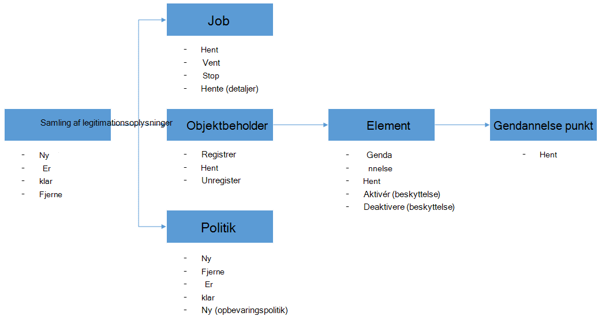

<properties
    pageTitle="Installere og administrere sikkerhedskopi til Azure FOS ved hjælp af PowerShell | Microsoft Azure"
    description="Lær, hvordan du installere og administrere Azure sikkerhedskopi ved hjælp af PowerShell"
    services="backup"
    documentationCenter=""
    authors="markgalioto"
    manager="cfreeman"
    editor=""/>

<tags
    ms.service="backup"
    ms.workload="storage-backup-recovery"
    ms.tgt_pltfrm="na"
    ms.devlang="na"
    ms.topic="article"
    ms.date="08/08/2016"
    ms.author="markgal;trinadhk;jimpark" />


# <a name="deploy-and-manage-backup-for-azure-vms-using-powershell"></a>Installere og administrere sikkerhedskopi til Azure FOS ved hjælp af PowerShell

> [AZURE.SELECTOR]
- [Ressourcestyring](backup-azure-vms-automation.md)
- [Klassisk](backup-azure-vms-classic-automation.md)

I denne artikel viser, hvordan du bruger Azure PowerShell til sikkerhedskopiering og gendannelse af Azure FOS. Azure har to forskellige installation modeller til oprettelse og arbejde med ressourcer: ressource Manager og klassisk. Denne artikel omhandler ved hjælp af implementeringsmodel klassisk. Microsoft anbefaler, at de fleste nye installationer bruger ressourcestyring modellen.

## <a name="concepts"></a>Begreber


I denne artikel indeholder oplysninger, der er specifikke for de PowerShell-cmdletter, der bruges til at sikkerhedskopiere virtuelle computere. Indledende oplysninger om beskyttelse Azure FOS, skal du se [planlægge infrastrukturen VM sikkerhedskopiering i Azure](backup-azure-vms-introduction.md).

> [AZURE.NOTE] Inden du starter, kan du læse [forudsætninger, der](backup-azure-vms-prepare.md) kræves for at arbejde med Azure sikkerhedskopiering og [begrænsninger](backup-azure-vms-prepare.md#limitations) i den aktuelle sikkerhedskopiering VM-løsning.

Hvis du vil bruge PowerShell effektivt, tage et øjeblik at forstå hierarkiet af objekter og skal starte fra.



De to vigtigste flow Hvis du aktiverer beskyttelse til en VM og gendanne data fra et gendannelsespunkt. Fokus i denne artikel er at hjælpe dig med at blive gode til at arbejde med PowerShell-cmdlet'er til at aktivere disse to scenarier.


## <a name="setup-and-registration"></a>Konfiguration og registrering
Starte:

1. [Hent seneste PowerShell](https://github.com/Azure/azure-powershell/releases) (minimumversion påkrævet er: 1.0.0)

2. Finde de Azure sikkerhedskopi PowerShell-cmdletter tilgængelige ved at skrive følgende kommando:

```
PS C:\> Get-Command *azurermbackup*

CommandType     Name                                               Version    Source
-----------     ----                                               -------    ------
Cmdlet          Backup-AzureRmBackupItem                           1.0.1      AzureRM.Backup
Cmdlet          Disable-AzureRmBackupProtection                    1.0.1      AzureRM.Backup
Cmdlet          Enable-AzureRmBackupContainerReregistration        1.0.1      AzureRM.Backup
Cmdlet          Enable-AzureRmBackupProtection                     1.0.1      AzureRM.Backup
Cmdlet          Get-AzureRmBackupContainer                         1.0.1      AzureRM.Backup
Cmdlet          Get-AzureRmBackupItem                              1.0.1      AzureRM.Backup
Cmdlet          Get-AzureRmBackupJob                               1.0.1      AzureRM.Backup
Cmdlet          Get-AzureRmBackupJobDetails                        1.0.1      AzureRM.Backup
Cmdlet          Get-AzureRmBackupProtectionPolicy                  1.0.1      AzureRM.Backup
Cmdlet          Get-AzureRmBackupRecoveryPoint                     1.0.1      AzureRM.Backup
Cmdlet          Get-AzureRmBackupVault                             1.0.1      AzureRM.Backup
Cmdlet          Get-AzureRmBackupVaultCredentials                  1.0.1      AzureRM.Backup
Cmdlet          New-AzureRmBackupProtectionPolicy                  1.0.1      AzureRM.Backup
Cmdlet          New-AzureRmBackupRetentionPolicyObject             1.0.1      AzureRM.Backup
Cmdlet          New-AzureRmBackupVault                             1.0.1      AzureRM.Backup
Cmdlet          Register-AzureRmBackupContainer                    1.0.1      AzureRM.Backup
Cmdlet          Remove-AzureRmBackupProtectionPolicy               1.0.1      AzureRM.Backup
Cmdlet          Remove-AzureRmBackupVault                          1.0.1      AzureRM.Backup
Cmdlet          Restore-AzureRmBackupItem                          1.0.1      AzureRM.Backup
Cmdlet          Set-AzureRmBackupProtectionPolicy                  1.0.1      AzureRM.Backup
Cmdlet          Set-AzureRmBackupVault                             1.0.1      AzureRM.Backup
Cmdlet          Stop-AzureRmBackupJob                              1.0.1      AzureRM.Backup
Cmdlet          Unregister-AzureRmBackupContainer                  1.0.1      AzureRM.Backup
Cmdlet          Wait-AzureRmBackupJob                              1.0.1      AzureRM.Backup
```

Følgende konfiguration og registrering opgaver du kan automatisere med PowerShell:

- Oprette en sikkerhedskopi samling
- Registrere FOS med Azure sikkerhedskopi-tjenesten

### <a name="create-a-backup-vault"></a>Oprette en sikkerhedskopi samling

> [AZURE.WARNING] For kunder, der bruger Azure sikkerhedskopi for første gang, skal du registrere Azure sikkerhedskopi-udbyderen, der skal bruges sammen med dit abonnement. Dette kan gøres ved at køre følgende kommando: Register-AzureRmResourceProvider - ProviderNamespace "Microsoft.Backup"

Du kan oprette en ny sikkerhedskopiering samling ved hjælp af **Ny AzureRmBackupVault** cmdlet. Den ekstra samling af legitimationsoplysninger er en ARM ressource, så du har brug at placere det i en ressourcegruppe. Kør følgende kommandoer i en øgede Azure PowerShell console:

```
PS C:\> New-AzureRmResourceGroup –Name “test-rg” –Location “West US”
PS C:\> $backupvault = New-AzureRmBackupVault –ResourceGroupName “test-rg” –Name “test-vault” –Region “West US” –Storage GeoRedundant
```

Du kan få en liste over alle sikkerhedskopiering vaults i et bestemt abonnement ved hjælp af cmdlet'en **Get-AzureRmBackupVault** til.

> [AZURE.NOTE] Det er praktisk til at gemme sikkerhedskopien samling objekt til en variabel. Objektet samling skal bruges som input til mange-cmdletter Azure sikkerhedskopi.


### <a name="registering-the-vms"></a>Registrere FOS
Det første trin til konfiguration af sikkerhedskopi med Azure sikkerhedskopiering er at registrere din computer eller VM med en Azure sikkerhedskopiering samling. Cmdletten **Register-AzureRmBackupContainer** tager input oplysningerne på en Azure IaaS virtuelle maskine og registrerer det med den angivne samling af legitimationsoplysninger. Handlingen register knytter Azure virtuelt til den ekstra samling af legitimationsoplysninger og registrerer VM gennem sikkerhedskopiering livscyklus.

Registrere din VM med tjenesten Azure sikkerhedskopi opretter et websted på øverste objektbeholder objekt. En objektbeholder typisk indeholder flere elementer, der kan sikkerhedskopieres, men hvis det er FOS der vil være kun én sikkerhedskopiering element til objektbeholderen.

```
PS C:\> $registerjob = Register-AzureRmBackupContainer -Vault $backupvault -Name "testvm" -ServiceName "testvm"
```

## <a name="backup-azure-vms"></a>Sikkerhedskopiering Azure FOS

### <a name="create-a-protection-policy"></a>Opret en politik for beskyttelse
Det er ikke obligatorisk at oprette en ny politik for beskyttelse til at starte sikkerhedskopi af din FOS. Samling af legitimationsoplysninger leveres med en 'standardpolitik', der kan bruges til at aktivere hurtigt beskyttelse, og klik derefter redigeres senere med de rigtige detaljer. Du kan få en liste over de politikker, der er tilgængelige i samling af legitimationsoplysninger ved hjælp af cmdlet'en **Get-AzureRmBackupProtectionPolicy** til:

```
PS C:\> Get-AzureRmBackupProtectionPolicy -Vault $backupvault

Name                      Type               ScheduleType       BackupTime
----                      ----               ------------       ----------
DefaultPolicy             AzureVM            Daily              26-Aug-15 12:30:00 AM
```

> [AZURE.NOTE] Tidszone i feltet BackupTime i PowerShell er UTC. Når på tidspunktet for sikkerhedskopiering er vist i portalen Azure, er tidszonen justeret til det lokale system sammen med UTC-forskydning.

En politik for sikkerhedskopiering er knyttet til mindst én opbevaringspolitik. Opbevaringspolitikken definerer, hvor lang tid en gendannelsespunkt der bevares med Azure sikkerhedskopiering. **Ny AzureRmBackupRetentionPolicy** cmdlet opretter PowerShell-objekter, der indeholder oplysninger om opbevaringspolitik. Disse opbevaring politikobjekter bruges som input til Cmdletten *Ny AzureRmBackupProtectionPolicy* , eller direkte hos Cmdletten *Enable-AzureRmBackupProtection* .

En ekstra politik definerer, hvornår og hvor ofte sikkerhedskopi af et element er færdig. Cmdletten **Ny AzureRmBackupProtectionPolicy** opretter en PowerShell-objekt, der indeholder sikkerhedskopien politikoplysninger. Politikken sikkerhedskopiering bruges som input til Cmdletten *Enable-AzureRmBackupProtection* .

```
PS C:\> $Daily = New-AzureRmBackupRetentionPolicyObject -DailyRetention -Retention 30
PS C:\> $newpolicy = New-AzureRmBackupProtectionPolicy -Name DailyBackup01 -Type AzureVM -Daily -BackupTime ([datetime]"3:30 PM") -RetentionPolicy $Daily -Vault $backupvault

Name                      Type               ScheduleType       BackupTime
----                      ----               ------------       ----------
DailyBackup01             AzureVM            Daily              01-Sep-15 3:30:00 PM
```

### <a name="enable-protection"></a>Aktivér beskyttelse
Hvis du aktiverer beskyttelse omfatter to objekter - elementet og politikken, og begge har brug at høre til den samme samling af legitimationsoplysninger. Når politikken der er knyttet til elementet, starte arbejdsprocessen for sikkerhedskopiering på definerede tidsplanen.

```
PS C:\> Get-AzureRmBackupContainer -Type AzureVM -Status Registered -Vault $backupvault | Get-AzureRmBackupItem | Enable-AzureRmBackupProtection -Policy $newpolicy
```

### <a name="initial-backup"></a>Første sikkerhedskopi
Tidsplanen for sikkerhedskopiering sig tager af at gøre den fulde indledende kopi for elementet og den trinvise kopi til de efterfølgende sikkerhedskopier. Hvis du vil tvinge indledende sikkerhedskopien til at opstå på et bestemt tidspunkt eller endda straks bruge derefter **Sikkerhedskopi-AzureRmBackupItem** cmdlet:

```
PS C:\> $container = Get-AzureRmBackupContainer -Vault $backupvault -Type AzureVM -Name "testvm"
PS C:\> $backupjob = Get-AzureRmBackupItem -Container $container | Backup-AzureRmBackupItem
PS C:\> $backupjob

WorkloadName    Operation       Status          StartTime              EndTime
------------    ---------       ------          ---------              -------
testvm          Backup          InProgress      01-Sep-15 12:24:01 PM  01-Jan-01 12:00:00 AM
```

> [AZURE.NOTE] Tidszone i felterne Starttidspunkt og sluttidspunkt vises i PowerShell er UTC. Når de samme oplysninger vises i portalen Azure, er tidszonen justeret til din lokale systemuret.

### <a name="monitoring-a-backup-job"></a>Overvågning af et sikkerhedskopieringsjob
De fleste længerevarende handlinger i Azure sikkerhedskopi bygger som et job. Dette gør det nemt at registrere status for opgaver uden at skulle holde portalen Azure åben til enhver tid.

Brug cmdlet'en **Get-AzureRmBackupJob** for at få den seneste status for en igangværende job.

```
PS C:\> $joblist = Get-AzureRmBackupJob -Vault $backupvault -Status InProgress
PS C:\> $joblist[0]

WorkloadName    Operation       Status          StartTime              EndTime
------------    ---------       ------          ---------              -------
testvm          Backup          InProgress      01-Sep-15 12:24:01 PM  01-Jan-01 12:00:00 AM
```

I stedet for forespørgsel blandt disse job for fuldførelse - der er unødvendige, yderligere kode - er det nemmere at bruge **Vent AzureRmBackupJob** cmdlet. Når den bruges i et script, standser cmdlet udførelsen, indtil jobbet er fuldført, eller den angivne timeoutværdien er nået.

```
PS C:\> Wait-AzureRmBackupJob -Job $joblist[0] -Timeout 43200
```


## <a name="restore-an-azure-vm"></a>Gendanne en Azure VM

Hvis du vil gendanne sikkerhedskopierede data, skal du identificere sikkerhedskopierede elementet og punktet gendannelse, der indeholder punkt i tidsdata. Disse oplysninger er angivet til cmdlet'en Gendan AzureRmBackupItem til at starte en gendannelse af data fra samling af legitimationsoplysninger til kundens konto.

### <a name="select-the-vm"></a>Vælg VM

Hvis du vil have objektet PowerShell, der identificerer det højre sikkerhedskopiering element, skal du starte fra objektbeholderen i samling af legitimationsoplysninger, og Arbejd dig videre ned objekthierarki. Du kan vælge objektbeholderen, der repræsenterer VM ved brug cmdlet'en **Get-AzureRmBackupContainer** og pipe, til **Get-AzureRmBackupItem** cmdlet.

```
PS C:\> $backupitem = Get-AzureRmBackupContainer -Vault $backupvault -Type AzureVM -name "testvm" | Get-AzureRmBackupItem
```

### <a name="choose-a-recovery-point"></a>Vælg et gendannelsespunkt

Du kan nu liste over alle de gendannelse punkter for elementet sikkerhedskopiering ved hjælp af cmdlet'en **Get-AzureRmBackupRecoveryPoint** til, og vælg det gendannelsespunkt for at gendanne. Typisk vælge brugere det seneste *AppConsistent* punkt på listen.

```
PS C:\> $rp =  Get-AzureRmBackupRecoveryPoint -Item $backupitem
PS C:\> $rp

RecoveryPointId    RecoveryPointType  RecoveryPointTime      ContainerName
---------------    -----------------  -----------------      -------------
15273496567119     AppConsistent      01-Sep-15 12:27:38 PM  iaasvmcontainer;testvm;testv...
```

Variablen ```$rp``` er en matrix med gendannelse punkter for den valgte sikkerhedskopi element, sorteret i omvendt rækkefølge af tid – det seneste gendannelsespunkt er Index 0. Brug standard PowerShell matrix indeksering til at vælge det gendannelsespunkt. For eksempel: ```$rp[0]``` vælger det seneste gendannelsespunkt.

### <a name="restoring-disks"></a>Gendanne diske

Der er vigtige forskel mellem handlingerne Gendan færdig via portalen Azure og via Azure PowerShell. Med PowerShell standser gendannelsen på at genskabe de diske og config oplysninger fra punktet gendannelse. Det opretter ikke et virtuelt.

> [AZURE.WARNING] Gendan-AzureRmBackupItem opretter ikke et VM. Det kun gendanner diskene til den angivne lagerplads konto. Dette er ikke den samme funktionsmåde, du vil opleve i portalen Azure.

```
PS C:\> $restorejob = Restore-AzureRmBackupItem -StorageAccountName "DestAccount" -RecoveryPoint $rp[0]
PS C:\> $restorejob

WorkloadName    Operation       Status          StartTime              EndTime
------------    ---------       ------          ---------              -------
testvm          Restore         InProgress      01-Sep-15 1:14:01 PM   01-Jan-01 12:00:00 AM
```

Du kan få oplysninger om gendannelse ved hjælp af cmdlet'en **Get-AzureRmBackupJobDetails** til, når Gendannelsesjobbet er afsluttet. Egenskaben *ErrorDetails* har de oplysninger, der er behov for at genopbygge VM.

```
PS C:\> $restorejob = Get-AzureRmBackupJob -Job $restorejob
PS C:\> $details = Get-AzureRmBackupJobDetails -Job $restorejob
```

### <a name="build-the-vm"></a>Opbygge VM

Opbygning af VM af de gendannede diske kan gøres ved hjælp af de ældre Azure Service Management PowerShell-cmdletter, de nye Azure ressourcestyring skabeloner eller endda ved hjælp af portalen Azure. I et hurtigt eksempel, får du vist Sådan kommer du dertil ved hjælp af Azure Service Management-cmdletter.

```
 $properties  = $details.Properties

 $storageAccountName = $properties["Target Storage Account Name"]
 $containerName = $properties["Config Blob Container Name"]
 $blobName = $properties["Config Blob Name"]

 $keys = Get-AzureStorageKey -StorageAccountName $storageAccountName
 $storageAccountKey = $keys.Primary
 $storageContext = New-AzureStorageContext -StorageAccountName $storageAccountName -StorageAccountKey $storageAccountKey


 $destination_path = "C:\Users\admin\Desktop\vmconfig.xml"
 Get-AzureStorageBlobContent -Container $containerName -Blob $blobName -Destination $destination_path -Context $storageContext


$obj = [xml](((Get-Content -Path $destination_path -Encoding UniCode)).TrimEnd([char]0x00))
 $pvr = $obj.PersistentVMRole
 $os = $pvr.OSVirtualHardDisk
 $dds = $pvr.DataVirtualHardDisks
 $osDisk = Add-AzureDisk -MediaLocation $os.MediaLink -OS $os.OS -DiskName "panbhaosdisk"
 $vm = New-AzureVMConfig -Name $pvr.RoleName -InstanceSize $pvr.RoleSize -DiskName $osDisk.DiskName

 if (!($dds -eq $null))
 {
     foreach($d in $dds.DataVirtualHardDisk)
     {
         $lun = 0
         if(!($d.Lun -eq $null))
         {
             $lun = $d.Lun
         }
         $name = "panbhadataDisk" + $lun
     Add-AzureDisk -DiskName $name -MediaLocation $d.MediaLink
     $vm | Add-AzureDataDisk -Import -DiskName $name -LUN $lun
    }
}

New-AzureVM -ServiceName "panbhasample" -Location "SouthEast Asia" -VM $vm
```

Du kan finde flere oplysninger om, hvordan du opretter en VM fra de gendannede diske du læse om følgende cmdletter:

- [Tilføje AzureDisk](https://msdn.microsoft.com/library/azure/dn495252.aspx)
- [Ny AzureVMConfig](https://msdn.microsoft.com/library/azure/dn495159.aspx)
- [Ny AzureVM](https://msdn.microsoft.com/library/azure/dn495254.aspx)

## <a name="code-samples"></a>Kodeeksempler

### <a name="1-get-the-completion-status-of-job-sub-tasks"></a>1. få status for fuldførelse af underordnede opgaver

Hvis du vil registrere status for fuldførelse af individuelle underordnede opgaver, kan du bruge cmdlet'en **Get-AzureRmBackupJobDetails** til:

```
PS C:\> $details = Get-AzureRmBackupJobDetails -JobId $backupjob.InstanceId -Vault $backupvault
PS C:\> $details.SubTasks

Name                                                        Status
----                                                        ------
Take Snapshot                                               Completed
Transfer data to Backup vault                               InProgress
```

### <a name="2-create-a-dailyweekly-report-of-backup-jobs"></a>2. Opret en daglig/ugentligt rapport over sikkerhedskopieringsjob

Administratorer vil typisk ved, hvad sikkerhedskopieringsjob kørte i de seneste 24 timer, status for disse sikkerhedskopieringsjob. Desuden giver mængden data, der overføres administratorer en metode til at anslå deres månedlige databrug. Nedenstående script trækker rækkedata fra tjenesten Azure sikkerhedskopiering og viser oplysninger i PowerShell console.

```
param(  [Parameter(Mandatory=$True,Position=1)]
        [string]$backupvaultname,

        [Parameter(Mandatory=$False,Position=2)]
        [int]$numberofdays = 7)


#Initialize variables
$DAILYBACKUPSTATS = @()
$backupvault = Get-AzureRmBackupVault -Name $backupvaultname
$enddate = ([datetime]::Today).AddDays(1)
$startdate = ([datetime]::Today)

for( $i = 1; $i -le $numberofdays; $i++ )
{
    # We query one day at a time because pulling 7 days of data might be too much
    $dailyjoblist = Get-AzureRmBackupJob -Vault $backupvault -From $startdate -To $enddate -Type AzureVM -Operation Backup
    Write-Progress -Activity "Getting job information for the last $numberofdays days" -Status "Day -$i" -PercentComplete ([int]([decimal]$i*100/$numberofdays))

    foreach( $job in $dailyjoblist )
    {
        #Extract the information for the reports
        $newstatsobj = New-Object System.Object
        $newstatsobj | Add-Member -Type NoteProperty -Name Date -Value $startdate
        $newstatsobj | Add-Member -Type NoteProperty -Name VMName -Value $job.WorkloadName
        $newstatsobj | Add-Member -Type NoteProperty -Name Duration -Value $job.Duration
        $newstatsobj | Add-Member -Type NoteProperty -Name Status -Value $job.Status

        $details = Get-AzureRmBackupJobDetails -Job $job
        $newstatsobj | Add-Member -Type NoteProperty -Name BackupSize -Value $details.Properties["Backup Size"]
        $DAILYBACKUPSTATS += $newstatsobj
    }

    $enddate = $enddate.AddDays(-1)
    $startdate = $startdate.AddDays(-1)
}

$DAILYBACKUPSTATS | Out-GridView
```

Hvis du vil føje diagramfunktioner til denne rapportoutput, kan du se blogindlægget TechNet [diagram med PowerShell](http://blogs.technet.com/b/richard_macdonald/archive/2009/04/28/3231887.aspx)

## <a name="next-steps"></a>Næste trin

Hvis du foretrækker at bruge PowerShell til at kommunikere med dine Azure ressourcer, kan du se artiklen PowerShell til at beskytte Windows Server, [Implementer og administrere sikkerhedskopi til Windows Server](./backup-client-automation-classic.md)til. Der er også en PowerShell-artikel for at administrere DPM sikkerhedskopier, [Implementer og administrere sikkerhedskopi for DPM](./backup-dpm-automation-classic.md). Begge af følgende artikler har en version til Ressourcestyring installationer samt klassisk installationer.
