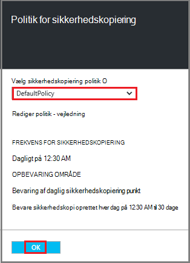

<properties
   pageTitle="Sikkerhedskopiere og gendanne krypteret FOS Azure sikkerhedskopiering"
   description="I denne artikel omhandler sikkerhedskopien, og Gendan oplevelse for FOS krypteret med Azure Disk kryptering."
   services="backup"
   documentationCenter=""
   authors="JPallavi"
   manager="vijayts"
   editor=""/>
<tags
   ms.service="backup"
   ms.devlang="na"
   ms.topic="article"
   ms.tgt_pltfrm="na"
   ms.workload="storage-backup-recovery"
   ms.date="10/25/2016"
   ms.author="markgal; jimpark; trinadhk"/>

# Sikkerhedskopiere og gendanne krypteret FOS Azure sikkerhedskopiering

I denne artikel taler om trin til at sikkerhedskopiere og gendanne virtuelle maskiner ved hjælp af Azure sikkerhedskopiering. Den indeholder også oplysninger om understøttede scenarier, forudsætninger og fejlfindingstrin i de tilfælde fejl.

## Understøttede scenarier

> [AZURE.NOTE]
1.  Sikkerhedskopiering og gendannelse af krypterede FOS understøttes kun for ressourcestyring installeret virtuelle computere. Det understøttes ikke for klassisk virtuelle computere.  
2.  Det understøttes kun for virtuelle maskiner, der er krypteret med BitLocker krypteringsnøgle og nøgle krypteringsnøgle. Det understøttes ikke for virtuelle maskiner, der er krypteret med BitLocker krypteringsnøgle kun.  

## Forudsætninger

1.  Virtuelt er krypteret ved hjælp af [Azure Disk kryptering](../security/azure-security-disk-encryption.md). Det skal krypteres med BitLocker krypteringsnøgle og nøgle krypteringsnøgle.
2.  Gendannelse services samling er blevet oprettet og lagerplads gentagelse sæt med trin, der er nævnt i artiklen [forberede dit miljø til sikkerhedskopi](backup-azure-arm-vms-prepare.md).

## Sikkerhedskopi krypteret VM
Brug følgende trin til at angive sikkerhedskopiering mål, definere politik, konfigurere elementer og udløser sikkerhedskopi.

### Konfigurere sikkerhedskopi

1. Hvis du allerede har en gendannelse Services samling, åbne, kan du gå videre til næste trin. Hvis du ikke har en gendannelse Services samling, der er åben, men er i portalen Azure, i menuen Hub, klik på **Gennemse**.

  - Skriv **Gendannelsestjenester**på listen over ressourcer.
  - Når du begynder at skrive, filtrene liste baseret på dit input. Når du ser **gendannelse Services vaults**, kan du klikke på den.
  
        

    På listen over tjenester til genoprettelse vaults vises. På listen over tjenester til genoprettelse vaults, Vælg en samling af legitimationsoplysninger.

    Det valgte samling dashboard åbnes.

2. På listen over elementer, der vises under samling, skal du klikke på **sikkerhedskopi** for at åbne bladet sikkerhedskopi.

       
    
3. Klik på **Sikkerhedskopiér mål** for at åbne bladet sikkerhedskopi mål bladet sikkerhedskopi.

       
    
4.   Bladet sikkerhedskopiering mål Indstil **, kører arbejdsbelastningen** til Azure og **Hvad vil du gerne sikkerhedskopi** til virtuel maskine, klik derefter på **OK**.

    Bladet sikkerhedskopi mål lukker og åbner bladet sikkerhedskopi politik.

       

5. Vælg den sikkerhedskopiering politik, du vil anvende på samling af legitimationsoplysninger og klikke på **OK**på bladet sikkerhedskopi politik.

       

    Oplysninger om standardpolitikken vises detaljerne. Hvis du vil oprette en politik, skal du vælge **Opret ny** i menuen ned. Når du klikker på **OK**, er sikkerhedskopiering politikken knyttet til samling af legitimationsoplysninger.

    Vælg dernæst FOS skal knyttes til samling af legitimationsoplysninger.
    
6. Vælg de krypterede virtuelle maskiner knytte til den angivne politik, og klik på **OK**.

      
   
7. Denne side vises en meddelelse om vigtige samling, der er knyttet til de krypterede VM'er, der er markeret. Sikkerhedskopiering tjenesten kræver skrivebeskyttet adgang til de taster og hemmeligheder i den vigtige samling af legitimationsoplysninger. Disse tilladelser til sikkerhedskopiering nøgle og hemmeligt, sammen med de tilknyttede FOS bruges. 

      

      Nu, hvor du har defineret alle indstillinger for samling i bladet sikkerhedskopi skal du klikke på Aktivér sikkerhedskopi nederst på siden. Aktivér Sikkerhedskopiér installerer politikken på samling af legitimationsoplysninger og FOS.

8. Den næste fase i forberedelse installerer VM Agent, eller at sikre, at VM Agent er installeret. For at gøre det samme, ved at bruge de trin, der er nævnt i artiklen [forberede dit miljø til sikkerhedskopi](backup-azure-arm-vms-prepare.md). 

### Udløsende sikkerhedskopieringsjob
Brug de trin, der er nævnt i artiklen [Sikkerhedskopiering Azure FOS til gendannelse services samling af legitimationsoplysninger](backup-azure-arm-vms.md) for at udløse sikkerhedskopieringsjob.

## Gendanne krypteret VM
Gendanne oplevelse for krypterede og ikke-krypteret virtuelle maskiner, er den samme. Brug de trin, der er nævnt i [gendanne virtuelle maskiner Azure-portalen](backup-azure-arm-restore-vms.md) til at gendanne den krypterede VM. I tilfælde af, at du har brug at gendanne nøgler og hemmeligheder, skal du sikre dig, vigtige samling du kan gendanne dem skal allerede findes.

## Foretage fejlfinding af Logonfejl

| Handling | Flere oplysninger om fejlen | Opløsning |
| -------- | -------- | -------|
| Sikkerhedskopi | Validering mislykkedes som virtuelt er krypteret med BEK alene. Sikkerhedskopier kan kun aktiveres for virtuelle maskiner, der er krypteret med både BEK og KEK. | Virtual machine skal krypteres med BEK og KEK. Herefter skal være aktiveret sikkerhedskopi. |
| Gendanne | Du kan ikke gendanne denne krypterede VM, da vigtige samling, der er knyttet til denne VM ikke findes. | Oprette vigtige samling ved hjælp af [Introduktion til Azure nøgle samling](../key-vault/key-vault-get-started.md). Se artiklen [gendanne vigtige samling nøgle og hemmeligt Azure sikkerhedskopiering](backup-azure-restore-key-secret.md) til at gendanne nøgle og hemmeligt, hvis de ikke er til stede. |
| Gendanne | Du kan ikke gendanne denne krypterede VM, da nøgle og hemmeligt, der er knyttet til denne VM ikke findes. | Se artiklen [gendanne vigtige samling nøgle og hemmeligt Azure sikkerhedskopiering](backup-azure-restore-key-secret.md) til at gendanne nøgle og hemmeligt, hvis de ikke er til stede. |
