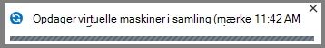

<properties
    pageTitle="Først skal se: beskytte Azure FOS med en gendannelse services samling | Microsoft Azure"
    description="Beskyt Azure FOS med en gendannelse services samling af legitimationsoplysninger. Bruge sikkerhedskopier af Ressourcestyring installeret FOS, klassisk installeret FOS og Premium lagerplads FOS til at beskytte dine data. Oprette og registrere en gendannelse services samling af legitimationsoplysninger. Registrere FOS, oprette politik og beskytte FOS i Azure."
    services="backup"
    documentationCenter=""
    authors="markgalioto"
    manager="cfreeman"
    editor=""
    keyword="backups; vm backup"/>

<tags
    ms.service="backup"
    ms.workload="storage-backup-recovery"
    ms.tgt_pltfrm="na"
    ms.devlang="na"
    ms.topic="hero-article"
    ms.date="10/13/2016"
    ms.author="markgal; jimpark"/>

# Først skal se: beskytte Azure FOS med en gendannelse services samling

> [AZURE.SELECTOR]
- [Beskytte FOS med en gendannelse services samling](backup-azure-vms-first-look-arm.md)
- [Beskytte FOS med en sikkerhedskopi samling](backup-azure-vms-first-look.md)

Dette selvstudium fører dig gennem trinnene til at oprette en gendannelse services samling af legitimationsoplysninger og sikkerhedskopiering af en Azure virtuelt (VM). Gendannelse services vaults beskytte:

- Azure ressourcestyring installeret FOS
- Klassisk FOS
- Standard lagerplads FOS
- Premium lagerplads FOS
- VM'er, der er krypteret med Azure Disk kryptering med BEK og KEK

Du kan finde flere oplysninger om at beskytte Premium lagerplads FOS se [sikkerhedskopiere og gendanne Premium lagerplads FOS](backup-introduction-to-azure-backup.md#back-up-and-restore-premium-storage-vms)

>[AZURE.NOTE] Dette selvstudium antages det, du allerede har en VM i abonnementet Azure og at du har brugt målinger tillade tjenesten sikkerhedskopiering til at få adgang til VM.

[AZURE.INCLUDE [learn-about-Azure-Backup-deployment-models](../../includes/backup-deployment-models.md)]

Her er de trin, du skal udføre på et højt niveau.  

1. Oprette en gendannelse services samling af legitimationsoplysninger for et VM.
2. Brug portalen Azure til at vælge et scenarie, angive politik og identificere elementer med at beskytte.
3. Køre den første sikkerhedskopi.

## Oprette en gendannelse services samling af legitimationsoplysninger for et VM

En samling af gendannelse services legitimationsoplysninger er en enhed, der gemmer alle sikkerhedskopiering og gendannelse punkter, der er oprettet med tiden. Gendannelse services samling indeholder også sikkerhedskopiering politikken anvendes på de beskyttede FOS.

>[AZURE.NOTE] Sikkerhedskopiere FOS er en lokal proces. Du kan ikke sikkerhedskopiere FOS fra én placering til en gendannelse services samling i en anden placering. Så for hver Azure placering, der har FOS skal sikkerhedskopieres, skal mindst én gendannelse services samling findes i den nye placering.

Sådan oprettes en gendannelse services samling af legitimationsoplysninger:

1. Log på [Azure-portalen](https://portal.azure.com/).

2. Klik på **Gennemse** , og skriv **Gendannelsestjenester**på listen over ressourcer, i menuen Hub. Når du begynder at skrive, filtrene liste baseret på dit input. Klik på **tjenester til genoprettelse samling**.

      

    På listen over gendannelse services vaults vises.

3. Klik på **Tilføj**i menuen **gendannelse Services vaults** .

    

    Gendannelse Services samling blade åbnes, beder dig om at angive et **navn**, **abonnement**, **ressourcegruppe**og **placering**.

    

4. Angiv et fuldt navn til at identificere samling af legitimationsoplysninger for **navn**. Navnet skal være entydige for Azure abonnementet. Skriv et navn, der indeholder mellem 2 og 50 tegn. Det skal starte med et bogstav og kan indeholde kun bogstaver, tal og bindestreger.

5. Klik på **abonnement** for at se den tilgængelige liste over abonnementer. Hvis du ikke er sikker på, hvilket abonnement, der skal bruges, brug standarden (eller forslag) abonnement. Der findes flere valgmuligheder, kun, hvis din virksomhedskonto er knyttet til flere Azure abonnementer.

6. **Ressourcegruppe** for at se den tilgængelige liste over grupper, eller klik på **Ny** for at oprette en ressourcegruppe. Se [Oversigt over Azure ressourcestyring](../azure-resource-manager/resource-group-overview.md) detaljerede oplysninger om grupper

7. Klik på **placering** for at vælge det geografiske område for samling af legitimationsoplysninger. Samling af legitimationsoplysninger **skal** være i samme område som de virtuelle maskiner, som du vil beskytte.

    >[AZURE.IMPORTANT] Hvis du er usikker på det sted, hvor din VM findes, Luk af samling oprettelse af dialogboksen, og gå til listen over virtuelle maskiner i portalen. Hvis du har virtuelle maskiner i flere områder, kan du oprette en gendannelse services samling i hvert område. Oprette samling af legitimationsoplysninger i den første placering før du skifter til den næste lokalitet. Der er ingen grund til at angive lagerplads konti for at gemme de sikkerhedskopierede data – gendannelse services samling og tjenesten Azure sikkerhedskopiering håndtere dette automatisk.

8. Klik på **Opret**. Det kan tage et øjeblik, før gendannelse services samling skal oprettes. Overvåge status meddelelserne i området øverst til højre på portalen. Når din samling af legitimationsoplysninger er oprettet, vises det på listen over gendannelse services vaults.

    

Nu hvor du har oprettet din samling, lære at angive lagerplads gentagelse.

### Angive lagerplads gentagelse

Replikering datalager kan du vælge mellem geografisk overflødige lager og lokalt overflødige lagerplads. Som standard har din samling geografisk overflødige lagerplads. Lad indstillingen være angivet til geografisk overflødige lagerplads, hvis dette er den primære sikkerhedskopi. Vælg lokalt overflødige lagerplads, hvis du ønsker en billigere indstilling, der ikke er så robust. Få mere at vide om [geografisk overflødige](../storage/storage-redundancy.md#geo-redundant-storage) og [lokalt overflødige](../storage/storage-redundancy.md#locally-redundant-storage) indstillinger for lagring i [Azure-lager gentagelse oversigt](../storage/storage-redundancy.md).

Sådan redigerer du indstillingen lagerplads gentagelse:

1. Vælg din samling af legitimationsoplysninger til at åbne dashboardet samling af legitimationsoplysninger og bladet indstillinger. Hvis bladet **Indstillinger** ikke åbnes, skal du klikke på **alle indstillinger** i dashboardet samling af legitimationsoplysninger.

2. Bladet **Indstillinger** , klik på **Sikkerhedskopiér infrastruktur** > **Sikkerhedskopi konfiguration** til at åbne bladet **Sikkerhedskopi konfiguration** . Vælg gentagelse datalager til din samling på bladet **Sikkerhedskopi konfiguration** .

    

    Når du har valgt indstillingen lagerplads for dit samling, er du klar til at knytte VM til samling af legitimationsoplysninger. For at starte tilknytningen, skal du finde og registrere Azure virtuelle computere.

## Vælg et ekstra mål, angive politik og definere elementer til at beskytte

Kør processen til registrering for at sikre, at alle nye virtuelle maskiner, der er føjet til abonnementet identificeres, før du registrerer en VM med en samling af legitimationsoplysninger. Processen forespørgsler Azure til listen over virtuelle maskiner i abonnementet, sammen med yderligere oplysninger som navnet på skyen tjenesten og området. På portalen Azure refererer scenarie til hvad du skal sætte i gendannelse services samling. Politikken er planen for hvor ofte og hvornår gendannelse punkter er taget. Politik indeholder også opbevaring området for de gendannelse punkter.

1. Hvis du allerede har en samling af legitimationsoplysninger åbne tjenester til genoprettelse, kan du gå videre til trin 2. Hvis du ikke har en genoprettelse services samling, der er åben, men er i portalen Azure, i menuen Hub, klik på **Gennemse**.

  - Skriv **Gendannelsestjenester**på listen over ressourcer.
  - Når du begynder at skrive, filtrene liste baseret på dit input. Når du ser **gendannelse Services vaults**, kan du klikke på den.

      

    På listen over gendannelse services vaults vises.
  - På listen over gendannelse services vaults, Vælg en samling af legitimationsoplysninger.

    Det valgte samling dashboard åbnes.

    

2. Klik på **sikkerhedskopi** for at åbne bladet sikkerhedskopi i menuen samling dashboard.

    

    Når bladet åbnes, skal søger tjenesten sikkerhedskopi efter en hvilken som helst nye FOS i abonnement.

    

3. Klik på **Sikkerhedskopiér mål** for at åbne bladet sikkerhedskopi mål bladet sikkerhedskopi.

    

4. Bladet sikkerhedskopiering mål Indstil **, kører arbejdsbelastningen** til Azure og **Hvad vil du gerne sikkerhedskopi** til virtuel maskine, klik derefter på **OK**.

    Bladet sikkerhedskopi mål lukker og åbner bladet sikkerhedskopi politik.

    

5. Vælg den sikkerhedskopiering politik, du vil anvende på samling af legitimationsoplysninger og klikke på **OK**på bladet sikkerhedskopi politik.

    

    Oplysninger om standardpolitikken vises detaljerne. Hvis du vil oprette en politik, skal du vælge **Opret ny** i menuen ned. I rullemenuen også giver mulighed for at skifte den tid, når snapshot sættes til 7 PM. Yderligere oplysninger om definere en politik for en sikkerhedskopi, du [definerer en politik for sikkerhedskopiering](backup-azure-vms-first-look-arm.md#defining-a-backup-policy). Når du klikker på **OK**, er sikkerhedskopiering politikken knyttet til samling af legitimationsoplysninger.

    Vælg dernæst FOS skal knyttes til samling af legitimationsoplysninger.

6. Vælg de virtuelle maskiner knytte til den angivne politik, og klik på **Vælg**.

    

    Hvis du ikke kan se den ønskede VM, kan du kontrollere, at den findes i den samme Azure placering som samling af legitimationsoplysninger gendannelsestjenester.

7. Nu, hvor du har defineret alle indstillinger for samling i bladet sikkerhedskopi skal du klikke på **Aktivér sikkerhedskopi** nederst på siden. Dette installerer politikken på samling af legitimationsoplysninger og FOS.

    

## Første sikkerhedskopi

Når en politik for sikkerhedskopiering er blevet installeret på den virtuelle maskine, ikke betyder det er blevet sikkerhedskopieret dataene. Som standard er den første planlagte sikkerhedskopiering (som defineret i politikken sikkerhedskopiering) den indledende sikkerhedskopiering. Før den første sikkerhedskopi forekommer, viser Status for den sidste sikkerhedskopiering på bladet **Sikkerhedskopieringsjob** som **Advarsel (indledende sikkerhedskopi afventer)**.

Medmindre sikkerhedskopien indledende forfalder til at starte snart, anbefales det, at du kører **Sikkerhedskopier nu**.

Sådan køres **sikkerhedskopiere nu**:

1. På dashboardet til samling i feltet **sikkerhedskopi** , skal du klikke på **virtuelle Azure-computere**  
    

    Bladet **Sikkerhedskopi elementer** åbnes.

2. Højreklik på den samling, du vil sikkerhedskopiere bladet **Sikkerhedskopi elementer** , og klik på **Opret sikkerhedskopi nu**.

    

    Sikkerhedskopi jobbet udløses.  

    

3. For at få vist, at din indledende sikkerhedskopi er afsluttet på dashboardet til samling i feltet **Sikkerhedskopieringsjob** , skal du klikke på **Azure virtuelle computere**.

    

    Bladet sikkerhedskopi job åbnes.

4. Du kan se status for alle job i bladet sikkerhedskopi job.

    

    >[AZURE.NOTE] Som en del af sikkerhedskopieringen udsteder tjenesten Azure sikkerhedskopiering en kommando til filtypenavnet sikkerhedskopiering i hver VM til at rydde alle skriver og tage et ensartet øjebliksbillede.

    Når sikkerhedskopieringen er fuldført, er status *fuldført*.

[AZURE.INCLUDE [backup-create-backup-policy-for-vm](../../includes/backup-create-backup-policy-for-vm.md)]

## Installere VM Agent på den virtuelle maskine

Disse oplysninger er tilgængelig, hvis det er nødvendigt. Azure VM Agent skal være installeret på en Azure virtuel maskine til filtypenavnet sikkerhedskopi til at arbejde. Hvis din VM blev oprettet ud fra galleriet Azure, derefter er VM Agent dog allerede findes på den virtuelle maskine. VM'er, der overføres fra lokale datacentre VM Agent er ikke installeret. I så fald skal VM Agent være installeret. Hvis du har problemer med at sikkerhedskopiere Azure VM, kan du kontrollere, at Azure VM Agent korrekt er installeret på den virtuelle maskine (se tabellen nedenfor). Hvis du opretter en brugerdefineret VM, er [sikre, at afkrydsningsfeltet **Installer VM Agent** er markeret](../virtual-machines/virtual-machines-windows-classic-agents-and-extensions.md) , før den virtuelle maskine klargjort.

Få mere at vide om [VM Agent](https://go.microsoft.com/fwLink/?LinkID=390493&clcid=0x409) og [hvordan du installerer programmet](../virtual-machines/virtual-machines-windows-classic-manage-extensions.md).

Den følgende tabel indeholder flere oplysninger om VM Agent til Windows og Linux FOS.

| **Handling** | **Windows** | **Linux** |
| --- | --- | --- |
| Installere VM Agent | <li>Hent og Installer [agent MSI](http://go.microsoft.com/fwlink/?LinkID=394789&clcid=0x409). Du skal have administratorrettigheder for at fuldføre installationen. <li>[Opdatere egenskaben VM](http://blogs.msdn.com/b/mast/archive/2014/04/08/install-the-vm-agent-on-an-existing-azure-vm.aspx) til at angive, at agenten er installeret. | <li> Du kan installere den nyeste version [Linux agent](https://github.com/Azure/WALinuxAgent) fra GitHub. Du skal have administratorrettigheder for at fuldføre installationen. <li> [Opdatere egenskaben VM](http://blogs.msdn.com/b/mast/archive/2014/04/08/install-the-vm-agent-on-an-existing-azure-vm.aspx) til at angive, at agenten er installeret. |
| Opdatere VM Agent | Opdatere VM Agent er så enkelt som geninstallere [VM Agent binære filer](http://go.microsoft.com/fwlink/?LinkID=394789&clcid=0x409).  Sørg for, at ingen sikkerhedskopieringen kører, mens VM agent opdateres. | Følg vejledningen i [opdatere Linux VM Agent ](../virtual-machines-linux-update-agent.md).  Sørg for, at ingen sikkerhedskopieringen kører, mens VM Agent opdateres. |
| Validere VM Agent-installation | <li>Gå til mappen *C:\WindowsAzure\Packages* i Azure VM. <li>Du skal finde filen WaAppAgent.exe Præsenter.<li> Højreklik på filen, gå til **Egenskaber**, og vælg derefter fanen **Detaljer** . Feltet produktversion skal være 2.6.1198.718 eller nyere. | I/T. |

### Sikkerhedskopiering lokalnummer

Når VM Agent er installeret på den virtuelle maskine, installeres tjenesten Azure sikkerhedskopiering filtypenavnet sikkerhedskopiering til VM Agent. Tjenesten Azure sikkerhedskopiering opgraderer problemfrit og programrettelser filtypenavnet sikkerhedskopiering uden yderligere brugerinput.

Filtypenavnet sikkerhedskopiering er installeret af tjenesten sikkerhedskopi om VM kører. En igangværende VM indeholder den største mulighed for at få et ensartet programmet gendannelsespunkt. Tjenesten Azure sikkerhedskopi stadig dog sikkerhedskopiere VM, selvom den er slået fra, og filtypenavnet blev ikke installeret. Dette kaldes Offline VM. I dette tilfælde bliver punktet gendannelse *nedbrud ensartet*.

## Oplysninger om fejlfinding
Hvis du har problemer med dig med at udføre nogle af opgaverne i denne artikel, skal du kontakte [fejlfinding vejledning](backup-azure-vms-troubleshoot.md).

## Priser
Azure VM sikkerhedskopi, debiteres baseret på beskyttet forekomster model. Få mere at vide mere om [Sikkerhedskopiering priser](https://azure.microsoft.com/pricing/details/backup/)

## Har du spørgsmål?
Hvis du har spørgsmål, eller hvis der er en funktion, som du gerne vil se inkluderet, [sende feedback til os](http://aka.ms/azurebackup_feedback).
