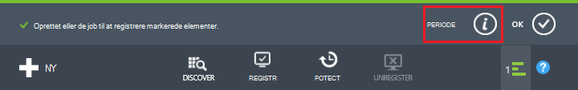
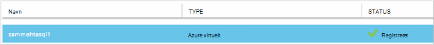
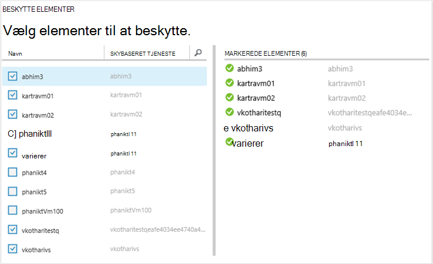
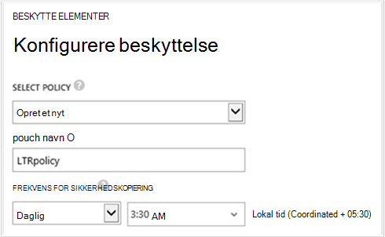
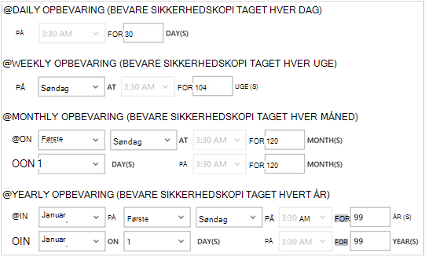
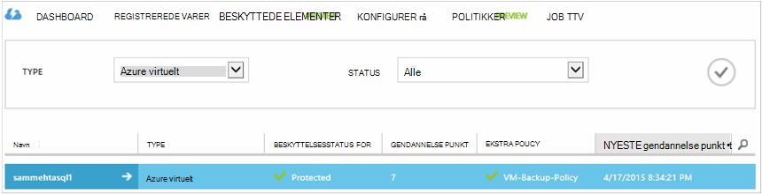

<properties
    pageTitle="Første kig: Beskytte Azure FOS med en sikkerhedskopi samling | Microsoft Azure"
    description="Beskyt Azure FOS med sikkerhedskopi samling. Selvstudium beskrives det, oprette samling, registrere FOS, oprette politik og beskytte FOS i Azure."
    services="backup"
    documentationCenter=""
    authors="markgalioto"
    manager="cfreeman"
    editor=""/>

<tags
    ms.service="backup"
    ms.workload="storage-backup-recovery"
    ms.tgt_pltfrm="na"
    ms.devlang="na"
    ms.topic="hero-article"
    ms.date="09/15/2016"
    ms.author="markgal; jimpark"/>

# Først skal se: sikkerhedskopiere Azure virtuelle maskiner

> [AZURE.SELECTOR]
- [Beskytte FOS med en gendannelse services samling](backup-azure-vms-first-look-arm.md)
- [Beskytte Azure FOS med en sikkerhedskopi samling](backup-azure-vms-first-look.md)

Dette selvstudium fører dig gennem trinnene til at sikkerhedskopiere en Azure VM (virtual machine) til en sikkerhedskopi samling af legitimationsoplysninger i Azure. I denne artikel beskrives modellen Klassisk eller Service Manager implementeringsmodel til at sikkerhedskopiere FOS. Hvis du er interesseret i at sikkerhedskopiering af en VM til en samling af legitimationsoplysninger gendannelsestjenester, der tilhører en ressourcegruppe, se [først se: beskytte FOS med en gendannelse services samling](backup-azure-vms-first-look-arm.md). Hvis du gennemfører dette selvstudium, skal disse forudsætninger, der findes:

- Du har oprettet en VM i abonnementet Azure.
- VM har forbindelse til Azure offentlige IP-adresser. Du kan finde flere oplysninger, skal [netværksforbindelsen](./backup-azure-vms-prepare.md#network-connectivity).

Hvis du vil sikkerhedskopiere en VM, er der fem hovedtrin:  

 Opret en sikkerhedskopi samling eller Identificer en eksisterende sikkerhedskopiering samling.  
 bruge Azure klassisk portal at registrere og registrere virtuelle computere.  
 installere VM Agent.  
 oprette politik for beskyttelse af virtuelle maskiner.  
 køre sikkerhedskopien.

>[AZURE.NOTE] Azure har to installation modeller til oprettelse og arbejde med ressourcer: [ressourcestyring og klassisk](../resource-manager-deployment-model.md). Dette selvstudium er til brug sammen med de VM'er, der kan oprettes i portalen Azure klassisk. Tjenesten Azure sikkerhedskopi understøtter ressourcestyring-baserede FOS. Få mere at vide om sikkerhedskopiering af FOS til en gendannelse services samling se [First Look: beskytte FOS med en gendannelse services samling](backup-azure-vms-first-look-arm.md).

## Trin 1 – oprette en sikkerhedskopi samling af legitimationsoplysninger for et VM

En ekstra samling af legitimationsoplysninger er en enhed, der gemmer alle sikkerhedskopiering og gendannelse punkter, der er oprettet med tiden. Sikkerhedskopiering samling indeholder også de ekstra politikker, der er anvendt på de virtuelle maskiner sikkerhedskopieres.

1. Log på [Azure klassisk portal](http://manage.windowsazure.com/).

2. Klik på **Ny** i det nederste venstre hjørne af portalen Azure

    

3. Klik på **Data Services**i guiden Hurtig Opret > **Gendannelse Services** > **Sikkerhedskopi samling** > **Hurtig oprettelse**.

    

    Guiden beder dig om **navn** og **område**. Hvis du administrerer mere end ét abonnement, vises en dialogboks til valg af abonnementet.

4. Angiv et fuldt navn til at identificere samling af legitimationsoplysninger for **navn**. Navnet skal være entydige for Azure abonnementet.

5. Vælg det geografiske område for samling af legitimationsoplysninger i **område**. Samling af legitimationsoplysninger **skal** være i samme område som de virtuelle maskiner, det beskytter.

    Hvis du ikke kender det område, hvor din VM findes, lukke guiden, og klik på **virtuelle maskiner** på listen over Azure tjenester. Kolonnen placering indeholder navnet på området. Hvis du har virtuelle maskiner i flere områder, kan du oprette en sikkerhedskopi samling i hvert område.

6. Hvis der er ingen **abonnement** dialogboksen i guiden skal du gå videre til næste trin. Hvis du arbejder med flere abonnementer, Vælg et abonnement, der skal knyttes til den nye sikkerhedskopiering samling af legitimationsoplysninger.

    

7. Klik på **Opret samling af legitimationsoplysninger**. Det kan tage et øjeblik, før den ekstra samling af legitimationsoplysninger skal oprettes. Overvåge status meddelelserne nederst på portalen.

    

    En meddelelse om bekræftelse samling af legitimationsoplysninger er blevet oprettet. Det er anført på siden **gendannelsestjenester** som **aktiv**.

    

8. Vælg den samling, du har oprettet for at åbne siden **Hurtig Start** på listen over vaults på siden **Gendannelse Services** .

    

9. Klik på **Konfigurer** for at åbne gentagelse datalager på siden **Hurtig Start** .
    

10. Vælg indstillingen gentagelse til din samling på indstillingen **lagerplads gentagelse** .

    

    Som standard har din samling geografisk overflødige lagerplads. Vælg geografisk overflødige lagerplads, hvis dette er den primære sikkerhedskopi. Vælg lokalt overflødige lagerplads, hvis du ønsker en billigere indstilling, der ikke er helt som robust. Få mere at vide om indstillinger for geografisk overflødige og lokalt overflødige lagring i [Azure-lager gentagelse oversigt](../storage/storage-redundancy.md).

Når du har valgt indstillingen lagerplads for dit samling, er du klar til at knytte VM til samling af legitimationsoplysninger. For at starte tilknytningen, opdage og registrere Azure virtuelle computere.

## Trin 2 – finde og virtuelle registrere Azure-computere
Kør processen til registrering for at vælge en ny FOS, før du registrerer VM med en samling af legitimationsoplysninger. Dette returnerer en liste over virtuelle maskiner i abonnementet, sammen med yderligere oplysninger som navnet på skyen tjenesten og området.

1. Log på [Azure klassisk portal](http://manage.windowsazure.com/)

2. Klik på **Gendannelse Services** for at åbne listen over tjenester til genoprettelse vaults i Azure klassisk portalen.
    

3. På listen over vaults, Vælg samling af legitimationsoplysninger til at sikkerhedskopiere en VM.

    Når du vælger din samling, åbnes den i **Hurtig Start** -siden

4. Klik på **Registered elementer**fra menuen samling af legitimationsoplysninger.

    

5. Vælg **Azure Virtual Machine**fra menuen **Type** .

    

6. Klik på **Find** nederst på siden.
    

    Søgningen kan tage et par minutter, mens de virtuelle maskiner er der i tabelform. Er der en meddelelse nederst på skærmen, som giver dig besked, processen kører.

    

    Besked om ændringerne, når processen er fuldført.

    

7. Klik på **Registrer** nederst på siden.
    

8. Vælg de virtuelle maskiner, som du vil registrere i genvejsmenuen **Registrere elementer** .

    >[AZURE.TIP] Flere virtuelle maskiner kan registreres ad gangen.

    Der oprettes et job for hver virtuelt, du har markeret.

9. Klik på **Periode** i meddelelsen for at gå til siden **sager** .

    

    Den virtuelle maskine vises også på listen over registrerede elementer sammen med status for handlingen registrering.

    

    Når handlingen er fuldført, ændres status til at afspejle tilstanden *registreret* .

    

## Trin 3 – Installer VM Agent på den virtuelle maskine

Azure VM Agent skal være installeret på en Azure virtuel maskine til filtypenavnet sikkerhedskopi til at arbejde. Hvis din VM blev oprettet ud fra galleriet Azure, findes VM Agent allerede på VM. Du kan springe til at [beskytte din FOS](backup-azure-vms-first-look.md#step-4-protect-azure-virtual-machines).

Hvis din VM opgraderet fra en lokal datacenter, har hvor VM sandsynligvis ikke den VM Agent er installeret. Du skal installere VM Agent på den virtuelle maskine, før du fortsætter med at beskytte VM. Detaljeret vejledning til installation VM Agent, skal du se [VM Agent afsnit i artiklen sikkerhedskopi FOS](backup-azure-vms-prepare.md#vm-agent).

## Trin 4 – oprette politikken sikkerhedskopiering
Før du udløse den indledende sikkerhedskopiering, angive tidsplanen, når sikkerhedskopiering snapshots er taget. Planlægge, hvornår sikkerhedskopiering snapshots er taget, og hvor lang tid disse snapshots bevares, er den ekstra politik. Oplysningerne om opbevaring er baseret på bedstefar-far-søn sikkerhedskopiering rotation farveskema.

1. Gå til den ekstra samling af legitimationsoplysninger under **Gendannelsestjenester** i portalen Azure klassisk, og klik på **Registered elementer**.
2. Vælg **Azure virtuelt** i rullemenuen.

    

3. Klik på **Beskyt** nederst på siden.
    

    **Beskytte elementer guiden** vises og viser *kun* virtuelle maskiner, der er registreret og ikke er beskyttet.

    

4. Vælg de virtuelle maskiner, som du vil beskytte.

    Hvis der er to eller flere virtuelle maskiner med samme navn, skal du bruge Skytjenesten til at skelne mellem virtuelle maskiner.

5. Vælg en eksisterende politik i menuen **Konfigurer beskyttelse** eller Opret en ny politik for at beskytte de virtuelle maskiner, som du identificerede.

    Ny sikkerhedskopi vaults har en standardpolitik, der er knyttet til samling af legitimationsoplysninger. Denne politik har en daglig snapshot hver aften, og det daglige øjebliksbillede bevares i 30 dage. Hver ekstra politik kan have flere virtuelle maskiner, der er knyttet til den. Den virtuelle maskine kan kun dog knyttet til en politik ad gangen.

    

    >[AZURE.NOTE] En politik for sikkerhedskopiering omfatter et opbevaring farveskema efter de planlagte sikkerhedskopier. Hvis du vælger en eksisterende sikkerhedskopiering politik, kan du ikke redigere indstillingerne opbevaring i næste trin.

6. Definere dagligt, ugentligt, månedlige og årlige omfanget for de specifikke sikkerhedskopiering punkter af **Opbevaring område** .

    

    Opbevaringspolitik angiver, hvor lang tid til at gemme en sikkerhedskopi. Du kan angive forskellige opbevaringspolitikker baseret på, når sikkerhedskopieringen er taget.

7. Klik på **Jobs** for at få vist en liste over **Konfigurere beskyttelse** job.

    

    Nu hvor du har oprettet politikken, gå til næste trin og køre den første sikkerhedskopi.

## Trin 5 – indledende sikkerhedskopi

Når en virtuel maskine er beskyttet med en politik, kan du få vist relationen under fanen **Beskyttede elementer** . Før den første sikkerhedskopi forekommer, viser **Beskyttelsesstatus** som **beskyttet - (afventer indledende sikkerhedskopi)**. Som standard er den første planlagte sikkerhedskopiering *første sikkerhedskopi*.

Sådan starter den første sikkerhedskopi nu:

1. Klik på **Sikkerhedskopiér nu** nederst på siden på siden **Beskyttede elementer** .
    

    Tjenesten Azure Sikkerhedskopiering opretter en sikkerhedskopi til den første sikkerhedskopiering.

2. Klik på fanen **job** for at få vist en liste over job.

    

    Når første sikkerhedskopi er fuldført, er status for den virtuelle maskine under fanen **Beskyttet elementer** *beskyttet*.

    

    >[AZURE.NOTE] Sikkerhedskopiere virtuelle maskiner er en lokal proces. Du kan ikke sikkerhedskopiere virtuelle maskiner fra ét område til en sikkerhedskopi samling af legitimationsoplysninger i et andet område. Så for hver Azure område, der indeholder VM'er, der skal sikkerhedskopieres skal mindst én sikkerhedskopiering samling oprettes i det pågældende område.

## Næste trin
Nu hvor du har sikkerhedskopieret en VM, er der flere næste trin, der kunne være af interesse. De fleste logiske trin er at blive fortrolig med gendannelse af data til en VM. Der er dog administrationsopgaver, der hjælper dig med at forstå, hvordan du kan beskytte dine data og minimere omkostninger.

- [Administrere og overvåge virtuelle maskiner](backup-azure-manage-vms.md)
- [Gendanne virtuelle maskiner](backup-azure-restore-vms.md)
- [Vejledning til fejlfinding](backup-azure-vms-troubleshoot.md)

## Har du spørgsmål?
Hvis du har spørgsmål, eller hvis der er en funktion, som du gerne vil se inkluderet, [sende feedback til os](http://aka.ms/azurebackup_feedback).
