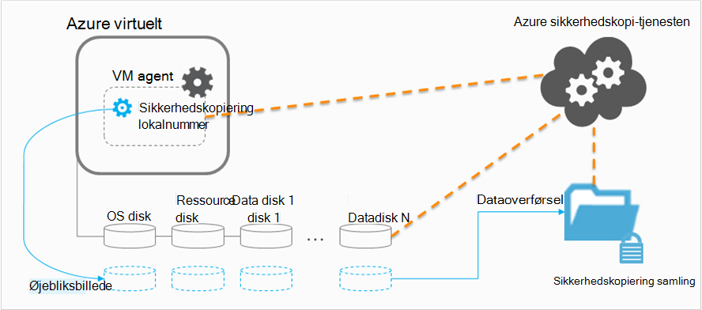

<properties
    pageTitle="Planlægge infrastrukturen VM sikkerhedskopiering i Azure | Microsoft Azure"
    description="Vigtige overvejelser, når du planlægger at sikkerhedskopiere virtuelle maskiner i Azure"
    services="backup"
    documentationCenter=""
    authors="markgalioto"
    manager="cfreeman"
    editor=""
    keywords="Sikkerhedskopiér FOS, sikkerhedskopiere virtuelle maskiner"/>

<tags
    ms.service="backup"
    ms.workload="storage-backup-recovery"
    ms.tgt_pltfrm="na"
    ms.devlang="na"
    ms.topic="article"
    ms.date="10/19/2016"
    ms.author="trinadhk; jimpark; markgal;"/>

# <a name="plan-your-vm-backup-infrastructure-in-azure"></a>Planlægge infrastrukturen VM sikkerhedskopiering i Azure
Denne artikel indeholder ydeevne og ressource forslag kan hjælpe dig med at planlægge infrastrukturen VM sikkerhedskopiering. Den definerer også vigtige aspekter af tjenesten sikkerhedskopi; disse aspekter kan være kritiske ved fastlæggelse af din arkitektur kapacitet og -planlægning. Hvis du har [forberedt dit miljø](backup-azure-vms-prepare.md), er dette det næste trin, før du begynder [at sikkerhedskopiering FOS](backup-azure-vms.md). Hvis du har brug for flere oplysninger om Azure virtuelle maskiner, kan du se den [virtuelle maskiner dokumentation](https://azure.microsoft.com/documentation/services/virtual-machines/).

## <a name="how-does-azure-back-up-virtual-machines"></a>Hvordan ved Azure sikkerhedskopiere virtuelle computere?
Når tjenesten Azure sikkerhedskopiering starter et sikkerhedskopieringsjob på det planlagte tidspunkt, udløser filtypenavnet sikkerhedskopiering for at tage et øjebliksbillede af punkt-in-time. Denne øjebliksbillede hentes sammen med den skygge tjenesten VSS (Volume Copy) til at få et ensartet øjebliksbillede af diskene i den virtuelle maskine uden at lukke den.

Når snapshot er udført, overføres dataene af tjenesten Azure sikkerhedskopien til den ekstra samling af legitimationsoplysninger. Hvis du vil gøre sikkerhedskopieringen mere effektiv, tjenesten identificerer og overfører kun blokke med data, som er blevet ændret siden den sidste sikkerhedskopiering.



Når dataoverførslen er fuldført, snapshot er fjernet, og der oprettes et gendannelsespunkt.

### <a name="data-consistency"></a>Data konsistens
Sikkerhedskopiere og gendanne business kritiske data kompliceret ved, der skal sikkerhedskopieres vigtige forretningsdata under de programmer, der giver dataene, der kører. Du kan løse dette ved indeholder Azure sikkerhedskopi program-ensartet sikkerhedskopier til arbejdsbelastninger, som Microsoft ved hjælp af VSS for at sikre, at dataene er skrevet korrekt til lager.

>[AZURE.NOTE] Til Linux virtuelle maskiner er kun fil-ensartet sikkerhedskopier muligt, da Linux ikke har en tilsvarende platform VSS.

Azure sikkerhedskopi tager VSS fuld sikkerhedskopier på Windows FOS (Læs mere om [VSS fuld sikkerhedskopiering](http://blogs.technet.com/b/filecab/archive/2008/05/21/what-is-the-difference-between-vss-full-backup-and-vss-copy-backup-in-windows-server-2008.aspx)). Aktivere VSS sikkerhedskopier den under registreringsdatabasen nøgle skal angives på VM.

```
[HKEY_LOCAL_MACHINE\SOFTWARE\MICROSOFT\BCDRAGENT]
"USEVSSCOPYBACKUP"="TRUE"
```


I følgende tabel beskrives typerne af konsistens og de betingelser, som de opstår under Azure VM sikkerhedskopiere og gendanne procedurer.

| Konsistens | VSS-baseret | FORKLARING og detaljer |
|-------------|-----------|---------|
| Programmet konsistens | Ja | Dette er typen af ideel konsistens for Microsoft arbejdsbelastninger, som det sikrer, at:<ol><li> Den VM *starter*. <li>Der er *ingen beskadigelse*. <li>Der er *ingen tab af data*.<li> Data, der svarer til det program, der bruger dataene, som bygger på tid på backup--ved hjælp af VSS.</ol> De fleste arbejdsbelastninger, som Microsoft har VSS forfattere, der gør arbejdsbelastningen-specifikke handlinger, der er relateret til data konsistens. Microsoft SQL Server har for eksempel en VSS writer, der sikrer, at skriver til loggen transaktion og databasen udføres korrekt.<br><br> Sikkerhedskopier, få et ensartet programmet gendannelsespunkt betyder, filtypenavnet sikkerhedskopiering kunne kalde VSS arbejdsprocessen og fuldfører den *korrekt* , før VM snapshot blev ført til Azure VM. Det betyder naturligvis VSS forfatterne af alle programmer i Azure VM har kaldt samt.<br><br>(Lære det [grundlæggende om VSS](http://blogs.technet.com/b/josebda/archive/2007/10/10/the-basics-of-the-volume-shadow-copy-service-vss.aspx) og kaste dig ud dybe i oplysninger om, [hvordan det fungerer](https://technet.microsoft.com/library/cc785914%28v=ws.10%29.aspx)). |
| Filsystemet konsistens | Ja – til Windows-baserede computere | Der er to scenarier, hvor det gendannelsespunkt kan være *filsystem ensartet*:<ul><li>Sikkerhedskopier af Linux FOS i Azure, da Linux ikke har en tilsvarende platform VSS.<li>VSS fejl under sikkerhedskopiering til Windows FOS i Azure.</li></ul> I begge disse tilfælde er den bedste, der kan udføres at sikre, at: <ol><li> Den VM *starter*. <li>Der er *ingen beskadigelse*.<li>Der er *ingen tab af data*.</ol> Programmer nødt til at implementere deres egen "rettelse af" ordning på de gendannede data.|
| Nedbrud konsistens | Nej | Denne situation er svarer til en virtuel maskine problemer "nedbrud" (via enten en bløde eller hårde nulstilling). Dette sker typisk, når den Azure virtuelle maskine lukkes på tidspunktet for sikkerhedskopiering. Få et ensartet nedbrud gendannelse punkt betyder, at sikkerhedskopiering af Azure giver ingen garantier omkring konsistens data på mediet lager –, enten fra perspektivet af operativsystemet eller perspektiv af programmet Azure virtuelt sikkerhedskopier. Kun data, der allerede findes på disken på tidspunktet for sikkerhedskopiering er, hvad får registreres og sikkerhedskopieret. <br/> <br/> Mens der er ingen garantier i de fleste tilfælde, starter operativsystemet. Dette er typisk efterfulgt af en kontrol af disk procedure, som chkdsk, for at løse eventuelle beskadigelse fejl. En hvilken som helst i hukommelsen data eller skriver, der ikke er blevet tømt helt til disken, går tabt. Programmet følger typisk med sit eget bekræftelse system i tilfælde af data rollback skal udføres. <br><br>Som et eksempel, hvis transaktionsloggen har poster, ikke der findes i databasen, gør derefter database-software en rollback indtil data er ensartet. Når dataene er spredt over flere virtuelle disk (som samlet enheder), indeholder et ensartet nedbrud gendannelsespunkt ingen garantier til korrektheden data.|


## <a name="performance-and-resource-utilization"></a>Ydeevne og ressource anvendelsen
Sådan sikkerhedskopiering software, der er installeret lokalt, skal du planlægge for kapacitet og ressource anvendelsen behov sikkerhedskopier FOS i Azure. [Azure lagergrænser](azure-subscription-service-limits.md#storage-limits) definere, hvordan du kan strukturere VM installationer for at få optimal ydeevne med mindste betydning for kører arbejdsmængder.

Når du planlægger sikkerhedskopiering ydeevne, skal du være opmærksom på følgende Azure lagergrænser:

- Maks udgangspunkt per lagerplads konto
- Samlede anmodning i hver lagerplads konto

### <a name="storage-account-limits"></a>Lagergrænser for konto
Når sikkerhedskopidata er kopieret fra en lagerplads-konto, skal tæller den mod input/output-operationer per second (IOP'ER) og udgangspunkt (eller overførselshastighed) målepunkter lagerplads konto. På samme tid, er de virtuelle maskiner kører og forbrug IOP'ER og overførselshastighed. Målet er at sikre den samlede trafik - sikkerhedskopiering og virtuel maskine – ikke overstiger lagergrænser for konto.

### <a name="number-of-disks"></a>Antallet af diske
Sikkerhedskopieringen forsøger at udføre en sikkerhedskopiering så hurtigt som muligt. I at gøre dette, forbruger den så mange ressourcer som muligt. Alle i/o-handlinger er dog begrænset ved *Target overførsel for enkelt Blob*, som har en begrænsning på 60 MB sekundet. I et forsøg på at maksimere sin hastighed, forsøger sikkerhedskopieringen at sikkerhedskopiere hver af de VM diske *parallelt*. Så, hvis en VM har fire diske, derefter Azure sikkerhedskopi forsøger at sikkerhedskopiere alle fire diske parallelt. På grund af dette, den vigtigste faktor afgøre sikkerhedskopiering trafik afslutte en kundekonto lagerplads er **antallet af diske** sikkerhedskopieres fra kontoen lagerplads.

### <a name="backup-schedule"></a>Planen for sikkerhedskopiering
En anden faktor, der påvirker ydeevnen er **planen for sikkerhedskopiering**. Hvis du konfigurerer politikkerne, så alle FOS sikkerhedskopieres på samme tid, er der planlagt en trafik sidder fast. Sikkerhedskopieringen forsøger at sikkerhedskopiere alle diske parallelt. En metode til at reducere den ekstra trafik fra en lagerplads konto er - sikre forskellige FOS sikkerhedskopieres på forskellige tidspunkter for dag, uden overlap.

## <a name="capacity-planning"></a>Planlægning af kapacitet
Sammensætte alle disse faktorer betyder, at lagerforbrug konto skal være planlagt korrekt. Hente [VM kapacitet til sikkerhedskopiering planlægning Excel-regneark](https://gallery.technet.microsoft.com/Azure-Backup-Storage-a46d7e33) for at se, hvilken virkning dine disk og tidsplanen for sikkerhedskopiering valgmuligheder.

### <a name="backup-throughput"></a>Sikkerhedskopiering overførselshastighed
For hver sikkerhedskopieres disk Azure sikkerhedskopiering læser blokke på disken og gemmer kun de ændrede data (trinvis sikkerhedskopiering). I denne tabel viser de gennemsnitlige overførselshastighed værdier, du kan forvente fra Azure sikkerhedskopi. Bruger, kan du anslå mængden tid, det tager for at sikkerhedskopiere en disk med en bestemt størrelse.

| Sikkerhedskopieringen | Bedst tænkelige overførselshastighed |
| ---------------- | ---------- |
| Første sikkerhedskopi | 160 Mbps |
| Trinvis sikkerhedskopiering (DR) | 640 Mbps <br><br> Denne overførselshastighed kan slippe markant, hvis der er en masse spredt transportspand på disken, der skal sikkerhedskopieres. |

## <a name="total-vm-backup-time"></a>Samlet VM sikkerhedskopiering tid
Mens en størstedelen af den ekstra tid brugt i læse og kopiere data, er der andre handlinger, der bidrager til den samlede tid, der er behov for at sikkerhedskopiere en VM:

- Tid, der er behov for at [installere eller opdatere filtypenavnet sikkerhedskopiering](backup-azure-vms.md#offline-vms).
- Øjebliksbillede tid, som er den tid, det tager at udløse et øjebliksbillede. Snapshots udløses tæt på det planlagte tidspunkt.
- Ventetid i kø. Da tjenesten sikkerhedskopi behandles sikkerhedskopier fra flere forskellige kunder, kopiere sikkerhedskopidataene fra øjebliksbillede til sikkerhedskopiering eller gendannelse Services samling muligvis ikke starter med det samme. I tidspunkter for spidsbelastning indlæse, ventetiden kan Stræk op til otte timer på grund af antallet af sikkerhedskopier behandles. Den samlede tid for sikkerhedskopiering VM vil dog være mindre end 24 timer for daglig sikkerhedskopiering politikker.

## <a name="best-practices"></a>Bedste fremgangsmåder
Vi anbefaler, at følge disse fremgangsmåder under konfiguration af sikkerhedskopier til virtuelle maskiner:

- Ikke planlægge mere end fire klassisk FOS fra samme skytjenesten til at sikkerhedskopiere på samme tid. Vi anbefaler, at sikkerhedskopiering starttidspunkter fordeling med en time, hvis du vil sikkerhedskopiere flere FOS fra samme skybaseret tjeneste.
- Planlæg ikke mere end 40 ressourcestyring installeret FOS til at sikkerhedskopiere på samme tid.
- Planlægge VM sikkerhedskopier i top-tidsrum, så tjenesten Sikkerhedskopiering bruger IOP'ER for overførsel af data fra lagerplads kundekonto til sikkerhedskopien eller gendannelse Services samling.
- Sørg for, at en politik adresser FOS udbrede forskellige lagerplads konti. Vi anbefaler, at højst 20 samlede diske fra en enkelt lagerplads konto være beskyttet af én politik. Hvis du har mere end 20 diske med en konto med lagerplads, udbrede disse FOS flere politikker for at få de nødvendige IOP'ER i fasen overførsel af sikkerhedskopieringen.
- Kan ikke gendanne en VM, der kører på Premium lagerplads til samme lagerplads-konto. Hvis handlingen gendannelsen falder sammen med sikkerhedskopieringen, reduceres tilgængelige IOP'ER til sikkerhedskopi.
- Vi anbefaler kører hver Premium VM på en særskilt premium lagerplads konto for at sikre optimal sikkerhedskopiering ydeevne.

## <a name="data-encryption"></a>Kryptering af data

Azure sikkerhedskopi krypterer ikke data som en del af sikkerhedskopieringen. Men du kan kryptere data i VM og sikkerhedskopiere beskyttet dataene problemfrit (Læs mere om [Sikkerhedskopiering af krypterede data](backup-azure-vms-encryption.md)).


## <a name="how-are-protected-instances-calculated"></a>Hvordan beregnes beskyttet forekomster?
Azure virtuelle maskiner, der sikkerhedskopieres via Azure Backup er underlagt [Azure sikkerhedskopi priser](https://azure.microsoft.com/pricing/details/backup/). Beskyttet forekomster beregningen er baseret på den *faktiske* størrelse på den virtuelle maskine, som er summen af alle data i den virtuelle maskine – med undtagelse af "ressource disken".

Du er *ikke* faktureret baseret på den maksimale størrelse, der understøttes for hver datadisk, der er knyttet til den virtuelle maskine, men på de faktiske data, der er gemt i disken data. På samme måde, ekstra lagerplads faktura er baseret på mængden data, der er gemt med Azure sikkerhedskopiering, som er summen af de faktiske data i hvert gendannelsespunkt.

For eksempel tage en A2 Standard-tilpasset virtuel maskine, der er to yderligere data diske med en maksimal størrelse på 1 TB. Tabellen nedenfor giver de faktiske data, der er gemt på hver af disse diske:

|Disken type|Maksimal størrelse|Faktiske data Præsenter|
|---------|--------|------|
| Operativsystem disk | 1023 GB | 17 GB |
| Lokal disk / ressource disk | 135 GB | 5 GB (ikke medtaget i sikkerhedskopieringen) |
| Datadisk 1 | 1023 GB | 30 GB |
| Datadisk 2 | 1023 GB | 0 GB |

I dette tilfælde er den *faktiske* størrelse på den virtuelle maskine 17 GB + 30 GB + 0 GB = 47 GB. Det bliver beskyttet forekomst størrelsen, som den månedlige faktura er baseret på. Efterhånden som mængden data i den virtuelle maskine vokser, ændre beskyttet forekomst størrelsen bruges til fakturering også i overensstemmelse hermed.

Fakturering starter ikke, før den første vellykkede sikkerhedskopiering er afsluttet. På dette tidspunkt begynder fakturering for både lager og beskyttet forekomster. Fakturering fortsætter, så længe der er *en hvilken som helst sikkerhedskopidata, der er gemt med Azure sikkerhedskopiering* for den virtuelle maskine. Udføre handlingen Stop beskyttelse forhindrer ikke faktureringen, hvis de sikkerhedskopierede data bevares.

Vil ikke længere fakturering for en bestemt virtuel maskine, kun hvis beskyttelsen er holdt op med at *og* en hvilken som helst sikkerhedskopidata slettes. Når der ikke er nogen aktive sikkerhedskopieringsjob (når beskyttelse er stoppet), bliver størrelsen på den virtuelle maskine på tidspunktet for den sidste vellykkede sikkerhedskopiering beskyttet forekomst størrelsen, som den månedlige faktura er baseret på.

## <a name="questions"></a>Har du spørgsmål?
Hvis du har spørgsmål, eller hvis der er en funktion, som du gerne vil se inkluderet, [sende feedback til os](http://aka.ms/azurebackup_feedback).

## <a name="next-steps"></a>Næste trin

- [Sikkerhedskopiere virtuelle maskiner](backup-azure-vms.md)
- [Administrere virtuelt sikkerhedskopi](backup-azure-manage-vms.md)
- [Gendanne virtuelle maskiner](backup-azure-restore-vms.md)
- [Foretage fejlfinding af VM sikkerhedskopiering problemer](backup-azure-vms-troubleshoot.md)
