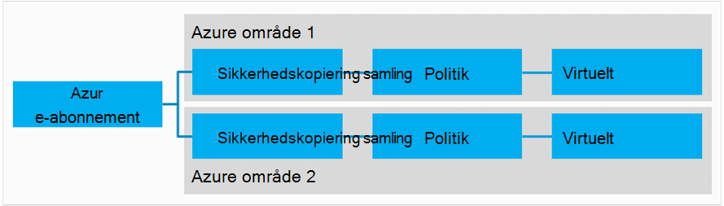
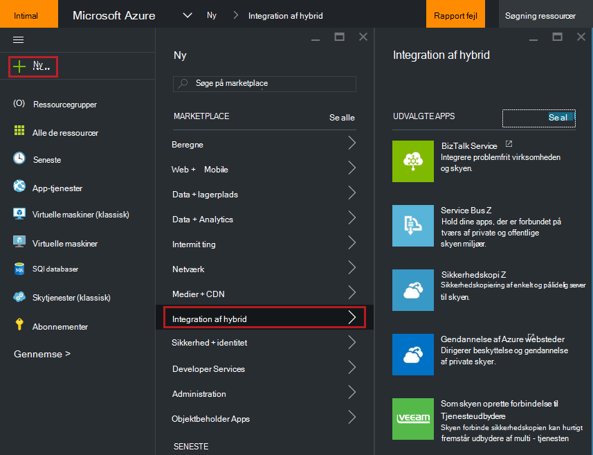
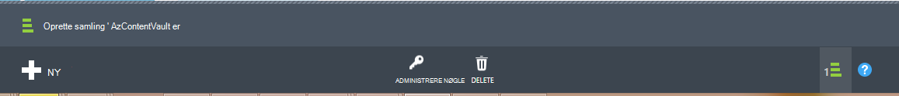
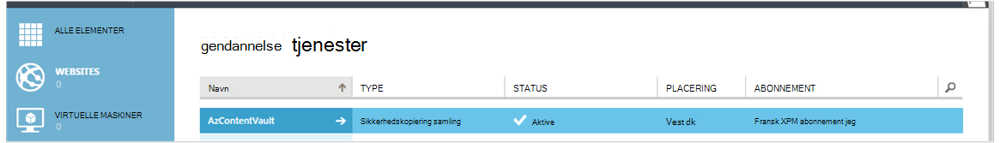
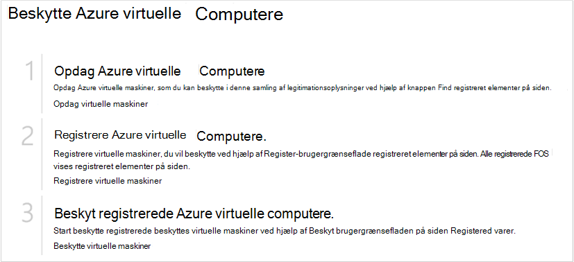
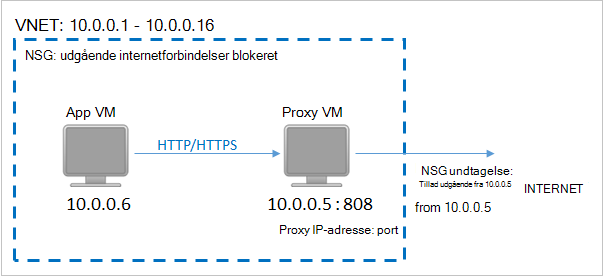
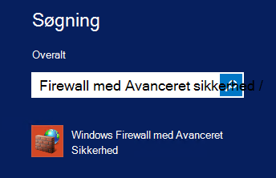
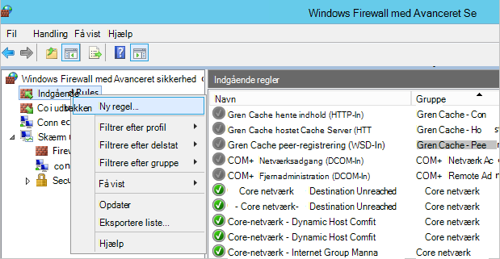
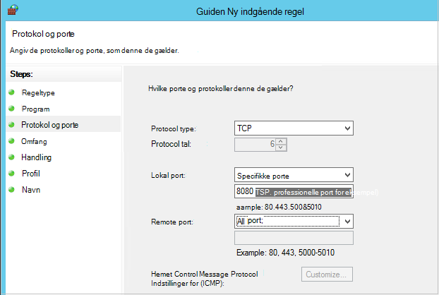

<properties
    pageTitle="Forberede dit miljø til at sikkerhedskopiere Azure virtuelle maskiner | Microsoft Azure"
    description="Sørg for, at dit miljø er parat til at sikkerhedskopiere virtuelle maskiner i Azure"
    services="backup"
    documentationCenter=""
    authors="markgalioto"
    manager="cfreeman"
    editor=""
    keywords="sikkerhedskopier. sikkerhedskopiere;"/>

<tags
    ms.service="backup"
    ms.workload="storage-backup-recovery"
    ms.tgt_pltfrm="na"
    ms.devlang="na"
    ms.topic="article"
    ms.date="08/26/2016"
    ms.author="trinadhk; jimpark; markgal;"/>


# <a name="prepare-your-environment-to-back-up-azure-virtual-machines"></a>Forberede dit miljø til at sikkerhedskopiere Azure virtuelle maskiner

> [AZURE.SELECTOR]
- [Ressource manager model](backup-azure-arm-vms-prepare.md)
- [Klassisk model](backup-azure-vms-prepare.md)

Før du kan sikkerhedskopiere en Azure VM (virtual machine), er der tre betingelser, der skal findes.

- Du skal oprette en sikkerhedskopi samling eller identificere en eksisterende sikkerhedskopiering samling *i samme område som din VM*.
- Oprette netværksforbindelse mellem Azure offentlige internetadresser og slutpunkterne Azure-lager.
- Installere VM agent på VM.

Hvis du kender disse betingelser, der allerede findes i dit miljø derefter gå videre til den [sikkerhedskopiere din FOS artikel](backup-azure-vms.md). Ellers skal fører du læse videre, i denne artikel dig gennem trinnene til at forberede dit miljø til at sikkerhedskopiere en Azure VM.


## <a name="limitations-when-backing-up-and-restoring-a-vm"></a>Begrænsninger, når sikkerhedskopiere og gendanne en VM

>[AZURE.NOTE] Azure har to installation modeller til oprettelse og arbejde med ressourcer: [ressourcestyring og klassisk](../resource-manager-deployment-model.md). Følgende liste indeholder begrænsninger, når du installerer i klassisk modellen.

- Sikkerhedskopiere virtuelle maskiner med mere end 16 datadisce understøttes ikke.
- Sikkerhedskopiere virtuelle maskiner med en reserverede IP-adresse og ingen defineret slutpunkt understøttes ikke.
- Sikkerhedskopiere data omfatter ikke tilsluttet netværksdrev knyttet til VM. 
- Erstatte en eksisterende virtuelt under gendannelse understøttes ikke. Først slette eksisterende virtuelt og alle tilknyttede diske, og derefter gendanne dataene fra sikkerhedskopien.
- Tværs område sikkerhedskopiering og gendannelse understøttes ikke.
- Sikkerhedskopiere virtuelle maskiner ved hjælp af tjenesten Azure sikkerhedskopi understøttes i alle offentlige områder af Azure (se [tjekliste](https://azure.microsoft.com/regions/#services) over understøttede områder). Hvis det område, du søger efter, er ikke-understøttede i dag, vises den ikke på rullelisten under oprettelse af samling af legitimationsoplysninger.
- Sikkerhedskopiere virtuelle maskiner ved hjælp af tjenesten Azure sikkerhedskopi understøttes kun for Vælg operativsystemversioner:
  - **Linux**: Azure sikkerhedskopi understøtter [en liste over salgsdistributioner, der er godkendt af Azure](../virtual-machines/virtual-machines-linux-endorsed-distros.md) undtagen Core OS Linux. Andre Flyt-dine-ejer-distribuerede Linux-versioner kan også arbejde som VM agent er tilgængelig på den virtuelle maskine og understøttelse af Python findes.
  - **Windows Server**: versioner, der er ældre end Windows Server 2008 R2 understøttes ikke.
- Gendanne et domænenavn fra domænecontrolleren understøttes (DC) VM, der er en del af en multi-DC konfiguration kun via PowerShell. Få mere at vide om [gendannelse af en multi-DC domænenavn fra domænecontrolleren](backup-azure-restore-vms.md#restoring-domain-controller-vms).
- Gendannelse af virtuelle maskiner, der har særlige følgende netværkskonfigurationer understøttes kun via PowerShell. FOS, som du opretter ved hjælp af arbejdsprocessen for Gendan i Brugergrænsefladen vil ikke have disse netværkskonfigurationer, når gendannelsen er fuldført. For at få mere for at vide, skal du se [Gendanne FOS med særlige netværkskonfigurationer](backup-azure-restore-vms.md#restoring-vms-with-special-netwrok-configurations).
    - Virtuelle maskiner under indlæsning belastningsjusteringstjenesten konfiguration (interne og eksterne)
    - Virtuelle maskiner med flere reserveret IP-adresser
    - Virtuelle maskiner med flere netværkskort

## <a name="create-a-backup-vault-for-a-vm"></a>Oprette en sikkerhedskopi samling af legitimationsoplysninger for et VM

En ekstra samling af legitimationsoplysninger er en enhed, der gemmer alle sikkerhedskopiering og gendannelse punkter, der er oprettet med tiden. Sikkerhedskopiering samling indeholder også de ekstra politikker, der anvendes på de virtuelle maskiner sikkerhedskopieres.

Dette billede viser relationerne mellem de forskellige Azure sikkerhedskopi-enheder:     

Sådan oprettes en sikkerhedskopi samling af legitimationsoplysninger:

1. Log på [Azure-portalen](http://manage.windowsazure.com/).

2. Klik på **Ny**i portalen Azure > **Hybrid Integration** > **sikkerhedskopi**. Når du klikker på **sikkerhedskopi**, skifter du automatisk til portalen klassisk (vist efter noten).

    

    >[AZURE.NOTE] Hvis dit abonnement sidst blev brugt i portalen klassisk, kan dit abonnement åbne i portalen klassisk. Klik på **Ny**i så fald for at oprette en sikkerhedskopi samling, > **Datatjenester** > **Gendannelse Services** > **Sikkerhedskopiering samling** > **Hurtig oprettelse** (se billedet nedenfor).

    

3. Angiv et fuldt navn til at identificere samling af legitimationsoplysninger for **navn**. Navnet skal være entydige for Azure abonnementet. Skriv et navn, der indeholder mellem 2 og 50 tegn. Det skal starte med et bogstav og kan indeholde kun bogstaver, tal og bindestreger.

4. Vælg det geografiske område for samling af legitimationsoplysninger i **område**. Samling af legitimationsoplysninger skal være i samme område som de virtuelle maskiner, som du vil beskytte. Hvis du har virtuelle maskiner i flere områder, skal du oprette en sikkerhedskopi samling i hvert område. Der er ingen grund til at angive af lagerplads konti til at gemme de sikkerhedskopierede data – den ekstra samling af legitimationsoplysninger og sikkerhedskopiering Azure service håndtaget dette automatisk.

5. Vælg det abonnement, du vil knytte til den ekstra samling af legitimationsoplysninger i **abonnement** . Der vil være flere valgmuligheder, kun, hvis din virksomhedskonto er knyttet til flere Azure abonnementer.

6. Klik på **Opret samling af legitimationsoplysninger**. Det kan tage et øjeblik, før den ekstra samling af legitimationsoplysninger skal oprettes. Overvåge status meddelelserne nederst på portalen.

    

7. En meddelelse bekræfter, at samling af legitimationsoplysninger er blevet oprettet. Det kan være angivet på siden **gendannelse services** som **aktiv**. Sørg for at vælge passende lager redundans Alternativ højre, når samling af legitimationsoplysninger er blevet oprettet. Få mere at vide om at [angive indstillingen lagerplads redundans i den ekstra samling af legitimationsoplysninger](backup-configure-vault.md#azure-backup---storage-redundancy-options).

    

8. Klik på den ekstra samling af legitimationsoplysninger til at gå til siden **Hurtig Start** , hvor instruktionerne til at sikkerhedskopiere Azure virtuelle maskiner vises.

    


## <a name="network-connectivity"></a>Netværksforbindelsen

For at administrere VM snapshots, filtypenavnet sikkerhedskopien skal have forbindelse til Azure offentlige IP-adresser. Den virtuelle maskine HTTP anmoder om timeout uden den rette forbindelse til internettet, og sikkerhedskopieringen mislykkes. Hvis din installation har adgangsbegrænsninger sted (via et netværk sikkerhedsgruppe (NSG), for eksempel), vælg derefter en af disse muligheder for at give en Ryd sti til sikkerhedskopiering trafik:

- [Områder, der Whitelist Azure datacenter IP](http://www.microsoft.com/en-us/download/details.aspx?id=41653) - artiklen vejledning på hvordan til whitelist IP-adresser.
- Installere en HTTP-proxy-server til dirigere trafik.

Når du beslutter, hvilken indstilling du skal bruge, er kompromiser mellem administration, detaljeret kontrolelement og omkostninger.

|Indstillingen|Fordele|Ulemper|
|------|----------|-------------|
|Whitelist IP-adresseområder| Ingen yderligere omkostninger.<br><br>Brug cmdlet'en <i>Set-AzureNetworkSecurityRule</i> for at åbne access i en NSG. | Kompleks til at administrere som den påvirkede IP-intervaller ændrer sig med tiden.<br><br>Giver adgang til hele Azure og ikke blot lager.|
|HTTP-proxy| Detaljeret kontrolelement i proxyen over lagerplads URL-adresser, der er tilladt.<br>Enkelt punkt Internet adgang til FOS.<br>Ikke underlagt Azure IP-adresse ændres.| Yderligere omkostninger for at køre en VM med proxysoftwaren.|

### <a name="whitelist-the-azure-datacenter-ip-ranges"></a>Whitelist Azure datacenter IP-områder

Til whitelist se Azure datacenter IP-intervaller, skal du [Azure websted](http://www.microsoft.com/en-us/download/details.aspx?id=41653) for at få mere at vide under IP-intervaller og instruktioner.

### <a name="using-an-http-proxy-for-vm-backups"></a>Ved hjælp af en HTTP-proxy til VM sikkerhedskopier
Når sikkerhedskopiering af en VM, sender VM sikkerhedskopiering filtypenavnet øjebliksbillede management kommandoerne til Azure-lager ved hjælp af en HTTPS-API. Distribuere sikkerhedskopiering lokalnummer trafik via HTTP-proxy, da det er den eneste komponent, der er konfigureret til adgang til det offentlige Internet.

>[AZURE.NOTE] Der er ingen anbefalinger til den proxysoftware, der skal bruges. Sørg for, at du vælger en proxy, der er kompatibelt med konfigurationstrinnene nedenfor.

Eksempel på billedet nedenfor viser tre konfigurationstrinnene, der er nødvendige for at bruge en HTTP-proxy:

- App VM dirigerer alle HTTP-trafik for offentlige internettet via Proxy VM.
- Proxy VM kan indgående trafik fra FOS i det virtuelle netværk.
- Det netværk sikkerhed gruppe (NSG) med navnet NSF låsning skal have en sikkerhed regel tillader udgående Internettrafik fra Proxy VM.



Hvis du vil bruge en HTTP-proxy til at kommunikere til det offentlige Internet, skal du følge disse trin:

#### <a name="step-1-configure-outgoing-network-connections"></a>Trin 1. Konfigurere udgående netværksforbindelser
###### <a name="for-windows-machines"></a>Til Windows-computere
Dette vil konfigurere proxy serverkonfiguration for lokale System-konto.

1. Hente [PsExec](https://technet.microsoft.com/sysinternals/bb897553)
2. Kør følgende kommando fra øgede prompt,

     ```
     psexec -i -s "c:\Program Files\Internet Explorer\iexplore.exe"
     ```
     Internet explorer-vinduet, åbnes.
3. Gå til Funktioner -> Internetindstillinger -> forbindelser -> LAN-indstillinger.
4. Kontrollér proxyindstillingerne for systemkonto. Angiv IP-Proxy og port.
5. Luk Internet Explorer.

Dette vil oprette en hele computeren proxykonfiguration, og der skal bruges til alle udgående HTTP/HTTPS-trafik.

Hvis du har konfigureret en proxyserver på en aktuelle brugerkonto (ikke en lokal systemkonto), kan du bruge følgende script til at anvende dem på SYSTEMACCOUNT:

```
   $obj = Get-ItemProperty -Path Registry::”HKEY_CURRENT_USER\Software\Microsoft\Windows\CurrentVersion\Internet Settings\Connections"
   Set-ItemProperty -Path Registry::”HKEY_USERS\S-1-5-18\Software\Microsoft\Windows\CurrentVersion\Internet Settings\Connections" -Name DefaultConnectionSettings -Value $obj.DefaultConnectionSettings
   Set-ItemProperty -Path Registry::”HKEY_USERS\S-1-5-18\Software\Microsoft\Windows\CurrentVersion\Internet Settings\Connections" -Name SavedLegacySettings -Value $obj.SavedLegacySettings
   $obj = Get-ItemProperty -Path Registry::”HKEY_CURRENT_USER\Software\Microsoft\Windows\CurrentVersion\Internet Settings"
   Set-ItemProperty -Path Registry::”HKEY_USERS\S-1-5-18\Software\Microsoft\Windows\CurrentVersion\Internet Settings" -Name ProxyEnable -Value $obj.ProxyEnable
   Set-ItemProperty -Path Registry::”HKEY_USERS\S-1-5-18\Software\Microsoft\Windows\CurrentVersion\Internet Settings" -Name Proxyserver -Value $obj.Proxyserver
```

>[AZURE.NOTE] Hvis du ser "(407) Proxygodkendelse kræves" i proxy server log, kan du kontrollere din authrntication er konfigureret korrekt.

######<a name="for-linux-machines"></a>For Linux-computere

Tilføj følgende linje til den ```/etc/environment``` fil:

```
http_proxy=http://<proxy IP>:<proxy port>
```

Tilføj følgende linjer til den ```/etc/waagent.conf``` fil:

```
HttpProxy.Host=<proxy IP>
HttpProxy.Port=<proxy port>
```

#### <a name="step-2-allow-incoming-connections-on-the-proxy-server"></a>Trin 2. Tillad indgående forbindelser på proxyserveren:

1. Åbn Windows Firewall på proxy-server. Den nemmeste måde at få adgang til firewallen er at søge efter Windows Firewall med Avanceret sikkerhed.

    

2. Højreklik på **Indgående regler** i dialogboksen Windows Firewall, og klik på **Ny regel …**.

    

3. Vælg indstillingen **brugerdefineret** **Regeltype** **Indgående guiden Ny regel**, og klik på **Næste**.

4. På siden for at vælge **programnavn**, klik på **Alle programmer** , og klik på **Næste**.

5. Angiv følgende oplysninger på siden **protokol og porte** og klikke på **Næste**:

    

    - Vælg *TCP* *Protocol* type
    - vælge *Specifikke porte*for *lokal port* , i feltet nedenfor angive den ```<Proxy Port>``` , der er blevet konfigureret.
    - Vælg *Alle porte* for *Remote port*

    Klik på hele vejen til slutningen for resten af guiden, og Navngiv denne regel.

#### <a name="step-3-add-an-exception-rule-to-the-nsg"></a>Trin 3. Føje en undtagelsesregel til NSG:

Skriv følgende kommando i kommandoprompten en Azure PowerShell:

Følgende kommando føjer en undtagelse til NSG. Denne undtagelse tillader TCP-trafik fra en hvilken som helst port på 10.0.0.5 til en hvilken som helst internetadresse på port 80 (HTTP) eller 443 (HTTPS). Hvis du har brug for en bestemt port i offentlige internettet, skal du tilføje porten til den ```-DestinationPortRange``` samt.

```
Get-AzureNetworkSecurityGroup -Name "NSG-lockdown" |
Set-AzureNetworkSecurityRule -Name "allow-proxy " -Action Allow -Protocol TCP -Type Outbound -Priority 200 -SourceAddressPrefix "10.0.0.5/32" -SourcePortRange "*" -DestinationAddressPrefix Internet -DestinationPortRange "80-443"
```

*Sørg for, at du erstatte navnene i eksemplet med de oplysninger, der er relevant at din installation.*


## <a name="vm-agent"></a>VM agent

Før du kan sikkerhedskopiere den Azure virtuelle maskine, skal du sikre dig, Azure VM agent korrekt installeret på den virtuelle maskine. Da VM agent er en valgfri komponent på det tidspunkt, som den virtuelle maskine oprettes, skal du sikre, at afkrydsningsfeltet ud for VM agent er markeret, før den virtuelle maskine er klargjort.

### <a name="manual-installation-and-update"></a>Manuel installation og opdatering

VM agent findes allerede i FOS, der er oprettet fra galleriet Azure. Virtuelle maskiner, der overføres fra lokale datacentre vil ikke have VM agent, der er installeret. For disse FOS skal VM agent være installeret eksplicit. Få mere at vide om at [installere VM agent på en eksisterende VM](http://blogs.msdn.com/b/mast/archive/2014/04/08/install-the-vm-agent-on-an-existing-azure-vm.aspx).

| **Handling** | **Windows** | **Linux** |
| --- | --- | --- |
| Installere VM agent | <li>Hent og Installer [agent MSI](http://go.microsoft.com/fwlink/?LinkID=394789&clcid=0x409). Du skal have administratorrettigheder for at fuldføre installationen. <li>[Opdatere egenskaben VM](http://blogs.msdn.com/b/mast/archive/2014/04/08/install-the-vm-agent-on-an-existing-azure-vm.aspx) til at angive, at agenten er installeret. | <li> Du kan installere den nyeste version [Linux agent](https://github.com/Azure/WALinuxAgent) fra GitHub. Du skal have administratorrettigheder for at fuldføre installationen. <li> [Opdatere egenskaben VM](http://blogs.msdn.com/b/mast/archive/2014/04/08/install-the-vm-agent-on-an-existing-azure-vm.aspx) til at angive, at agenten er installeret. |
| Opdatere VM agent | Opdatere VM agent er så enkelt som geninstallere [VM agent binære filer](http://go.microsoft.com/fwlink/?LinkID=394789&clcid=0x409). <br><br>Sørg for, at ingen sikkerhedskopieringen kører, mens VM agent opdateres. | Følg vejledningen i [opdatere Linux VM agent ](../virtual-machines-linux-update-agent.md). <br><br>Sørg for, at ingen sikkerhedskopieringen kører, mens VM agent opdateres. |
| Validere VM agent-installation | <li>Gå til mappen *C:\WindowsAzure\Packages* i Azure VM. <li>Du skal finde filen WaAppAgent.exe Præsenter.<li> Højreklik på filen, gå til **Egenskaber**, og vælg derefter fanen **Detaljer** . Feltet produktversion skal være 2.6.1198.718 eller nyere. | I/T. |


Få mere at vide om [VM agent](https://go.microsoft.com/fwLink/?LinkID=390493&clcid=0x409) og [hvordan du installerer programmet](https://azure.microsoft.com/blog/2014/04/15/vm-agent-and-extensions-part-2/).

### <a name="backup-extension"></a>Sikkerhedskopiering lokalnummer

Hvis du vil sikkerhedskopiere den virtuelle maskine, installeres tjenesten Azure sikkerhedskopi filtypenavnet til VM agent. Tjenesten Azure sikkerhedskopiering opgraderer problemfrit og programrettelser filtypenavnet sikkerhedskopiering uden yderligere brugerinput.

Filtypenavnet sikkerhedskopiering er installeret, hvis VM kører. En igangværende VM indeholder også den største mulighed for at få et ensartet programmet gendannelsespunkt. Dog installeret sikkerhedskopien Azure service fortsætter med at sikkerhedskopiere VM –, selvom den er slået fra, og filtypenavnet ikke blev (også kendt Offline VM). I dette tilfælde skal være punktet gendannelse *nedbrud ensartet* , som beskrevet herover.


## <a name="questions"></a>Har du spørgsmål?
Hvis du har spørgsmål, eller hvis der er en funktion, som du gerne vil se inkluderet, [sende feedback til os](http://aka.ms/azurebackup_feedback).

## <a name="next-steps"></a>Næste trin
Nu hvor du har forberedt dit miljø til at sikkerhedskopiere dine VM, er det næste logiske trin til at oprette en sikkerhedskopi. Planlægge artikel indeholder flere oplysninger om sikkerhedskopiering af FOS.

- [Sikkerhedskopiere virtuelle maskiner](backup-azure-vms.md)
- [Planlægge infrastrukturen VM sikkerhedskopiering](backup-azure-vms-introduction.md)
- [Administrere virtuel machine-sikkerhedskopiering](backup-azure-manage-vms.md)
