<properties
    pageTitle="Sikkerhedskopiere Azure virtuelle maskiner | Microsoft Azure"
    description="Opdag, Registrer og sikkerhedskopiere din virtuelle maskiner med disse procedurer til Azure virtuelt sikkerhedskopi."
    services="backup"
    documentationCenter=""
    authors="markgalioto"
    manager="jwhit"
    editor=""
    keywords="virtuelt sikkerhedskopi; sikkerhedskopiere virtuelt; Sikkerhedskopiering og genoprettelse efter nedbrud; VM sikkerhedskopi"/>

<tags
    ms.service="backup"
    ms.workload="storage-backup-recovery"
    ms.tgt_pltfrm="na"
    ms.devlang="na"
    ms.topic="article"
    ms.date="09/28/2016"
    ms.author="trinadhk; jimpark; markgal;"/>

# Sikkerhedskopiere Azure virtuelle maskiner

> [AZURE.SELECTOR]
- [Sikkerhedskopiere FOS til gendannelse Services samling](backup-azure-arm-vms.md)
- [Sikkerhedskopiere FOS til sikkerhedskopi samling](backup-azure-vms.md)

Denne artikel indeholder procedurerne for sikkerhedskopiering af en klassisk installeret Azure VM (virtual machine) til en sikkerhedskopi samling af legitimationsoplysninger. Der er nogle få opgaver, skal du tager sig af, før du kan sikkerhedskopiere en Azure virtuelt. Hvis du ikke allerede har gjort det, kan du udføre [forudsætninger](backup-azure-vms-prepare.md) for at forberede dit miljø til at sikkerhedskopiere dine FOS.

Se artiklerne på [Planlægning infrastrukturen VM sikkerhedskopiering i Azure](backup-azure-vms-introduction.md) og [Azure virtuelle maskiner](https://azure.microsoft.com/documentation/services/virtual-machines/)kan finde flere oplysninger.

>[AZURE.NOTE] Azure har to installation modeller til oprettelse og arbejde med ressourcer: [ressourcestyring og klassisk](../resource-manager-deployment-model.md). En samling af legitimationsoplysninger sikkerhedskopi kan kun beskytte klassisk installeret FOS. Du kan ikke beskytte ressourcestyring installeret FOS med en sikkerhedskopi samling af legitimationsoplysninger. Se [sikkerhedskopiere FOS til gendannelse Services samling](backup-azure-arm-vms.md) få mere at vide om at arbejde med gendannelse Services vaults.

Sikkerhedskopiere Azure virtuelle maskiner består af tre vigtige trin:

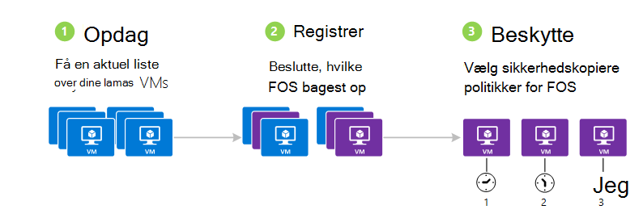

>[AZURE.NOTE] Sikkerhedskopiere virtuelle maskiner er en lokal proces. Du kan ikke sikkerhedskopiere virtuelle maskiner i ét område til en sikkerhedskopi samling af legitimationsoplysninger i et andet område. Så du skal oprette en sikkerhedskopi samling i hvert Azure område, hvor der ikke er VM'er, der vil blive sikkerhedskopieret.

## Trin 1 – Opdag Azure virtuelle maskiner
For at sikre en hvilken som helst nye virtuelle maskiner (FOS) føjet til abonnementet er identificeret før du registrerer, at køre processen registrering. Processen forespørgsler Azure til listen over virtuelle maskiner i abonnementet, sammen med yderligere oplysninger som navnet på skyen tjenesten og området.

1. Log på [Klassisk portal](http://manage.windowsazure.com/)

2. Klik på **Gendannelse Services** for at åbne listen over sikkerhedskopiering og gendannelse af websteder vaults på listen over Azure tjenester.
    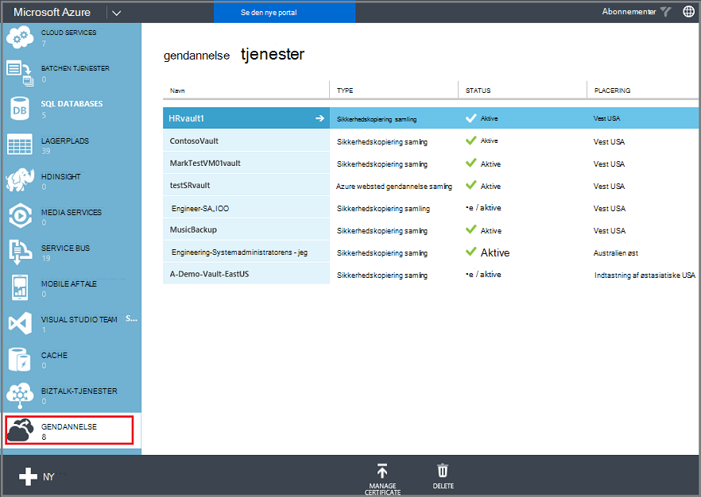

3. Vælg samling af legitimationsoplysninger til at sikkerhedskopiere en VM på listen over sikkerhedskopi vaults.

    Hvis dette er en ny samling åbnes på portalen til siden **Hurtig Start** .

    

    Hvis samling af legitimationsoplysninger som tidligere er blevet konfigureret, åbnes på portalen til menuen senest anvendte.

4. Klik på **Registered elementer**fra menuen samling (øverst på siden).

    

5. Vælg **Azure Virtual Machine**fra menuen **Type** .

    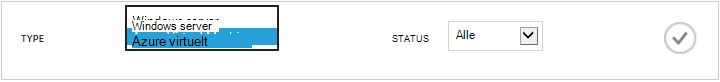

6. Klik på **Find** nederst på siden.
    

    Søgningen kan tage et par minutter, mens de virtuelle maskiner er der i tabelform. Er der en meddelelse nederst på skærmen, som giver dig besked, processen kører.

    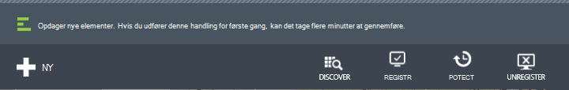

    Besked om ændringerne, når processen er fuldført. Hvis søgningen ikke blev fundet virtuel maskiner, først sørge for FOS findes. Hvis FOS findes, skal kontrollere, at FOS er i samme område som den ekstra samling af legitimationsoplysninger. Hvis FOS findes og er i samme område, skal du sikre dig FOS ikke allerede er registreret til en sikkerhedskopi samling. Det er ikke tilgængelig skal tildeles andre sikkerhedskopiering vaults, hvis en VM er tildelt til en sikkerhedskopi samling af legitimationsoplysninger.

    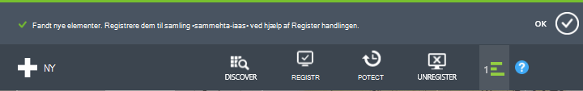

    Når du har opdaget nye elementer, gå til trin 2 og registrere din FOS.

##  Trin 2 – Registrer Azure virtuelle maskiner
Du har registreret en Azure virtuelt for at knytte det til tjenesten Azure sikkerhedskopi. Dette er typisk en enkeltstående aktivitet.

1. Gå til den ekstra samling af legitimationsoplysninger under **Gendannelsestjenester** i portalen Azure, og klik derefter på **Registreret elementer**.

2. Vælg **Azure virtuelt** i rullemenuen.

    

3. Klik på **Registrer** nederst på siden.
    

4. Vælg de virtuelle maskiner, som du vil registrere i genvejsmenuen **Registrere elementer** . Hvis der er to eller flere virtuelle maskiner med samme navn, skal du bruge skytjenesten til at skelne mellem dem.

    >[AZURE.TIP] Flere virtuelle maskiner kan registreres ad gangen.

    Der oprettes et job for hver virtuelt, du har markeret.

5. Klik på **Periode** i meddelelsen for at gå til siden **sager** .

    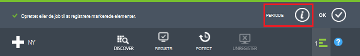

    Den virtuelle maskine vises også på listen over registrerede elementer sammen med status for handlingen registrering.

    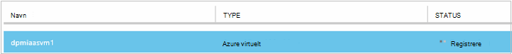

    Når handlingen er fuldført, ændres status til at afspejle tilstanden *registreret* .

    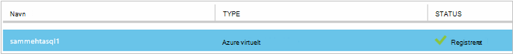

## Trin 3 – Beskyt Azure virtuelle maskiner
Nu kan du konfigurere en politik for den virtuelle maskine sikkerhedskopiering eller opbevaring. Flere virtuelle maskiner kan være beskyttet ved hjælp af en enkelt beskytte handling.

Azure sikkerhedskopi vaults, der er oprettet, efter maj 2015 følger med en standardpolitik indbygget i samling af legitimationsoplysninger. Denne standardpolitikken leveres med en standard opbevaring af 30 dage og en plan for sikkerhedskopiering én gang dagligt.

1. Gå til den ekstra samling af legitimationsoplysninger under **Gendannelsestjenester** i portalen Azure, og klik derefter på **Registreret elementer**.
2. Vælg **Azure virtuelt** i rullemenuen.

    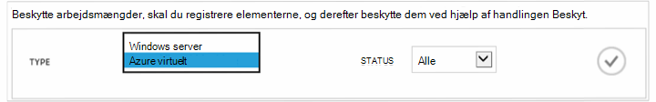

3. Klik på **Beskyt** nederst på siden.

    **Beskytte elementer guiden** vises. Guiden viser kun virtuelle maskiner, der er registreret og ikke er beskyttet. Vælg de virtuelle maskiner, som du vil beskytte.

    Hvis der er to eller flere virtuelle maskiner med samme navn, skal du bruge skytjenesten til at skelne mellem virtuelle maskiner.

    >[AZURE.TIP] Du kan beskytte flere virtuelle maskiner ad gangen.

    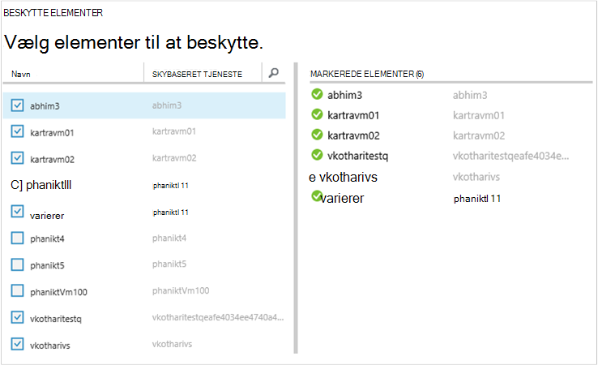

4. Vælg en **tidsplanen for sikkerhedskopiering** til at sikkerhedskopiere de virtuelle maskiner, du har markeret. Du kan vælge fra et eksisterende sæt af politikker eller definere en ny.

    Hver ekstra politik kan have flere virtuelle maskiner, der er knyttet til den. Den virtuelle maskine kan kun dog knyttet til en politik på et bestemt tidspunkt i gang.

    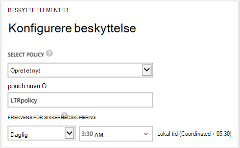

    >[AZURE.NOTE] En politik for sikkerhedskopiering omfatter et opbevaring farveskema efter de planlagte sikkerhedskopier. Hvis du vælger en eksisterende sikkerhedskopiering politik, kan du redigere indstillingerne opbevaring i næste trin.

5. Vælg et **opbevaring område** skal knyttes til sikkerhedskopierne.

    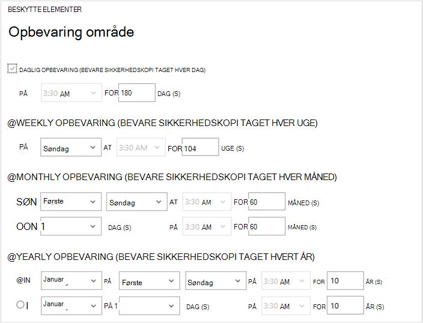

    Opbevaringspolitik angiver, hvor lang tid til at gemme en sikkerhedskopi. Du kan angive forskellige opbevaringspolitikker baseret på, når sikkerhedskopieringen er taget. Et ekstra punkt taget dagligt (der fungerer som en funktionsdygtige gendannelsespunkt) kan for eksempel bevares for 90 dage. I sammenligning skal et ekstra punkt taget i slutningen af hvert kvartal (til revision) bevares for mange måneder eller år.

    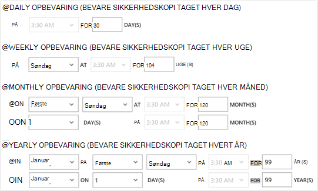

    I dette eksempel billede:

    - **Daglig opbevaringspolitik**: sikkerhedskopier taget dagligt er gemt i 30 dage.
    - **Ugentlig opbevaringspolitik**: sikkerhedskopier taget hver uge om søndagen bevares for 104 uger.
    - **Månedlig opbevaringspolitik**: sikkerhedskopier, der er udført på den sidste søndag i hver måned bevares for 120 måneder.
    - **Årlig opbevaringspolitik**: sikkerhedskopier, der er udført på den første søndag i hver januar bevares til 99 år.

    Der oprettes et job for at konfigurere politikken beskyttelse og knytte de virtuelle maskiner til denne politik for hver virtuelt, du har markeret.

6. Klik på **sager** for at få vist en liste over **Konfigurere beskyttelse** job, i menuen vaults og vælge **Konfigurere beskyttelse** fra filteret **handling** .

    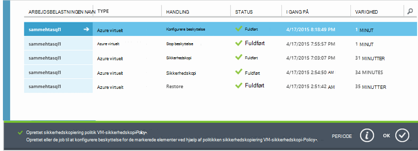

## Første sikkerhedskopi
Når den virtuelle maskine er beskyttet med en politik, skal vises den under fanen **Beskyttet elementer** med status for *beskyttet - (afventer indledende sikkerhedskopi)*. Som standard er den første planlagte sikkerhedskopiering *første sikkerhedskopi*.

Udløse indledende sikkerhedskopien umiddelbart efter konfigurering af beskyttelse:

1. Klik på **Sikkerhedskopiér nu**nederst på siden **Beskyttede elementer** .

    Tjenesten Azure Sikkerhedskopiering opretter en sikkerhedskopi til den første sikkerhedskopiering.

2. Klik på fanen **job** for at få vist en liste over job.

    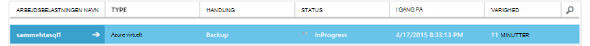

>[AZURE.NOTE] Under sikkerhedskopieringen udsteder tjenesten Azure sikkerhedskopiering en kommando til filtypenavnet sikkerhedskopiering i hver virtual machine til at rydde alle Skriv job og tage et ensartet øjebliksbillede.

Når den første sikkerhedskopi afsluttes, skal er status for den virtuelle maskine under fanen **Beskyttet elementer** *beskyttet*.

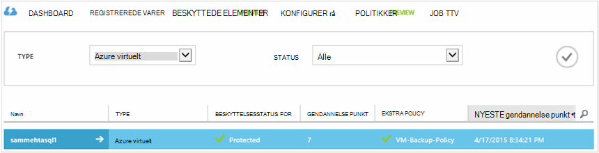

## Få vist status for sikkerhedskopiering og detaljer
Når beskyttet, øges antallet virtuelt også **Dashboard** på siden Oversigt. **Dashboard** -siden viser også antallet af job fra de seneste 24 timer, der blev *gennemført*, har *mislykkedes*, og der er *i gang*. Siden **job** Brug **Status**, **handling**eller **fra** og **til** menuer til at filtrere job.

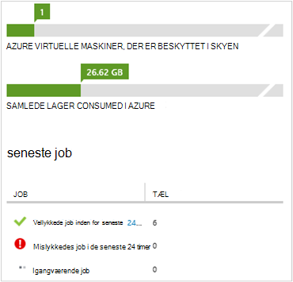

Værdier i dashboardet opdateres én gang i døgnet.

## Foretage fejlfinding af Logonfejl
Hvis du støder på problemer under sikkerhedskopiering af din virtuelle maskine skal du se på [VM artiklen om fejlfinding](backup-azure-vms-troubleshoot.md) for at få hjælp.

## Næste trin

- [Administrere og overvåge virtuelle maskiner](backup-azure-manage-vms.md)
- [Gendanne virtuelle maskiner](backup-azure-restore-vms.md)
