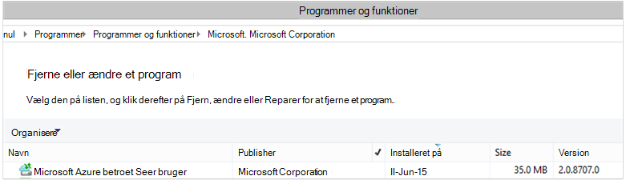

<properties
    pageTitle="Installere og administrere sikkerhedskopi til Windows Server/Client ved hjælp af PowerShell | Microsoft Azure"
    description="Lær, hvordan du installere og administrere Azure sikkerhedskopi ved hjælp af PowerShell"
    services="backup"
    documentationCenter=""
    authors="saurabhsensharma"
    manager="shivamg"
    editor=""/>

<tags
    ms.service="backup"
    ms.workload="storage-backup-recovery"
    ms.tgt_pltfrm="na"
    ms.devlang="na"
    ms.topic="article"
    ms.date="09/01/2016"
    ms.author="saurabhsensharma;markgal;jimpark;nkolli;trinadhk"/>


# <a name="deploy-and-manage-backup-to-azure-for-windows-serverwindows-client-using-powershell"></a>Installere og administrere sikkerhedskopi Azure til Windows Server/Windows klienten ved hjælp af PowerShell

> [AZURE.SELECTOR]
- [ARM](backup-client-automation.md)
- [Klassisk](backup-client-automation-classic.md)

I denne artikel beskrives, hvordan bruge PowerShell til at konfigurere Azure sikkerhedskopiering på Windows Server eller en Windows-klient og administrere sikkerhedskopiering og gendannelse.

## <a name="install-azure-powershell"></a>Installere Azure PowerShell

[AZURE.INCLUDE [learn-about-deployment-models](../../includes/learn-about-deployment-models-include.md)]

Azure PowerShell 1.0 blev udgivet i oktober 2015. Denne version lykkedes 0.9.8 slip og følge nogle væsentlige ændringer, især med cmdlet'erne naming formatet. 1,0 cmdletter følge naming mønsteret {verber}-AzureRm {substantiver} mens 0.9.8 navne skal ikke medtage **ressourcestyring** (for eksempel ny-AzureRmResourceGroup i stedet for ny AzureResourceGroup). Når du bruger Azure PowerShell 0.9.8, skal du først aktivere tilstanden ressourcestyring ved at køre kommandoen **Skift AzureMode AzureResourceManager** . Denne kommando er ikke nødvendigt i 1.0 eller nyere.

Hvis du vil bruge dine scripts, der er skrevet til 0.9.8 miljø, i det 1.0 eller nyere miljø, bør du omhyggeligt afprøve scripts i en foreløbig produktionsmiljø før du bruger dem i fremstilling for at undgå uventede virkning.

[Hent den nyeste version af PowerShell](https://github.com/Azure/azure-powershell/releases) (minimumversion påkrævet er: 1.0.0)


[AZURE.INCLUDE [arm-getting-setup-powershell](../../includes/arm-getting-setup-powershell.md)]


## <a name="create-a-backup-vault"></a>Oprette en sikkerhedskopi samling

> [AZURE.WARNING] For kunder, der bruger Azure sikkerhedskopi for første gang, skal du registrere Azure sikkerhedskopi-udbyderen, der skal bruges sammen med dit abonnement. Dette kan gøres ved at køre følgende kommando: Register-AzureProvider - ProviderNamespace "Microsoft.Backup"

Du kan oprette en ny sikkerhedskopiering samling ved hjælp af **Ny AzureRMBackupVault** cmdlet. Den ekstra samling af legitimationsoplysninger er en ARM ressource, så du har brug at placere det i en ressourcegruppe. Kør følgende kommandoer i en øgede Azure PowerShell console:

```
PS C:\> New-AzureResourceGroup –Name “test-rg” -Region “West US”
PS C:\> $backupvault = New-AzureRMBackupVault –ResourceGroupName “test-rg” –Name “test-vault” –Region “West US” –Storage GeoRedundant
```

Brug cmdlet'en **Get-AzureRMBackupVault** til at få vist de ekstra vaults i et abonnement.


## <a name="installing-the-azure-backup-agent"></a>Installation af Azure Backup agent
Før du installerer Azure Backup agent, skal du have Installationsprogrammet hentede og findes på Windows Server. Du kan få den seneste version af installationsprogrammet fra [Microsoft Download Center](http://aka.ms/azurebackup_agent) eller fra sikkerhedskopien samling dashboardside. Gemme installationsprogrammet til en nem adgang placering som * C:\Downloads\*.

For at installere agenten skal du køre følgende kommando i en øgede PowerShell console:

```
PS C:\> MARSAgentInstaller.exe /q
```

Derved installeres agenten med alle standardindstillingerne. Installationen tager et par minutter i baggrunden. Hvis du ikke angiver indstillingen */nu* åbnes vinduet **Windows Update** i slutningen af til at søge efter en hvilken som helst opdateringer installationen. Når installeret, vises agenten på listen over installerede programmer.

Gå til **Kontrolpanel**for at se listen over installerede programmer, > **programmer** > **programmer og funktioner**.



### <a name="installation-options"></a>Indstillinger for installation

For at se alle de indstillinger, der er tilgængelige via kommandolinjen skal du bruge følgende kommando:

```
PS C:\> MARSAgentInstaller.exe /?
```

De tilgængelige indstillinger omfatter:

| Indstillingen | Detaljer | Standard |
| ---- | ----- | ----- |
| / q | Automatisk installation | - |
| / p: "placering" | Stien til installationsmappen til Azure Backup agent. | C:\Program Files\Microsoft Azure betroet Services bruger |
| / s: "placering" | Stien til cachemappen til Azure Backup agent. | C:\Program Files\Microsoft Azure gendannelse Services Agent\Scratch |
| /m | Vælge i til Microsoft Update | - |
| /nu | Ikke søge efter opdateringer, når installationen er fuldført | - |
| / d | Fjerner Microsoft Azure betroet Services bruger | - |
| /pH | Host proxyadresse | - |
| /PO | Portnummer proxy Host | - |
| /PU | Proxy Host brugernavn | - |
| /pW | Proxy-adgangskode | - |


## <a name="registering-with-the-azure-backup-service"></a>Registrere med Azure sikkerhedskopi-tjenesten
Før du kan registrere med tjenesten Azure sikkerhedskopi, skal du sikre dig, at [forudsætninger](backup-configure-vault.md) er opfyldt. Skal du:

- Har et gyldigt Azure-abonnement
- Har en sikkerhedskopi samling

For at hente samling legitimationsoplysningerne skal køre **Get-AzureRMBackupVaultCredentials** -cmdlet i en Azure PowerShell console og gemme den i et praktisk sted som * C:\Downloads\*.

```
PS C:\> $credspath = "C:\"
PS C:\> $credsfilename = Get-AzureRMBackupVaultCredentials -Vault $backupvault -TargetLocation $credspath
PS C:\> $credsfilename
f5303a0b-fae4-4cdb-b44d-0e4c032dde26_backuprg_backuprn_2015-08-11--06-22-35.VaultCredentials
```

Registrering af computeren med samling af legitimationsoplysninger er færdig med [Start OBRegistration](https://technet.microsoft.com/library/hh770398%28v=wps.630%29.aspx) cmdlet:

```
PS C:\> $cred = $credspath + $credsfilename
PS C:\> Start-OBRegistration -VaultCredentials $cred -Confirm:$false

CertThumbprint      : 7a2ef2caa2e74b6ed1222a5e89288ddad438df2
SubscriptionID      : ef4ab577-c2c0-43e4-af80-af49f485f3d1
ServiceResourceName : test-vault
Region              : West US

Machine registration succeeded.
```

> [AZURE.IMPORTANT] Brug ikke relative stier til at angive samling legitimationsoplysninger fil. Du skal angive en absolut sti som input til Cmdletten.

## <a name="networking-settings"></a>Indstillinger for netværk
Når forbindelsen på Windows-computer til internettet er gennem en proxyserver, kan proxyindstillingerne også leveres til agenten. I dette eksempel, der ikke nogen proxyserver, så vi eksplicit rydder alle proxy-relaterede oplysninger.

Brugen af båndbredde kan også styres med indstillingerne i ```work hour bandwidth``` og ```non-work hour bandwidth``` for et givet antal dage i ugen.

Angive oplysninger om proxy og båndbredde er færdig med cmdlet'en [Set-OBMachineSetting](https://technet.microsoft.com/library/hh770409%28v=wps.630%29.aspx) til:

```
PS C:\> Set-OBMachineSetting -NoProxy
Server properties updated successfully.

PS C:\> Set-OBMachineSetting -NoThrottle
Server properties updated successfully.
```

## <a name="encryption-settings"></a>Krypteringsindstillinger
De sikkerhedskopierede data, der er sendt til Azure sikkerhedskopien er krypteret for at beskytte fortroligheden af dataene. Kryptering adgangskoden er "adgangskoden" dekryptere dataene på tidspunktet for Gendan.

```
PS C:\> ConvertTo-SecureString -String "Complex!123_STRING" -AsPlainText -Force | Set-OBMachineSetting
Server properties updated successfully
```

> [AZURE.IMPORTANT] Holde dine adgangskoden oplysninger sikker, når den er indstillet. Du vil ikke kunne gendanne data fra Azure uden dette udtryk.

## <a name="back-up-files-and-folders"></a>Sikkerhedskopiere filer og mapper
Alle dine sikkerhedskopier fra Windows-servere og klienter til Azure sikkerhedskopi er underlagt en politik. Politikken består af tre dele:

1. En **tidsplanen for sikkerhedskopiering** , der angiver, når sikkerhedskopier skal være taget og synkroniseres med tjenesten.
2. En **plan for opbevaring af** , der angiver, hvor lang tid til at bevare de gendannelse punkter i Azure.
3. En **fil skal indgå/udelukkelse specifikation** , der bestemmer, hvad skal sikkerhedskopieres.

I dette dokument, da vi automatisere sikkerhedskopi, skal vi vil antager, at der er blevet konfigureret. Vi begynder ved at oprette en ny sikkerhedskopiering politik ved hjælp af [Ny OBPolicy](https://technet.microsoft.com/library/hh770416.aspx) cmdlet og den.

```
PS C:\> $newpolicy = New-OBPolicy
```

På nuværende tidspunkt politikken er tom, og andre cmdletter er det er nødvendigt for at angive, hvilke elementer der skal medtages eller udelades, når sikkerhedskopier kører, og hvor sikkerhedskopierne skal gemmes.

### <a name="configuring-the-backup-schedule"></a>Konfiguration af tidsplanen for sikkerhedskopiering
Først af de 3 dele af en politik er tidsplanen for sikkerhedskopiering, som er oprettet ved hjælp af [Ny OBSchedule](https://technet.microsoft.com/library/hh770401) cmdlet. Tidsplanen for sikkerhedskopiering definerer når sikkerhedskopier har brug at blive ført. Når du opretter en tidsplan, skal du angive 2 inputparametre:

- **Dage i ugen** , at sikkerhedskopieringen skal køres. Du kan køre sikkerhedskopieringsjob på kun én dag eller hver dag i ugen eller en vilkårlig kombination i mellem.
- **Tidspunkter for dag** , hvornår sikkerhedskopien skal køres. Du kan definere op til 3 forskellige tider for den dag, når sikkerhedskopien udløses.

For eksempel kan du konfigurere en ekstra politik, der kører på 4 PM hver lørdag og søndag.

```
PS C:\> $sched = New-OBSchedule -DaysofWeek Saturday, Sunday -TimesofDay 16:00
```

Tidsplanen for sikkerhedskopiering skal være knyttet til en politik, og det kan ske ved hjælp af cmdlet'en [Set-OBSchedule](https://technet.microsoft.com/library/hh770407) til.

```
PS C:> Set-OBSchedule -Policy $newpolicy -Schedule $sched
BackupSchedule : 4:00 PM Saturday, Sunday, Every 1 week(s) DsList : PolicyName : RetentionPolicy : State : New PolicyState : Valid
```
### <a name="configuring-a-retention-policy"></a>Konfigurere en opbevaringspolitik
Opbevaringspolitikken definerer, hvor længe gendannelse punkter, der er oprettet ud fra sikkerhedskopieringsjob bevares. Når du opretter en ny opbevaringspolitik ved hjælp af Cmdletten [Ny OBRetentionPolicy](https://technet.microsoft.com/library/hh770425) , kan du angive antallet dage, der skal bevares med Azure sikkerhedskopiering sikkerhedskopiering gendannelse punkter. Eksemplet herunder angiver en opbevaringspolitik for 7 dage.

```
PS C:\> $retentionpolicy = New-OBRetentionPolicy -RetentionDays 7
```

Opbevaringspolitikken skal være knyttet til den primære politik ved hjælp af cmdlet'en [Set-OBRetentionPolicy](https://technet.microsoft.com/library/hh770405):

```
PS C:\> Set-OBRetentionPolicy -Policy $newpolicy -RetentionPolicy $retentionpolicy

BackupSchedule  : 4:00 PM
                  Saturday, Sunday,
                  Every 1 week(s)
DsList          :
PolicyName      :
RetentionPolicy : Retention Days : 7

                  WeeklyLTRSchedule :
                  Weekly schedule is not set

                  MonthlyLTRSchedule :
                  Monthly schedule is not set

                  YearlyLTRSchedule :
                  Yearly schedule is not set

State           : New
PolicyState     : Valid
```
### <a name="including-and-excluding-files-to-be-backed-up"></a>Inklusive og eksklusive filer, der skal sikkerhedskopieres
En ```OBFileSpec``` objekt definerer filerne, der skal medtages og udelades i en sikkerhedskopi. Dette er et sæt regler, der omfang af de beskyttede filer og mapper på en computer. Du kan have som mange fil skal indgå eller udelukkelse regler efter behov, og knytte dem til en politik. Når du opretter et nyt OBFileSpec-objekt, kan du:

- Angiv de filer og mapper der skal medtages
- Angiv de filer og mapper, der skal udelades
- Angiv rekursiv sikkerhedskopiering af data i en mappe (eller) om kun de øverste filer i den angivne mappe skal sikkerhedskopien op.

Disse opnås ved hjælp af flaget - ikke-rekursiv i kommandoen ny OBFileSpec.

I eksemplet herunder vi sikkerhedskopiere lydstyrken C: og D: og udelade OS binære filer i Windows-mappe og alle midlertidige mapper. Gøre, så vi kan oprette to fil anvisninger ved hjælp af [Ny OBFileSpec](https://technet.microsoft.com/library/hh770408) cmdlet - én for optagelse og én til udeladelse. Når filen specifikationer er blevet oprettet, er de tilknyttet med politikken ved hjælp af [Tilføj OBFileSpec](https://technet.microsoft.com/library/hh770424) cmdlet.

```
PS C:\> $inclusions = New-OBFileSpec -FileSpec @("C:\", "D:\")

PS C:\> $exclusions = New-OBFileSpec -FileSpec @("C:\windows", "C:\temp") -Exclude

PS C:\> Add-OBFileSpec -Policy $newpolicy -FileSpec $inclusions

BackupSchedule  : 4:00 PM
                  Saturday, Sunday,
                  Every 1 week(s)
DsList          : {DataSource
                  DatasourceId:0
                  Name:C:\
                  FileSpec:FileSpec
                  FileSpec:C:\
                  IsExclude:False
                  IsRecursive:True

                  , DataSource
                  DatasourceId:0
                  Name:D:\
                  FileSpec:FileSpec
                  FileSpec:D:\
                  IsExclude:False
                  IsRecursive:True

                  }
PolicyName      :
RetentionPolicy : Retention Days : 7

                  WeeklyLTRSchedule :
                  Weekly schedule is not set

                  MonthlyLTRSchedule :
                  Monthly schedule is not set

                  YearlyLTRSchedule :
                  Yearly schedule is not set

State           : New
PolicyState     : Valid


PS C:\> Add-OBFileSpec -Policy $newpolicy -FileSpec $exclusions

BackupSchedule  : 4:00 PM
                  Saturday, Sunday,
                  Every 1 week(s)
DsList          : {DataSource
                  DatasourceId:0
                  Name:C:\
                  FileSpec:FileSpec
                  FileSpec:C:\
                  IsExclude:False
                  IsRecursive:True
                  ,FileSpec
                  FileSpec:C:\windows
                  IsExclude:True
                  IsRecursive:True
                  ,FileSpec
                  FileSpec:C:\temp
                  IsExclude:True
                  IsRecursive:True

                  , DataSource
                  DatasourceId:0
                  Name:D:\
                  FileSpec:FileSpec
                  FileSpec:D:\
                  IsExclude:False
                  IsRecursive:True

                  }
PolicyName      :
RetentionPolicy : Retention Days : 7

                  WeeklyLTRSchedule :
                  Weekly schedule is not set

                  MonthlyLTRSchedule :
                  Monthly schedule is not set

                  YearlyLTRSchedule :
                  Yearly schedule is not set

State           : New
PolicyState     : Valid
```

### <a name="applying-the-policy"></a>Anvende politikken
Nu politikobjektet er fuldført og har en tilknyttet tidsplanen for sikkerhedskopiering, opbevaringspolitik og en optagelse/udelukkelse liste over filer. Denne politik kan nu være anvendt til Azure sikkerhedskopi til brug. Før du anvender sikre politikken nyoprettede, der ikke er nogen eksisterende sikkerhedskopiering politikker, der er knyttet til serveren ved hjælp af [Fjern OBPolicy](https://technet.microsoft.com/library/hh770415) cmdlet. Fjerne politikken beder om en bekræftelse. At springe bekræftelse Brug den ```-Confirm:$false``` flag med cmdlet.

```
PS C:> Get-OBPolicy | Remove-OBPolicy
Microsoft Azure Backup Are you sure you want to remove this backup policy? This will delete all the backed up data. [Y] Yes [A] Yes to All [N] No [L] No to All [S] Suspend [?] Help (default is "Y"):
```

Gemmer politikobjektet er færdig med cmdlet'en [Set-OBPolicy](https://technet.microsoft.com/library/hh770421) til. Dette vil også bede om en bekræftelse. At springe bekræftelse Brug den ```-Confirm:$false``` flag med cmdlet.

```
PS C:> Set-OBPolicy -Policy $newpolicy
Microsoft Azure Backup Do you want to save this backup policy ? [Y] Yes [A] Yes to All [N] No [L] No to All [S] Suspend [?] Help (default is "Y"):
BackupSchedule : 4:00 PM Saturday, Sunday, Every 1 week(s)
DsList : {DataSource
         DatasourceId:4508156004108672185
         Name:C:\
         FileSpec:FileSpec
         FileSpec:C:\
         IsExclude:False
         IsRecursive:True,

         FileSpec
         FileSpec:C:\windows
         IsExclude:True
         IsRecursive:True,

         FileSpec
         FileSpec:C:\temp
         IsExclude:True
         IsRecursive:True,

         DataSource
         DatasourceId:4508156005178868542
         Name:D:\
         FileSpec:FileSpec
         FileSpec:D:\
         IsExclude:False
         IsRecursive:True
    }
PolicyName : c2eb6568-8a06-49f4-a20e-3019ae411bac
RetentionPolicy : Retention Days : 7
              WeeklyLTRSchedule :
              Weekly schedule is not set

              MonthlyLTRSchedule :
              Monthly schedule is not set

              YearlyLTRSchedule :
              Yearly schedule is not set
State : Existing PolicyState : Valid
```

Du kan få vist oplysninger om den eksisterende sikkerhedskopiering politik ved hjælp af cmdlet'en [Get-OBPolicy](https://technet.microsoft.com/library/hh770406) til. Du kan analysere ned med yderligere Cmdletten [Get-OBSchedule](https://technet.microsoft.com/library/hh770423) til tidsplanen for sikkerhedskopiering og [Få OBRetentionPolicy](https://technet.microsoft.com/library/hh770427) cmdlet for opbevaringspolitikker

```
PS C:> Get-OBPolicy | Get-OBSchedule
SchedulePolicyName : 71944081-9950-4f7e-841d-32f0a0a1359a
ScheduleRunDays : {Saturday, Sunday}
ScheduleRunTimes : {16:00:00}
State : Existing

PS C:> Get-OBPolicy | Get-OBRetentionPolicy
RetentionDays : 7
RetentionPolicyName : ca3574ec-8331-46fd-a605-c01743a5265e
State : Existing

PS C:> Get-OBPolicy | Get-OBFileSpec
FileName : *
FilePath : \?\Volume{b835d359-a1dd-11e2-be72-2016d8d89f0f}\
FileSpec : D:\
IsExclude : False
IsRecursive : True

FileName : *
FilePath : \?\Volume{cdd41007-a22f-11e2-be6c-806e6f6e6963}\
FileSpec : C:\
IsExclude : False
IsRecursive : True

FileName : *
FilePath : \?\Volume{cdd41007-a22f-11e2-be6c-806e6f6e6963}\windows
FileSpec : C:\windows
IsExclude : True
IsRecursive : True

FileName : *
FilePath : \?\Volume{cdd41007-a22f-11e2-be6c-806e6f6e6963}\temp
FileSpec : C:\temp
IsExclude : True
IsRecursive : True
```

### <a name="performing-an-ad-hoc-backup"></a>Udføre en sikkerhedskopiering af ad hoc-
Når der er angivet en politik for sikkerhedskopiering opstår sikkerhedskopier af per tidsplanen. Udløse en ad hoc-sikkerhedskopi er også muligt ved hjælp af [Start-OBBackup](https://technet.microsoft.com/library/hh770426) cmdlet:

```
PS C:> Get-OBPolicy | Start-OBBackup
Taking snapshot of volumes...
Preparing storage...
Estimating size of backup items...
Estimating size of backup items...
Transferring data...
Verifying backup...
Job completed.
The backup operation completed successfully.
```

## <a name="restore-data-from-azure-backup"></a>Gendanne data fra Azure sikkerhedskopi
Dette afsnit vejleder dig gennem trinnene til at automatisere gendannelse af data fra Azure sikkerhedskopi. At gøre dette omfatter følgende trin:

1. Vælg kilde lydstyrken
2. Vælg et ekstra punkt for at gendanne
3. Vælg et element for at gendanne
4. Udløse gendannelsen

### <a name="picking-the-source-volume"></a>Hvis du vælger kilde lydstyrken
Hvis du vil gendanne et element fra Azure sikkerhedskopi, skal du først identificere kilden til elementet. Da vi udførelse af kommandoerne i konteksten af en Windows Server eller en Windows-klient, er allerede identificeret maskinen. Det næste trin i identificere kilden er at identificere den enhed, der indeholder den. En liste over enheder eller kilder sikkerhedskopieres fra denne computer kan hentes ved at udføre Cmdletten [Get-OBRecoverableSource](https://technet.microsoft.com/library/hh770410) . Denne kommando returnerer en matrix med alle de kilder, der er sikkerhedskopieret fra denne server/klient.

```
PS C:> $source = Get-OBRecoverableSource
PS C:> $source
FriendlyName : C:\
RecoverySourceName : C:\
ServerName : myserver.microsoft.com

FriendlyName : D:\
RecoverySourceName : D:\
ServerName : myserver.microsoft.com
```

### <a name="choosing-a-backup-point-to-restore"></a>Vælge et ekstra punkt for at gendanne
På listen over sikkerhedskopiering punkter kan hentes ved at udføre Cmdletten [Get-OBRecoverableItem](https://technet.microsoft.com/library/hh770399.aspx) med relevante parametre. I vores eksempel vi vælger det seneste sikkerhedskopiering punkt til kilde lydstyrken *D:* og bruge det til at gendanne en bestemt fil.

```
PS C:> $rps = Get-OBRecoverableItem -Source $source[1]
IsDir : False
ItemNameFriendly : D:\
ItemNameGuid : \?\Volume{b835d359-a1dd-11e2-be72-2016d8d89f0f}\
LocalMountPoint : D:\
MountPointName : D:\
Name : D:\
PointInTime : 18-Jun-15 6:41:52 AM
ServerName : myserver.microsoft.com
ItemSize :
ItemLastModifiedTime :

IsDir : False
ItemNameFriendly : D:\
ItemNameGuid : \?\Volume{b835d359-a1dd-11e2-be72-2016d8d89f0f}\
LocalMountPoint : D:\
MountPointName : D:\
Name : D:\
PointInTime : 17-Jun-15 6:31:31 AM
ServerName : myserver.microsoft.com
ItemSize :
ItemLastModifiedTime :
```
Objektet ```$rps``` er en matrix med sikkerhedskopiering punkter. Det første element er det seneste punkt, og det n'te element er det ældste punkt. For at vælge det seneste punkt, vi vil bruge ```$rps[0]```.

### <a name="choosing-an-item-to-restore"></a>Vælge et element for at gendanne
For at identificere den nøjagtige fil eller mappe til at gendanne skal brug gælder cmdlet'en [Get-OBRecoverableItem](https://technet.microsoft.com/library/hh770399.aspx) . På den måde kan gennemses mappehierarkiet udelukkende ved hjælp af den ```Get-OBRecoverableItem```.

I dette eksempel, hvis vi vil gendanne filer *finances.xls* vi kan referere til, ved hjælp af objektet ```$filesFolders[1]```.

```
PS C:> $filesFolders = Get-OBRecoverableItem $rps[0]
PS C:> $filesFolders
IsDir : True
ItemNameFriendly : D:\MyData\
ItemNameGuid : \?\Volume{b835d359-a1dd-11e2-be72-2016d8d89f0f}\MyData\
LocalMountPoint : D:\
MountPointName : D:\
Name : MyData
PointInTime : 18-Jun-15 6:41:52 AM
ServerName : myserver.microsoft.com
ItemSize :
ItemLastModifiedTime : 15-Jun-15 8:49:29 AM

PS C:> $filesFolders = Get-OBRecoverableItem $filesFolders[0]
PS C:> $filesFolders
IsDir : False
ItemNameFriendly : D:\MyData\screenshot.oxps
ItemNameGuid : \?\Volume{b835d359-a1dd-11e2-be72-2016d8d89f0f}\MyData\screenshot.oxps
LocalMountPoint : D:\
MountPointName : D:\
Name : screenshot.oxps
PointInTime : 18-Jun-15 6:41:52 AM
ServerName : myserver.microsoft.com
ItemSize : 228313
ItemLastModifiedTime : 21-Jun-14 6:45:09 AM

IsDir : False
ItemNameFriendly : D:\MyData\finances.xls
ItemNameGuid : \?\Volume{b835d359-a1dd-11e2-be72-2016d8d89f0f}\MyData\finances.xls
LocalMountPoint : D:\
MountPointName : D:\
Name : finances.xls
PointInTime : 18-Jun-15 6:41:52 AM
ServerName : myserver.microsoft.com
ItemSize : 96256
ItemLastModifiedTime : 21-Jun-14 6:43:02 AM
```

Du kan også søge efter elementer, der skal gendannes ved hjælp af den ```Get-OBRecoverableItem``` cmdlet. I vores eksempel for at søge efter *finances.xls* kan vi få styr på filen ved at køre denne kommando:

```
PS C:\> $item = Get-OBRecoverableItem -RecoveryPoint $rps[0] -Location "D:\MyData" -SearchString "finance*"
```

### <a name="triggering-the-restore-process"></a>Udløser gendannelsen
Hvis du vil udløse gendannelsen, skal vi først angive indstillingerne for gendannelse. Dette kan gøres ved hjælp af [Ny OBRecoveryOption](https://technet.microsoft.com/library/hh770417.aspx) cmdlet. I dette eksempel skal Lad os antage, at vi vil gendanne filerne til *C:\temp*. Lad os også forudsætter, at vi vil springe filer, der allerede findes på destinationsmappen *C:\temp*. Brug følgende kommando til at oprette disse en indstilling for gendannelse:

```
PS C:\> $recovery_option = New-OBRecoveryOption -DestinationPath "C:\temp" -OverwriteType Skip
```

Nu udløse Gendan ved hjælp af kommandoen [Start OBRecovery](https://technet.microsoft.com/library/hh770402.aspx) på den valgte ```$item``` fra outputtet af den ```Get-OBRecoverableItem``` cmdlet:

```
PS C:\> Start-OBRecovery -RecoverableItem $item -RecoveryOption $recover_option
Estimating size of backup items...
Estimating size of backup items...
Estimating size of backup items...
Estimating size of backup items...
Job completed.
The recovery operation completed successfully.
```


## <a name="uninstalling-the-azure-backup-agent"></a>Fjerne Azure Backup agent
Fjerne Azure Backup agent kan udføres ved hjælp af følgende kommando:

```
PS C:\> .\MARSAgentInstaller.exe /d /q
```

Fjerne de agent binære filer fra computeren har nogle følger du bør overveje:

- Fil-filteret fjernes fra computeren, og registrering af ændringer er stoppet.
- Alle politikoplysninger fjernes fra computeren, men politikoplysninger fortsætter med at være gemt i tjenesten.
- Alle planer for sikkerhedskopiering fjernes, og ingen yderligere sikkerhedskopier er taget.

Men dataene gemmes i Azure forbliver og bevares ud fra opbevaring politik konfigurationen af dig. Ældre punkter er automatisk fyldt.

## <a name="remote-management"></a>Fjernadministration
Alle management omkring Azure sikkerhedskopi agent, politikker og datakilder kan udføres fra en fjernplacering via PowerShell. Den computer, der vil blive administreret fra en fjernplacering, skal være forberedt korrekt.

WinRM-tjenesten er som standard konfigureret til manuel start. Skal angives starttype til *automatisk* og tjenesten skal startes. For at bekræfte, at WinRM-tjenesten kører, skal værdien af egenskaben Status *kører*.

```
PS C:\> Get-Service WinRM

Status   Name               DisplayName
------   ----               -----------
Running  winrm              Windows Remote Management (WS-Manag...
```

PowerShell skal konfigureres til remoting.

```
PS C:\> Enable-PSRemoting -force
WinRM is already set up to receive requests on this computer.
WinRM has been updated for remote management.
WinRM firewall exception enabled.

PS C:\> Set-ExecutionPolicy unrestricted -force
```

Maskinen kan nu administreres fra en fjernplacering - begyndende fra installationen af agent. For eksempel følgende script kopierer agenten til fjerncomputeren og installerer det.

```
PS C:\> $dloc = "\\REMOTESERVER01\c$\Windows\Temp"
PS C:\> $agent = "\\REMOTESERVER01\c$\Windows\Temp\MARSAgentInstaller.exe"
PS C:\> $args = "/q"
PS C:\> Copy-Item "C:\Downloads\MARSAgentInstaller.exe" -Destination $dloc - force

PS C:\> $s = New-PSSession -ComputerName REMOTESERVER01
PS C:\> Invoke-Command -Session $s -Script { param($d, $a) Start-Process -FilePath $d $a -Wait } -ArgumentList $agent $args
```

## <a name="next-steps"></a>Næste trin
Du kan finde flere oplysninger om Azure sikkerhedskopi til Windows Server/Client se

- [Introduktion til Azure sikkerhedskopi](backup-introduction-to-azure-backup.md)
- [Sikkerhedskopiere Windows-servere](backup-configure-vault.md)
