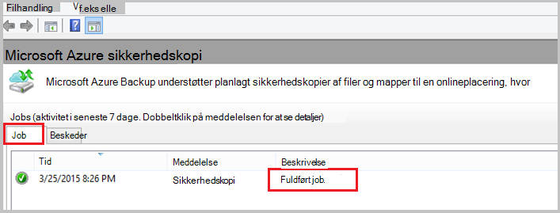

<properties
    pageTitle="Sikkerhedskopiere en Windows server eller klient til Azure ved hjælp af den klassiske implementeringsmodel | Microsoft Azure"
    description="Sikkerhedskopiering Windows-servere eller klienter til Azure ved at oprette en sikkerhedskopi samling, hente legitimationsoplysninger, installere sikkerhedskopiering agent og fuldfører en indledende sikkerhedskopiering af dine filer og mapper."
    services="backup"
    documentationCenter=""
    authors="markgalioto"
    manager="cfreeman"
    editor=""
    keywords="Sikkerhedskopiering samling; sikkerhedskopiere en Windows-server. Sikkerhedskopiering windows."/>

<tags
    ms.service="backup"
    ms.workload="storage-backup-recovery"
    ms.tgt_pltfrm="na"
    ms.devlang="na"
    ms.topic="article"
    ms.date="08/08/2016"
    ms.author="jimpark; trinadhk; markgal"/>

# Sikkerhedskopiere en Windows server eller klient til Azure ved hjælp af den klassiske implementeringsmodel

> [AZURE.SELECTOR]
- [Klassisk portal](backup-configure-vault-classic.md)
- [Azure-portalen](backup-configure-vault.md)

Denne artikel omhandler de procedurer, som du skal følge for at forberede dit miljø og sikkerhedskopiere en Windows server (eller klienten) til Azure. Det dækker også overvejelser i forbindelse med installation af din løsning til sikkerhedskopiering. Hvis du er interesseret i at have prøvet Azure sikkerhedskopi for første gang, denne artikel vejledes hurtigt du gennem processen.

>[AZURE.IMPORTANT] Azure har to forskellige installation modeller til oprettelse og arbejde med ressourcer: ressourcestyring og klassisk. Denne artikel omhandler ved hjælp af den klassiske implementeringsmodel. Microsoft anbefaler, at de fleste nye installationer bruger ressourcestyring modellen.

## Før du starter
Hvis du vil sikkerhedskopiere en server eller klient til Azure, skal du en Azure-konto. Hvis du ikke har en, kan du oprette en [gratis konto](https://azure.microsoft.com/free/) på blot et par minutter.

## Trin 1: Oprette en sikkerhedskopi samling
Hvis du vil sikkerhedskopiere filer og mapper fra en server eller klienten, skal du oprette en sikkerhedskopi samling af legitimationsoplysninger i det geografiske område, hvor du vil gemme dataene.

### Oprette en sikkerhedskopi samling

1. Log på [portalen klassisk](https://manage.windowsazure.com/).

2. Klik på **Ny** > **Datatjenester** > **Gendannelse Services** > **Sikkerhedskopi samling**, og vælg derefter **Hurtig oprettelse**.

3. Angiv et fuldt navn til den ekstra samling af legitimationsoplysninger for parameteren **Name** . Skriv et navn, der indeholder mellem 2 og 50 tegn. Det skal starte med et bogstav og kan indeholde kun bogstaver, tal og bindestreger. Dette navn skal være entydige for hvert abonnement.

4. Vælg det geografiske område for den ekstra samling af legitimationsoplysninger for parameteren **område** . Dette valg bestemmer den geografiske område, hvor de sikkerhedskopierede data sendes. Ved at vælge en geografiske område, der er tæt på din placering, kan du reducere netværksventetid, når du sikkerhedskopierer til Azure.

5. Klik på **Opret samling af legitimationsoplysninger**.

    

    Det kan tage et øjeblik, før den ekstra samling af legitimationsoplysninger skal oprettes. For at kontrollere status, overvåge beskeder i bunden af portalen klassisk.

    Når den ekstra samling af legitimationsoplysninger er blevet oprettet, får du vist en meddelelse om, at samling af legitimationsoplysninger er blevet oprettet. Den vises også som **aktiv** på listen **Gendannelsestjenester** ressource.

    

4. Vælg indstillingen lagerplads redundans ved at følge trinnene beskrevet her.

    >[AZURE.IMPORTANT] Det bedste tidspunkt at identificere dit datalager redundans er lige efter oprettelse af samling, og før alle computere er registreret på samling af legitimationsoplysninger. Når et element er registreret til samling af legitimationsoplysninger, redundans datalager er låst og kan ikke ændres.

    Hvis du bruger Azure som et slutpunkt primære ekstra lagerplads (for eksempel du sikkerhedskopierer til Azure fra en Windows server), kan du overveje vælge (standard) [geografisk overflødige](../storage/storage-redundancy.md#geo-redundant-storage) datalager.

    Hvis du bruger Azure som et slutpunkt tertiære ekstra lagerplads (for eksempel du bruger System Center Data Protection Manager til at gemme en lokal sikkerhedskopi lokalt og bruger Azure til langsigtede opbevaring skal), kan du overveje at vælge [lokalt overflødige lagerplads](../storage/storage-redundancy.md#locally-redundant-storage). Dette viser omkostningerne ved lagring af data i Azure, samtidig med at et lavere niveau for holdbarhed til dine data, der kan være acceptable for tertiære kopier.

    **Sådan vælges redundans datalager:**

    en. Klik på den samling, du lige har oprettet.

    b. Vælg **Konfigurer**på siden Hurtig Start.

    

    c. Vælg den relevante redundans datalager.

    Hvis du vælger **Lokalt overflødige**, skal du klikke på **Gem** (da **Geografisk overflødigt** er standardindstillingen).

    d. Klik på **Gendannelse Services** at vende tilbage til listen over ressourcer for gendannelsestjenester i den venstre navigationsrude.

## Trin 2: Hente filen samling legitimationsoplysninger
Den lokale computer, skal godkendes med en sikkerhedskopi samling, før den kan sikkerhedskopiere data til Azure. Godkendelsen opnås gennem *samling legitimationsoplysninger*. Filen samling legitimationsoplysninger hentes via en sikker kanal fra portalen klassisk. Certifikatets private nøgle bevares ikke i portalen eller tjenesten.

Lær mere om [Brug af samling legitimationsoplysninger for at godkende med tjenesten sikkerhedskopi](backup-introduction-to-azure-backup.md#what-is-the-vault-credential-file).

### Til at hente filen samling legitimationsoplysninger til en lokal computer

1. Klik på **Gendannelsestjenester**i den venstre navigationsrude, og vælg derefter den ekstra samling af legitimationsoplysninger, du har oprettet.

    

2.  Klik på **Hent samling legitimationsoplysninger**på siden Hurtig Start.

    Portalen klassisk genererer en samling af legitimationsoplysninger legitimationsoplysninger ved hjælp af en kombination af samling navn og den aktuelle dato. Samling af legitimationsoplysninger legitimationsoplysninger filen og bruges kun under registrering arbejdsprocessen og udløber efter 48 timer.

    Samling af legitimationsoplysninger legitimationsoplysninger filen kan hentes fra portalen.

3. Klik på **Gem** for at hente filen samling legitimationsoplysninger til mappen overførsler for den lokale konto. Du kan også vælge **Gem som** i menuen **Gem** for at angive en placering for filen samling legitimationsoplysninger.

    >[AZURE.NOTE] Kontrollér, at filen samling legitimationsoplysninger er gemt i en placering, der kan åbnes fra din computer. Hvis den er gemt i en del eller server meddelelse filblokering, kan du kontrollere, at du har tilladelse til at få adgang til den.

## Trin 3: Hente, installere og registrere Backup agent
Når du opretter den ekstra samling af legitimationsoplysninger og hente filen samling legitimationsoplysninger, skal være installeret en agent på hver af dine Windows-computere.

### Hvis du vil hente, installere og registrere agenten

1. Klik på **Gendannelsestjenester**, og vælg derefter den ekstra samling af legitimationsoplysninger, som du vil registrere med en server.

2. Klik på agent **Agent til Windows Server eller System Center Data Protection Manager eller Windows-klienten**på siden Hurtig Start. Klik derefter på **Gem**.

    

3. Når filen MARSagentinstaller.exe har hentet, klik på **Kør** (eller dobbeltklik på **MARSAgentInstaller.exe** fra den gemte placering).

4. Vælg mappen og cache-mappe, der kræves til agenten, og klik derefter på **Næste**. Den angivne cacheplacering skal have ledig plads, der er lig med mindst 5 procent af sikkerhedskopidataene.

5. Du kan fortsætte med at oprette forbindelse til internettet via proxy standardindstillingerne.          Hvis du bruger en proxyserver til at oprette forbindelse til internettet, på siden konfiguration af Proxy, markere afkrydsningsfeltet **Brug brugerdefinerede proxyindstillinger** , og derefter angive proxy server oplysninger. Hvis du bruger en godkendt proxy, angive brugernavn og en adgangskode for oplysninger, og klik derefter på **Næste**.

7. Klik på **Installer** for at starte agent-installation. Backup agent installerer .NET Framework 4.5 og Windows PowerShell (hvis det ikke allerede er installeret) til at fuldføre installationen.

8. Når agenten er installeret, skal du klikke på **Fortsæt til registrering** for at fortsætte med arbejdsprocessen.

9. Gå til siden samling identifikation, og vælg filen samling legitimationsoplysninger, som du tidligere har hentet.

    Samling af legitimationsoplysninger legitimationsoplysninger filen er gyldig i kun 48 timer efter at det er hentet fra portalen. Hvis du støder på en fejl på denne side (såsom "samling legitimationsoplysninger angivne fil er udløbet"), log på portalen og hente filen samling legitimationsoplysninger igen.

    Sørg for, at filen samling legitimationsoplysninger er tilgængelig i en placering, der kan åbnes af under installation af programmet. Hvis du støder på access-relaterede fejl, kopiere samling legitimationsoplysninger fil til en midlertidig placering på den samme maskine, og prøv igen.

    Hvis du støder på fejlen samling legitimationsoplysninger som "angivne ugyldige samling legitimationsoplysninger", at filen er beskadiget, eller der ikke har de seneste legitimationsoplysninger er knyttet til tjenesten gendannelse. Prøv derefter igen efter overførslen af en ny samling legitimationsoplysninger fil fra portalen. Denne fejl kan også, hvis en bruger klikker på indstillingen **Hent samling legitimationsoplysninger** flere gange i hurtigt efter hinanden. I dette tilfælde kun sidste samling legitimationsoplysninger filen er gyldig.

9. På siden krypteringsindstilling kan du oprette en adgangskode eller angive en adgangskode (med et minimum af 16 tegn). Husk at gemme adgangskoden på et sikkert sted.

10. Klik på **Udfør**. Guiden registrere Server registrerer serveren med sikkerhedskopiering.

    >[AZURE.WARNING] Hvis du mister eller glemmer adgangskoden, kan Microsoft hjælpe dig med at gendanne sikkerhedskopidataene. Du ejer kryptering adgangskoden, og Microsoft har ikke indsigt i den adgangskode, du bruger. Gem filen i et sikkert sted, da det vil være nødvendige under genoprettelse.

11. Når krypteringsnøglen er angivet, Lad afkrydsningsfeltet **Start Microsoft Azure betroet Services bruger** er markeret, og klik derefter på **Luk**.

## Trin 4: Fuldfør indledende sikkerhedskopien

Den første sikkerhedskopi indeholder to vigtige opgaver:

- Oprettelse af tidsplanen for sikkerhedskopiering
- Sikkerhedskopiere filer og mapper for første gang

Når politikken sikkerhedskopiering er fuldført den indledende sikkerhedskopi, opretter sikkerhedskopien punkter, du kan bruge, hvis du har brug at gendanne dataene. Politikken sikkerhedskopiering gør dette baseret på den plan, du definerer.

### Du planlægger at sikkerhedskopieringen

1. Åbn Microsoft Azure Backup agent. (Det åbnes automatisk, hvis du har forladt afkrydsningsfeltet **Start Microsoft Azure betroet Services bruger** er markeret, når du har lukket guiden registrere Server.) Du kan finde det ved at søge computeren til **Microsoft Azure sikkerhedskopi**.

    

2. Klik på **Tidsplan sikkerhedskopi**i agent sikkerhedskopi.

    

3. Klik på **Næste**på siden Introduktion i guiden tidsplan sikkerhedskopiering.

4. På markere elementerne til sikkerhedskopi side, skal du klikke på **Tilføj elementer**.

5. Vælg de filer og mapper, du vil sikkerhedskopiere, og klik derefter på **OK**.

6. Klik på **Næste**.

7. Angiv **tidsplanen for sikkerhedskopiering** , og klik på **Næste**på siden **Angiv tidsplanen for sikkerhedskopiering** .

    Du kan planlægge dagligt (med en maksimal hastighed tre gange om dagen) eller ugentlig sikkerhedskopier.

    

    >[AZURE.NOTE] Du kan finde flere oplysninger om, hvordan du angiver tidsplanen for sikkerhedskopiering, i artiklen [Brug Azure Backup for at erstatte infrastrukturen bånd](backup-azure-backup-cloud-as-tape.md).

8. Vælg den **Opbevaringspolitik** for sikkerhedskopien, på siden **Vælg opbevaringspolitik** .

    Opbevaringspolitikken angiver den varighed, som sikkerhedskopien skal gemmes. I stedet for blot angiver en "flad politik" for alle sikkerhedskopiering punkter, kan du angive forskellige opbevaringspolitikker baseret på, når der udsendes sikkerhedskopien. Du kan ændre dagligt, ugentligt, månedlige og årlige opbevaringspolitikker at opfylde dine behov.

9. Vælg den indledende sikkerhedskopiering type på siden Vælg indledende sikkerhedskopieringstype. Lad indstillingen **automatisk via netværket** markeret, og klik derefter på **Næste**.

    Du kan sikkerhedskopiere automatisk via netværket, eller du kan sikkerhedskopiere offline. I resten af denne artikel beskrives processen for sikkerhedskopiering af automatisk. Hvis du foretrækker at gøre en offline sikkerhedskopi, kan du gennemgå artiklen om [Offline sikkerhedskopiering arbejdsproces i Azure sikkerhedskopiering](backup-azure-backup-import-export.md) kan finde flere oplysninger.

10. Gennemse oplysningerne på siden Confirmation, og klik derefter på **Udfør**.

11. Når guiden afsluttes oprettelse af tidsplanen for sikkerhedskopiering, skal du klikke på **Luk**.

### Aktivere netværk throttling (valgfrit)

Backup agent indeholder netværk (throttling). Begrænsning kontrolelementer hvordan netværksbåndbredde bruges under dataoverførsel. Dette objekt kan være nyttigt, hvis du vil sikkerhedskopiere data under arbejdstimer, men ikke vil sikkerhedskopieringen forstyrrer andre internettrafik. Begrænsning gælder for at sikkerhedskopiere og gendanne aktiviteter.

**Aktivere netværk (throttling)**

1. Klik på **Skift egenskaber**i agent sikkerhedskopi.

    

2. Markér afkrydsningsfeltet **Aktiver brug af internetbåndbredde (throttling) for sikkerhedskopiering handlinger** under fanen **Throttling** .

    

3. Når du har aktiveret (throttling), kan du angive den tilladte båndbredde til sikkerhedskopiering dataoverførsel under **arbejdstimer** og **ikke - arbejdstid**.

    Værdierne i de båndbredde begynde på 512 Kbps sekund () og kan gå op til 1,023 MB sekundet (MBps). Du kan også angive start og Afslut for **arbejdstimer**, og hvilke dage i ugen er betragtes som arbejdsdage. Timer uden for udpegede arbejde timer betragtes som værende ikke arbejde timer.

4. Klik på **OK**.

### Sikkerhedskopiere nu

1. Klik på **Sikkerhedskopier nu** for at fuldføre de indledende forhåndsudfyldning via netværket i agent sikkerhedskopi.

    

2. Gennemse de indstillinger, der anvender tilbage op nu guiden til at sikkerhedskopiere maskinen, på siden Confirmation. Klik derefter på **Sikkerhedskopier**.

3. Klik på **Luk** for at lukke guiden. Hvis du gør dette, før sikkerhedskopieringen er færdig, fortsætter guiden til at køre i baggrunden.

Når indledende sikkerhedskopieringen er fuldført, vises status **Job fuldført** i konsollen sikkerhedskopi.

## Næste trin
- Tilmeld dig en [gratis Azure-konto](https://azure.microsoft.com/free/).

Du kan finde flere oplysninger om sikkerhedskopiering af FOS eller andre arbejdsbelastninger, som skal i:

- [Sikkerhedskopiere IaaS FOS](backup-azure-vms-prepare.md)
- [Sikkerhedskopiere arbejdsbelastninger til Azure med Microsoft Azure Backup Server](backup-azure-microsoft-azure-backup.md)
- [Sikkerhedskopiere arbejdsbelastninger til Azure med DPM](backup-azure-dpm-introduction.md)
