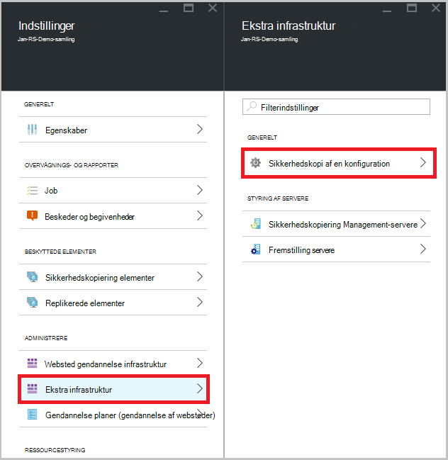

<properties
    pageTitle="Sikkerhedskopiere en Windows Server eller klient til Azure med Azure sikkerhedskopiering ved hjælp af Ressourcestyring implementeringsmodel | Microsoft Azure"
    description="Sikkerhedskopiering Windows-servere eller klienter til Azure ved at oprette en sikkerhedskopi samling, hente legitimationsoplysninger, installere sikkerhedskopiering agent og fuldfører en indledende sikkerhedskopiering af dine filer og mapper."
    services="backup"
    documentationCenter=""
    authors="markgalioto"
    manager="cfreeman"
    editor=""
    keywords="Sikkerhedskopiering samling; sikkerhedskopiere en Windows-server. Sikkerhedskopiering windows."/>

<tags
    ms.service="backup"
    ms.workload="storage-backup-recovery"
    ms.tgt_pltfrm="na"
    ms.devlang="na"
    ms.topic="article"
    ms.date="08/10/2016"
    ms.author="jimpark; trinadhk; markgal"/>

# Sikkerhedskopiere en Windows Server eller klient til Azure ved hjælp af implementeringsmodel ressourcestyring

> [AZURE.SELECTOR]
- [Azure-portalen](backup-configure-vault.md)
- [Klassisk portal](backup-configure-vault-classic.md)

I denne artikel beskriver, hvordan du sikkerhedskopiere dine Windows Server (eller Windows-klienten) filer og mapper til Azure med Azure sikkerhedskopiering ved hjælp af Ressourcestyring implementeringsmodel.

[AZURE.INCLUDE [learn-about-deployment-models](../../includes/backup-deployment-models.md)]

## Før du starter
Hvis du vil sikkerhedskopiere en server eller klient til Azure, skal du en Azure-konto. Hvis du ikke har en, kan du oprette en [gratis konto](https://azure.microsoft.com/free/) på blot et par minutter.

## Trin 1: Oprette en samling af legitimationsoplysninger gendannelse

En samling af legitimationsoplysninger gendannelse Services er en enhed, der gemmer alle sikkerhedskopiering og gendannelse punkter, du opretter over tid. Gendannelse Services samling indeholder også sikkerhedskopiering politikken anvendes på de beskyttede filer og mapper. Når du opretter en samling af legitimationsoplysninger gendannelsestjenester, skal du også vælge den relevante redundans datalager.

### Oprette en samling af legitimationsoplysninger gendannelse

1. Hvis du ikke allerede har gjort det, logon til [Azure-portalen](https://portal.azure.com/) med dit Azure-abonnement.

2. Klik på **Gennemse** , og skriv **Gendannelsestjenester**på listen over ressourcer, i menuen Hub. Når du begynder at skrive, på listen filtrerer baseret på dit input. Klik på **tjenester til genoprettelse vaults**.

      

    På listen over tjenester til genoprettelse vaults vises.

3. Klik på **Tilføj**i menuen **gendannelse Services vaults** .

    

    Gendannelse Services samling blade åbnes, beder dig om at angive et **navn**, **abonnement**, **ressourcegruppe**og **placering**.

    

4. Angiv et fuldt navn til at identificere samling af legitimationsoplysninger for **navn**. Navnet skal være entydige for Azure abonnementet. Skriv et navn, der indeholder mellem 2 og 50 tegn. Det skal starte med et bogstav og kan indeholde kun bogstaver, tal og bindestreger.

5. Klik på **abonnement** for at se den tilgængelige liste over abonnementer. Hvis du ikke er sikker på, hvilket abonnement, der skal bruges, brug standarden (eller forslag) abonnement. Der vil være flere valgmuligheder, kun, hvis din virksomhedskonto er knyttet til flere Azure abonnementer.

6. **Ressourcegruppe** for at se den tilgængelige liste over grupper, eller klik på **Ny** for at oprette en ny ressourcegruppe. Se [Oversigt over Azure ressourcestyring](../azure-resource-manager/resource-group-overview.md) detaljerede oplysninger om grupper

7. Klik på **placering** for at vælge det geografiske område for samling af legitimationsoplysninger. Dette valg bestemmer den geografiske område, hvor de sikkerhedskopierede data sendes. Ved at vælge en geografiske område, der er tæt på din placering, kan du reducere netværksventetid, når du sikkerhedskopierer til Azure.

8. Klik på **Opret**. Det kan tage et øjeblik, før den gendannelse Services samling af legitimationsoplysninger skal oprettes. Overvåge status meddelelserne i området øverst til højre på portalen. Når din samling af legitimationsoplysninger er oprettet, åbnes i portalen. Hvis du ikke kan se din samling, der vises, når den er fuldført, kan du klikke på **Opdater**. Klik på navnet på samling af legitimationsoplysninger, når listen er blevet opdateret.

### Til at bestemme lagerplads redundans
Når du opretter en samling af legitimationsoplysninger gendannelsestjenester kan du bestemme, hvordan lagerplads replikeres.

1. Klik på **Sikkerhedskopiér infrastruktur**i bladet **Indstillinger** , som åbner automatisk med dashboardet samling.

2. Klik på **Sikkerhedskopiér konfiguration** for at få vist den **lagerplads gentagelse type**i bladet sikkerhedskopi infrastruktur.

    

3. Vælg indstillingen lagerplads gentagelse til din samling af legitimationsoplysninger.

    

    Som standard har din samling geografisk overflødige lagerplads. Hvis du bruger Azure som et slutpunkt primære ekstra lagerplads, skal du fortsætte med at bruge geografisk overflødige lagerplads. Hvis du bruger Azure som et slutpunkt for lagring af ikke-primær sikkerhedskopier, skal du vælge lokalt overflødige lager, hvilket kan reducere omkostningerne til lagring af data i Azure. Få mere at vide om [geografisk overflødige](../storage/storage-redundancy.md#geo-redundant-storage) og [lokalt overflødige](../storage/storage-redundancy.md#locally-redundant-storage) indstillinger for lagring i denne [Oversigt](../storage/storage-redundancy.md).

    Når du har valgt indstillingen lagerplads for dit samling, er du klar til at knytte dine filer og mapper til samling af legitimationsoplysninger.

Nu hvor du har oprettet en samling af legitimationsoplysninger skal forberede du din infrastruktur til at sikkerhedskopiere filer og mapper ved at downloade og installere Microsoft Azure gendannelse Services agent, hente samling legitimationsoplysninger og derefter bruge disse legitimationsoplysninger til at registrere agenten med samling af legitimationsoplysninger.

## Trin 2 – Hent filer

>[AZURE.NOTE] Aktivering backup via portalen Azure kommer snart. På nuværende tidspunkt, kan du bruge de Microsoft Azure betroet Services bruger i det lokale miljø til at sikkerhedskopiere dine filer og mapper.

1. Klik på **Indstillinger** på dashboardet til gendannelse Services samling af legitimationsoplysninger.

    

2. Klik på **Introduktion > sikkerhedskopi** på bladet indstillinger.

    

3. Klik på **Sikkerhedskopiér mål** i bladet sikkerhedskopi.

    

4. Vælg **lokalt** hvor er arbejdsbelastningen kører? menuen.

5. Vælg **filer og mapper** fra Hvad vil du gerne sikkerhedskopi? menuen, og klik på **OK**.

#### Hente gendannelse Services agent

1. Klik på **Hent Agent til Windows Server eller Windows-klient** i bladet **Forbered infrastruktur** .

    

2. Klik på **Gem** i pop op-vinduet download. Som standard gemmes filen **MARSagentinstaller.exe** til mappen overførsler.

#### Samling af legitimationsoplysninger legitimationsoplysninger hentes

1. Klik på **hente > Gem** på bladet Forbered infrastruktur.

    

## Trin 3 - installation og registrere agenten

1. Find og dobbeltklik på **MARSagentinstaller.exe** fra mappen overførsler (eller andre gemte placering).

2. Fuldfør konfigurationsguiden Microsoft Azure gendannelse Services Agent. For at fuldføre guiden, skal du:

    - Vælg en placering til installation og cache-mappe.
    - Angiv din proxy oplysninger om server, hvis du bruger en proxyserver til at oprette forbindelse til internettet.
    - Angiv dit brugernavn og en adgangskode for oplysninger, hvis du bruger en godkendt proxy.
    - Angive de hentede samling legitimationsoplysninger
    - Gem kryptering adgangskoden på et sikkert sted.

    >[AZURE.NOTE] Hvis du mister eller glemmer adgangskoden, hjælpe Microsoft kan ikke gendanne sikkerhedskopidataene. Gem filen i et sikkert sted. Det er nødvendigt at gendanne en sikkerhedskopi.

Agenten er nu installeret, og din computer er registreret til samling af legitimationsoplysninger. Er du klar til at konfigurere og planlægge sikkerhedskopien.

### Bekræfte installationen

For at bekræfte, at agenten blev installeret og registreret korrekt, kan du se efter de elementer, du har sikkerhedskopieret i afsnittet **Fremstilling Server** i administrationsportalen. Sådan gør du:

1. Log på [Azure-portalen](https://portal.azure.com/) med dit Azure-abonnement.

2. Klik på **Gennemse** , og skriv **Gendannelsestjenester**på listen over ressourcer, i menuen Hub. Når du begynder at skrive, på listen filtrerer baseret på dit input. Klik på **tjenester til genoprettelse vaults**.

      

    På listen over tjenester til genoprettelse vaults vises.

2. Vælg navnet på den samling, du har oprettet.

    Gendannelse Services samling dashboard blade åbnes.

      

3. Klik på knappen **Indstillinger** øverst på siden.

4. Klik på **Sikkerhedskopiér infrastruktur > fremstilling servere**.

    

Hvis du kan se dine servere på listen, har du bedt om at bekræfte, at agenten er installeret og registreret korrekt.

## Trin 4: Fuldfør indledende sikkerhedskopien

Den første sikkerhedskopi indeholder to vigtige opgaver:

- Planlægge sikkerhedskopieringen
- Sikkerhedskopiere filer og mapper for første gang

For at fuldføre indledende sikkerhedskopien skal bruge du den Microsoft Azure sikkerhedskopiering agent.

### Du planlægger at sikkerhedskopieringen

1. Åbn Microsoft Azure Backup agent. Du kan finde det ved at søge computeren til **Microsoft Azure sikkerhedskopi**.

    

2. Klik på **Tidsplan sikkerhedskopi**i agent sikkerhedskopi.

    

3. Klik på **Næste**på siden Introduktion i guiden tidsplan sikkerhedskopiering.

4. På markere elementerne til sikkerhedskopi side, skal du klikke på **Tilføj elementer**.

5. Vælg de filer og mapper, du vil sikkerhedskopiere, og klik derefter på **OK**.

6. Klik på **Næste**.

7. Angiv **tidsplanen for sikkerhedskopiering** , og klik på **Næste**på siden **Angiv tidsplanen for sikkerhedskopiering** .

    Du kan planlægge dagligt (med en maksimal hastighed tre gange om dagen) eller ugentlig sikkerhedskopier.

    

    >[AZURE.NOTE] Du kan finde flere oplysninger om, hvordan du angiver tidsplanen for sikkerhedskopiering, i artiklen [Brug Azure Backup for at erstatte infrastrukturen bånd](backup-azure-backup-cloud-as-tape.md).

8. Vælg den **Opbevaringspolitik** for sikkerhedskopien, på siden **Vælg opbevaringspolitik** .

    Opbevaringspolitikken angiver den varighed, som sikkerhedskopien skal gemmes. I stedet for blot angiver en "flad politik" for alle sikkerhedskopiering punkter, kan du angive forskellige opbevaringspolitikker baseret på, når der udsendes sikkerhedskopien. Du kan ændre dagligt, ugentligt, månedlige og årlige opbevaringspolitikker at opfylde dine behov.

9. Vælg den indledende sikkerhedskopiering type på siden Vælg indledende sikkerhedskopieringstype. Lad indstillingen **automatisk via netværket** markeret, og klik derefter på **Næste**.

    Du kan sikkerhedskopiere automatisk via netværket, eller du kan sikkerhedskopiere offline. I resten af denne artikel beskrives processen for sikkerhedskopiering af automatisk. Hvis du foretrækker at gøre en offline sikkerhedskopi, kan du gennemgå artiklen om [Offline sikkerhedskopiering arbejdsproces i Azure sikkerhedskopiering](backup-azure-backup-import-export.md) kan finde flere oplysninger.

10. Gennemse oplysningerne på siden Confirmation, og klik derefter på **Udfør**.

11. Når guiden afsluttes oprettelse af tidsplanen for sikkerhedskopiering, skal du klikke på **Luk**.

### Aktivere netværk throttling (valgfrit)

Denne sikkerhedskopiering tilbyder netværk (throttling). Begrænsning kontrolelementer hvordan netværksbåndbredde bruges under dataoverførsel. Dette objekt kan være nyttigt, hvis du vil sikkerhedskopiere data under arbejdstimer, men ikke vil sikkerhedskopieringen forstyrrer andre internettrafik. Begrænsning gælder for at sikkerhedskopiere og gendanne aktiviteter.

>[AZURE.NOTE] Netværk (throttling) er ikke tilgængelig på Windows Server 2008 R2 SP1, Windows Server 2008 SP2 eller Windows 7 (med servicepakker). Azure sikkerhedskopi netværket (throttling) funktion deltager Quality of Service (QoS) på det lokale operativsystem. Selvom Azure sikkerhedskopi kan beskytte disse operativsystemer, virker versionen af QoS, der er tilgængelige på disse platforme med Azure sikkerhedskopi netværk (throttling). Netværk (throttling) kan anvendes på alle andre [understøttede operativsystemer](backup-azure-backup-faq.md#installation-amp-configuration).

**Aktivere netværk (throttling)**

1. Klik på **Skift egenskaber**i den ekstra agent.

    

2. Markér afkrydsningsfeltet **Aktiver brug af internetbåndbredde (throttling) for sikkerhedskopiering handlinger** under fanen **Throttling** .

    

3. Når du har aktiveret (throttling), kan du angive den tilladte båndbredde til sikkerhedskopiering dataoverførsel under **arbejdstimer** og **ikke - arbejdstid**.

    Værdierne i de båndbredde begynde på 512 Kbps sekund () og kan gå op til 1,023 MB sekundet (MBps). Du kan også angive start og Afslut for **arbejdstimer**, og hvilke dage i ugen er betragtes som arbejdsdage. Timer uden for udpegede arbejde timer betragtes som værende ikke arbejde timer.

4. Klik på **OK**.

### Sikkerhedskopiere filer og mapper for første gang

1. I den ekstra agent, klik på **Sikkerhedskopier nu** for at fuldføre de indledende forhåndsudfyldning via netværket.

    

2. Gennemse de indstillinger, der anvender tilbage op nu guiden til at sikkerhedskopiere maskinen, på siden Confirmation. Klik derefter på **Sikkerhedskopier**.

3. Klik på **Luk** for at lukke guiden. Hvis du gør dette, før sikkerhedskopieringen er færdig, fortsætter guiden til at køre i baggrunden.

Når indledende sikkerhedskopieringen er fuldført, vises status **Job fuldført** i konsollen sikkerhedskopi.

## Har du spørgsmål?
Hvis du har spørgsmål, eller hvis der er en funktion, som du gerne vil se inkluderet, [sende feedback til os](http://aka.ms/azurebackup_feedback).

## Næste trin
Du kan finde flere oplysninger om sikkerhedskopiering af FOS eller andre arbejdsbelastninger, som skal i:

- Nu hvor du har sikkerhedskopieret dine filer og mapper, kan du [administrere vaults og -servere](backup-azure-manage-windows-server.md).
- Hvis du vil gendanne en sikkerhedskopi, skal du bruge i denne artikel for at [gendanne filer til en Windows-computer](backup-azure-restore-windows-server.md).
