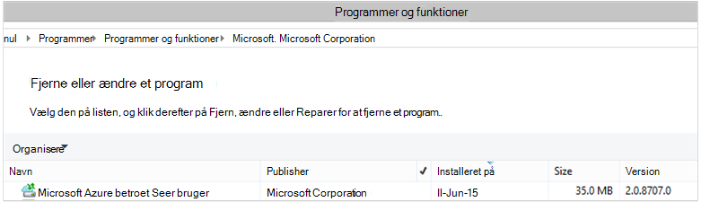

<properties
    pageTitle="Azure Sikkerhedskopiér - installere og administrere tilbage til DPM ved hjælp af PowerShell | Microsoft Azure"
    description="Lær, hvordan du installere og administrere Azure sikkerhedskopi til Data Protection Manager (DPM) ved hjælp af PowerShell"
    services="backup"
    documentationCenter=""
    authors="Nkolli1"
    manager="shreeshd"
    editor=""/>

<tags
    ms.service="backup"
    ms.workload="storage-backup-recovery"
    ms.tgt_pltfrm="na"
    ms.devlang="na"
    ms.topic="article"
    ms.date="09/27/2016"
    ms.author="jimpark; trinadhk; anuragm; markgal"/>


# <a name="deploy-and-manage-backup-to-azure-for-data-protection-manager-dpm-servers-using-powershell"></a>Installere og administrere sikkerhedskopi til Azure for Data Protection Manager (DPM) servere ved hjælp af PowerShell

> [AZURE.SELECTOR]
- [ARM](backup-dpm-automation.md)
- [Klassisk](backup-dpm-automation-classic.md)

I denne artikel beskrives, hvordan til at bruge PowerShell til konfiguration af Azure sikkerhedskopiering på en server, DPM samt til at administrere sikkerhedskopiering og gendannelse.

## <a name="setting-up-the-powershell-environment"></a>Konfiguration af PowerShell-miljø

[AZURE.INCLUDE [learn-about-deployment-models](../../includes/learn-about-deployment-models-include.md)]

Før du kan bruge PowerShell til at administrere sikkerhedskopier fra Data Protection Manager til Azure, skal du har det rigtige miljø i PowerShell. I starten af PowerShell-sessionen, sikre, at du køre følgende kommando for at importere de rigtige moduler, så du kan korrekt reference DPM cmdletter:

```
PS C:> & "C:\Program Files\Microsoft System Center 2012 R2\DPM\DPM\bin\DpmCliInitScript.ps1"

Welcome to the DPM Management Shell!

Full list of cmdlets: Get-Command
Only DPM cmdlets: Get-DPMCommand
Get general help: help
Get help for a cmdlet: help <cmdlet-name> or <cmdlet-name> -?
Get definition of a cmdlet: Get-Command <cmdlet-name> -Syntax
Sample DPM scripts: Get-DPMSampleScript
```

## <a name="setup-and-registration"></a>Konfiguration og registrering
Starte:

1. [Hent seneste PowerShell](https://github.com/Azure/azure-powershell/releases) (minimumversion påkrævet er: 1.0.0)
2. Aktivere Azure sikkerhedskopi-cmdlet'er ved at skifte til *AzureResourceManager* tilstand ved hjælp af **Skift AzureMode** cmdlet accepterer:

```
PS C:\> Switch-AzureMode AzureResourceManager
```

Følgende konfiguration og registrering opgaver du kan automatisere med PowerShell:

- Oprette en sikkerhedskopi samling
- Installation af Azure Backup agent
- Registrere med Azure sikkerhedskopi-tjenesten
- Indstillinger for netværk
- Krypteringsindstillinger

### <a name="create-a-backup-vault"></a>Oprette en sikkerhedskopi samling

> [AZURE.WARNING] For kunder, der bruger Azure sikkerhedskopi for første gang, skal du registrere Azure sikkerhedskopi-udbyderen, der skal bruges sammen med dit abonnement. Dette kan gøres ved at køre følgende kommando: Register-AzureProvider - ProviderNamespace "Microsoft.Backup"

Du kan oprette en ny sikkerhedskopiering samling ved hjælp af **Ny AzureRMBackupVault** cmdlet accepterer. Den ekstra samling af legitimationsoplysninger er en ARM ressource, så du har brug at placere det i en ressourcegruppe. Kør følgende kommandoer i en øgede Azure PowerShell console:

```
PS C:\> New-AzureResourceGroup –Name “test-rg” -Region “West US”
PS C:\> $backupvault = New-AzureRMBackupVault –ResourceGroupName “test-rg” –Name “test-vault” –Region “West US” –Storage GRS
```

Du kan få en liste over alle sikkerhedskopiering vaults i et bestemt abonnement ved hjælp af **Get-AzureRMBackupVault** cmdlet accepterer.


### <a name="installing-the-azure-backup-agent-on-a-dpm-server"></a>Installere Azure Backup agent på en DPM-Server
Før du installerer Azure Backup agent, skal du have Installationsprogrammet hentede og findes på Windows Server. Du kan få den seneste version af installationsprogrammet fra [Microsoft Download Center](http://aka.ms/azurebackup_agent) eller fra sikkerhedskopien samling dashboardside. Gemme installationsprogrammet til en nem adgang placering som * C:\Downloads\*.

For at installere agenten skal du køre følgende kommando i en øgede PowerShell console **på DPM-serveren**:

```
PS C:\> MARSAgentInstaller.exe /q
```

Derved installeres agenten med alle standardindstillingerne. Installationen tager et par minutter i baggrunden. Hvis du ikke angiver indstillingen */nu* åbnes vinduet **Windows Update** i slutningen af til at søge efter en hvilken som helst opdateringer installationen.

Agenten vises på listen over installerede programmer. Gå til **Kontrolpanel**for at se listen over installerede programmer, > **programmer** > **programmer og funktioner**.



#### <a name="installation-options"></a>Indstillinger for installation
For at se alle de indstillinger, der er tilgængelige via kommandolinjen skal du bruge følgende kommando:

```
PS C:\> MARSAgentInstaller.exe /?
```

De tilgængelige indstillinger omfatter:

| Indstillingen | Detaljer | Standard |
| ---- | ----- | ----- |
| / q | Automatisk installation | - |
| / p: "placering" | Stien til installationsmappen til Azure Backup agent. | C:\Program Files\Microsoft Azure betroet Services bruger |
| / s: "placering" | Stien til cachemappen til Azure Backup agent. | C:\Program Files\Microsoft Azure gendannelse Services Agent\Scratch |
| /m | Vælge i til Microsoft Update | - |
| /nu | Ikke søge efter opdateringer, når installationen er fuldført | - |
| / d | Fjerner Microsoft Azure betroet Services bruger | - |
| /pH | Host proxyadresse | - |
| /PO | Portnummer proxy Host | - |
| /PU | Proxy Host brugernavn | - |
| /pW | Proxy-adgangskode | - |

### <a name="registering-with-the-azure-backup-service"></a>Registrere med Azure sikkerhedskopi-tjenesten
Før du kan registrere med tjenesten Azure sikkerhedskopi, skal du sikre dig, at [forudsætninger](backup-azure-dpm-introduction.md) er opfyldt. Skal du:

- Har et gyldigt Azure-abonnement
- Har en sikkerhedskopi samling

For at hente samling legitimationsoplysningerne skal køre **Get-AzureBackupVaultCredentials** cmdlet accepterer i en Azure PowerShell console og gemme den i et praktisk sted som * C:\Downloads\*.

```
PS C:\> $credspath = "C:\"
PS C:\> $credsfilename = Get-AzureRMBackupVaultCredentials -Vault $backupvault -TargetLocation $credspath
PS C:\> $credsfilename
f5303a0b-fae4-4cdb-b44d-0e4c032dde26_backuprg_backuprn_2015-08-11--06-22-35.VaultCredentials
```

Registrering af computeren med samling af legitimationsoplysninger er færdig med [Start DPMCloudRegistration](https://technet.microsoft.com/library/jj612787) cmdlet:

```
PS C:\> $cred = $credspath + $credsfilename
PS C:\> Start-DPMCloudRegistration -DPMServerName "TestingServer" -VaultCredentialsFilePath $cred
```

Dette vil registrere DPM-serveren med navnet "TestingServer" med Microsoft Azure samling ved hjælp af de angivne samling legitimationsoplysninger.

> [AZURE.IMPORTANT] Brug ikke relative stier til at angive samling legitimationsoplysninger fil. Du skal angive en absolut sti som input til Cmdletten.

### <a name="initial-configuration-settings"></a>Indledende konfigurationsindstillinger
Når DPM-serveren er registreret med Azure sikkerhedskopi samling, starter det med abonnement standardindstillinger. Disse indstillinger for abonnement omfatter netværk, kryptering og det midlertidige område. Hvis du vil begynde ændring af abonnementsindstillinger for skal du først få styr på de eksisterende (standard) indstillinger ved hjælp af cmdlet'en [Get-DPMCloudSubscriptionSetting](https://technet.microsoft.com/library/jj612793) til:

```
$setting = Get-DPMCloudSubscriptionSetting -DPMServerName "TestingServer"
```

Alle ændringer er foretaget i dette lokale PowerShell-objekt ```$setting``` og derefter det fulde objekt er anvendt til DPM og Azure sikkerhedskopi for at gemme dem med cmdlet'en [Set-DPMCloudSubscriptionSetting](https://technet.microsoft.com/library/jj612791) til. Du skal bruge den ```–Commit``` flag for at sikre, at ændringerne er bevaret. Indstillingerne kan ikke anvendes og bruges af Azure sikkerhedskopi, medmindre anvendt.

```
PS C:\> Set-DPMCloudSubscriptionSetting -DPMServerName "TestingServer" -SubscriptionSetting $setting -Commit
```

### <a name="networking"></a>Netværk
Hvis forbindelsen af DPM maskinen til Azure sikkerhedskopi-tjenesten på internettet er gennem en proxyserver, skal proxyserverindstillinger leveres efter sikkerhedskopier kan udføres. Dette gøres ved hjælp af den ```-ProxyServer```, ```-ProxyPort```, ```-ProxyUsername``` og ```ProxyPassword``` parametre med cmdlet'en [Set-DPMCloudSubscriptionSetting](https://technet.microsoft.com/library/jj612791) til. I dette eksempel er der ingen proxyserver, så vi eksplicit rydder alle proxy-relaterede oplysninger.

```
PS C:\> Set-DPMCloudSubscriptionSetting -DPMServerName "TestingServer" -SubscriptionSetting $setting -NoProxy
```

Brugen af båndbredde kan også styres med indstillinger for ```-WorkHourBandwidth``` og ```-NonWorkHourBandwidth``` for et givet antal dage i ugen. I dette eksempel skal vi ikke angive en hvilken som helst (throttling).

```
PS C:\> Set-DPMCloudSubscriptionSetting -DPMServerName "TestingServer" -SubscriptionSetting $setting -NoThrottle
```

### <a name="configuring-the-staging-area"></a>Konfiguration af det midlertidige område
Azure Backup agent kører på DPM-serveren kræver midlertidige til dataene er gendannet fra skyen (lokale midlertidige). Konfigurere det midlertidige område ved hjælp af cmdlet'en [Set-DPMCloudSubscriptionSetting](https://technet.microsoft.com/library/jj612791) til og ```-StagingAreaPath``` parameter.

```
PS C:\> Set-DPMCloudSubscriptionSetting -DPMServerName "TestingServer" -SubscriptionSetting $setting -StagingAreaPath "C:\StagingArea"
```

I det foregående eksempel området midlertidige indstilles til *C:\StagingArea* i objektet PowerShell ```$setting```. Sørg for, at den angivne mappe findes allerede, ellers den endelige bekræftelse af indstillingerne for abonnement mislykkes.


### <a name="encryption-settings"></a>Krypteringsindstillinger
De sikkerhedskopierede data, der er sendt til Azure sikkerhedskopien er krypteret for at beskytte fortroligheden af dataene. Kryptering adgangskoden er "adgangskoden" dekryptere dataene på tidspunktet for Gendan. Det er vigtigt at gemme oplysningerne sikker, når den er indstillet.

I eksemplet herunder den første kommando Konverterer strengen ```passphrase123456789``` til en sikker streng og tildeler den secure streng til variablen med navnet ```$Passphrase```. kommandoen anden angiver sikker strengen i ```$Passphrase``` som adgangskode til at kryptere sikkerhedskopier.

```
PS C:\> $Passphrase = ConvertTo-SecureString -string "passphrase123456789" -AsPlainText -Force

PS C:\> Set-DPMCloudSubscriptionSetting -DPMServerName "TestingServer" -SubscriptionSetting $setting -EncryptionPassphrase $Passphrase
```

> [AZURE.IMPORTANT] Holde dine adgangskoden oplysninger sikker, når den er indstillet. Du vil ikke kunne gendanne data fra Azure uden dette udtryk.

På dette tidspunkt, du bør har foretaget alle de nødvendige ændringer til det ```$setting``` objekt. Husk at udføre ændringerne.

```
PS C:\> Set-DPMCloudSubscriptionSetting -DPMServerName "TestingServer" -SubscriptionSetting $setting -Commit
```

## <a name="protect-data-to-azure-backup"></a>Beskytte data til Azure sikkerhedskopi
I dette afsnit kan du føje en fremstilling server til DPM og derefter beskytte data til lokale DPM lager og derefter til Azure sikkerhedskopi. I eksemplerne gennemgås nedenfor, hvordan du sikkerhedskopierer filer og mapper. Logik kan nemt udvides til at sikkerhedskopiere alle DPM-understøttede datakilder. Alle dine DPM sikkerhedskopier er omfattet af en beskyttelse gruppe (SIDERS) med fire dele:

1. **Gruppemedlemmer** er en liste over alle de beskyttes objekter (også kendt som *datakilder* i DPM), du vil beskytte i gruppen samme beskyttelse. Du kan for eksempel vil beskytte fremstilling FOS i en gruppe af beskyttelse og SQL Server-databaser i en anden gruppen for beskyttelse, som de kan have forskellige krav til sikkerhedskopiering. Før du kan sikkerhedskopiere en datakilde på en fremstilling server, du har brug for at sikre, at DPM Agent er installeret på serveren og administreres af DPM. Følg trinnene for at [installere DPM Agent](https://technet.microsoft.com/library/bb870935.aspx) og knytte den til den relevante DPM-Server.
2. **Data beskyttelsesmetode** angiver de destinationsadresse placeringer sikkerhedskopier - bånd, disk og skyen. I vores eksempel beskytter vi data til den lokale disk og i skyen.
3. En **tidsplanen for sikkerhedskopiering** , der angiver, når sikkerhedskopier har brug at blive ført og hvor ofte dataene skal synkroniseres mellem DPM-serveren og fremstilling serveren.
4. En **plan for opbevaring af** , der angiver, hvor lang tid til at bevare de gendannelse punkter i Azure.

### <a name="creating-a-protection-group"></a>Oprette en gruppen beskyttelse
Starte med at oprette en ny beskyttelse gruppe ved hjælp af [Ny DPMProtectionGroup](https://technet.microsoft.com/library/hh881722) cmdlet.

```
PS C:\> $PG = New-DPMProtectionGroup -DPMServerName " TestingServer " -Name "ProtectGroup01"
```

Cmdletten ovenfor opretter en beskyttelse gruppe med navnet *ProtectGroup01*. En eksisterende beskyttelse gruppe kan også redigeres senere for at føje sikkerhedskopi til Azure skyen. Men for at foretage ændringer i gruppen beskyttelse - ny eller eksisterende - vi brug at få styr på en *redigerbare* objekt ved hjælp af cmdlet'en [Get-DPMModifiableProtectionGroup](https://technet.microsoft.com/library/hh881713) til.

```
PS C:\> $MPG = Get-ModifiableProtectionGroup $PG
```

### <a name="adding-group-members-to-the-protection-group"></a>At føje medlemmer til gruppen beskyttelse
Hver DPM Agent kender på listen over datakilder på den server, den er installeret på. Hvis du vil tilføje en datakilde til gruppen for beskyttelse, skal DPM Agent først sende en liste over datakilderne tilbage til DPM-serveren. En eller flere datakilder derefter vælges og føjet til gruppen beskyttelse. PowerShell trinnene behov for at få opnå denne er:

1. Hente en liste over alle servere, der administreres af DPM via DPM Agent.
2. Vælg en specifik server.
3. Hente en liste over alle datakilder på serveren.
4. Vælg en eller flere datakilder og føje dem til gruppen beskyttelse

Listen over servere som DPM Agent er installeret og administreres af DPM-serveren er hentet med cmdlet'en [Get-DPMProductionServer](https://technet.microsoft.com/library/hh881600) til. I dette eksempel skal vi filtrere og kun konfigurere PS med navnet *productionserver01* til sikkerhedskopi.

```
PS C:\> $server = Get-ProductionServer -DPMServerName "TestingServer" | where {($_.servername) –contains “productionserver01”
```

Hente nu på listen over datakilder på ```$server``` ved hjælp af cmdlet'en [Get-DPMDatasource](https://technet.microsoft.com/library/hh881605) til. I dette eksempel vi filtrering for lydstyrken *D:\* som vi vil konfigurere til sikkerhedskopi. Denne datakilde føjes derefter til gruppen beskyttelse ved hjælp af [Tilføj DPMChildDatasource](https://technet.microsoft.com/library/hh881732) cmdlet. Husk at bruge den *modifable * beskyttelse gruppeobjektet ```$MPG``` at gøre tilføjelser.

```
PS C:\> $DS = Get-Datasource -ProductionServer $server -Inquire | where { $_.Name -contains “D:\” }

PS C:\> Add-DPMChildDatasource -ProtectionGroup $MPG -ChildDatasource $DS
```

Gentag dette trin så mange gange efter behov, indtil du har tilføjet alle de valgte datakilder til gruppen for beskyttelse. Du kan også starte med kun én datakilde, og Fuldfør arbejdsprocessen til at oprette gruppen beskyttelse og tilføje flere datakilder på et senere tidspunkt til gruppen for beskyttelse.

### <a name="selecting-the-data-protection-method"></a>Valg af beskyttelsesmetode data
Når du har tilføjet datakilderne til gruppen for beskyttelse, er næste trin at angive den ved hjælp af cmdlet'en [Set-DPMProtectionType](https://technet.microsoft.com/library/hh881725) til beskyttelsesmetode. I dette eksempel bliver gruppen beskyttelse opsætningen af lokal diskplads og skyen sikkerhedskopi. Du skal også angive den datakilde, du vil beskytte til skyen ved hjælp af [Tilføj DPMChildDatasource](https://technet.microsoft.com/library/hh881732.aspx) cmdlet med - Online flag.

```
PS C:\> Set-DPMProtectionType -ProtectionGroup $MPG -ShortTerm Disk –LongTerm Online
PS C:\> Add-DPMChildDatasource -ProtectionGroup $MPG -ChildDatasource $DS –Online
```

### <a name="setting-the-retention-range"></a>Angive området opbevaring
Angive opbevaring for de ekstra punkter ved hjælp af cmdlet'en [Set-DPMPolicyObjective](https://technet.microsoft.com/library/hh881762) til. Mens det kan virke ulige til at angive opbevaring, før tidsplanen for sikkerhedskopiering, der er defineret, ved hjælp af den ```Set-DPMPolicyObjective``` cmdlet angiver automatisk en ekstra tidsplan, der kan derefter redigeres. Det er altid muligt at angive, at sikkerhedskopieringen planlægge først og opbevaringspolitikken efter.

I eksemplet herunder angiver cmdlet opbevaring parametrene for disken sikkerhedskopier. Dette vil bevare sikkerhedskopier for 10 dage, og Synkroniser data hver 6 timer mellem fremstilling serveren og DPM-serveren. Den ```SynchronizationFrequencyMinutes``` ikke definere, hvor ofte et ekstra punkt er oprettet, men hvor ofte dataene er kopieret til DPM-serveren. Dette forhindrer, at sikkerhedskopiering bliver for stor.

```
PS C:\> Set-DPMPolicyObjective –ProtectionGroup $MPG -RetentionRangeInDays 10 -SynchronizationFrequencyMinutes 360
```

Efter sikkerhedskopier gå til Azure (DPM refererer til disse som Online sikkerhedskopier) opbevaring områder kan konfigureres til [langtidsaftale opbevaring ved hjælp af en bedstefar-far-søn skemaet (GFS)](backup-azure-backup-cloud-as-tape.md). Det vil sige, kan du angive en kombinerede opbevaringspolitik, der involverer dagligt, ugentligt, månedligt og årligt opbevaringspolitikker. I dette eksempel skal vi oprette en matrix, der repræsenterer den komplekse opbevaring farveskema, vi vil og derefter konfigurere opbevaring området ved hjælp af cmdlet'en [Set-DPMPolicyObjective](https://technet.microsoft.com/library/hh881762) til.

```
PS C:\> $RRlist = @()
PS C:\> $RRList += (New-Object -TypeName Microsoft.Internal.EnterpriseStorage.Dls.UI.ObjectModel.OMCommon.RetentionRange -ArgumentList 180, Days)
PS C:\> $RRList += (New-Object -TypeName Microsoft.Internal.EnterpriseStorage.Dls.UI.ObjectModel.OMCommon.RetentionRange -ArgumentList 104, Weeks)
PS C:\> $RRList += (New-Object -TypeName Microsoft.Internal.EnterpriseStorage.Dls.UI.ObjectModel.OMCommon.RetentionRange -ArgumentList 60, Month)
PS C:\> $RRList += (New-Object -TypeName Microsoft.Internal.EnterpriseStorage.Dls.UI.ObjectModel.OMCommon.RetentionRange -ArgumentList 10, Years)
PS C:\> Set-DPMPolicyObjective –ProtectionGroup $MPG -OnlineRetentionRangeList $RRlist
```

### <a name="set-the-backup-schedule"></a>Angive tidsplanen for sikkerhedskopiering
DPM angiver en plan for sikkerhedskopiering standard automatisk, hvis du angiver den beskyttelse målsætning ved hjælp af den ```Set-DPMPolicyObjective``` cmdlet. Brug cmdlet'en [Get-DPMPolicySchedule](https://technet.microsoft.com/library/hh881749) til efterfulgt af cmdlet'en [Set-DPMPolicySchedule](https://technet.microsoft.com/library/hh881723) til at ændre standard tidsplaner.

```
PS C:\> $onlineSch = Get-DPMPolicySchedule -ProtectionGroup $mpg -LongTerm Online
PS C:\> Set-DPMPolicySchedule -ProtectionGroup $MPG -Schedule $onlineSch[0] -TimesOfDay 02:00
PS C:\> Set-DPMPolicySchedule -ProtectionGroup $MPG -Schedule $onlineSch[1] -TimesOfDay 02:00 -DaysOfWeek Sa,Su –Interval 1
PS C:\> Set-DPMPolicySchedule -ProtectionGroup $MPG -Schedule $onlineSch[2] -TimesOfDay 02:00 -RelativeIntervals First,Third –DaysOfWeek Sa
PS C:\> Set-DPMPolicySchedule -ProtectionGroup $MPG -Schedule $onlineSch[3] -TimesOfDay 02:00 -DaysOfMonth 2,5,8,9 -Months Jan,Jul
PS C:\> Set-DPMProtectionGroup -ProtectionGroup $MPG
```

I eksemplet ovenfor, ```$onlineSch``` er en matrix med fire elementer, der indeholder den eksisterende online beskyttelse tidsplan til gruppen beskyttelse i GFS farveskema:

1. ```$onlineSch[0]```skal indeholde den dagsplan
2. ```$onlineSch[1]```skal indeholde den ugeplan
3. ```$onlineSch[2]```indeholder månedlige planen
4. ```$onlineSch[3]```indeholder årlige planen

Så hvis du vil redigere den ugeplan, skal du henvise til den ```$onlineSch[1]```.

### <a name="initial-backup"></a>Første sikkerhedskopi
Når sikkerhedskopiering af en datakilde for første gang, skal DPM til at oprette en indledende kopi, som opretter en kopi af datakilden, som skal beskyttes på DPM replika lydstyrken. Denne aktivitet kan enten være planlagt til et bestemt tidspunkt eller kan udløses manuelt ved hjælp af cmdlet'en [Set-DPMReplicaCreationMethod](https://technet.microsoft.com/library/hh881715) til med parameteren ```-NOW```.

```
PS C:\> Set-DPMReplicaCreationMethod -ProtectionGroup $MPG -NOW
```
### <a name="changing-the-size-of-dpm-replica--recovery-point-volume"></a>Ændring af størrelsen af DPM replika & gendannelse punkt lydstyrken
Du kan også ændre størrelsen på DPM replika lydstyrken samt øjebliksbillede lydstyrken ved hjælp af [Sæt DPMDatasourceDiskAllocation](https://technet.microsoft.com/library/hh881618.aspx) cmdlet som i den nedenstående eksempel: Get-DatasourceDiskAllocation - datakilde $DS sæt-DatasourceDiskAllocation - datakilde $DS - ProtectionGroup $MPG-manuel - ReplicaArea (2 gb) - ShadowCopyArea (2 gb)

### <a name="committing-the-changes-to-the-protection-group"></a>Gemmer ændringerne i gruppen beskyttelse
Til sidst skal skal ændres bekræftes, før DPM kan tage sikkerhedskopi i den nye gruppen beskyttelse konfiguration. Dette gøres ved hjælp af cmdlet'en [Set-DPMProtectionGroup](https://technet.microsoft.com/library/hh881758) til.

```
PS C:\> Set-DPMProtectionGroup -ProtectionGroup $MPG
```
## <a name="view-the-backup-points"></a>Få vist de ekstra punkter
Du kan bruge cmdlet'en [Get-DPMRecoveryPoint](https://technet.microsoft.com/library/hh881746) til at hente en liste over alle gendannelse punkter til en datakilde. I dette eksempel skal vi:
- hente alle PGs på DPM serveren, der skal gemmes i en matrix```$PG```
- få de datakilder, der svarer til den```$PG[0]```
- få alle de gendannelse punkter til en datakilde.

```
PS C:\> $PG = Get-DPMProtectionGroup –DPMServerName "TestingServer"
PS C:\> $DS = Get-DPMDatasource -ProtectionGroup $PG[0]
PS C:\> $RecoveryPoints = Get-DPMRecoverypoint -Datasource $DS[0] -Online
```

## <a name="restore-data-protected-on-azure"></a>Gendanne data, der er beskyttet på Azure
Gendanne data er en kombination af en ```RecoverableItem``` objekt og en ```RecoveryOption``` objekt. I det forrige afsnit har vi en liste over de ekstra punkter til en datakilde.

I eksemplet herunder viser vi, hvordan du gendanner en Hyper-V virtuel maskine fra Azure sikkerhedskopiering ved at kombinere sikkerhedskopiering punkter med destinationen for gendannelse. Dette omfatter:

- Oprette en indstilling for gendannelse ved hjælp af [Ny DPMRecoveryOption](https://technet.microsoft.com/library/hh881592) cmdlet.
- Hentning af en række sikkerhedskopiering punkter ved hjælp af den ```Get-DPMRecoveryPoint``` cmdlet.
- Hvis du vælger et ekstra punkt for at gendanne fra.

```
PS C:\> $RecoveryOption = New-DPMRecoveryOption -HyperVDatasource -TargetServer "HVDCenter02" -RecoveryLocation AlternateHyperVServer -RecoveryType Recover -TargetLocation “C:\VMRecovery”

PS C:\> $PG = Get-DPMProtectionGroup –DPMServerName "TestingServer"
PS C:\> $DS = Get-DPMDatasource -ProtectionGroup $PG[0]
PS C:\> $RecoveryPoints = Get-DPMRecoverypoint -Datasource $DS[0] -Online

PS C:\> Restore-DPMRecoverableItem -RecoverableItem $RecoveryPoints[0] -RecoveryOption $RecoveryOption
```

Kommandoerne kan nemt udvides til en hvilken som helst datakildetypen.

## <a name="next-steps"></a>Næste trin

- Flere oplysninger om Azure sikkerhedskopi til DPM under [Introduktion til DPM sikkerhedskopi](backup-azure-dpm-introduction.md)
