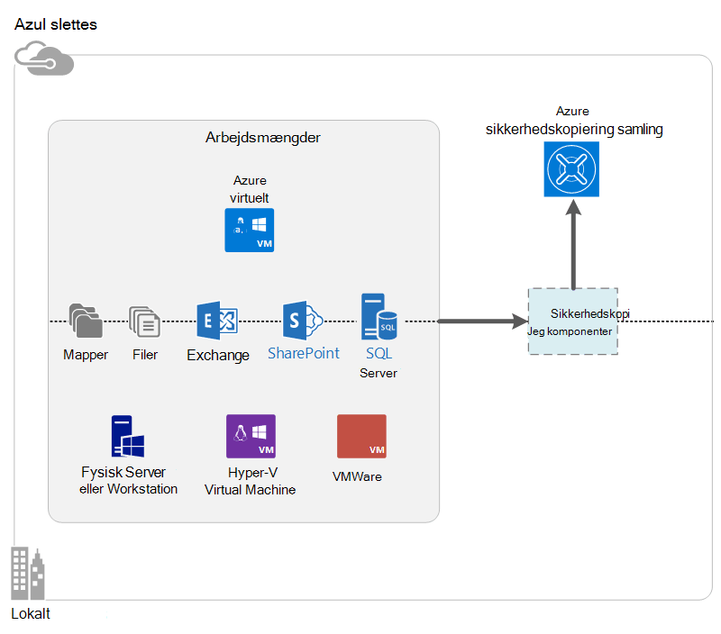

<properties
    pageTitle="Hvad er Azure sikkerhedskopi? | Microsoft Azure"
    description="Ved hjælp af Azure sikkerhedskopiering og gendannelsestjenester, kan du sikkerhedskopiere og gendanne data og programmer fra Windows-servere Windows klientcomputere, System Center DPM servere og Azure virtuelle maskiner."
    services="backup"
    documentationCenter=""
    authors="markgalioto"
    manager="cfreeman"
    editor="tysonn"
    keywords="sikkerhedskopiere og gendanne; gendannelse tjenesterne; Sikkerhedskopiering løsninger"/>

<tags
    ms.service="backup"
    ms.workload="storage-backup-recovery"
    ms.tgt_pltfrm="na"
    ms.devlang="na"
    ms.topic="get-started-article"
    ms.date="10/19/2016"
    ms.author="jimpark; trinadhk"/>

# Hvad er Azure sikkerhedskopi?
Azure sikkerhedskopi er den tjeneste, som du kan bruge til at sikkerhedskopiere og gendanne dine data i Microsoft cloud. Den erstatter din eksisterende lokalt eller løsning til sikkerhedskopiering med en skybaseret løsning, der er pålidelig, sikker og omkostninger-Konkurrentanalyse. Det hjælper også med at beskytte aktiver, der kører i skyen. Azure sikkerhedskopiering viser gendannelsestjenester, der bygger på en verdensklasse infrastruktur, der er SVG, pålidelig og høj tilgængelighed.

[Se en video oversigt over sikkerhedskopiering af Azure](https://azure.microsoft.com/documentation/videos/what-is-azure-backup/)

## Hvorfor bruge Azure sikkerhedskopi?
Traditionelle sikkerhedskopiering løsninger har udviklet for at behandle skyen som et slutpunkt ligner diske eller bånd. Mens denne metode er enkel, er det er også begrænset. Det tager ikke fuldt udbytte af en underliggende skyen platform og omsættes til en ineffektiv, dyrt løsning.
I modsætning leverer Azure sikkerhedskopiering alle fordelene ved en løsning til sikkerhedskopiering effektive og økonomisk skyen. Her er nogle af de vigtigste fordele, som indeholder et Azure sikkerhedskopi.

| Funktion | Fordel |
| ------- | ------- |
| Automatisk Lagerstyring | Udgift kapital er nødvendig for lokale lagerenheder. Azure sikkerhedskopi automatisk allokerer og styrer ekstra lagerplads, og den bruger en løn som-du-brug forbrug model. |
| Ubegrænset skalering | Drage fordel af høj tilgængelighed garantier uden indirekte af vedligeholdelse og overvågning. Azure sikkerhedskopi anvender den underliggende power og skalaen på den Azure sky med dens nonintrusive Autoskalering muligheder. |
| Flere indstillinger for lagring | Vælg din ekstra lagerplads, der er baseret på har du brug for:<li>Et lokalt overflødige lagerplads Bloker blob er velegnet til pris prioriteres kunder, og den er stadig hjælper med at beskytte data mod lokale hardware mislykkede forsøg. <li>En geografisk gentagelse lagerplads Bloker blob indeholder tre flere kopier i en parvis datacenter. Disse ekstra kopier til at sikre, at dataene sikkerhedskopiering er meget tilgængelige, selvom en Azure webstedsniveau nedbrud opstår. |
| Ubegrænset dataoverførsel | Der er gratis for en hvilken som helst (udgående) udgangspunkt dataoverførsel under en gendannelse fra sikkerhedskopi-samling. Data indgående til Azure er også gratis. Fungerer med importtjenesten, hvor den er tilgængelig. |
| Kryptering af data | Kryptering af data giver mulighed for sikker overførsel og opbevaring af kundedata i offentlige skyen. Kryptering adgangskoden er gemt på kilden, og den er aldrig overføres eller gemt i Azure. Krypteringsnøglen er påkrævet for at gendanne nogle af dataene, og kun kunden har fuld adgang til dataene i tjenesten. |  
| Program-ensartet sikkerhedskopi | Program-ensartet sikkerhedskopier af Windows til at sikre, at løsninger ikke som er nødvendige på tidspunktet for gendannelse, hvilket reducerer formålet gendannelse tid. Dette gør det muligt at vende tilbage til tilstanden, der kører hurtigere. |
| Langsigtede opbevaring | I stedet for betale for båndbackupløsninger, kunder kan tilbage til Azure, som giver en overbevisende synes godt om bånd-løsning med lave omkostninger. |

## Azure sikkerhedskopi komponenter
Da sikkerhedskopi er en løsning til sikkerhedskopiering hybrid, er det består af flere komponenter, der fungerer sammen til at aktivere til slut sikkerhedskopiering og gendannelse arbejdsprocesser.

### Installationsscenarier

| Komponent | Kan anvendes i Azure? | Kan være udløst lokalt? | Target lagerplads understøttes|
| --- | --- | --- | --- |
| Azure Backup agent | 
**Ja**
 
Azure Backup agent kan installeres på en hvilken som helst Windows Server VM, der kører i Azure.
 | 
**Ja**
 
Backup agent kan installeres på en hvilken som helst Windows Server VM eller fysisk maskine.
 | 
Azure sikkerhedskopi samling
 |
| System Center Data Protection Manager (DPM) | 
**Ja**

Lær mere om, [hvordan du beskytter arbejdsmængder i Azure ved hjælp af System Center DPM](http://blogs.technet.com/b/dpm/archive/2014/09/02/azure-iaas-workload-protection-using-data-protection-manager.aspx).
 | 
**Ja**
 
Lær mere om, [hvordan du beskytter arbejdsmængder og FOS i dit datacenter](https://technet.microsoft.com/library/hh758173.aspx).
 | 
Lokalt tilknyttet disk
 
Azure sikkerhedskopi samling,
 
bånd (lokale kun)
 |
| Server til Azure sikkerhedskopiering | 
**Ja**

Lær mere om, [hvordan du beskytter arbejdsmængder i Azure ved hjælp af Azure Backup Server](backup-azure-microsoft-azure-backup.md).
 | 
**Ja**
 
Lær mere om, [hvordan du beskytter arbejdsmængder i Azure ved hjælp af Azure Backup Server](backup-azure-microsoft-azure-backup.md).
 | 
Lokalt tilknyttet disk
 
Azure sikkerhedskopi samling
 |
| Azure sikkerhedskopi (VM lokalnummer) | 
**Ja**

En del af Azure-strukturen

Specialiserede for [Sikkerhedskopiering af Azure-infrastrukturen som en tjeneste (IaaS) virtuelle computere](backup-azure-vms-introduction.md).
 | 
**Nej**
 
Bruge System Center DPM til at sikkerhedskopiere virtuelle maskiner i dit datacenter.
 | 
Azure sikkerhedskopi samling
 |

### Komponent niveau fordele og begrænsninger

| Komponent | Fordele | Begrænsninger | Gendannelse granularitet |
| --- | --- | --- | --- |
| Azure sikkerhedskopi (MARS) agent | <li>Kan sikkerhedskopiering af filer og mapper på en Windows OS maskine, er det fysisk eller virtuel (FOS kan være et vilkårligt sted i det lokale miljø eller Azure)<li>Ingen separat sikkerhedskopiering server kræves<li>Bruger Azure sikkerhedskopiering samling | <li>Gendanne tre gange en dag/sikkerhedskopifil ad gangen<li>Fil/mappe/lydstyrken niveau Gendan kun, ikke programmet opmærksom på<li>Ingen understøttelse af Linux | filer/mapper/enheder |
| System Center Data Protection Manager | <li>App opmærksom på snapshots (VSS)<li>Fuld fleksibilitet for hvornår du skal foretage sikkerhedskopier<li>Gendannelse granularitet (alle)<li>Kan bruge Azure sikkerhedskopi samling<li>Linux support (hvis hostes på Hyper-V) | <li>Manglende forskellige support (VMware VM sikkerhedskopiere, Oracle arbejdsbelastningen op).  | filer/mapper/enheder / FOS/programmer |
| Server til Microsoft Azure sikkerhedskopiering | <li>App opmærksom på snapshots (VSS)<li>Fuld fleksibilitet for hvornår du skal foretage sikkerhedskopier<li>Gendannelse granularitet (alle)<li>Kan bruge Azure sikkerhedskopi samling<li>Linux support (hvis hostes på Hyper-V)<li>Kræver ikke en System Center-licens | <li>Manglende forskellige support (VMware VM sikkerhedskopiere, Oracle arbejdsbelastningen op).<li>Altid kræver direkte Azure abonnement<li>Ingen understøttelse af sikkerhedskopi på bånd | filer/mapper/enheder / FOS/programmer |
| Azure IaaS VM sikkerhedskopi | <li>Lokale sikkerhedskopier for Windows/Linux<li>Ingen bestemt agent-installation, der er påkrævet<li>Strukturen niveau sikkerhedskopi uden nogen ekstra infrastruktur behov | <li>En gang om dagen tilbage op/disk niveau Gendan<li>Kan ikke sikkerhedskopiere lokalt | FOS Alle diske (ved hjælp af PowerShell) |

## Hvilke programmer og arbejdsbelastninger, som kan sikkerhedskopieres?

| Arbejdsbelastning | Kilde maskine | Løsning til sikkerhedskopiering af Azure |
| --- | --- |---|
| Filer og mapper | Windows Server | 
[Azure Backup agent](backup-configure-vault.md)
 
[System Center DPM](backup-azure-dpm-introduction.md) (+ Azure Backup agent),
 
[Server til Azure sikkerhedskopiering](backup-azure-microsoft-azure-backup.md) (inkluderer Azure Backup agent)
  |
| Filer og mapper | Windows-klient | 
[Azure Backup agent](backup-configure-vault.md)
 
[System Center DPM](backup-azure-dpm-introduction.md) (+ Azure Backup agent),
 
[Server til Azure sikkerhedskopiering](backup-azure-microsoft-azure-backup.md) (inkluderer Azure Backup agent)
  |
| Virtuelt Hyper-V (Windows) | Windows Server | 
[System Center DPM](backup-azure-backup-sql.md) (+ Azure Backup agent),
 
[Server til Azure sikkerhedskopiering](backup-azure-microsoft-azure-backup.md) (inkluderer Azure Backup agent)
 |
| Virtuelt Hyper-V (Linux) | Windows Server | 
[System Center DPM](backup-azure-backup-sql.md) (+ Azure Backup agent),
 
[Server til Azure sikkerhedskopiering](backup-azure-microsoft-azure-backup.md) (inkluderer Azure Backup agent)
  |
| Microsoft SQL Server | Windows Server | 
[System Center DPM](backup-azure-backup-sql.md) (+ Azure Backup agent),
 
[Server til Azure sikkerhedskopiering](backup-azure-microsoft-azure-backup.md) (inkluderer Azure Backup agent)
  |
| Microsoft SharePoint | Windows Server | 
[System Center DPM](backup-azure-backup-sql.md) (+ Azure Backup agent),
 
[Server til Azure sikkerhedskopiering](backup-azure-microsoft-azure-backup.md) (inkluderer Azure Backup agent)
   |
| Microsoft Exchange |  Windows Server | 
[System Center DPM](backup-azure-backup-sql.md) (+ Azure Backup agent),
 
[Server til Azure sikkerhedskopiering](backup-azure-microsoft-azure-backup.md) (inkluderer Azure Backup agent)
   |
| Azure IaaS FOS (Windows) | - | [Azure sikkerhedskopi (VM lokalnummer)](backup-azure-vms-introduction.md) |
| Azure IaaS FOS (Linux) | - | [Azure sikkerhedskopi (VM lokalnummer)](backup-azure-vms-introduction.md) |

## ARM og Linux support

| Komponent | ARM-Support | Linux (Azure godkendt) Support |
| --- | --- | --- |
| Azure sikkerhedskopi (MARS) agent | Ja | Ingen (kun Windows-baseret agent) |
| System Center Data Protection Manager | Ja (Agent i gæst) | Du kan kun Hyper-V (ikke Azure VM) kun fil ensartet sikkerhedskopi |
| Azure Backup Server (MABS) | Ja (Agent i gæst) | Kun kun fil ensartet sikkerhedskopiering af Hyper-V (ikke Azure VM) er mulige (samme som DPM) |
| Azure IaaS VM sikkerhedskopi | Ja | Ja |

[AZURE.INCLUDE [learn-about-deployment-models](../../includes/learn-about-deployment-models-include.md)]

## Sikkerhedskopiere og gendanne Premium lagerplads FOS

Tjenesten Azure sikkerhedskopi beskytter nu Premium lagerplads FOS.

### Sikkerhedskopiere Premium lagerplads FOS

Under sikkerhedskopiering af Premium lagerplads FOS, opretter tjenesten sikkerhedskopiering af en midlertidig midlertidige placering i kontoen Premium lagerplads. Den midlertidige placering med navnet "AzureBackup-", er lig med den samlede datastørrelse premium diskene vedhæftet til VM.

>[AZURE.NOTE] Undlad at ændre eller redigere den midlertidige placering.

Når sikkerhedskopieringen er fuldført, slettes den midlertidige placering. Pris lager, der bruges til den midlertidige placering stemmer overens med alle [Premium lagerplads priser](../storage/storage-premium-storage.md#pricing-and-billing).

### Gendanne Premium lagerplads FOS

Premium lagerplads VM kan gendannes, enten Premium lagerplads eller normal lagerplads. Gendanne et Premium lagerplads VM gendannelsespunkt til Premium lagerplads er den mest almindelige proces af gendannelse. Det kan dog være rentable gendanne et Premium lagerplads VM gendannelsespunkt til standard-lager. Denne type gendannelse kan bruges, hvis du har brug for et undersæt af filer fra VM.

## Funktionalitet
Disse fem tabeller opsummere hvordan sikkerhedskopiering funktionalitet skal håndteres i hver komponent.

### Lagerplads

| Funktion | Azure Backup agent | System Center DPM | Server til Azure sikkerhedskopiering | Azure sikkerhedskopi (VM lokalnummer) |
| ------- | --- | --- | --- | ---- |
| Azure sikkerhedskopi samling | ![Ja][green] | ![Ja][green] | ![Ja][green] | ![Ja][green] |
| Plads | | ![Ja][green] | ![Ja][green] |  |
| Bånd lagerplads | | ![Ja][green] |  | |
| Komprimering (i sikkerhedskopiering samling) | ![Ja][green] | ![Ja][green]| ![Ja][green] | |
| Trinvis sikkerhedskopiering | ![Ja][green] | ![Ja][green] | ![Ja][green] | ![Ja][green] |
| Disken deduplication | | ![Delvist][yellow] | ![Delvist][yellow]| | |

Sikkerhedskopi samling er foretrukne lagerplads mål på tværs af alle komponenter. System Center DPM og Backup Server giver også mulighed for at have en lokal disk kopi. Men kun System Center DPM giver mulighed for at skrive data til en bånd lagerplads enhed.

#### Trinvis sikkerhedskopiering
Hver komponent understøtter trinvis sikkerhedskopiering uanset target opbevaring (disken, bånd, sikkerhedskopiering samling). Trinvis sikkerhedskopiering sikrer, at sikkerhedskopiering lagerplads og effektivt, ved at overføre kun de ændringer, der er foretaget, siden den sidste sikkerhedskopiering.

#### Komprimering
Sikkerhedskopier komprimeres for at reducere den nødvendige lagerplads. Den eneste komponent, der ikke bruger komprimering er filtypenavnet VM. Med VM lokalnummer alle sikkerhedskopidata er kopieret fra lagerplads kundekonto til den ekstra samling af legitimationsoplysninger i samme område uden at komprimere den. Mens gå uden komprimering lidt inflates anvendt lagerplads, gemmer data uden komprimering giver mulighed for gendannelse hurtigere.

#### Deduplication
Deduplication understøttes i System Center DPM og sikkerhedskopiering af Server, når det er [implementeret i et virtuelt Hyper-V](http://blogs.technet.com/b/dpm/archive/2015/01/06/deduplication-of-dpm-storage-reduce-dpm-storage-consumption.aspx). Deduplication udføres på niveauet for host ved hjælp af Windows Server deduplication på virtuelle harddiske (virtuelle harddiske), der er knyttet til den virtuelle maskine som ekstra lagerplads.

>[AZURE.WARNING] Deduplication er ikke tilgængelig i Azure på grund af komponenterne til sikkerhedskopi. Når System Center DPM og Backup Server er installeret på Azure, kan ikke være deduplicated lagerplads diskene vedhæftet til VM.

### Sikkerhed

| Funktion | Azure Backup agent | System Center DPM | Server til Azure sikkerhedskopiering | Azure sikkerhedskopi (VM lokalnummer) |
| ------- | --- | --- | --- | ---- |
| Netværkssikkerhed (til Azure) | ![Ja][green] |![Ja][green] | ![Ja][green] | ![Delvist][yellow]|
| Datasikkerhed (i Azure) | ![Ja][green] |![Ja][green] | ![Ja][green] | ![Delvist][yellow]|

Alle sikkerhedskopiering trafik fra serverne til sikkerhedskopi samling er krypteret ved hjælp af avancerede kryptering Standard 256. Data, der sendes via en sikker HTTPS-kæde. Sikkerhedskopidataene er også gemt i sikkerhedskopi samling af legitimationsoplysninger i krypteret form. Kun kunden indeholder adgangskoden til at låse op disse data. Microsoft kan ikke dekryptere sikkerhedskopidataene når som helst.

>[AZURE.WARNING] Tasten bruges til at kryptere sikkerhedskopidataene findes kun til kunden. Microsoft bevare ikke en kopi i Azure og har ikke adgang til nøglen. Hvis er forlagt nøglen, gendanne ikke Microsoft sikkerhedskopidataene.

Sikkerhedskopiere Azure FOS kræver konfiguration af kryptering *inden for* den virtuelle maskine. Bruge BitLocker på Windows virtuelle maskiner og **dm crypt** på Linux virtuelle computere. Azure sikkerhedskopi krypterer ikke automatisk sikkerhedskopidata, der leveres via denne sti.

### Understøttede arbejdsmængder

| Funktion | Azure Backup agent | System Center DPM | Server til Azure sikkerhedskopiering | Azure sikkerhedskopi (VM lokalnummer) |
| ------- | --- | --- | --- | ---- |
| Windows Server computer - filer og mapper | ![Ja][green] | ![Ja][green] | ![Ja][green] | |
| Windows klientmaskinen - filer og mapper | ![Ja][green] | ![Ja][green] | ![Ja][green] | |
| Virtuelt Hyper-V (Windows) | | ![Ja][green] | ![Ja][green] | |
| Virtuelt Hyper-V (Linux) | | ![Ja][green] | ![Ja][green] | |
| Microsoft SQL Server | | ![Ja][green] | ![Ja][green] | |
| Microsoft SharePoint | | ![Ja][green] | ![Ja][green] | |
| Microsoft Exchange  | | ![Ja][green] | ![Ja][green] | |
| Azure virtuelt (Windows) | | | | ![Ja][green] |
| Azure virtuelt (Linux) | | | | ![Ja][green] |

### Netværk

| Funktion | Azure Backup agent | System Center DPM | Server til Azure sikkerhedskopiering | Azure sikkerhedskopi (VM lokalnummer) |
| ------- | --- | --- | --- | ---- |
| Netværkskomprimering (til serveren til sikkerhedskopiering) | | ![Ja][green] | ![Ja][green] | |
| Netværkskomprimering (til sikkerhedskopiering samling) | ![Ja][green] | ![Ja][green] | ![Ja][green] | |
| Netværksprotokol (til serveren til sikkerhedskopiering) | | TCP | TCP | |
| Netværksprotokol (til sikkerhedskopiering samling) | HTTPS | HTTPS | HTTPS | HTTPS |

Det er ikke nødvendigt at optimere denne trafik, fordi filtypenavnet VM læser data direkte fra Azure lagerplads firma via netværket lagerplads. Trafikken er over det lokale lager netværk i Azure datacenteret, så der er lille behov for komprimering på grund af båndbredde overvejelser i forbindelse med.

Hvis du sikkerhedskopierer dine data til en server til sikkerhedskopiering (DPM eller Server til sikkerhedskopiering), kan trafik fra den primære server til serveren til sikkerhedskopiering komprimeres for at gemme på båndbredde.

#### Netværk (throttling)
Azure Backup agent indeholder variere den benyttede egenskab, hvor du kan styre, hvordan netværksbåndbredde bruges under dataoverførsel. (Throttling) kan være nyttig, hvis du vil sikkerhedskopiere data under arbejdstimer, men ikke vil sikkerhedskopieringen forstyrrer andre internettrafik. (Throttling) for data gælder filoverførsel for at sikkerhedskopiere og gendanne aktiviteter.

### Sikkerhedskopierings- og opbevaring

|  | Azure Backup agent | System Center DPM | Server til Azure sikkerhedskopiering | Azure sikkerhedskopi (VM lokalnummer) |
| --- | --- | --- | --- | --- |
| Sikkerhedskopiering frekvens (til sikkerhedskopiering samling) | Tre sikkerhedskopier dagen | To sikkerhedskopier dagen |To sikkerhedskopier dagen | En sikkerhedskopi dagen |
| Sikkerhedskopiering frekvens (på disk) | Ikke relevant | 
Hver 15 minutter til SQL Server
 
Hver time for andre arbejdsmængder
 | 
Hver 15 minutter til SQL Server
 
Hver time for andre arbejdsmængder
 |Ikke relevant |
| Indstillinger for dataopbevaring | Dagligt, ugentligt, månedligt, årligt | Dagligt, ugentligt, månedligt, årligt | Dagligt, ugentligt, månedligt, årligt |Dagligt, ugentligt, månedligt, årligt |
| Opbevaringsperiode | Op til 99 år | Op til 99 år | Op til 99 år | Op til 99 år |
| Gendannelse punkter i sikkerhedskopi samling | Ubegrænset | Ubegrænset | Ubegrænset | Ubegrænset |
| Gendannelse punkter på lokal disk | Ikke relevant | 64 for filservere  448 for programmet servere | 64 for filservere  448 for programmet servere |Ikke relevant |
| Gendannelse punkter på båndet | Ikke relevant | Ubegrænset | Ikke relevant | Ikke relevant |

## Hvad er samling legitimationsoplysninger fil?

Filen samling legitimationsoplysninger er et certifikat, der genereres af portalen for hver ekstra samling. På portalen overfører derefter offentlig nøgle til Access ACS (Control Service). Privat nøgle er angivet til brugeren, når du henter legitimationsoplysningerne og derefter angivet under den maskine registrering. Privat nøgle godkender computer for at sende backup-data til en identificerede samling i tjenesten Azure sikkerhedskopiering.

Samling af legitimationsoplysninger legitimationsoplysninger bruges kun under registrering arbejdsprocessen. Det er din ansvaret for at sikre, at filen samling legitimationsoplysninger ikke er er blevet kompromitteret. Hvis den falder i hænder af enhver uautoriseret-bruger, kan filen samling legitimationsoplysninger bruges til at registrere andre computere mod den samme samling af legitimationsoplysninger. Blive men da sikkerhedskopidataene er krypteret med en adgangskode, der kun tilhører kunden, eksisterende sikkerhedskopierede data kan ikke afsløret. For at reducere disse bekymringer er samling legitimationsoplysningerne angivet til at udløbe i 48 timer. Mens du kan hente samling legitimationsoplysninger for en sikkerhedskopi vault en hvilken som helst antal gange, kun den seneste fil er gældende under registrering arbejdsprocessen.

## Hvordan adskiller Azure sikkerhedskopi fra Azure gendannelse af websteder?
Mange kunder forveksle sikkerhedskopiering gendannelse og nedbrud. Begge registrere data og giver Gendan semantik, men deres core tilbud er forskellige.

Azure sikkerhedskopiering kopierer data i det lokale miljø og skyen. Azure gendannelse af websteder koordinater virtuelt og fysiske server gentagelse, failover og failback. Begge tjenester er vigtigt, fordi din nedbrud gendannelse løsningen skal beskytte dine data og genoprettelige (sikkerhedskopi) *og* bevare din arbejdsbelastninger, der er tilgængelige (gendannelse af websteder), når der optræder afbrydelser.

Følgende begreber hjælpe dig med at træffe vigtige beslutninger omkring sikkerhedskopiering og genoprettelse efter nedbrud.

| Konceptet | Detaljer | Sikkerhedskopi | Nedbrud (DR) |
| ------- | ------- | ------ | ----------------- |
| Gendannelse punkt mål (frigivne Produktionsordre) | Mængden af acceptable datatab, hvis en genoprettelse skal udføres. | Sikkerhedskopiering løsninger har store variationer i deres acceptable frigivne Produktionsordre. Virtuel machine-sikkerhedskopiering har normalt et frigivne Produktionsordre på én dag, mens databasesikkerhedskopier har frigivne produktionsordrer så lave som 15 minutter. | Løsninger til genoprettelse efter genoprettelse har lav frigivne produktionsordrer. Kopiér DR kan være bag ved et par sekunder eller et par minutter. |
| Gendannelse tid mål (RTO) | Mængden tid, det tager at fuldføre en genoprettelse eller gendanne. | På grund af frigivne Produktionsordre større er mængden data, som en løsning til sikkerhedskopiering skal bruge til at behandle typisk meget højere, som fører til længere RTOs. Det kan for eksempel tage dage til at gendanne data fra bånd, afhængigt af den tid det tager for at transport båndet fra en placering. | Løsninger til genoprettelse efter genoprettelse har mindre RTOs, fordi de er mere synkroniseret med kilden. Færre ændringer skal behandles. |
| Opbevaring | Hvor længe data skal gemmes | For scenarier, der kræver funktionsdygtige gendannelse (databeskadigelse, utilsigtede sletningen, OS fejl), bevares sikkerhedskopidata typisk i 30 dage eller mindre. Fra et Overholdelse synspunkt muligvis data gemmes måneder eller endda år. Sikkerhedskopiere data er velegnet til at arkivere i så fald. | Nedbrud skal kun funktionsdygtige gendannelsesdata, der tager typisk et par timer eller op til en dag. På grund af de detaljerede data registreringer, der bruges i DR løsninger, anbefales ved hjælp af DR data til langsigtede opbevaring ikke. |

## Næste trin

Prøv en simpel Azure sikkerhedskopi. Yderligere oplysninger finder du se en af disse selvstudier:

- [Prøv Azure sikkerhedskopiere](backup-try-azure-backup-in-10-mins.md)
- [Prøv Azure VM sikkerhedskopiere](backup-azure-vms-first-look.md)

Fordi disse selvstudier hjælp til at sikkerhedskopiere hurtigt, bliver de vist du den mest direkte sti til at sikkerhedskopiere dine data. Vil gøre, skal du se yderligere oplysninger om typen op du:

- [Sikkerhedskopiere Windows-computer](backup-configure-vault.md)
- [Sikkerhedskopiere arbejdsbelastninger](backup-azure-microsoft-azure-backup.md)
- [Sikkerhedskopiering Azure IaaS FOS](backup-azure-vms-prepare.md)

[green]: ./media/backup-introduction-to-azure-backup/green.png
[yellow]: ./media/backup-introduction-to-azure-backup/yellow.png
[red]: ./media/backup-introduction-to-azure-backup/red.png
