<properties
   pageTitle="Lær at sikkerhedskopiere filer og mapper fra Windows til Azure med Azure sikkerhedskopiering ved hjælp af Ressourcestyring implementeringsmodel | Microsoft Azure"
   description="Lær at sikkerhedskopiere Windows Server-data ved at oprette en samling af legitimationsoplysninger, installere gendannelse Services agent og sikkerhedskopiere dine filer og mapper til Azure."
   services="backup"
   documentationCenter=""
   authors="markgalioto"
   manager="cfreeman"
   editor=""
   keywords="Sådan sikkerhedskopi; Sådan sikkerhedskopieres"/>

<tags
   ms.service="backup"
   ms.workload="storage-backup-recovery"
   ms.tgt_pltfrm="na"
   ms.devlang="na"
   ms.topic="hero-article"
   ms.date="09/27/2016"
   ms.author="markgal;"/>

# Først skal se: sikkerhedskopiere filer og mapper med Azure sikkerhedskopiering ved hjælp af implementeringsmodel ressourcestyring

I denne artikel beskriver, hvordan du sikkerhedskopiere dine Windows Server (eller Windows-klienten) filer og mapper til Azure med Azure sikkerhedskopiering ved hjælp af Ressourcestyring. Det er et selvstudium, der er beregnet til at vejlede dig gennem de grundlæggende funktioner. Hvis du vil Introduktion til brug af Azure sikkerhedskopi, er du i det rigtige sted.

Hvis du vil vide mere om Azure sikkerhedskopi, skal du læse denne [Oversigt](backup-introduction-to-azure-backup.md).

Sikkerhedskopiere filer og mapper til Azure kræver disse aktiviteter:

 få et Azure-abonnement (Hvis du ikke allerede har en). 
 oprette en samling af legitimationsoplysninger gendannelsestjenester. 
 hente de nødvendige filer. 
 Installér og Registrer gendannelse Services agent. 
 sikkerhedskopiere dine filer og mapper.

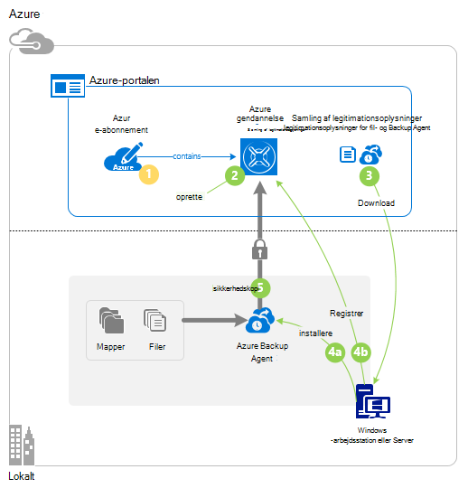

## Trin 1: Hente et Azure-abonnement

Hvis du ikke har et Azure-abonnement, kan du oprette en [gratis konto](https://azure.microsoft.com/free/) , hvor du kan få adgang til en hvilken som helst Azure service.

## Trin 2: Oprette en samling af legitimationsoplysninger gendannelse

Hvis du vil sikkerhedskopiere dine filer og mapper, skal du oprette en samling af legitimationsoplysninger gendannelsestjenester i det område, hvor du vil gemme dataene. Du skal afgøre, hvordan du vil lagerpladsen replikeres.

### Oprette en samling af legitimationsoplysninger gendannelse

1. Hvis du ikke allerede har gjort det, logon til [Azure-portalen](https://portal.azure.com/) med dit Azure-abonnement.

2. Menuen Hub Klik på **Gennemse** , og skriv **Gendannelsestjenester** på listen over ressourcer, og klik på **gendannelse Services vaults**.

    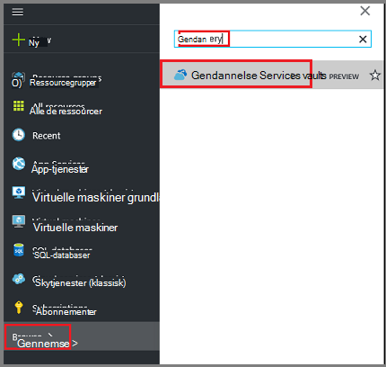  

3. Klik på **Tilføj**i menuen **gendannelse Services vaults** .

    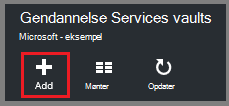

    Gendannelse Services samling blade åbnes, beder dig om at angive et **navn**, **abonnement**, **ressourcegruppe**og **placering**.

    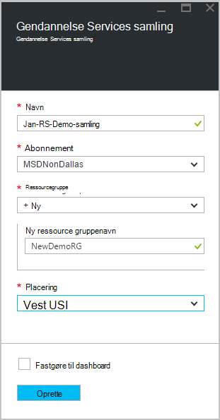

4. Angiv et fuldt navn til at identificere samling af legitimationsoplysninger for **navn**.

5. Klik på **abonnement** for at se den tilgængelige liste over abonnementer.

6. **Ressourcegruppe** for at se den tilgængelige liste over grupper, eller klik på **Ny** for at oprette en ny ressourcegruppe.

7. Klik på **placering** for at vælge det geografiske område for samling af legitimationsoplysninger. Dette valg bestemmer den geografiske område, hvor de sikkerhedskopierede data sendes.

8. Klik på **Opret**.

    Hvis du ikke kan se din samling, der vises, når den er fuldført, kan du klikke på **Opdater**. Klik på navnet på samling af legitimationsoplysninger, når listen er blevet opdateret.

### Til at bestemme lagerplads redundans
Når du opretter en samling af legitimationsoplysninger gendannelsestjenester kan du bestemme, hvordan lagerplads replikeres.

1. Klik på den nye samling af legitimationsoplysninger til at åbne dashboard.

2. Klik på **Sikkerhedskopiér infrastruktur**i bladet **Indstillinger** , som åbner automatisk med dashboardet samling.

3. Klik på **Sikkerhedskopiér konfiguration** for at få vist den **lagerplads gentagelse type**i bladet sikkerhedskopi infrastruktur.

    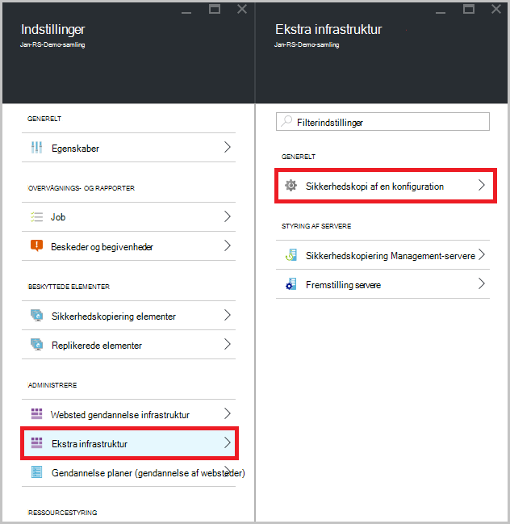

4. Vælg indstillingen passende lager gentagelse til din samling af legitimationsoplysninger.

    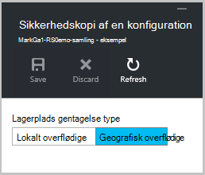

    Som standard har din samling geografisk overflødige lagerplads. Hvis du bruger Azure som et slutpunkt primære ekstra lagerplads, skal du fortsætte med at bruge geografisk overflødige lagerplads. Hvis du bruger Azure som et slutpunkt for lagring af ikke-primær sikkerhedskopier, skal du vælge lokalt overflødige lager, hvilket kan reducere omkostningerne til lagring af data i Azure. Få mere at vide om [geografisk overflødige](../storage/storage-redundancy.md#geo-redundant-storage) og [lokalt overflødige](../storage/storage-redundancy.md#locally-redundant-storage) indstillinger for lagring i denne [Oversigt](../storage/storage-redundancy.md).

Nu, hvor du har oprettet en samling af legitimationsoplysninger skal forberede du din infrastruktur til at sikkerhedskopiere filer og mapper ved at hente Microsoft Azure gendannelse Services agent og samling legitimationsoplysninger.

## Trin 3 – Hent filer

1. Klik på **Indstillinger** på dashboardet til gendannelse Services samling af legitimationsoplysninger.

    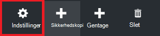

2. Klik på **Introduktion > sikkerhedskopi** på bladet indstillinger.

    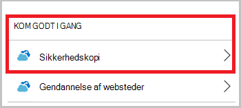

3. Klik på **Sikkerhedskopiér mål** i bladet sikkerhedskopi.

    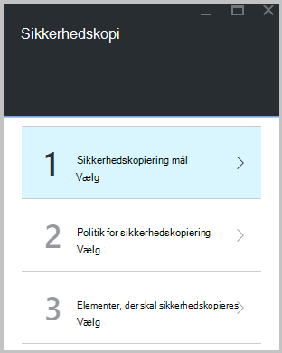

4. Vælg **lokalt** hvor er arbejdsbelastningen kører? menuen.

5. Vælg **filer og mapper** fra Hvad vil du gerne sikkerhedskopi? menuen, og klik på **OK**.

### Hente gendannelse Services agent

1. Klik på **Hent Agent til Windows Server eller Windows-klient** i bladet **Forbered infrastruktur** .

    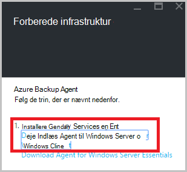

2. Klik på **Gem** i pop op-vinduet download. Som standard gemmes filen **MARSagentinstaller.exe** til mappen overførsler.

### Samling af legitimationsoplysninger legitimationsoplysninger hentes

1. Klik på **hente > Gem** på bladet Forbered infrastruktur.

    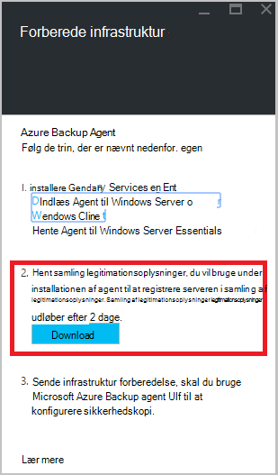

## Trin 4 - installation og registrere agenten

>[AZURE.NOTE] Aktivering backup via portalen Azure kommer snart. På nuværende tidspunkt, kan du bruge de Microsoft Azure betroet Services bruger i det lokale miljø til at sikkerhedskopiere dine filer og mapper.

1. Find og dobbeltklik på **MARSagentinstaller.exe** fra mappen overførsler (eller andre gemte placering).

2. Fuldfør konfigurationsguiden Microsoft Azure gendannelse Services Agent. For at fuldføre guiden, skal du:

    - Vælg en placering til installation og cache-mappe.
    - Angiv din proxy oplysninger om server, hvis du bruger en proxyserver til at oprette forbindelse til internettet.
    - Angiv dit brugernavn og en adgangskode for oplysninger, hvis du bruger en godkendt proxy.
    - Angive de hentede samling legitimationsoplysninger
    - Gem kryptering adgangskoden på et sikkert sted.

    >[AZURE.NOTE] Hvis du mister eller glemmer adgangskoden, hjælpe Microsoft kan ikke gendanne sikkerhedskopidataene. Gem filen i et sikkert sted. Det er nødvendigt at gendanne en sikkerhedskopi.

Agenten er nu installeret, og din computer er registreret til samling af legitimationsoplysninger. Er du klar til at konfigurere og planlægge sikkerhedskopien.

## Trin 5: Sikkerhedskopiere dine filer og mapper

Den første sikkerhedskopi indeholder to vigtige opgaver:

- Planlægge sikkerhedskopieringen
- Sikkerhedskopiere filer og mapper for første gang

For at fuldføre indledende sikkerhedskopien skal bruge du Microsoft Azure gendannelse Services agent.

### Du planlægger at sikkerhedskopieringen

1. Åbn Microsoft Azure gendannelse Services agent. Du kan finde det ved at søge computeren til **Microsoft Azure sikkerhedskopi**.

    

2. Klik på **Tidsplan sikkerhedskopi**i agent gendannelsestjenester.

    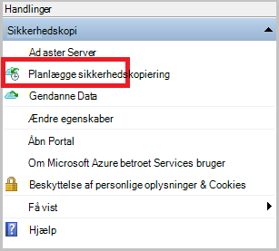

3. Klik på **Næste**på siden Introduktion i guiden tidsplan sikkerhedskopiering.

4. På markere elementerne til sikkerhedskopi side, skal du klikke på **Tilføj elementer**.

5. Vælg de filer og mapper, du vil sikkerhedskopiere, og klik derefter på **OK**.

6. Klik på **Næste**.

7. Angiv **tidsplanen for sikkerhedskopiering** , og klik på **Næste**på siden **Angiv tidsplanen for sikkerhedskopiering** .

    Du kan planlægge dagligt (med en maksimal hastighed tre gange om dagen) eller ugentlig sikkerhedskopier.

    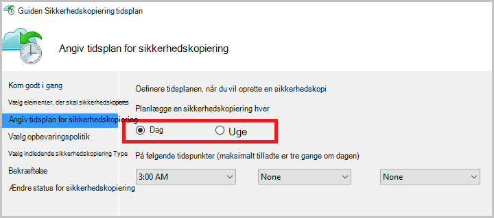

    >[AZURE.NOTE] Du kan finde flere oplysninger om, hvordan du angiver tidsplanen for sikkerhedskopiering, i artiklen [Brug Azure Backup for at erstatte infrastrukturen bånd](backup-azure-backup-cloud-as-tape.md).

8. Vælg den **Opbevaringspolitik** for sikkerhedskopien, på siden **Vælg opbevaringspolitik** .

    Opbevaringspolitikken angiver den varighed, som sikkerhedskopien skal gemmes. I stedet for blot angiver en "flad politik" for alle sikkerhedskopiering punkter, kan du angive forskellige opbevaringspolitikker baseret på, når der udsendes sikkerhedskopien. Du kan ændre dagligt, ugentligt, månedlige og årlige opbevaringspolitikker at opfylde dine behov.

9. Vælg den indledende sikkerhedskopiering type på siden Vælg indledende sikkerhedskopieringstype. Lad indstillingen **automatisk via netværket** markeret, og klik derefter på **Næste**.

    Du kan sikkerhedskopiere automatisk via netværket, eller du kan sikkerhedskopiere offline. I resten af denne artikel beskrives processen for sikkerhedskopiering af automatisk. Hvis du foretrækker at gøre en offline sikkerhedskopi, kan du gennemgå artiklen om [Offline sikkerhedskopiering arbejdsproces i Azure sikkerhedskopiering](backup-azure-backup-import-export.md) kan finde flere oplysninger.

10. Gennemse oplysningerne på siden Confirmation, og klik derefter på **Udfør**.

11. Når guiden afsluttes oprettelse af tidsplanen for sikkerhedskopiering, skal du klikke på **Luk**.

### Sikkerhedskopiere filer og mapper for første gang

1. Klik på **Sikkerhedskopier nu** for at fuldføre de indledende forhåndsudfyldning via netværket i agent gendannelsestjenester.

    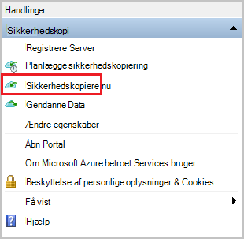

2. Gennemse de indstillinger, der anvender tilbage op nu guiden til at sikkerhedskopiere maskinen, på siden Confirmation. Klik derefter på **Sikkerhedskopier**.

3. Klik på **Luk** for at lukke guiden. Hvis du gør dette, før sikkerhedskopieringen er færdig, fortsætter guiden til at køre i baggrunden.

Når indledende sikkerhedskopieringen er fuldført, vises status **Job fuldført** i konsollen sikkerhedskopi.

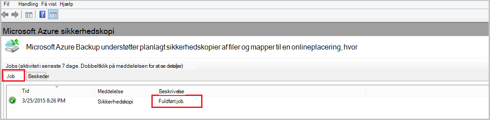

## Har du spørgsmål?
Hvis du har spørgsmål, eller hvis der er en funktion, som du gerne vil se inkluderet, [sende feedback til os](http://aka.ms/azurebackup_feedback).

## Næste trin
- Få flere oplysninger om [Sikkerhedskopiering af Windows-computere](backup-configure-vault.md).
- Nu hvor du har sikkerhedskopieret dine filer og mapper, kan du [administrere vaults og -servere](backup-azure-manage-windows-server.md).
- Hvis du vil gendanne en sikkerhedskopi, skal du bruge i denne artikel for at [gendanne filer til en Windows-computer](backup-azure-restore-windows-server.md).
