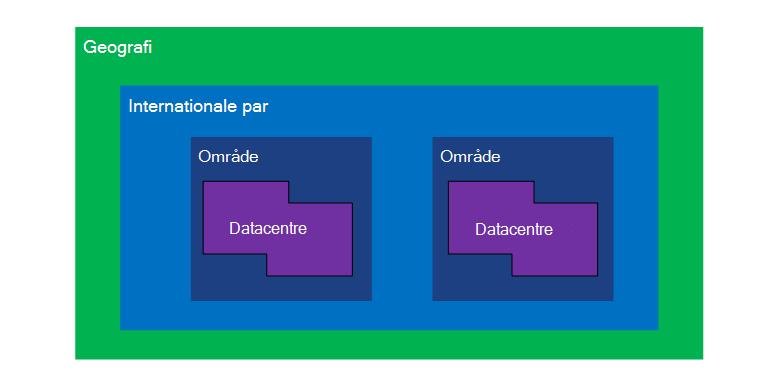
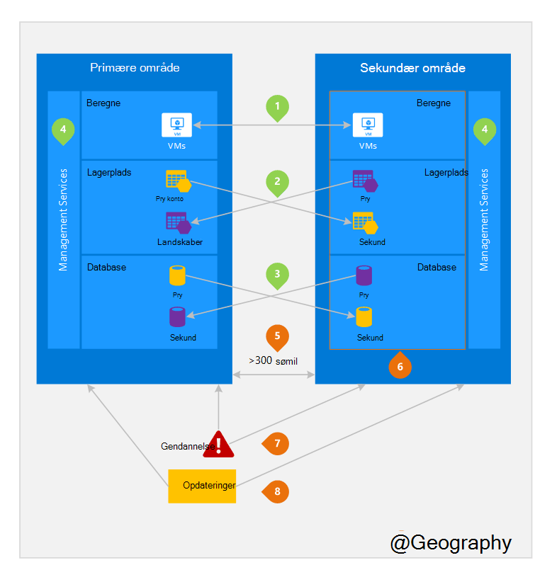

<properties
    pageTitle="Business løbende og genoprettelse efter nedbrud (BCDR): Azure parvis områder | Microsoft Azure"
    description="Azure internationale par sikrer, at programmer tolerant under center datafejl."
    services="site-recovery"
    documentationCenter=""
    authors="rayne-wiselman"
    manager="jwhit"
    editor=""/>

<tags
    ms.service="site-recovery"
    ms.workload="storage-backup-recovery"
    ms.tgt_pltfrm="na"
    ms.devlang="na"
    ms.topic="article"
    ms.date="08/23/2016"
    ms.author="raynew"/>

# Business løbende og genoprettelse efter nedbrud (BCDR): Azure parvis områder

## Hvad er parvis områder?

Azure fungerer i forskellige lande over hele verden. En Azure Geografi er et defineret område i verden, der indeholder mindst én Azure område. Et Azure område er et område i et Geografi, der indeholder en eller flere datacentre.

Hvert område for Azure hører sammen med et andet område i den samme Geografi, foretage et internationale par sammen. Undtagelsen er Brasilien syd der hører sammen med et område uden for dets Geografi.

Figur 1 – Azure internationale par diagram

| Geografi     |  Parvis områder  |                     |
| :-------------| :-------------   | :-------------      |
| Nordamerika | Nord centrale USA | Syd centrale USA    |
| Nordamerika | Indtastning af østasiatiske USA          | Vest USA             |
| Nordamerika | USA Øst 2        | USA Central          |
| Nordamerika | Vest USA 2        | Vest centrale USA     |
| Europe        | Nord Europe     | Vest Europe         |
| Asien          | Syd Østasien  | Sydøstasien           |
| Kina         | Indtastning af østasiatiske Kina       | Nord Kina         |
| Japan         | Japan øst       | Japan vest          |
| Brasilien        | Brasilien syd (1) | Syd centrale USA    |
| Australien     | Australien øst   | Australien Sydøst |
| Amerikanske regering | Krigsskibe i USA Gov Iowa      | USA Gov Virginia     |
| Indien         | Central Indien    | Syd Indien         |
| Canada        | Canada Central   | Canada øst         |
| STORBRITANNIEN            | Storbritannien vest          | Storbritannien syd            |

Tabel 1 - tilknytning af azure internationale par

> (1) Brasilien syd er entydige, fordi den hører sammen med et område uden for dets egne Geografi. Brasilien syd sekundær område er syd Central os, men syd Central os sekundær område er ikke Brasilien syd.

Vi anbefaler, at du gentage arbejdsbelastninger på tværs af internationale par kan få glæde af Azures isolationsniveauet og tilgængelighed politikker. For eksempel planlagte Azure systemopdateringer installeres sekventielt (ikke på samme tid) på tværs af parvis områder. Det betyder, at selv i hændelsen sjældne af en defekt opdatering begge områder, ikke påvirkes samtidig. Desuden i hændelsen sandsynlighed for en bred afbrydelse prioriteres gendannelse af mindst ét område af alle par.

## Et eksempel på parvis områder
Figur 2 nedenfor vises en hypotetiske program som bruger parret internationale for nedbrud. Grøn tallene Fremhæv i tværs område aktiviteter for tre Azure tjenester (Azure beregne, lager og Database), og hvordan de er konfigureret til at gentage på tværs af områder. De entydige fordele ved at anvende på tværs af parvis områder er markeret med orange tal.

Figur 2 – hypotetiske Azure internationale par

## Aktiviteter i tværs område
Som nævnt i figur 2.

 **Azure beregne (PaaS)** – skal du klargøre yderligere Beregn ressourcer på forhånd for at sikre, at ressourcer er tilgængelige i et andet område under nedbrud. Du kan finde yderligere oplysninger finder [Azure fleksibilitet teknisk vejledning](./resiliency/resiliency-technical-guidance.md).

 **Azure-lager** - geografisk overflødige lagerplads (GRS) er konfigureret som standard, når der oprettes en Azure-lager-konto. Med GRS replikeres dine data automatisk tre gange i det primære område og tre gange i parvis område. Se [Indstillinger for Azure lagring redundans](storage/storage-redundancy.md)kan finde flere oplysninger.

 **Azure SQL-databaser** – med Azure SQL Standard geografisk replikering, kan du konfigurere asynkron replikering af transaktioner til et parvis område. Med Premium geografisk-gentagelse, kan du konfigurere gentagelse til en hvilken som helst område i verden; Vi anbefaler, mens du installerer disse ressourcer i en parvis område for de fleste genoprettelse efter nedbrud scenarier. Du kan finde yderligere oplysninger finder [Geografisk-gentagelse i Azure SQL-Database](./sql-database/sql-database-geo-replication-overview.md).

 **Azure ressource Manager (ARM)** - ARM uden videre indeholder logiske isolationsniveauet af service management komponenter på tværs af områder. Det betyder logiske fejl i ét område er mindre sandsynlighed for vil påvirke en anden.

## Fordele ved parvis områder
Som nævnt i figur 2.  

**fysisk isolationsniveauet** – når det er muligt, Azure foretrækker mindst 300 sømil adskillelse mellem datacentre i et internationale par, selvom det ikke er praktisk eller muligt i alle lande. Fysisk datacenter adskillelsen reducerer sandsynligheden for, at naturlige nedbrud, civil unrest, strømsvigt eller fysisk netværk udfald påvirker begge områder på én gang. Isolationsniveauet er underlagt begrænsninger i Geografi (Geografi størrelse, power/netværk infrastruktur tilgængelighed, bestemmelser osv.).  

**Platform har udleveret Replikerings** - nogle af tjenesterne som geografisk overflødige lagerplads giver automatisk gentagelse til parvis område.

**område gendannelse rækkefølge** – i tilfælde af en bred afbrydelse gendannelse af ét område prioriteres af alle par. Programmer, der installeres på tværs af parvis områder er garanti have en af de områder, der er gendannet med prioritet. Hvis et program er installeret på tværs af områder, der ikke er parvis, kan gendannelse udskydes – i værste fald de valgte områder kan være de sidste to til gendannes.

**hver times opdaterer** – planlagt Azure system opdateringer udbredes til parvis områder sekventielt (ikke på samme tid) for at minimere nedetid, effekten af at fejl og logiske fejl i hændelsen sjældne i en ugyldig opdatering.

**Data residency** – et område er placeret i den samme Geografi som dens par (med undtagelse af Brasilien syd) for at opfylde data residency kravene til moms og lovgivning håndhævelse kompetence formål.

