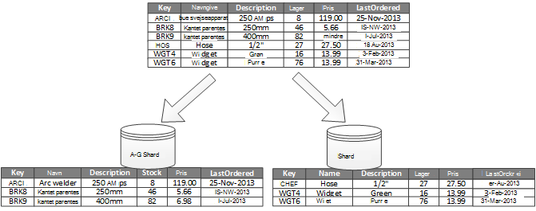
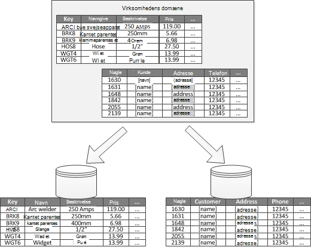
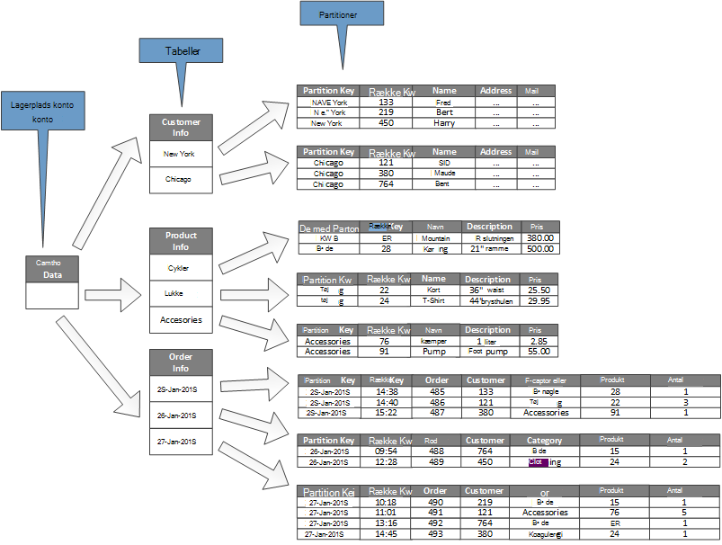

<properties
   pageTitle="Data partitionering vejledning | Microsoft Azure"
   description="Vejledning til, hvordan du separate partitioner for at administreres og benyttes separat."
   services=""
   documentationCenter="na"
   authors="dragon119"
   manager="christb"
   editor=""
   tags=""/>

<tags
   ms.service="best-practice"
   ms.devlang="na"
   ms.topic="article"
   ms.tgt_pltfrm="na"
   ms.workload="na"
   ms.date="07/14/2016"
   ms.author="masashin"/>

# Data leverandør vejledning

[AZURE.INCLUDE [pnp-header](../includes/guidance-pnp-header-include.md)]

## Oversigt

I mange store løsninger, er data inddelt i separate partitioner, der kan administreres og benyttes separat. Den leverandør strategi skal vælges omhyggeligt at maksimere fordelene og minimere negative effekter. Partitionering kan hjælpe forbedre skalerbarhed, reducere konflikt og optimering af ydeevne. En anden fordel af partitionering er, at det kan give en funktion til at dele data med mønster for anvendelse. For eksempel kan du arkivere ældre, mindre aktiv (kolde) data i billigere datalagring.

## Hvorfor partition data?

De fleste skyen programmer og tjenester opbevare og hente data som en del af deres aktiviteter. Designet af butikker data, der bruger et program kan have betydning ydeevne, overførselshastighed og skalerbarhed af et system. En teknik, der ofte anvendes i store systemer er at opdele dataene i separate partitioner.

> Det udtryk _partitionering_ , der bruges i denne vejledning refererer til processen med fysisk at opdele data i separate data butikker. Dette er ikke den samme som partitionering til SQL Server-tabel, som er en anden konceptet.

Partitionering data kan tilbyde et antal ydelser. Det kan for eksempel anvendes med henblik på:

- **Forbedre skalerbarhed**. Når du skalere et enkelt database-system, vil den sidste nå en fysisk hardware grænse. Hvis du dividere data på tværs af flere partitioner, hver især hostes på en separat server, kan du skalere ud systemet næsten på ubestemt tid.
- **Forbedre ydeevnen**. Data access handlinger på hver partition ske over en mindre mængde data. Forudsat, at dataene er opdelt i en passende måde, kan partitionering gøre dit system mere effektivt. Handlinger, der gælder for mere end én partition kan køre parallelt. Hver partition kan være placeret i nærheden af det program, der bruges til at minimere netværksventetid.
- **Forbedre tilgængelighed**. Adskille data på tværs af flere servere undgår for fejl fra ét sted. Hvis en server mislykkes, eller der udføres planlagt vedligeholdelse, kun dataene i den valgte partition er ikke tilgængelig. Handlinger på andre partitioner kan fortsætte med. Øge antallet af partitioner reducerer relative påvirkningen af en enkelt serverfejl ved at reducere procentdelen af data, der er ikke tilgængelig. Replikering hver partition kan yderligere reducere risikoen for en enkelt partition fejl, som påvirker handlinger. Det gør det også muligt at adskille vigtige data, der skal være kontinuerligt og meget tilgængelig fra lav værdi data, der har lavere kravene om tilgængelighed (logfiler, for eksempel).
- **Forbedre sikkerhed**. Afhængigt af dataene, og hvordan det er opdelt art, kan det være muligt at opdele følsomme og ikke-følsomme data i forskellige partitioner og gemmer derfor til forskellige servere eller data. Sikkerhed kan derefter specifikt optimeret til følsomme data.
- **Angiv fleksibilitet i driften**. Partitionering indeholder mange muligheder for fin justering af handlinger, maksimere administrative effektivitet og minimere omkostninger. Du kan for eksempel definere forskellige strategier til administration, overvågning, sikkerhedskopiering og gendannelse og andre administrative opgaver på baggrund af vigtigheden af dataene i hver partition.
- **Sammenlign gemme dataene til mønsteret for anvendelse**. Partitionering giver mulighed for hver partition, der skal være installeret på en anden slags datalager, baseret på omkostninger og de indbyggede funktioner, gemme data tilbud. Store binære data kan for eksempel være gemt på et blob datalager, mens mere strukturerede data kan opbevares i en database i dokumentet. Få mere at vide under [opbygning af en polyglot løsning] i de mønstre og fremgangsmåder vejledning og [dataadgangsside for meget SVG-løsninger: Brug af SQL, NoSQL og polyglot brugerdata] på Microsofts websted.

Nogle systemer implementerer ikke partitionering, fordi det betragtes som en omkostning i stedet for en fordel. Almindelige årsager til denne begrundelse omfatter:

- Mange data lagerplads systemer understøtter ikke joinforbindelser på tværs af partitioner, og det kan være svært at bevare referentiel integritet i et partitioneret system. Det er ofte nødvendigt at implementere joinforbindelser og integritet kontrollerer i programkode (i leverandør layer), hvilket kan medføre ekstra i/o- og kompleksiteten af programmet.
- Vedligeholde partitioner er ikke altid en simpel opgave. I et system, hvor dataene er genberegnes, kan du brug at genoprette partitioner med jævne mellemrum for at reducere konflikt og hotspots.
- Nogle almindelige værktøjer virker ikke naturligt med partitioneret data.

## Designe partitioner

Data kan være opdelt på forskellige måder: vandret, lodret eller funktionelt. Den strategi, du vælger, afhænger af årsagen til partitionering dataene, og krav til programmer og tjenester, der anvender dataene.

> [AZURE.NOTE] De leverandør, der er beskrevet i denne vejledning er beskrevet på en måde, som er uafhængig af den underliggende data lagerplads teknologi. De kan anvendes på mange typer data butikker, herunder relationelle og NoSQL databaser.

### Partitionering strategier

De tre typiske strategier til opdeling af data er:

- **Vandret partitionering** (ofte kaldet _sharding_). I denne strategi hver partition er et datalager i sig selv, men alle partitioner har det samme skema. Hver partition kaldes en _shard_ og indeholder et angivet delsæt af data, som alle ordrer for en bestemt række kunder i en e-handel programmet.
- **Lodret partitionering**. I denne strategi indeholder hver partition et undersæt af felterne for elementer i lageret med data. Felterne, der er inddelt efter deres mønster for anvendelse. Hyppigt felter kan for eksempel placeres i en lodret partition og mindre hyppigt felter i en anden.
- **Funktionelle partitionering**. I denne strategi sammenlægges data efter hvordan de anvendes ved hver afgrænset kontekst i systemet. For eksempel en e-handel system, implementerer adskille business-funktioner til fakturering og administrere produktlageret kan lagre fakturadata i én partition og produkt lagerdata i en anden.

Det er vigtigt at være opmærksom på, at de tre strategier, der er beskrevet her kan kombineres. De er ikke udelukker, og vi anbefaler, at du overvejer dem alle, når du designer en partitionsskema. Du kan for eksempel opdele data i shards og derefter bruge lodret partitionering til yderligere underopdele dataene i hver shard. På samme måde, dataene i en funktionelle partition kan opdeles i shards (som kan også være lodret opdelt).

Hver strategi forskellige krav kan dog hæve et antal uoverensstemmende problemer. Du skal evalueres og saldo alle af følgende, når du designer en partitionsskema, der opfylder de overordnede databehandling ydeevne mål for systemet. De følgende afsnit til at udforske hver af strategier mere detaljeret.

### Vandret partitionering (sharding)

Figur 1 viser en oversigt over vandret partitionering eller sharding. I dette eksempel er produkt lagerdata opdelt i shards baseret på produktnøglen. Hver shard indeholder dataene til et sammenhængende område af shard nøgler (A-G og H-Z), alfabetisk orden.

_Figur 1. Vandret partitionering (sharding) data baseret på en Partitionsnøgle_

Sharding hjælper dig med at sprede afkrydsningsfeltet Indlæs over flere computere, hvilket reducerer konflikt og forbedrer ydeevnen. Du kan skalere systemet ud ved at tilføje yderligere shards, der kører på flere servere.

Den vigtigste faktor når implementere denne leverandør strategi er valget af sharding nøgle. Det kan være svært at ændre nøglen, når systemet er i handlingen. Tasten skal sikre dig, at dataene er opdelt, så arbejdsbelastningen er som lige som muligt på tværs af shards.

Bemærk, at forskellige shards ikke behøver at indeholder lignende datamængder. I stedet er de vigtigste overvejelser til saldo antallet af anmodninger. Nogle shards kan være meget stor, men hvert element er emnet for en lav antallet af access-handlinger. Andre shards kan være mindre, men hvert element åbnes oftere. Det er også vigtigt at sikre, at en enkelt shard ikke overstiger skala begrænsninger (med hensyn til kapacitet og behandlingsressourcer) for det datalager, der bruges til at hoste pågældende shard.

Undgå at oprette hotspots (eller varmt partitioner), hvis du bruger et sharding farveskema, der kan påvirke ydeevnen og tilgængeligheden. Eksempelvis hvis du bruger en hash af en kunde-id i stedet for det første bogstav i en kundes navn, forhindre du opgjorte fordelingen, der er resultatet fra almindelige og mindre almindelige første bogstaver. Dette er en typisk teknik, der hjælper med at distribuere data mere jævnt på tværs af partitioner.

Vælg en sharding nøgle, der minimerer alle fremtidige krav til at opdele store shards i mindre dele samling lille shards i større partitioner, eller ændre det skema, der beskriver de data, der er gemt i et sæt af partitioner. Disse handlinger kan være meget tidskrævende og kan kræve, at en eller flere shards offline, mens de udføres.

Hvis shards replikeres, kan det være muligt at holde nogle af replikaerne online, mens andre er opdelt, flettede eller konfigureres igen. Dog være systemet nødvendigt at begrænse de handlinger, der kan udføres på dataene i disse shards, mens konfigureres igen finder sted. Dataene i replikaerne kan for eksempel markeres i skrivebeskyttet tilstand til at begrænse omfanget af inconsistences, der kan opstå, mens shards er omstruktureringen.

> Mere detaljerede oplysninger og vejledning til mange af disse overvejelser i forbindelse med og god praksis teknikker til design af data butikker, der implementerer vandret partitionering, under [Sharding mønster].

### Lodret partitionering

De mest almindelige brug af lodret partitionering er at reducere I/O og ydeevne omkostninger i forbindelse med hentning af elementerne, der er åbnet hyppigst. Figur 2 viser et eksempel på lodret partitionering. I dette eksempel afholdes forskellige egenskaber for hvert dataelement i forskellige partitioner. Én partition indeholder data, der åbnes hyppigere, herunder navn, beskrivelse og prisoplysninger for produkter. En anden indeholder lydstyrken i lager og den sidste bestilte dato.

_Figur 2. Lodret partitionering data af dens mønster for anvendelse_

I dette eksempel forespørger programmet jævnligt produktnavn, beskrivelse og pris når viser produktoplysningerne til kunder. Aktiekurser niveau og dato, når produktet sidst blev bestilt fra producenten afholdes i en separat partition, fordi disse to elementer ofte bruges sammen.

Denne partitionsskema har tilføjet fordelen ved, at de relativt sænke-flytte data (produktnavn, beskrivelse og pris) er adskilt fra den mere dynamiske data (aktiekurser niveau og sorteret slutdatoen). Et program kan være nyttige til at cachelagre sænke flytte dataene i hukommelsen, hvis der er ofte adgang til.

En anden typiske scenarie for denne leverandør strategi er at maksimere sikkerheden for følsomme data. For eksempel kan du gøre dette ved at gemme kreditkortnumre og tilsvarende tallene til bekræftelse af sikkerhed i separate partitioner.

Lodret partitionering kan også reducere mængden af samtidige adgang, som er nødvendige for at dataene.

> Lodret partitionering fungerer på objektniveau i et datalager, der er delvist normalisering et objekt for at bryde nedarvningen fra en _bred_ element til et sæt af _indsnævre_ elementer. Det er velegnet til kolonneorienteret data butikker som HBase og Cassandra. Hvis dataene i en samling af kolonner er uændret, kan du også overveje at bruge kolonnen butikker i SQL Server.

### Funktionelle partitionering

Funktionelle partitionering indeholder til systemer, hvor det er muligt at identificere en afgrænset sammenhæng for hver entydige forretningsområde eller tjeneste i programmet på computeren, en metode til forbedring af ydeevnen for isolationsniveauet og data access. En anden bruges almindelige funktionelle partitionering til at adskille læse / skrive-data fra skrivebeskyttede data, der bruges til rapportering. Figur 3 viser en oversigt over funktionelle partitionering hvor lagerdata er adskilt fra kundedata.

_Figur 3. Funktionelt partitionering data efter afgrænset kontekst eller underdomæne_

Denne leverandør strategi kan hjælpe dig med at reducere data access konflikt på tværs af forskellige dele af et system.

## Designe partitioner for skalerbarhed

Det er vigtigt at overveje størrelse og arbejdsbelastningen for hver partition og saldo dem, så data distribueres for at opnå maksimal skalerbarhed. Du skal dog også dele dataene, så det ikke overstiger de skalering grænser for en enkelt partition butik.

Følg disse trin, når du designer partitioner for skalerbarhed:

1. Analysere programmet at forstå data access mønstre, som størrelsen af det resultatsæt returneret af hver forespørgsel, beregne hyppigheden for access, den naturlige ventetid og på serversiden behandling af krav. I mange situationer der et par overordnede enheder kræver de fleste af ressourcerne, der behandler.
2. Brug denne analyse til at bestemme de nuværende og fremtidige skalerbarhed destinationer, som datastørrelse og arbejdsbyrde. Derefter distribuere data på tværs af partitioner til at opfylde skalerbarhed destinationen. I den vandrette leverandør strategi er det vigtigt at sikre, at fordelingen er lige at vælge den relevante shard nøgle. Du kan finde yderligere oplysninger finder [Sharding mønster].
3. Sørg for, at de ressourcer, der er tilgængelige for hver partition er tilstrækkelige til at håndtere skalerbarhed kravene med hensyn til datastørrelse og overførselshastighed. Noden, der vært for en partition kan for eksempel angivet en hårde grænse på mængden lagerplads, behandler power eller netværksbåndbredde, som den indeholder. Hvis krav til opbevaring og behandling af data er sandsynligvis overskrider disse begrænsninger, kan det være nødvendigt at begrænse din leverandør strategi eller opdele data ud yderligere. For eksempel være en skalerbarhed metode til at adskille logføring data fra de grundlæggende programfunktioner. Du kan gøre dette ved hjælp af separate data butikker at forhindre, at de samlede lagerplads krav i at overskride grænsen skalering af noden. Hvis det samlede antal data butikker overstiger grænsen for node, kan det være nødvendigt at bruge separat lagerplads noder.
4. Overvåge systemet under brug af til at bekræfte, at dataene er distribueret som forventet, og at partitionerne kan håndtere den belastning, som får pålagt dem. Det er muligt, Brug ikke stemmer overens med det format, der forventes ved analysen. Det er tilfældet, kan det være muligt at genoprette partitionerne. I modsat fald kan være det nødvendigt at omdesigne nogle dele af systemet til at få den nødvendige saldo.

Bemærk, at nogle skyen miljøer allokere ressourcer med hensyn til infrastruktur grænser. Sørg for, begrænsningerne for dine valgte grænse kan give dig nok ledig plads til en hvilken som helst forventede vækst i mængden data, med hensyn til lagring af data, behandling power og båndbredde.

Eksempelvis hvis du bruger Azure-tabellager, kan en optaget shard kræver flere ressourcer, end der er tilgængelige for en enkelt partition til at håndtere anmodninger. (Der er en grænse for lydstyrken af forespørgsler, der kan løses ved en enkelt partition på et bestemt tidsrum. Se siden [Azure lagerplads skalerbarhed og ydeevne destinationer] på webstedet Microsoft få mere at vide).

 Hvis det er tilfældet, shard muligvis være repartitioned for at sprede afkrydsningsfeltet Indlæs. Hvis den samlede størrelse eller overførsel af disse tabeller overskrider kapaciteten for en lagerplads konto, kan det være nødvendigt at oprette ekstra lagerplads konti og tabellerne udbrede disse konti. Hvis antallet af lagerplads konti overstiger antallet af konti, der er tilgængelige til et abonnement, derefter være det nødvendigt at bruge flere abonnementer.

## Designe partitioner for forespørgselsydelse

Forespørgselsydelse kan ofte øget, ved hjælp af mindre datasæt og ved at køre parallelle forespørgsler. Hver partition skal indeholde en lille del af hele datasættet. Denne reduktion i lydstyrken kan forbedre ydeevnen for forespørgsler. Partitionering er dog ikke et alternativ til designe og konfigurere en database korrekt. For eksempel Sørg for, at du har de nødvendige indeks på plads, hvis du bruger en relationel database.

Følg disse trin, når du designer partitioner for forespørgselsydelse:

1. Undersøge programmet krav og ydeevne:
    - Brug forretningsbehov til at bestemme de kritiske forespørgsler, der skal altid udføre hurtigt.
    - Overvåge systemet for at identificere alle forespørgsler, som udfører langsomt.
    - Fastlægge, hvilken forespørgsler udføres hyppigst. En enkelt forekomst af hver forespørgsel kan have minimale omkostninger, men den kumulative forbrug af ressourcer, der kan være betydeligt. Det kan være nyttige til at adskille de data, der er hentet ved disse forespørgsler til en særskilt partition eller endda en cache.
2. Partition de data, der forårsager langsom ydeevne:
    - Begrænse størrelsen af hver partition, så forespørgslen svartid ligger inden for mål.
    - Designe tasten shard, så programmet kan nemt finde partitionen, hvis du implementerer vandret partitionering. Dette forhindrer forespørgslen ikke behøvede at gennemse alle partitioner.
    - Overvej placeringen af en partition. Hvis det er muligt, kan du prøve at bevare data i partitioner, der geografisk er tæt på de programmer og brugere, få adgang til den.
3. Hvis en enhed har overførselshastighed og forespørgsel krav til ydeevne, skal du bruge funktionelle partitionering baseret på denne enhed. Hvis dette stadig ikke opfylder kravene, kan du anvende vandret partitionering samt. I de fleste tilfælde en enkelt leverandør strategi tilstrækkeligt, men i nogle tilfælde er det mere effektivt at kombinere begge strategier.
4. Overvej at bruge asynkrone forespørgsler, der kører parallelt på tværs af partitioner til at forbedre ydeevnen.

## Designe partitioner for tilgængelighed

Partitionering data kan forbedre tilgængeligheden af programmer ved at sikre, at hele datasættet ikke udgør et enkelt punkt af manglende og individuelle undersæt af datasættet kan administreres uafhængigt af hinanden. Replikering partitioner, der indeholder vigtige data, kan du også forbedre tilgængelighed.

Når designe og implementere partitioner, skal du overveje følgende faktorer, der påvirker tilgængelighed:

- **Hvor vigtige data er at business handlinger**. Nogle data kan indeholde vigtige oplysninger som Fakturadetaljer eller banktransaktioner. Andre data, kan indeholde mindre kritiske funktionsdygtige data, som logfiler, ydeevne sporinger osv. Når du identificerer hver type data, kan du overveje at:
    - Lagring af kritiske data i det tilgængelige partitioner med en passende sikkerhedskopiering plan.
    - Om oprettelse af separat administration og overvågning mekanismer eller procedurerne for de anden criticalities af hver enkelt datasæt. Placer data, der indeholder det samme niveau af oplysningerne i den samme partition, så den kan sikkerhedskopieres sammen med en passende hyppighed. For eksempel partitioner, der indeholder data til transaktioner på bankens muligvis sikkerhedskopieres hyppigere end partitioner, som indeholder logføring eller sporingsoplysninger.
- **Hvordan individuelle partitioner kan administreres**. Designe partitioner til at understøtte uafhængige administration og vedligeholdelse giver adskillige fordele. Eksempel:
    - Hvis en partition mislykkes, skal kan den gendannes uafhængigt uden at påvirke forekomster af programmer, få adgang til data i andre partitioner.
    - Partitionering data efter geografisk område giver mulighed for planlagt vedligeholdelsesopgaver skal udføres på belastet for hver placering. Sørg for, partitioner ikke er for stor til at forhindre, at en hvilken som helst planlagt vedligeholdelse færdiggøres i denne periode.
- **Om du vil gentage vigtige data på tværs af partitioner**. Denne strategi kan forbedre tilgængelighed og ydeevne, selvom den kan også en konsistens problemer. Det tager tid for ændringer af data i en partition der skal synkroniseres med hver replika. I denne periode indeholder forskellige partitioner forskellige værdier.

## Forstå, hvordan partitionering påvirker design og udvikling

Brug af partitionering føjer kompleksitet til design og udvikling af dit system. Overvej at partitionering som en grundlæggende del af system design lige Hvis systemet har kun indeholder en enkelt partition. Hvis du adresserer partitionering som en eftertanke, når systemet starter til at forsinke ydeevne og skalerbarhed problemer, øges kompleksitet, fordi du allerede har et direkte system til at vedligeholde.

Hvis du opdaterer systemet for at inkorporere partitionering i dette miljø, kræver det at ændre data access logik. Det kan også omfatte overføre store mængder eksisterende data til at distribuere det på tværs af partitioner, ofte mens brugere forventer at kunne fortsætte med at bruge systemet.

I nogle tilfælde betragtes partitionering ikke som vigtige fordi indledende datasættet er lille og nemt kan løses ved en enkelt server. Det kan være sand i et system, der ikke forventes at skalere ud over dets oprindelige størrelse, men mange kommercielle systemer har brug at udvide som antallet af brugere øges. Denne udvidelse leveres typisk med en forøgelse i mængden data.

Det er også vigtigt at forstå, partitionering ikke er det altid en funktion af store data butikker. For eksempel en lille datalager muligvis stærkt åbnes af hundredvis af samtidige klienter. Partitionering dataene i dette tilfælde kan hjælpe med at reducere konflikt og forbedre overførselshastighed.

Overvej følgende punkter, når du designer en data partitionsskema:

- **Hvor det er muligt, du holder data til de mest almindelige databasehandlinger sammen i hver partition for at minimere tværs partition data access-handlinger**. Forespørgsler på tværs af partitioner kan være mere tidskrævende end forespørgsler kun inden for en enkelt partition, men optimering partitioner for ét sæt af forespørgsler, der kan påvirke andre typer forespørgsler. Når du ikke kan undgå at forespørge på tværs af partitioner, kan du minimere Forespørgselsestid ved at køre parallelle forespørgsler og sammenlægning af resultaterne i programmet. Denne metode muligvis ikke i nogle tilfælde, som når det er nødvendigt at opnå et resultat, fra en forespørgsel og bruge det i den næste forespørgsel.
- **Hvis forespørgsler skal du bruge relativt statiske reference data, som postnummer tabeller eller lister over produkt, kan du overveje replikering disse data i alle partitioner at reducere kravet om separat opslag handlinger i forskellige partitioner**. Denne metode kan også reducere risikoen for referencedataene blive et "Varm" datasæt, der er underlagt stærk trafik fra på tværs af hele systemet. Der er dog en ekstra omkostninger, der er knyttet til synkronisering af de ændringer, der kan opstå, at denne referere til data.
- **Minimere krav til referentiel integritet på tværs af lodrette og funktionelle partitioner, hvor det er muligt**. I disse farveskemaer er selve programmet ansvarlig for at vedligeholde referentiel integritet på tværs af partitioner, når dataene er opdateret og consumed. Forespørgsler, der skal deltage i data på tværs af flere partitioner kører langsommere end forespørgsler, der sammenføjes data kun i den samme partition, fordi programmet typisk skal udføre på hinanden følgende forespørgsler, der er baseret på en nøgle og derefter klikke på en fremmed nøgle. I stedet replikering eller deaktivere normalisere relevante dataene. Køre parallelle forespørgsler over partitionerne for at minimere det forespørgsel tidspunkt, hvor tværs partition joinforbindelser er nødvendige, og deltage i dataene i programmet.
- **Overveje effekten, som det partitionsskema muligvis på ensartede data på tværs af partitioner.** Evaluere om stærke konsistens er faktisk et krav. I stedet er et almindelige tilgang i skyen at implementere eventuel konsistens. Dataene i hver partition opdateres separat, og programmet logik sikrer, at opdateringerne er alle blev fuldført. Den håndterer også uoverensstemmelser, der kan opstå fra forespørgsler data, mens handlingen til sidst ensartet kører. Du kan finde flere oplysninger om implementering eventuel konsistens [Data konsistens grundlæggende].
- **Overveje, hvordan forespørgsler finde den korrekte partition**. Hvis en forespørgsel skal scanner alle partitioner for at finde de nødvendige data, er der væsentlig indvirkning på ydeevne, selvom flere parallelle forespørgsler kører. Forespørgsler, der bruges med lodrette og funktionelle leverandør strategier kan naturligt angive partitionerne. Vandret partitionering (sharding) kan dog foretage at finde et element, der er svært, fordi alle shard har det samme skema. En typisk løsning til sharding er at vedligeholde et kort, der kan bruges til at søge efter en shard placering til bestemte elementer af data. Denne tilknytning kan implementeret i sharding logik af programmet eller vedligeholdes af datalager, hvis den understøtter gennemsigtig sharding.
- **Når du bruger en vandret strategi for leverandør, kan du overveje med jævne mellemrum skulle genoprette balancen på shards**. Dette hjælper med at distribuere dataene jævnt, størrelse og arbejdsbelastningen at minimere hotspots, maksimere forespørgselsydelse og omgå fysisk lagerplads begrænsninger. Dette er dog en kompleks opgave, der ofte kræver brug af et brugerdefineret værktøj eller en proces.
- **Hvis du gentage hver partition, den giver yderligere beskyttelse mod fejl**. Hvis en enkelt replika mislykkes, kan forespørgsler rettes mod en arbejdskopien.
- **Hvis du kommer til de fysiske grænser for en leverandør strategi, kan det være nødvendigt at udvide skalerbarhed til et andet niveau**. Eksempelvis hvis partitionering er på niveauet for databasen, skal du muligvis finde eller gentage partitioner i flere databaser. Hvis partitionering er allerede på niveauet for databasen, og fysiske begrænsninger er et problem, kan det betyde, at du har brug for til at finde eller gentage partitioner i flere hosting konti.
- **Undgå transaktioner, få adgang til data i flere partitioner**. Nogle data butikker implementere transaktions konsistens og integritet for handlinger, der redigerer data, men kun, når dataene er placeret i en enkelt partition. Hvis du har brug for understøttelse af transaktioner på tværs af flere partitioner, skal du sandsynligvis at implementere dette som en del af dit programlogik, fordi mest leverandør systemer, ikke indeholder understøttelse.

Alle data butikker kræver nogle funktionsdygtige administration og overvågning aktivitet. Opgaverne, der kan variere fra indlæsning af data, sikkerhedskopiere og gendanne data, omorganisere dataene og sikre, at systemet fungerer korrekt og effektivt.

Overveje følgende faktorer, der påvirker funktionsdygtige administration:

- Se, **hvordan du kan implementere relevante administration og driftsopgaver, når dataene er opdelt**. Disse opgaver kan indeholde sikkerhedskopiering og gendannelse, arkivering af data, overvåge systemet og andre administrative opgaver. Vedligeholde logiske konsistens under sikkerhedskopiering og gendannelse handlinger kan for eksempel være en udfordring.
- **Sådan indlæser data i flere partitioner og tilføje nye data, der modtaget fra andre kilder**. Nogle værktøjer og programmer understøtter muligvis ikke delt datahandlinger som indlæse data i den korrekte partition. Det betyder, at du muligvis nødt til at oprette eller få nye værktøjer og funktioner.
- **Sådan arkivere og sletter data med jævne mellemrum**. For at undgå unødvendig væksten af partitioner, vil du arkivere og slette data med jævne mellemrum (måske månedligt). Det kan være nødvendigt at transformere dataene, så det svarer til et andet arkiv skema.
- **Sådan finder du problemer med dataintegritet**. Overvej at køre en periodiske proces for at finde eventuelle problemer med dataintegritet som data i én partition, der henviser til manglende oplysninger i en anden. Processen kan enten forsøg på at løse disse problemer automatisk op eller ned en besked til en operator for at løse problemerne manuelt. For eksempel i en e-handel programmet ordreoplysninger kan opbevares i én partition, men de linjeelementer, der udgør hver ordre kan opbevares i en anden. Processen for indsættelse af en ordre skal føje data til andre partitioner. Hvis denne proces mislykkes, der kan være linjeelementer gemt til, der er ingen tilsvarende rækkefølge.

Andre data storage-teknologier indeholder typisk deres egne funktioner for at understøtte partitionering. I følgende afsnit beskrives de indstillinger, der er implementeret i data butikker ofte anvendte ved Azure-programmer. Beskriver de desuden overvejelser om design af programmer, der kan bedst drage fordel af disse funktioner.

## Partitionering strategier til Azure SQL-Database

Azure SQL-Database er en relationel database-som-en-tjeneste, der kører i skyen. Det er baseret på Microsoft SQL Server. En relationel database dividerer oplysningerne i tabeller, og hver tabel indeholder oplysninger om objekter som en serie af rækker. Hver række indeholder kolonner, der indeholder dataene til de enkelte felter på et objekt. Siden [Hvad er Azure SQL-Database?] på Microsofts websted indeholder detaljeret dokumentation om oprettelse og brug af SQL-databaser.

## Vandret partitionering med elastiske Database

En enkelt SQL-database har en grænse for mængden data, som det kan indeholde. Overførselshastighed er begrænset af arkitektonisk faktorer og antallet af samtidige forbindelser, der understøtter. Funktionen elastiske Database i SQL-Database understøtter vandret skalering til en SQL-database. Ved hjælp af elastiske Database, kan du dele dine data i shards, der er spredes på tværs af flere SQL-databaser. Du kan også tilføje eller fjerne shards, mens mængden data, du skal bruge til at håndtere vokser og formindskes. Brug af elastiske Database kan også at reducere konflikt ved at distribuere belastning på tværs af databaser.

> [AZURE.NOTE] Elastiske Database er en erstatning for funktionen oprette samlinger af Azure SQL-Database. Eksisterende SQL-Database til sammenslutning installationer kan overføres til elastiske Database ved hjælp af værktøjet oprette samlinger overførsel. Du kan også implementere din egen sharding metode, hvis scenariet ikke udlåne selve naturligt til de funktioner, der leveres af elastiske Database.

Hver shard er implementeret som en SQL-database. En shard kan indeholde mere end ét dataset (kaldes en _shardlet_). Hver database vedligeholder metadata, der beskriver de shardlets, den indeholder. En shardlet kan være et enkelt dataelement, eller det kan være en gruppe af elementer, der deler den samme shardlet-nøgle. Eksempelvis hvis du er sharding data i et multiprofiler til computeren, tasten shardlet kan være ID'ET lejer, og alle data for en given lejer kan kendes som en del af den samme shardlet. Data til andre lejere skal holdes i forskellige shardlets.

Det er i programmer ansvar skal tilknyttes en shardlet nøgle et datasæt. En separat SQL-database, der fungerer som en global shard kort manager. Denne database indeholder en liste over alle shards og shardlets i systemet. En klientprogrammet, der har adgang til data opretter først forbindelse til den globale shard kort manager-database til at hente en kopi af shard kortet (listen over shards og shardlets), som den derefter gemmer den lokalt.

Programmet derefter bruges disse oplysninger til distribution data anmodninger til de relevante shard. Denne funktionalitet er skjult bag en række API'er, der er indeholdt i Azure SQL Database elastiske Database klientbibliotek, som fås som en NuGet pakke. Siden [Oversigt over elastiske Database funktioner] på Microsofts websted indeholder en mere omfattende Introduktion til elastiske Database.

> [AZURE.NOTE] Du kan gentage den globale shard kort manager-database for at reducere ventetid og forbedre tilgængelighed. Hvis du implementerer databasen ved hjælp af de Premium priser lag, kan du konfigurere aktive geografisk-gentagelse for at kopiere løbende data for databaser i forskellige områder. Oprette en kopi af databasen i hvert område, hvor brugere er hjemmehørende. Skal du konfigurere dit program tilladelse til at oprette forbindelse til denne kopi til at hente shard kortet.

> En alternativ metode er at bruge Azure SQL Data Sync eller en Azure Data Factory pipeline til at gentage shard kort manager-database på tværs af områder. Denne form for gentagelse kører med jævne mellemrum og er mere egnet, hvis kortet shard sjældent ændres. Desuden har shard kort manager-database ikke skal have oprettet ved hjælp af en Premium priser niveau.

Elastiske Database indeholder to skemaer til tilknytning af data til shardlets og gemme dem i shards:

- En **liste over shard kort** beskriver en tilknytning mellem en enkelt nøgle og en shardlet. For eksempel i et multiprofiler system kan data for hver lejer der er knyttet til en entydig nøgle og gemt i sin egen shardlet. At sikre beskyttelse af personlige oplysninger og isolation (det vil sige, at forhindre, at bruge alle data lagerplads ressourcer tilgængelige for andre én lejer), hver shardlet kan afholdes inden for sin egen shard.

_Figur 4. Ved hjælp af en liste over shard tilknytning til at gemme lejer data i separate shards_

- Et **område shard kort** beskriver en tilknytning mellem en række sammenhængende nøgleværdier og en shardlet. I eksemplet multiprofiler beskrevet ovenfor, som et alternativ til at implementere dedikeret shardlets, kan du gruppere data for et sæt lejere (hver med deres egen nøgle) i den samme shardlet. Dette skema skyldes billigere end først (lejere dele data lagerplads ressourcer), men der oprettes også en risikoen for reduceret data beskyttelse af personlige oplysninger og isolationsniveauet.

_Figur 5. Brug af et område shard kort til at gemme data for et område af lejere i en shard_

Bemærk, at en enkelt shard kan indeholde data for flere shardlets. Du kan for eksempel bruge listen shardlets til at gemme data for forskellige ikke-sammenhængende lejere i den samme shard. Du kan også blande område shardlets og listen shardlets i den samme shard, selvom de vil blive behandlet gennem forskellige kort i den globale shard kort manager-database. (Den globale shard kort manager-database kan indeholde flere shard kort). Figur 6 viser denne metode.

_Figur 6. Implementere flere shard kort_

Det partitionsskema, du implementerer kan have betydning på systemets ydeevne. Det kan også påvirke den rente, hvormed shards skal tilføjes eller fjernes, eller den rente, der anvendes ved skal være repartitioned data på tværs af shards. Overvej følgende punkter, når du bruger elastiske Database til partition data:

- Gruppere data, der bruges sammen i den samme shard, og undgå handlinger, som skal have adgang til data, der findes i flere shards. Husk på, med elastiske Database, en shard er en SQL-database i sig selv, og Azure SQL-Database understøtter ikke joinforbindelser i tværs-database (som skal udføres på klientsiden). Husk også ikke, at i Azure SQL-Database, referentiel integritetsbegrænsninger, udløsere og lagrede procedurer i én database kan referere til objekter i en anden. Derfor ikke designe et system, som har afhængigheder mellem shards. En SQL-database kan, men indeholder tabeller, der indeholder en kopi af referencedata ofte bruges af forespørgsler og andre handlinger. Disse tabeller behøver ikke at hører til en bestemt shardlet. Replikering disse data på tværs af shards kan hjælpe med at fjerne behovet for at deltage i data, der strækker sig over databaser. Ideelt set skal sådanne data være statisk eller sænke-flytte for at minimere den gentagelse indsats og reducere risikoen for den bliver forældede.

    > [AZURE.NOTE] Selvom SQL-Database ikke understøtter joinforbindelser i tværs-database, kan du udføre tværs shard forespørgsler med elastiske Database API. Disse forespørgsler kan transparent navigere gennem de data, som findes i alle shardlets, der refereres til af et shard kort. Elastiske Database API sideskift kryds-shard forespørgsler ned til en serie af individuelle forespørgsler (én for hver database) og derefter flettes resultaterne. Finde yderligere oplysninger finder du på siden [med flere shard forespørgsler] på Microsofts websted.

- De data, der er gemt i shardlets, der hører til samme shard kortet skal have det samme skema. For eksempel ikke oprette en liste over shard kort, der peger på nogle shardlets, der indeholder lejer data og andre shardlets, der indeholder produktoplysninger. Denne regel håndhæves ikke af elastiske Database, men datastyring og forespørgsler bliver meget komplekse, hvis hver shardlet har et andet skema. I det eksempel lige, er en god løsning er at oprette to listen shard kort: en, der refererer til lejer data og en anden, der peger på produktoplysninger. Husk, at dataene tilhører forskellige shardlets kan være gemt i den samme shard.

    > [AZURE.NOTE] I tværs shard forespørgselsfunktionaliteten i elastiske Database API afhænger af hver shardlet i shard kortet, der indeholder det samme skema.

- Transaktions handlinger understøttes kun til data, der findes i den samme shard og ikke på tværs af shards. Transaktioner kan dække shardlets, som de er en del af den samme shard. Derfor, hvis din forretningslogik skal udføre transaktioner, enten gemme de pågældende data i den samme shard eller implementere eventuel konsistens. Du kan finde flere oplysninger [Data konsistens grundlæggende].
- Placer shards tæt på de brugere, få adgang til dataene i disse shards (det vil sige, geografisk-Find shards). Denne strategi hjælper med at reducere ventetid.
- Undgå at have en blanding af meget aktiv (hotspots) og relativt inaktiv shards. Prøv at udbrede afkrydsningsfeltet Indlæs jævnt shards. Dette kan kræve, krypteres tasterne shardlet.
- Hvis du søger efter geografisk shards, skal du kontrollere, tasterne hash'et tilknyttes shardlets opbevares i shards gemt tæt på de brugere, få adgang til dataene.
- På nuværende tidspunkt kun et begrænset sæt SQL data datatyper understøttes som shardlet nøgler; _heltal, bigint, varbinary,_ og _entydigt id_. Typerne SQL _int_ og _bigint_ svarer til de _hel_ og _lange_ datatyper i C#, og har de samme områder. Typen SQL _varbinary_ kan løses ved hjælp af en _Byte_ matrix i C#, og SQL _uniqueidentier_ typen svarer til klassen _Guid_ i .NET Framework.

Som navnet antyder, elastiske Database gør det muligt for et system til at tilføje og fjerne shards, mens mængden data formindskes og vokser. API'er i biblioteket Azure SQL-Database Database elastiske klienten aktivere et program tilladelse til at oprette og slette shards dynamisk (og transparent Opdater shard kort manager). Fjerne en shard er dog en destruktive handling, der kræver også slette alle data i shard.

Hvis et program skal til at opdele en shard i to separate shards eller kombinere shards, giver elastiske Database en separat delt Flet tjeneste. Tjenesten kører i en skyen hostet tjeneste (som skal oprettes af udvikleren) og overfører data på en sikker måde mellem shards. Se emnet [skalering ved hjælp af delt Flet elastiske databaseværktøjet] på Microsofts websted kan finde flere oplysninger.

## Partitionering strategier til Azure-lager

Azure-lager indeholder tre indvinding til administration af data:

- Tabellagring, som anvender SVG struktur lagerplads. En tabel indeholder en samling af objekter, hver især kan indeholde et sæt af egenskaber og værdier.
- BLOB-lager, som leverer lagerplads til store objekter og filer.
- Lagerplads køer, som understøtter pålidelig asynkron messaging mellem programmer.

Tabellagring og blob-lager er grundlæggende nøgleværdi butikker, der er optimeret til at holde strukturerede og ustrukturerede data henholdsvis. Lagerplads køer med en funktion til at lave løst Koblede, SVG-programmer. Tabellagring, blob-lager og lagerplads køer oprettes i forbindelse med en Azure-lager-konto. Lagerplads konti understøtter tre former for redundans:

- **Lokalt overflødige lagerplads**, som fører tre kopier af data i en enkelt datacenter. Denne formular redundans beskytter mod hardware, men ikke mod nedbrud, der omfatter det hele datacenter.
- **Zone-overflødige lagerplads**, som fører tre kopier af data spredes på tværs af forskellige datacentre i det samme område (eller på tværs af to geografisk Luk områder). Denne formular redundans kan beskytte mod nedbrud, der forekommer inden for en enkelt datacenter, men kan ikke beskytte mod omfattende netværk afbryder forbindelsen, der gælder for en hel område. Bemærk, at zone overflødige lagerplads i øjeblikket kun tilgængelige for øjeblikket til Bloker BLOB.
- **Geografisk overflødige lagerplads**, som fører seks kopier af data: tre kopier i ét område (dit lokale område) og en anden tre kopier i et remote område. Denne formular redundans giver det højeste niveau af nedbrud beskyttelse.

Microsoft har udgivet skalerbarhed destinationer til Azure-lager. Finde yderligere oplysninger finder du på siden [Azure-lager skalerbarhed og ydeevne destinationer] på Microsofts websted. I øjeblikket må ikke konto samlede lagerkapacitet overstige 500 TB. (Dette omfatter størrelsen af data, der findes i tabellagring og blob-lager samt udestående meddelelser, der afholdes i lagerplads kø).

Den maksimale anmodning rente (Hvis en 1 KB-enhed, blob eller meddelelsesstørrelse) er 20 KBps. Hvis dit system er sandsynligvis overskrider disse begrænsninger, kan du overveje at partitionering belastning på tværs af flere lagerplads konti. Et enkelt Azure abonnement kan oprette op til 100 lagerplads konti. Bemærk, at disse begrænsninger muligvis ændrer sig med tiden.

## Partitionering Azure-tabellager

Azure-tabellager er et lager til nøgle-værdi, der er designet omkring partitionering. Alle objekter er gemt i en partition, og partitioner administreres internt af Azure-tabellager. De enkelte objekter, der er gemt i en tabel skal angive en nøgle i to dele, der omfatter:

- **Tasten partition**. Dette er en strengværdi, der bestemmer, hvilke partition Azure-tabellager vil anbringe objektet. Alle objekter med den samme Partitionsnøgle gemmes i den samme partition.
- **Tasten række**. Dette er en anden strengværdi, der identificerer objektet i partitionen. Alle objekter i en partition sorteres lexically, i stigende rækkefølge, efter denne tast. Tastekombinationen partition tasten/række skal være entydige for de enkelte objekter og må ikke overstige 1 KB længde.

Resten af dataene til et objekt består af defineret af programmet og felter. Ingen bestemt ved hjælp af skemaer, håndhæves, og hver række kan indeholde et andet sæt defineret af programmet og felter. Den eneste begrænsning er, at den maksimale størrelse på et objekt (herunder tasterne partition og række) i øjeblikket er 1 MB. Den maksimale størrelse på en tabel er 200 TB, selvom disse tal kan ændres i fremtiden. (Se siden [Azure-lager skalerbarhed og ydeevne destinationer] på Microsofts websted for de seneste oplysninger om disse begrænsninger).

Hvis du forsøger at gemme objekter, der overskrider denne kapacitet, derefter overveje at opdele dem i flere tabeller. Brug lodret partitionering til at inddele felterne i de grupper, der er mest sandsynlige til åbnes sammen.

Figur 7 viser den logiske struktur af en eksempel lagerplads konto (Contoso Data) til et opdigtet e-handel program. Kontoen lagerplads indeholder tre tabeller: kundeoplysninger, produktoplysninger og rækkefølge oplysninger. Hver tabel har flere partitioner.

I tabellen kundeoplysninger er dataene opdelt efter by, hvor kunden er placeret, og nøglen række indeholder kunde-ID. Produkterne, der er opdelt efter produktkategori i tabellen produktoplysninger, og nøglen række indeholder produktnummeret. Ordrerne er opdelt efter dato, hvor de er placeret, og nøglen række angiver den tid, der blev modtaget rækkefølgen i tabellen ordre oplysninger. Bemærk, at alle data, der er sorteret efter nøglen række i hver partition.

_Figur 7. De tabeller og partitioner på en eksempel lagerplads konto_

> [AZURE.NOTE] Azure-tabellager føjer også et tidsstempelfelt til de enkelte objekter. Tidsstempelfeltet vedligeholdes ved tabellagring og opdateres, hver gang objektet er blevet ændret og skrives tilbage til en partition. Tjenesten tabel storage bruger dette felt til at implementere optimistisk. (Hver gang et program skriver et objekt tilbage til table storage lagringstjeneste tabel sammenligner værdien af tidsstemplet i den enhed, der skrives med den værdi, der findes i tabellagring. Hvis værdierne, der er forskellige, betyder det, at et andet program skal er ændret objektet siden det sidst blev hentet, og Skrivehandlingen mislykkes. Undlad at ændre dette felt i din egen programkode, og ikke angiver en værdi for dette felt, når du opretter et nyt objekt.

Azure-tabellager bruger tasten partition til at finde ud af, hvordan du kan gemme dataene. Hvis et objekt er føjet til en tabel med en tidligere ubrugte Partitionsnøgle, opretter Azure-tabellager en ny partition for denne enhed. Andre enheder med den samme Partitionsnøgle vil blive gemt i den samme partition.

Denne funktion implementerer effektiv strategi for en automatisk skala ud. Hver partition er gemt på en enkelt server i en Azure datacenter for at sikre, at forespørgsler, der henter data fra en enkelt partition kører hurtigt. Forskellige partitioner kan dog distribueres på tværs af flere servere. Desuden kan en enkelt server hoste flere partitioner, hvis disse partitioner er begrænset i størrelse.

Overvej følgende punkter, når du designer dit enheder til Azure-tabellager:

- Valg af partition nøgle og række nøgleværdier skal styres af den måde i dataene åbnes. Vælg en partition tasten/række tastekombination, der understøtter størstedelen af dine forespørgsler. De mest effektive forespørgsler hente data ved at angive Partitionsnøglen og tasten række. Forespørgsler, som angiver en Partitionsnøgle og et område af række taster kan gennemføres, ved at scanne en enkelt partition. Dette er relativt hurtigt, fordi dataene opbevares i række vigtige rækkefølge. Hvis forespørgsler ikke angive, hvilke partition at scanne skal muligvis tasten partition Azure-tabellager at scanne alle partitioner til dine data.

    > [AZURE.TIP] Hvis et objekt har en naturlig nøgle, bruges som Partitionsnøgle, og Angiv en tom streng som tasten række. Hvis en enhed har en sammensatte nøgle består af to egenskaber, skal du vælge slowest ændre egenskaben som tasten partition og den anden som tasten række. Hvis en enhed har mere end to vigtige egenskaber, skal du bruge en sammenkædning af egenskaber til at levere tasterne partition og række.

- Hvis du regelmæssigt udføre forespørgsler fra, slå data op ved hjælp af felter end tasterne partition og række, kan du overveje at implementere [indeks tabel mønster].
- Hvis du danne partitionsnøgler til ved hjælp af en monotone stigende eller faldende rækkefølge (såsom "0001", "0002", "0003" og osv.) og hver partition indeholder kun en begrænset mængde data, kan Azure-tabellager fysisk gruppere disse partitioner sammen på den samme server. Denne funktion antager, at programmet er mest sandsynlige til at udføre forespørgsler på tværs af et sammenhængende område af partitioner (område forespørgsler) og er optimeret til dette tilfælde. Denne metode kan dog medføre hotspots fokuseret på en enkelt server, fordi alle indsættelser af nye objekter er sandsynligvis er koncentreret ene ende eller den anden de sammenhængende områder. Det kan også formindske skalerbarhed. For at sprede afkrydsningsfeltet Indlæs mere jævnt på tværs af servere, bør du overveje krypteres tasten partition for at gøre sekvensen mere tilfældig.
- Azure-tabellager understøtter transaktions handlinger for objekter, der hører til samme partition. Det betyder, at et program kan udføre flere Indsæt, Opdater, Slet, Erstat eller Flet handlinger som en atomisk enhed (så længe posteringen ikke indeholder mere end 100 enheder og data for din anmodning ikke være større end 4 MB). Handlinger, der strækker sig over flere partitioner er ikke transaktioner, og du muligvis skal implementere eventuel konsistens, som beskrevet ved [Data konsistens grundlæggende]. Du kan finde flere oplysninger om tabellagring og transaktioner, gå til siden [udfører enhed gruppe transaktioner] på Microsofts websted.
- Give opmærksom på tasten partition granularitet på grund af følgende årsager:
    - Ved hjælp af tasten samme partition for hver enhed får tjenesten tabel storage til at oprette en enkelt stor partition, der er opført i på en server. Dette forhindrer skalering af og fokuserer i stedet afkrydsningsfeltet Indlæs på en enkelt server. Denne metode er derfor kun egnet til systemer, der administrerer et lille antal enheder. Denne metode dog sikre, at alle enheder kan deltage i enhed gruppe transaktioner.
    - Bruge et entydigt partition for hver enhed får tjenesten tabel storage til at oprette en separat partition for de enkelte objekter, der muligvis hvilket resulterer i et stort antal små partitioner (afhængigt af størrelsen på enheder). Denne metode er mere SVG end ved hjælp af en enkelt Partitionsnøgle, men enhed gruppe transaktioner er ikke muligt. Forespørgsler, der hente mere end ét objekt kan også omfatte læsning fra mere end én server. Men hvis programmet udfører område forespørgsler, derefter ved hjælp af en monotone sekvens til at generere tasterne partition være en hjælp for at optimere disse forespørgsler.
    - Dele tasten partition på tværs af et undersæt af enheder gør det muligt for dig at gruppere relaterede objekter i den samme partition. Handlinger, der involverer relaterede objekter kan udføres ved hjælp af enhed gruppe transaktioner og forespørgsler, der hente et sæt af relaterede objekter kan være opfyldt ved at få adgang til en enkelt server.

Yderligere oplysninger om leverandør data i Azure-tabellager artiklen [vejledning til design af Azure lagerplads tabel] på Microsofts websted.

## Partitionering Azure blob-lager

Azure blob-lager gør det muligt at holde store binære objekter – aktuelt op til 200 GB for Bloker BLOB eller 1 TB for siden BLOB. (For de seneste oplysninger, gå til siden [Azure-lager skalerbarhed og ydeevne destinationer] på Microsofts websted.) Brug Bloker BLOB i scenarier som streaming, hvor du har brug for at overføre eller hente store mængder data hurtigt. Brug siden BLOB for programmer, der kræver tilfældigt i stedet for seriel adgang til dele af dataene.

Hver blob (Bloker eller side) holdes i en objektbeholder i en Azure-lager-konto. Du kan bruge beholdere til at gruppere relaterede blob, der har de samme sikkerhedskrav, selvom denne gruppering er logiske i stedet for fysisk. I en objektbeholder har hver blob et entydigt navn.

BLOB-lager opdeler automatisk baseret på blob navn. Hver blob holdes i en separat partition. BLOB i samme beholder kan ikke dele en partition. Denne arkitektur hjælper med at Azure blob-lager til saldo belastning på tværs af servere transparent, fordi forskellige BLOB i samme beholder, må distribueres på tværs af forskellige servere.

Handlinger ved at skrive et enkelt blok (Bloker blob) eller en side (siden blob) er atomisk, men handlinger, der strækker sig over dokumentkomponenter, sider eller BLOB er ikke. Hvis du har brug at sikre konsistens, når der udføres skrivehandlinger på tværs af blokke, sider og blob, kan du tage ud af en skrivelås ved hjælp af en rettighed blob.

Azure blob-lager understøtter op til 60 MB til hver anden eller 500 anmodninger sekundet overførsel og efter forskellige rentesatser for hver blob. Hvis du forventer at skulle mere end disse begrænsninger, og datatypen blob er relativt statiske, derefter overveje replikering BLOB ved hjælp af Azure indhold levering af netværket. Finde yderligere oplysninger finder du på siden [ved hjælp af indhold netværk til levering for Azure] på Microsofts websted. Ekstra vejledning og overvejelser i forbindelse med, under [ved hjælp af indhold netværk til levering for Azure].

## Partitionering Azure lagerplads køer

Azure-lager muliggør du til at implementere asynkron meddelelser mellem processer. En Azure-lager-konto kan indeholde et vilkårligt antal køer, og hver kø kan indeholde et vilkårligt antal meddelelser. Den eneste begrænsning er det område, der er tilgængelige for lagerplads konto. Den maksimale størrelse på en individuel meddelelse er 64 KB. Hvis du har brug for meddelelser, der er større end dette, derefter overveje at bruge Azure Service Bus køer i stedet.

Hver lagerplads kø har et entydigt navn i lagerplads-konto, der indeholder den. Azure partitioner køer baseret på navn. Alle meddelelser til den samme kø er gemt i den samme partition, som styres af en enkelt server. Forskellige køer kan administreres af forskellige servere at saldo afkrydsningsfeltet Indlæs. Tildeling af køer til servere er transparent for programmer og brugere.

 I en omfattende anvendelse ikke brug den samme lagerplads kø efter alle forekomster af programmet fordi denne metode kan medføre den server, der vært for køen for at blive et hotspot. I stedet bruge forskellige køer for forskellige funktionelle områder af programmet. Azure-lager køer understøtter ikke transaktioner, så dirigere meddelelser til forskellige køer bør have lille påvirkning af messaging konsistens.

En Azure lagerplads kø kan håndtere op til 2.000 meddelelser sekundet.  Hvis du har brug for til at behandle meddelelser med en større hastighed end det, kan du overveje at oprette flere køer. Oprette for eksempel separat lagerplads køer i separate lagerplads konti til at håndtere forekomster af tjenesteprogrammer, der kører i hvert område i et globale computeren.

## Partitionering strategier for Azure Service Bus

Azure Service Bus bruger en meddelelse mægler til at håndtere meddelelser, der sendes til en tjeneste Bus kø eller emne. Som standard er alle de meddelelser, der sendes til en kø eller emne håndteret af den samme meddelelse broker proces. Denne arkitektur kan placere en begrænsning på den overordnede overførsel af meddelelseskøen. Men du kan også dele en kø eller emne når den er oprettet. Du kan gøre dette ved at angive egenskaben _EnablePartitioning_ for beskrivelsen af kø eller emne til _Sand_.

En partitioneret kø eller emne er inddelt i flere fragmenter, hver især understøttes af en separat meddelelse store og meddelelse broker. Service Bus tager ansvar over for oprettelse og administration af disse fragmenter. Når et program sender en meddelelse til en partitioneret kø eller emne, tildeler Service Bus meddelelsen til et fragment for kø eller emne. Når et program modtager en meddelelse fra en kø eller et andet abonnement, Service Bus kontrollerer hver fragment til den næste tilgængelige meddelelse og derefter sender den til programmet til behandling.

Denne struktur hjælper med at distribuere belastning på tværs af meddelelse mæglere og meddelelse butikker, øges skalerbarhed og forbedrer tilgængeligheden. Hvis meddelelsen broker eller meddelelse store til én fragment er ikke tilgængelig i øjeblikket, kan tjenesten Bus hente meddelelser fra en af de resterende tilgængelige fragmenter.

Service Bus tildeler en meddelelse til et fragment på følgende måde:

- Hvis meddelelsen hører til en session, sendes alle meddelelser med den samme værdi for egenskaben _Session-id_ til det samme fragment.
- Hvis meddelelsen ikke hører til en session, men afsenderen har angivet en værdi for egenskaben _PartitionKey_ , sendes alle meddelelser med samme _PartitionKey_ værdien til det samme fragment.

    > [AZURE.NOTE] Hvis egenskaberne _Session-id-_ og _PartitionKey_ er begge er angivet, og de skal være indstillet til den samme værdi eller afvises meddelelsen.
- Hvis der ikke er angivet _Session-id-_ og _PartitionKey_ egenskaberne for en meddelelse, men af dubletter er aktiveret, bruges egenskaben _MessageId_ . Alle meddelelser med det samme _MessageId_ blive, omdirigeret til det samme fragment.
- Hvis meddelelser ikke du skal medtage en _Session-id, PartitionKey,_ eller _MessageId_ egenskab, derefter tildeler Service Bus meddelelser til fragmenter sekventielt. Hvis et fragment er tilgængelig, vil Service Bus gå videre til næste. Det betyder, at en midlertidig fejl i messaging-infrastrukturen ikke medfører handlingen meddelelse send mislykkes.

Overvej følgende punkter, når du bestemmer dig Hvis eller hvordan du kan dele en Service Bus meddelelseskø eller emne:

- Service Bus køer og emner, der er oprettet i omfanget af et Service Bus navneområde. Tjenesten Bus giver aktuelt op til 100 partitioneret køer eller emner per navneområde.
- Hver tjeneste Bus navneområde er sat, kvoter for de tilgængelige ressourcer, som antallet abonnementer per emnet antallet af samtidige send og modtag anmodninger om andet, og det maksimale antal samtidige forbindelser, der kan oprettes. Disse kvoter er beskrevet på Microsofts websted på siden [Service Bus kvoter]. Hvis du forventer at overskride disse værdier, derefter oprette flere navneområder med deres egen køer og emner og udbrede disse navneområder arbejdet. Oprette separate navneområder i hvert område for eksempel i et globale program, og konfigurere forekomster af tjenesteprogrammer for at bruge køer og emner i navneområdet for den nærmeste.
- Meddelelser, der er sendt som en del af en transaktion skal angive en Partitionsnøgle. Det kan være en _Session-id_, _PartitionKey_eller _MessageId_ egenskab. Alle meddelelser, der er sendt som en del af den samme transaktion skal angive den samme Partitionsnøgle, fordi de skal håndteres af den samme meddelelse broker proces. Du kan ikke sende meddelelser til forskellige køer eller emner i samme transaktion.
- Partitioneret køer og emner kan ikke konfigureres til at slettes automatisk, når de bliver inaktiv.
- Partitioneret køer og emner kan aktuelt ikke bruges med avancerede meddelelse Queuing Protocol (AMQP) Hvis du bygger på tværs af platforme eller hybrid løsninger.

## Partitionering strategier til Azure DocumentDB databaser

Azure DocumentDB er en NoSQL database, der kan gemme dokumenter. Et dokument i en DocumentDB database er en JSON-serialiseret repræsentation af et objekt eller andre typer af data. Ingen fast skemaer håndhæves, bortset fra at alle dokumenter skal indeholde et entydigt ID.

Dokumenter er organiseret i af websteder. Du kan gruppere relaterede dokumenter sammen i en samling. For eksempel i et system, fører blog indlæg, kan du gemme indholdet af hver blogindlæg som et dokument i en samling. Du kan også oprette samlinger for hver emnetype. Du kan også i et multiprofiler til computeren, som et system, hvor andre forfattere kontrollere og administrere deres egne blogindlæg, kan du partition blogge efter forfatter og oprette separate samlinger for de enkelte forfattere. Den lagerplads, der tildeles af websteder kan er elastiske og formindske eller vokse efter behov.

Dokument af websteder med en naturlig funktion til opdeling af data i en enkelt database. Internt, en DocumentDB database kan strækker sig over flere servere og forsøger at sprede afkrydsningsfeltet Indlæs ved at distribuere af websteder på tværs af servere. Den nemmeste måde at implementere sharding er at oprette en samling for hver shard.

> [AZURE.NOTE] Hver DocumentDB databasen har et _ydeevneniveau_ , der bestemmer, hvor mange ressourcer den bliver. Et ydeevneniveau for er knyttet til en _anmodning om enhed_ (RU) rente grænse. Grænsen RU angiver lydstyrken for ressourcer, der er reserveret og tilgængelig for eksklusiv ved af websteder. Omkostninger for en samling, afhænger af niveauet ydeevne, der er valgt for den pågældende samling. Jo højere ydeevne niveau (og RU grænsen) jo højere gebyr. Du kan justere en samling præstationsniveau ved hjælp af portalen Azure. Finde yderligere oplysninger finder du på siden [ydeevneniveauer i DocumentDB] på Microsofts websted.

Alle databaser oprettes i forbindelse med en DocumentDB-konto. En enkelt DocumentDB-konto kan indeholde flere databaser, og det angiver databaserne, der er oprettet i hvilket område. Hver DocumentDB konto håndhæves også sin egen adgangskontrol. Du kan bruge DocumentDB konti til geografisk-Find shards (samlinger i databaser) tæt på de brugere, der har brug for at få adgang til dem, og håndhæve restriktioner, så kun disse brugere kan oprette forbindelse til dem.

Hver DocumentDB konto har en kvote, som begrænser antallet af databaser og af websteder, som det kan indeholde og mængden lagring af dokumenter, som er tilgængelig. Disse begrænsninger kan ændres, men det er beskrevet på siden [DocumentDB begrænsninger og kvoter] på Microsofts websted. Det er teorien muligt, hvis du implementerer et system, hvor alle shards tilhører den samme database, kan du når kapacitet lagergrænsen for kontoen.

I dette tilfælde skal du muligvis oprette flere DocumentDB konti og databaser og distribuere shards på tværs af disse databaser. Men selvom du er sandsynligvis ikke når lagerkapacitet af en database, er det en god ide at bruge flere databaser. Det skyldes, at hver database har sit eget sæt af brugere og tilladelser, og du kan bruge denne funktion til at isolere adgang til samlinger på grundlag-database.

Figur 8 illustrerer DocumentDB arkitektur overordnet struktur.

_Figur 8.  Strukturen i DocumentDB arkitektur_

Det er opgaven af klientprogrammet til at dirigere anmodninger om til de relevante shard, som regel ved at implementere sit eget tilknytning system, der er baseret på nogle attributter i de data, der definerer tasten shard. Figur 9 viser to DocumentDB databaser, hver med to samlinger, der fungerer som shards. Data, der er delt efter en lejer-ID og indeholder dataene for en bestemt lejer. Databaserne, der er oprettet i separate DocumentDB konti. Disse konti er placeret i det samme område som lejere, de indeholder data. Routing logik i klientprogrammet bruger lejer ID som tasten shard.

_Figur 9. Implementere sharding ved hjælp af en Azure DocumentDB-database_

Overvej følgende punkter, når du beslutter, hvordan du kan dele data med en DocumentDB database:

- **De ressourcer, der er tilgængelige for en DocumentDB database er underlagt begrænsninger er der kvote for kontoen DocumentDB**. Hver database kan indeholde et antal af websteder (igen, der er en grænse), og de enkelte websteder er knyttet til et ydeevneniveau for, der styrer RU grænsen (reserveret overførsel) for den pågældende samling. Gå til siden [DocumentDB begrænsninger og kvoter] på Microsofts websted kan finde flere oplysninger.
- **Alle dokumenter skal have en attribut, der kan bruges til at entydigt identificerer dokumentet i gruppen af websteder, som det er opført**. Denne attribut er forskellig fra tasten shard, som definerer hvilke samlingen indeholder dokumentet. En samling kan indeholde et stort antal dokumenter. I teorien, er det kun begrænset af den maksimale længde på dokument-ID. Dokument-ID kan være op til 255 tegn.
- **Alle handlinger mod et dokument, der udføres i forbindelse med en transaktion. Transaktioner i DocumentDB databaser er fastsat til samlingen, hvor dokumentet er indeholdt.** Hvis handlingen mislykkes, skal annulleres det arbejde, som det er udført. Mens dokumentet er underlagt en handling, er de ændringer, der er foretaget underlagt øjebliksbillede niveau isolationsniveauet. Denne funktion garanterer, at hvis for eksempel en anmodning om at oprette et nyt dokument mislykkes, en anden bruger, der forespørge på databasen samtidigt ikke se en delvis dokument, som derefter fjernes.
- **DocumentDB databaseforespørgsler også er fastsat til niveauet af websteder**. En enkelt forespørgsel kan hente data fra én af websteder. Hvis du har brug at hente data fra flere websteder, skal du forespørge hver samling enkeltvis og flette resultaterne i din programkode.
- **DocumentDB databaser understøtter programmeres elementer, der kan alle blive gemt i en samling sammen med dokumenter**. Dette omfatter lagrede procedurer, brugerdefinerede funktioner og udløsere (skrevet på JavaScript). Disse elementer kan få adgang til et dokument i den samme websteder. Desuden disse elementer køres enten inden omfanget af den omgivende transaktion (hvis det er en udløser, der udløses, når resultatet af en oprette, slette eller erstatte handling, der udføres med et dokument), eller ved at starte en ny transaktion (hvis det er en lagret procedure, der kører som et resultat af en anmodning om en eksplicit klienten). Hvis koden i et programmeres element medfører en undtagelse, annulleres posteringen. Du kan bruge lagrede procedurer og udløsere til at vedligeholde integritet og konsistens mellem dokumenter, men skal alle disse dokumenter være en del af den samme samling.
- **De samlinger, du vil holde i databaser på en DocumentDB konto skal være sandsynlighed overskrider overførselshastighed grænserne defineret af ydeevneniveauer af samlingerne**. Disse begrænsninger er beskrevet på siden [Administrer DocumentDB kapacitet skal] på Microsofts websted. Hvis du forventer at kontakte disse begrænsninger, kan du overveje at opdele af websteder på tværs af databaser i forskellige DocumentDB konti, for at reducere afkrydsningsfeltet Indlæs per af websteder.

## Partitionering strategier til Azure søgning

Muligheden for at søge efter data er ofte den primære metode til navigation og udforskning, som leveres af mange webprogrammer. Det hjælper brugerne med at finde ressourcer hurtigt (for eksempel, produkter i en e-handel program), der er baseret på kombinationer af søgekriterier. Azure søgetjenesten indeholder hele teksten søgefunktioner over webindhold og omfatter funktioner som til Autoudfyldning, foreslåede forespørgsler, der er baseret på nær matches og facetteret navigation. En fuldstændig beskrivelse af disse funktioner er tilgængelige på siden [Hvad er Azure søgning?] på Microsofts websted.

Azure Søg gemmer kan søges i indhold som JSON dokumenter i en database. Du definerer indeks, der angiver søgefelterne i disse dokumenter og give disse definitioner Azure søgning. Når en bruger sender en søgeanmodning, anvender Azure søgningen de korrekte indeks til at finde tilsvarende elementer.

Du kan reducere konflikt ved opbevaring, der bruges af Azure søgning kan opdeles i 1, 2, 3, 4, 6 eller 12 partitioner og hver partition kan replikeres op til 6 gange. Produktet af antallet af partitioner multipliceret med antallet af replikaer kaldes _Søg enhed_ (sø). En enkelt forekomst af Azure søgning kan indeholde op til 36 SUs (en database med 12 partitioner understøtter kun op til 3 replikaer).

Du er faktureret for hver sø, der er allokeret til tjenesten. Efterhånden som mængde kan søges i indhold øges eller procentsatsen for search-anmodninger vokser, kan du tilføje SUs til en eksisterende forekomst af Azure søgning til at håndtere den ekstra belastning. Azure Søg selve distribuerer dokumenter jævnt på tværs af partitionerne. Ingen manuel leverandør strategier understøttes i øjeblikket.

Hver partition kan indeholde op til 15 millioner dokumenter eller fylde 300 GB lagerplads (afhængigt af hvad der er mindre). Du kan oprette op til 50 indeks. Ydeevnen for tjenesten varierer og afhænger af dokumenterne, de tilgængelige indeks og virkningerne af netværksventetid kompleksitet. I gennemsnit bør en enkelt replika (1 sø) kunne håndtere 15 forespørgsler sekundet (QPS), selvom vi anbefaler, at udføre udviklingskurver med dine egne data for at få et mere præcise mål for overførsel. Få mere at vide på siden [Service begrænsninger i Azure Søg] på Microsofts websted.

> [AZURE.NOTE] Du kan gemme et begrænset antal datatyper i søgbare dokumenter, herunder strenge, booleske værdier, numeriske data, datetime-data og nogle geografiske data. Få mere at vide på siden [understøttede datatyper (Azure søgning)] på Microsofts websted.

Du har begrænset kontrol over hvordan Azure Søg partitioner data for hver forekomst af tjenesten. Du kan dog ikke kunne forbedre ydeevnen og reducere ventetid og yderligere konflikt ved partitionering tjenesten selve ved hjælp af en af følgende strategier i en global miljø:

- Oprette en forekomst af Azure Søg i alle geografiske område, og sikre, at klientprogrammer, dirigeres til den nærmeste tilgængelige forekomst. Denne strategi kræver, at eventuelle opdateringer til kan søges i indhold replikeres i tide på tværs af alle forekomster af tjenesten.

- Opret to niveauer af Azure søgning:
    - En lokal tjeneste i hvert område, der indeholder de data, der er mest populære åbnes af brugere i det pågældende område. Brugere kan dirigere anmodninger til hurtig, men begrænset resultater.
    - En global tjeneste, der omfatter alle dataene. Brugere kan dirigere anmodninger til langsommere, men mere komplet resultater.

Denne metode er mest passende, når der er en betydeligt internationale variation i de data, der søges.

## Partitionering strategier til Azure Redis Cache

Azure Redis Cache indeholder en delt cachelagring tjeneste i skyen, der er baseret på Redis nøgle-værdi datalager. Som navnet antyder, beregnet Azure Redis Cache som en løsning til cachelagring. Den bruges kun til opbevaring af midlertidige data og ikke som et permanent datalager. Programmer, der anvender Azure Redis Cache skal kunne fortsat fungerer, hvis cachen ikke er tilgængelig. Azure Redis Cache understøtter primære/sekundære gentagelse for at give høj tilgængelighed, men aktuelt begrænser cachestørrelsen maksimale til 53 GB. Hvis du har brug for mere plads end det, skal du oprette ekstra cache. Få mere at vide ved at gå til siden [Azure Redis Cache] på Microsofts websted.

Partitionering et Redis datalager omfatter at opdele dataene på tværs af forekomster af tjenesten Redis. Hver forekomst udgør en enkelt partition. Azure Redis Cache abstracts Redis tjenesterne bag en facaden og eksponere ikke dem direkte. Den nemmeste måde at implementere partitionering er at oprette flere forekomster af Azure Redis Cache og fordele dataene på tværs af dem.

Du kan knytte hver dataelement med et id (en Partitionsnøgle), der angiver, hvilke lagrer dataelementet. Klient-programlogik kan derefter bruge dette id til at dirigere anmodninger til den ønskede partition. Dette skema er meget simpel, men hvis det partitionsskema ændres (for eksempel hvis andre Azure Redis Cache forekomster er oprettet), skal muligvis klientprogrammer konfigureres igen.

Oprindelig Redis (ikke Azure Redis Cache) understøtter serversiden partitionering baseret på Redis klynge. I denne metode, kan du opdele dataene jævnt på tværs af servere ved hjælp af en hash-funktion. Hver Redis server gemmer metadata, der beskriver området af hash-taster, der indeholder partitionen, og indeholder også oplysninger om, hvilke hash taster er placeret i partitionerne på andre servere.

Klientprogrammer sender blot anmodninger om til en af de deltagende Redis servere (sandsynligvis det nærmeste,). Redis serveren undersøger klientens anmodning. Hvis det kan løses lokalt, udfører den ønskede handling. Ellers det, videresendes anmodningen på den relevante server.

Denne model er implementeret ved hjælp af Redis klynge og er beskrevet mere detaljeret på siden [Redis klynge selvstudium] på webstedet Redis. Redis klynge er gennemsigtig til klientprogrammer. Yderligere Redis servere kan føjes til klyngen (og dataene, der kan igen opdelt) uden at kræve, at du omkonfigurere klienterne.

> [AZURE.IMPORTANT] Azure Redis Cache understøtter ikke Redis klynge i øjeblikket. Hvis du vil implementere denne metode med Azure, skal du implementere din egen Redis servere ved at installere Redis på et sæt af Azure virtuelle maskiner og konfigurere dem manuelt. Siden, der [Kører Redis på en CentOS Linux VM i Azure] på Microsofts websted vejleder gennem et eksempel, der viser, hvordan du kan oprette og konfigurere en Redis node kører som en Azure VM.

Siden [partitionering: hvordan du kan opdele data mellem flere forekomster af Redis] på Redis websted indeholder flere oplysninger om implementering af partitionering med Redis. I resten af dette afsnit antages, at du implementerer klientsiden eller proxy-assisteret partitionering.

Overvej følgende punkter, når du beslutter, hvordan du kan dele data med Azure Redis cachen:

- Azure Redis Cache er ikke beregnet til at fungere som et permanent datalager, så uanset partitionsskema du implementerer, din programkode skal kunne hente data fra en placering, der er ikke cachen.
- Data, der ofte åbnes sammen, der skal beholdes i den samme partition. Redis er et lager til effektive nøgle-værdi, der indeholder flere meget optimerede funktioner til at strukturere data. Disse mekanismer kan være et af følgende:
    - Enkel strenge (binære data op til 512 MB længde)
    - Sammenlæg typer som lister (som kan fungere som køer og stakke)
    - Angiver (bestilte og usorteret)
    - Hashes (som kan gruppere relaterede felter, som de elementer, der repræsenterer felterne i et objekt)

- De samlede typer gør det muligt at knytte mange relaterede værdier til den samme nøgle. En Redis nøgle identificerer en liste, sæt, eller hash i stedet for de dataelementer, den indeholder. Disse filtyper er alle tilgængelige med Azure Redis Cache og er beskrevet ved siden [datatyper] på webstedet Redis. For eksempel kan i en del af en e-handel system, der registrerer de ordrer, der er afgivet af kunder, detaljerne for hver kunde gemmes i en Redis hash, der er indtastes ved hjælp af kunde-ID. Hver hash rumme en samling af rækkefølge id'er til kunden. Et separat Redis sæt kan indeholde de ordrer, igen struktureret som hashes og indtastes ved hjælp af ordre-ID. Figur 10 viser denne struktur. Bemærk, at Redis ikke implementerer nogen form for referentiel integritet, så det er den udvikler ansvar at vedligeholde relationerne mellem kunder og ordrer.

_Figur 10. Foreslåede strukturen i Redis lagerplads til at registrere kundeordrer og deres oplysninger_

> [AZURE.NOTE] I Redis, alle nøgler er binære dataværdier (som Redis strenge) og kan indeholde op til 512 MB data. En nøgle kan indeholde næsten alle oplysninger i teorien. Vi anbefaler dog indfører en ensartet navngivningskonvention for nøgler, som beskriver typen data, og, der identificerer enheden, men ikke er alt for lang. Et almindelige tilgang er at bruge taster i formularen "entity_type:ID". Du kan for eksempel bruge "kunde: 99" til at angive nøglen for en kunde med ID-99.

- Du kan implementere lodret partitionering ved at gemme relaterede oplysninger i forskellige sammenlægninger i den samme database. I en e-handel programmet, kan du gemme almindeligt brugte oplysninger om produkter i én Redis hash og mindre ofte anvendte detaljerede oplysninger i en anden.
Begge hashes kan bruge den samme produkt-ID som en del af nøglen. Du kan for eksempel bruge "produkt: _nn_" (hvor _nn_ er produkt-ID'ET) for produktoplysninger og "product_details: _nn_" for de detaljerede data. Denne strategi kan hjælpe dig med at reducere mængden data, som de fleste forespørgsler sandsynligvis vil hente.
- Du kan opdele en Redis dataene gemmes, men husk på, at det er en kompleks og mere tidskrævende opgave. Redis klynge kan opdele data automatisk, men denne funktion er ikke tilgængelig med Azure Redis Cache. Derfor, når du designer dit partitionsskema, kan du prøve at forlade tilstrækkelig plads i hver partition til giver mulighed for vækst forventede data over tid. Men husk, Azure Redis Cache er beregnet på at cachedata midlertidigt, og, at dataene opbevares i cachen kan have en begrænset levetid, der er specificeret som en time to live (TTL) værdi. Relativt genberegnes data skal TTL kan være kort, men til statiske data TTL kan være meget mere. Undgå at gemme store datamængder langlivet i cachen, hvis mængden disse data er sandsynligvis at fylde cachen. Du kan angive en politik for eviction, som udløser Azure Redis Cache til at fjerne data, hvis der er plads på en premium.

    > [AZURE.NOTE] Når du bruger Azure Redis cache, kan du angive den maksimale størrelse på cachen (fra 250 MB til 53 GB) ved at vælge det relevante priser niveau. Men efter en Azure Redis Cache er blevet oprettet, du kan ikke ændre (stregens) dets størrelse.

- Redis navne og transaktioner kan ikke strækker sig over flere forbindelser, så alle data, der påvirkes af en gruppe eller en transaktion skal opbevares i den samme database (shard).

    > [AZURE.NOTE] En række handlinger i en Redis transaktion er ikke nødvendigvis atomisk. De kommandoer, der udgør en transaktion bekræftes og i kø, før de kører. Hvis der opstår en fejl i denne fase, slettes hele køen. Kører dog, når posten er blevet indsendt, kommandoerne i kø i rækkefølge. Hvis en kommando mislykkes, stopper kun kommandoen. Alle foregående og efterfølgende kommandoer i køen udføres. Gå til siden [transaktioner] på webstedet Redis kan finde flere oplysninger.

- Redis understøtter et begrænset antal atomisk handlinger. Kun handlingerne af denne type, der understøtter flere taster og værdier er Control og MSET handlinger. Control handlinger returnerer en samling af værdier for en bestemt liste over taster, og MSET handlinger gemme en samling af værdier for en bestemt liste over taster. Hvis du vil bruge disse handlinger, skal de nøgle-værdi-par, der refereres til af kommandoerne MSET og Control være gemt i den samme database.

## Skulle genoprette balancen partitioner

Som et system bliver større, og du forstår de bedre brugsmønstre, kan det være nødvendigt at justere det partitionsskema. Individuelle partitioner kan for eksempel start tiltrække en uforholdsmæssig stor mængde trafik og bliver varm, hvilket medfører unødvendig konflikt. Desuden kan du muligvis har undervurderes mængden af data i nogle partitioner, medfører, at du kan løse begrænsningerne lagerkapacitet i disse partitioner. Uanset årsagen til, er det nogle gange det er nødvendigt at genoprette partitioner at sprede afkrydsningsfeltet Indlæs mere jævnt.

I nogle tilfælde kan data lagerplads systemer, der ikke offentligt viser, hvordan data er allokeret til servere automatisk genoprette partitioner inden for de ressourcer, der er tilgængelige. I andre situationer er skulle genoprette balancen en administrative opgave, der består af to faser:

1. Fastslå den nye leverandør strategi at fastslå:
    - Hvilke partitioner muligvis være opdele (eller muligvis kombineret).
    - Sådan fordeles data til disse nye partitioner ved at designe nye partitionsnøgler.
2. Overføre de pågældende data fra det gamle partitionsskema til det nye sæt af partitioner.

> [AZURE.NOTE] Tilknytning af DocumentDB database samlinger servere er gennemsigtigt, men du kan stadig få fat i lagerkapacitet og overførselshastighed begrænsninger for en DocumentDB-konto. Hvis dette sker, skal du muligvis omdesigne din partitionsskema og overføre dataene.

Afhængigt af data lagerplads teknologi og designet af din lagerplads datasystem, kan du ikke kunne overføre data mellem partitioner, mens de er i brug (online migrering). Hvis det er ikke muligt, kan du muligvis foretage de pågældende partitioner ikke tilgængelig i øjeblikket, mens dataene er flyttede (offline migrering).

## Offline overførsel

Offline overførslen er nærmere den nemmeste metode, fordi det mindsker risikoen for konflikt til virkelighed. Foretag eventuelle ændringer til dataene, mens det flyttet og omstruktureret.

Objekter omfatter denne proces følgende trin:

1. Markér shard offline.
2. Opdel Flet og Flyt dataene til de nye shards.
3. Bekræft dataene.
4. Placere de nye shards online.
5. Fjern den gamle shard.

Hvis du vil bevare nogle tilgængelighed, kan du markere den oprindelige shard i skrivebeskyttet tilstand i trin 1 i stedet for at gøre det utilgængelige. Dette giver mulighed for programmer til at læse data, mens den flyttes, men ikke kan ændres.

## Online overførsel

Online overførsel er mere kompleks til at udføre men mindre forstyrrende for brugere, fordi dataene bliver tilgængelig under hele proceduren. Processen ligner, der bruges af offline migrering, bortset fra at den oprindelige shard ikke er markeret som offline (trin 1). Afhængigt af Granulariteten for migreringsprocessen (for eksempel om det er gjort elementet efter element eller shard ved shard) pinkoden data i klientprogrammerne muligvis nødt til at håndtere læse og skrive data, der findes to forskellige steder (den oprindelige shard og den nye shard).

Et eksempel på en løsning, der understøtter online overflytning artiklen [skalering ved hjælp af elastiske opdelt Flet databaseværktøjet] på Microsofts websted.

## Relaterede mønstre og vejledning

Når du beslutter strategier for at implementere data konsistens, kan følgende mønstre også være relevant for scenariet:

- Siden [Data konsistens grundlæggende] på Microsofts websted beskrives strategier til at vedligeholde konsistens i et distribueret miljø som i skyen.
- Siden [Data leverandør vejledning] på Microsofts websted indeholder en generel oversigt over, hvordan du designe partitioner, der skal opfylder forskellige kriterier i en fordelt løsning.
- [Sharding mønster] som beskrevet på Microsofts websted indeholder en oversigt over nogle almindelige strategier for sharding data.
- [Indeks tabel mønster] som beskrevet på Microsofts websted viser, hvordan til at oprette sekundære indeks over data. Et program kan hurtigt hente data med denne metode, ved hjælp af forespørgsler, der ikke refererer den primære nøgle i en samling.
- Den [indtruffet visning mønster] som beskrevet på Microsofts websted beskriver, hvordan til at generere udfyldt på forhånd visninger, som opsummerer data for at understøtte Hurtig forespørgsel handlinger. Denne metode kan være praktiske i et partitioneret datalager, hvis de partitioner, der indeholder de data, der opsummeres fordeles på tværs af flere websteder.
- [Ved hjælp af Azure indhold netværk til levering af] artiklen på Microsofts websted indeholder ekstra vejledning om konfiguration og brug af indhold netværk til levering af med Azure.

## Få mere at vide

- Siden [Hvad er Azure SQL-Database?] på Microsofts websted indeholder detaljeret dokumentation, der beskriver, hvordan du opretter og bruger SQL-databaser.
- Siden [Oversigt over elastiske Database funktioner] på Microsofts websted indeholder en omfattende Introduktion til elastiske Database.
- Siden [skalering ved hjælp af elastiske opdelt Flet databaseværktøjet] på Microsofts websted indeholder oplysninger om brug af tjenesten opdelt brevfletning til at administrere elastiske Database shards.
- Siden [Azure lagerplads skalerbarhed og ydeevne destinationer](https://msdn.microsoft.com/library/azure/dn249410.aspx) på Microsofts websted dokumenter de aktuelle størrelseshåndtag og overførselshastighed grænser for Azure-lager.
- Siden [udfører enhed gruppe transaktioner] på Microsofts websted indeholder detaljerede oplysninger om implementering af transaktions handlinger over objekter, der er gemt i Azure-tabellager.
- I artiklen [vejledning til design af Azure-lager tabel] på Microsofts websted indeholder detaljerede oplysninger om leverandør data i Azure-tabellager.
- Side [Ved hjælp af Azure indhold netværk til levering] på Microsofts websted beskrives det, hvordan du overfører data, der findes i Azure blob-lager ved hjælp af Azure indhold levering netværket.
- Siden [Administrer DocumentDB kapacitet skal] på Microsofts websted indeholder oplysninger om, hvordan Azure DocumentDB databaser allokere ressourcer.
- Siden [Hvad er Azure søgning?] på Microsofts websted indeholder en fuldstændig beskrivelse af de funktioner, der er tilgængelige i Azure Søg.
- Siden [Service begrænsninger i Azure Søg] på Microsofts websted indeholder oplysninger om kapaciteten for hver forekomst af Azure søgning.
- Siden [understøttede datatyper (Azure søgning)] på Microsofts websted indeholder en oversigt over de datatyper, som du kan bruge i søgbare dokumenter og indeks.
- Siden [Azure Redis Cache] på Microsofts websted indeholder en introduktion til Azure Redis Cache.
- Den [partitionering: hvordan du kan opdele data mellem flere forekomster af Redis] side på webstedet Redis indeholder oplysninger om, hvordan du implementere partitionering med Redis.
- Siden, der [Kører Redis på en CentOS Linux VM i Azure] på Microsofts websted vejleder gennem et eksempel, der viser, hvordan du kan oprette og konfigurere en Redis node kører som en Azure VM.
- Siden [datatyper] på webstedet Redis beskrives de datatyper, der er tilgængelige med Redis og Azure Redis Cache.

[Azure Redis Cache]: http://azure.microsoft.com/services/cache/
[Azure-lager skalerbarhed og ydeevne destinationer]: storage/storage-scalability-targets.md
[Vejledning til Design af Azure lagerplads tabel]: storage/storage-table-design-guide.md
[Opbygning af en Polyglot løsning]: https://msdn.microsoft.com/library/dn313279.aspx
[Dataadgang for meget SVG løsninger: Brug af SQL, NoSQL og Polyglot brugerdata]: https://msdn.microsoft.com/library/dn271399.aspx
[Data konsistens grundlæggende]: http://aka.ms/Data-Consistency-Primer
[Data leverandør vejledning]: https://msdn.microsoft.com/library/dn589795.aspx
[Datatyper]: http://redis.io/topics/data-types
[DocumentDB begrænsninger og kvoter]: documentdb/documentdb-limits.md
[Oversigt over elastiske Database-funktioner]: sql-database/sql-database-elastic-scale-introduction.md
[Federations Migration Utility]: https://code.msdn.microsoft.com/vstudio/Federations-Migration-ce61e9c1
[Indeks tabel mønster]: http://aka.ms/Index-Table-Pattern
[Administrere DocumentDB kapacitetsbehov]: documentdb/documentdb-manage.md
[Indtruffet visning mønster]: http://aka.ms/Materialized-View-Pattern
[Flere shard forespørgsler]: sql-database/sql-database-elastic-scale-multishard-querying.md
[Partitionering: hvordan du kan opdele data mellem flere forekomster af Redis]: http://redis.io/topics/partitioning
[Ydeevneniveauer i DocumentDB]: documentdb/documentdb-performance-levels.md
[Udføre enhed gruppe transaktioner]: https://msdn.microsoft.com/library/azure/dd894038.aspx
[Redis klynge selvstudium]: http://redis.io/topics/cluster-tutorial
[Kører Redis på en CentOS Linux VM i Azure]: http://blogs.msdn.com/b/tconte/archive/2012/06/08/running-redis-on-a-centos-linux-vm-in-windows-azure.aspx
[Skalering ved hjælp af elastiske opdelt Flet databaseværktøjet]: sql-database/sql-database-elastic-scale-overview-split-and-merge.md
[Brug af netværk til levering af Azure indhold]: cdn/cdn-create-new-endpoint.md
[Service Bus kvoter]: service-bus/service-bus-quotas.md
[Tjenesten begrænsninger i Azure Søg]:  search/search-limits-quotas-capacity.md
[Sharding mønster]: http://aka.ms/Sharding-Pattern
[Understøttede datatyper (Azure søgning)]:  https://msdn.microsoft.com/library/azure/dn798938.aspx
[Transaktioner]: http://redis.io/topics/transactions
[Hvad er Azure søgning?]: search/search-what-is-azure-search.md
[Hvad er Azure SQL-Database?]: sql-database/sql-database-technical-overview.md
