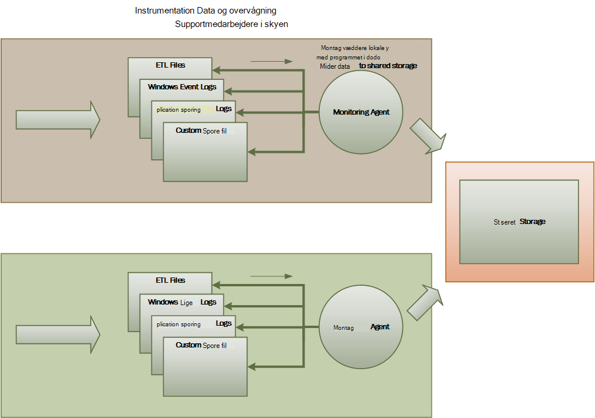

<properties
   pageTitle="Overvågnings- og diagnosticering vejledning | Microsoft Azure"
   description="Bedste fremgangsmåder til at overvåge distribuerede programmer i skyen."
   services=""
   documentationCenter="na"
   authors="dragon119"
   manager="christb"
   editor=""
   tags=""/>

<tags
   ms.service="best-practice"
   ms.devlang="na"
   ms.topic="article"
   ms.tgt_pltfrm="na"
   ms.workload="na"
   ms.date="07/13/2016"
   ms.author="masashin"/>

# <a name="monitoring-and-diagnostics-guidance"></a>Overvågnings- og diagnosticering vejledning

[AZURE.INCLUDE [pnp-header](../includes/guidance-pnp-header-include.md)]

## <a name="overview"></a>Oversigt
Distribuerede programmer og tjenester, der kører i skyen er, efter deres art, komplekse dele af software, der udgør mange bevægelige dele. I et produktionsmiljø er det vigtigt at kunne registrere den måde, som brugere anvende dit system, spor ressource anvendelsen og overvåge generelt tilstand og systemets ydeevne. Du kan bruge disse oplysninger som en diagnosticering hjælpemiddel til at registrere og rette problemer og til at hjælpe med at finde potentielle problemer og forhindre dem i at blive til virkelighed.

## <a name="monitoring-and-diagnostics-scenarios"></a>Overvågnings- og diagnosticering scenarier
Du kan bruge overvågning til at få et overblik over, hvor godt et system fungerer. Overvågning er en vigtig del af vedligeholde quality of service destinationer. Almindelige scenarier til indsamling af overvågningsdata omfatter:

- At sikre, at systemet forbliver sund.
- Sporing af tilgængeligheden af systemet og dets komponent elementer.
- Vedligeholdelse af ydeevnen for at sikre, at gennemløb af systemet ikke forringe uventet som mængde arbejde øges.
- Sikrer, at systemet opfylder service niveau aftaler (SLA) oprettet med kunder.
- Beskytte fortroligheden og sikkerheden for systemet, brugere og deres data.
- Sporing af de handlinger, der udføres for overvågning eller lovmæssige formål.
- Overvågning af daglige brugen af systemet og at finde tendenser, der kan medføre problemer med, hvis de ikke er adresseret.
- Følge op på problemer, der kan opstår, fra den første rapport via til analyse af mulige årsager, afhjælpning, deraf følgende softwareopdateringer og installation.
- Spore handlinger og foretage fejlfinding af softwaren versioner.

> [AZURE.NOTE] Denne liste er ikke beregnet til at være omfattende. Dette dokument fokuserer på disse scenarier som de mest almindelige situationer for at udføre overvågning. Der kan du være andre, der er mindre almindelige eller er specifikke for dit miljø.

I følgende afsnit beskrives disse scenarier mere detaljeret. Oplysningerne om hver scenarie er beskrevet i følgende format:

1. En kort oversigt over dette scenario
2. Dette scenarie typisk krav
3. Rå instrumentation dataene, der kræves til at understøtte scenarie og mulige kilder til disse oplysninger
4. Hvordan denne rækkedata kan analysere og kombineres for at generere sigende diagnostiske oplysninger

## <a name="health-monitoring"></a>Overvåge systemtilstand
Et system er i orden, hvis det er kører, og som kan behandling af anmodninger. Formålet med sundhedsovervågning er at oprette et øjebliksbillede af den aktuelle tilstand for systemet, så du kan kontrollere, at alle komponenter i systemet fungerer som forventet.

### <a name="requirements-for-health-monitoring"></a>Krav til sundhedsovervågning
En operator skal have besked om hurtigt (i løbet af få sekunder), hvis en del af systemet anses for at være beskadiget. Operatoren skal kunne fastslå hvilke dele af systemet fungerer normalt, og hvilke dele der opstår problemer. Systemtilstand kan fremhæves gennem et trafiklys system:

- Rød for beskadiget (systemet ikke fungerer længere)
- Gul for delvist sund (systemet kører med reduceret funktionalitet)
- Grøn for helt sund

En omfattende overvågning af sundhed system gør det muligt for en operator til at analysere ned gennem systemet for at se tilstand for undersystemer og komponenter. Hvis det samlede system er afbildet som delvist sund, bør operatoren for eksempel være mulighed for at zoome ind og bestemme, hvilke funktioner er ikke tilgængelig i øjeblikket.

### <a name="data-sources-instrumentation-and-data-collection-requirements"></a>Datakilder, instrumentation og krav til indsamling af data
Rækkedata, der kræves til at understøtte sundhedsovervågning kan oprettes som resultat af:

- Sporing af udførelse af anmodninger om bruger. Disse oplysninger kan bruges til at bestemme, hvilke anmodninger har lykkedes, som har mislykkedes, og hvor lang tid tager hver anmodning.
- Overvågning af korte bruger. Denne proces simulerer de trin, der er udført af en bruger og følger en foruddefineret række trin. Resultaterne af hvert trin registreres.
- Logføring undtagelser, fejl og advarsler. Disse oplysninger kan registreres som et resultat af sporing sætninger integreret i programmet koden samt henter oplysninger fra hændelseslogfiler af tjenester, der refererer til systemet.
- Overvågning tilstanden for tredjeparts-tjenester, der bruger systemet. Denne overvågning kan kræve hentning og fortolkning af sundhed data, som leverer disse tjenester. Disse oplysninger kan tage en række forskellige formater.
- Slutpunkt overvågning. Denne funktion er beskrevet mere detaljeret i afsnittet "Tilgængelighed overvågning".
- Indsamling af omgivende ydeevneoplysninger som baggrund CPU-forbrug eller i/o-(herunder netværk) aktivitet.

### <a name="analyzing-health-data"></a>Sundhed dataanalyse
Det primære fokus for systemtilstand overvågning er til hurtigt at angive, om systemet kører. Hurtigtast analysis øjeblikkelig data kan udløse en besked, hvis en vigtig komponent der registreres som beskadiget. (Det kan ikke svare på en sammenhængende række pinger, f.eks.) Operatoren kan derefter tage de nødvendige korrigerende skridt.

Et mere avanceret system kan indeholde et skønnet element, som udfører en kolde analyse over nylige og aktuelle arbejdsmængder. En kolde analyse kan øje på tendenser og finde ud af, om systemet er sandsynligvis forbliver sund eller om systemet skal yderligere ressourcer. Dette skønnet element skal baseres på kritiske ydeevne for statistik, f.eks.:

- Antal anmodninger rettet mod hver tjeneste eller undersystem.
- Svar tidspunkter for disse anmodninger.
- Mængden data, der flyder ind og ud af hver tjeneste.

Hvis værdien af en hvilken som helst metrik overskrider en defineret grænseværdi, kan systemet hæve en besked for at aktivere en operator eller Autoskalering (hvis relevant) til at udføre forebyggende handlinger, der er nødvendige for at opretholde systemtilstand. Disse handlinger kan omfatte tilføjelse af ressourcer, genstart af en eller flere tjenester, der fejl eller anvende (throttling) på lavere prioritet anmodninger.

## <a name="availability-monitoring"></a>Overvågning af tilgængelighed
Et helt igennem sund system kræver, at de komponenter og undersystemer, der sammensætter systemet er tilgængelige. Overvågning af tilgængelighed er tæt forbundet med sundhedsovervågning. Men sundhedsovervågning giver en øjeblikkelig visning af den aktuelle tilstand for systemet, tilgængelighed overvågning drejer med registrering tilgængeligheden af systemet og dets komponenter til at generere statistik om oppetiden for systemet.

Visse komponenter (såsom en database) er konfigureret med indbyggede redundans tillade hurtig failover i tilfælde af en alvorlige fejl eller tab af forbindelse i mange systemer. Ideelt bør brugere ikke være opmærksom på, at der er opstået sådanne en fejl. Men fra en tilgængelighed, overvågning perspektiv, det er nødvendigt at indsamle så mange oplysninger som muligt om sådanne mislykkede forsøg på at bestemme årsagen og foretage korrigerende handlinger for at forhindre dem i tilbagevendende.

De data, der kræves til at registrere tilgængelighed kan afhænge af en række underniveau faktorer. Mange af disse faktorer kan være specifikke for det program, system- og -miljø. Et effektivt overvågning system registrerer tilgængelighed dataene, der svarer til disse lavt niveau faktorer og samler dem for at give et overblik over systemet. For eksempel i en e-handel system, kan funktionen virksomheder, der gør det muligt for en kunde at afgive ordrer afhænger lager hvor ordreoplysninger er gemt og systemet betalinger, der håndterer pengeværdier transaktioner for betaler for disse ordrer. Tilgængeligheden af delen rækkefølge placeringen af systemet er derfor en funktion af tilgængeligheden af lageret og betaling undersystem.

### <a name="requirements-for-availability-monitoring"></a>Krav til tilgængelighed overvågning
En operator bør også kunne se historiske tilgængeligheden af hver system og undersystem og bruge disse oplysninger til at få øje på en hvilken som helst tendenser, der kan medføre en eller flere delsystemer mislykkes med jævne mellemrum. (Services starter mislykkes på et bestemt tidspunkt på dagen, der svarer til spidsbelastning behandling timer?)

En overvågning løsning kan give en øjeblikkelig og historiske overblik over tilgængeligheden, eller at hver undersystem. Det bør også kunne advarer hurtigt en operator, når en eller flere tjenester fejl, eller når brugere ikke kan oprette forbindelse til services. Dette er et spørgsmål om ikke kun overvågning hver tjeneste, men også at undersøge de handlinger, som udfører hver enkelt bruger, hvis disse handlinger mislykkes, når de forsøger at kommunikere med en tjeneste. Til en vis grad en graden af fejl ved tilslutning er normal og skyldes midlertidige fejl. Men det kan være praktisk at tillade systemet til at hæve en besked om antallet mislykkede forbindelse til et bestemt undersystem, der opstår under en bestemt periode.

### <a name="data-sources-instrumentation-and-data-collection-requirements"></a>Datakilder, instrumentation og krav til indsamling af data
Som med sundhedsovervågning, kan den rækkedata, der kræves til at understøtte tilgængelighed overvågning oprettes som et resultat af korte bruger overvågning og registrering eventuelle undtagelser, fejl og advarsler, der kan opstå. Desuden kan tilgængelighed data fås fra udføre slutpunkt overvågning. Programmet kan vise en eller flere sundhed slutpunkter, hver test adgang til et modul i systemet. Overvågning systemet kan pinge hvert slutpunkt ved at følge en foruddefineret tidsplan og indsamle resultater (lykkes eller mislykkes).

Alle timeout, netværk connectivity fejl og forbindelse forsøg forsøg skal registreres. Alle data skal være tidsstemplet.

<a name="analyzing-availability-data"></a>
### <a name="analyzing-availability-data"></a>Tilgængelighed dataanalyse
Instrumentation dataene skal lægges sammen og mellem for at understøtte følgende typer analyse:

- Øjeblikkelig tilgængeligheden af delsystemerne og system.
- Tilgængeligheden af fejl ved satser til systemet og undersystemer. Ideelt set en operator skulle nu kunne koordinere fejl med specifikke aktiviteter: Hvad sker, når systemet kunne ikke?
- En historiske visning af fejl ved satser for systemet eller en hvilken som helst undersystemer på tværs af en angivet periode, og afkrydsningsfeltet Indlæs på systemet (antallet af anmodninger, for eksempel) når der opstod en fejl.
- Årsager, der ikke er tilgængelig i systemet eller en hvilken som helst undersystemer. For eksempel af årsager kan være forbundet tjenesten kører ikke connectivity tabt, men får timeout, og forbundne men regnskabsførende fejl.

Du kan beregne procentdel tilgængeligheden af en tjeneste en bestemt periode ved hjælp af følgende formel:

```
%Availability =  ((Total Time – Total Downtime) / Total Time ) * 100
```

Dette er nyttigt til SLA formål. ([SLA overvågning](#SLA-monitoring) er beskrevet mere detaljeret senere i denne vejledning.) Definitionen af _nedetid_ afhænger af tjenesten. For eksempel definerer Visual Studio Team opbygge tjenester nedetid som den periode (samlede akkumulerede minutter) som opbygge tjenesten er ikke tilgængelig. Et minut betragtes ikke tilgængelig, hvis alle fortløbende HTTP-anmodninger om at opbygge tjeneste til at udføre kunde har startet handlinger i hele minuttet medfører en fejlkode eller returnerer ikke et svar.

## <a name="performance-monitoring"></a>Overvågning af ydeevnen
Efterhånden som systemet er placeret under flere og flere belastning (ved at øge omfanget af brugere), bliver størrelsen på de datasæt, der vokser i disse brugere får adgang til og risikoen for fejl i forbindelse med en eller flere komponenter oftere. Fejl i står ofte, en nedsat ydeevne. Hvis du kan registrere en nedsat, du kan udføre proaktiv trin for at afhjælpe situationen.

Systemets ydeevne, afhænger af en række faktorer. Hver faktor måles typisk gennem KPI'er (nøgletal), som antallet databasetransaktioner sekundet eller lydstyrken for anmodninger om netværk, der er blevet repareret i et angivet tidsrum. Nogle af disse KPI'er kan være tilgængeligt som målinger af specifikke ydeevne, mens andre kan være afledt af en kombination af målepunkter.

> [AZURE.NOTE] Afgøre dårlig eller god ydeevne kræver, at du forstår præstationsniveau, hvormed systemet bør kunne køre. Det kræver vægt systemet, mens den fungerer typisk belastning og indsamle data for hver KPI over en periode. Dette kan omfatte kører systemet simuleret belastning i et testmiljø og indsamle de relevante data, før du anvender systemet til et produktionsmiljø.

> Du skal også sørge for, at overvåge ydeevnen henblik ikke bliver en belastning på systemet. Du kan muligvis dynamisk justere detaljeringsniveauet for de data, der samler ydeevnen overvågning proces.

### <a name="requirements-for-performance-monitoring"></a>Krav til overvågning af ydeevnen
Hvis du vil undersøge systemets ydeevne, Brug en operator typisk for at se oplysninger, der omfatter:

- Svar satser for anmodninger.
- Antallet af samtidige anmodninger.
- Mængde netværkstrafik.
- Kurser i hvilke business transaktioner afsluttes.
- Den gennemsnitlige behandlingstid for anmodninger.

Det kan også være praktisk at give værktøjer, der giver en operator for at hjælpe stedet korrelationer, f.eks.:

- Antallet af samtidige brugere kontra anmodning ventetid tidspunkter (hvor lang tid det tager for at starte behandling af en forespørgsel, når brugeren har sendt det).
- Antallet af samtidige brugere kontra gennemsnitlige svartid (hvor lang tid det tager for at fuldføre en anmodning, når den er startet processing).
- Mængde anmodninger kontra antallet af behandling fejl.

Sammen med overordnet funktionelle oplysningerne, skal en operator kunne hente en detaljeret visning af ydeevnen for hver komponent i systemet. Disse oplysninger er typisk angivet gennem tællere i laveste-niveau-ydeevne, spore oplysninger som f.eks.:

- Hukommelsesbrug.
- Antal tråde.
- CPU-behandlingstid.
- Anmode om kø længde.
- Disken eller netværket i/o-satser og fejl.
- Antallet af byte skrevet eller Læs.
- Program indikatorer, som kø længde.

Alle visualiseringer bør tillade en operator til at angive en tidsperiode. De viste data kan være et øjebliksbillede af den aktuelle situation og/eller en historiske visning af ydeevnen.

En operator skal kunne hæve en besked, der er baseret på en hvilken som helst mål for ydeevnen for en bestemt værdi i et angivet tidsinterval.

### <a name="data-sources-instrumentation-and-data-collection-requirements"></a>Datakilder, instrumentation og krav til indsamling af data
Du kan samle høj ydeevne data (overførselshastighed antallet af samtidige brugere, antal business transaktioner, fejl satser og osv.) ved at overvåge statussen for brugeres anmodninger, som de modtages og overfører hele systemet. Dette omfatter inkorporere sporing sætninger på vigtige punkter i programkode sammen med oplysninger om timing. Alle fejl, undtagelser og advarsler registreres med tilstrækkeligt data til korrelere dem med anmodninger, der forårsagede dem. Log på Internet Information Services (IIS) er en anden nyttig kilde.

Hvis det er muligt, skal du hente ydelsesdata for eventuelle eksterne systemer, der bruger programmet. Disse eksterne systemer kan angive deres egne tællere i ydeevne eller andre funktioner til anmodning om ydelsesdata. Hvis dette ikke er muligt, optage oplysninger som starttidspunkt og sluttidspunkt for hver anmodning, der er foretaget i et eksternt system, sammen med status (succes, fejl eller advarsel) for handlingen. For eksempel du kan bruge en stopuret tilgang til tid anmodninger: starte en timer, når anmodningen starter og stop derefter timeren, når anmodningen afsluttes.

Lavt niveau ydelsesdata for enkelte komponenter i et system kan være tilgængelige via funktioner og tjenester som Windows tællere i ydeevne og Azure diagnosticering.

### <a name="analyzing-performance-data"></a>Analyse af ydelsesdata
Meget af arbejdet, der analyse består af sammenlægning ydelsesdata efter bruger anmodningstype og/eller undersystem eller tjeneste, som hver enkelt anmodning sendes. Et eksempel på en anmodning om et er at føje et element til en indkøbskurv eller udføre udtjekning processen i en e-handel system.

Et andet almindelige krav summering af ydelsesdata i markerede fraktiler. En operator kan for eksempel bestemme svar gange til 99% af anmodninger, 95% af anmodninger om og 70 procent af anmodninger om. Der kan være SLA-mål eller andre mål er angivet for hver fraktil. Igangværende resultaterne bør rapporteres i nær realtid for at finde øjeblikkelig problemer. Resultaterne bør også være sammenlagt over længere tid til statistiske formål.

I tilfælde af ventetid problemer påvirke ydeevnen, skal en operator kunne hurtigt at identificere årsagen til flaskehals ved at undersøge forsinkelse på hvert enkelt trin, som udfører hver enkelt anmodning. Ydelsesdata skal derfor giver mulighed for at korrelere målinger af ydeevne for hvert trin for at knytte dem til en bestemt anmodning.

Det kan være nyttige til at oprette og gemme en datakuben, der indeholder visninger af den rækkedata afhængigt af krav visualisering. Denne datakuben kan tillade komplekse ad hoc-forespørgsler og analyse af ydeevne oplysninger.

## <a name="security-monitoring"></a>Overvågning af sikkerhed
Alle kommercielle systemer, der indeholder følsomme data skal implementere en sikkerhedsstruktur. Kompleksiteten af sikkerhed ordning er som regel en funktion af følsomheden for dataene. I et system, kræver, at brugerne skal godkendes, skal du registrere:

- Alle logon forsøg på, om de mislykkes eller lykkes.
- Alle handlinger, der er udført af – og oplysninger om alle de ressourcer, der åbnes af – en godkendt bruger.
- Når en bruger afslutter en session og logger ud.

Overvågning muligvis til at registrere angreb på systemet. Et stort antal mislykkede forsøg-kan for eksempel angiver et skadelige angreb. En uventede stigning i anmodninger kan være resultatet af et distribueret nægtelse af service-(DDoS) angreb. Du skal være forberedt til at overvåge alle anmodninger om at alle de ressourcer uanset kilden til disse anmodninger. Et system, der indeholder en logon-sikkerhedsrisiko kan ved et uheld afsløre ressourcer til verden udenfor uden en bruger faktisk logge på.

### <a name="requirements-for-security-monitoring"></a>Krav til overvågning af sikkerhed
De vigtigste aspekter af sikkerhed overvågning skal aktivere en operator til hurtigt:

- Registrere forsøgte angreb af en ikke-godkendte enhed.
- Identificere forsøg af enheder til at udføre handlinger på data, de ikke har fået adgang.
- Afgøre, om systemet eller en del af systemet, er under angreb fra eller uden for. (For eksempel en ondsindet godkendte bruger kan forsøger at sænkes systemet.)

For at understøtte disse krav, skal have besked om en operator:

- Hvis en konto gør gentagne mislykkedes logon forsøg inden for en bestemt periode.
- Hvis en godkendt konto gentagne gange forsøger at få adgang til en forbudte ressource i en bestemt periode.
- Hvis der opstår et stort antal ikke-godkendte eller uautoriseret anmodninger under en bestemt periode.

De oplysninger, der leveres til en operator skal indeholde host adressen på kilden for hver enkelt anmodning. Hvis der opstår jævnligt overtrædelse af sikkerhed fra et bestemt område af adresser, kan disse værter blokeres.

En central del i opretholde sikkerheden for et system at kunne hurtigt registrere handlinger, der afviger fra det sædvanlige mønster. Oplysninger som antallet af mislykkede og/eller vellykket logon anmodninger kan vises visuelt for at undersøge, om der er en samling i aktivitet på et usædvanlige tidspunkt. (Et eksempel på denne aktivitet er brugere logge ind på 3:00 AM og udføre et stort antal handlinger, når deres arbejdsdag starter 9:00 AM). Disse oplysninger kan også bruges til at konfigurere tidsbaserede Autoskalering. Eksempelvis hvis en operator overholder, et stort antal brugere regelmæssigt Log på et bestemt tidspunkt på dagen, operatoren kan arrangere til at starte yderligere godkendelsestjenester for at håndtere mængde arbejde, og derefter Luk disse ekstra tjenester, når Spidsbelastning er passeret.

### <a name="data-sources-instrumentation-and-data-collection-requirements"></a>Datakilder, instrumentation og krav til indsamling af data
Sikkerhed er en omfatter alle aspekter af mest distribuerede systemer. De relevante data er sandsynligvis genereres på flere steder i et system. Du skal overveje indfører en sikkerhedsoplysninger og begivenhed Management (SIEM) fremgangsmåde for at indsamle de oplysninger, sikkerhedsrelaterede, der er resultatet fra hændelser, der udløses af programmet, netværksudstyr, servere, firewalls, antivirussoftware og andre uautoriseret adgang forebyggelse elementer.

Sikkerhed overvågning kan inkorporere data fra værktøjer, der ikke er en del af dit program. Disse værktøjer kan omfatter funktioner, der identificerer port-scanning aktiviteter efter eksterne myndigheder eller netværk filtre, der registrerer forsøg på at få ikke-godkendte adgang til dine programmer og -data.

I alle tilfælde, skal de indsamlede data aktivere administrator for at vælge typen af enhver angreb og tage passende forholdsregler.

### <a name="analyzing-security-data"></a>Sikkerhed dataanalyse
En funktion af sikkerhed overvågning er forskellige kilder, hvorfra data, der opstår. Forskellige formater og detaljeniveau kræver ofte komplekse analyse af de hentede data, der knytter det sammen i en sammenhængende tråd af oplysninger. Ud over den enkleste af sager (såsom registrering af et stort antal mislykkede logon, eller gentagne forsøg på at få uautoriseret adgang til vigtige ressourcer), er det muligvis ikke muligt at udføre en kompleks Automatiseret behandling af sikkerhedsdata. I stedet, kan det være bedre til at skrive disse data, tidsstemplet men ellers i dets oprindelige form, til et sikkert lager til at tillade expert manuel analyse.

<a name="SLA-monitoring"></a>

## <a name="sla-monitoring"></a>SLA overvågning
Mange kommercielle systemer, der understøtter betalende kunder giver garantier om systemets ydeevne i form af SLA. Grundlæggende, angive SLA, systemet kan håndtere en defineret mængde af arbejde inden for en tidsramme, godkendte og uden at miste vigtige oplysninger. SLA overvågning drejer sig at sikre, at systemet kan overholder nøjagtighed SLA.

> [AZURE.NOTE] SLA overvågning er tæt forbundet med overvågning af ydeevnen. Men mens overvågning drejer med at sikre, at system funktioner _optimalt_, SERVICENIVEAUAFTALE overvågning er underlagt en kontrakt forpligtelse, der definerer, hvilke _optimalt_ faktisk.

SLA defineres ofte i form af:

- Overordnede tilgængelighed til systemet. En organisation kan for eksempel en systemet vil være tilgængelig for 99,9 procent af tiden. Dette svarer til højst 9 timer nedetid om året eller cirka 10 minutter om ugen.
- Funktionsdygtige overførselshastighed. Dette aspekt er ofte udtrykt som en eller flere høj – vand mærker, som sikrer, at systemet kan understøtter op til 100.000 samtidige anmodninger eller håndtere 10.000 samtidige business transaktioner.
- Funktionsdygtige svartid. Systemet kan også gøre garantier for hastigheden, hvormed anmodninger behandles. Et eksempel er, at 99% af alle business transaktioner afsluttes inden for to sekunder, og ingen enkelt transaktion tager længere tid end 10 sekunder.

> [AZURE.NOTE] Nogle kontrakter til kommercielle systemer kan også indeholde SLA til kundesupport. Et eksempel er, at alle helpdesk anmodninger skal vise et svar inden for fem minutter, og, 99% af alle de problemer vil blive behandlet fuldt ud i 1 arbejdsdag. Effektive [problemsporing](#issue-tracking) (beskrives senere i dette afsnit) er nøglen til møde SLA som disse.

### <a name="requirements-for-sla-monitoring"></a>Krav til SLA overvågning
På øverste niveau, skal en operator kunne se, om systemet er møde godkendte SLA eller ej. Og hvis der ikke, operatoren skal kunne analysere ned og undersøge de underliggende faktorer for at finde ud af grundene til varer ydeevne.

Typisk overordnet indikatorer, som kan blive vist visuelt omfatter:

- Procentdelen af tjenesten oppetid.
- Programmet overførselshastigheden (målt i fuldførte transaktioner og/eller handlinger sekundet).
- Antallet af anmodninger om vellykket/fejlbehæftede program.
- Antallet af undtagelser, program og fejl og advarsler.

Alle disse indikatorer skal kunne blive filtreret efter et angivet tidsrum.

Et program i skyen sandsynligt omfatter et antal undersystemer og -komponenter. En operator skal kunne vælge en overordnet indikator og se, hvordan det består fra tilstanden for de underliggende elementer. Eksempelvis hvis oppetiden for det samlede system falder under en gyldig værdi, skal en operator kunne zoome ind og finde ud af, hvilke elementer der bidrager til denne fejl.

> [AZURE.NOTE] Systemoppetid skal være defineret omhyggeligt. Individuelle forekomster af elementer kan mislykkes i et system, der bruger redundans til at sikre maksimal tilgængelighed, men systemet kan forblive funktionelle. Systemoppetid som præsenteres ved at overvåge systemtilstand skal angive Sammenlæg oppetiden for hvert element og ikke nødvendigvis om systemet rent faktisk er stoppet. Fejl kan desuden være isolerede. Så selvom et bestemt system er ikke tilgængelig, resten af systemet stadig være tilgængelige, selvom med reduceret funktionalitet. (I en e-handel system, en fejl i systemet kan forhindre en kunde i placere ordrer, men kunden kan stadig være kan gå et produktkatalog.)

Til at advare formål, bør systemet kunne udløse en hændelse, hvis nogen af de overordnede indikatorer overskrider en bestemt grænse. Underniveau oplysninger om de forskellige faktorer, der sammensætter indikatoren på højt niveau skal være tilgængeligt som kontekstafhængig data til advarsler systemet.

### <a name="data-sources-instrumentation-and-data-collection-requirements"></a>Datakilder, instrumentation og krav til indsamling af data
Rækkedata, der kræves til at understøtte SLA overvågning ligner rækkedata, der kræves til overvågning af ydeevnen, sammen med nogle aspekter af sundheds- og tilgængelighed overvågning. (Se afsnittene, så få mere at vide). Du kan hente denne data efter:

- Udføre slutpunkt overvågning.
- Logføring undtagelser, fejl og advarsler.
- Sporing af udførelse af anmodninger om bruger.
- Tilgængeligheden af tredjeparters tjenester, der bruger systemet.
- Brug af parametre for ydeevne og tællere.

Alle data skal være fik og tidsstemplet.

### <a name="analyzing-sla-data"></a>SLA dataanalyse
Instrumentation dataene skal være sammenlagt for at generere et billede af overordnede ydeevne på systemet. Aggregerede data, også understøtte analysere ned for at aktivere behandling af ydeevnen for underliggende undersystem. For eksempel skal du ikke kunne:

- Beregne det samlede antal anmodninger i en bestemt periode, og Find den vellykkede og mislykkede rente forespørgslerne.
- Kombinere svar tidspunkter for anmodninger til at oprette en overordnet visning af system svar gange.
- Analysere status for bruger anmodninger om at opdele den overordnede svartid for en anmodning til svar tidspunkter for de enkelte arbejdselementer i den pågældende anmodning.  
- Bestemme overordnede tilgængeligheden af systemet som en procentdel af oppetid for en bestemt periode.
- Analysere procentdel tid tilgængeligheden af de enkelte komponenter og -tjenester i systemet. Dette kan omfatte parsing af logfiler, der har oprettet tredjepartstjenester.

Mange kommercielle systemer skal rapportere ydeevnen i reelle tal i forhold godkendte SLA til en bestemt periode, normalt en måned. Disse oplysninger kan bruges til at beregne kredit eller andre former for tilbagebetalinger for kunder, hvis SLA ikke er overholdt i denne periode. Du kan beregne tilgængelighed til en tjeneste ved hjælp af den metode, der er beskrevet i afsnittet [analysere tilgængelighed data](#analyzing-availability-data).

Til interne formål, kan en organisation også spore antal og art af hændelser, der forårsagede tjenester. Lær, hvordan du kan løse problemerne hurtigt eller udelade dem fuldstændigt hjælper med at reducere nedetid og opfylder SLA.

## <a name="auditing"></a>Overvågning
Afhængigt af hvilke programmet, kan der være lovfæstede eller andre juridiske bestemmelser, som angiver krav til overvågning brugeres handlinger og registrering af adgang til alle datakilder. Overvågning kan levere dokumentation, links til specifikke anmodninger. Ikke-afvisning er en vigtig faktor i mange e business-systemer til at vedligeholde sikkerhed og rettighedsadministration være mellem en kunde og den organisation, der er ansvarlig for programmet eller tjenesten.

### <a name="requirements-for-auditing"></a>Krav til overvågning
En analyse skal kunne spore rækkefølgen af business handlinger, som brugere udført, så du kan rekonstruere brugeres handlinger. Det kan være nødvendigt, skal du blot som et spørgsmål om post eller som en del af en sikkerhedsværktøj undersøgelse.

Overvågningslog oplysninger er meget følsomme. Det vil sandsynligvis omfatte data, der identificerer brugerne af systemet, sammen med de opgaver, som de foretager. Derfor tilladelserne træder højst sandsynligt i form af rapporter, der er kun tilgængelig for der er tillid til analytikere i stedet for som et interaktivt system, der understøtter detailudledning af grafiske handlinger. En analyse skal kunne oprette en række rapporter. Rapporter kan for eksempel liste over alle brugere aktiviteter, der opstår under et angivet tidsrum, Detaljeformater kronologi aktivitet til en enkelt bruger eller listen rækkefølgen af handlinger, der udføres mod en eller flere ressourcer.

### <a name="data-sources-instrumentation-and-data-collection-requirements"></a>Datakilder, instrumentation og krav til indsamling af data
De primære kilder til oplysninger til overvågning kan omfatter:

- Sikkerhedssystemet, der administrerer brugergodkendelse.
- Spore logfiler, der registrerer brugeraktivitet.
- Sikkerhedslogfiler, som følge alle anmodninger om identifiable og for netværk.

Formateringen af overvågningsdataene og den måde, som det er gemt kan styres af lovmæssige krav. Det kan for eksempel ikke muligt at rydde op i data på nogen måde. (Det skal være registreret i det oprindelige format.) Adgang til det lager, hvor det er holdt skal være beskyttet for at forhindre uautoriseret adgang.

### <a name="analyzing-audit-data"></a>Analyse af data for overvågning
En analyse skal kunne få adgang til rækkedata i sin helhed, i dets oprindelige form. Værktøjer til at analysere disse data sandsynligvis bortset fra kravet til at generere almindelige overvågningslog rapporter, specialiserede og bevares eksterne til systemet.

## <a name="usage-monitoring"></a>Overvåge brugen
Overvåge brugen registrerer Sådan bruges de funktioner og komponenterne i et program. En operator kan bruge de indsamlede data til:

- Bestemme, hvilke funktioner er belastet og finde ud af en hvilken som helst potentielle hotspots i systemet. Stor trafik elementer kan få glæde af funktionelle partitionering eller lige gentagelse til at sprede afkrydsningsfeltet Indlæs mere jævnt. En operator kan også bruge disse oplysninger om, hvilke funktioner bruges sjældent og er mulige kandidater for lukning af eller erstatning i en senere version af systemet.
- Få oplysninger om de hændelser, der driften af systemet under normal brug. En e-handel-webstedet, kan du registrere de statistiske oplysninger om antallet af transaktioner og lydstyrken for kunder, der er ansvarlig for dem. Disse oplysninger kan bruges til kapacitetsplanlægning som antallet af kunder vokser.
- Registrere (eventuelt indirekte) brugertilfredsheden med ydeevne eller funktionaliteten i systemet. Eksempelvis hvis et stort antal kunder i en e-handel system afbryde jævnligt deres indkøbskurve, skyldes dette et problem med funktionen udtjekning.
- Generere faktureringsoplysninger. En kommerciel programmet eller multiprofiler tjenesten kan blive opkrævet kunder for de ressourcer, som de bruger.
- Gennemtvinge kvoter. Hvis en bruger i et multiprofiler system overskrider deres betalt kvote for at behandle brugen klokkeslæt eller ressource i en bestemt periode, deres access kan være begrænset eller behandling kan være begrænset.

### <a name="requirements-for-usage-monitoring"></a>Krav til at overvåge brugen
Hvis du vil undersøge system brugen, Brug en operator typisk for at se oplysninger, der omfatter:

- Antallet af forespørgsler, der er behandlet af hver undersystem og ført til hver ressource.
- Det arbejde, som udfører hver enkelt bruger.
- Lydstyrken for lagring af data, som hver enkelt bruger fylder.
- De ressourcer, der har adgang til hver enkelt bruger.

En operator bør også kunne generere grafer. For eksempel en graf kan du få vist de mest ressource-hungrende brugere, eller de hyppigst adgang til ressourcer eller funktioner.

### <a name="data-sources-instrumentation-and-data-collection-requirements"></a>Datakilder, instrumentation og krav til indsamling af data
Brugen sporing kan udføres på et relativt højt niveau. Det kan Bemærk start- og sluttidspunkter for hver enkelt anmodning og art for din anmodning (læse, skrive og så videre, afhængigt af den pågældende ressource). Du kan få disse oplysninger, som:

- Spore brugeraktivitet.
- Hvis du henter tællere i ydeevne, der måler anvendelsen for hver ressource.
- Overvågning ressourceforbrug af hver enkelt bruger.

For måling formål, skal du også kunne identificere, hvilke brugere der er ansvarlig for at udføre, hvilke handlinger, og de ressourcer, der anvender disse handlinger. Indsamlede oplysningerne skal være detaljeret nok til at aktivere nøjagtige fakturering.

<a name="issue-tracking"></a>
## <a name="issue-tracking"></a>Problemsporing
Kunder og andre brugere kan rapportere problemer, hvis der opstår uventede begivenheder eller funktionsmåde i systemet. Problemsporing drejer med administration af disse problemer, knytte dem til indsats for at løse underliggende problemer i systemet og informerer kunder af mulige løsninger.

### <a name="requirements-for-issue-tracking"></a>Krav til problemsporing
Operatorer udfører ofte problemsporing ved hjælp af et separat system, der giver dem mulighed for at registrere og rapportere oplysninger om problemer med brugere rapporten. Disse detaljer kan medtage de opgaver, som brugeren forsøgte at udføre symptomer på problemet, rækkefølgen af begivenheder, og eventuelle fejl eller advarsler, der er udstedt.

### <a name="data-sources-instrumentation-and-data-collection-requirements"></a>Datakilder, instrumentation og krav til indsamling af data
Indledende datakilden for opfølgning data er den bruger, der rapporteres problemet i første omgang. Brugeren muligvis angive yderligere data f.eks.:

- En nedbrud lagring (Hvis programmet inkluderer en komponent, der kører på brugerens computer).
- Et øjebliksbillede af skærmen.
- Dato og klokkeslæt, når fejlen opstår, sammen med andre påvirkning oplysninger som brugerens placering.

Disse oplysninger kan bruges til at den fejlfinding indsats, og Opret en ordrebeholdningen i fremtidige versioner af softwaren.

### <a name="analyzing-issue-tracking-data"></a>Analysere problemsporing data
Forskellige brugere kan rapportere det samme problem. Problemsporing systemet skal knytte almindelige rapporter.

Status for den fejlfinding indsats bør registreres mod hver problem rapport. Når problemet er løst, kan kunden informeres om løsningen.

Hvis en bruger rapporterer et problem, der har en kendte løsning i problemsporing systemet, skal der være operatoren stand til at informere brugere af løsningen med det samme.

## <a name="tracing-operations-and-debugging-software-releases"></a>Spore handlinger og foretage fejlfinding af softwaren versioner
Når en bruger rapporterer et problem, skal er brugeren ofte kun være opmærksom på den største indflydelse, der er på deres aktiviteter. Brugeren kan kun rapportere resultaterne af deres egne oplevelse tilbage til en operator, der er ansvarlig for vedligeholdelse af systemet. Disse oplevelser er som regel kun et synlige symptom på et eller flere grundlæggende problemer. I mange tilfælde skal en analyse grave gennem kronologi underliggende handlinger til at oprette den egentlige årsag til problemet. Denne proces kaldes _rod medføre analyse_.

> [AZURE.NOTE] Rodårsagsanalyse kan afdække effektiviteten i designet af et program. I disse tilfælde kan være det muligt at arbejde med de pågældende elementer og installere dem som en del af en senere version. Denne proces kræver forsigtig objekt, og de opdaterede komponenter, der skal overvåges tæt.

### <a name="requirements-for-tracing-and-debugging"></a>Krav til sporing og fejlfinding
Til sporing af uventede begivenheder og andre problemer, er det vigtigt, at den overvågningsdata indeholder nok oplysninger for at aktivere en analyse til at spore tilbage til baggrunden for disse problemer og rekonstruere rækkefølgen af begivenheder, der er opstået. Disse oplysninger skal være tilstrækkelige til at aktivere en analyse til at diagnosticere den egentlige årsag problemer. En udvikler kan derefter foretage de nødvendige ændringer for at forhindre dem i tilbagevendende.

### <a name="data-sources-instrumentation-and-data-collection-requirements"></a>Datakilder, instrumentation og krav til indsamling af data
Fejlfinding i forbindelse med, kan det omfatte sporing af alle metoder (og deres parametre) gældende som en del af en handling til at bygge et træ, der viser det logiske flow hele systemet, når en kunde foretager en specifik anmodning. Undtagelser og advarsler, der genereres som et resultat af dette flow skal hentes og logget.

For at understøtte fejlfinding, kan systemet give kroge, der aktiverer en operator til at registrere tilstandsoplysninger på vigtige punkter i systemet. Eller systemet kan levere detaljerede trinvise oplysninger som valgte operationer status. Hente data på dette detaljeniveau kan angive en ekstra belastning på systemet og skal være en midlertidig proces. En operator bruger denne proces, især, når en meget usædvanlige serie af hændelser opstår og er svært at gentage, eller når en ny version af et eller flere elementer i et system kræver nøje overvågning for at sikre, at funktionen elementer som forventet.

## <a name="the-monitoring-and-diagnostics-pipeline"></a>Pipeline overvågning og diagnosticering
Overvågning af et omfattende distribueret system udgør en stor udfordring. Hver af de scenarier, der er beskrevet i forrige afsnit bør ikke nødvendigvis betragtes alene. Er der sandsynligvis er en betydeligt overlapning i overvågnings- og dataene, der kræves for hver situation, selvom disse data kan være nødvendigt at behandles og præsenteret på forskellige måder. Disse årsager, skal du tage en holistisk visning af overvågning og diagnosticering.

Du kan agter hele overvågning og diagnosticering proces som en rørledning, der omfatter de faser, der er vist i figur 1.


_Figur 1. Faserne i pipeline overvågning og diagnosticering_

Figur 1 fremhæves, hvordan dataene til overvågning og diagnosticering kan komme fra en række forskellige datakilder. Instrumentation og samling faserne er bekymrede med identificere kilder fra hvor dataene skal hentes, afgøre, hvilke data til at registrere, hvordan du kan hente den og hvordan du kan formatere disse data, så den kan undersøges nemt. Fasen analyse/diagnosticering tager det rækkedata og bruges til at generere betydningsfulde oplysninger, som en operator kan bruge til at bestemme systemets tilstand. Operatoren kan bruge disse oplysninger til at tage beslutninger om mulige handlinger til at tage, og derefter feed resultaterne i instrumentation og samling faserne igen. Visualisering/advarer fase fasen præsenterer forbrugsvarer af systemets tilstand. Det kan få vist oplysningerne i nær realtid ved hjælp af en række dashboards. Og det kan generere rapporter, grafer og diagrammer til at levere en historiske visning af de data, der kan hjælpe med at identificere langsigtede tendenser. Hvis oplysninger angiver, at en KPI sandsynligvis overskrider acceptable grænser, kan denne fase også udløse en besked til en operator. I nogle tilfælde kan en besked også bruges til at udløse en automatiseret proces, der forsøger at foretage korrigerende handlinger, som Autoskalering.

Bemærk, at disse trin udgør et fortløbende-flow proces, hvor faserne sker parallelt. Ideelt bør alle faser være dynamisk konfigurerbar. På nogle punkter, især hvis et system netop er blevet installeret, eller der kan være problemer, være det nødvendigt at indsamle udvidede data på grundlag af hyppigere. På andre tidspunkter, skal det være muligt at gå tilbage til hentning af et grundlæggende niveau af væsentlige oplysninger til at bekræfte, at den fungerer korrekt.

Hele overvågning processen skal desuden betragtes som en direkte igangværende løsning, der er underlagt finjustere og forbedringer som et resultat af feedback. For eksempel kan du starte med at måle mange faktorer for at afgøre systemtilstand. Analyse over tid kan føre til en afgrænsning, som du kasserer målinger, der ikke er relevant, hvilket gør det muligt at mere præcist fokusere på de data, du skal bruge og minimere baggrundsstøj.

## <a name="sources-of-monitoring-and-diagnostic-data"></a>Kilder til overvågnings- og data
De oplysninger, overvågning processen bruger kan komme fra flere kilder, som vist i figur 1. På niveauet for programmet på computeren kommer oplysninger fra spore logfiler integreres i koden for systemet. Udviklere skal følge en standardtilgang til at spore kontrolflowet via deres kode. En post til en metode kan for eksempel udsende en sporing meddelelse, der angiver navnet på metoden, det aktuelle klokkeslæt, værdien af hver parameter og andre relevante oplysninger. Også kan være nyttige optagelse de adresse, og Afslut gange.

Du skal logge alle undtagelser og advarsler og sikre, at du beholder en fuld sporing af enhver indlejrede undtagelser og advarsler. Ideelt set skal du hente oplysninger, der identificerer den bruger, der kører koden, sammen med aktivitet korrelationsoplysninger (for at spore anmodningerne, når de passerer gennem systemet). Og du skal logge forsøg på at få adgang til alle de ressourcer som meddelelseskøer, databaser, filer og andre afhængige tjenester. Disse oplysninger kan bruges til måling og revision formål.

Mange programmer gøre brug af biblioteker og rammer til at udføre almindelige opgaver som at få adgang til et datalager eller kommunikere via et netværk. Disse strukturer kan være konfigureres til at give deres egne spore meddelelser og rå diagnostiske oplysninger, som posteringen satser og data overførslen succeser og fejl.

> [AZURE.NOTE] Mange moderne strukturer publicere automatisk ydeevne og sporing begivenheder. Indsamle disse oplysninger er kun nødvendigt at give mulighed for at hente og gemme den hvor de kan behandles og analysere.

Det operativsystem, hvor programmet kører kan være en kilde til lavt niveau systemindstillinger oplysninger som tællere i ydeevne, som angiver i/o-satser, hukommelsesbrug og CPU-brug. Operativsystemfejl (såsom fejl ved at åbne en fil korrekt) kan også rapporteres.

Du skal også overveje de underliggende infrastruktur og komponenter, dit system kører. Virtuelle maskiner, virtuelle netværk og lagerplads tjenester kan alle være kilder til tællere i vigtige infrastruktur niveau ydeevne og andre diagnosticering data.

Hvis dit program bruger andre eksterne tjenester, som en webserver eller database administrationssystem, kan disse tjenester publicere deres egne sporingsoplysningerne, logfiler og tællere i ydeevne. Som eksempler kan nævnes SQL Server dynamisk Management-visninger til at spore handlinger, der udføres mod en SQL Server-database, og IIS sporing logger for optagelse anmodninger til en webserver.

Komponenterne i et system kan ændres, og nye versioner er installeret, er det vigtigt at kunne attribut problemer, begivenheder og målepunkter til hver version. Disse oplysninger skal være bundet tilbage til release rørledning, så problemer med en bestemt version af en komponent kan registreres hurtigt og rektificeret.

Sikkerhedsproblemer kan opstå, når som helst i systemet. For eksempel kan en bruger forsøge at logge på med et ugyldigt bruger-ID eller adgangskode. En godkendt bruger kan prøve at få uautoriseret adgang til en ressource. Eller en bruger kan angive en ugyldig eller forældede nøgle for at få adgang til krypterede oplysninger. Sikkerhedsrelaterede oplysninger om vellykkede og svigter anmodninger skal altid være logget.

Afsnittet [instrumentering et program](#instrumenting-an-application) indeholder flere vejledning i de oplysninger, hvis du henter. Men du kan bruge en lang række strategier til at indsamle disse oplysninger:

- **Overvågning af programmet/system**. Denne strategi bruger interne kilder i det program, programmet strukturer, operativsystem og infrastruktur. Programkoden kan generere sin egen overvågningsdata på væsentlige punkter under livscyklus for en klientanmodning. Programmet kan medtage sporing sætninger, der kan aktiveres eller deaktiveres når omstændigheder stiger selektivt. Det kan være også muligt at indsætte diagnosticering dynamisk ved hjælp af en ramme til diagnosticering. Disse strukturer giver typisk plug-ins, som kan vedhæfte til forskellige instrumentation punkter i din kode og registrere disse ting sporingsdata.

    Desuden kan din kode og/eller den underliggende infrastruktur udløse hændelser på kritiske punkter. Overvågning af supportmedarbejdere, der er konfigureret til at lytte til disse begivenheder kan registrere oplysningerne om begivenheden.

- **Reelt tal bruger overvågning**. Denne metode registreres interaktioner mellem en bruger og programmet på computeren og overholder strømmen af hver enkelt anmodning og svar. Disse oplysninger kan have et 2-falset tværformat formål: den kan bruges til måling brugen af hver enkelt bruger, og den kan bruges til at finde ud af, om brugere modtager en passende kvaliteten af service (for eksempel hurtigt svar gange, lav ventetid og minimale fejl). Du kan bruge de hentede data til at identificere områder af betydning, fejl opstår oftest. Du kan også bruge dataene til at identificere elementer hvor systemet langsommere, muligvis på grund af hotspots i programmet eller en anden form for flaskehals. Hvis du implementerer denne metode omhyggeligt, kan det være muligt at rekonstruere brugernes flyder gennem programmet til fejlfinding og testformål.

    > [AZURE.IMPORTANT] Du skal overveje de data, der er hentet ved at overvåge reelle brugere for at være meget følsomme, fordi den kan indeholde fortrolige oplysninger. Hvis du gemmer hentede data, kan du gemme den sikkert. Hvis du vil bruge dataene til ydeevne, overvågning eller i forbindelse med fejlfinding, derpå fjerne alle personlige oplysninger først.

- **Overvågning af korte bruger**. I denne metode kan du skrive din egen test-klient, der simulerer en bruger og udfører en konfigurerbar men typisk række handlinger. Du kan spore ydeevnen for test-klienten til at finde ud af systemets tilstand. Du kan også bruge flere forekomster af test-klienten som en del af en test af-handling for at fastlægge, hvordan systemet reagerer belastet, og den ønskede type overvågning output genereres under disse omstændigheder.

    > [AZURE.NOTE] Du kan implementere reelle og korte bruger overvågning ved at medtage kode, der sporer og tiden udførelse af metode opkald og andre vigtige dele af et program.

- **Oprettelse af profiler**. Denne metode er primært rettet mod overvågning og forbedring af ydeevne i programmet. I stedet for operativsystem på funktionelle niveau i reelle og korte bruger overvågning, registrerer det underniveau oplysninger som programmet kører. Du kan implementere profiler ved hjælp af periodiske udvalg af udførelse af tilstanden for et program (afgøre, hvilken del af en kode, der kører programmet på et bestemt tidspunkt). Du kan også bruge funktion, der indsætter sonder i koden på vigtige junctures (såsom starten og slutningen af et metode opkald), og hvilke metoder er kaldes på tidspunkt, og hvor lang tid hver opkald tog-poster. Du kan derefter analysere dataene for at afgøre, hvilke dele af programmet kan medføre problemer med ydeevnen.

- **Overvågning af slutpunkt**. Denne teknik bruger en eller flere diagnosticering slutpunkter, som programmet, der viser specifikt for at aktivere overvågning. Ark indeholder en sti i programmet koden og kan returnere oplysninger om tilstanden for systemet. Forskellige slutpunkter kan fokusere på forskellige aspekter af funktionaliteten. Du kan skrive din egen diagnosticering klient, der sender periodiske anmodninger til disse slutpunkter og tilpasse svarene. Denne metode er beskrevet mere i [Sundhed slutpunkt overvågning mønster](https://msdn.microsoft.com/library/dn589789.aspx) på Microsofts websted.

Maksimale om, skal skal du bruge en kombination af disse metoder.

<a name="instrumenting-an-application"></a>
## <a name="instrumenting-an-application"></a>Instrumentering et program
Instrumentation er en vigtig del af processen overvågning. Du kan foretage sigende beslutninger om den ydeevne og tilstand for et system, kun, hvis du først hente de data, der gør det muligt at gøre disse beslutninger. De oplysninger, du har indsamlet ved hjælp af instrumentation bør være tilstrækkelige til gør det muligt at vurdere ydeevne, diagnosticere problemer og træffe beslutninger uden at du skal logge på et eksternt server til at udføre sporing (og fejlfinding) manuelt. Instrumentation data omfatter typisk målepunkter og oplysninger, der er skrevet til at spore logfiler.

Indholdet af en logfil over sporing kan være resultatet af tekstdata, der er skrevet af programmet eller binære data, der er oprettet som et resultat af en sporing begivenhed (Hvis programmet bruger begivenhed sporing til Windows - ETW). De kan også genereres fra systemets logfiler, der registrerer hændelser, der følger af dele af infrastrukturen, som en webserver. Tekstbaseret logmeddelelser ofte er designet til at være læsbar, men de også skal skrives i et format, der gør det muligt for et automatiseret system til at fortolke dem nemt.

Du skal også kategorisere logfiler. Ikke skrive alle sporingsdata til en enkelt logfil, men Brug separate logfiler til at registrere sporingsoutput fra forskellige funktionsdygtige aspekter af systemet. Derefter kan du hurtigt filtrere logmeddelelser ved at læse fra den relevante log i stedet for at behandle en enkelt længerevarende fil. Aldrig Skriv oplysninger, der har forskellige sikkerhedskrav (såsom tilladelserne og fejlfinding data) til den samme logfil.

> [AZURE.NOTE] En logfil implementeres muligvis som en fil i filsystemet, eller den kan bevares i nogle andre formater som en blob i blob-lager. Logoplysninger muligvis også opbevares i mere struktureret lagring, som rækker i en tabel.

Målepunkter vil normalt være en måling eller antallet af nogle højde eller ressource i systemet på et bestemt tidspunkt, med en eller flere tilknyttede mærker eller dimensioner (også kaldet en _eksempel_). En enkelt forekomst af en metrikværdi er normalt ikke nyttig isolationsniveauet. I stedet nødt målepunkter til at blive hentet over tid. Vigtige problemet skal du tænke på bliver hvilke målepunkter, skal du registrere og hvor ofte. Oprette data på målepunkter for ofte kan angive en betydeligt yderligere belastning på systemet, mens hente målepunkter sjældent kan medføre du går glip af omstændighederne, der fører til en vigtig hændelse. Overvejelser, varierer fra metrisk til metrisk. For eksempel CPU-forbrug på en server kan variere betydeligt fra andet til sekund, men høj anvendelsen bliver et problem, kun, hvis det er langlivet over et antal minutter.

<a name="information-for-correlating-data"></a>
### <a name="information-for-correlating-data"></a>Oplysninger om korrelere data
Du kan nemt overvåge tællere i individuelle system-niveau ydeevne, registrere måleredskaber for ressourcer og hente programmet sporingsoplysninger fra forskellige logfiler. Men nogle former for overvågning kræver analyse og diagnosticering fasen i overvågning pipeline til at koordinere de data, der er hentet fra flere kilder. Disse data kan tage flere formularer i den rækkedata, og processen analyse skal være udstyret med tilstrækkelige instrumentation data skal kunne tilknytte disse forskellige former. For eksempel på niveauet for framework programmet på computeren, kan en opgave blive identificeret ved et tråd-ID. I et program være det samme arbejde knyttet til bruger-ID for den bruger, som udfører denne opgave.

Der er også sandsynligvis ikke en 1:1 tilknytning mellem tråde og anmodninger, fordi asynkrone handlinger kan genbruge de samme tråde for at udføre handlinger på vegne af mere end én bruger. Du kan let gøre anliggende videre, kan en enkelt anmodning løses af mere end én tråd som udførelse af flyder gennem systemet. Hvis det er muligt at knytte hver anmodning med et entydigt aktivitet-ID, som er blevet overført hele systemet som en del af anmodning om konteksten. (Metode til at generere og herunder aktivitet id'er i sporingsoplysningerne afhænger af den teknologi, der bruges til at registrere sporingsdataene.)

Alle overvågningsdata skal være tidsstemplet på samme måde. Registrere alle datoer og klokkeslæt for konsistens, ved hjælp af Coordinated Universal Time. Det vil gøre det nemmere sporing sekvens af hændelser.

> [AZURE.NOTE] Computere, der kører i forskellige tidszoner og netværk kan ikke synkroniseres. Ikke afhænge af, ved hjælp af tidsstempler alene til korrelere instrumentation data, der strækker sig over flere computere.

### <a name="information-to-include-in-the-instrumentation-data"></a>Oplysninger der skal medtages i instrumentation data
Overvej følgende punkter, når du overvejer, hvilket instrumentation data, du har brug for at indsamle:

- Sørg for, at oplysninger, der hentes ved sporing begivenheder er maskine og læsbare. Indføre klart defineret ved hjælp af skemaer for oplysningerne at lette Automatiseret behandling af data i på tværs af systemer og give konsistens handlinger og engineering-personale læse loggene. Medtage påvirkning oplysninger som installation-miljø, som processen kører, detaljerne for processen, og kaldestak maskinen.  
- Aktivere profiler kun, når det er nødvendigt, da det kan angive en betydeligt omkostninger på systemet. Oprettelse af profiler ved hjælp af instrumentation registrerer en hændelse (som en metode opkald) hver gang den optræder, mens indsamle poster kun de markerede hændelser. Valgmuligheden kan være tidsbaserede (én gang hver *n* sekunder), eller frekvens-baserede (når hver *n* anmoder om). Hvis hændelser indtræffer meget ofte, kan profiler ved instrumentation medføre for meget af en belastning og selve påvirker overordnede ydeevne. I dette tilfælde være udvalg tilgangen bedre. Men hvis hyppigheden for hændelser er lav, stikprøver, hvor der kan gå glip af dem. I dette tilfælde være instrumentation bedre fremgangsmåde.
- Angive tilstrækkelige kontekst for at aktivere en udvikler eller administrator for at finde frem til kilden for hver enkelt anmodning. Dette kan indeholde andre former for aktivitet ID, der identificerer en bestemt forekomst af en anmodning. Det kan også indeholde oplysninger, som kan bruges til at koordinere denne aktivitet med det computational udførte arbejde og de ressourcer, der bruges. Bemærk, at dette arbejde kan cross proces- og grænser. Til måling, bør også omfatte konteksten (enten direkte eller indirekte via andre mellem oplysninger) en reference til den kunde, der forårsagede anmodningen skal foretages. I denne kontekst giver værdifulde oplysninger om programtilstanden på det tidspunkt, hvor den overvågningsdata blev hentet.
- Registrere alle anmodninger og placeringer eller områder, hvor disse anmodninger. Disse oplysninger kan hjælpe med at fastslå, om der er en hvilken som helst placering-specifikke hotspots. Disse oplysninger kan også være nyttige ved fastlæggelse af om du vil opdele et program eller de data, der bruges.
- Optage og registrere oplysninger om undtagelser omhyggeligt. Kritiske fejlfindingsoplysninger er ofte tabt som et resultat af håndtering af dårlig undtagelse. Registrere alle detaljer for undtagelser, der viser programmet, herunder eventuelle indre undtagelser og andre kontekstoplysninger. Medtage kaldestak Hvis det er muligt.
- Være konsistent i de data, som de forskellige elementer i dit program registrere, da det kan hjælpe med at analysere begivenheder og korrelere dem med anmodninger. Overvej at bruge en omfattende og konfigurerbar logføring pakke til at indsamle oplysninger i stedet for udviklere at bruge den samme fremgangsmåde, når de implementerer forskellige dele af systemet, afhængigt af. Indsaml data fra KPI'er tællere, som mængde I/O, der udføres, udnyttelse af netværk, antal anmodninger, hukommelsesforbruget og CPU-forbrug. Nogle infrastrukturtjenester kan angive deres egne bestemte tællere i ydeevne, som antallet forbindelser til en database, den rente, hvormed transaktioner udføres og antallet af transaktioner der lykkes eller mislykkes. Programmer kan også angive deres egne bestemte tællere i ydeevne.
- Log alle kald til eksterne tjenester, som databasesystemer, webtjenester eller andre system-niveau-tjenester, der er en del af infrastrukturen. Registrere oplysninger om den tid, det tager at udføre hvert opkald, og om lykkes eller mislykkes af opkaldet. Hvis det er muligt at indsamle oplysninger om alle gentagne forsøg og fejl på en hvilken som helst midlertidige fejl, der opstår.

### <a name="ensuring-compatibility-with-telemetry-systems"></a>At sikre kompatibilitet med telemetri systemer
I mange tilfælde de oplysninger, der giver instrumentation oprettes som en serie af begivenheder og overføres til et separat telemetri system til behandling og analyse. Et telemetri system er typisk uafhængigt af eventuelle bestemt program eller teknologi, men forventes oplysninger, der følger et bestemt format, der er normalt defineret af et skema. Skemaet angiver effektivt en kontrakt, der definerer datafelter og datatyper, der kan indtager telemetri systemet. Skemaet skal være generalized for at tillade til data, der er modtaget fra et område af platforme og enheder.

Et almindelige skema bør omfatte felter, der er fælles for alle instrumentation begivenheder, som navnet på begivenheden, begivenhed tid, IP-adressen på afsenderen, og de oplysninger, der er nødvendige for samkøres med andre begivenheder (som et bruger-ID, et enheds-ID og et program-ID). Husk, at et vilkårligt antal enheder kan udløse hændelser, så skemaet ikke skal afhænger af enhedstypen. Desuden kan forskellige enheder udløse hændelser til det samme program programmet understøtter muligvis global eller et andet form for distribution og enheder.

Skemaet kan også indeholde domæne felter, der er relevante for et bestemt scenarie, der er fælles på tværs af forskellige programmer. Det kan være oplysninger om undtagelser, programmet start og Afslut begivenheder og succes og/eller fejl i forbindelse med web service API opkald. Alle programmer, der bruger det samme sæt domæne felter skal være det samme sæt af hændelser, aktivere et sæt af almindelige rapporter og analyser skal anlægges.

Til sidst skal kan et skema indeholde brugerdefinerede felter til at hente oplysninger om programmet-specifikke begivenheder.

### <a name="best-practices-for-instrumenting-applications"></a>Bedste fremgangsmåder til instrumentering programmer
Følgende liste over opsummeres de bedste fremgangsmåder for instrumentering et distribueret program, der kører i skyen.

- Gør logfiler nemt at læse og nemt at sortere. Brug struktureret logføring, hvor det er muligt. Være kortfattet og beskrivende i logmeddelelser.
- Identificere kilden i alle logfiler og angive kontekst og tidsindstilling oplysninger, som hver telefonlogpost er skrevet.
- Bruge det samme tidszone og format til alle tidsstempler. Dette hjælper med at koordinere begivenheder for handlinger, der spænder over hardware og tjenester, der kører i forskellige geografiske områder.
- Kategorisere logfiler og skrive meddelelser til den relevante logfil.
- Ikke videregive følsomme oplysninger om systemet eller personlige oplysninger om brugere. Flytte skydekontrollen disse oplysninger, før den er gemt, men Sørg for, at de relevante oplysninger bevares. For eksempel fjerne ID og din adgangskode fra en hvilken som helst database forbindelsesstrenge, men skrive de øvrige oplysninger til loggen, så en analyse kan bestemme, systemet har adgang til den korrekte database. Log alle kritiske undtagelser, men aktivere administratoren for at slå logføring til og fra for undtagelser og advarsler på lavere niveauer. Også registrere og registrere alle data, logik prøv igen. Disse data kan være praktiske i overvågning midlertidige tilstanden for systemet.
- Spore af processen opkald, som anmodninger til eksterne webtjenester eller databaser.
- Undgå at blande logmeddelelser med forskellige sikkerhedskrav i den samme logfil. For eksempel ikke skrive fejlfinding og overvåge oplysninger til den samme logfil.
- Med undtagelse af overvågning af hændelser, Kontrollér, at alle logføring opkald er fire og glemmer handlinger, der ikke forhindrer forløbet af business operationer. Overvåge hændelser er særlige, fordi de er vigtige for virksomheden og kan klassificeres som en grundlæggende del af business handlinger.
- Sørg for, at logføring kan udvides og har ikke direkte afhængigheder på et cement mål. For eksempel i stedet for at skrive oplysninger ved hjælp af _System.Diagnostics.Trace_, definere en abstrakte grænseflade (såsom _ILogger_), der viser logføring metoder og, der kan ske ud fra en hvilken som helst middel.
- Sørg for, at alle logføring er fejlsikret og aldrig udløser overlappende fejl. Logføring skal ikke Udløs eventuelle undtagelser.
- Behandle instrumentation som en fortløbende gentaget proces, og gennemgå logfiler med jævne mellemrum, ikke kun, når der ikke er et problem.

## <a name="collecting-and-storing-data"></a>Indsamling og lagring af data
Samling trin i processen overvågning drejer sig hentning af de oplysninger, der instrumentation genererer, formatering disse data for at gøre det nemmere for fasen analysis/diagnosticering til at bruge og gemme den transformerede data i pålidelige lagerplads. De instrumentation data, du har indsamlet fra forskellige dele af et distribueret system kan holdes i en række af steder og med forskellige formater. Din programkode kan for eksempel oprette sporingslogfiler og generere programmet hændelseslog data, mens tællere i ydeevne, overvåge vigtige aspekter af infrastrukturen, der bruger dit program kan registreres gennem andre teknologier. En hvilken som helst fra tredjepart komponenter og -tjenester blob, dit program bruger kan angive instrumentation oplysninger i forskellige formater, ved hjælp af Sporingsfiler er separat, lagerplads eller endda et brugerdefineret datalager.

Dataindsamling udføres ofte gennem en samling, som kan køre selvstændigt fra det program, der genererer instrumentation dataene. Figur 2 vises et eksempel på denne arkitektur fremhævning instrumentation dataindsamling undersystem.


_Figur 2. Indsamling af instrumentation data_

Bemærk, at dette er en forenklet visning. Tjenesten af websteder er ikke nødvendigvis en enkelt proces og kan omfatte mange bestanddele, der kører på forskellige computere, som det er beskrevet i følgende afsnit. Desuden, hvis analysen af nogle telemetridata skal udføres hurtigt (hot analyse, som beskrevet i afsnittet [understøttende hot, varm, og koldtvandssystemer analyse](#supporting-hot-warm-and-cold-analysis) senere i dette dokument), lokale komponenter, der fungerer uden for tjenesten af websteder kan udføre analyse opgaver med det samme. Figur 2 viser situationen for markerede hændelser. Efter analytical processing sendes resultaterne direkte til visualisering og advarsler undersystem. Data, der er behandlet til varme eller kolde analyse holdes i lagerplads, mens det afventer behandling.

Til Azure programmer og tjenester indeholder Azure diagnosticering en mulig løsning for registrering af data. Azure diagnosticering samler data fra følgende kilder for hver enkelt beregningsnode, aggregerer det og derefter overfører det til Azure-lager:

- IIS-logfilerne
- IIS mislykkedes anmode om logfiler
- Windows-hændelseslogge
- Tællere i ydeevne
- Crashdumps
- Azure diagnosticering infrastruktur logfiler  
- Brugerdefineret fejllogge
- .NET EventSource
- Manifest-baserede ETW

Kan finde flere oplysninger i artiklen [Azure: Grundlæggende om Telemetri og fejlfinding i forbindelse med](http://social.technet.microsoft.com/wiki/contents/articles/18146.windows-azure-telemetry-basics-and-troubleshooting.aspx).

### <a name="strategies-for-collecting-instrumentation-data"></a>Strategier for indsamling af instrumentation data
I betragtning elastiske art cloud og undgår manuelt hente telemetridata fra hver node i systemet, du skal arrangere til dataene, der overføres til en central placering og konsoliderede. I et system, der strækker sig over flere datacentre, kan det være praktisk at indsamle først, konsolidere, og gemme data på grundlag af område efter område og derefter sammenlægge det regionale data i et enkelt central system.

For at optimere brugen af båndbredde, kan du vælge at overføre mindre vigtige data i dele, som navne. Men dataene skal ikke være forsinket på ubestemt tid, især hvis den indeholder klokkeslæt-følsomme oplysninger.

#### <a name="pulling-and-pushing-instrumentation-data"></a>_At og trykke på instrumentation data_
Instrumentation dataindsamling undersystem kan aktivt hente instrumentation data fra forskellige logfiler og andre kilder for hver forekomst af programmet ( _hente model_). Eller den kan fungere som en passive modtager, der venter på, at dataene, der sendes fra de komponenter, der udgør hver forekomst af programmet ( _push model_).

En metode til at implementere hente modellen er at bruge overvågning supportmedarbejdere, der kører lokalt med hver forekomst af programmet. En agent for overvågning er en separat proces, som regelmæssigt henter (trækker) telemetridata samlet på den lokale node og skriver disse oplysninger direkte til centralt lager, der deler alle forekomster af programmet. Dette er den metode, Azure diagnosticering implementerer. Hver forekomst af en Azure web eller arbejder rolle kan konfigureres til hentning af diagnosticering og andre sporingsoplysninger, der er gemt lokalt. Overvågning agent, der kører sammen med hver forekomst kopierer de angivne data til Azure-lager. I artiklen [Aktivere diagnosticering i Azure Cloud Services og virtuelle maskiner](./cloud-services/cloud-services-dotnet-diagnostics.md) findes flere oplysninger om denne proces. Nogle elementer, som IIS logfiler, Crashdumps og brugerdefinerede fejllogge skrives til blob storage. Data fra Windows-hændelsesloggen, ETW begivenheder og tællere i ydeevne er registreret i tabellagring. Figur 3 illustrerer denne funktion.



_Figur 3. Brug en overvågning agent til at hente oplysninger og skrive til delte lager_

> [AZURE.NOTE] Brug en overvågning agent er velegnet til at indsamle instrumentation data, der trækkes naturligt fra en datakilde. Et eksempel er oplysninger fra SQL Server-dynamisk Management visninger eller længden på en Azure Service Bus kø.


Det er muligt at benytte lige fremgangsmåden for at gemme telemetridata til en mindre program, der kører på en begrænset antallet af knuder på ét sted. En kompleks, meget SVG, globale skyen programmet kan dog generere store mængder data fra hundredvis af internettet og arbejder roller, database shards og andre tjenester. Denne lang række data kan nemt overvælde den i/o-båndbredde, der er tilgængelige med en enkelt, central placering. Din telemetri løsning skal derfor skaleres til at forhindre, at den fungerer som en flaskehals, som systemet udvides. Ideelt set bør din løsning omfatte en graden af redundans at reducere risikoen for at miste vigtige overvågning oplysninger (såsom overvågning eller faktureringsadministrator data), hvis en del af systemet mislykkes.

Hvis du vil løse disse problemer, kan du implementere queuing, som vist i figur 4. I denne arkitektur, den lokale overvågning agent (hvis det kan være konfigureret korrekt) eller brugerdefineret dataindsamling service (hvis det ikke) indlæg data til en kø. En separat proces, der kører asynkront (opbevaring skrive tjeneste i figur 4) tager dataene i køen og skriver det til delt storage. En meddelelseskø er egnet til dette scenario, fordi den indeholder "mindst én gang" semantik, som sikrer, at i kø data ikke går tabt, når den er sendt. Du kan implementere opbevaring skriver tjenesten ved hjælp af en separat arbejder rolle.


_Figur 4. Ved hjælp af en kø til bufferen instrumentation data_

Tjenesten lokale dataindsamling kan føje data til en kø med det samme, når den modtages. Køen fungerer som en bufferen, og den lagerplads, skrive service kan hente og skrive dataene i eget tempo. En kø fungerer som standard, på grundlag første-i first-out. Men du kan prioritere meddelelser for at fremskynde dem via køen, hvis de indeholder data, der skal løses hurtigere. Du kan finde yderligere oplysninger finder [Kø prioritet](https://msdn.microsoft.com/library/dn589794.aspx) mønster. Du kan også bruge forskellige kanaler (såsom Service Bus emner) til at dirigere data til forskellige destinationer afhængigt af slags analytical processing, der kræves.

Du kan køre flere forekomster af opbevaring skriver service for skalerbarhed. Hvis der er en stor mængde hændelser, kan du bruge en begivenhed hub afsendelse af data til forskellige Beregn ressourcer til behandling og opbevaring.

<a name="consolidating-instrumentation-data"></a>
#### <a name="consolidating-instrumentation-data"></a>_Konsolidere instrumentation data_
Instrumentation dataene, der henter tjenesten indsamling af data fra en enkelt forekomst af et program giver en oversatte visning af tilstanden og ydeevnen af denne forekomst. For at vurdere den overordnede sundhed for systemet, er det nødvendigt at konsolidere nogle aspekter af dataene i de lokale visninger. Du kan du udføre, når dataene er blevet gemt, men i nogle tilfælde kan du også opnå den som data, der indsamles. I stedet for skrives direkte til delt storage, kan instrumentation data passerer gennem en separat datatjeneste til konsolideringen, der kombinerer data og fungerer som en filter og oprydning proces. For eksempel kan være sammenlægges instrumentation data, der indeholder de samme korrelationsoplysninger som en aktivitet-ID. (Det er muligt, at en bruger starter handling business på en node og derefter bliver overført til en anden node, fejlfunktion på node eller afhængigt af hvordan belastning er konfigureret). Denne proces kan også finde og fjerne dublerede data (altid mulighed Hvis tjenesten telemetri bruger meddelelseskøer til opslagsnål instrumentation data ud til lager). Figur 5 vises et eksempel på denne struktur.


_Figur 5. Bruge en separat tjeneste til at konsolidere og rydde op i instrumentation data_

### <a name="storing-instrumentation-data"></a>Gemmer instrumentation data
De forrige diskussioner har vist en hellere simplistic visning af den måde, hvori instrumentation data er gemt. I virkeligheden, kan det giver mening at gemme de forskellige typer oplysninger ved hjælp af teknologier, der passer bedst til den måde, som hver type der sandsynligvis bruges.

Eksempelvis har Azure blob og tabel lagerplads nogle ligheder i den måde, de har adgang til. Men de har begrænsninger i de handlinger, du kan udføre ved hjælp af dem, og Granulariteten af de data, som de hold er helt anderledes. Hvis du vil udføre mere analytical handlinger eller kræver fuld tekst søgefunktioner på dataene, kan det være mere passende at bruge datalager, der indeholder funktioner, der er optimeret til bestemte typer af forespørgsler og adgang til datakilder. Eksempel:

- Tæller ydelsesdata kan gemmes i en SQL-database til at aktivere ad hoc-analyser.
- Spore logfiler kan være bedre gemt i Azure DocumentDB.
- Sikkerhedsoplysninger kan skrives til HDFS.
- Oplysninger, der kræver søgning i hele teksten kan være gemt gennem Elasticsearch (som kan også gøre søgninger ved hjælp af RTF indeksering).

Du kan implementere yderligere en tjeneste, der henter data med jævne mellemrum fra delte lager, partitioner og filtre data efter sit formål, og derefter skriver det til en relevante funktionssæt data butikker som vist i figur 6. En alternativ metode er at medtage denne funktionalitet i processen konsolideringen og Oprydning og skrive dataene direkte til disse butikker, som det er hentet i stedet for at gemme det i en mellemliggende delt lagerplads område. Hver enkelt metode har dens fordele og ulemper. Implementere en separat leverandør tjeneste formindsker belastning på tjenesten konsolideringen og oprydning, og aktiverer mindst nogle af partitioneret dataene, der skal gendannes, hvis det er nødvendigt (afhængigt af hvor meget data bevares i delt storage). Dog forbruger yderligere ressourcer. Også, der kan være en forsinkelse mellem modtagelse af instrumentation data fra hver forekomst af programmet og konvertering af disse data til adgang til oplysninger.


_Figur 6. Partitionering data efter analytical og krav til lagerplads_

De samme instrumentation data kan være nødvendige til mere end én formål. For eksempel kan tællere i ydeevne bruges til at levere en historiske visning af ydeevne for systemet over tid. Disse oplysninger kan kombineres med andre Brugsdata for at generere kunde faktureringsoplysninger. I disse situationer, kan de samme data sendes til mere end én destination, som en dokument-database, der kan fungere som et langsigtede lager ved tilbageholdelse faktureringsoplysninger og en Multidimensionelle store til at håndtere komplekse ydeevne analyser.

Du skal også overveje, hvordan straks dataene er påkrævet. Data, der indeholder oplysninger til at advare skal åbnes hurtigt, så det skal opbevares i Hurtig datalagring og indekseret eller strukturerede for at optimere de forespørgsler, der udfører advarsler systemet. I nogle tilfælde kan det være nødvendigt til telemetri-tjenesten, der samler dataene på hver node til at formatere og gemme data lokalt, så en lokal forekomst af advarsler systemet kan hurtigt at give dig besked om eventuelle problemer. De samme data kan sendes ud til opbevaring skriver tjeneste vises i de forrige diagrammer og gemt centralt, hvis det er også påkrævet til andre formål.

Oplysninger, der bruges til mere betragtes som analyse, til rapportering og til at finde historiske tendenser er mindre hastende og kan være gemt på en måde, som understøtter datamining og ad hoc-forespørgsler. Du kan finde flere oplysninger i afsnittet [Supporting varm, varm,- og koldtvandssystemer analyse](#supporting-hot-warm-and-cold-analysis) senere i dette dokument.

#### <a name="log-rotation-and-data-retention"></a>_Log rotation og dataopbevaring_
Instrumentation kan generere store datamængder. Disse data kan afholdes flere steder, startende med rå logfilerne sporingsfiler, og andre oplysninger, der er taget med hver knude til den konsoliderede ryddes, og opdelt visning af disse data, som findes i delt storage. I nogle tilfælde, når dataene er behandlet og overført, kan de oprindelige rå kildedata fjernes fra hver node. I andre tilfælde kan det være nødvendigt eller blot nyttigt at gemme oplysningerne om rå. For eksempel kan bedst overlades tilgængelig i dets rå form data, der oprettes forbindelse med fejlfinding, men kan derefter kassere hurtigt når eventuelle fejl er blevet udbedret.

Ydelsesdata har ofte en længere levetid, så den kan bruges til at finde tendenser i ydeevne og kapacitetsplanlægning. Konsoliderede visningen af disse data er som regel forblive online for en begrænset periode, som giver hurtig adgang. Herefter kan arkiveres eller kasseret. Data, der indsamles til måling og fakturering kunder kan være nødvendigt at gemmes på ubestemt tid. Desuden kan lovbestemmelser bestemmer, oplysninger, der indsamles til overvågning og sikkerhed formål også have arkiveret og gemt. Disse data er også store og små bogstaver og kan være nødvendigt at være krypteret eller på anden måde beskyttet for at forhindre uautoriseret adgang. Du bør aldrig registrere brugernes adgangskoder eller andre oplysninger, der kan bruges til at acceptere svindel med identiteter. Disse oplysninger skal være scrubbed fra dataene, før den er gemt.

#### <a name="down-sampling"></a>_Ned-udvalg_
Det er praktisk til at gemme historiske data, så du kan få øje på langsigtede tendenser. I stedet for at gemme gamle data i sin helhed, kan det være muligt at ned stikprøver data for at reducere opløsningen og gemme lagerplads omkostninger. Som et eksempel kan i stedet gemmer minut ved minut indikatorer, du konsolidere data, der er mere end en måned gamle til en time efter time formularvisning.

### <a name="best-practices-for-collecting-and-storing-logging-information"></a>Bedste fremgangsmåder til indsamling og lagring af oplysninger om logføring
Følgende liste over opsummeres de bedste fremgangsmåder til at indsamle og gemme oplysninger om logføring:

- Agent for overvågning eller dataindsamling tjenesten skal køre som en tjeneste, uden for proces og skal være nem at installere.
- Alle output fra en agent for overvågning eller dataindsamling tjenesten skal være et agnostic format, som er uafhængig af den maskine, operativsystem eller netværksprotokol. For eksempel Skriv oplysninger i en præsentation beskriver format som JSON, MessagePack, eller Protobuf i stedet for ETL/ETW. Brug af et standardformat gør det muligt for systemet at opbygge behandling rørledninger; komponenter, læse, transformere og sende data i formatet godkendte kan integreres nemt.
- Processen overvågning og indsamling af data skal være fejlsikret og skal ikke udløse en hvilken som helst overlappende fejlbetingelser.
- I tilfælde af en midlertidig fejl i sender oplysninger til en data sink, skal være forberedt overvågning agent eller dataindsamling tjeneste til at omarrangere telemetridata, så de nyeste oplysninger sendes først. (Tjenesten overvågning agent-dataindsamling kan vælge at slippe ældre data, eller gemme den lokalt og overføre det nyere til at opfange op, efter eget skøn.)

## <a name="analyzing-data-and-diagnosing-issues"></a>Analysere data og diagnosticere problemer
En vigtig del af processen overvågning og diagnosticering analyse af de indsamlede data for at få et billede af det overordnede ordentligt stå til systemet. Du har defineret, dine egne KPI'er og ydeevne målepunkter, og det er vigtigt at forstå, hvordan du kan strukturere de data, der er indsamlet til at opfylde dine krav til dataanalyse. Det er også vigtigt at forstå, hvordan de data, der indsamles i forskellige målepunkter, og log filer er mellem, da disse oplysninger kan være for at spore en sekvens af hændelser og årsagerne problemer, der opstår.

Som beskrevet i afsnittet [konsolidering instrumentation data](#consolidating-instrumentation-data), data for hver del af systemet typisk hentes lokalt, men det normalt skal kombineres med data, der genereres på andre steder i systemet. Disse oplysninger kræver forsigtig korrelation til at sikre, at data kombineres korrekt. For eksempel anvendelsesdata for en handling muligvis strækker sig over en node, der er vært et websted som en bruger opretter forbindelse, en node, der kører en separat tjeneste, der er åbnet som en del af denne handling og lagring af data på en anden node. Disse oplysninger skal være bundet sammen for at give et generelt overblik over brugen af ressource og behandling til handlingen. Nogle forbehandling og filtrering af data kan opstå på noden, registreres data, mens sammenlægning og den formatering, optræder på en central node oftest.

<a name="supporting-hot-warm-and-cold-analysis"></a>
### <a name="supporting-hot-warm-and-cold-analysis"></a>Supplerende varm, varm og koldtvandssystemer analyse
Analysere og omformatere data til visualisering, rapportering og advarer formål kan være en kompleks proces, der forbruger sit eget sæt af ressourcer. Nogle former for overvågning er afgørende for tid og kræver øjeblikkelig analyse af data skal være effektiv. Dette kaldes _varmt analyse_. Som eksempler kan nævnes de analyser, der kræves til advarer og visse aspekter af sikkerhed overvågning (såsom registrering af et angreb på systemet). Data, der kræves til disse formål være hurtigt tilgængelige og strukturerede for effektiv behandling. I nogle tilfælde kan det være nødvendigt at flytte analysen behandling til de enkelte noder, hvor dataene opbevares.

Andre former for analyse er mindre tid kritiske og kan kræve nogle beregning og sammenlægning, når den rækkedata har modtaget. Dette kaldes _varm analyse_. Analyse af ydeevnen hører ofte til denne kategori. I dette tilfælde sandsynligvis en isolerede, enkelt ydeevne begivenhed ikke kunne statistisk signifikant. (Det kan skyldes en pludselig samling eller fejl.) Data fra en række begivenheder kan give et mere pålidelig billede af systemets ydeevne.

Varm analyse kan også bruges til at årsagerne sundhed problemer. En tilstand begivenhed behandles normalt via varmt analyse og kan udløse en besked med det samme. En operator skal kunne analysere i årsager til hændelsen tilstand ved at undersøge data fra varm stien. Disse data skal indeholde oplysninger om de hændelser, der fører op til det problem, der forårsagede hændelsen tilstand.

Visse typer overvågning generere mere langsigtede data. Denne analyse kan udføres på et senere tidspunkt muligvis efter en foruddefineret tidsplan. I nogle tilfælde være analysen nødvendigt at udføre kompleks filtrering af store datamængder hentes over en periode. Dette kaldes _kolde analyse_. Vigtige kravet er, at dataene er gemt på en sikker måde, når den er hentet. For eksempel brugen overvågning og revision kræver et nøjagtigt billede af systemets tilstand på regelmæssige tidspunkter tidspunkt, men denne tilstandsoplysninger behøver ikke at være tilgængelige til at behandle umiddelbart efter at der er indsamlet.

En operator kan også bruge kolde analyse til at levere data til skønnet sundhed analyse. Operatoren kan indsamle historiske oplysninger i en given periode og bruge det sammen med den aktuelle tilstand data (hentet fra varmt stien) til stedet tendenser, der snart kan medføre problemer med tilstand. I disse tilfælde kan det være nødvendigt at hæve en besked, så der kan udføres korrigerende handlinger.

### <a name="correlating-data"></a>Korrelerende data
De data, instrumentation registrerer kan give et øjebliksbillede af systemets tilstand, men formålet med analyse er at gøre disse data handlings. Eksempel:

- Hvad har forårsaget en omfattende I/O indlæsning på systemniveauet for på et bestemt tidspunkt?
- Er det resultatet af et stort antal Databasefunktioner?
- Er dette afspejles i databasen svaret tidspunkter antallet af transaktioner i sekundet og programmet svar tiden på den samme tidspunkt?

Hvis det er tilfældet, kunne én korrigerende handling, der kan reducere afkrydsningsfeltet Indlæs være at shard data over flere servere. Desuden kan undtagelser opstå som et resultat af en fejl i alle niveauer af systemet. En undtagelse i ét niveau ofte udløser endnu en fejlmeddelelse i niveauet ovenfor.

Disse årsager skal du kunne koordinere de forskellige typer overvågningsdata på alle niveauer til at oprette en overordnet visning af tilstanden for systemet og de programmer, der kører på den. Du kan derefter bruge disse oplysninger til at tage beslutninger om om systemet fungerer farveindholdet eller ej, og du kan finde ud af, hvad kan jeg gøre for at forbedre kvaliteten af systemet.

Som beskrevet i afsnittet [oplysninger til korrelerende data](#information-for-correlating-data), skal du sikre dig, at data, rå instrumentation omfatter tilstrækkelige kontekst og aktivitet ID oplysninger til at understøtte de nødvendige sammenlægninger til korrelere begivenheder. Desuden kan holdes disse data i forskellige formater, og det kan være nødvendigt at sortere oplysningerne for at konvertere den til et standardiseret format til analyse.

### <a name="troubleshooting-and-diagnosing-issues"></a>Fejlfinding og diagnosticering problemer
Diagnosticering kræver mulighed for at finde årsagen til fejl eller uventede problemer, herunder udføre Rodårsagsanalyse. De oplysninger, der kræves typisk omfatter:

- Detaljerede oplysninger fra hændelseslogfiler og sporinger, enten for hele systemet eller for et bestemt undersystem under en bestemt tidsramme.
- Udføre staksporinger som følge af undtagelser og fejl på en hvilken som helst angivne niveau, der opstår i systemet eller et bestemt undersystem under en bestemt periode.
- Nedbrud gemmer for en hvilken som helst mislykkedes processer i hele systemet eller til et bestemt undersystem under en bestemt tidsramme.
- Aktivitet logger optagelse de handlinger, der er udført af alle brugere eller for markerede brugere i en bestemt periode.

Analyse af data for fejlfinding ofte kræver en omfattende teknisk forståelse af arkitekturen system og de forskellige komponenter, der sammensætter løsningen. Høj grad af manuel handling kræves som et resultat ofte at forstå dataene, oprette medføre problemer med og anbefaler, at en passende strategi for at rette dem. Det kan være relevant blot at gemme en kopi af disse oplysninger i det oprindelige format og gøre det tilgængeligt for kolde analyse af en ekspert.

## <a name="visualizing-data-and-raising-alerts"></a>Visualisere data og højne beskeder
Et vigtigt aspekt af enhver system til overvågning er muligheden for at præsentere data i en sådan måde, at en operator hurtigt kan få øje på en hvilken som helst tendenser eller problemer. Vigtige er også muligheden for at informere hurtigt en operator, hvis der opstod en vigtig hændelse, kan det være nødvendigt opmærksomhed.

Præsentation af data kan tage flere formularer, herunder visualisering ved at bruge dashboards, advarsler og rapportering.

### <a name="visualization-by-using-dashboards"></a>Visualisering ved hjælp af dashboards
De mest almindelige metode til at visualisere data er at bruge dashboards, der kan få vist oplysninger som en serie af diagrammer, grafer eller nogle andre illustration. Disse elementer kan være parameteriseret, og en analyse skal kunne vælge vigtige parametrene (såsom tidsperiode) for en bestemt situation.

Dashboards kan organiseres hierarkisk. På øverste niveau dashboards kan give en overordnet oversigt over alle aspekter af systemet, men aktivere en operator til at analysere ned til detaljerne. For eksempel et dashboard, der viser overordnede disken I/O for systemet skal tillade en analyse til at få vist i/o-satser for hver enkelt disk at fastslå, om en eller mere specifikke enheder konto til en uforholdsmæssig stor mængde trafik. Ideelt set dashboardet bør også få vist relaterede oplysninger, som kilde for hver enkelt anmodning (den bruger eller aktivitet), der opretter denne I/O. Disse oplysninger kan derefter bruges til at finde ud af, om (og hvordan) til at sprede afkrydsningsfeltet Indlæs mere jævnt på tværs af enheder, og om systemet, vil fungere bedre Hvis flere enheder er blevet tilføjet.

Et dashboard kan også bruge farvekodning eller nogle andre visuelle køindikatorer til at angive værdier, der vises uoverensstemmende eller som er uden for en forventede område. Ved hjælp af det forrige eksempel:

- En disk med en i/o-rente, der nærmer den maksimale kapacitet over en længere periode (en genvejstast disk) kan være fremhævet med rødt.
- En disk med en i/o-rente, der kører med jævne mellemrum på dens maksimumgrænsen over korte perioder (en varm disk) kan fremhæves i gul.
- En disk, der udviser normal brugen kan vises med grønt.

Bemærk, at det for et dashboard-system til at fungere effektivt har rækkedata til at arbejde med. Hvis du er ved at opbygge dit eget dashboard-system, eller ved hjælp af et dashboard udviklet af en anden organisation, skal du forstå hvilke instrumentation data, du har brug for at indsamle på hvilke niveauer af granularitet, og hvordan de skal formateres til dashboardet bruges til at bruge.

En god dashboard viser ikke kun oplysninger, gør det også muligt en analyse til at stille ad hoc-spørgsmål om disse oplysninger. Nogle systemer indeholder værktøjer til administration, som en operator kan bruge til at udføre disse opgaver og Undersøg de underliggende data. Du kan også afhængigt af det lager, som bruges til at holde disse oplysninger, kan det muligt at forespørge disse data direkte eller importere den til funktioner som Microsoft Excel til yderligere analyse og rapportering.

> [AZURE.NOTE] Du bør begrænser adgangen til dashboards til autoriserede personale, fordi disse oplysninger kan være forretningsmæssigt følsomme. Du skal også beskytte de underliggende data for dashboards til at forhindre brugere i at ændre den.

### <a name="raising-alerts"></a>Hæve beskeder
Processen med at analysere overvågning og instrumentation dataene og opretter en meddelelse, hvis der ikke er fundet en vigtig hændelse er advarer.

Advarer hjælper med at sikre, at systemet sund, svarede og sikker. Det er en vigtig del af en hvilken som helst system, der giver garantier i ydeevne, tilgængelighed og beskyttelse af personlige oplysninger for de brugere, hvor dataene kan være nødvendigt at reageret på med det samme. En operator være nødvendigt at have besked om begivenheden, som udløste beskeden. Advarer kan også bruges til at starte systemfunktioner som Autoskalering.

Advarer normalt, afhænger af følgende instrumentation data:

- Sikkerhed begivenheder. Hvis hændelseslogfiler angiver, der gentages godkendelse og/eller mislykkede forsøg på godkendelse virkelighed, systemet kan være under angreb og en operator skal informeres.
- Ydeevnen målepunkter. Systemet skal hurtigt svar, hvis en bestemt ydeevne metrikværdi overstiger en bestemt grænse.
- Oplysninger om tilgængelighed. Hvis der registreres en fejl, kan det være nødvendigt at genstarte en eller flere delsystemer hurtigt eller skifte over til en ekstra ressource. Gentagne fejl i et undersystem kan angive mere alvorlige problemer.

Operatorer kan modtage beskeder om oplysninger ved hjælp af mange levering kanaler som mail, en personsøger enhed eller en SMS-tekstmeddelelse. En besked kan også indeholde angivelse af, hvor vigtige er en situation. Mange advarsler systemer understøtter abonnement grupper, og alle operatorer, der er medlem af den samme gruppe kan modtage det samme sæt af vigtige beskeder.

Et advarsler system skal tilpasses, og de relevante værdier fra de underliggende data instrumentation kan leveres som parametre. Denne fremgangsmåde gør det muligt for en operator til filtrere data og fokusere på de tærskler eller kombinationer af værdier, der har særlig interesse. Vær opmærksom på, i nogle tilfælde rå instrumentation dataene kan være angivet til advarsler systemet. I andre situationer kan være det mere passende til at levere aggregerede data. (For eksempel en besked kan udløses Hvis CPU-forbrug for en node har overskredet 90 procent over de seneste 10 minutter). Oplysningerne i henhold til advarsler systemet bør også omfatte en hvilken som helst oversigt og kontekst oplysninger. Disse data kan hjælpe dig med at mindske risikoen, FALSK positiv begivenheder kan tage en besked.

### <a name="reporting"></a>Rapportering
Rapportering bruges til at oprette en overordnet oversigt over systemet. Det kan inkorporere historiske data ud over aktuelle oplysninger. Rapportering krav selv falder inden for to overordnede kategorier: funktionsdygtige rapportering og sikkerhed rapportering.

Funktionsdygtige rapportering typisk indeholder følgende forhold:

- Indsamling af statistik, som du kan bruge til at forstå ressource anvendelsen af den samlede system eller det angivne undersystemer under en bestemt tidsramme
- Identificere tendenser i Ressourceforbrug for overordnede systemet eller den angivne undersystemer i en bestemt periode
- Overvågning af de undtagelser, der er opstået i hele systemet eller i angivet undersystemer i en bestemt periode
- Bestemmelse af effektiviteten af programmet med hensyn til de installerede ressourcer og forstå om lydstyrken for ressourcer (og deres tilknyttede omkostninger) kan blive reduceret uden at påvirke ydeevnen unødvendigt

Sikkerhed rapportering drejer sig sporing kundernes brug af systemet. Det kan indeholde:

- Overvågning bruger handlinger. Dette kræver optagelse de enkelte anmodninger, udfører hver enkelt bruger, sammen med datoer og klokkeslæt. Dataene skal struktureres for at aktivere en administrator til at hurtigt rekonstruere rækkefølgen af handlinger, som udfører en bruger i en given periode.
- Sporing ressource bruges af brugeren. Dette kræver optagelse hvordan hver anmode om til en brugeradgang de forskellige ressourcer, der sammensætter systemet, og hvor lang tid. En administrator skal kunne bruge disse data til at generere en anvendelsen rapport af bruger i en given periode muligvis med henblik på fakturering.

I mange situationer kan PowerPoint generere rapporter efter en foruddefineret tidsplan. (Ventetid er ikke normalt et problem). Men de også skal være tilgængelig for generering af på et ad hoc-basis, hvis det er nødvendigt. Som et eksempel, hvis du gemmer data i en relationel database som Azure SQL-Database, kan du bruge et værktøj som SQL Server Reporting Services til at udtrække og formatere data og præsentere den som et sæt af rapporter.

## <a name="related-patterns-and-guidance"></a>Relaterede mønstre og vejledning
- [Autoskalering vejledning](best-practices-auto-scaling.md) beskriver, hvordan du mindske management spild ved at reducere behovet for en operator til kontinuerligt at overvåge ydeevnen for et system og træffe beslutninger om at tilføje eller fjerne ressourcer.
- [Sundhed slutpunkt overvågning mønster](https://msdn.microsoft.com/library/dn589789.aspx) beskriver, hvordan du implementere funktionelle Kontroller inden for et program, der eksterne værktøjer kan få adgang via udsatte slutpunkter med jævne mellemrum.
- [Prioritet kø mønster](https://msdn.microsoft.com/library/dn589794.aspx) viser, hvordan du prioritere i kø meddelelser, så hastende anmodninger modtages og kan blive behandlet før mindre vigtige meddelelser.

## <a name="more-information"></a>Få mere at vide
- [Overvåge, diagnosticere og fejlfinding i forbindelse med Microsoft Azure-lager](./storage/storage-monitoring-diagnosing-troubleshooting.md)
- [Azure: Grundlæggende om Telemetri og fejlfinding](http://social.technet.microsoft.com/wiki/contents/articles/18146.windows-azure-telemetry-basics-and-troubleshooting.aspx)
- [Aktivere diagnosticering i Azure Cloud Services og virtuelle maskiner](./cloud-services/cloud-services-dotnet-diagnostics.md)
- [Azure Redis Cache](https://azure.microsoft.com/services/cache/), [Azure DocumentDB](https://azure.microsoft.com/services/documentdb/)og [HDInsight](https://azure.microsoft.com/services/hdinsight/)
- [Sådan bruger du Service Bus køer](./service-bus-messaging/service-bus-dotnet-get-started-with-queues.md)
- [SQL Server business intelligence i virtuelle Azure-computere](./virtual-machines/virtual-machines-windows-classic-ps-sql-bi.md)
- [Modtage beskeder om meddelelser,](./monitoring-and-diagnostics/insights-receive-alert-notifications.md) og [Registrer tjenestetilstand](./monitoring-and-diagnostics/insights-service-health.md)
- [Programmet indsigt](./application-insights/app-insights-overview.md)
