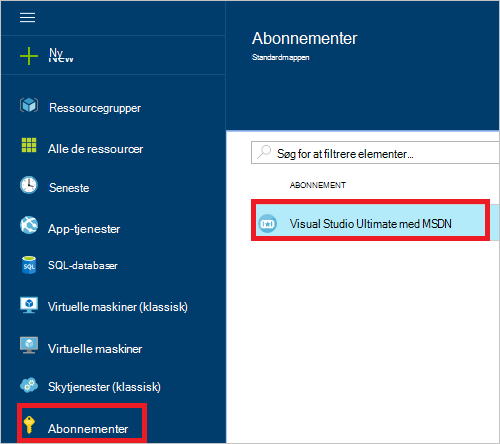
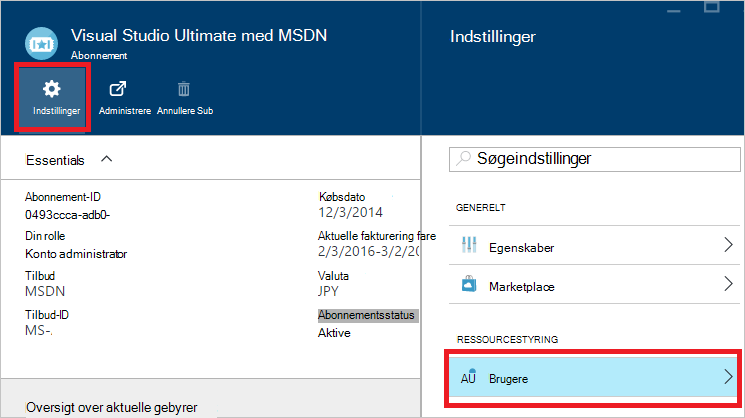
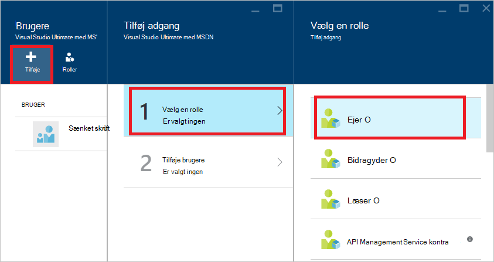
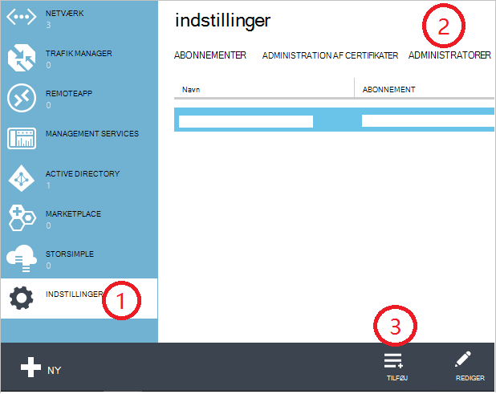
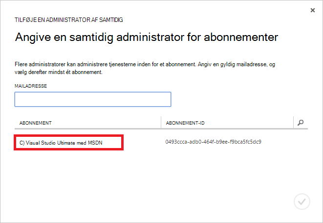
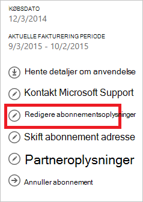
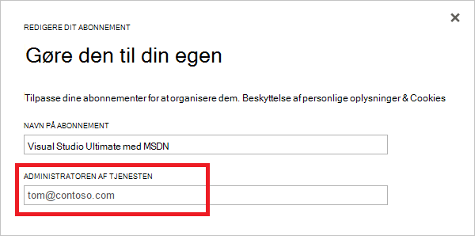

<properties
    pageTitle="Sådan tilføjer eller ændrer Azure administratorroller | Microsoft Azure"
    description="Beskriver, hvordan du tilføjer eller ændrer Azure samtidig Administrator, tjenesteadministratoren og kontoadministratoren"
    services=""
    documentationCenter=""
    authors="genlin"
    manager="mbaldwin"
    editor=""
    tags="billing"/>

<tags
    ms.service="billing"
    ms.workload="na"
    ms.tgt_pltfrm="na"
    ms.devlang="na"
    ms.topic="article"
    ms.date="08/17/2016"
    ms.author="genli"/>

# Sådan tilføjer eller ændrer Azure administratorroller

Der findes tre typer administratorroller i Microsoft Azure:

| Administrativ rolle   | Grænse  | Beskrivelse
| ------------- | ------------- |---------------|
|Kontoadministrator (å)  | 1 hver Azure-konto  |Dette er den person, der har tilmeldt dig eller købte Azure abonnementer og har tilladelse til at få adgang til [Kontoen Center](https://account.windowsazure.com/Home/Index) og udføre forskellige administrationsopgaver. Dette omfatter at kunne oprette abonnementer, annullere abonnementer, ændre fakturering for et abonnement og ændre tjenesteadministratoren.
| Tjenesten systemadministratorens | 1 hver Azure-abonnement  |Denne rolle har tilladelse til at administrere tjenester på [Azure-portalen](https://portal.azure.com). Administratoren konto er også tjenesteadministratoren som standard i et nyt abonnement.|
|Samtidig administrator (CA) i [Azure klassisk portal](https://manage.windowsazure.com)|200 per abonnement| Denne rolle har de samme tilladelser som tjenesteadministratoren, men kan ikke ændre tilknytningen af abonnementer til Azure mapper. |

> [AZURE.NOTE] Azure Active Directory rollebaseret Access kontrolelementet (RBAC) kan føjes til flere roller-brugere. Du kan finde yderligere oplysninger finder [Azure Active Directory rollebaseret adgangskontrol](./active-directory/role-based-access-control-configure.md).

> [AZURE.NOTE] Hvis du har brug for mere hjælp på en hvilken som helst sted i denne artikel, skal du [kontakte support](https://portal.azure.com/?#blade/Microsoft_Azure_Support/HelpAndSupportBlade) for at få dit problem løses hurtigt.

## Sådan føjer du en administrator for et abonnement

**Azure-portalen**

1. Log på [Azure-portalen](https://portal.azure.com).

2. Vælg menuen Hub **abonnement** > *det abonnement, du vil administrator for at få adgang til*.

    

3. Vælg **Indstillinger**i bladet abonnement> **brugere**.

    
4. Vælg **Tilføj**i bladet brugere>**Vælg en rolle** > **ejer**.

    

    **Bemærk!**
    - Rollen ejeren har samme adgangsrettigheder som samtidig administrator. Denne rolle har ikke adgang rettigheder til [Azure konto Center](https://account.windowsazure.com/subscriptions).
    - Du har tilføjet via [Azure portal](https://portal.azure.com) ejerne kan ikke administrere tjenester i [Azure klassisk portal](https://manage.windowsazure.com).  

5. Skriv mailadressen på den bruger, du vil tilføje som ejer, klik på brugeren, og klik derefter på **Vælg**.

    

**Azure klassisk portal**

1. Log på [Azure klassisk portal](https://manage.windowsazure.com/).

2. Vælg **Indstillinger**i navigationsruden,> **Administratorer**> **Tilføj**.  

    

3. Skriv mailadressen på den person, du vil tilføje som samtidig administrator og derefter vælge det abonnement, du vil samtidig administratoren for at få adgang til. 

     

Den følgende mailadresse kan tilføjes som en samtidig Administrator:

* **Microsoft-konto** (tidligere Windows Live ID)  
 Du kan bruge en Microsoft-Account til at logge på alle consumer – et overblik over Microsoft-produkter og tjenester, som Outlook (Hotmail), Skype (MSN), OneDrive, Windows Phone og Xbox LIVE i skyen.
* **Organisationskonto** 
 En organisationskonto er en konto, der oprettes under Azure Active Directory. Organisationskonto adressen ligner følgende: user@ &lt;domænet&gt;. onmicrosoft.com

### Begrænsninger og begrænsninger

 * Hvert abonnement er knyttet til en Azure AD-mappe (også kendt som standard mappen). Gå til [Azure klassisk portal](https://manage.windowsazure.com/)for at finde den standard-mappe, der er knyttet til abonnementet, skal du vælge **Indstillinger for** > **abonnementer**. Markere abonnement-ID for at finde mappen standard.

 * Hvis du er logget på med en Microsoft-Account, kan du kun tilføje andre Microsoft-Accounts eller brugere i mappen standard som samtidig Administrator.

 * Hvis du er logget på med en organisationskonto, kan du tilføje andre organisationskonti i organisationen, som samtidig Administrator. For eksempel abby@contoso.com kan tilføje bob@contoso.com som tjenesteadministratoren eller samtidig Administrator, men kan ikke tilføje john@notcontoso.com medmindre john@noncontoso.com er brugeren i Default Directory. Brugere, der er logget på med organisationskonti kan fortsætte med at føje brugere til Microsoft-Account som tjenesteadministratoren eller samtidig Administrator.

 * Nu, hvor det er muligt at logge på Azure med en organisationskonto, er her ændringer til administratoren af tjenesten og samtidig administrator-konto:

    Login metode| Tilføje Microsoft-Account eller brugere i Default Directory som Nøglecenter eller Systemadministratorens?  |Tilføje organisationskonto i samme organisation som CA eller Systemadministratorens? |Tilføje organisationskonto i anden organisation som CA eller Systemadministratorens?
    ------------- | ------------- |---------------|---------------
    Microsoft-konto |Ja|Nej|Nej
    Organisationskonto|Ja|Ja|Nej

## Sådan ændres tjenesteadministratoren for et abonnement

Kun kontoadministrator kan ændre tjenesteadministratoren til et abonnement.

1. Log på [Azure konto Center](https://account.windowsazure.com/subscriptions) ved hjælp af administratoren konto.

2. Vælg det abonnement, du vil ændre.

3. Klik på **Rediger abonnement** detaljer i højre side.  

    

4. Angiv mailadressen for nye tjenesteadministratoren i feltet **TJENESTEADMINISTRATOREN** .  

    

## Hvordan du kan ændre den konto Administrator

Overføre ejerskabet af Azure-konto til en anden konto, skal du se [Overføre ejerskabet af et Azure-abonnement](billing-subscription-transfer.md).

## Næste trin

* For at få mere for at vide om, hvordan ressource access styres i Microsoft Azure, se [forstå ressource access i Azure](./active-directory/active-directory-understanding-resource-access.md)

* Yderligere oplysninger om hvordan Azure Active Directory, der er relateret til abonnementet Azure, se, [hvordan Azure abonnementer er knyttet til Azure Active Directory](./active-directory/active-directory-how-subscriptions-associated-directory.md)

* Finde flere oplysninger om hvordan Azure Active Directory, der er relateret til abonnementet Azure, under [tildele administratorroller i Azure Active Directory](./active-directory/active-directory-assign-admin-roles.md)

> [AZURE.NOTE] Hvis du stadig har yderligere spørgsmål, skal du [kontakte support](https://portal.azure.com/?#blade/Microsoft_Azure_Support/HelpAndSupportBlade) for at få dit problem løses hurtigt.
