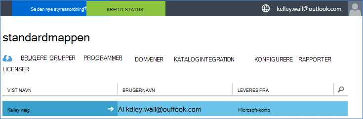
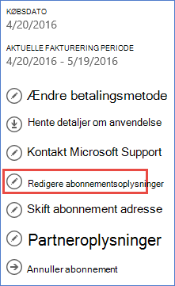
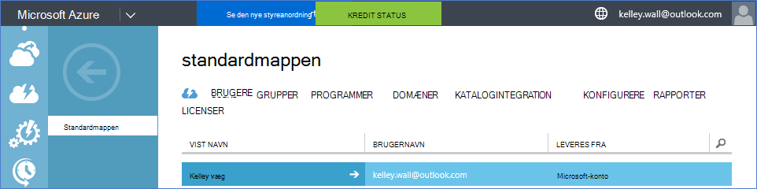

<properties
    pageTitle="Bruge en Office 365-lejer med et Azure abonnement | Microsoft Azure"
    description="Lær at tilføje en Office 365-mappe (lejer) til en Azure-abonnement for at gøre tilknytningen."
    services=""
    documentationCenter=""
    authors="JiangChen79"
    manager="mbaldwin"
    editor=""
    tags="billing,top-support-issue"/>

<tags
    ms.service="billing"
    ms.workload="na"
    ms.tgt_pltfrm="ibiza"
    ms.devlang="na"
    ms.topic="article"
    ms.date="09/16/2016"
    ms.author="cjiang"/>

# Knytte en Office 365-lejer til en Azure-abonnement
Hvis du har anskaffet både Azure og Office 365-abonnementer separat tidligere, og nu vil ikke have adgang til Office 365-lejer fra Azure abonnementet, er det nemt at gøre dette. I denne artikel beskrives, hvordan.

> [AZURE.NOTE] I denne artikel gælder ikke for Enterprise-aftale (EA) kunder.

## Hurtig vejledning
Brug din Azure-konto til at tilføje din Office 365-lejer for at knytte din Office 365-lejer til abonnementet Azure, og derefter knytter dit Azure abonnement til Office 365-lejer.

## Detaljeret vejledning
I dette scenarie skal Kelley Wall er en bruger, der har et Azure-abonnement under kontoen kelley.wall@outlook.com. Kelley også har en Office 365-abonnement under kontoen kelley.wall@contoso.onmicrosoft.com. Nu ønsker Kelley at få adgang til Office 365-lejer til Azure abonnementet.

### Forudsætninger
De følgende forudsætninger er nødvendige for tilknytningen kan fungere korrekt:

- Du skal have legitimationsoplysninger af tjenesteadministratoren af Azure-abonnement. Flere administratorer kan ikke udføre et undersæt af trinnene.
- Du skal have legitimationsoplysninger for en global administrator af Office 365-lejer.
- E-mail-adressen på tjenesteadministratoren skal ikke indeholdt i Office 365-lejer.
- E-mail-adressen på tjenesteadministratoren skal ikke svare til en hvilken som helst global administrator for Office 365-lejer.
- Hvis du aktuelt bruger en e-mailadresse, der er både en Microsoft-konto og en organisationskonto, midlertidigt ændre tjenesteadministratoren af abonnementet Azure for at bruge en anden Microsoft-konto. Du kan oprette en ny Microsoft-konto på [siden for tilmelding af Microsoft-konto](https://signup.live.com/).

Hvis du vil ændre tjenesteadministratoren, skal du følge disse trin:

1. Log på [Kontoadministration portal](https://account.windowsazure.com/subscriptions).
2. Vælg det abonnement, du vil ændre.
3. Klik på **Rediger abonnementsoplysninger**.

    

4. Skriv mailadressen på den nye tjenesteadministratoren i **TJENESTEADMINISTRATOREN** .

    

### Knytte Office 365-lejer til Azure-abonnement
Hvis du vil knytte Office 365-lejer til Azure-abonnement, skal du følge disse trin:

1.  Log på [Kontoadministration portal](https://account.windowsazure.com/subscriptions) med administratorrettigheder tjeneste.
2.  Vælg **ACTIVE DIRECTORY**i venstre rude.

    

    > [AZURE.NOTE] Du bør ikke se Office 365-lejer. Hvis du kan se den, kan du springe næste trin.

    

3. Tilføj Office 365-lejer til dit Azure-abonnement.

    en. Vælg **Ny** > **DIRECTORY** > **brugerdefinerede Opret**.

    

    b. Vælg **Brug eksisterende mappe**på siden **Tilføj directory** under **DIRECTORY**. Vælg **jeg er klar til at være logget af nu**, og vælg derefter **udført** .

    

    c. Når du har logget af, kan du logge på med den globale administrator legitimationsoplysninger for din Office 365-lejer.

    

    d. Vælg **Fortsæt**.

    

    e. Vælg **Log af nu**.

    

    f. Log på [Kontoadministration portal](https://account.windowsazure.com/subscriptions) med administratorrettigheder tjeneste.

    

    g. Du bør se din Office 365-lejer i dashboardet.

    

4. Ændre den mappe, der er knyttet til Azure abonnementet.

    en. Vælg **Indstillinger**.

    

    b. Vælg abonnementet Azure, og vælg derefter **Rediger DIRECTORY**.
    

    c. Klik på **Næste** .

    

    > [AZURE.WARNING] Du får en advarsel, fjernes alle medadministratorer.

    

    >[AZURE.WARNING] Derudover kan alle [Rollebaseret adgangskontrol (RBAC)](./active-directory/role-based-access-control-configure.md) brugere med tildelt adgang i ressourcegrupperne eksisterende også fjernes. Den advarsel, modtager du omtaler dog kun fjernelse af medadministratorer.

    

    d. Vælg **udført** .

5. Nu kan du tilføje din Office 365 organisationskonti som medadministratorer til Azure Active Directory-lejer.

    en. Vælg fanen **ADMINISTRATORER** , og vælg derefter **Tilføj**.

    

    b. Angiv en organisationskonto i din Office 365-lejer, Vælg det Azure abonnement, og vælg derefter **udført** .

    

    c. Gå tilbage til fanen **ADMINISTRATORER** . Du bør se organisationskonto vises som samtidig administrator.

    

6. Du kan derefter teste adgang med samtidig-administratoren.

    en. Log af portalen kontoadministration.

    b. Åbn [Kontoadministration portal](https://account.windowsazure.com/subscriptions) eller [Azure-portalen](https://portal.azure.com/).

    c. Hvis Azure-logon-siden har et link på **Log på med din organisation**, skal du vælge linket. Ellers skal du springe dette trin.

    

    d. Angive legitimationsoplysninger for samtidig administratoren, og vælg derefter **Log på**.

    

## Næste trin
Relaterede scenarier omfatter:

- Du allerede har et Office 365-abonnement og er klar til et Azure-abonnement, men du vil bruge de eksisterende Office 365-brugerkonti for abonnementet Azure.
- Du er en Azure abonnement og vil have en Office 365-abonnement for brugerne i din eksisterende Azure Active Directory-forekomst.

Hvis du vil lære at udføre disse opgaver, skal du se [Brug af dit eksisterende Office 365-konto med abonnementet Azure eller omvendt](billing-use-existing-office-365-account-azure-subscription.md).
