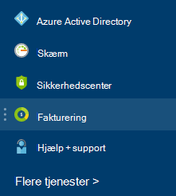
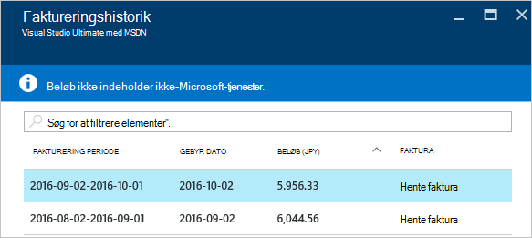

<properties
    pageTitle="Sådan hentes din fakturering faktura og daglige Brugsdata Azure | Microsoft Azure"
    description="Beskriver, hvordan du hente din Azure fakturering faktura og data om brug af daglige"
    services=""
    documentationCenter=""
    authors="genlin"
    manager="mbaldwin"
    editor=""
    tags="billing"
    />

<tags
    ms.service="billing"
    ms.workload="na"
    ms.tgt_pltfrm="na"
    ms.devlang="na"
    ms.topic="article"
    ms.date="10/10/2016"
    ms.author="genli"/>

# Sådan hentes din fakturering faktura og daglige Brugsdata Azure

> [AZURE.NOTE] Hvis du har brug for mere hjælp på en hvilken som helst sted i denne artikel, skal du [kontakte support](https://portal.azure.com/?#blade/Microsoft_Azure_Support/HelpAndSupportBlade) for at få dit problem løses hurtigt.

Du kan få vist fakturering fakturaen og det daglige Brugsdata [Azure portal](https://portal.azure.com) eller [Azure konto Center](https://account.windowsazure.com/subscriptions)som administrator Azure-konto. Her er, hvordan:

## Azure-portalen

1. Log på [Azure-portalen](https://portal.azure.com) som kontoadministrator.

    >[AZURE.NOTE] Kun kontoadministratoren har tilladelse til at få adgang til fakturering dataene. Du kan finde flere oplysninger om, hvordan du finder ud af, hvem der er kontoadministratoren af abonnementet, kan du se [ofte stillede spørgsmål](billing-subscription-transfer.md#faq).

2. I menuen Hub skal du vælge **Fakturering**. Du kan finde nogle nyttige oplysninger som dato for næste Fakturering på bladet **Fakturering** .

    
3. Markere det abonnement, du vil have vist i sektionen **abonnement omkostninger** .

    
4. Klik på **Fakturering og forbrug**.

    

5. Klik på bladet **Faktureringshistorik** **Hente fakturaen** for at få vist en kopi af din faktura. Klik på en faktureringsperiode for at få vist den daglige Brugsdata.

    

## Azure-konto Center

1. Log på [Azure konto Center](https://account.windowsazure.com/subscriptions) som-kontoadministratoren.
2. Vælg det abonnement, som du vil have vist fakturaen for og brugen oplysningerne.
3. Vælg **FAKTURERINGSHISTORIK**.  
4. Du kan se din sætninger for de sidste seks faktureringsperiode og den aktuelle faktureret periode.   
5. Vælg **Vis aktuelle erklæring** til at se en estimering af gebyrer på tid estimatet blev oprettet. Disse oplysninger er kun opdateres dagligt og kan ikke indeholde alle brugen. Din månedlige faktura kan variere fra dette estimat.   
6. Vælg **Download faktura** til at få vist en kopi af din sidste faktura.  
7. Vælg **Download brugen** hente daglige brugerdataene som en CSV-fil. 

> [AZURE.NOTE] Hvis du stadig har yderligere spørgsmål, skal du [kontakte support](https://portal.azure.com/?#blade/Microsoft_Azure_Support/HelpAndSupportBlade) for at få dit problem løses hurtigt.
