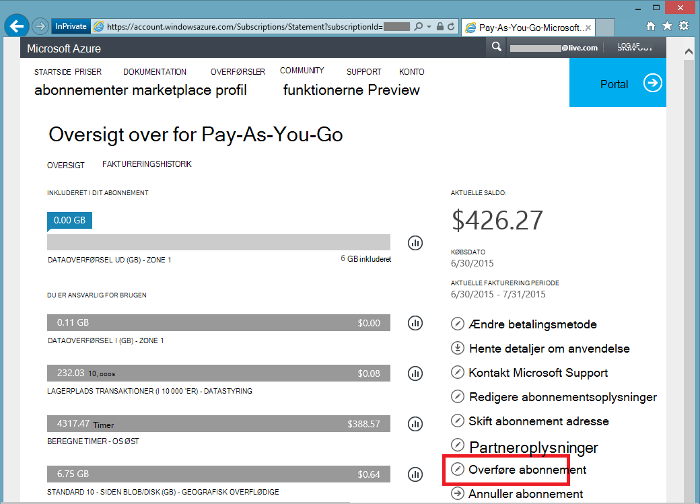

<properties
   pageTitle="Overførsel af ejerskabet af et Azure-abonnement | Microsoft Azure"
   description="Sådan overføres et Azure-abonnement til en anden bruger, og nogle ofte stillede spørgsmål (FAQ) om processen"
   services=""
   documentationCenter=""
   authors="genlin"
   manager="stevenpo"
   editor=""
   tags="billing,top-support-issue"/>

<tags
   ms.service="billing"
   ms.workload="na"
   ms.tgt_pltfrm="na"
   ms.devlang="na"
   ms.topic="article"
   ms.date="10/10/2016"
   ms.author="genli"/>

# Overførsel af ejerskabet af et Azure-abonnement

Gør du:

- Brug for at dele dem over fakturering ejerskabet af dit Azure abonnement til en anden?
- Vil du ændre den konto, der bruges til at tilmelde sig Azure? Måske bruges din Microsoft-Account men beregnet til at bruge din arbejds- eller skolekonto i stedet?
- Vil du flytte abonnementet Azure fra en mappe til en anden?
- Har Azure og Office 365 i forskellige lejere og vil konsolidere?

Du kan nu gøre dette nemt i det Microsoft Azure-konto Center - for Pay-As-You-Go, MSDN, Action Pack eller BizSpark abonnementer.  Vi har tilføjet muligheden for at overføre dit abonnement til en anden bruger. Det vil sige, kan du ændre konto administratoren på en hvilken som helst Pay-As-You-Go, MSDN, Action Pack eller BizSpark abonnement, du ejer, uanset hvilken land, du arbejder i nu. Vi understøtter nu overførsel af Azure Marketplace køb for disse abonnement filtyper.

> [AZURE.NOTE] For at ændre dit abonnement til et andet tilbud, skal du se [skifte abonnementet Azure til et andet tilbud](billing-how-to-switch-azure-offer.md) kan finde flere oplysninger. Hvis du har brug for mere hjælp på en hvilken som helst sted i denne artikel, skal du [kontakte support](https://portal.azure.com/?#blade/Microsoft_Azure_Support/HelpAndSupportBlade) for at få dit problem løses hurtigt.

## Sådan overføres ejerskabet af et Azure-abonnement

> [AZURE.VIDEO transfer-an-azure-subscription]

1.  Log på <https://account.windowsazure.com/Subscriptions>. Du skal være kontoadministrator for til at udføre en overdragelse af ejerskab. Du kan finde flere oplysninger om, hvordan du finder ud af, hvem der er kontoadministratoren af abonnementet, kan du se [ofte stillede spørgsmål](#faq).

2.  Vælg abonnementet til at overføre.

3.  Klik på indstillingen **Overfør abonnement** .

    

4.  Følg vejledningen for at angive modtageren.

    

5.  Modtageren, automatisk tilsendt en mail med en accept link.

    

6.  Modtageren klikker på linket og følger vejledningen, herunder hvordan du angiver deres betalingsoplysninger.

    

    

7. Succes! Abonnementet er nu overføres.

## Ofte stillede spørgsmål (FAQ)

-   **Hvordan kan jeg vide, hvem der kontoadministratoren af abonnementet?**

    Du kan bekræfte, hvem der er kontoadministratoren af abonnementet på følgende måde:

    1. Log på [Azure-portalen](https://portal.azure.com).
    2. I menuen Hub skal du markere **abonnement**.
    3. Vælg det abonnement, du vil kontrollere, og vælg derefter **Indstillinger**.
    4. Vælg **Egenskaber**. Kontoadministratoren af abonnementet vises i feltet **Konto administrator** .  

-   **Resulterer abonnement overførsel i en hvilken som helst nedetid?**

    Der er ingen betydning for tjenesten. Dette effektivt annullerer abonnementet under den aktuelle konto Administrator og opretter en ny under modtagerens konto, men knytter de underliggende Azure tjenester til det nye abonnement. Abonnement-ID forbliver uændret.

-   **Hvordan bruger jeg denne funktion til en anden mappe til abonnement?**-   
    Et Azure-abonnement er oprettet i den mappe, som administratoren konto tilhører. Så, for at ændre mappen, lige overføre abonnementet til en brugerkonto i destinationsmappen. Når brugeren er fuldført disse trin for at acceptere filoverførsel, abonnementet flyttes automatisk til destinationsmappen.

-   **Hvis jeg overtage fakturering ejerskabet af et abonnement fra en anden organisation, vil de fortsat have adgang til mine ressourcer?**

    Hvis abonnementet er overført til en anden leje, vil de brugere, der er knyttet til den forrige lejer miste adgang til abonnementet. Selvom en bruger ikke er en Tjenesteadministrator eller Co-administrator længere, kan de stadig har adgang til dit abonnement gennem anden sikkerhed metode. Dette omfatter:
    - Administration af certifikater, som giver brugeren administratorrettigheder til abonnementsressourcer. Få mere at vide under [oprette og overføre et Management certifikat til Azure](https://msdn.microsoft.com/library/azure/gg551722.aspx)
    -   Access-taster for tjenester som lagerplads. Få mere at vide under [få vist, Kopiér, og Regenerer lagerplads access-taster](storage-create-storage-account.md#view-copy-and-regenerate-storage-access-keys)
    -   Remote Access-legitimationsoplysninger for tjenester som virtuelle Azure-computere

    Dette er ikke en komplet liste. Modtageren overveje at opdatere en hvilken som helst hemmeligheder, der er knyttet til tjenesten, hvis de har brug at begrænse adgang til deres ressourcer. De fleste ressourcer kan blive opdateret på følgende måde:

    1.   Gå til portalen Azure: [ *https://portal.azure.com*](https://portal.azure.com)

    2.    Klik på Gennemse alt -&gt; alle de ressourcer

    3.    Vælg ressourcen. Dette åbner bladet ressource.

    4.    Klik på **Indstillinger**i bladet ressource. Her kan du få vist og opdatere eksisterende hemmeligheder.

-   **Hvis jeg overfører abonnementet midt på faktureringscyklussen, den modtagende løn for hele faktureringen så cyklusdiagram?**

    Afsenderen er ansvarlig for betaling for en hvilken som helst brugen, der blev rapporteret op til det sted, at overførslen er fuldført. Modtageren er ansvarlig for brugen rapporteret fra tidspunktet for overførslen og derefter. Der kan være nogle brugen, der er foretaget inden de overføres, men blev rapporteret bagefter. Dette medtages i modtagerens faktura.

-   **Har modtageren adgang til brugen og faktureringshistorik?**

    På nuværende tidspunkt er de eneste oplysninger afsløret for modtageren mængden af den sidste faktura (eller den aktuelle saldo, hvis abonnementet blev overført, før den første faktura blev oprettet). Resten af forbrug og faktureringshistorik overfører ikke til abonnementet.

-   **Kan tilbuddet ændres under en overførsel?**

    Tilbuddet skal være den samme. Hvis du vil ændre dit tilbud, skal du [kontakte Support](http://go.microsoft.com/fwlink/?LinkID=619338).

-   **Kan jeg overføre et abonnement til en brugerkonto i et andet land?**

    Nej, på nuværende tidspunkt dette ikke understøttes. Modtagerens brugerkonto skal være i samme land.

-   **Modtageren kan bruge en anden betaling ordning?**

    Ja. Der er begrænsninger her: nu abonnementet faktureringshistorik er opdelt på tværs af to konti. Men fordelen er, kan du gøre dette uden at de skal [kontakte Support](http://go.microsoft.com/fwlink/?LinkID=619338).

-   **Der den pågældende betalingsmetode påvirkes, når jeg har overført et Azure-abonnement?**

    For at acceptere et abonnement filoverførsel, leveres et kreditkort eller en lignende betalingsmetode til at betale for abonnementet. Eksempelvis hvis Bob overfører et abonnement til Jane og Jane accepterer overførslen, skal Jane giver også en betalingsmetode, hun vil bruge til at betale for abonnementet. Når overførslen er fuldført, blive Bob ikke længere faktureret for abonnementet han overført til Jane.

## Næste trin, når du har accepteret ejerskabet af et abonnement

1. Du er nu konto Administrator. Gennemse og opdatere tjenesteadministratoren og Medadministratorer. Administrere administratorer i [Azure klassisk portal](https://manage.windowsazure.com) ved at gå til indstillinger. [Få mere at vide](http://go.microsoft.com/fwlink/?LinkID=533293).
2. Du kan også bruge rollebaseret adgangskontrol (RBAC) for dit abonnement og -tjenester. Besøg i [Azure portal](https://portal.azure.com) [Lær mere om RBAC](http://go.microsoft.com/fwlink/?LinkID=544802)
3. Opdatere legitimationsoplysninger, der er knyttet til dette abonnement tjenester. Dette omfatter:
    - Administration af certifikater, som giver brugeren administratorrettigheder til abonnementsressourcer. Se [oprette og overføre en administration af certifikat til Azure](https://msdn.microsoft.com/library/azure/gg551722.aspx) kan finde flere oplysninger
    -   Access-taster for tjenester som lagerplads. Få mere at vide under [få vist, Kopiér, og Regenerer lagerplads access-taster](storage-create-storage-account.md#view-copy-and-regenerate-storage-access-keys)
    -   Remote Access-legitimationsoplysninger for tjenester som virtuelle Azure-computere
4. Opdatere fakturering beskeder for dette abonnement på i [Azure konto Center](https://account.windowsazure.com/Subscriptions)  [Få mere at vide](http://go.microsoft.com/fwlink/?LinkID=533292)
5.  Hvis du arbejder med en partner, kan du overveje at opdatere partner-ID på dette abonnement. Du kan gøre dette i [Azure konto Center](https://account.windowsazure.com/Subscriptions).

> [AZURE.NOTE] Hvis du stadig har yderligere spørgsmål, skal du [kontakte support](https://portal.azure.com/?#blade/Microsoft_Azure_Support/HelpAndSupportBlade) for at få dit problem løses hurtigt.
