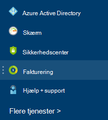

<properties
    pageTitle="Forstå din Azure eksterne gebyrer | Microsoft Azure"
    description="Få mere at vide om fakturering af eksterne services, tidligere kendt som Marketplace, gebyrer i Azure."
    services=""
    documentationCenter=""
    authors="adpick"
    manager="felixwu"
    editor=""
    tags="billing"
    />

<tags
    ms.service="billing"
    ms.workload="na"
    ms.tgt_pltfrm="na"
    ms.devlang="na"
    ms.topic="article"
    ms.date="10/12/2016"
    ms.author="adpick"/>

# Forstå din Azure eksterne gebyrer

Denne artikel forklares fakturering af eksterne tjenester i Azure. Eksterne services bruges til at blive kaldt Marketplace ordrer. Eksterne tjenester der leveres af uafhængige leverandører, men er integreret helt i Azure økosystemet. Lær, hvordan du:

- Identificere eksterne tjenester
- Forstå, hvordan faktureringen adskiller sig fra andre Azure ressourcer
- Få vist og registrere de omkostninger, du periodiseres brug af eksterne tjenester
- Administrere ekstern tjeneste ordrer, og hvordan du betaler for dem

## Hvad er Azure eksterne tjenester?

Eksterne services bruges til at blive kaldt Azure Marketplace. Generelt er de tjenester, der publiceres af tredjeparter tilgængelig til Azure. ClearDB og SendGrid er eksterne tjenester, du kan købe i Azure, men der ikke er udgivet af Microsoft.

### Identificere eksterne tjenester

Når du klargør en ny ekstern tjeneste eller ressource, der vises en advarsel:

>[AZURE.NOTE] Eksterne services er udgivet af firmaer, der ikke er Microsoft, men nogle gange Microsoft-produkter også er kategoriseret som eksterne tjenester.

### Eksterne services er faktureret separat

Eksterne services behandles som enkelte ordrer i abonnementet Azure. Faktureringsperiode for hver tjeneste er angivet, når du køber tjenesten. Må ikke forveksles med faktureringsperiode abonnementets under hvilke du købte den. Du modtager også separat fakturaer og dit kreditkort debiteres separat.

### Hver ekstern tjeneste har en anden fakturering model

Nogle af tjenesterne er faktureret i en overkommelige måde, mens andre bruger en månedlig baseret betaling model. Du skal bruge et kreditkort til Azure eksterne tjenester, du kan ikke købe eksterne tjenester med faktura løn.

### Du kan ikke bruge månedlige gratis kredit for eksterne tjenester

Hvis du bruger et Azure abonnement, som omfatter [gratis kredit](https://azure.microsoft.com/pricing/spending-limits/), kan de ikke anvendes til ekstern tjeneste fakturaer. Bruge et kreditkort til at købe eksterne tjenester.

## Få vist eksterne service bruger og historik

Du kan få vist en liste over de eksterne tjenester, der er på hvert abonnement i [Azure-portalen](https://portal.azure.com/): 

1. Log på [Azure portalen](https://portal.azure.com/) og [Gå til bladet **Fakturering** ](https://portal.azure.com/?flight=1#blade/Microsoft_Azure_Billing/BillingBlade).

     
  
2. Markere det abonnement, du vil have vist i sektionen **abonnement omkostninger** . 
   
    

3. Klik på **eksterne tjenester**.

    

4. Du bør se hver af dine eksterne serviceaftaler, publisher navn, du har købt webtjenesten, navn, du angav ressourcen, og den aktuelle rækkefølge status. Vælg en ekstern tjeneste til at se tidligere fakturaer.

    

5. Her kan du se tidligere faktura beløb inklusive moms fordelingen.

    

## Administrere betalingsmetoder for ekstern tjeneste ordrer

Opdater dine betalingsmetoder for ekstern tjeneste ordrer fra [Konto Center](https://account.windowsazure.com/).

> [AZURE.NOTE] Hvis du har købt dit abonnement med en konto til arbejde eller skole skal du [kontakte support](https://portal.azure.com/?#blade/Microsoft_Azure_Support/HelpAndSupportBlade) for at foretage ændringer i din betalingsmetode.

1. Log på den [Konto Center](https://account.windowsazure.com/) , og [Gå til fanen **marketplace** ](https://account.windowsazure.com/Store)

    

2. Vælg den eksterne tjeneste, du vil administrere

    

3. Klik på **Skift betalingsmetode** i højre side af siden. Dette link giver dig til en anden portalen for at administrere din betalingsmetode.
    
    

4. Klik på **Rediger profil** , og følg vejledningen for at opdatere dine betalingsoplysninger.

    
    
## Annullere en ekstern tjeneste rækkefølge

Hvis du vil annullere ordren ekstern tjeneste, skal du slette ressourcen i [Azure-portalen](https://portal.azure.com).

## Brug for hjælp? Kontakte support.

Hvis du stadig har yderligere spørgsmål, skal du [kontakte support](https://portal.azure.com/?#blade/Microsoft_Azure_Support/HelpAndSupportBlade) for at få dit problem løses hurtigt.
