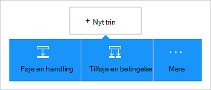

<properties
    pageTitle="Tilføje Azure blob-lager forbindelse i dine logik Apps | Microsoft Azure"
    description="Oversigt over Azure blob-lager forbindelse med REST-API parametre"
    services=""
    documentationCenter="" 
    authors="MandiOhlinger"
    manager="anneta"
    editor=""
    tags="connectors"/>

<tags
   ms.service="logic-apps"
   ms.devlang="na"
   ms.topic="article"
   ms.tgt_pltfrm="na"
   ms.workload="integration" 
   ms.date="10/18/2016"
   ms.author="mandia"/>

# Introduktion til Azure blob storage forbindelsen
Azure Blob-lager er en tjeneste til lagring af store mængder ustrukturerede data. Udføre forskellige handlinger som upload, opdatere, få og slette BLOB i Azure blob-lager. 

Med Azure blob-lager, du:

- Oprette arbejdsprocessen ved at overføre nye projekter eller hente filer, der senest er blevet opdateret.
- Bruge handlinger til at hente filen metadata, skal du slette en fil, kopiere filer og meget mere. For eksempel, når et værktøj er opdateret i et Azure-websted (en udløser), derefter opdatere en fil i blob-lager (en handling). 

Dette emne beskrives, hvordan du bruger blob storage forbindelsen i en logik app, og også viser en liste over handlingerne.

>[AZURE.NOTE] Denne version i denne artikel gælder for logik Apps generelt tilgængelig (GA). 

Hvis du vil vide mere om logik Apps, skal du se [Hvad er logik apps](../app-service-logic/app-service-logic-what-are-logic-apps.md) og [oprette en logik app](../app-service-logic/app-service-logic-create-a-logic-app.md).

## Oprette forbindelse til Azure blob-lager

Før din logik app kan få adgang til alle tjenester, oprette du først en *forbindelse* til tjenesten. En forbindelse indeholder forbindelsen mellem en logik app og en anden tjeneste. For eksempel for at oprette forbindelse til en lagerplads konto, skal oprette du først en blob storage *forbindelse*. For at oprette en forbindelse, skal du angive de legitimationsoplysninger, som du normalt bruger til at få adgang til tjenesten, du opretter forbindelse til. Angiv så legitimationsoplysningerne med Azure lagerplads til kontoen lagerplads til at oprette forbindelsen. 

#### Oprette forbindelse

>[AZURE.INCLUDE [Create a connection to Azure blob storage](../../includes/connectors-create-api-azureblobstorage.md)]
 
## Bruge en udløser

Denne forbindelse har ikke en hvilken som helst udløsere. Bruge andre udløsere til at starte appen logik, som en gentagelse udløser, en HTTP Webhook udløser, udløsere, der er tilgængelige med andre forbindelser og meget mere. [Opret en logik app](../app-service-logic/app-service-logic-create-a-logic-app.md) viser et eksempel.

## Bruge en handling
    
En handling er en handling, der er foretaget af den arbejdsproces, der er defineret i en logik app.

1. Vælg plustegnet. Du kan se flere valgmuligheder: **Tilføj en handling**, **Tilføj en betingelse**eller en af **flere** indstillinger.

    

2. Vælg **Tilføj en handling**.

3. I tekstfeltet skal du skrive "blob" for at få en liste over alle de tilgængelige handlinger.

     

4. Vælg **AzureBlob - få filmetadata ved hjælp af stien**i vores eksempel. Hvis der findes allerede en forbindelse, skal du vælge **…** Knappen (Vis datovælger) for at vælge en fil.

    

    Hvis du bliver bedt om forbindelsesoplysningerne, skal du angive oplysninger til at oprette forbindelsen. [Oprette forbindelsen](connectors-create-api-azureblobstorage.md#create-the-connection) i dette emne beskrives disse egenskaber. 

    > [AZURE.NOTE] I dette eksempel skal få vi metadataene i en fil. For at se metadata, skal du tilføje endnu en handling, der opretter en ny fil ved hjælp af en anden connector. For eksempel tilføje en OneDrive-handling, der opretter en ny "test"-fil baseret på metadata. 

5. **Gemme** dine ændringer (øverste venstre hjørne af værktøjslinjen). Din logik app er gemt og kan aktiveres automatisk.

> [AZURE.TIP] [Storage Explorer](http://storageexplorer.com/) er et godt værktøj til at administrere flere lagerplads konti.

## Tekniske detaljer

## Lagerplads Blob handlinger

|Handling|Beskrivelse|
|--- | ---|
|[Få filens metadata](connectors-create-api-azureblobstorage.md#get-file-metadata)|Denne handling får filmetadata ved hjælp af fil-id.|
|[Opdatere fil](connectors-create-api-azureblobstorage.md#update-file)|Denne handling opdaterer en fil.|
|[Slette filer](connectors-create-api-azureblobstorage.md#delete-file)|Denne handling sletter en fil.|
|[Få filmetadata ved hjælp af sti](connectors-create-api-azureblobstorage.md#get-file-metadata-using-path)|Denne handling får filmetadata ved hjælp af stien.|
|[Få filindhold ved hjælp af sti](connectors-create-api-azureblobstorage.md#get-file-content-using-path)|Denne handling får filindholdet med sti.|
|[Få filindhold](connectors-create-api-azureblobstorage.md#get-file-content)|Denne handling får filindholdet med-id.|
|[Opret fil](connectors-create-api-azureblobstorage.md#create-file)|Denne handling overfører en fil.|
|[Kopiere fil](connectors-create-api-azureblobstorage.md#copy-file)|Denne handling kopierer en fil til Azure Blob-lager.|
|[Udtrække arkiv til mappe](connectors-create-api-azureblobstorage.md#extract-archive-to-folder)|Denne handling henter en arkivfilen til en anden mappe (eksempel: .zip).|

### Handlingsdetaljer

I dette afsnit, skal du se specifikke oplysninger om hver handling, herunder eventuelle nødvendig eller valgfri input egenskaber og noget tilsvarende output, der er knyttet til forbindelsen.

#### Få filens metadata
Denne handling får filmetadata ved hjælp af fil-id.  

|Egenskabsnavn| Vist navn|Beskrivelse|
| ---|---|---|
|id *|Fil|Vælg en fil|

En stjerne (*) betyder, at egenskaben er påkrævet.

##### Output detaljer
BlobMetadata

| Egenskabsnavn | Datatype |
|---|---|
|Id|streng|
|Navn|streng|
|Vist navn|streng|
|Sti|streng|
|LastModified|streng|
|Størrelse|heltal|
|Medietype|streng|
|IsFolder|Boolesk værdi|
|ETag|streng|
|FileLocator|streng|

#### Opdatere fil
Denne handling opdaterer en fil.  

|Egenskabsnavn| Vist navn|Beskrivelse|
| ---|---|---|
|id *|Fil|Vælg en fil|
|brødteksten *|Filens indhold|Indholdet af filen for at opdatere|

En stjerne (*) betyder, at egenskaben er påkrævet.

##### Output detaljer
BlobMetadata

| Egenskabsnavn | Datatype |
|---|---|
|Id|streng|
|Navn|streng|
|Vist navn|streng|
|Sti|streng|
|LastModified|streng|
|Størrelse|heltal|
|Medietype|streng|
|IsFolder|Boolesk værdi|
|ETag|streng|
|FileLocator|streng|

#### Slette filer
Denne handling sletter en fil.  

|Egenskabsnavn| Vist navn|Beskrivelse|
| ---|---|---|
|id *|Fil|Vælg en fil|

En stjerne (*) betyder, at egenskaben er påkrævet.

##### Output detaljer
Ingen.

#### Få filmetadata ved hjælp af sti
Denne handling får filmetadata ved hjælp af stien.  

|Egenskabsnavn| Vist navn|Beskrivelse|
| ---|---|---|
|stien *|Filstien|Vælg en fil|

En stjerne (*) betyder, at egenskaben er påkrævet.

##### Output detaljer
BlobMetadata

| Egenskabsnavn | Datatype |
|---|---|
|Id|streng|
|Navn|streng|
|Vist navn|streng|
|Sti|streng|
|LastModified|streng|
|Størrelse|heltal|
|Medietype|streng|
|IsFolder|Boolesk værdi|
|ETag|streng|
|FileLocator|streng|

#### Få filindhold ved hjælp af sti
Denne handling får filindholdet med sti.  

|Egenskabsnavn| Vist navn|Beskrivelse|
| ---|---|---|
|stien *|Filstien|Vælg en fil|

En stjerne (*) betyder, at egenskaben er påkrævet.

##### Output detaljer
Ingen.

#### Få filindhold
Denne handling får filindholdet med-id.  

|Egenskabsnavn| Datatype|Beskrivelse|
| ---|---|---|
|id *|streng|Vælg en fil|

En stjerne (*) betyder, at egenskaben er påkrævet.

##### Output detaljer
Ingen.

#### Opret fil
Denne handling overfører en fil.  

|Egenskabsnavn| Vist navn|Beskrivelse|
| ---|---|---|
|Mappesti *|Mappesti|Vælg en mappe|
|navn *|Filnavn|Navnet på fil|
|brødteksten *|Filens indhold|Indholdet af filen for at overføre|

En stjerne (*) betyder, at egenskaben er påkrævet.

##### Output detaljer
BlobMetadata

| Egenskabsnavn | Datatype | 
|---|---|
|Id|streng|
|Navn|streng|
|Vist navn|streng|
|Sti|streng|
|LastModified|streng|
|Størrelse|heltal|
|Medietype|streng|
|IsFolder|Boolesk værdi|
|ETag|streng|
|FileLocator|streng|

#### Kopiere fil
Denne handling kopierer en fil til Azure Blob-lager.  

|Egenskabsnavn| Vist navn|Beskrivelse|
| ---|---|---|
|kilde *|Kildens URL-adresse|Angiv URL-adresse til kildefil|
|destination *|Destination filsti|Angiv stien til destinationsfilen, herunder target filnavn|
|overskrive|Vil du overskrive?|Skal overskrives en eksisterende destinationsfil (sand/falsk)?  |

En stjerne (*) betyder, at egenskaben er påkrævet.

##### Output detaljer
BlobMetadata

| Egenskabsnavn | Datatype |
|---|---|
|Id|streng|
|Navn|streng|
|Vist navn|streng|
|Sti|streng|
|LastModified|streng|
|Størrelse|heltal|
|Medietype|streng|
|IsFolder|Boolesk værdi|
|ETag|streng|
|FileLocator|streng|

#### Udtrække arkiv til mappe
Denne handling henter en arkivfilen til en anden mappe (eksempel: .zip).  

|Egenskabsnavn| Vist navn|Beskrivelse|
| ---|---|---|
|kilde *|Kilde arkiv filsti|Vælg en arkivfilen|
|destination *|Stien destinationsmappen|Markere indholdet til at uddrage|
|overskrive|Vil du overskrive?|Skal overskrives en eksisterende destinationsfil (sand/falsk)?|

En stjerne (*) betyder, at egenskaben er påkrævet.

##### Output detaljer
BlobMetadata

| Egenskabsnavn | Datatype |
|---|---|
|Id|streng|
|Navn|streng|
|Vist navn|streng|
|Sti|streng|
|LastModified|streng|
|Størrelse|heltal|
|Medietype|streng|
|IsFolder|Boolesk værdi|
|ETag|streng|
|FileLocator|streng|

## HTTP-svar

Når du foretager opkald til de forskellige handlinger, kan du få bestemte svar. Den følgende tabel beskrives svarene, og beskrivelserne:  

|Navn|Beskrivelse|
|---|---|
|200|Ok|
|202|Accepteret|
|400|Forkert anmodning|
|401|Uautoriseret|
|403|Forbudt|
|404|Blev ikke fundet|
|500|Intern serverfejl. Der opstod en ukendt fejl|
|standard|Mislykkedes.|

## Næste trin

[Opret en logik app](../app-service-logic/app-service-logic-create-a-logic-app.md). Udforske andre tilgængelige forbindelserne i logik Apps i vores [API'er liste](apis-list.md).

