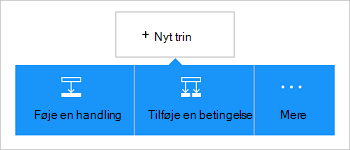

<properties
    pageTitle="Tilføje Office 365 Outlook connector i dine logik Apps | Microsoft Azure"
    description="Opret logik apps med Office 365-forbindelse til at aktivere interaktion med Office 365. For eksempel: oprette, redigere og opdatere kontakter og kalender."
    services=""    
    documentationCenter=""     
    authors="MandiOhlinger"    
    manager="anneta"    
    editor="" 
    tags="connectors" />

<tags
ms.service="logic-apps"
ms.devlang="na"
ms.topic="article"
ms.tgt_pltfrm="na"
ms.workload="integration"
ms.date="10/18/2016"
ms.author="mandia"/>

# Introduktion til Office 365 Outlook connector 

Office 365 Outlook connector kan interaktion med Outlook i Office 365. Brug denne forbindelse til at oprette, redigere, og Opdater kontakter og kalenderelementer, og også finde, sende og svare på mail.

Med Office 365 Outlook kan du:

- Opbygge din arbejdsprocessen ved hjælp af funktionerne mail og kalender i Office 365. 
- Bruge udløsere til at starte arbejdsprocessen, når der er en ny mail, når et kalenderelement opdateres og meget mere.
- Bruge handlinger til at sende en mail, skal du oprette en ny kalenderbegivenhed og meget mere. For eksempel, når der er et nyt objekt i Salesforce (en udløser), sende en mail til din Office 365 Outlook (en handling). 

Dette emne beskrives, hvordan du bruger Office 365 Outlook connector i en logik app og også viser de udløsere og handlinger.

>[AZURE.NOTE] Denne version i denne artikel gælder for logik Apps generelt tilgængelig (GA).

Hvis du vil vide mere om logik Apps, skal du se [Hvad er logik apps](../app-service-logic/app-service-logic-what-are-logic-apps.md) og [oprette en logik app](../app-service-logic/app-service-logic-create-a-logic-app.md).

## Oprette forbindelse til Office 365

Før din logik app kan få adgang til alle tjenester, oprette du først en *forbindelse* til tjenesten. En forbindelse indeholder forbindelsen mellem en logik app og en anden tjeneste. For eksempel for at oprette forbindelse til Office 365 Outlook, skal du først en Office 365- *forbindelse*. For at oprette en forbindelse, skal du angive de legitimationsoplysninger, som du normalt bruger til at få adgang til tjenesten, du vil oprette forbindelse til. Angiv så legitimationsoplysningerne til din Office 365-konto til at oprette forbindelse med Office 365 Outlook.

## Oprette forbindelse

>[AZURE.INCLUDE [Steps to create a connection to Office 365](../../includes/connectors-create-api-office365-outlook.md)]

## Bruge en udløser

En udløser er en begivenhed, der kan bruges til at starte arbejdsprocessen defineret i en logik app. Udløsere afstemning"" tjenesten i et interval og hyppighed, som du ønsker. [Få mere at vide om udløsere](../app-service-logic/app-service-logic-what-are-logic-apps.md#logic-app-concepts).

1. Skriv "office 365" for at få en liste over udløserne i app logik:  

    

2. Vælg **Office 365 Outlook - når du starter et kommende arrangement snart**. Hvis der findes allerede en forbindelse, skal du vælge en kalender fra på rullelisten.

    

    Hvis du bliver bedt om at logge på, skal du angive tegnet i detaljer for at oprette forbindelsen. [Oprette forbindelsen](connectors-create-api-office365-outlook.md#create-the-connection) i dette emne beskrives, hvordan. 

    > [AZURE.NOTE] I dette eksempel køres logik app, når en kalenderbegivenhed er opdateret. For at se resultatet af denne udløser skal du tilføje endnu en handling, der sender dig en SMS-besked. For eksempel føje handlingen Twilio *sende meddelelse* , der tekster dig besked, når kalenderbegivenheden startes på 15 minutter. 

3. Vælg knappen **Rediger** , og angiv **hyppighed** og **Interval** . Eksempelvis hvis du vil udløse til afstemning hver 15 minutter viser derefter Angiv **hyppighed** til **minut**og indstille **Interval** til **15**. 

    

4. **Gemme** dine ændringer (øverste venstre hjørne af værktøjslinjen). Din logik app er gemt og kan aktiveres automatisk.

## Bruge en handling

En handling er en handling, der er foretaget af den arbejdsproces, der er defineret i en logik app. [Lær mere om handlinger](../app-service-logic/app-service-logic-what-are-logic-apps.md#logic-app-concepts).

1. Vælg plustegnet. Du kan se flere valgmuligheder: **Tilføj en handling**, **Tilføj en betingelse**eller en af **flere** indstillinger.

    

2. Vælg **Tilføj en handling**.

3. I tekstfeltet skal du skrive "office 365" for at få en liste over alle de tilgængelige handlinger.

     

4. Vælg **Office 365 Outlook - Opret kontakt**i vores eksempel. Hvis der findes allerede en forbindelse, vælg derefter **Mappe-ID'ET**, **Fornavn**og andre egenskaber:  

    

    Hvis du bliver bedt om forbindelsesoplysningerne, skal du angive oplysninger til at oprette forbindelsen. [Oprette forbindelsen](connectors-create-api-office365-outlook.md#create-the-connection) i dette emne beskrives disse egenskaber. 

    > [AZURE.NOTE] I dette eksempel skal oprette vi en ny kontakt i Office 365 Outlook. Du kan bruge output fra en anden udløser til at oprette en kontakt. For eksempel tilføje SalesForce, *Når der oprettes et objekt* udløser. Tilføj derefter handlingen Office 365 Outlook *Opret kontaktperson* , der bruger SalesForce-felter til at oprette den nye ny kontaktperson i Office 365. 

5. **Gemme** dine ændringer (øverste venstre hjørne af værktøjslinjen). Din logik app er gemt og kan aktiveres automatisk.

## Tekniske detaljer

Her er nogle oplysninger om udløsere, handlinger og svar, der understøtter denne forbindelse:

## Office 365 udløsere

|Udløser | Beskrivelse|
|--- | ---|
|[Når et kommende arrangement startes snart](connectors-create-api-office365-outlook.md#when-an-upcoming-event-is-starting-soon)|Denne handling udløser et flow, når en kommende kalenderbegivenhed starter.|
|[Når der modtages en ny mail](connectors-create-api-office365-outlook.md#when-a-new-email-arrives)|Denne handling udløser et flow, når der modtages en ny mail|
|[Når der oprettes en ny begivenhed](connectors-create-api-office365-outlook.md#when-a-new-event-is-created)|Denne handling udløser et flow, når der oprettes en ny begivenhed i en kalender.|
|[Når en begivenhed er blevet ændret](connectors-create-api-office365-outlook.md#when-an-event-is-modified)|Denne handling aktiverer et flow, når en begivenhed er ændret i en kalender.|

## Office 365-handlinger

|Handling|Beskrivelse|
|--- | ---|
|[Få mails](connectors-create-api-office365-outlook.md#get-emails)|Denne handling henter mails fra en mappe.|
|[Sende en mail](connectors-create-api-office365-outlook.md#send-an-email)|Denne handling sender en e-mail-meddelelse.|
|[Slet mail](connectors-create-api-office365-outlook.md#delete-email)|Denne handling sletter en mail efter id.|
|[Markér som læst](connectors-create-api-office365-outlook.md#mark-as-read)|Denne handling markerer en mail som læst.|
|[Svare på mail](connectors-create-api-office365-outlook.md#reply-to-email)|Denne handling svar til en mail.|
|[Få vedhæftet fil](connectors-create-api-office365-outlook.md#get-attachment)|Denne handling får en vedhæftet fil i mail efter id.|
|[Sende mail med indstillinger](connectors-create-api-office365-outlook.md#send-email-with-options)|Denne handling sender en mail med flere indstillinger og venter på, at modtageren om at svare med en af indstillingerne.|
|[Send godkendelse mail](connectors-create-api-office365-outlook.md#send-approval-email)|Denne handling sender en mail til godkendelse og venter på svar fra modtageren.|
|[Få kalendere](connectors-create-api-office365-outlook.md#get-calendars)|Denne handling viser en liste over tilgængelige kalendere.|
|[Få begivenheder](connectors-create-api-office365-outlook.md#get-events)|Denne handling henter begivenheder fra en kalender.|
|[Oprette begivenhed](connectors-create-api-office365-outlook.md#create-event)|Denne handling opretter en ny begivenhed i en kalender.|
|[Få begivenhed](connectors-create-api-office365-outlook.md#get-event)|Denne handling henter en bestemt hændelse fra en kalender.|
|[Slette begivenheden](connectors-create-api-office365-outlook.md#delete-event)|Denne handling sletter en begivenhed i en kalender.|
|[Opdatere begivenhed](connectors-create-api-office365-outlook.md#update-event)|Denne handling opdaterer en begivenhed i en kalender.|
|[Få mapper med kontakter](connectors-create-api-office365-outlook.md#get-contact-folders)|Denne handling viser en liste over tilgængelige kontaktmapper.|
|[Hente kontakter](connectors-create-api-office365-outlook.md#get-contacts)|Denne handling henter kontakter fra en mappe med kontaktpersoner.|
|[Opret kontakt](connectors-create-api-office365-outlook.md#create-contact)|Denne handling opretter en ny kontakt i en mappe med kontaktpersoner.|
|[Få kontakt](connectors-create-api-office365-outlook.md#get-contact)|Denne handling henter en bestemt kontakt fra en mappe med kontaktpersoner.|
|[Slette Kontakt](connectors-create-api-office365-outlook.md#delete-contact)|Denne handling sletter en kontakt fra en mappe med kontaktpersoner.|
|[Opdater kontakt](connectors-create-api-office365-outlook.md#update-contact)|Denne handling opdaterer en kontakt i en mappe med kontaktpersoner.|

### Oplysninger om udløser og handling

I dette afsnit, skal du se specifikke oplysninger om hver udløser og en handling, herunder eventuelle nødvendig eller valgfri input egenskaber og noget tilsvarende output, der er knyttet til forbindelsen.

#### Når et kommende arrangement startes snart
Denne handling udløser et flow, når en kommende kalenderbegivenhed starter. 

|Egenskabsnavn| Vist navn|Beskrivelse|
| ---|---|---|
|tabel *|Kalender-id|Entydigt id for kalenderen|
|lookAheadTimeInMinutes|Se baseret tid|Tid (i minutter) til at se videre efter kommende begivenheder|

En stjerne (*) betyder, at egenskaben er påkrævet.

##### Output detaljer
CalendarItemsList: Listen over kalenderelementer

| Egenskabsnavn | Datatype | Beskrivelse |
|---|---|---|
|værdi|matrix|Listen over kalenderelementer|

#### Få mails
Denne handling henter mails fra en mappe. 

|Egenskabsnavn| Vist navn|Beskrivelse|
| ---|---|---|
|Mappesti|Mappesti|Stien til mappen til at hente mails (standard: "Indbakke")|
|toppen|Toppen|Antallet af mails til at hente (standard: 10)|
|fetchOnlyUnread|Hente kun ulæste meddelelser|Hente kun ulæste mails?|
|includeAttachments|Medtage vedhæftede filer|Hvis du vil også blive hentet indstillet til sand, vedhæftede filer sammen med mail|
|searchQuery|Søgeforespørgsel|Søgeforespørgsel til at filtrere mails|
|Spring over|Spring over|Antallet af mails for at springe (standard: 0)|
|skipToken|Spring over Token|Springe token til Hent ny side|

En stjerne (*) betyder, at egenskaben er påkrævet.

##### Output detaljer
ReceiveMessage: Modtage mail

| Egenskabsnavn | Datatype | Beskrivelse |
|---|---|---|
|Fra|streng|Fra|
|Til|streng|Til|
|Emne|streng|Emne|
|Brødteksten|streng|Brødteksten|
|Prioritet|streng|Prioritet|
|HasAttachment|Boolesk værdi|Har vedhæftet fil|
|Id|streng|Meddelelses-Id|
|IsRead|Boolesk værdi|Er skrivebeskyttet|
|DateTimeReceived|streng|Dato klokkeslæt modtaget|
|Vedhæftede filer|matrix|Vedhæftede filer|
|Cc|streng|Angive e-mail-adresser adskilt af komma somsomeone@contoso.com|
|Bcc|streng|Angive e-mail-adresser adskilt af komma somsomeone@contoso.com|
|IsHtml|Boolesk værdi|Html er|

#### Sende en mail
Denne handling sender en e-mail-meddelelse. 

|Egenskabsnavn| Vist navn|Beskrivelse|
| ---|---|---|
|emailMessage *|Mail|Mail|

En stjerne (*) betyder, at egenskaben er påkrævet.

##### Output detaljer
Ingen.

#### Slet mail
Denne handling sletter en mail efter id. 

|Egenskabsnavn| Vist navn|Beskrivelse|
| ---|---|---|
|messageId *|Meddelelses-Id|Id for mailen for at slette|

En stjerne (*) betyder, at egenskaben er påkrævet.

##### Output detaljer
Ingen.

#### Markér som læst
Denne handling markerer en mail som læst. 

|Egenskabsnavn| Vist navn|Beskrivelse|
| ---|---|---|
|messageId *|Meddelelses-Id|Id for e-mailen skal markeres som læst|

En stjerne (*) betyder, at egenskaben er påkrævet.

##### Output detaljer
Ingen.

#### Svare på mail
Denne handling svar til en mail. 

|Egenskabsnavn| Vist navn|Beskrivelse|
| ---|---|---|
|messageId *|Meddelelses-Id|Id for mailen for at besvare|
|kommentar *|Kommentar|Svar kommentar|
|replyAll|Svar til alle|Svare alle modtagerne|

En stjerne (*) betyder, at egenskaben er påkrævet.

##### Output detaljer
Ingen.

#### Få vedhæftet fil
Denne handling får en vedhæftet fil i mail efter id. 

|Egenskabsnavn| Vist navn|Beskrivelse|
| ---|---|---|
|messageId *|Meddelelses-Id|Id for e-mailen|
|attachmentId *|Vedhæftet fil-Id|Id for den vedhæftede fil for at hente|

En stjerne (*) betyder, at egenskaben er påkrævet.

##### Output detaljer
Ingen.

#### Når der modtages en ny mail
Denne handling udløser et flow, når der modtages en ny mail.

|Egenskabsnavn| Vist navn|Beskrivelse|
| ---|---|---|
|Mappesti|Mappesti|E-mail-mappe for at hente (standard: Indbakke)|
|til|Til|Modtager mailadresser|
|fra|Fra|Fra adresse|
|prioritet|Prioritet|Vigtigheden af e-mailen (høj, Normal, lav) (standard: Normal)|
|fetchOnlyWithAttachment|Indeholder de vedhæftede filer|Hente kun mails med en vedhæftet fil|
|includeAttachments|Medtage vedhæftede filer|Medtage vedhæftede filer|
|subjectFilter|Emne Filter|Streng, der skal søges efter i emnet|

En stjerne (*) betyder, at egenskaben er påkrævet.

##### Output detaljer
TriggerBatchResponse [ReceiveMessage]

| Egenskabsnavn | Datatype |
|---|---|
|værdi|matrix|

#### Sende mail med indstillinger
Denne handling sender en mail med flere indstillinger og venter på, at modtageren om at svare med en af indstillingerne. 

|Egenskabsnavn| Vist navn|Beskrivelse|
| ---|---|---|
|optionsEmailSubscription *|Anmodning om abonnement til e-mail-indstillinger|Anmodning om abonnement til e-mail-indstillinger|

En stjerne (*) betyder, at egenskaben er påkrævet.

##### Output detaljer
SubscriptionResponse: Model til godkendelse af e-mail-abonnement

| Egenskabsnavn | Datatype | Beskrivelse |
|---|---|---|
|id|streng|Id'et for abonnementet|
|ressource|streng|Ressource af anmodning om abonnement|
|notificationType|streng|Meddelelse om Type|
|notificationUrl|streng|Meddelelse om URL-adresse|

#### Send godkendelse mail
Denne handling sender en mail til godkendelse og venter på svar fra modtageren. 

|Egenskabsnavn| Vist navn|Beskrivelse|
| ---|---|---|
|approvalEmailSubscription *|Anmodning om abonnement til godkendelse af mail|Anmodning om abonnement til godkendelse af mail|

En stjerne (*) betyder, at egenskaben er påkrævet.

##### Output detaljer
SubscriptionResponse: Model til godkendelse af e-mail-abonnement

| Egenskabsnavn | Datatype | Beskrivelse |
|---|---|---|
|id|streng|Id'et for abonnementet|
|ressource|streng|Ressource af anmodning om abonnement|
|notificationType|streng|Meddelelse om Type|
|notificationUrl|streng|Meddelelse om URL-adresse|

#### Få kalendere
Denne handling viser en liste over tilgængelige kalendere. 

Der er ingen parametre til dette opkald.

##### Output detaljer
TablesList

| Egenskabsnavn | Datatype |
|---|---|
|værdi|matrix|

#### Få begivenheder
Denne handling henter begivenheder fra en kalender. 

|Egenskabsnavn| Vist navn|Beskrivelse|
| ---|---|---|
|tabel *|Kalender-id|Vælg en kalender|
|$filter|Filtrere forespørgsel|En forespørgsel til ODATA-filter til at begrænse de poster, der returneres|
|$orderby|Sortér efter|En ODATA SorterEfter forespørgsel for at angive rækkefølgen af poster|
|$skip|Spring over Tæl|Antallet af poster at springe (standard = 0)|
|$top|Maksimale få Tæl|Maksimale antal poster til at hente (standard = 256)|

En stjerne (*) betyder, at egenskaben er påkrævet.

##### Output detaljer
CalendarEventList: Listen over kalenderelementer

| Egenskabsnavn | Datatype | Beskrivelse |
|---|---|---|
|værdi|matrix|Listen over kalenderelementer|

#### Oprette begivenhed
Denne handling opretter en ny begivenhed i en kalender. 

|Egenskabsnavn| Vist navn|Beskrivelse|
| ---|---|---|
|tabel *|Kalender-id|Vælg en kalender|
|element *|Element|Begivenhed til at oprette|

En stjerne (*) betyder, at egenskaben er påkrævet.

##### Output detaljer
CalendarEvent: Forbindelse bestemt kalender begivenhed model klasse.

| Egenskabsnavn | Datatype | Beskrivelse |
|---|---|---|
|Id|streng|Dialogboksen med begivenhedens entydigt id.|
|Deltagere|matrix|Liste over deltagere for begivenheden.|
|Brødteksten|ikke defineret|Der er knyttet til hændelsen meddelelsens brødtekst.|
|BodyPreview|streng|Eksempel på den meddelelse, der er knyttet til hændelsen.|
|Kategorier|matrix|De kategorier, der er knyttet til hændelsen.|
|ChangeKey|streng|Identificerer versionen af objektet begivenhed. Hver gang hændelsen ændres, ændres ChangeKey samt.|
|DateTimeCreated|streng|Den dato og klokkeslæt, hændelsen blev oprettet.|
|DateTimeLastModified|streng|Dato og klokkeslæt, begivenheden sidst blev ændret.|
|Afslut|streng|Sluttidspunkt for begivenheden.|
|EndTimeZone|streng|Angiver en tidszone for mødet sluttidspunkt. Denne værdi skal være som defineret i Windows (eksempel: Pacific Standard Time).|
|HasAttachments|Boolesk værdi|Indstillet til sand, hvis begivenheden har vedhæftede filer.|
|Prioritet|streng|Vigtigheden af begivenheden: Lav, Normal eller høj.|
|IsAllDay|Boolesk værdi|Indstillet til sand, hvis begivenheden varer hele dagen.|
|IsCancelled|Boolesk værdi|Indstillet til sand, hvis begivenheden er blevet annulleret.|
|IsOrganizer|Boolesk værdi|Indstillet til sand, hvis meddelelsens afsender er også arrangør.|
|Placering|ikke defineret|Placeringen af begivenheden.|
|Arrangør|ikke defineret|Arrangøren af begivenheden.|
|Gentagelse|ikke defineret|Gentagelsesmønsteret for begivenheden.|
|Påmindelse|heltal|Tid i minutter før begivenheden start for at minde.|
|ResponseRequested|Boolesk værdi|Indstillet til sand, hvis afsenderen ønsker et svar, når hændelsen accepteret eller afslået.|
|ResponseStatus|ikke defineret|Angiver typen svar, der er sendt som svar på en meddelelse om hændelse.|
|SeriesMasterId|streng|Entydigt id for serien Master hændelsestype.|
|ShowAs|streng|Der vises som ledige eller optaget.|
|Start|streng|Starttidspunktet for begivenheden.|
|StartTimeZone|streng|Angiver zone mødets starttidspunkt tid. Denne værdi skal være som defineret i Windows (eksempel: "Pacific Standard Time").|
|Emne|streng|Begivenhed emne.|
|Type|streng|Hændelsestypen: enkelt forekomst, forekomst, undtagelse eller serie Master.|
|Webhyperlink|streng|Eksempel på den meddelelse, der er knyttet til hændelsen.|

#### Få begivenhed
Denne handling henter en bestemt hændelse fra en kalender. 

|Egenskabsnavn| Vist navn|Beskrivelse|
| ---|---|---|
|tabel *|Kalender-id|Vælg en kalender|
|id *|Element-id|Vælg en begivenhed|

En stjerne (*) betyder, at egenskaben er påkrævet.

##### Output detaljer
CalendarEvent: Forbindelse bestemt kalender begivenhed model klasse.

| Egenskabsnavn | Datatype | Beskrivelse |
|---|---|---|
|Id|streng|Dialogboksen med begivenhedens entydigt id.|
|Deltagere|matrix|Liste over deltagere for begivenheden.|
|Brødteksten|ikke defineret|Der er knyttet til hændelsen meddelelsens brødtekst.|
|BodyPreview|streng|Eksempel på den meddelelse, der er knyttet til hændelsen.|
|Kategorier|matrix|De kategorier, der er knyttet til hændelsen.|
|ChangeKey|streng|Identificerer versionen af objektet begivenhed. Hver gang hændelsen ændres, ændres ChangeKey samt.|
|DateTimeCreated|streng|Den dato og klokkeslæt, hændelsen blev oprettet.|
|DateTimeLastModified|streng|Dato og klokkeslæt, begivenheden sidst blev ændret.|
|Afslut|streng|Sluttidspunkt for begivenheden.|
|EndTimeZone|streng|Angiver en tidszone for mødet sluttidspunkt. Denne værdi skal være som defineret i Windows (eksempel: Pacific Standard Time).|
|HasAttachments|Boolesk værdi|Indstillet til sand, hvis begivenheden har vedhæftede filer.|
|Prioritet|streng|Vigtigheden af begivenheden: Lav, Normal eller høj.|
|IsAllDay|Boolesk værdi|Indstillet til sand, hvis begivenheden varer hele dagen.|
|IsCancelled|Boolesk værdi|Indstillet til sand, hvis begivenheden er blevet annulleret.|
|IsOrganizer|Boolesk værdi|Indstillet til sand, hvis meddelelsens afsender er også arrangør.|
|Placering|ikke defineret|Placeringen af begivenheden.|
|Arrangør|ikke defineret|Arrangøren af begivenheden.|
|Gentagelse|ikke defineret|Gentagelsesmønsteret for begivenheden.|
|Påmindelse|heltal|Tid i minutter før begivenheden start for at minde.|
|ResponseRequested|Boolesk værdi|Indstillet til sand, hvis afsenderen ønsker et svar, når hændelsen accepteret eller afslået.|
|ResponseStatus|ikke defineret|Angiver typen svar, der er sendt som svar på en meddelelse om hændelse.|
|SeriesMasterId|streng|Entydigt id for serien Master hændelsestype.|
|ShowAs|streng|Der vises som ledige eller optaget.|
|Start|streng|Starttidspunktet for begivenheden.|
|StartTimeZone|streng|Angiver zone mødets starttidspunkt tid. Denne værdi skal være som defineret i Windows (eksempel: "Pacific Standard Time").|
|Emne|streng|Begivenhed emne.|
|Type|streng|Hændelsestypen: enkelt forekomst, forekomst, undtagelse eller serie Master.|
|Webhyperlink|streng|Eksempel på den meddelelse, der er knyttet til hændelsen.|

#### Slette begivenheden
Denne handling sletter en begivenhed i en kalender. 

|Egenskabsnavn| Vist navn|Beskrivelse|
| ---|---|---|
|tabel *|Kalender-id|Vælg en kalender|
|id *|Id|Vælg en begivenhed|

En stjerne (*) betyder, at egenskaben er påkrævet.

##### Output detaljer
Ingen.

#### Opdatere begivenhed
Denne handling opdaterer en begivenhed i en kalender. 

|Egenskabsnavn| Vist navn|Beskrivelse|
| ---|---|---|
|tabel *|Kalender-id|Vælg en kalender|
|id *|Id|Vælg en begivenhed|
|element *|Element|Begivenhed til at opdatere|

En stjerne (*) betyder, at egenskaben er påkrævet.

##### Output detaljer
CalendarEvent: Forbindelse bestemt kalender begivenhed model klasse.

| Egenskabsnavn | Datatype | Beskrivelse |
|---|---|---|
|Id|streng|Dialogboksen med begivenhedens entydigt id.|
|Deltagere|matrix|Liste over deltagere for begivenheden.|
|Brødteksten|ikke defineret|Der er knyttet til hændelsen meddelelsens brødtekst.|
|BodyPreview|streng|Eksempel på den meddelelse, der er knyttet til hændelsen.|
|Kategorier|matrix|De kategorier, der er knyttet til hændelsen.|
|ChangeKey|streng|Identificerer versionen af objektet begivenhed. Hver gang hændelsen ændres, ændres ChangeKey samt.|
|DateTimeCreated|streng|Den dato og klokkeslæt, hændelsen blev oprettet.|
|DateTimeLastModified|streng|Dato og klokkeslæt, begivenheden sidst blev ændret.|
|Afslut|streng|Sluttidspunkt for begivenheden.|
|EndTimeZone|streng|Angiver en tidszone for mødet sluttidspunkt. Denne værdi skal være som defineret i Windows (eksempel: Pacific Standard Time).|
|HasAttachments|Boolesk værdi|Indstillet til sand, hvis begivenheden har vedhæftede filer.|
|Prioritet|streng|Vigtigheden af begivenheden: Lav, Normal eller høj.|
|IsAllDay|Boolesk værdi|Indstillet til sand, hvis begivenheden varer hele dagen.|
|IsCancelled|Boolesk værdi|Indstillet til sand, hvis begivenheden er blevet annulleret.|
|IsOrganizer|Boolesk værdi|Indstillet til sand, hvis meddelelsens afsender er også arrangør.|
|Placering|ikke defineret|Placeringen af begivenheden.|
|Arrangør|ikke defineret|Arrangøren af begivenheden.|
|Gentagelse|ikke defineret|Gentagelsesmønsteret for begivenheden.|
|Påmindelse|heltal|Tid i minutter før begivenheden start for at minde.|
|ResponseRequested|Boolesk værdi|Indstillet til sand, hvis afsenderen ønsker et svar, når hændelsen accepteret eller afslået.|
|ResponseStatus|ikke defineret|Angiver typen svar, der er sendt som svar på en meddelelse om hændelse.|
|SeriesMasterId|streng|Entydigt id for serien Master hændelsestype.|
|ShowAs|streng|Der vises som ledige eller optaget.|
|Start|streng|Starttidspunktet for begivenheden.|
|StartTimeZone|streng|Angiver zone mødets starttidspunkt tid. Denne værdi skal være som defineret i Windows (eksempel: "Pacific Standard Time").|
|Emne|streng|Begivenhed emne.|
|Type|streng|Hændelsestypen: enkelt forekomst, forekomst, undtagelse eller serie Master.|
|Webhyperlink|streng|Eksempel på den meddelelse, der er knyttet til hændelsen.|

#### Når der oprettes en ny begivenhed
Denne handling udløser et flow, når der oprettes en ny begivenhed i en kalender. 

|Egenskabsnavn| Vist navn|Beskrivelse|
| ---|---|---|
|tabel *|Kalender-id|Vælg en kalender|
|$filter|Filtrere forespørgsel|En forespørgsel til ODATA-filter til at begrænse de poster, der returneres|
|$orderby|Sortér efter|En ODATA SorterEfter forespørgsel for at angive rækkefølgen af poster|
|$skip|Spring over Tæl|Antallet af poster at springe (standard = 0)|
|$top|Maksimale få Tæl|Maksimale antal poster til at hente (standard = 256)|

En stjerne (*) betyder, at egenskaben er påkrævet.

##### Output detaljer
CalendarItemsList: Listen over kalenderelementer

| Egenskabsnavn | Datatype | Beskrivelse |
|---|---|---|
|værdi|matrix|Listen over kalenderelementer|

#### Når en begivenhed er blevet ændret
Denne handling aktiverer et flow, når en begivenhed er ændret i en kalender. 

|Egenskabsnavn| Vist navn|Beskrivelse|
| ---|---|---|
|tabel *|Kalender-id|Vælg en kalender|
|$filter|Filtrere forespørgsel|En forespørgsel til ODATA-filter til at begrænse de poster, der returneres|
|$orderby|Sortér efter|En ODATA SorterEfter forespørgsel for at angive rækkefølgen af poster|
|$skip|Spring over Tæl|Antallet af poster at springe (standard = 0)|
|$top|Maksimale få Tæl|Maksimale antal poster til at hente (standard = 256)|

En stjerne (*) betyder, at egenskaben er påkrævet.

##### Output detaljer
CalendarItemsList: Listen over kalenderelementer

| Egenskabsnavn | Datatype | Beskrivelse |
|---|---|---|
|værdi|matrix|Listen over kalenderelementer|

#### Få mapper med kontakter
Denne handling viser en liste over tilgængelige kontaktmapper. 

Der er ingen parametre til dette opkald.

##### Output detaljer
TablesList

| Egenskabsnavn | Datatype |
|---|---|
|værdi|matrix|

#### Hente kontakter
Denne handling henter kontakter fra en mappe med kontaktpersoner. 

|Egenskabsnavn| Vist navn|Beskrivelse|
| ---|---|---|
|tabel *|Mappe-id|Entydigt id for mappen med kontakter til at hente|
|$filter|Filtrere forespørgsel|En forespørgsel til ODATA-filter til at begrænse de poster, der returneres|
|$orderby|Sortér efter|En ODATA SorterEfter forespørgsel for at angive rækkefølgen af poster|
|$skip|Spring over Tæl|Antallet af poster at springe (standard = 0)|
|$top|Maksimale få Tæl|Maksimale antal poster til at hente (standard = 256)|

En stjerne (*) betyder, at egenskaben er påkrævet.

##### Output detaljer
ContactList: Listen over kontaktpersoner

| Egenskabsnavn | Datatype | Beskrivelse |
|---|---|---|
|værdi|matrix|Liste over kontakter|

#### Opret kontakt
Denne handling opretter en ny kontakt i en mappe med kontaktpersoner. 

|Egenskabsnavn| Vist navn|Beskrivelse|
| ---|---|---|
|tabel *|Mappe-id|Vælg en mappe med kontaktpersoner|
|element *|Element|Kontakt for at oprette|

En stjerne (*) betyder, at egenskaben er påkrævet.

##### Output detaljer
Kontakt: Kontakt

| Egenskabsnavn | Datatype | Beskrivelse |
|---|---|---|
|Id|streng|Kontaktens entydigt id.|
|Bruge ParentFolderId|streng|ID kontaktens overordnede mappe|
|Fødselsdag|streng|Kontaktpersonens fødselsdag.|
|FileAs|streng|Navnet på kontakten er arkiveret under.|
|Vist navn|streng|Kontaktpersonens visningsnavn.|
|GivenName|streng|Kontaktens fornavn.|
|Initialer|streng|Kontaktpersonens initialer.|
|MiddleName|streng|Kontaktpersonens mellemnavn.|
|Kaldenavn|streng|Kontaktpersonens kaldenavn.|
|Efternavn|streng|Kontaktpersonens efternavn.|
|Titel|streng|Kontaktpersonens titel.|
|Generering af|streng|Generering af kontaktens.|
|EmailAddresses|matrix|Kontaktens e-mail-adresser.|
|ImAddresses|matrix|Kontaktens Chat SMS (Chat) adresser.|
|Stilling|streng|Kontaktens stilling.|
|Firmanavn|streng|Navnet på kontaktens virksomhed.|
|Afdeling|streng|Kontaktens afdeling.|
|OfficeLocation|streng|Placeringen af kontaktens office.|
|Erhverv|streng|Kontaktpersonens erhverv.|
|BusinessHomePage|streng|Business startsiden for kontakten.|
|AssistantName|streng|Navnet på kontaktpersonens assistent.|
|Manager|streng|Navnet på den kontakt manager.|
|HomePhones|matrix|Kontaktpersonens telefon (privat) tal.|
|BusinessPhones|matrix|Kontaktens business telefonnumre|
|MobilePhone1|streng|Kontaktpersonens mobiltelefonnummer.|
|Adresseprivat|ikke defineret|Kontaktens hjemmeadresse.|
|Adressearbejde|ikke defineret|Kontaktens adresse (arbejde).|
|OtherAddress|ikke defineret|Andre adresser for kontakten.|
|YomiCompanyName|streng|Fonetisk japansk virksomhedens navn på kontakten.|
|YomiGivenName|streng|Fonetisk japansk navnet (Fornavn) på kontakten.|
|YomiSurname|streng|Fonetisk japansk Efternavn (efternavn) på kontakten|
|Kategorier|matrix|De kategorier, der er knyttet til kontakten.|
|ChangeKey|streng|Identificerer versionen af objektet begivenhed|
|DateTimeCreated|streng|Tidspunktet, kontakten blev oprettet.|
|DateTimeLastModified|streng|Det tidspunkt, kontakten blev ændret.|

#### Få kontakt
Denne handling henter en bestemt kontakt fra en mappe med kontaktpersoner. 

|Egenskabsnavn| Vist navn|Beskrivelse|
| ---|---|---|
|tabel *|Mappe-id|Vælg en mappe med kontaktpersoner|
|id *|Element-id|Entydigt id for en kontakt til at hente|

En stjerne (*) betyder, at egenskaben er påkrævet.

##### Output detaljer
Kontakt: Kontakt

| Egenskabsnavn | Datatype | Beskrivelse |
|---|---|---|
|Id|streng|Kontaktens entydigt id.|
|Bruge ParentFolderId|streng|ID kontaktens overordnede mappe|
|Fødselsdag|streng|Kontaktpersonens fødselsdag.|
|FileAs|streng|Navnet på kontakten er arkiveret under.|
|Vist navn|streng|Kontaktpersonens visningsnavn.|
|GivenName|streng|Kontaktens fornavn.|
|Initialer|streng|Kontaktpersonens initialer.|
|MiddleName|streng|Kontaktpersonens mellemnavn.|
|Kaldenavn|streng|Kontaktpersonens kaldenavn.|
|Efternavn|streng|Kontaktpersonens efternavn.|
|Titel|streng|Kontaktpersonens titel.|
|Generering af|streng|Generering af kontaktens.|
|EmailAddresses|matrix|Kontaktens e-mail-adresser.|
|ImAddresses|matrix|Kontaktens Chat SMS (Chat) adresser.|
|Stilling|streng|Kontaktens stilling.|
|Firmanavn|streng|Navnet på kontaktens virksomhed.|
|Afdeling|streng|Kontaktens afdeling.|
|OfficeLocation|streng|Placeringen af kontaktens office.|
|Erhverv|streng|Kontaktpersonens erhverv.|
|BusinessHomePage|streng|Business startsiden for kontakten.|
|AssistantName|streng|Navnet på kontaktpersonens assistent.|
|Manager|streng|Navnet på den kontakt manager.|
|HomePhones|matrix|Kontaktpersonens telefon (privat) tal.|
|BusinessPhones|matrix|Kontaktens business telefonnumre|
|MobilePhone1|streng|Kontaktpersonens mobiltelefonnummer.|
|Adresseprivat|ikke defineret|Kontaktens hjemmeadresse.|
|Adressearbejde|ikke defineret|Kontaktens adresse (arbejde).|
|OtherAddress|ikke defineret|Andre adresser for kontakten.|
|YomiCompanyName|streng|Fonetisk japansk virksomhedens navn på kontakten.|
|YomiGivenName|streng|Fonetisk japansk navnet (Fornavn) på kontakten.|
|YomiSurname|streng|Fonetisk japansk Efternavn (efternavn) på kontakten|
|Kategorier|matrix|De kategorier, der er knyttet til kontakten.|
|ChangeKey|streng|Identificerer versionen af objektet begivenhed|
|DateTimeCreated|streng|Tidspunktet, kontakten blev oprettet.|
|DateTimeLastModified|streng|Det tidspunkt, kontakten blev ændret.|

#### Slette Kontakt
Denne handling sletter en kontakt fra en mappe med kontaktpersoner. 

|Egenskabsnavn| Vist navn|Beskrivelse|
| ---|---|---|
|tabel *|Mappe-id|Vælg en mappe med kontaktpersoner|
|id *|Id|Entydigt id for kontakt for at slette|

En stjerne (*) betyder, at egenskaben er påkrævet.

##### Output detaljer
Ingen.

#### Opdater kontakt
Denne handling opdaterer en kontakt i en mappe med kontaktpersoner. 

|Egenskabsnavn| Vist navn|Beskrivelse|
| ---|---|---|
|tabel *|Mappe-id|Vælg en mappe med kontaktpersoner|
|id *|Id|Entydigt id for kontakt for at opdatere|
|element *|Element|Kontakt element for at opdatere|

En stjerne (*) betyder, at egenskaben er påkrævet.

##### Output detaljer
Kontakt: Kontakt

| Egenskabsnavn | Datatype | Beskrivelse |
|---|---|---|
|Id|streng|Kontaktens entydigt id.|
|Bruge ParentFolderId|streng|ID kontaktens overordnede mappe|
|Fødselsdag|streng|Kontaktpersonens fødselsdag.|
|FileAs|streng|Navnet på kontakten er arkiveret under.|
|Vist navn|streng|Kontaktpersonens visningsnavn.|
|GivenName|streng|Kontaktens fornavn.|
|Initialer|streng|Kontaktpersonens initialer.|
|MiddleName|streng|Kontaktpersonens mellemnavn.|
|Kaldenavn|streng|Kontaktpersonens kaldenavn.|
|Efternavn|streng|Kontaktpersonens efternavn.|
|Titel|streng|Kontaktpersonens titel.|
|Generering af|streng|Generering af kontaktens.|
|EmailAddresses|matrix|Kontaktens e-mail-adresser.|
|ImAddresses|matrix|Kontaktens Chat SMS (Chat) adresser.|
|Stilling|streng|Kontaktens stilling.|
|Firmanavn|streng|Navnet på kontaktens virksomhed.|
|Afdeling|streng|Kontaktens afdeling.|
|OfficeLocation|streng|Placeringen af kontaktens office.|
|Erhverv|streng|Kontaktpersonens erhverv.|
|BusinessHomePage|streng|Business startsiden for kontakten.|
|AssistantName|streng|Navnet på kontaktpersonens assistent.|
|Manager|streng|Navnet på den kontakt manager.|
|HomePhones|matrix|Kontaktpersonens telefon (privat) tal.|
|BusinessPhones|matrix|Kontaktens business telefonnumre|
|MobilePhone1|streng|Kontaktpersonens mobiltelefonnummer.|
|Adresseprivat|ikke defineret|Kontaktens hjemmeadresse.|
|Adressearbejde|ikke defineret|Kontaktens adresse (arbejde).|
|OtherAddress|ikke defineret|Andre adresser for kontakten.|
|YomiCompanyName|streng|Fonetisk japansk virksomhedens navn på kontakten.|
|YomiGivenName|streng|Fonetisk japansk navnet (Fornavn) på kontakten.|
|YomiSurname|streng|Fonetisk japansk Efternavn (efternavn) på kontakten|
|Kategorier|matrix|De kategorier, der er knyttet til kontakten.|
|ChangeKey|streng|Identificerer versionen af objektet begivenhed|
|DateTimeCreated|streng|Tidspunktet, kontakten blev oprettet.|
|DateTimeLastModified|streng|Det tidspunkt, kontakten blev ændret.|

## HTTP-svar

De handlinger og udløsere ovenfor kan returnere en eller flere af følgende HTTP statuskoder: 

|Navn|Beskrivelse|
|---|---|
|200|Ok|
|202|Accepteret|
|400|Forkert anmodning|
|401|Uautoriseret|
|403|Forbudt|
|404|Blev ikke fundet|
|500|Intern serverfejl. Der opstod en ukendt fejl|
|standard|Mislykkedes.|

## Næste trin

[Opret en logik app](../app-service-logic/app-service-logic-create-a-logic-app.md). Udforske andre tilgængelige forbindelserne i logik Apps i vores [API'er liste](apis-list.md).