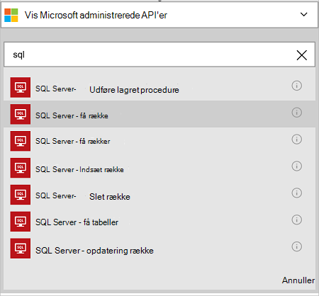

<properties
    pageTitle="Tilføje Azure SQL Database-forbindelse i dine logik Apps | Microsoft Azure"
    description="Oversigt over Azure SQL Database-forbindelse med REST-API parametre"
    services=""
    documentationCenter="" 
    authors="MandiOhlinger"
    manager="anneta"
    editor=""
    tags="connectors"/>

<tags
   ms.service="logic-apps"
   ms.devlang="na"
   ms.topic="article"
   ms.tgt_pltfrm="na"
   ms.workload="na" 
   ms.date="10/18/2016"
   ms.author="mandia"/>

# Introduktion til Azure SQL Database-forbindelse
Med Azure SQL Database-forbindelse kan du oprette arbejdsprocesser for din organisation, der administrerer data i dine tabeller. 

Med SQL-Database du:

- Oprette arbejdsprocessen ved at tilføje en ny kunde til en database med kunder eller opdatere en rækkefølge i en ordrer-database.
- Bruge handlinger til at få en række med data, indsætte en ny række og endda slette. For eksempel, når der oprettes en post i Dynamics CRM Online (en udløser), derefter indsætte en række i en Azure SQL-Database (en handling). 

Dette emne beskrives, hvordan du bruger SQL-Database forbindelsen i en logik app, og også viser en liste over handlingerne.

>[AZURE.NOTE] Denne version i denne artikel gælder for logik Apps generelt tilgængelig (GA). 

Hvis du vil vide mere om logik Apps, skal du se [Hvad er logik apps](../app-service-logic/app-service-logic-what-are-logic-apps.md) og [oprette en logik app](../app-service-logic/app-service-logic-create-a-logic-app.md).

## Oprette forbindelse til Azure SQL-Database

Før din logik app kan få adgang til alle tjenester, oprette du først en *forbindelse* til tjenesten. En forbindelse indeholder forbindelsen mellem en logik app og en anden tjeneste. For eksempel for at oprette forbindelse til SQL-Database, skal oprette du først en SQL-Database- *forbindelse*. Hvis du vil oprette en forbindelse, skal angive du de legitimationsoplysninger, som du normalt bruger til at få adgang til tjenesten, du opretter forbindelse til. Angiv så dine SQL-Database legitimationsoplysninger for at oprette forbindelsen i SQL-Database. 

#### Oprette forbindelse

>[AZURE.INCLUDE [Create the connection to SQL Azure](../../includes/connectors-create-api-sqlazure.md)]

## Bruge en udløser

Denne forbindelse har ikke en hvilken som helst udløsere. Bruge andre udløsere til at starte appen logik, som en gentagelse udløser, en HTTP Webhook udløser, udløsere, der er tilgængelige med andre forbindelser og meget mere. [Opret en logik app](../app-service-logic/app-service-logic-create-a-logic-app.md) viser et eksempel.

## Bruge en handling
    
En handling er en handling, der er foretaget af den arbejdsproces, der er defineret i en logik app. [Lær mere om handlinger](../app-service-logic/app-service-logic-what-are-logic-apps.md#logic-app-concepts).

1. Vælg plustegnet. Du kan se flere valgmuligheder: **Tilføj en handling**, **Tilføj en betingelse**eller en af **flere** indstillinger.

    

2. Vælg **Tilføj en handling**.

3. Skriv "sql" for at få en liste over alle de tilgængelige handlinger i tekstfeltet.

     

4. Vælg **SQL Server - få række**i vores eksempel. Hvis der findes allerede en forbindelse, derefter Vælg **tabelnavn** på rullelisten, og Angiv det **Række-ID** , du vil returnere.

    

    Hvis du bliver bedt om forbindelsesoplysningerne, skal du angive oplysninger til at oprette forbindelsen. [Oprette forbindelsen](connectors-create-api-sqlazure.md#create-the-connection) i dette emne beskrives disse egenskaber. 

    > [AZURE.NOTE] I dette eksempel skal returnere vi en række fra en tabel. For at se dataene i denne række skal du tilføje endnu en handling, der opretter en fil ved hjælp af felterne fra tabellen. For eksempel tilføje en OneDrive-handling, der bruger felterne Fornavn og efternavn til at oprette en ny fil i skyen lagerplads konto. 

5. **Gemme** dine ændringer (øverste venstre hjørne af værktøjslinjen). Din logik app er gemt og kan aktiveres automatisk.

## Tekniske detaljer

## SQL-Database handlinger
En handling er en handling, der er foretaget af den arbejdsproces, der er defineret i en logik app. SQL-Database forbindelsen omfatter følgende handlinger. 

|Handling|Beskrivelse|
|--- | ---|
|[ExecuteProcedure](connectors-create-api-sqlazure.md#execute-stored-procedure)|Udfører en lagret procedure i SQL|
|[GetRow](connectors-create-api-sqlazure.md#get-row)|Henter en enkelt række fra en SQL-tabel|
|[GetRows](connectors-create-api-sqlazure.md#get-rows)|Henter rækker fra en SQL-tabel|
|[InsertRow](connectors-create-api-sqlazure.md#insert-row)|Indsætter en ny række i en SQL-tabel|
|[DeleteRow](connectors-create-api-sqlazure.md#delete-row)|Sletter en række fra en SQL-tabel|
|[GetTables](connectors-create-api-sqlazure.md#get-tables)|Henter tabeller fra en SQL-database|
|[UpdateRow](connectors-create-api-sqlazure.md#update-row)|Opdaterer en eksisterende række i en SQL-tabel|

### Handlingsdetaljer

I dette afsnit, skal du se specifikke oplysninger om hver handling, herunder eventuelle nødvendig eller valgfri input egenskaber og noget tilsvarende output, der er knyttet til forbindelsen.

#### Udføre lagret procedure
Udfører en lagret procedure i SQL.  

| Egenskabsnavn| Vist navn |Beskrivelse|
| ---|---|---|
|procedure * | Navnet på procedure | Navnet på den lagrede procedure, du vil udføre |
|parametre * | Inputparametre | Parametrene er dynamiske og baseret på den lagrede procedure, du vælger.    Hvis du bruger eksempeldatabasen Adventure Works, Vælg *ufnGetCustomerInformation* gemt proceduren. **Kunde-ID** Inputparameteren vises. Skriv "6" eller en af de andre kunde id'er. |

En stjerne (*) betyder, at egenskaben er påkrævet.

##### Output detaljer
ProcedureResult: Indeholder resultatet af udførelse af lagret procedure

| Egenskabsnavn | Datatype | Beskrivelse |
|---|---|---|
|OutputParameters|objekt|Output parameterværdier |
|Returkode|heltal|Følgende kode i en procedure |
|Resultatsæt|objekt| Resultatsæt|

#### Få række 
Henter en enkelt række fra en SQL-tabel.  

| Egenskabsnavn| Vist navn |Beskrivelse|
| ---|---|---|
|tabel * | Tabelnavn |Navnet på SQL-tabel|
|id * | Række-id |Entydigt id for rækken for at hente|

En stjerne (*) betyder, at egenskaben er påkrævet.

##### Output detaljer
Element

| Egenskabsnavn | Datatype |
|---|---|
|ItemInternalId|streng|

#### Få rækker 
Henter rækker fra en SQL-tabel.  

|Egenskabsnavn| Vist navn|Beskrivelse|
| ---|---|---|
|tabel *|Tabelnavn|Navnet på SQL-tabel|
|$skip|Spring over Tæl|Antallet af poster at springe (standard = 0)|
|$top|Maksimale få Tæl|Maksimale antal poster til at hente (standard = 256)|
|$filter|Filtrere forespørgsel|En forespørgsel til ODATA-filter til at begrænse antallet af poster|
|$orderby|Sortér efter|En ODATA SorterEfter forespørgsel for at angive rækkefølgen af poster|

En stjerne (*) betyder, at egenskaben er påkrævet.

##### Output detaljer
ItemsList

| Egenskabsnavn | Datatype |
|---|---|
|værdi|matrix|

#### Indsætte række 
Indsætter en ny række i en SQL-tabel.  

|Egenskabsnavn| Vist navn|Beskrivelse|
| ---|---|---|
|tabel *|Tabelnavn|Navnet på SQL-tabel|
|element *|Række|Træk for at indsætte i den angivne tabel i SQL|

En stjerne (*) betyder, at egenskaben er påkrævet.

##### Output detaljer
Element

| Egenskabsnavn | Datatype |
|---|---|
|ItemInternalId|streng|

#### Slet række 
Sletter en række fra en SQL-tabel.  

|Egenskabsnavn| Vist navn|Beskrivelse|
| ---|---|---|
|tabel *|Tabelnavn|Navnet på SQL-tabel|
|id *|Række-id|Entydigt id for rækken for at slette|

En stjerne (*) betyder, at egenskaben er påkrævet.

##### Output detaljer
Ingen.

#### Få tabeller 
Henter tabeller fra en SQL-database.  

Der er ingen parametre til dette opkald. 

##### Output detaljer 
TablesList

| Egenskabsnavn | Datatype |
|---|---|
|værdi|matrix|

#### Opdatere række 
Opdaterer en eksisterende række i en SQL-tabel.  

|Egenskabsnavn| Vist navn|Beskrivelse|
| ---|---|---|
|tabel *|Tabelnavn|Navnet på SQL-tabel|
|id *|Række-id|Entydigt id for rækken for at opdatere|
|element *|Række|Række med opdaterede værdier|

En stjerne (*) betyder, at egenskaben er påkrævet.

##### Output detaljer  
Element

| Egenskabsnavn | Datatype |
|---|---|
|ItemInternalId|streng|

### HTTP-svar

Når du foretager opkald til de forskellige handlinger, kan du få bestemte svar. Den følgende tabel beskrives svarene, og beskrivelserne:  

|Navn|Beskrivelse|
|---|---|
|200|Ok|
|202|Accepteret|
|400|Forkert anmodning|
|401|Uautoriseret|
|403|Forbudt|
|404|Blev ikke fundet|
|500|Intern serverfejl. Der opstod en ukendt fejl|
|standard|Mislykkedes.|

## Næste trin

[Opret en logik app](../app-service-logic/app-service-logic-create-a-logic-app.md). Udforske andre tilgængelige forbindelserne i logik Apps i vores [API'er liste](apis-list.md).
