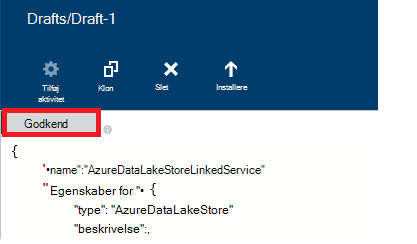

<properties
    pageTitle="Flyt data til/fra Azure sø datalager | Azure Data Factory"
    description="Lær at flytte data til/fra Azure Data sø Store ved hjælp af Azure Data Factory"
    services="data-factory"
    documentationCenter=""
    authors="linda33wj"
    manager="jhubbard"
    editor="monicar"/>

<tags
    ms.service="data-factory"
    ms.workload="data-services"
    ms.tgt_pltfrm="na"
    ms.devlang="na"
    ms.topic="article"
    ms.date="09/27/2016"
    ms.author="jingwang"/>

# Flytte data til og fra Azure Data sø Store ved hjælp af Azure Data Factory
I denne artikel beskrives, hvordan du kan bruge den kopi aktivitet på en Azure data fabrik til at flytte data fra/til Azure sø datalager til/fra en anden datalager. I denne artikel bygger på artiklen [data bevægelse aktiviteter](data-factory-data-movement-activities.md) , som giver et overblik over flytning af data i kopi aktiviteten og de understøttede data store kombinationer.

> [AZURE.NOTE]
> Opret en Azure datalager sø konto inden du opretter en rørledning med en kopi aktivitet til at flytte data til/fra en Azure Data sø store. For at få mere for at vide om Azure sø datalager, kan du se [Introduktion til Azure sø datalager](../data-lake-store/data-lake-store-get-started-portal.md).
>  
> Gennemse [oprette dit første pipeline selvstudium](data-factory-build-your-first-pipeline.md) have en detaljeret vejledning for at oprette en data fabrik, sammenkædede services, datasæt og en rørledning. Brug JSON kodestykker med Data Factory redaktør eller Visual Studio eller Azure PowerShell til at oprette Data Factory-objekter.

## Kopiere guiden data
Den nemmeste måde at oprette en rørledning, der kopierer data til/fra Azure datalager sø er at bruge guiden kopi. Se [Selvstudium: oprette en kopi guiden pipeline](data-factory-copy-data-wizard-tutorial.md) for en hurtig gennemgang på at oprette en rørledning, ved hjælp af guiden Kopier data. 

I følgende eksempler giver eksempel JSON definitioner, som du kan bruge til at oprette en rørledning med [Azure portal](data-factory-copy-activity-tutorial-using-azure-portal.md) eller [Visual Studio](data-factory-copy-activity-tutorial-using-visual-studio.md) eller [Azure PowerShell](data-factory-copy-activity-tutorial-using-powershell.md). De viser, hvordan du kopierer data til og fra Azure sø datalager og Azure Blob-lager. Data kan dog kopierede **direkte** fra enhver af kilder til en af de dræn angivet [her](data-factory-data-movement-activities.md#supported-data-stores) ved hjælp af den kopi aktivitet på Azure Data fabrik.  

## Eksempel: Kopiere data fra Azure Blob til Azure sø datalager
I følgende eksempel viser:

1.  En sammenkædet tjeneste af typen [AzureStorage](#azure-storage-linked-service-properties).
2.  En sammenkædet tjeneste af typen [AzureDataLakeStore](#azure-data-lake-linked-service-properties).
3.  En input [datasæt](data-factory-create-datasets.md) af typen [AzureBlob](#azure-blob-dataset-type-properties).
4.  En output [datasæt](data-factory-create-datasets.md) af typen [AzureDataLakeStore](#azure-data-lake-dataset-type-properties).
4.  En [rørledning](data-factory-create-pipelines.md) med en kopi aktiviteter, der bruger [BlobSource](#azure-blob-copy-activity-type-properties) og [AzureDataLakeStoreSink](#azure-data-lake-copy-activity-type-properties).

Eksemplet kopierer tidsserie data fra en Azure Blob-lager til Azure datalager sø hver time. De JSON egenskaber, der bruges i disse eksempler er beskrevet i følge eksemplerne sektioner.

**Azure-lager sammenkædet service:**

    {
      "name": "StorageLinkedService",
      "properties": {
        "type": "AzureStorage",
        "typeProperties": {
          "connectionString": "DefaultEndpointsProtocol=https;AccountName=<accountname>;AccountKey=<accountkey>"
        }
      }
    }

**Azure Data sø sammenkædet service:**

    {
        "name": "AzureDataLakeStoreLinkedService",
        "properties": {
            "type": "AzureDataLakeStore",
            "typeProperties": {
                "dataLakeStoreUri": "https://<accountname>.azuredatalakestore.net/webhdfs/v1",
                "sessionId": "<session ID>",
                "authorization": "<authorization URL>"
            }
        }
    }

### Oprette Azure Data sø sammenkædede tjenesten ved hjælp af Data Factory Editor
Den følgende fremgangsmåde indeholder trin til oprettelse af en Azure Data sø Store sammenkædet tjenesten ved hjælp af Data Factory-Editor.

1. Klik på **nye data gemmes** på kommandolinjen, og vælg **Azure sø datalager**.
2. Angiv URI for data sø i editoren JSON for egenskaben **dataLakeStoreUri** .
3. Klik på knappen **godkende** på kommandolinjen. Du bør se et pop op-vindue.

    

4. Bruge dine legitimationsoplysninger til at logge på og egenskaben **godkendelse** i JSON skal tildeles til en værdi nu.
5. (valgfrit) Angiv værdier for valgfrie parametre som **kontonavn**, **subscriptionID**og **resourceGroupName** i JSON (eller) slette disse egenskaber fra JSON.
6. Klik på **Implementer** på kommandolinjen til at udrulle sammenkædede tjenesten.

> [AZURE.IMPORTANT] Koden tilladelse, du har oprettet ved hjælp af knappen **godkende** udløber efter et stykke tid. **Godkende igen** ved hjælp af **godkende** knappen hvornår **token udløber** og genimplementeringen sammenkædede tjenesten. Se [Azure sø Store sammenkædede datatjeneste](#azure-data-lake-store-linked-service-properties) afsnittet Yderligere oplysninger. 

**Azure Blob input datasæt:**

Data er valgte fra en ny blob hver time (frekvens: time, interval: 1). Mappe stien og navnet på blob evalueres dynamisk baseret på starttidspunktet for det udsnit, der behandles. Stien til mappen bruger år, måned og dag en del af starttidspunktet og filnavn bruger time en del af starttidspunktet. "eksterne": "true" indstilling fortæller Data Factory-tjenesten, tabellen er ekstern i forhold til data fabrik og er ikke oprettet med en aktivitet i data factory.

    {
      "name": "AzureBlobInput",
      "properties": {
        "type": "AzureBlob",
        "linkedServiceName": "StorageLinkedService",
        "typeProperties": {
          "folderPath": "mycontainer/myfolder/yearno={Year}/monthno={Month}/dayno={Day}",
          "partitionedBy": [
            {
              "name": "Year",
              "value": {
                "type": "DateTime",
                "date": "SliceStart",
                "format": "yyyy"
              }
            },
            {
              "name": "Month",
              "value": {
                "type": "DateTime",
                "date": "SliceStart",
                "format": "MM"
              }
            },
            {
              "name": "Day",
              "value": {
                "type": "DateTime",
                "date": "SliceStart",
                "format": "dd"
              }
            },
            {
              "name": "Hour",
              "value": {
                "type": "DateTime",
                "date": "SliceStart",
                "format": "HH"
              }
            }
          ]
        },
        "external": true,
        "availability": {
          "frequency": "Hour",
          "interval": 1
        },
        "policy": {
          "externalData": {
            "retryInterval": "00:01:00",
            "retryTimeout": "00:10:00",
            "maximumRetry": 3
          }
        }
      }
    }

**Azure Data sø output datasæt:**

Eksemplet kopierer data til en Azure Data sø store. Nye data er kopier, der skal Data sø gemme hver time.

    {
        "name": "AzureDataLakeStoreOutput",
        "properties": {
            "type": "AzureDataLakeStore",
            "linkedServiceName": "AzureDataLakeStoreLinkedService",
            "typeProperties": {
                "folderPath": "datalake/output/"
            },
            "availability": {
                "frequency": "Hour",
                "interval": 1
            }
        }
    }

**Rørledning med en kopi aktiviteter:**

Pipeline indeholder en kopi aktivitet, der er konfigureret til at bruge input- og outputområder datasæt og er planlagt til at køre hver time. **Kildetypen** er indstillet til **BlobSource** i pipeline JSON definition, og **sink** type er indstillet til **AzureDataLakeStoreSink**.

    {  
        "name":"SamplePipeline",
        "properties":
        {  
            "start":"2014-06-01T18:00:00",
            "end":"2014-06-01T19:00:00",
            "description":"pipeline with copy activity",
            "activities":
            [  
                {
                    "name": "AzureBlobtoDataLake",
                    "description": "Copy Activity",
                    "type": "Copy",
                    "inputs": [
                    {
                        "name": "AzureBlobInput"
                    }
                    ],
                    "outputs": [
                    {
                        "name": "AzureDataLakeStoreOutput"
                    }
                    ],
                    "typeProperties": {
                        "source": {
                            "type": "BlobSource",
                            "treatEmptyAsNull": true,
                            "blobColumnSeparators": ","
                        },
                        "sink": {
                            "type": "AzureDataLakeStoreSink"
                        }
                    },
                    "scheduler": {
                        "frequency": "Hour",
                        "interval": 1
                    },
                    "policy": {
                        "concurrency": 1,
                        "executionPriorityOrder": "OldestFirst",
                        "retry": 0,
                        "timeout": "01:00:00"
                    }
                }
            ]
        }
    }

## Eksempel: Kopiere data fra Azure sø datalager til Azure Blob
I følgende eksempel viser:

1.  En sammenkædet tjeneste af typen [AzureDataLakeStore](#azure-data-lake-linked-service-properties).
2.  En sammenkædet tjeneste af typen [AzureStorage](#azure-storage-linked-service-properties).
3.  En input [datasæt](data-factory-create-datasets.md) af typen [AzureDataLakeStore](#azure-data-lake-dataset-type-properties).
4.  En output [datasæt](data-factory-create-datasets.md) af typen [AzureBlob](#azure-blob-dataset-type-properties).
5.  En [rørledning](data-factory-create-pipelines.md) med en kopi aktiviteter, der bruger [AzureDataLakeStoreSource](#azure-data-lake-copy-activity-type-properties) og [BlobSink](#azure-blob-copy-activity-type-properties)

Eksemplet kopierer tidsserie data fra en Azure Data sø store til en Azure blob hver time. De JSON egenskaber, der bruges i disse eksempler er beskrevet i følge eksemplerne sektioner.

**Azure datalager sø sammenkædet service:**

    {
        "name": "AzureDataLakeStoreLinkedService",
        "properties": {
            "type": "AzureDataLakeStore",
            "typeProperties": {
                "dataLakeStoreUri": "https://<accountname>.azuredatalakestore.net/webhdfs/v1",
                "sessionId": "<session ID>",
                "authorization": "<authorization URL>"
            }
        }
    }

> [AZURE.NOTE] Se trinnene i forrige eksempel til at hente URL-adressen til godkendelse.  

**Azure-lager sammenkædet service:**

    {
      "name": "StorageLinkedService",
      "properties": {
        "type": "AzureStorage",
        "typeProperties": {
          "connectionString": "DefaultEndpointsProtocol=https;AccountName=<accountname>;AccountKey=<accountkey>"
        }
      }
    }

**Azure Data sø input datasæt:**

Angive **"eksterne": SAND** informerer tjenesten Data Factory, tabellen er ekstern i forhold til data fabrik og er ikke oprettet med en aktivitet i data factory.

    {
        "name": "AzureDataLakeStoreInput",
        "properties":
        {
            "type": "AzureDataLakeStore",
            "linkedServiceName": "AzureDataLakeStoreLinkedService",
            "typeProperties": {
                "folderPath": "datalake/input/",
                "fileName": "SearchLog.tsv",
                "format": {
                    "type": "TextFormat",
                    "rowDelimiter": "\n",
                    "columnDelimiter": "\t"
                }
            },
            "external": true,
            "availability": {
                "frequency": "Hour",
                "interval": 1
            },
            "policy": {
                "externalData": {
                    "retryInterval": "00:01:00",
                    "retryTimeout": "00:10:00",
                    "maximumRetry": 3
                }
            }
        }
    }

**Azure Blob output datasæt:**

Data skrives til en ny blob hver time (frekvens: time, interval: 1). Stien til mappen for blob evalueres dynamisk baseret på starttidspunktet for det udsnit, der behandles. Stien til mappen bruger år, måned, dag og timer dele af starttidspunktet.

    {
      "name": "AzureBlobOutput",
      "properties": {
        "type": "AzureBlob",
        "linkedServiceName": "StorageLinkedService",
        "typeProperties": {
          "folderPath": "mycontainer/myfolder/yearno={Year}/monthno={Month}/dayno={Day}/hourno={Hour}",
          "partitionedBy": [
            {
              "name": "Year",
              "value": {
                "type": "DateTime",
                "date": "SliceStart",
                "format": "yyyy"
              }
            },
            {
              "name": "Month",
              "value": {
                "type": "DateTime",
                "date": "SliceStart",
                "format": "MM"
              }
            },
            {
              "name": "Day",
              "value": {
                "type": "DateTime",
                "date": "SliceStart",
                "format": "dd"
              }
            },
            {
              "name": "Hour",
              "value": {
                "type": "DateTime",
                "date": "SliceStart",
                "format": "HH"
              }
            }
          ],
          "format": {
            "type": "TextFormat",
            "columnDelimiter": "\t",
            "rowDelimiter": "\n"
          }
        },
        "availability": {
          "frequency": "Hour",
          "interval": 1
        }
      }
    }

**Rørledning med kopi aktiviteten:**

Pipeline indeholder en kopi aktivitet, der er konfigureret til at bruge input- og outputområder datasæt og er planlagt til at køre hver time. **Kildetypen** er indstillet til **AzureDataLakeStoreSource** i pipeline JSON definition, og **sink** type er indstillet til **BlobSink**.

    {  
        "name":"SamplePipeline",
        "properties":{  
            "start":"2014-06-01T18:00:00",
            "end":"2014-06-01T19:00:00",
            "description":"pipeline for copy activity",
            "activities":[  
                {
                    "name": "AzureDakeLaketoBlob",
                    "description": "copy activity",
                    "type": "Copy",
                    "inputs": [
                      {
                        "name": "AzureDataLakeStoreInput"
                      }
                    ],
                    "outputs": [
                      {
                        "name": "AzureBlobOutput"
                      }
                    ],
                    "typeProperties": {
                        "source": {
                            "type": "AzureDataLakeStoreSource",
                        },
                        "sink": {
                            "type": "BlobSink"
                        }
                    },
                    "scheduler": {
                        "frequency": "Hour",
                        "interval": 1
                    },
                    "policy": {
                        "concurrency": 1,
                        "executionPriorityOrder": "OldestFirst",
                        "retry": 0,
                        "timeout": "01:00:00"
                    }
                }
             ]
        }
    }

## Azure Data sø Store sammenkædede Service egenskaber

Du kan sammenkæde et firma Azure-lager med en Azure data factory ved hjælp af en sammenkædet Azure-lager-tjeneste. Den følgende tabel indeholder en beskrivelse til JSON-elementer, der er specifikke for Azure-lager, der er sammenkædet tjeneste.

| Egenskaben | Beskrivelse | Påkrævet |
| :-------- | :----------- | :-------- |
| type | Typeegenskaben skal være angivet til: **AzureDataLakeStore** | Ja |
| dataLakeStoreUri | Angiv oplysninger om sø-datalager Azure-konto. Det er i følgende format: https://<Azure Data Lake account name>.azuredatalakestore.net/webhdfs/v1 | Ja |
| godkendelse | Klik på knappen **godkende** i **Data Factory Editor** , og Angiv dine legitimationsoplysninger, der automatisk tildeles den automatisk oprettede godkendelse URL-adresse til denne egenskab.  | Ja |
| Session-id | OAuth-id-session fra oauth godkendelse session. Hvert session-id er entydigt og kan kun bruges én gang. Denne indstilling genereres automatisk, når du bruger Data Factory Editor. | Ja |  
| Kontonavn | Data sø kontonavn | Nej |
| subscriptionId | Azure abonnement Id. | Ikke (Hvis der ikke er angivet, abonnement på data factory bruges). |
| resourceGroupName |  Azure ressource gruppenavn | Ikke (Hvis der ikke er angivet, ressourcegruppe af data factory bruges). |

## Token udløb 
Koden tilladelse, du opretter ved hjælp af knappen **godkende** udløber efter et stykke tid. Du kan finde udløb tidspunkter for forskellige typer brugerkonti i den følgende tabel. Du muligvis får vist følgende fejlmeddelelse, når godkendelse **token udløber**: "legitimationsoplysninger handlingen fejl: invalid_grant - AADSTS70002: fejl i validering af legitimationsoplysninger. AADSTS70008: Medfølgende access Giv er udløbet eller tilbagekaldt. Spore ID: d18629e8-af88-43c5-88e3-d8419eb1fca1 korrelations-ID: fac30a0c-6be6-4e02-8d69-a776d2ffefd7 tidsstempel: 2015-12-15 21-09-31Z ".

| Brugertype | Udløber efter |
| :-------- | :----------- | 
| Brugerkonti ikke administreres af Azure Active Directory (@hotmail.com, @live.com, osv.). | 12 timer |
| Brugerkonti, der administreres af Azure Active Directory (AAD) | 14 dage efter det sidste udsnit køre.   90 dage, hvis et udsnit, der er baseret på OAuth-baserede sammenkædede tjenesten kører mindst én gang hver 14 dage. |

Hvis du ændrer din adgangskode før dette token udløbsdatoen, tokenet udløber med det samme, og du får vist fejlmeddelelse, der er nævnt i dette afsnit. 

Hvis du vil undgå/Løs fejlen, godkende igen ved hjælp af **godkende** knappen hvornår **token udløber** og genimplementeringen sammenkædede tjenesten. Du kan også oprette værdier for egenskaber for **Session-id-** og **tilladelse** fra et program ved hjælp af kode i følgende afsnit:

### Til at generere session-id- og godkendelse værdier fra et program 

    if (linkedService.Properties.TypeProperties is AzureDataLakeStoreLinkedService ||
        linkedService.Properties.TypeProperties is AzureDataLakeAnalyticsLinkedService)
    {
        AuthorizationSessionGetResponse authorizationSession = this.Client.OAuth.Get(this.ResourceGroupName, this.DataFactoryName, linkedService.Properties.Type);

        WindowsFormsWebAuthenticationDialog authenticationDialog = new WindowsFormsWebAuthenticationDialog(null);
        string authorization = authenticationDialog.AuthenticateAAD(authorizationSession.AuthorizationSession.Endpoint, new Uri("urn:ietf:wg:oauth:2.0:oob"));

        AzureDataLakeStoreLinkedService azureDataLakeStoreProperties = linkedService.Properties.TypeProperties as AzureDataLakeStoreLinkedService;
        if (azureDataLakeStoreProperties != null)
        {
            azureDataLakeStoreProperties.SessionId = authorizationSession.AuthorizationSession.SessionId;
            azureDataLakeStoreProperties.Authorization = authorization;
        }

        AzureDataLakeAnalyticsLinkedService azureDataLakeAnalyticsProperties = linkedService.Properties.TypeProperties as AzureDataLakeAnalyticsLinkedService;
        if (azureDataLakeAnalyticsProperties != null)
        {
            azureDataLakeAnalyticsProperties.SessionId = authorizationSession.AuthorizationSession.SessionId;
            azureDataLakeAnalyticsProperties.Authorization = authorization;
        }
    }

Se emner i [AzureDataLakeStoreLinkedService klasse](https://msdn.microsoft.com/library/microsoft.azure.management.datafactories.models.azuredatalakestorelinkedservice.aspx), [AzureDataLakeAnalyticsLinkedService klasse](https://msdn.microsoft.com/library/microsoft.azure.management.datafactories.models.azuredatalakeanalyticslinkedservice.aspx)og [AuthorizationSessionGetResponse klasse](https://msdn.microsoft.com/library/microsoft.azure.management.datafactories.models.authorizationsessiongetresponse.aspx) få mere at vide om de Data Factory-klasser, der bruges i koden. Tilføje en reference til **2.9.10826.1824** version af **Microsoft.IdentityModel.Clients.ActiveDirectory.WindowsForms.dll** for klassen WindowsFormsWebAuthenticationDialog bruges i koden. 
 

## Azure Data sø datasæt typeegenskaber

En komplet liste over JSON sektioner og egenskaber, der er tilgængelige til at definere datasæt, findes i artiklen [oprette datasæt](data-factory-create-datasets.md) . Afsnit som struktur, tilgængelighed og politik for et datasæt JSON er de samme for alle datasæt typer (Azure SQL Azure blob, Azure table osv.).

Afsnittet **typeProperties** er forskellige for hver type datasæt og indeholder oplysninger om placeringen, formatere osv., af data i lageret med data. Sektionen typeProperties for dataset af typen **AzureDataLakeStore** datasæt har følgende egenskaber:

| Egenskaben | Beskrivelse | Påkrævet |
| :-------- | :----------- | :-------- |
| Mappesti | Stien til objektbeholder og mappe i Azure Data sø store. | Ja |
| Filnavn | Navnet på filen i Azure Data sø store. Filnavn er valgfrit og store og små bogstaver.   Hvis du angiver et filnavn, fungerer aktiviteten (herunder kopi) på den angivne fil.  Når filnavn ikke er angivet, omfatter Kopiér alle filer i mappesti for input datasæt.  Når filnavn ikke er angivet for en output datasæt, der ville være navnet på den oprettede fil i følgende dette format: Data. <Guid>.txt (for eksempel:: Data.0a405f8a-93ff-4c6f-b3be-f69616f1df7a.txt | Nej |
| partitionedBy | partitionedBy er en valgfri egenskab. Du kan bruge det til at angive en dynamisk mappesti og et filnavn til tidsdata serie. Mappesti kan for eksempel være parameteriseret for hver time af data. Se afsnittet [ved hjælp af partitionedBy egenskab](#using-partitionedby-property) for detaljer og eksempler. | Nej |
| Formatér | Følgende formattyper understøttes: **tekstformat**, **AvroFormat**, **JsonFormat**, **OrcFormat**, **ParquetFormat**. Angiv egenskaben **type** under formater til en af følgende værdier. Se [Angive tekstformat](#specifying-textformat), [Der angiver AvroFormat](#specifying-avroformat), [Angive JsonFormat](#specifying-jsonformat), [Angive OrcFormat](#specifying-orcformat)og [Angive ParquetFormat](#specifying-parquetformat) sektioner få mere at vide. Hvis du vil kopiere filer som-er mellem fil-baserede lagre (binære kopi), kan du springe afsnittet format i begge input- og outputområder datasæt definitioner.| Nej
| komprimering | Angiv den type og komprimering for dataene. Understøttede datatyper er: **GZip**, **Deflate**og **BZip2** og understøttede niveauer: **Optimal** og **hurtigst**. Komprimeringsindstillingerne understøttes i øjeblikket ikke data i **AvroFormat** eller **OrcFormat**. Yderligere oplysninger, se [komprimering support](#compression-support) afsnittet.  | Nej |

### Ved hjælp af partitionedBy egenskab
Du kan angive en dynamisk mappesti og et filnavn til serie tidsdata med afsnittet **partitionedBy** , Data Factory makroer og systemvariabler: SliceStart og SliceEnd, som angiver start- og sluttidspunkter for en given data udsnit.

Se [Oprette datasæt](data-factory-create-datasets.md) og [planlægning & udførelse](data-factory-scheduling-and-execution.md) artikler for at forstå flere oplysninger om tid serie datasæt, planlægning og udsnit.

#### Eksempel 1

    "folderPath": "wikidatagateway/wikisampledataout/{Slice}",
    "partitionedBy":
    [
        { "name": "Slice", "value": { "type": "DateTime", "date": "SliceStart", "format": "yyyyMMddHH" } },
    ],

I dette eksempel {udsnit} erstattes med den angivne værdi for Data Factory systemvariabel SliceStart i formatet (YYYYMMDDHH). SliceStart henviser til starttidspunktet for udsnittet. Mappesti er forskellig for hvert udsnit. For eksempel: wikidatagateway/wikisampledataout/2014100103 eller wikidatagateway/wikisampledataout/2014100104

#### Eksempel 2

    "folderPath": "wikidatagateway/wikisampledataout/{Year}/{Month}/{Day}",
    "fileName": "{Hour}.csv",
    "partitionedBy":
     [
        { "name": "Year", "value": { "type": "DateTime", "date": "SliceStart", "format": "yyyy" } },
        { "name": "Month", "value": { "type": "DateTime", "date": "SliceStart", "format": "MM" } },
        { "name": "Day", "value": { "type": "DateTime", "date": "SliceStart", "format": "dd" } },
        { "name": "Hour", "value": { "type": "DateTime", "date": "SliceStart", "format": "hh" } }
    ],

I dette eksempel er år, måned, dag og klokkeslættet for SliceStart ud i separate variabler, der bruges af egenskaberne mappesti og filnavn.

[AZURE.INCLUDE [data-factory-file-format](../../includes/data-factory-file-format.md)]
 

### Understøttelse af komprimering  
Behandling af store datasæt kan medføre flaskehalse i/o- og netværk. Derfor kan komprimerede data i butikker ikke kun hurtigere dataoverførsel på tværs af netværket og spare diskplads, men også tage betydeligt ydeevneforbedringer i stor databehandlingen. Komprimering understøttes i øjeblikket for fil-baserede data butikker som Azure Blob eller lokale filsystem.  

Angive komprimering for et datasæt, skal du bruge egenskaben **komprimering** i datasættet JSON som i følgende eksempel:   

    {  
        "name": "AzureDatalakeStoreDataSet",  
        "properties": {  
            "availability": {  
                "frequency": "Day",  
                "interval": 1  
            },  
            "type": "AzureDatalakeStore",  
            "linkedServiceName": "DataLakeStoreLinkedService",  
            "typeProperties": {  
                "fileName": "pagecounts.csv.gz",  
                "folderPath": "compression/file/",  
                "compression": {  
                    "type": "GZip",  
                    "level": "Optimal"  
                }  
            }  
        }  
    }  
 
Sektionen **komprimering** har to egenskaber:  
  
- **Type:** komprimering codec, som kan være **GZIP**, **Deflate** eller **BZIP2**.  
- **Niveau:** komprimeringsforhold, som kan være **Optimal** eller **hurtigst**. 
    - **Hurtigste:** Komprimeringshandlingen skal udføre så hurtigt som muligt, selvom den resulterende fil ikke er komprimeret optimalt. 
    - **Optimal**: Komprimeringshandlingen skal optimalt komprimeres, selvom handlingen tager længere tid at fuldføre. 
    
    Få mere at vide emnet [Komprimeringsniveau](https://msdn.microsoft.com/library/system.io.compression.compressionlevel.aspx) . 

Antag, at eksempel datasættet bruges som output fra en kopi aktivitet. Kopiér aktiviteten komprimerer outputdataene med GZIP codec ved hjælp af optimal-bredde-forhold og derefter skriver den komprimerede data i en fil med navnet pagecounts.csv.gz i Azure Data sø store.   

Når du angiver komprimering egenskab i et input datasæt JSON, læser rørledningen komprimerede data fra kilden. Når du angiver egenskaben i et output datasæt JSON, kan kopi aktiviteten skrive komprimerede data til destinationen. Her er nogle eksempler på situationer: 

- Læs GZIP komprimeret data fra en Azure-sø datalager, komprimere den, og skrive resultatdata til en Azure SQL-database. Du definerer den input Azure Data sø Store datasæt med komprimering JSON egenskab i dette tilfælde. 
- Læse data fra en fil med almindelig tekst fra lokale filsystem, komprimere det ved hjælp af GZip format og skrive den komprimerede data til et Azure datalager sø. Du definerer et output Azure Data sø datasæt med komprimering JSON egenskab i dette tilfælde.  
- Læse en GZIP-komprimerede data fra et Azure datalager sø, komprimere den, komprimere det ved hjælp af BZIP2 og skrive resultatdata til et Azure datalager sø. Du kan angive komprimering type sæt som GZIP og BZIP2 om input og afgang datasæt henholdsvis.   

## Azure Data sø kopi aktivitet egenskaber  
En komplet liste over sektioner og egenskaber, der er tilgængelige til at definere aktiviteter, findes i artiklen [Oprette rørledninger](data-factory-create-pipelines.md) . Egenskaber som navn, beskrivelse, input og output tabeller og politik er tilgængelige for alle typer aktiviteter.

Tilgængelige egenskaber i sektionen typeProperties aktivitetens afhænger på den anden side af hver aktivitetstype. For kopi aktivitet varierer de afhængigt af typerne datakilder og dræn

**AzureDataLakeStoreSource** understøtter følgende egenskaber **typeProperties** afsnit:

| Egenskaben | Beskrivelse | Tilladte værdier | Påkrævet |
| -------- | ----------- | -------------- | -------- |
| rekursive | Angiver, om dataene er læst gælder fra de underordnede mapper eller kun fra den angivne mappe. | SAND (standardværdien) og FALSK | Nej |

**AzureDataLakeStoreSink** understøtter følgende egenskaber **typeProperties** afsnit:

| Egenskaben | Beskrivelse | Tilladte værdier | Påkrævet |
| -------- | ----------- | -------------- | -------- |
| copyBehavior | Angiver funktionsmåden kopi. | **PreserveHierarchy:** bevarer hierarkiet fil i destinationsmappen. Den relative sti af kildefilen til kildemappe er identisk med den relative sti i destinationsfilen til destinationsmappe.  **FlattenHierarchy:** alle filer fra kildemappen er oprettet i det første niveau af destinationsmappen. Target filerne er oprettet med automatisk genereret navn.  **MergeFiles:** flettes alle filer fra kildemappen til en fil. Hvis navnet på filen/Blob er angivet, ville flettede filnavnet være det angivne navn ellers ville være automatisk oprettede filnavn. | Nej |

[AZURE.INCLUDE [data-factory-structure-for-rectangualr-datasets](../../includes/data-factory-structure-for-rectangualr-datasets.md)]

[AZURE.INCLUDE [data-factory-type-conversion-sample](../../includes/data-factory-type-conversion-sample.md)]

[AZURE.INCLUDE [data-factory-column-mapping](../../includes/data-factory-column-mapping.md)]

## Ydeevne og tilpasning  
Se [kopi aktivitet ydeevne og justering af vejledning](data-factory-copy-activity-performance.md) til at få mere at vide om vigtige faktorer, der virkning ydeevnen for flytning af data (kopi aktivitet) i Azure Data Factory og forskellige måder at optimere den.
