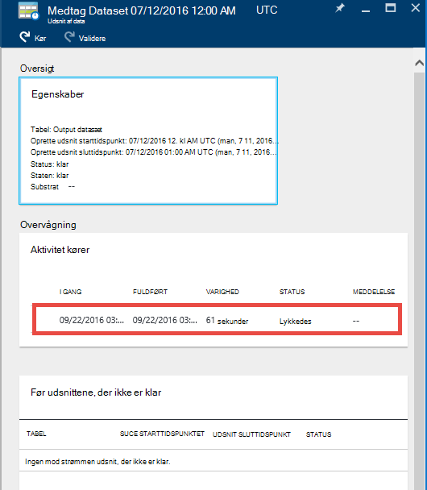

<properties 
    pageTitle="Selvstudium: Oprette en rørledning med kopi aktivitet i portalen til Azure | Microsoft Azure" 
    description="I dette selvstudium oprette du en Azure Data Factory rørledning med en kopi aktivitet ved hjælp af Data Factory-Editor i portalen Azure." 
    services="data-factory" 
    documentationCenter="" 
    authors="spelluru" 
    manager="jhubbard" 
    editor="monicar"/>

<tags 
    ms.service="data-factory" 
    ms.workload="data-services" 
    ms.tgt_pltfrm="na" 
    ms.devlang="na" 
    ms.topic="get-started-article" 
    ms.date="09/16/2016" 
    ms.author="spelluru"/>

# Selvstudium: Oprette en rørledning med kopi aktivitet i portalen til Azure
> [AZURE.SELECTOR]
- [Oversigt og forudsætninger](data-factory-copy-data-from-azure-blob-storage-to-sql-database.md)
- [Kopiere guiden](data-factory-copy-data-wizard-tutorial.md)
- [Azure-portalen](data-factory-copy-activity-tutorial-using-azure-portal.md)
- [Visual Studio](data-factory-copy-activity-tutorial-using-visual-studio.md)
- [PowerShell](data-factory-copy-activity-tutorial-using-powershell.md)
- [Azure ressourcestyring skabelon](data-factory-copy-activity-tutorial-using-azure-resource-manager-template.md)
- [REST-API](data-factory-copy-activity-tutorial-using-rest-api.md)
- [.NET API](data-factory-copy-activity-tutorial-using-dotnet-api.md)

Dette selvstudium viser, hvordan du opretter og overvåge en Azure data factory ved hjælp af portalen Azure. Pipeline i data factory bruger en kopi aktivitet til at kopiere data fra Azure Blob-lager til Azure SQL-Database.

Her er de trin, du udfører som en del af dette selvstudium:

Trin | Beskrivelse
-----| -----------
[Oprette en Azure Data Factory](#create-data-factory) | I dette trin skal oprette du en Azure data factory med navnet **ADFTutorialDataFactory**.  
[Oprette sammenkædede tjenester](#create-linked-services) | I dette trin skal du oprette to sammenkædede tjenester: **AzureStorageLinkedService** og **AzureSqlLinkedService**.   AzureStorageLinkedService links Azure opbevaring og AzureSqlLinkedService links Azure SQL-database til ADFTutorialDataFactory. Inputdataene gemmes for rørledningen, der er placeret i en blob objektbeholder i Azure blob-lager og output dataene i en tabel i Azure SQL-database. Derfor skal du tilføje disse to butikker som sammenkædede tjenester til fabriksindstillingerne data.      
[Oprette input og output-datasæt](#create-datasets) | I det forrige trin, du har oprettet sammenkædede tjenester, der refererer til data butikker, der indeholder input/output data. I dette trin skal definere du to datasæt-- **InputDataset** og **OutputDataset** --, der repræsenterer de input/output-data, der er gemt i datalagre.   Du angiver objektbeholderen blob, der indeholder en blob med kildedata og OutputDataset for InputDataset, kan du angive den SQL-tabel, der gemmer outputdataene. Du kan også angive andre egenskaber som struktur, tilgængelighed og politik. 
[Oprette en pipeline](#create-pipeline) | I dette trin skal oprette du en rørledning med navnet **ADFTutorialPipeline** i ADFTutorialDataFactory.   Du føjer en **kopi aktivitet** til den rørledning, kopier, der er indtastet data fra Azure blob til output Azure SQL-tabel. Kopiér aktiviteten udfører på flytning af data i Azure Data Factory. Den drives af en globalt tilgængelig tjeneste, som kan kopiere data mellem forskellige data butikker i et sikkert, pålideligt og SVG måde. Se [Data bevægelse aktiviteter](data-factory-data-movement-activities.md) artikel for at få mere at vide om den kopi aktivitet. 
[Overvåge pipeline](#monitor-pipeline) | I dette trin kan overvåge du udsnit i input- og outputområder tabeller ved hjælp af Azure-portalen.

## Forudsætninger 
Fuldført forudsætninger, der er angivet i artiklen [Oversigt](data-factory-copy-data-from-azure-blob-storage-to-sql-database.md) , før du udfører dette selvstudium.

## Oprette data factory
I dette trin skal bruge du Azure portal til at oprette en Azure data factory med navnet **ADFTutorialDataFactory**.

1.  Når logføring i [Azure-portalen](https://portal.azure.com/), klik på **Ny**, Vælg **Intelligence + analyser**og klikke på **Data Factory**. 

      

6. I de **nye data factory** blade:
    1. Angiv **ADFTutorialDataFactory** for **navn**. 
    
        

        Navnet på Azure data factory skal være **globalt entydige**. Hvis du får vist følgende fejlmeddelelse, ændre navnet på data factory (for eksempel yournameADFTutorialDataFactory), og prøv at oprette igen. Se emnet med [Data Factory - navngivning af regler](data-factory-naming-rules.md) for navngivning regler for Data Factory elementer.
    
            Data factory name “ADFTutorialDataFactory” is not available  
     
        
    2. Vælg dit Azure **abonnement**.
    3. Gør et af følgende trin til gruppen ressource:
        1. Vælg **Brug eksisterende**, og vælg en eksisterende ressourcegruppe på rullelisten. 
        2. Vælg **Opret ny**, og skriv navnet på en ressourcegruppe.   
    
            Nogle af trinnene i dette selvstudium forudsætter, at du bruger navnet: **ADFTutorialResourceGroup** for ressourcegruppen. For at få mere for at vide om ressourcegrupper, du se [Brug af ressourcegrupper til at administrere dine Azure ressourcer](../azure-resource-manager/resource-group-overview.md).  
    4. Vælg en **placering** til data factory. Kun de områder, der understøttes af tjenesten Data Factory er vist i på rullelisten.
    5. Vælg **Fastgør til Startboard**.     
    6. Klik på **Opret**.

        > [AZURE.IMPORTANT] For at oprette Data Factory forekomster, skal du være medlem af rollen [Data Factory bidragyder](../active-directory/role-based-access-built-in-roles.md/#data-factory-contributor) på gruppeniveau abonnement/ressource.
        >  
        >  Navnet på data factory kan registreres som en DNS-navn på et senere tidspunkt og dermed bliver offentligt synlige.              
9.  For at se status/meddelelserne skal du klikke på klokkeikonet på værktøjslinjen. 

     
10. Efter at oprettelsen er fuldført, skal se du bladet **Data Factory** , som vist i billedet.

    

## Oprette sammenkædede tjenester
Sammenkædede services sammenkæde data butikker eller beregne tjenester til en Azure data factory. Se [understøttede data gemmer](data-factory-data-movement-activities.md##supported-data-stores-and-formats) for alle de kilder og dræn understøttes af den kopi aktivitet. Se [beregne sammenkædede tjenester](data-factory-compute-linked-services.md) til listen over Beregn tjenester, der understøttes af Data Factory. I dette selvstudium skal du ikke bruge en hvilken som helst Beregn tjeneste. 

I dette trin skal du oprette to sammenkædede tjenester: **AzureStorageLinkedService** og **AzureSqlLinkedService**. AzureStorageLinkedService sammenkædet service links kontotypen Azure-lager og AzureSqlLinkedService links Azure SQL-database til **ADFTutorialDataFactory**. Du kan oprette en rørledning senere i dette selvstudium, kopierer data fra en blob objektbeholder i AzureStorageLinkedService til en SQL-tabel i AzureSqlLinkedService.

### Oprette en sammenkædet tjeneste for kontoen Azure-lager
1.  Klik på i bladet **Data Factory** **forfatter og installere** felt for at starte **Editor** til fabriksindstillingerne data.

     
5. Klik på **nye data gemme** knap på værktøjslinjen i **Editor**, og vælg **Azure-lager** i rullemenuen. Du bør se JSON-skabelon til at oprette en Azure sammenkædet lagringstjeneste i højre rude. 

        
6. Erstatte `<accountname>` og `<accountkey>` kontonavn og konto nøgleværdier for kontoen Azure-lager. 

     
6. Klik på **Implementer** på værktøjslinjen. Du bør nu se de installerede **AzureStorageLinkedService** i trævisningen. 

    

> [AZURE.NOTE]
> Se [flytte data fra/til Azure Blob](data-factory-azure-blob-connector.md#azure-storage-linked-service) få mere at vide om egenskaber for JSON.

### Oprette en sammenkædet tjeneste til Azure SQL-Database
1. Klik på **nye data gemme** knap på værktøjslinjen i **Data Factory Editor**, og vælg **Azure SQL-Database** i rullemenuen. Du bør se JSON-skabelon til oprettelse af tjenesten Azure SQL sammenkædet i højre rude.
2. Erstatte `<servername>`, `<databasename>`, `<username>@<servername>`, og `<password>` med navnene på dine Azure SQL server, database, brugerkonto og adgangskode. 
3. Klik på **Implementer** på værktøjslinjen for at oprette og installere **AzureSqlLinkedService**.
4. Bekræft, at du ser **AzureSqlLinkedService** i trævisningen. 

> [AZURE.NOTE]
> Se [flytte data fra/til Azure SQL-Database](data-factory-azure-sql-connector.md#azure-sql-linked-service-properties) for at få oplysninger om JSON egenskaber.

## Oprette datasæt
I det forrige trin, du har oprettet sammenkædede services **AzureStorageLinkedService** og **AzureSqlLinkedService** vil sammenkæde en Azure-lager konto og Azure SQL-database med data factory: **ADFTutorialDataFactory**. I dette trin skal definere du to datasæt-- **InputDataset** og **OutputDataset** --, der repræsenterer de input/output-data, der er gemt i de datalagre henvises i AzureStorageLinkedService og AzureSqlLinkedService henholdsvis. Du angiver objektbeholderen blob, der indeholder en blob med kildedata og OutputDataset for InputDataset, kan du angive den SQL-tabel, der gemmer outputdataene. 

### Oprette input datasæt 
I dette trin skal oprette du et datasæt med navnet **InputDataset** , der peger på en blob objektbeholder i Azure-lager, der er repræsenteret af tjenesten **AzureStorageLinkedService** sammenkædet.

1. Klik på **i **Editor** til Data Factory... Flere**, klik på **nyt datasæt**, og vælg **Azure Blob-lager** i rullemenuen. 

    
2. Erstat JSON i højre rude med følgende JSON-kodestykket: 

        {
          "name": "InputDataset",
          "properties": {
            "structure": [
              {
                "name": "FirstName",
                "type": "String"
              },
              {
                "name": "LastName",
                "type": "String"
              }
            ],
            "type": "AzureBlob",
            "linkedServiceName": "AzureStorageLinkedService",
            "typeProperties": {
              "folderPath": "adftutorial/",
              "fileName": "emp.txt",
              "format": {
                "type": "TextFormat",
                "columnDelimiter": ","
              }
            },
            "external": true,
            "availability": {
              "frequency": "Hour",
              "interval": 1
            }
          }
        }
        
     Bemærk følgende punkter: 
    
    - datasæt **type** er indstillet til **AzureBlob**.
    - **linkedServiceName** er angivet til **AzureStorageLinkedService**. Du har oprettet denne sammenkædede tjeneste i trin 2.
    - **mappesti** er indstillet til objektbeholderen **adftutorial** . Du kan også angive navnet på en blob i mappen ved hjælp af egenskaben **fileName** . Da du ikke angiver navnet på blob, betragtes som data fra alle BLOB i beholderen som en indtastede data.  
    - Formatér **type** er indstillet til **tekstformat**
    - Der er to felter i den tekstfil – **Fornavn** og **Efternavn** – adskilt af et kommategn (**columnDelimiter**) 
    - **Tilgængelighed** er indstillet til **hver time** (**frekvens** er indstillet til **time** og **interval** er angivet til **1**). Derfor søger Data Factory efter inputdataene hver time i rodmappen på blob objektbeholder (**adftutorial**), du har angivet. 
    
    Hvis du ikke angiver et **filnavn** til en **input** datasæt, der alle filer/BLOB fra mappen input (**mappesti**) betragtes som input. Hvis du angiver et filnavn i JSON, betragtes kun den angivne fil/blob asn input.
 
    Hvis du ikke angiver et **filnavn** til en **outputtabel**, de oprettede filer i **mappesti** navngives i følgende format: Data. &lt;Guid\&BT;. txt (eksempel: Data.0a405f8a-93ff-4c6f-b3be-f69616f1df7a.txt.).

    For at angive **mappesti** og **filnavn** dynamisk baseret på tidspunktet, **SliceStart** skal du bruge egenskaben **partitionedBy** . I eksemplet nedenfor mappesti bruger år, måned og dag fra SliceStart (starttidspunktet for det udsnit, behandles) og filnavn bruger time fra SliceStart. Eksempelvis hvis et udsnit føres til 2016-09-20T08:00:00, mappenavn er indstillet til wikidatagateway/wikisampledataout/2016/09/20 og filnavnet er indstillet til 08.csv. 

            "folderPath": "wikidatagateway/wikisampledataout/{Year}/{Month}/{Day}",
            "fileName": "{Hour}.csv",
            "partitionedBy": 
            [
                { "name": "Year", "value": { "type": "DateTime", "date": "SliceStart", "format": "yyyy" } },
                { "name": "Month", "value": { "type": "DateTime", "date": "SliceStart", "format": "MM" } }, 
                { "name": "Day", "value": { "type": "DateTime", "date": "SliceStart", "format": "dd" } }, 
                { "name": "Hour", "value": { "type": "DateTime", "date": "SliceStart", "format": "hh" } } 
            ],
2. Klik på **Implementer** på værktøjslinjen for at oprette og installere **InputDataset** datasættet. Bekræft, at du ser **InputDataset** i trævisningen.

> [AZURE.NOTE]
> Se [flytte data fra/til Azure Blob](data-factory-azure-blob-connector.md#azure-blob-dataset-type-properties) få mere at vide om egenskaber for JSON.

### Oprette output datasæt
I denne del af trinnet opretter du en output datasæt med navnet **OutputDataset**. Dette dataset peger på en SQL-tabel i den Azure SQL-database, der er repræsenteret af **AzureSqlLinkedService**. 

1. Klik på **i **Editor** til Data Factory... Flere**, klik på **nyt datasæt**, og vælg **Azure SQL** i rullemenuen. 
2. Erstat JSON i højre rude med følgende JSON-kodestykket:

        {
          "name": "OutputDataset",
          "properties": {
            "structure": [
              {
                "name": "FirstName",
                "type": "String"
              },
              {
                "name": "LastName",
                "type": "String"
              }
            ],
            "type": "AzureSqlTable",
            "linkedServiceName": "AzureSqlLinkedService",
            "typeProperties": {
              "tableName": "emp"
            },
            "availability": {
              "frequency": "Hour",
              "interval": 1
            }
          }
        }
        
     Bemærk følgende punkter: 
    
    - datasæt **type** er indstillet til **AzureSQLTable**.
    - **linkedServiceName** er angivet til **AzureSqlLinkedService** (du oprettede denne sammenkædede tjeneste i trin 2).
    - **tabelnavn** er angivet til **emp**.
    - Der er tre kolonner- **ID**, **Fornavn**og **Efternavn** – i tabellen emp i databasen. ID er en id-kolonne, så du har brug at angive kun **Fornavn** og **Efternavn** her.
    - **Tilgængelighed** er indstillet til **hver time** (**hyppighed** , der er angivet til **hour** og **interval** , der er angivet til **1**).  Tjenesten Data Factory genererer en output data udsnit hver time i tabellen **emp** Azure SQL-database.

3. Klik på **Implementer** på værktøjslinjen for at oprette og installere **OutputDataset** datasættet. Bekræft, at du ser **OutputDataset** i trævisningen. 

> [AZURE.NOTE]
> Se [flytte data fra/til Azure SQL-Database](data-factory-azure-sql-connector.md#azure-sql-linked-service-properties) for at få oplysninger om JSON egenskaber.

## Oprette pipeline
I dette trin skal du oprette en rørledning med en **Kopi aktivitet** , der bruger **InputDataset** som input og **OutputDataset** som output.

1. Klik på **i **Editor** til Data Factory... Flere**, og klik på **ny pipeline**. Du kan også højreklikke **rørledninger** i trævisningen og klikke på **ny pipeline**.
2. Erstat JSON i højre rude med følgende JSON-kodestykket: 
        
        {
          "name": "ADFTutorialPipeline",
          "properties": {
            "description": "Copy data from a blob to Azure SQL table",
            "activities": [
              {
                "name": "CopyFromBlobToSQL",
                "type": "Copy",
                "inputs": [
                  {
                    "name": "InputDataset"
                  }
                ],
                "outputs": [
                  {
                    "name": "OutputDataset"
                  }
                ],
                "typeProperties": {
                  "source": {
                    "type": "BlobSource"
                  },
                  "sink": {
                    "type": "SqlSink",
                    "writeBatchSize": 10000,
                    "writeBatchTimeout": "60:00:00"
                  }
                },
                "Policy": {
                  "concurrency": 1,
                  "executionPriorityOrder": "NewestFirst",
                  "retry": 0,
                  "timeout": "01:00:00"
                }
              }
            ],
            "start": "2016-07-12T00:00:00Z",
            "end": "2016-07-13T00:00:00Z"
          }
        } 

    Bemærk følgende punkter:

    - I sektionen aktiviteter er der kun en aktivitet, hvis **type** er indstillet til **kopi**.
    - Input for aktiviteten er indstillet til **InputDataset** og afgang for aktiviteten er indstillet til **OutputDataset**.
    - I sektionen **typeProperties** **BlobSource** er angivet som kildetypen og **SqlSink** er angivet som typen sink.

    Erstat værdien af egenskaben **starte** med den aktuelle dag og **end** med den næste dag. Du kan angive kun datodel og springe klokkeslætsdelen af dato klokkeslæt. For eksempel "2016-02-03", som svarer til "2016-02-03T00:00:00Z"
    
    Begge start og Afslut dato/klokkeslæt være i [ISO-formatet](http://en.wikipedia.org/wiki/ISO_8601). For eksempel: 2016-10-14T16:32:41Z. **Sluttidspunktet** er valgfrit, men vi bruge det i dette selvstudium. 
    
    Hvis du ikke angiver værdien for egenskaben **slutningen** , er det beregnet som "**start + 48 timer**". For at køre rørledningen på ubestemt tid, skal du angive **9999-09-09** som værdien for egenskaben **slutningen** .
    
    I det foregående eksempel er der 24 dataudsnit, som hvert data udsnit produceret hver time.
    
4. Klik på **Implementer** på værktøjslinjen for at oprette og installere **ADFTutorialPipeline**. Bekræft, at du ser rørledningen i trævisningen. 
5. Luk nu bladet **Editor** ved at klikke på **X**. Klik på **X** igen for at se **Data Factory** hjemmeside for **ADFTutorialDataFactory**.

**Tillykke!** Du har oprettet en Azure data factory, sammenkædede services, tabeller og en rørledning og planlagt pipeline.   
 
### Få vist data factory i en diagramvisning 
1. Klik på **Diagram**i bladet **Data Factory** .

    
2. Du burde se diagrammet svarende til følgende billede: 

    

    Du kan zoome ind, zoome ud og zoom til 100%, zoom til at passe, automatisk placere rørledninger og tabeller og vise oplysninger om datakildeafstamning (fremhæver foregående og efterfølgende elementer for de markerede elementer).  Du kan dobbeltklikke på et objekt (input/output tabel eller pipeline) for at se egenskaberne for den. 
3. Højreklik på **ADFTutorialPipeline** i diagramvisning, og klik på **Åbn pipeline**. 

    
4. Du bør se aktiviteter i pipeline sammen med input- og outputområder datasæt for aktiviteterne. I dette selvstudium har du kun én aktivitet i rørledning (kopi aktivitet) med InputDataset som input datasæt og OutputDataset som output datasæt.   

    
5. Klik på **Data factory** i brødkrummen i øverste venstre hjørne for at komme tilbage til diagramvisning. Diagramvisning viser alle rørledninger. Du har oprettet en rørledning kun i dette eksempel.   
 

## Overvåge pipeline
I dette trin skal bruge du Azure portal til at overvåge, hvad der foregår på en Azure data fabrik. 

### Overvåge rørledning med diagramvisning

1. Klik på **X** for at lukke **diagramvisning for at få vist Data Factory startsiden for data factory** . Hvis du har lukket webbrowseren skal du gøre følgende: 
    2. Gå til [Azure-portalen](https://portal.azure.com/). 
    2. Dobbeltklik på **ADFTutorialDataFactory** på **Startboard** (eller) Klik på **Data fabrikker** i menuen til venstre, og Søg efter ADFTutorialDataFactory. 
3. Du bør se Tæl og navne på tabeller og pipeline, du har oprettet på denne blade.

    
4. Nu skal du klikke på flisen for **datasæt** .
5. Klik på **InputDataset**i bladet **datasæt** . Dette dataset er input datasættet for **ADFTutorialPipeline**.

       
5. Klik på **... (ellipse)** for at se alle dataudsnit.

      

    Bemærk, at alle dataudsnit op til det aktuelle klokkeslæt er **klar** , fordi filen **emp.txt** findes hele tiden i beholderen blob: **adftutorial\input**. Bekræft, at ingen udsnit vises i sektionen **senest mislykkedes udsnit** nederst.

    Både **senest opdateret udsnit** og **senest mislykkedes udsnit** er sorteret efter den **seneste opdatering tid**. 
    
    Klik på **Filter** på værktøjslinjen for at filtrere udsnittene.  
    
    
6. Luk blade, indtil du ser bladet **datasæt** . Klik på **OutputDataset**. Dette dataset er output datasæt for **ADFTutorialPipeline**.

    
6. Du burde se bladet **OutputDataset** , som vist på følgende billede:

     
7. Bemærk, at data udsnittene op til det aktuelle klokkeslæt er blevet produceret og de er **klar**. Ingen udsnit vises i sektionen **Problem udsnit** nederst.
8. Klik på **... (Ellipse)** for at se alle udsnittene.

    
9. Klik på en hvilken som helst data udsnit på listen, og skal du se afsnittet bladet **Data udsnit** .

    
  
    Hvis udsnittet ikke er i tilstanden **klar** , kan du se de tidligere udsnit, der ikke er klar og blokering af det aktuelle udsnit fra udførelse af på listen **før udsnit, der er ikke klar** .
11. I bladet **DATA UDSNIT** , skal du se alle aktivitet kører på listen nederst. Klik på en **aktivitet køre** for at få vist bladet **aktivitet køre detaljer** . 

    
12. Klik på **X** for at lukke alle blade, indtil du kommer tilbage til bladet privat for **ADFTutorialDataFactory**.
14. (valgfrit) Klik på **rørledninger** på startsiden for **ADFTutorialDataFactory**og klikke på **ADFTutorialPipeline** i bladet **rørledninger** detaljeadgang input tabeller (**forbrugt**) eller output tabeller (**fremstillede**).
15. Start **SQL Server Management Studio**, oprette forbindelse til Azure SQL-Database, og Bekræft, at rækkerne, der er indsat i til tabellen **emp** i databasen.

    

### Overvåge pipeline ved hjælp af skærm og administrer App
Du kan også bruge skærm og administrere program tilladelse til at overvåge dine rørledninger. Finde detaljerede oplysninger om brug af dette program, [skærm og administrere Azure Data Factory rørledninger ved hjælp af overvågning og administration af App](data-factory-monitor-manage-app.md).

1. Klik på **skærm og administrer** felt på startsiden for dine data factory.

     
2. Du bør se **skærm og Administrer programmer**. Ændre **Starttidspunkt** og **Sluttidspunkt** for at medtage start (2016-07-12) og sluttidspunkter (2016-07-13) af din pipeline og klikke på **Anvend**. 

     
3. Vælg en aktivitet vindue i listen **Aktivitet Windows** for at se oplysninger om den. 
    

## Oversigt 
I dette selvstudium, du har oprettet en Azure data factory til at kopiere data fra en Azure blob til en Azure SQL-database. Du har brugt på Azure-portalen til at oprette data factory, sammenkædede services, datasæt og en rørledning. Her er de overordnede trin, du har udført i dette selvstudium:  

1.  Oprettet en Azure **data factory**.
2.  Oprettet **sammenkædede tjenester**:
    1. En **Azure-lager** sammenkædet service sammenkæde kontoen Azure-lager, der indeholder indtastede data.    
    2. En **SQL Azure** sammenkædet service sammenkæde din Azure SQL-database, der indeholder outputdataene. 
3.  Oprettet **datasæt** , der beskriver inputdataene og outputdata for rørledninger.
4.  Oprettet en **rørledning** med en **Kopi aktivitet** med **BlobSource** som kilde- og **SqlSink** som sink.  

## Se også
| Emne | Beskrivelse |
| :---- | :---- |
| [Data bevægelse aktiviteter](data-factory-data-movement-activities.md) | I denne artikel indeholder detaljerede oplysninger om den kopi aktivitet, du har brugt i selvstudiet. |
| [Planlægning og udførelse af](data-factory-scheduling-and-execution.md) | Denne artikel forklares planlægnings- og udførelse af aspekter af Azure Data Factory programmet model. |
| [Rørledninger](data-factory-create-pipelines.md) | I denne artikel hjælper dig med at forstå rørledninger og aktiviteter i Azure Data Factory. |
| [Datasæt](data-factory-create-datasets.md) | I denne artikel hjælper dig med at forstå datasæt i Azure Data Factory.
| [Overvåge og administrere rørledninger ved hjælp af overvågning App](data-factory-monitor-manage-app.md) | I denne artikel beskrives, hvordan du kan overvåge, administrere og foretage fejlfinding rørledninger med kommandoen overvågning og administration af App. 

