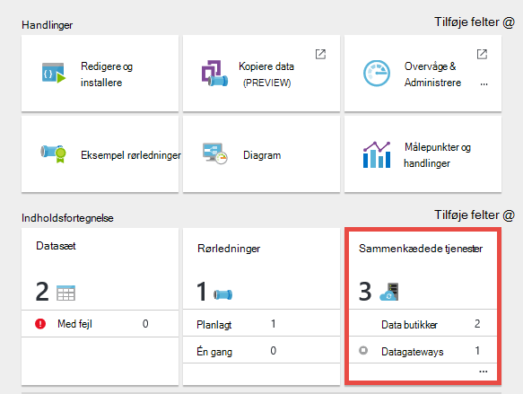
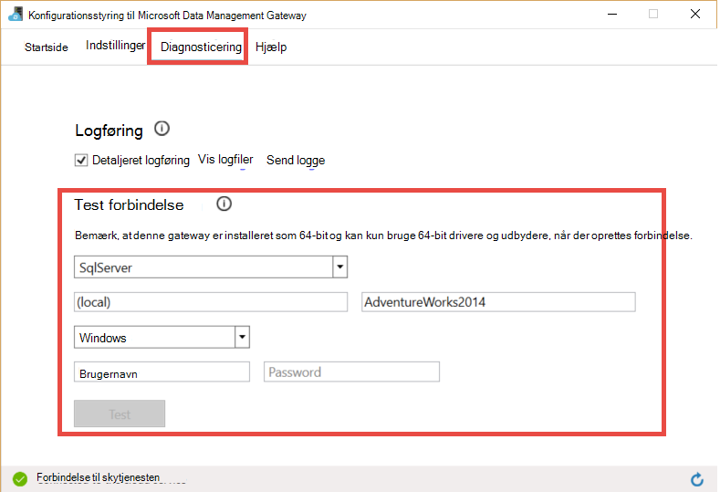

<properties 
    pageTitle="Datastyringsgateway til Data Factory | Microsoft Azure"
    description="Konfigurere en datastyringsgateway til at flytte data mellem lokale miljø og skyen. Brug af Datastyringsgateway i Azure Data Factory til at flytte dine data." 
    services="data-factory" 
    documentationCenter="" 
    authors="linda33wj" 
    manager="jhubbard" 
    editor="monicar"/>

<tags 
    ms.service="data-factory" 
    ms.workload="data-services" 
    ms.tgt_pltfrm="na" 
    ms.devlang="na" 
    ms.topic="article" 
    ms.date="10/11/2016" 
    ms.author="jingwang"/>

# Datastyringsgateway
Datastyringsgateway er en agent for klienten, skal du installere i dit lokale miljø til at kopiere data mellem skyen og lokale data butikker. Lokale data butikker understøttes af Data Factory findes i afsnittet [understøttede datakilder](data-factory-data-movement-activities.md##supported-data-stores) . 

> [AZURE.NOTE] På nuværende tidspunkt understøtter gateway kun kopi aktivitet og lagret procedure aktivitet i Data Factory. Det er ikke muligt at bruge gatewayen fra en brugerdefineret aktivitet til at få adgang til lokale datakilder. 

I denne artikel supplerer gennemgang i den [flytte data mellem lokale miljø og skyen data butikker](data-factory-move-data-between-onprem-and-cloud.md) artikel. I denne gennemgang, kan du oprette en rørledning, der bruger gatewayen til at flytte data fra en lokal SQL Server-database til en Azure blob. I denne artikel indeholder detaljerede dybdegående oplysninger om Datastyringsgateway.   

## Oversigt

### Funktionerne i Data Management gateway
Datastyringsgateway indeholder følgende funktioner:

- Model lokale datakilder og skydatakilder inden for de samme data fabrik og flytte data.
- Har en enkelt rude af glas til overvågning og administration med indsigt i gatewaystatus for fra bladet Data Factory.
- Administrere sikker adgang til lokale datakilder.
    - Ingen ændringer, der kræves for virksomhedens firewall. Gatewayen gør kun udgående HTTP-baserede forbindelser for at åbne internet.
    - Kryptere legitimationsoplysninger for dine lokale data butikker med dit certifikat.
- Flyt data effektivt – data overføres parallelt og tolerant for forbigående netværksproblemer med auto retry-logik.

### Kommandoen flow og dataflow
Når du bruger en kopi aktivitet til at flytte data mellem i det lokale miljø og skyen, bruges aktiviteten en gateway til at overføre data fra lokale datakilde til skyen og omvendt.

Her overordnet data flow til og oversigt over trin til at kopiere med datastyringsgateway: 

1.  Data udvikler opretter en gateway til en Azure Data Factory-ved hjælp af [Azure portal](https://portal.azure.com) eller [PowerShell-Cmdlet](https://msdn.microsoft.com/library/dn820234.aspx). 
2.  Data udvikler opretter en sammenkædet tjeneste til et lokalt datalager ved at angive gatewayen. Som en del af konfigurationen af tjenesten sammenkædede anvender data udvikler programmet indstilling legitimationsoplysninger til at angive godkendelsestyper og legitimationsoplysninger.  Dialogboksen indstilling legitimationsoplysninger programmet kommunikerer med datalager at teste forbindelsen og gateway for at gemme legitimationsoplysninger.
3. Gatewayen krypterer legitimationsoplysningerne med certifikatet, der er knyttet til gatewayen (leveres af data udvikler), før du gemmer legitimationsoplysninger i skyen.
4. Factory datatjeneste kommunikerer med gatewayen for planlægning og administration af sager via en kanal i kontrolelementet, der bruger en delt Azure service bus kø. Når en Kopier aktivitet sag skal sættes, i Data Factory kø anmodningen sammen med legitimationsoplysninger. Gatewayen sætter jobbet fra efter forespørgsel blandt køen.
5.  Gatewayen dekrypterer legitimationsoplysningerne med det samme certifikat og opretter derefter forbindelse til den lokale datalager med stort godkendelsestype og legitimationsoplysninger.
6.  Gatewayen blev kopieret data fra et lokalt lager til en skylagring eller omvendt afhængigt af hvordan kopi aktiviteten er konfigureret i pipeline data. For dette trin skal kommunikerer gatewayen direkte med skybaseret lagerplads tjenester som Azure Blob-lager via en sikker (HTTPS)-kanal.

### Overvejelser ved brug af gateway
- En enkelt forekomst af Datastyringsgateway kan bruges til flere lokale datakilder. Men **en forekomst af enkelt gateway er bundet til kun én Azure data fabrik** og kan ikke deles med en anden data fabrik.
- Du kan have **kun én forekomst af Datastyringsgateway** installeres på en enkelt computer. Antag, du har to data fabrikker, der skal have adgang til lokale datakilder, skal du installere gateways på to lokale computere. Med andre ord, er en gateway bundet til en bestemt data fabrik
- Den **gateway behøver ikke at være på den samme computer som datakilde**. Men har gateway tættere til datakilden, reduceres tidspunktet for gateway for at oprette forbindelse til datakilden. Vi anbefaler, at du installerer gatewayen på en computer, der adskiller sig fra dét, der er vært for lokale datakilde. Når gateway og datakilden er på forskellige computere, konkurrere gatewayen ikke for ressourcer med datakilde.
- Du kan have **flere gateways på forskellige computere, der opretter forbindelse til det samme lokale datakilde**. Du skal muligvis to gateways fungerer to data fabrikker for eksempel, men den samme lokale datakilde er registreret med begge data virksomheder.
- Hvis du allerede har en gateway, der er installeret på din computer, fungerer et scenarie med **Power BI** , kan du installere en **separat gateway til Azure Data Factory** på en anden computer.
- Gatewayen skal bruges, selv når du bruger **ExpressRoute**.
- Behandle datakilden som en lokal datakilde (som er bag en firewall) selv, når du bruger **ExpressRoute**. Brug gatewayen til at oprette forbindelse mellem tjenesten og datakilden.
- Du skal **bruge gatewayen** , selvom datalageret er i skyen på en **Azure IaaS VM**. 

## Installation

### Forudsætninger
- Understøttede **operativsystem** versioner er Windows 7, Windows 8/8.1, Windows 10, Windows Server 2008 R2, Windows Server 2012, Windows Server 2012 R2. Installation af Datastyringsgateway på et domænenavn fra domænecontrolleren understøttes ikke i øjeblikket.
- .NET framework 4.5.1 eller nyere er påkrævet. Hvis du installerer gateway på en Windows 7-computer, kan du installere .NET Framework 4.5 eller nyere. Du kan finde oplysninger i [.NET Framework-systemkrav](https://msdn.microsoft.com/library/8z6watww.aspx) . 
- Anbefalet **konfiguration** for gatewaycomputeren er mindst 2 GHz, 4 kerner, 8 GB RAM og 80 GB disk.
- Hvis værtsmaskinen går i dvale, svarer gatewayen ikke på anmodninger om data. Derfor konfigurere en relevante **strømstyringsplan for** på computeren, før du installerer gatewayen. Hvis computeren er konfigureret til at dvale, beder gateway installationen en meddelelse.
- Du skal være administrator på computeren for at kunne installere og konfigurere Datastyringsgateway korrekt. Du kan tilføje flere brugere til gruppen **Data Management Gateway brugere** lokale Windows. Medlemmer af denne gruppe kan bruge værktøjet Konfigurationsstyring til Datastyringsgateway Data til at konfigurere gatewayen. 

Som kopi aktivitet kører udføres på en bestemt frekvens, følger ressourceforbrug (CPU, hukommelse) på maskinen også det samme mønster med spidsbelastning og inaktiv klokkeslæt. Ressource anvendelsen afhænger også stærkt mængden data, der flyttes. Når flere kopi job er i gang, skal se du Ressourceforbrug gå op under spidsbelastning. 

### Indstillinger for installation
Datastyringsgateway kan installeres på følgende måder: 

- Konfigurere pakke fra [Microsoft Download Center](https://www.microsoft.com/download/details.aspx?id=39717)ved at hente en MSI.  MSI-filen kan også bruges til at opgradere eksisterende Datastyringsgateway til den nyeste version, med alle indstillinger bevares.
- Ved at klikke på **Hent og Installer datastyringsgateway** link under manuel konfiguration eller **installere direkte på denne computer** under EXPRESS konfiguration. Se [flytte data mellem i det lokale miljø og skyen](data-factory-move-data-between-onprem-and-cloud.md) artiklen finde en trinvis vejledning til brug af express konfiguration. Det manuelle trin tager dig til downloadcenter.  Instruktioner for at hente og installere gatewayen fra downloadcenter er i næste afsnit. 

### Installation bedste fremgangsmåde:
1.  Konfigurere strømstyringsplan på værtsmaskinen af gatewayen, så maskinen ikke dvale. Hvis værtsmaskinen går i dvale, svarer gatewayen ikke på anmodninger om data.
2.  Sikkerhedskopiere det certifikat, der er knyttet til gatewayen.

### Installere gateway fra Overførselscenter
1. Gå til [Microsoft Data Management Gateway overførselssiden](https://www.microsoft.com/download/details.aspx?id=39717). 
2. Klik på **Hent**, Vælg den relevante version (**32-bit** eller **64-bit**), og klik på **Næste**. 
3. Køre **MSI** direkte eller gemme den på din harddisk, og Kør.
4. Vælg et **sprog** på **Næste**på siden **Velkommen** .
5. **Acceptér** den slutbrugerlicensaftale, og klik på **Næste**. 
6. Vælg **mappen** for at installere gatewayen, og klik på **Næste**. 
7. Klik på **Installer**på siden **klar til at installere** . 
8. Klik på **Udfør** for at fuldføre installationen.
9. Få tasten fra Azure-portalen. Se til en trinvis vejledning i næste afsnit. 
10. På siden **registrere gatewayen** i **Konfigurationsstyring til Datastyringsgateway Data** , der kører på computeren, skal du gøre følgende trin: 
    1. Indsætte tasten teksten.
    2. Du kan også klikke på **Vis gateway-nøgle** for at se de vigtigste tekst.
    3. Klik på **Registrer**. 

### Registrere gateway ved hjælp af nøgle

#### Hvis du ikke allerede har oprettet en logisk gateway i portalen
Oprette en gateway på portalen og få tasten fra bladet **Konfigurer** skal du følge trinnene fra gennemgang i artiklen [flytte data mellem i det lokale miljø og skyen](data-factory-move-data-between-onprem-and-cloud.md) .    

#### Hvis du allerede har oprettet den logiske gateway i portalen
1. Gå til bladet **Data Factory** Azure-portalen, og klikke på flisen for **Sammenkædede tjenester** .

    
2. Vælg den logiske **gateway** , du oprettede i portalen i bladet **Sammenkædede tjenester** . 

      
2. Klik på **Hent og Installer datastyringsgateway**i bladet **Datastyringsgateway** .

       
3. Klik på **Genopret nøgle**i bladet **Konfigurer** . Klik på Ja i advarsel, der vist efter at have læst den omhyggeligt.

    
4. Klik på knappen Kopiér ud for nøglen. Tasten er kopieret til Udklipsholder.
    
     

### System bakke ikoner / beskeder
Følgende billede viser nogle af de bakke ikoner, du får vist. 

Hvis du flytter markøren hen over system bakke ikonet/meddelelsen, kan du se oplysninger om tilstanden for gateway-/ opdateringshandling i et pop op-vindue.

### Porte og firewall
Der er to firewalls, skal du overveje: **virksomhedens firewall** kører på central router organisation og **Windows firewall** konfigureret som en daemon på den lokale computer, hvor gatewayen er installeret.  

På virksomhedens firewall niveau, skal du konfigurere følgende domæner og udgående porte:

| Domænenavne | Porte | Beskrivelse |
| ------ | --------- | ------------ |
| *. servicebus.windows.net | 443, 80 | Lyttere på Service Bus Relay over TCP (kræver 443 for adgangskontrol token acquisition) | 
| *. servicebus.windows.net | 9350-9354 5671 | Valgfri service bus relay over TCP | 
| *. core.windows.net | 443 | HTTPS | 
| *. clouddatahub.net | 443 | HTTPS | 
| Graph.Windows.NET | 443 | HTTPS |
| login.Windows.NET | 443 | HTTPS | 

Disse udgående porte er normalt aktiveret på windows firewall niveau. Hvis ikke, kan du konfigurere domæner og porte tilsvarende på gatewaycomputeren.

#### Kopiere data fra en kilde datalager til et sink datalager

Sikre, at firewallreglerne er aktiveret korrekt på virksomhedens firewall, Windows firewall på gatewaycomputeren, og dataene gemmes sig selv. Hvis du aktiverer disse regler kan gateway for at oprette forbindelse til både kilde og synkronisere korrekt. Aktivere regler for hver datalager, der er involveret i kopieringen.

Eksempelvis hvis du vil kopiere fra **et lokalt datalager til en sink Azure SQL-Database eller en Azure SQL Data Warehouse synkronisere**, udføre følgende trin: 

- Tillad udgående **TCP** -kommunikation på port **1433** til både Windows firewall og virksomhedens firewall
- Konfigurere indstillingerne for firewallen af Azure SQL server for at føje gatewaycomputeren IP-adressen til listen over tilladte IP-adresser. 

### Overvejelser i forbindelse med proxy-server
Hvis dit netværk virksomhedsmiljø bruger en proxyserver til at få adgang til internettet, kan du konfigurere Datastyringsgateway for at bruge relevante proxyindstillinger. Du kan angive proxyen i fasen første registrering. 

Gateway bruger proxy-server til at oprette forbindelse til skytjenesten. Klik på linket **Skift** under den indledende installation. Du kan se dialogboksen **proxyindstilling** .

Der er tre indstillinger: 

- **Brug ikke proxy**: Gateway der ikke eksplicit bruger en proxyserver til at oprette forbindelse til skytjenester.
- **Brug system proxy**: Gateway bruger på proxyindstilling, der er konfigureret i diahost.exe.config.  Hvis ingen proxy er konfigureret i diahost.exe.config, forbinder gateway til skybaseret tjeneste direkte uden at gå gennem proxy.
- **Bruge brugerdefinerede proxy**: konfigurere HTTP-proxyindstilling skal bruges til gatewayen, i stedet for brug af konfigurationer i diahost.exe.config.  Adresse og Port er påkrævet.  Brugernavn og adgangskode er valgfrit afhængigt af din proxy-godkendelse indstilling.  Alle indstillinger er krypteret med certifikatet for legitimationsoplysninger for gateway og gemt lokalt på host gatewaycomputeren.

Tjenesten Data Management Gateway Host genstarter automatisk, når du har gemt de opdaterede proxyindstillinger. 

Når gatewayen er blevet registreret, hvis du vil have vist eller opdatere indstillinger for proxyserver, kan du bruge Konfigurationsstyring til Datastyringsgateway Data. 

1. Start Konfigurationsstyring til Datastyringsgateway Data.
2. Skifte til fanen **Indstillinger** .
3. Klik på linket **Skift** i **HTTP-Proxy** afsnit for at starte dialogboksen **Angiv HTTP-Proxy** .  
4. Når du klikker på knappen **Næste** , kan du få vist en advarsel, hvor du bliver spurgt om din tilladelse til at gemme den proxyindstilling, og genstart tjenesten Gateway Host.

Du kan få vist og opdatere HTTP-proxy ved hjælp af værktøjet Konfigurationsstyring. 

> [AZURE.NOTE] Hvis du har konfigureret en proxyserver med NTLM-godkendelse, kører Gateway Host Service under domænekontoen. Hvis du ændre adgangskoden til domænekontoen senere, skal du huske at opdatere indstillinger for søgekonfiguration til tjenesten og genstarte den tilsvarende. Vi anbefaler, at du du bruge en dedikeret domænekonto til at få adgang til den proxyserver, ikke som kræver, at du opdaterer adgangskoden ofte på grund af dette krav.

### Konfigurere indstillinger for proxyserver i diahost.exe.config
Hvis du vælger **Brug system proxy** -indstilling for HTTP-proxy, bruger gateway proxyindstilling i diahost.exe.config.  Hvis ingen proxy ikke er angivet i diahost.exe.config, forbinder gateway til skybaseret tjeneste direkte uden at gå gennem proxy. Følgende procedure indeholder en vejledning til at opdatere filen config. 

1.  I Stifinder skal du oprette en sikker kopi af C:\Program Files\Microsoft Data Management Gateway\2.0\Shared\diahost.exe.config til at sikkerhedskopiere den oprindelige fil.
2.  Start Notepad.exe kører som administrator, og Åbn tekstfil "C:\Program Files\Microsoft Data Management Gateway\2.0\Shared\diahost.exe.config. Du kan finde mærket standard for system.net som vist i følgende kode:

            <system.net>
                <defaultProxy useDefaultCredentials="true" />
            </system.net>   

    Derefter kan du tilføje detaljer om proxy-server, som vist i følgende eksempel:

            <system.net>
                  <defaultProxy enabled="true">
                        <proxy bypassonlocal="true" proxyaddress="http://proxy.domain.org:8888/" />
                  </defaultProxy>
            </system.net>

    Yderligere egenskaber, der er tilladt i mærket proxy til at angive de nødvendige indstillinger som scriptLocation. Referere til [proxy Element (netværksindstillinger)](https://msdn.microsoft.com/library/sa91de1e.aspx) på syntaks.

            <proxy autoDetect="true|false|unspecified" bypassonlocal="true|false|unspecified" proxyaddress="uriString" scriptLocation="uriString" usesystemdefault="true|false|unspecified "/>

3. Gemme konfigurationsfilen til den oprindelige placering, og genstart tjenesten Data Management Gateway Host, som fanger ændringerne. Sådan genstartes tjenesten: bruge services-appletten i Kontrolpanel, eller i **Konfigurationsstyring til Datastyringsgateway Data** > Klik på knappen **Stop tjeneste** , og klik derefter på **Start tjeneste**. Hvis tjenesten ikke starter, er det sandsynligvis, forkert XML-mærke syntaks er blevet føjet til programmets konfigurationsfil, der er blevet redigeret.     

Ud over disse ting skal du også kontrollere Microsoft Azure er i virksomhedens whitelist. På listen over gyldige Microsoft Azure IP-adresser kan hentes fra [Microsoft Download Center](https://www.microsoft.com/download/details.aspx?id=41653).

#### Mulige symptomer firewall og proxyindstillinger server-relaterede problemer
Hvis du støder på problemer, der ligner følgende dem, er det sandsynligvis på grund af forkert konfiguration af firewall eller proxyserver, som blokerer for gateway i at oprette forbindelse til Data Factory at godkende sig selv. Se forrige afsnit for at sikre, at din firewall og proxy-server er konfigureret korrekt.

1.  Når du prøver at registrere gatewayen, får du følgende fejl: "kunne ikke registrere gateway-nøglen. Før du forsøger at registrere gateway-nøglen igen, skal du kontrollere, at Datastyringsgateway er i tilstanden forbundne og tjenesten Data Management Gateway Host er startet."
2.  Når du åbner Konfigurationsstyring, du kan se status som "Afbrudt" eller "Tilslutning." Når du får vist Windows-hændelseslogge, under "Logbog" > "Programmer og tjenester logfiler" > "Datastyringsgateway", får du vist fejlmeddelelser som vist følgende fejlmeddelelse:`Unable to connect to the remote server` 
    `A component of Data Management Gateway has become unresponsive and restarts automatically. Component name: Gateway.`

### Åbne port 8050 til kryptering af legitimationsoplysninger 
**Angive legitimationsoplysningerne** program bruger indgående port **8050** til relay legitimationsoplysninger til gatewayen, når du konfigurerer et lokalt sammenkædet-tjenesten i portalen Azure. Under konfiguration af datastyringsgateway åbner som standard Datastyringsgateway installationen det på gatewaycomputeren.
 
Hvis du bruger en firewall fra tredjepart, kan du åbne porten 8050 manuelt. Hvis du støder på firewall problem under konfiguration af datastyringsgateway, kan du prøve at bruge følgende kommando til at installere gatewayen uden at konfigurere firewallen.

    msiexec /q /i DataManagementGateway.msi NOFIREWALL=1

Hvis du vælger ikke at åbne porten 8050 på gatewaycomputeren, kan du bruge mekanismer end ved hjælp af programmet **Indstilling legitimationsoplysninger** til at konfigurere data store-legitimationsoplysninger. Du kan for eksempel bruge [Ny AzureRmDataFactoryEncryptValue](https://msdn.microsoft.com/library/mt603802.aspx) PowerShell-cmdlet. Se [angive legitimationsoplysningerne og sikkerhed](#set-credentials-and-securityy) afsnittet om hvordan data lagre legitimationsoplysninger kan angives.

## Opdater 
Datastyringsgateway er som standard automatisk opdateres, når en nyere version for gateway er tilgængelig. Gatewayen opdateres ikke, indtil alle de planlagte opgaver er færdig. Ingen yderligere opgaver er behandlet af gatewayen, indtil handlingen update er fuldført. Hvis opdateringen mislykkes, rulles gateway tilbage til den gamle version. 

Du kan se planlagt opdateringstid i følgende steder:

- Bladet gateway egenskaber i portalen Azure.
- Startsiden for det Data Konfigurationsstyring til Datastyringsgateway
- System bakke meddelelse. 

Fanen Startside i Data Management Gateway Konfigurationsstyring viser tidsplan for opdatering og sidst gatewayen blev installeret/opdateret. 

Du kan installere opdateringen straks eller vente gatewayen skal opdateres automatisk på det planlagte tidspunkt. For eksempel følgende billede viser du den meddelelse, der vises i Gateway Konfigurationsstyring sammen med knappen Opdater, som du kan klikke på for at installere det med det samme. 

Meddelelsen om opgaven på proceslinjen i se ud som vist på følgende billede: 

Du kan se status for opdateringshandling (manuel eller automatisk) på proceslinjen. Når du starter Konfigurationsstyring til Datastyringsgateway næste gang, ser du en meddelelse på meddelelseslinjen, gatewayen er blevet opdateret sammen med et link til [Hvad er nyt emne](data-factory-gateway-release-notes.md).

### Med Deaktiver/Aktiver automatisk opdatering funktion
Du kan deaktivere/aktivere funktionen automatisk opdatering ved at benytte følgende fremgangsmåde: 

1. Start Windows PowerShell på gatewaycomputeren. 
2. Skifte til mappen C:\Program Files\Microsoft Data Management Gateway\2.0\PowerShellScript.
3. Kør følgende kommando for at slå automatisk opdatering af funktioner fra (Deaktiver).   

        .\GatewayAutoUpdateToggle.ps1  -off

4. Til at aktivere det igen: 
    
        .\GatewayAutoUpdateToggle.ps1  -on  

## Konfigurationsstyring 
Når du installerer gatewayen, kan du starte Konfigurationsstyring til Datastyringsgateway Data i en af følgende måder: 

- Skriv **Datastyringsgateway** til at få adgang til denne funktion i vinduet **Søg** . 
- Køre den eksekverbare **ConfigManager.exe** i mappen: **C:\Program Files\Microsoft Data Management Gateway\2.0\Shared** 
 
### Startsiden
Startsiden kan du gøre følgende handlinger: 

- Få vist status for gatewayen (forbindelse til skytjenesten osv.). 
- **Registrere** ved hjælp af en nøgle fra portalen.
- **Stop** og start **Data Management Gateway Host service** på gatewaycomputeren.
- **Planlæg opdateringer** på et bestemt tidspunkt for dagene.
- Få vist den dato, gatewayen blev **senest opdateret**. 

### Indstillingssiden for
Siden Indstillinger kan du gøre følgende handlinger:

- Få vist, redigere og eksportere **certifikat** bruges af gatewayen. Dette certifikat bruges til at kryptere datakildens legitimationsoplysninger.
- Ændre **HTTPS-port** for slutpunktet. Gatewayen åbner en port til konfiguration af legitimationsoplysninger for datakilder. 
- **Status** for det første eller sidste ark
- Vis **SSL-certifikat** bruges til at angive legitimationsoplysninger for datakilder til SSL-kommunikation mellem portalen og gatewayen.  

### Siden diagnosticering
Siden diagnosticering kan du gøre følgende handlinger:

- Aktivere detaljeret **logføring**, få vist logfiler i Logbog, og send logge til Microsoft, hvis der opstod en fejl.
- **Test forbindelse** til en datakilde.  

### Hjælp-siden
Siden Hjælp viser følgende oplysninger:  

- Beskrivelse af gatewayen
- Versionsnummeret
- Links til onlinehjælp, erklæring om beskyttelse og licensaftalen.  

## Fejlfinding i forbindelse med

- Du kan finde detaljerede oplysninger i gateway logger på Windows-hændelseslogge. Du kan finde dem ved hjælp af Windows **Logbog** under **programmer og tjenester hændelseslogge** > **Datastyringsgateway**. Når fejlfinding i forbindelse med gateway-relaterede problemer, se efter fejl niveau begivenheder i viewer.
- Hvis gatewayen defekt efter du **ændre certifikatet**, genstart **Data Management Gateway-tjenesten** ved hjælp af værktøjet Microsoft Data Management Gateway Konfigurationsstyring eller tjenester i Kontrolpanel. Hvis du stadig får vist en fejl, kan du muligvis give eksplicitte tilladelser for Datastyringsgateway servicebrugeren adgang til certifikatet i certifikater Manager (certmgr.msc).  Bruger standardkontoen for tjenesten er: **NT Service\DIAHostService**. 
- Hvis programmet **Legitimationsstyring** ikke kan **kryptere** legitimationsoplysninger, når du klikker på Krypter knap i Data Factory Editor, skal du kontrollere, at du kører dette program på **gatewaycomputeren**. Hvis ikke, skal du køre programmet på gatewaycomputeren og forsøger at kryptere legitimationsoplysninger.  
- Hvis du kan se data lagre forbindelse eller driver-relaterede fejl, kan du gøre følgende: 
    - Start **Konfigurationsstyring til Datastyringsgateway Data** på gatewaycomputeren.
    - Skifte til fanen **diagnosticering**
    - Vælg/Angiv de relevante værdier for felter i gruppen **Test forbindelse til en lokal datakilde ved hjælp af denne gateway**
    - Klik på **Test forbindelse** for at se, om du kan oprette forbindelse til lokale datakilde fra gatewaycomputeren ved hjælp af forbindelsesoplysningerne og legitimationsoplysninger. Hvis testforbindelsen stadig ikke, når du har installeret en driver, skal du genstarte gatewayen til den for at vælge den seneste ændring.  

    

### Send logge gateway til Microsoft
Når du kontakter Microsoft Support for at få hjælp til fejlfinding af problemer med gateway, kan du blive bedt om at dele din gateway logfiler. Version af gatewayen kan du nemt dele påkrævet gateway logfiler gennem to knappen Klik i Konfigurationsstyring til Datastyringsgateway.   

1. Skifte til fanen **diagnosticering** af Konfigurationsstyring til datastyringsgateway.
 
    
2. Klik på **Send logfiler** link for at få vist dialogboksen følgende: 

    
3. (valgfrit) Klik på **Vis logfiler** for at få vist logfilerne i Logbog.
4. (valgfrit) Klik på **beskyttelse af personlige oplysninger** for at få vist Microsoft online services-erklæring. 
3. Når du er tilfreds med det, du er ved at uploade, skal du klikke på **Send logge** til at sende faktisk logfiler fra seneste syv dage til Microsoft til fejlfinding. Du burde se status for handlingen Send logfiler som vist på følgende billede:

    
4. Når handlingen er fuldført, skal se du en dialogboks, som vist på følgende billede:
    
    
5. Bemærk ned **rapport-ID** , og del den med Microsoft Support. Rapport-ID'ET bruges til at finde din gateway logfiler, du har overført til fejlfinding.  Rapport-ID'ET gemmes også i Logbog som reference.  Du kan finde den ved at kigge på begivenheden-ID "25" og markere afkrydsningsfeltet dato og klokkeslæt.
    
        

### Arkiv gateway logger på gatewaycomputeren host
Der er nogle scenarier, hvor du har problemer med gateway, og du kan ikke dele gateway logge direkte: 

- Du manuelt installere gatewayen og registrere gatewayen.
- Du prøver at registrere gatewayen med en gendannede nøgle på Konfigurationsstyring; 
- Du forsøger at sende logfiler og kan ikke være tilsluttet tjenesten gateway vært.

Du kan gemme gateway logge som en zip-fil og dele den, når du kontakte Microsoft support senere i så fald. Eksempelvis hvis du modtager en fejl under registrering gatewayen som vist på følgende billede:   

Klik på **Arkiver gateway** logfiler link for at arkivere og Gem logge, og derefter dele zip-filen med Microsoft support. 

### Gatewayen er online med begrænsede tilladelser 
Du kan se status for gatewayen som **online med begrænsede tilladelser** for et af følgende årsager.

- Gatewayen kan ikke oprette forbindelse til skybaseret tjeneste gennem service bus.
- Skybaseret tjeneste kan ikke oprette forbindelse til gateway via service bus.

Når gatewayen er online med begrænsede tilladelser, kan du muligvis ikke bruge guiden Data Factory kopi til at oprette data rørledninger kopierer data til/fra lokale data butikker.

Opløsning/løsning til dette problem (online med begrænset funktionalitet) er baseret på om gateway kan ikke oprette forbindelse til skybaseret tjeneste eller på anden måde. De følgende afsnit indeholder disse løsninger. 

#### Gatewayen kan ikke oprette forbindelse til skybaseret tjeneste gennem service bus
Følg disse trin for at få gatewayen online igen: 

1. Aktivere udgående porte 9350 9354 på begge i Windows Firewall på gatewaycomputeren og virksomhedens Firewall. Se [porte og firewall](#ports-and-firewall) afsnittet for detaljer.
2. Konfigurere indstillinger for proxyserver på gatewayen. Se [Proxy server overvejelser](#proxy-server-considerations) afsnittet for detaljer. 

Som en løsning kan du bruge Data Factory Editor i Azure-portalen (eller) Visual Studio (eller) Azure PowerShell.

#### Fejl: Skytjeneste kan ikke oprette forbindelse til gateway via service bus.
Følg disse trin for at få gatewayen online igen:
 
1. Aktivere udgående porte 5671 og 9350-9354 på begge i Windows Firewall på gatewaycomputeren og virksomhedens Firewall. Se [porte og firewall](#ports-and-firewall) afsnittet for detaljer.
2. Konfigurere indstillinger for proxyserver på gatewayen. Se [Proxy server overvejelser](#proxy-server-considerations) afsnittet for detaljer.
3. Fjerne statiske IP-begrænsning på proxyserveren. 

Som en løsning, kan du bruge Data Factory Editor i Azure-portalen (eller) Visual Studio (eller) Azure PowerShell.
 
## Flytte gateway fra en computer til en anden
Dette afsnit indeholder trin til glidende gateway-klient fra én computer til en anden computer. 

2. Gå til **startsiden for Data Factory**i portalen, og klik på feltet **Sammenkædede tjenester** . 

     
3. Vælg din gateway i sektionen **DATA GATEWAYS** af bladet **Sammenkædede tjenester** .
    
    
4. Klik på **Hent og Installer datastyringsgateway**i bladet **datastyringsgateway** .
    
     
5. Klik på **Hent og Installer datastyringsgateway**i bladet **Konfigurer** , og følg vejledningen for at installere datastyringsgateway på computeren. 

    
6. Holde **Microsoft Data Management Gateway Configuration Manager** åben. 
 
     
7. Klik på **Genopret nøgle** på kommandolinjen bladet **Konfigurer** i portalen, og klik på **Ja** for advarselsmeddelelsen. Klik på **knappen Kopiér** ud for vigtige tekst, kopierer nøglen til Udklipsholder. Gatewayen på den gamle maskine stopper fungerer som snart du genoprette nøglen.  
    
    
     
8. Indsæt den **nøgle** i tekstboksen på siden **Registrere Gateway** i **Konfigurationsstyring til Datastyringsgateway Data** på din computer. (valgfrit) Klik på afkrydsningsfeltet **Vis gateway-nøgle** for at se de vigtigste tekst. 
 
    
9. Klik på **Registrer** for at registrere gatewayen med skytjenesten.
10. Klik på **Skift** for at markere det samme certifikat, der blev brugt med gamle gateway, Skriv den **adgangskode**, og klik på **Udfør**på fanen **Indstillinger** . 
 
    

    Du kan eksportere et certifikat fra den gamle gateway ved at benytte følgende fremgangsmåde: Start Konfigurationsstyring til Datastyringsgateway Data på den gamle maskine, skifte til fanen **certifikat** , skal du klikke på knappen **Eksporter** og følge instruktionerne. 
10. Efter registrering af gatewayen er fuldført, skal du se **registrering** indstillet til **registreret** og **Status** er angivet til **startet** på startsiden i Gateway Konfigurationsstyring. 

## Kryptering af legitimationsoplysninger 
For at kryptere legitimationsoplysninger i Data Factory Editor skal du gøre følgende:

1. Start webbrowser på **gatewaycomputeren**, skal du gå til [Azure-portalen](http://portal.azure.com). Søge efter dine data factory, hvis det er nødvendigt, Åbn fabrik i bladet **DATA FACTORY** , og klik derefter på **forfatter og Implementer** for at starte Data Factory Editor.   
1. Klik på en eksisterende **sammenkædet service** træstrukturen for at se dens JSON definitionen eller oprette en sammenkædet tjeneste, der kræver en Datastyringsgateway (for eksempel: SQL Server eller Oracle). 
2. Skriv navnet på gatewayen i editoren JSON for egenskaben **gatewayName** . 
3. Angiv servernavnet for egenskaben **Datakilde** i **connectionString**.
4. Angiv navnet på databasen for egenskaben **Indledende katalog** i **connectionString**.    
5. Klik på knappen **Krypter** på kommandolinjen, der åbner Klik-programmet på én gang **Legitimationsstyring** . Du bør se dialogboksen **Indstilling legitimationsoplysninger** . 
    
6. Gør følgende i dialogboksen **Indstilling legitimationsoplysninger** :  
    1.  Vælg **godkendelse** , du vil tjenesten Data Factory til at oprette forbindelse til databasen. 
    2.  Angiv navnet på den bruger, der har adgang til databasen for indstillingen **brugernavn** . 
    3.  Angiv adgangskode til brugeren for indstillingen **adgangskode** .  
    4.  Klik på **OK** for at kryptere legitimationsoplysninger og lukke dialogboksen. 
5.  Du bør nu se en **encryptedCredential** egenskab i **connectionString** .      
        
            {
                "name": "SqlServerLinkedService",
                "properties": {
                    "type": "OnPremisesSqlServer",
                    "description": "",
                    "typeProperties": {
                        "connectionString": "data source=myserver;initial catalog=mydatabase;Integrated Security=False;EncryptedCredential=eyJDb25uZWN0aW9uU3R",
                        "gatewayName": "adftutorialgateway"
                    }
                }
            }

Hvis du har adgang til portalen fra en computer, der adskiller sig fra gatewaycomputeren, skal du sikre dig, at programmet legitimationsoplysninger Manager kan oprette forbindelse til gatewaycomputeren. Hvis programmet ikke kan nå gatewaycomputeren, er det ikke muligt at angive legitimationsoplysninger for datakilden og for at teste forbindelsen til datakilden.  

Når du bruger programmet **Angive legitimationsoplysningerne** , krypterer portalen legitimationsoplysningerne med certifikatet, der er angivet under fanen **certifikat** i **Konfigurationsstyring til Datastyringsgateway** på gatewaycomputeren. 

Hvis du leder efter en API-baserede metode til at kryptere legitimationsoplysningerne, kan du bruge [Ny AzureRmDataFactoryEncryptValue](https://msdn.microsoft.com/library/mt603802.aspx) PowerShell-cmdlet til at kryptere legitimationsoplysninger. Cmdletten bruger certifikatet, der gateway er konfigureret til at bruge til at kryptere legitimationsoplysninger. Du føjer krypterede legitimationsoplysninger til elementet **EncryptedCredential** i **connectionString** i JSON. Du kan bruge JSON med Cmdletten [Ny AzureRmDataFactoryLinkedService](https://msdn.microsoft.com/library/mt603647.aspx) eller i Data Factory Editor. 

    "connectionString": "Data Source=<servername>;Initial Catalog=<databasename>;Integrated Security=True;EncryptedCredential=<encrypted credential>",

Der er en mere tilgang til indstilling af legitimationsoplysninger ved hjælp af Data Factory Editor. Hvis du opretter en SQL Server, der er sammenkædet-tjenesten ved hjælp af editor, og du kan angive legitimationsoplysninger i almindelig tekst, krypteres legitimationsoplysningerne ved hjælp af et certifikat, der ejer Data Factory-tjenesten. Den bruger ikke certifikatet, der gateway er konfigureret til at bruge. Mens denne fremgangsmåde kan være lidt hurtigere i nogle tilfælde, er mindre sikker. Vi anbefaler derfor, at følge denne fremgangsmåde kun til udvikling og test formål. 

## PowerShell-cmdlet'er 
I dette afsnit beskrives, hvordan du opretter og registrere en gateway ved hjælp af Azure PowerShell-cmdlet'er. 

1. Start **Azure PowerShell** i administratortilstand. 
2. Log på din Azure-konto ved at køre følgende kommando og angive dine Azure legitimationsoplysninger. 

    Logon-AzureRmAccount
2. Brug cmdlet'en **Ny AzureRmDataFactoryGateway** til at oprette en logisk gateway på følgende måde:

        $MyDMG = New-AzureRmDataFactoryGateway -Name <gatewayName> -DataFactoryName <dataFactoryName> -ResourceGroupName ADF –Description <desc>

    **Eksempel på kommando- og output**:

        PS C:\> $MyDMG = New-AzureRmDataFactoryGateway -Name MyGateway -DataFactoryName $df -ResourceGroupName ADF –Description “gateway for walkthrough”

        Name              : MyGateway
        Description       : gateway for walkthrough
        Version           :
        Status            : NeedRegistration
        VersionStatus     : None
        CreateTime        : 9/28/2014 10:58:22
        RegisterTime      :
        LastConnectTime   :
        ExpiryTime        :
        ProvisioningState : Succeeded
        Key               : ADF#00000000-0000-4fb8-a867-947877aef6cb@fda06d87-f446-43b1-9485-78af26b8bab0@4707262b-dc25-4fe5-881c-c8a7c3c569fe@wu#nfU4aBlq/heRyYFZ2Xt/CD+7i73PEO521Sj2AFOCmiI

    
4. Gå til mappen i Azure PowerShell: * *C:\Program Files\Microsoft Data Management Gateway\2.0\PowerShellScript\**. Køre * *RegisterGateway.ps1* * der er knyttet til den lokale variabel * *$Key** som vist i følgende kommando. Dette script registrerer den klient agent, der er installeret på computeren med den logiske gateway, du har oprettet tidligere.

        PS C:\> .\RegisterGateway.ps1 $MyDMG.Key
        
        Agent registration is successful!

    Du kan registrere gatewayen på en fjerncomputer ved hjælp af parameteren IsRegisterOnRemoteMachine. Eksempel:
        
        .\RegisterGateway.ps1 $MyDMG.Key -IsRegisterOnRemoteMachine true

5. Du kan bruge cmdlet'en **Get-AzureRmDataFactoryGateway** til at få på listen over Gateways i dine data factory. Når **Status** vises **online**, betyder det, at din gateway er klar til brug.

        Get-AzureRmDataFactoryGateway -DataFactoryName <dataFactoryName> -ResourceGroupName ADF

Du kan fjerne en gateway ved hjælp af Cmdletten **Fjern AzureRmDataFactoryGateway** og opdatere beskrivelsen for en gateway ved hjælp af cmdlet'erne **Sæt AzureRmDataFactoryGateway** . Se reference til Data Factory-Cmdlet for syntaks og andre oplysninger om disse cmdlet'er.  

### Liste over gateways ved hjælp af PowerShell

    Get-AzureRmDataFactoryGateway -DataFactoryName jasoncopyusingstoredprocedure -ResourceGroupName ADF_ResourceGroup

### Fjerne gateway ved hjælp af PowerShell
    
    Remove-AzureRmDataFactoryGateway -Name JasonHDMG_byPSRemote -ResourceGroupName ADF_ResourceGroup -DataFactoryName jasoncopyusingstoredprocedure -Force 

## Næste trin
- Se [flytte data mellem lokale miljø og skyen data butikker](data-factory-move-data-between-onprem-and-cloud.md) artikel. I denne gennemgang, kan du oprette en rørledning, der bruger gatewayen til at flytte data fra en lokal SQL Server-database til en Azure blob.  
