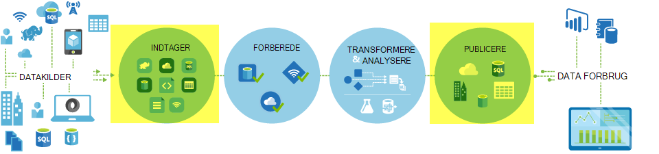
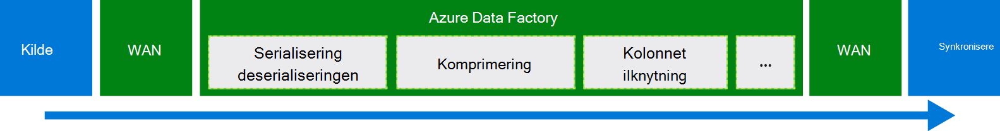
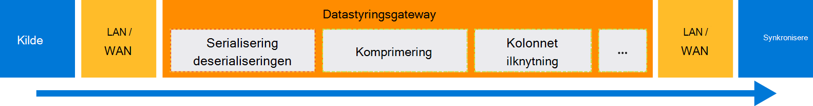

<properties
    pageTitle="Flytte data ved hjælp af kopi aktivitet | Microsoft Azure"
    description="Få mere at vide om flytning af data i Data Factory rørledninger: dataoverførsel mellem skyen butikker og mellem et lokalt lager og et lager til skyen. Brug Kopiér aktivitet."
    keywords="kopiere data, flytning af data, dataoverførsel, Overfør data"
    services="data-factory"
    documentationCenter=""
    authors="linda33wj"
    manager="jhubbard"
    editor="monicar"/>

<tags
    ms.service="data-factory"
    ms.workload="data-services"
    ms.tgt_pltfrm="na"
    ms.devlang="na"
    ms.topic="article"
    ms.date="09/22/2016"
    ms.author="jingwang"/>

# Flyt data ved hjælp af kopi aktivitet

## Oversigt
I Azure Data Factory, kan du bruge Kopiér aktivitet til at kopiere data fra forskellige figurer fra forskellige lokale og datakilder til Azure i skyen. Når dataene er kopieret, kan det være yderligere transformeret og analysere. Du kan også bruge Kopiér aktivitet publicere transformation og analyseresultaterne til business intelligence (BI) og programmet forbrug.

Kopiér aktivitet er drevet af en sikker, pålidelig og SVG, og [globalt tilgængelig tjeneste](#global). I denne artikel indeholder oplysninger om flytning af data i Data Factory og Kopiér aktivitet.

Først skal Lad os se, hvordan dataoverførsel sker mellem to skyen data butikker og mellem et lokalt datalager og et skybaseret datalager.

> [AZURE.NOTE] Hvis du vil vide mere om aktiviteter Generelt, se [forstå rørledninger og aktiviteter](data-factory-create-pipelines.md).

### Kopiere data mellem to skyen data butikker
Når der er både kilde- og sink data butikker i skyen, går kopi aktivitet via følgende trin til at kopiere data fra kilden til sink. Den tjeneste, der styrer kopi aktivitet:

1. Læser data fra datalager kilde.
2. Udfører serialisering/deserialisering, komprimering/kompression, kolonne knytter, og skriv konvertering. Det er tilfældet disse handlinger, der er baseret på konfigurationerne på input datasæt, output datasæt, og Kopiér aktivitet.
3.  Skriver data til data destinationslageret.

Tjenesten vælger automatisk det optimal område til at udføre flytning af data. Dette område er som regel tættest på datalager sink et.

### Kopiere data mellem et lokalt datalager og et skybaseret datalager
Hvis du vil sikkert flytte data mellem et lokalt datalager og et skybaseret datalager, skal du installere Datastyringsgateway på din lokale computer. Datastyringsgateway er en agent, der gør det muligt for flytning af data i hybride og behandling. Du kan installere det på den samme maskine, mens dataene gemmes sig selv, eller på en anden computer, der har adgang til data store.

I dette scenarie skal Datastyringsgateway udfører serialisering/deserialisering, komprimering/kompression, kolonne knytter, og skriv konvertering. Dataflow ikke i Azure Data Factory-tjenesten. I stedet skriver Datastyringsgateway direkte data til destinationslageret.

Se [flytte data mellem lokale miljø og skyen data butikker](data-factory-move-data-between-onprem-and-cloud.md) for en introduktion og gennemgang. Du kan finde detaljerede oplysninger om denne agent i [Datastyringsgateway](data-factory-data-management-gateway.md) .

Du kan også flytte data fra/til understøttes data butikker, der er placeret på Azure IaaS virtuelle maskiner (VM'er) ved hjælp af Datastyringsgateway. I dette tilfælde kan du installere Datastyringsgateway på den samme VM, mens dataene gemmes selve, eller på en separat VM, der har adgang til data store.

## Understøttede data butikker og formater
[AZURE.INCLUDE [data-factory-supported-data-stores](../../includes/data-factory-supported-data-stores.md)]

Hvis du vil flytte gemme data til/fra en data, Kopiér aktivitet ikke understøtter ved at bruge en **brugerdefineret aktivitet** i Data Factory med din egen logik til at kopiere/flytte data. Du kan finde oplysninger om oprettelse og brug af en brugerdefineret aktivitet, [Brug brugerdefinerede aktiviteter i en Azure Data Factory pipeline](data-factory-use-custom-activities.md).

### Understøttede filformater
Du kan bruge Kopiér aktivitet til at kopiere filer som-er mellem to fil-baserede data butikker, som Azure Blob, filsystem og HDFS. Hvis du vil gøre det, kan du springe i [afsnittet format](data-factory-create-datasets.md) i begge input- og outputområder datasæt definitionerne. Data, der er kopieret effektivt uden en hvilken som helst serialisering/deserialisering.

Kopiér aktivitet også læser fra og skriver til filer i angivne formater: tekst, Avro, ORC, Parquet og JSON. Du kan gøre følgende kopi aktiviteter, f.eks.:

-   Kopiér data i tekstformat (CSV) fra Azure Blob og skrive til Azure SQL-Database.
-   Kopiere filer i tekstformat (CSV) fra det lokale filsystem og skrive til Azure Blob i Avro format.
-   Kopierer data i Azure SQL-Database og skrive til HDFS lokalt i ORC format.

## Flytning af globalt tilgængelige data
Azure Data Factory findes kun i Vest USA, af USA og North Europe områder. Den tjeneste, der styrer kopi aktivitet er dog tilgængelig globalt i følgende områder og lande. Globalt tilgængelig topologien sikrer effektiv data bevægelse, der normalt undgår hop i tværs område. Du kan se [Services efter område](https://azure.microsoft.com/regions/#services) til tilgængeligheden af Data Factory og flytning af Data i et område.

### Kopiere data mellem skyen data butikker
Når der er både kilde- og sink data butikker i skyen, bruger Data Factory en tjeneste-installation i det område, der er tættest på sink i den samme Geografi til at flytte data. Referere til den følgende tabel til afbildning:

Område for destinationslageret data | Område, der bruges til flytning af data
:----------------------------------- | :----------------------------
Indtastning af østasiatiske USA | Indtastning af østasiatiske USA
Indtastning af østasiatiske USA 2 | Indtastning af østasiatiske USA 2
Vest USA | Vest USA
Vest USA 2 | Vest USA
Centrale USA | Centrale USA
Vest centrale USA | Centrale USA
Nord centrale USA | Nord centrale USA
Syd centrale USA | Syd centrale USA
Nord Europe | Nord Europe
Vest Europe | Vest Europe
Sydøstasien | Sydøstasien
Sydøstasien | Sydøstasien
Japan øst | Japan øst
Japan vest | Japan øst
Brasilien syd | Brasilien syd
Australien øst | Australien øst
Australien Sydøst | Australien Sydøst
Central Indien | Central Indien
Syd Indien | Central Indien
Vest Indien | Central Indien

> [AZURE.NOTE] Hvis området af destinationslageret data ikke er i den foregående liste, mislykkes kopi aktivitet i stedet for ved at følge en alternativ område.

### Kopiere data mellem et lokalt datalager og et skybaseret datalager
Når data kopieres mellem lokale (eller Azure virtuelle maskiner/IaaS) og skyen butikker, [Datastyringsgateway](data-factory-data-management-gateway.md) udfører flytning af data på et lokalt eller virtuel computer. Data, der flyder ikke gennem tjenesten i skyen, medmindre du bruger muligheden for [midlertidigt kopi](data-factory-copy-activity-performance.md#staged-copy) . I dette tilfælde flyder data gennem den midlertidige Azure Blob-lager, før den er skrevet i sink datalager.

## Oprette en rørledning med kopi aktivitet
Du kan oprette en rørledning med kopi aktiviteter i et par måder:

### Ved hjælp af guiden kopi
Guiden Kopier Factory hjælper dig med at oprette en rørledning med kopi aktivitet. Denne pipeline giver dig mulighed at kopiere data fra understøttede kilder til destinationer *uden at skrive JSON* definitioner for sammenkædede services, datasæt og rørledninger. Du kan finde oplysninger om guiden i [Data Factory kopi guiden](data-factory-copy-wizard.md) .  

### Ved hjælp af JSON scripts
Du kan bruge Data Factory Editor i Azure-portalen, Visual Studio eller Azure PowerShell til at oprette en JSON definition af en rørledning (ved hjælp af kopi aktivitet). Derefter kan du installere den for at oprette rørledningen i Data Factory. Se [Selvstudium: Brug Kopiér aktivitet i en Azure Data Factory pipeline](data-factory-copy-data-from-azure-blob-storage-to-sql-database.md) et selvstudium med trinvise instruktioner.    

JSON egenskaber (såsom navn, beskrivelse, input og output tabeller og politikker) er tilgængelige for alle typer aktiviteter. Egenskaber, der er tilgængelige i den `typeProperties` sektion aktivitetens varierer i forhold til hver aktivitetstype.

For kopi aktivitet på `typeProperties` sektion varierer afhængigt af typerne datakilder og sinks. Klik på en kilde sink i [understøttede datakilder og dræn](#supported-data-stores) afsnit for at få mere at vide om egenskaber, der understøtter Kopiér aktivitet for den pågældende data butik.   

Her er et eksempel JSON definition:

    {
      "name": "ADFTutorialPipeline",
      "properties": {
        "description": "Copy data from Azure blob to Azure SQL table",
        "activities": [
          {
            "name": "CopyFromBlobToSQL",
            "type": "Copy",
            "inputs": [
              {
                "name": "InputBlobTable"
              }
            ],
            "outputs": [
              {
                "name": "OutputSQLTable"
              }
            ],
            "typeProperties": {
              "source": {
                "type": "BlobSource"
              },
              "sink": {
                "type": "SqlSink",
                "writeBatchSize": 10000,
                "writeBatchTimeout": "60:00:00"
              }
            },
            "Policy": {
              "concurrency": 1,
              "executionPriorityOrder": "NewestFirst",
              "retry": 0,
              "timeout": "01:00:00"
            }
          }
        ],
        "start": "2016-07-12T00:00:00Z",
        "end": "2016-07-13T00:00:00Z"
      }
    }

Tidsplanen, der er defineret i datasættet output bestemmer, hvornår aktiviteten kører (for eksempel: **daglig**, hyppighed som **dag**og interval, der er **1**). Aktiviteten kopierer data fra et input datasæt (**kilde**) til et output datasæt (**sink**).

Du kan angive mere end én input dataset for at kopiere aktivitet. De bruges til at kontrollere afhængighederne, før aktiviteten kører. Dog kopieres kun dataene fra den første datasæt til destinationsdatasættet. Se [planlægning og udførelse af](data-factory-scheduling-and-execution.md)kan finde flere oplysninger.  

## Ydeevne og tilpasning
Se [kopi aktivitet ydeevne og justering vejledning](data-factory-copy-activity-performance.md), som beskriver vigtige faktorer, der påvirker ydeevnen for flytning af data (kopi aktivitet) i Azure Data Factory. Det også viser observerede ydeevnen under interne testen og diskuterer forskellige metoder til at optimere ydeevnen for kopi aktivitet.

## Planlægning og sekventielle kopi
Se [planlægning og udførelse af](data-factory-scheduling-and-execution.md) kan finde detaljerede oplysninger om, hvordan planlægnings- og udførelse af fungerer i Data Factory. Det er muligt at køre flere kopier operationer efter hinanden på en fortløbende/bestilt måde. I afsnittet [bestilt kopi](data-factory-scheduling-and-execution.md#ordered-copy) .

## Skriv konverteringer
Andre data butikker har forskellige indbyggede type systemer. Kopiér aktivitet udfører automatisk typekonverteringer fra kildetyper skal synkronisere typer med to-trins følgende fremgangsmåde:

1. Konvertere fra oprindelige kildetyper til typen af .NET.
2. Konvertere fra en .NET type til en oprindelig sink type.

Tilknytning fra et oprindelige type system til en .NET type til et datalager er i de respektive data store artikel. (Klik på linket bestemte i tabellen [understøttes data butikker](#supported-data-stores) .) Du kan bruge disse tilknytninger til at bestemme relevante typer mens du opretter dine tabeller, så kopi aktivitet udfører de rigtige konverteringer.

## Næste trin
- Hvis du vil vide mere om den kopi aktivitet, kan du se [kopiere data fra Azure Blob-lager til Azure SQL-Database](data-factory-copy-data-from-azure-blob-storage-to-sql-database.md).
- For at få mere for at vide om at flytte data fra et lokalt datalager til en skybaseret datalager, skal du se [flytte data fra lokale gemmer for at data i skyen](data-factory-move-data-between-onprem-and-cloud.md).
