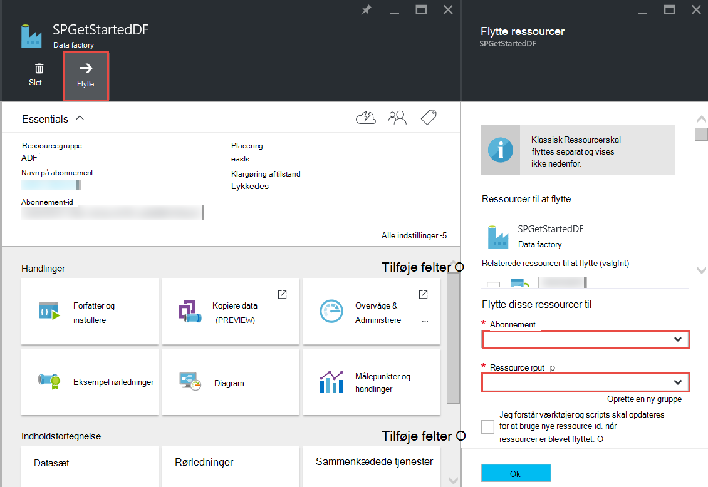

<properties 
    pageTitle="Azure Data Factory - ofte stillede spørgsmål" 
    description="Ofte stillede spørgsmål om Azure Data Factory." 
    services="data-factory" 
    documentationCenter="" 
    authors="sharonlo101" 
    manager="jhubbard" 
    editor="monicar"/>

<tags 
    ms.service="data-factory" 
    ms.workload="data-services" 
    ms.tgt_pltfrm="na" 
    ms.devlang="na" 
    ms.topic="article" 
    ms.date="09/12/2016" 
    ms.author="shlo"/>

# Azure Data Factory - ofte stillede spørgsmål

## Generelle spørgsmål

### Hvad er Azure Data Factory?

Data Factory er en skybaseret dataintegration af service, **automatisere flytning og transformation af data**. Ligesom en fabrik, der kører udstyr for at tage råvarer og omdanner dem til færdige varer, orchestrates Data Factory eksisterende tjenester, indsamle rækkedata og omdanne til klar til brug oplysninger. 
 
Data Factory kan du oprette datadrevne arbejdsprocesser for at flytte data mellem både i det lokale miljø og skyen data butikker samt proces/Transformer data ved hjælp af Beregn tjenester som Azure HDInsight og Azure Data sø analyser. Når du opretter en rørledning, som udfører den handling, du skal bruge, kan du planlægge at køre med jævne mellemrum (time, dagligt, ugentligt, osv.).   

Se [Oversigt over & nøgle begreber](data-factory-introduction.md) få mere at vide. 

### Hvor kan jeg finde priser detaljer for Azure Data Factory?

Se [Data Factory priser oplysningssiden] [ adf-pricing-details] til prisoplysninger for Azure Data Factory.  

### Hvordan kommer jeg i gang med Azure Data Factory?

- Se [Introduktion til Azure Data Factory](data-factory-introduction.md)for en oversigt over Azure Data Factory.
- Du kan finde et selvstudium om, hvordan du **kopiere/flytte data** ved hjælp af kopi aktivitet, [Kopiér data fra Azure Blob-lager til Azure SQL-Database](data-factory-copy-data-from-azure-blob-storage-to-sql-database.md).
- En vejledning i at **transformere data** ved hjælp af HDInsight Hive aktivitet. Se [proces data ved at køre Hive script på Hadoop klynge](data-factory-build-your-first-pipeline.md) 
  
### Hvad er den Data Factory område tilgængelighed?
Data Factory er tilgængelig i **USA Vest** og **North Europe**. Beregn og lager tjenesterne bruges af data fabrikker kan være i andre områder. Se [understøttede områder](data-factory-introduction.md#supported-regions). 
 
### Hvad er begrænsninger på antallet af data fabrikker/rørledninger/aktiviteter/datasæt?
 
Se **Azure Data Factory begrænsninger** afsnit i artiklen [Azure-abonnement og begrænsninger for tjenesten, kvoter, og begrænsninger](../azure-subscription-service-limits.md#data-factory-limits) .

### Hvad er redigering/udvikler oplevelsen med Azure Data Factory-tjenesten?

Du kan forfatter/oprette data fabrikker ved hjælp af en af følgende:

- **Azure portal**  
   på Data fabrik blade i portalen Azure giver omfattende brugergrænseflade for dig at oprette fabrikker ad sammenkædet datatjenester. **Data Factory Editor**, der er også en del af portalen, kan du nemt oprette sammenkædede services, tabeller, datasæt og rørledninger ved at angive JSON definitioner for disse elementer. Se [oprette din første data pipeline Azure portalen](data-factory-build-your-first-pipeline-using-editor.md) til et eksempel på ved hjælp af portalen/editor til at oprette og implementere en data fabrik.

- **Visual Studio**  
   du kan bruge Visual Studio til at oprette en Azure data factory. Se [oprette din første data pipeline ved hjælp af Visual Studio](data-factory-build-your-first-pipeline-using-vs.md) til detaljer. 

- **Azure PowerShell**  
   under [oprette og overvåge Azure Data Factory ved hjælp af Azure PowerShell](data-factory-build-your-first-pipeline-using-powershell.md) for en selvstudium gennemgang for at oprette en data fabrik ved hjælp af PowerShell. Se [Reference til Data Factory-Cmdlet] [ adf-powershell-reference] indhold på MSDN-biblioteket til en omfattende dokumentation af Data Factory-cmdletter.
   
- **.NET klassebibliotek**  
   fra et program kan du oprette data fabrikker ved hjælp af Data Factory .NET SDK. Se [oprette, overvåge, og administrer data fabrikker ved hjælp af .NET SDK](data-factory-create-data-factories-programmatically.md) for en gennemgang af oprettelse af en data fabrik ved hjælp af .NET SDK. Se [Reference til Data Factory klasse bibliotek] [ msdn-class-library-reference] til en omfattende dokumentation af Data Factory .NET SDK.

- **REST-API**  
   du kan også bruge den, der vises af tjenesten Azure Data Factory REST-API til at oprette og installere data fabrikker. Se [Reference til Data Factory RESTEN API] [ msdn-rest-api-reference] til en omfattende dokumentation af Data Factory REST-API.
 
- **Azure ressourcestyring skabelon** 
   se [Selvstudium: oprette din første Azure data factory ved hjælp af Azure ressourcestyring skabelon](data-factory-build-your-first-pipeline-using-arm.md) fo detaljer. 

### Kan jeg omdøbe en data fabrik?
Nej. Navnet på en Azure data factory kan ikke ændres, som andre Azure ressourcer. 

### Kan jeg flytte en fabrik data fra én Azure abonnement til en anden? 
Ja. Bruge knappen **Flyt** på dine data factory blade, som vist i følgende diagram. 

### Hvad er de Beregn-miljøer, der understøttes af Data Factory?
Den følgende tabel indeholder en liste over Beregn miljøer, der understøttes af Data Factory og de aktiviteter, der kan køre på dem. 

| Beregne miljø | aktiviteter |
| ------------------- | -------- | 
| [Efter behov HDInsight klynge](data-factory-compute-linked-services.md#azure-hdinsight-on-demand-linked-service) eller [din egen HDInsight klynge](data-factory-compute-linked-services.md#azure-hdinsight-linked-service) | [DotNet](data-factory-use-custom-activities.md) [Hive](data-factory-hive-activity.md) [gris](data-factory-pig-activity.md), [MapReduce](data-factory-map-reduce.md), og [Hadoop Streaming](data-factory-hadoop-streaming-activity.md) | 
| [Azure batchen](data-factory-compute-linked-services.md#azure-batch-linked-service) | [DotNet](data-factory-use-custom-activities.md) |  
| [Azure Machine Learning](data-factory-compute-linked-services.md#azure-machine-learning-linked-service) | [Maskine læ aktiviteter: udførelse af batchen og Opdater ressource](data-factory-azure-ml-batch-execution-activity.md) |
| [Azure Data sø Analytics](data-factory-compute-linked-services.md#azure-data-lake-analytics-linked-service) | [Data sø Analytics U-SQL](data-factory-usql-activity.md)
| [Azure SQL](data-factory-compute-linked-services.md#azure-sql-linked-service), [Azure SQL datawarehouse](data-factory-compute-linked-services.md#azure-sql-data-warehouse-linked-service), [SQL Server](data-factory-compute-linked-services.md#sql-server-linked-service) | [Lagret Procedure](data-factory-stored-proc-activity.md)

## Aktiviteter - ofte stillede spørgsmål
### Hvad er de forskellige typer aktiviteter, du kan bruge i en Data Factory pipeline? 

- [Data bevægelse aktiviteter](data-factory-data-movement-activities.md) til at flytte data.
- [Data Transformation aktiviteter](data-factory-data-transformation-activities.md) til proces/Transformer data. 

### Når kører en aktivitet?
Indstillingen **tilgængelighed** konfiguration i tabellen output data bestemmer, når aktiviteten køres. Hvis der er angivet input datasæt, aktiviteten kontrollerer, om alle de indtastede dataafhængigheder er opfyldt (det vil sige, **klar** tilstand) før den begynder at køre. 

## Kopiere aktivitet – ofte stillede spørgsmål
### Er det bedre at have en rørledning med flere aktiviteter eller en separat pipeline til hver aktivitet? 
Rørledninger skulle samle relaterede aktiviteter. Hvis de datasæt, der forbinder dem ikke er bruges af enhver anden aktivitet uden for rørledningen, kan du holde aktiviteterne i én pipeline. Denne måde, du ikke skal kæde pipeline aktive perioder så de justeres med hinanden. Desuden bevares dataintegriteten i tabellerne interne til rørledningen bedre, når du opdaterer rørledningen. Pipeline update grundlæggende stopper alle aktiviteterne inden for rørledningen, fjerner dem og opretter dem igen. Fra redigering perspektiv, kan det også være nemmere at se strømmen af data i de relaterede aktiviteter i én JSON-fil til en pipeline.

### Hvad er de understøttede data butikker?
[AZURE.INCLUDE [data-factory-supported-data-stores](../../includes/data-factory-supported-data-stores.md)]

### Hvad er de understøttede filformater? 
[AZURE.INCLUDE [data-factory-file-format](../../includes/data-factory-file-format.md)]

### Hvor udføres kopieringen? 
Se [flytning af globalt tilgængelig data i](data-factory-data-movement-activities.md#global) afsnittet Yderligere oplysninger. Kort sagt, når et lokalt datalager, der er nødvendigt, udføres kopieringen af Datastyringsgateway i dit lokale miljø. Og når der er på flytning af data mellem to butikker i skyen, kopieringen udføres i det område, der er tættest på sink placeringen i den samme Geografi. 

## HDInsight aktivitet – ofte stillede spørgsmål

### Hvilke områder, der understøttes af HDInsight?

Se afsnittet geografiske tilgængelighed i følgende artikel: eller [HDInsight priser oplysninger][hdinsight-supported-regions].

### Hvilket område bruges af en efter behov HDInsight klynge?

Efter behov HDInsight klynge oprettes i det samme område, hvor du har angivet skal bruges med klyngen opbevaring findes.    

### Sådan knytte ekstra lagerplads konti til din HDInsight klynge?

Hvis du bruger din egen HDInsight klynge (BYOC - tage dine egne klynge), kan du se følgende emner: 

- [Brug af en HDInsight klynge med alternative lagerplads konti og Metastores][hdinsight-alternate-storage]
- [Brug af ekstra lager konti med HDInsight Hive][hdinsight-alternate-storage-2]

Hvis du bruger en efter behov klynge, der er oprettet af Data Factory-tjenesten, kan du angive yderligere lagerplads konti til HDInsight sammenkædet tjenesten, så tjenesten Data Factory kan registrere dem på dine vegne. I JSON definitionen for tjenesten efter behov sammenkædet, skal du bruge **additionalLinkedServiceNames** egenskab til at angive alternative lagerplads konti som vist i følgende JSON kodestykket:
 
    {
        "name": "MyHDInsightOnDemandLinkedService",
        "properties":
        {
            "type": "HDInsightOnDemandLinkedService",
            "typeProperties": {
                "clusterSize": 1,
                "timeToLive": "00:01:00",
                "linkedServiceName": "LinkedService-SampleData",
                "additionalLinkedServiceNames": [ "otherLinkedServiceName1", "otherLinkedServiceName2" ] 
            }
        }
    } 

I det foregående eksempel repræsenterer otherLinkedServiceName1 og otherLinkedServiceName2 sammenkædede services Hvis definitioner indeholder legitimationsoplysninger, som HDInsight klyngen skal have adgang til alternative lagerplads konti.

## Udsnit – ofte stillede spørgsmål

### Hvorfor er min input udsnit ikke i klar tilstand?  
En meget almindelig fejl er ikke indstilling **eksterne** egenskab til **Sand** på input datasættet, når de indtastede data er ekstern i forhold til fabriksindstillingerne data (ikke oprettet af en data factory). 

I følgende eksempel skal du angive **eksterne** til sand på **dataset1**.  

**DataFactory1** Pipeline 1: dataset1 -> activity1 -> dataset2 -> activity2 -> dataset3 Pipeline 2: dataset3 -> activity3 -> dataset4

Hvis du har en anden data fabrik med en rørledning, der tager dataset4 (produceret af pipeline 2 i data factory 1), skal du markere dataset4 som en ekstern datasæt, fordi datasættet er oprettet med en anden data fabrik (DataFactory1, ikke DataFactory2).  

**DataFactory2**    
Pipeline 1: dataset4 -> activity4 -> dataset5

Hvis egenskaben eksterne er indstillet korrekt, kan du kontrollere, om inputdataene findes i den placering, der er angivet i definitionen af input datasæt. 

### Sådan køres et udsnit på et senere tidspunkt end midnat, når udsnittet er der oprettet dagligt?
Bruge egenskaben **forskydning** til at angive det tidspunkt, hvor du vil udsnittet skal være produceret. Se [datasæt tilgængelighed](data-factory-create-datasets.md#Availability) afsnittet Yderligere oplysninger om denne egenskab. Her er et hurtigt eksempel:

    "availability":
    {
        "frequency": "Day",
        "interval": 1,
        "offset": "06:00:00"
    }

Daglig udsnit begynde på **6 AM** i stedet for standard midnat.     

### Hvordan kan jeg køre et udsnit?
Du kan køre et udsnit i et af følgende måder: 

- Brug skærm og administrer App vil køre en i aktivitetsvinduet eller udsnit. Se [Kør den markerede aktivitet windows](data-factory-monitor-manage-app.md#re-run-selected-activity-windows) for vejledning.   
- Klik på **Kør** i kommandolinjen på bladet **DATA UDSNIT** for udsnit i portalen Azure.
- Køre **Sæt AzureRmDataFactorySliceStatus** cmdlet med Status er indstillet til **venter** for udsnittet.   
    
        Set-AzureRmDataFactorySliceStatus -Status Waiting -ResourceGroupName $ResourceGroup -DataFactoryName $df -TableName $table -StartDateTime "02/26/2015 19:00:00" -EndDateTime "02/26/2015 20:00:00" 

Se [Konfigurere AzureRmDataFactorySliceStatus] [ set-azure-datafactory-slice-status] få mere at vide om cmdlet. 

### Hvor lang tid tog det til at behandle et udsnit?
Brug aktivitet vinduet Explorer i skærm og administrer App for at vide, hvor lang tid det tog for at behandle et udsnit af data. Du kan finde oplysninger i [Aktivitet vinduet Stifinder](data-factory-monitor-manage-app.md#activity-window-explorer) . 

Du kan også gøre følgende i portalen Azure:  

1. Klik på feltet **datasæt** på bladet **DATA FACTORY** til dine data factory.
2. Klik på bestemte datasættet på bladet **datasæt** .
3. Vælg det udsnit, du er interesseret i, på listen **seneste udsnit** på bladet **tabel** .
4. Klik på den aktivitet, der går fra listen **Aktivitet kører** på bladet **DATA UDSNIT** . 
5. Klik på **Egenskaber for** feltet på bladet **Aktivitet køre detaljer** . 
6. Du bør se feltet **varighed** med en værdi. Denne værdi er det tid at behandle udsnittet.   

### Hvordan du kan standse en igangværende udsnit?
Hvis du vil stoppe pipeline køres, kan du bruge [Pause AzureRmDataFactoryPipeline](https://msdn.microsoft.com/library/mt603721.aspx) cmdlet. I øjeblikket stopper annullering af pipeline ikke de udsnit udførelser, der er i gang. Når du er færdig med igangværende udførelser, valgte ingen ekstra udsnit.

Hvis du virkelig vil stoppe alle udførelser med det samme, er den eneste måde til at slette rørledningen og oprette den igen. Hvis du vælger at slette rørledningen, behøver du ikke slette tabeller og sammenkædede tjenester, der bruges af pipeline. 

[create-factory-using-dotnet-sdk]: data-factory-create-data-factories-programmatically.md
[msdn-class-library-reference]: https://msdn.microsoft.com/library/dn883654.aspx
[msdn-rest-api-reference]: https://msdn.microsoft.com/library/dn906738.aspx

[adf-powershell-reference]: https://msdn.microsoft.com/library/dn820234.aspx 
[azure-portal]: http://portal.azure.com
[set-azure-datafactory-slice-status]: https://msdn.microsoft.com/library/mt603522.aspx

[adf-pricing-details]: http://go.microsoft.com/fwlink/?LinkId=517777
[hdinsight-supported-regions]: http://azure.microsoft.com/pricing/details/hdinsight/
[hdinsight-alternate-storage]: http://social.technet.microsoft.com/wiki/contents/articles/23256.using-an-hdinsight-cluster-with-alternate-storage-accounts-and-metastores.aspx
[hdinsight-alternate-storage-2]: http://blogs.msdn.com/b/cindygross/archive/2014/05/05/use-additional-storage-accounts-with-hdinsight-hive.aspx
 
