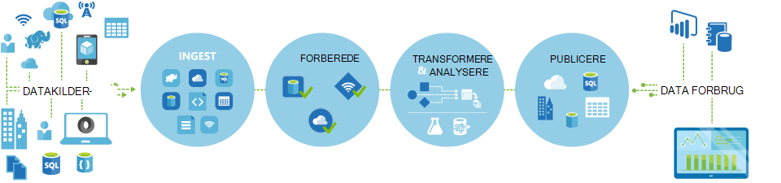

<properties 
    pageTitle="Introduktion til Data Factory, en integration datatjeneste | Microsoft Azure" 
    description="Få mere at vide, hvad er Azure Data Factory: en skybaseret data integration tjeneste, som orchestrates og automatisere bevægelse og transformation af data." 
    keywords="dataintegration, skyen dataintegration, hvad er azure data factory"
    services="data-factory" 
    documentationCenter="" 
    authors="sharonlo101" 
    manager="jhubbard" 
    editor="monicar"/>

<tags 
    ms.service="data-factory" 
    ms.workload="data-services" 
    ms.tgt_pltfrm="na" 
    ms.devlang="na" 
    ms.topic="get-started-article" 
    ms.date="09/22/2016" 
    ms.author="shlo"/>

# Introduktion til Azure Data Factory Service, en tjeneste til integration af data i skyen

## Hvad er Azure Data Factory? 
Data Factory er en skybaseret data integration tjeneste, som orchestrates og automatisere **flytning** og **transformation** af data. Du kan oprette data integration løsninger ved hjælp af tjenesten Data Factory, der kan indtager data fra forskellige data butikker, transformation/proces dataene og publicere resultatdata til data butikker. 

Factory datatjeneste kan du oprette data rørledninger, flytte og transformere data og derefter køre rørledningerne i en angivet plan (time, dagligt, ugentligt, osv.). Den indeholder også omfattende visualiseringer for at få vist om datakildeafstamning og afhængigheder mellem dine data rørledninger og overvåge alle rørledninger dine data fra en enkelt samlet visning til kan let udpege problemer og konfiguration af overvågning beskeder.

**Figure1.** Indtager data fra forskellige datakilder, forberede, transformere, og analysere dataene og derefter publicere klar til brug data til forbrug.

## Rørledninger og aktiviteter
I en Data Factory-løsning kan oprette du en eller flere data **rørledninger**. En rørledning er en logisk gruppering af aktiviteter. De bruges til at gruppeaktiviteter i en enhed, som sammen udføre en opgave. 

**Aktiviteter** definere handlinger til at udføre på dine data. For eksempel kan du bruge en kopi aktivitet for at kopiere data fra én datalager til en anden datalager. På samme måde, kan du bruge en Hive aktivitet, der kører en Hive forespørgsel på en Azure HDInsight-klynge for at transformere eller til at analysere dine data. Data Factory understøtter to typer aktiviteter: data bevægelse aktiviteter og data transformation aktiviteter. 
  
## Data bevægelse aktiviteter 
[AZURE.INCLUDE [data-factory-supported-data-stores](../../includes/data-factory-supported-data-stores.md)]

Se [Data bevægelse aktiviteter](data-factory-data-movement-activities.md) artikel for at få mere at vide. 

## Data transformation aktiviteter
[AZURE.INCLUDE [data-factory-transformation-activities](../../includes/data-factory-transformation-activities.md)]

Se [Data Transformation aktiviteter](data-factory-data-transformation-activities.md) artikel for at få mere at vide.

Hvis du vil flytte gemme data til/fra en data, Kopiér aktivitet ikke understøtter, eller transformere data ved hjælp af din egen logik, oprette en **brugerdefineret .NET aktivitet**. Du kan finde oplysninger om oprettelse og brug af en brugerdefineret aktivitet, [Brug brugerdefinerede aktiviteter i en Azure Data Factory pipeline](data-factory-use-custom-activities.md).

## Sammenkædede tjenester
Sammenkædede services definerer de oplysninger, der kræves at oprette forbindelse til eksterne ressourcer Data Factory (eksempler: Azure-lager, lokal SQL Server Azure HDInsight). Sammenkædede services bruges til to formål i Data Factory:

- Fil del eller en Azure Blob-lager-konto for at repræsentere en **data gemme** herunder, men ikke begrænset til, en lokal SQL Server, Oracle-database. Se afsnittet [Data bevægelse aktiviteter](data-factory-data-movement-activities.md) for en liste over understøttede data butikker. 
- Til at repræsentere en **beregne ressource** , der kan være vært for udførelse af en aktivitet. For eksempel kører HDInsightHive aktivitet på en HDInsight Hadoop-klynge. Se [Data transformation aktiviteter](data-factory-data-transformation-activities.md) sektion til en liste over understøttede Beregn miljøer. 

## Datasæt 
Sammenkædede services link data butikker til en Azure data factory. Datasæt repræsenterer datastrukturer med i data butikkerne. For eksempel indeholder en Azure-lager, der er sammenkædet tjeneste forbindelsesoplysninger for Data Factory til at oprette forbindelse til en Azure-lager-konto. En Azure Blob-datasæt angiver blob objektbeholder og mappe i den Azure Blob-lager, hvorfra pipeline skal læse dataene. På samme måde, en Azure SQL sammenkædet tjeneste indeholder forbindelsesoplysninger for en Azure SQL-database og et Azure SQL-datasæt angiver den tabel, der indeholder dataene.   

## Relation mellem Data Factory objekter
Data Factory har nogle vigtige enheder, der arbejder sammen til at definere input og output data, behandling af begivenheder og tidsplan og ressourcer, der kræves til at udføre den ønskede dataflow.

**Figur 2.** Relationer mellem datasæt, aktivitet, Pipeline og sammenkædede service

Med fire enkle begreberne sammenkædede services, datasæt, aktiviteter og rørledninger er du klar til at komme i gang! Du kan [oprette din første pipeline](data-factory-build-your-first-pipeline.md). 

## Understøttede områder
I øjeblikket, kan du oprette data fabrikker i **Vest USA**, **Af USA**og **North Europe** områder. Dog en data fabrik kan få adgang til data butikker og beregne tjenester i andre Azure områder til at flytte data mellem data butikker eller proces data ved hjælp af beregne tjenester. 

Azure Data Factory selve gemmer ikke data. Her kan du oprette datadrevne flyder for at dirigerer flytning af data mellem [understøttes data butikker](data-factory-data-movement-activities.md#supported-data-stores) og behandling af data ved hjælp af [beregne tjenester](data-factory-compute-linked-services.md) i andre områder eller i et lokalt miljø. Gør det også muligt at [overvåge og administrere arbejdsprocesser](data-factory-monitor-manage-pipelines.md) ved hjælp af begge programmeringsmæssig og Brugergrænsefladen mekanismer. 

Selvom Azure Data Factory er tilgængelig i kun **Vest USA**, **Af USA**og **North Europe** områder, er tjenesten tænd på flytning af data i Data Factory tilgængelige [globalt](data-factory-data-movement-activities.md#global) i flere områder. I tilfælde af et datalager bagved en firewall derefter en [Datastyringsgateway](data-factory-move-data-between-onprem-and-cloud.md) , der er installeret i dit lokale miljø, flyttes dataene i stedet. 

Et eksempel, Lad os antage, at din Beregn miljøer som Azure HDInsight klynge og Azure Machine Learning kører af Vest Europe område. Du kan oprette og bruge en Azure Data Factory forekomst i North Europa og bruge det til at planlægge opgaver på dit Beregn miljøer i Vest Europa. Det tager et par millisekunder for Data Factory udløses jobbet på Beregn-miljø, men tid til at køre jobbet på dit miljø ændres ikke.

Vi har til hensigt at har Azure Data Factory i hver Geografi, der understøttes af Azure i fremtiden.
  
## Næste trin
Hvis du vil se, hvordan du opretter data fabrikker med data rørledninger, Følg den trinvise vejledning i de følgende selvstudier. 

Selvstudium | Beskrivelse
-------- | -----------
[Oprette en data rørledning, der behandler data ved hjælp af Hadoop klynge](data-factory-build-your-first-pipeline.md) | I dette selvstudium bygge du din første Azure data med en data rørledning **processer data** ved at køre Hive script på en Azure HDInsight (Hadoop) klynge. |
[Oprette en data rørledning for at flytte data mellem to skyen data butikker](data-factory-copy-data-from-azure-blob-storage-to-sql-database.md) | I dette selvstudium opretter du en fabrik data med en rørledning, der **flytter data** fra Blob-lager til SQL-database.
[Oprette en data rørledning for at flytte data mellem et lokalt datalager og et skybaseret datalager, ved hjælp af Datastyringsgateway](data-factory-move-data-between-onprem-and-cloud.md) | I dette selvstudium bygge du en data med en rørledning, der **flytter data** fra en **lokal** SQL Server-database til en Azure blob. Som en del af denne gennemgang skal du installere og konfigurere Datastyringsgateway på din computer. 
