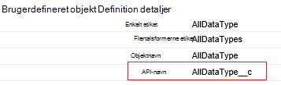
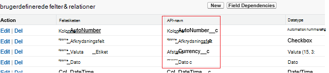

<properties
    pageTitle="Flytte data fra Salesforce ved hjælp af Data Factory | Microsoft Azure"
    description="Få mere at vide om, hvordan til at flytte data fra Salesforce ved hjælp af Azure Data Factory."
    services="data-factory"
    documentationCenter=""
    authors="linda33wj"
    manager="jhubbard"
    editor="monicar"/>

<tags
    ms.service="data-factory"
    ms.workload="data-services"
    ms.tgt_pltfrm="na"
    ms.devlang="na"
    ms.topic="article"
    ms.date="10/25/2016"
    ms.author="jingwang"/>

# Flytte data fra Salesforce ved hjælp af Azure Data Factory
I denne artikel beskrives, hvordan du kan bruge Kopiér aktivitet på en Azure data fabrik for at kopiere data fra Salesforce til en hvilken som helst datalager, der er angivet under kolonnen Sink i tabellen [understøttede datakilder og dræn](data-factory-data-movement-activities.md#supported-data-stores) . I denne artikel bygger på artiklen [data bevægelse aktiviteter](data-factory-data-movement-activities.md) , som indeholder en generel oversigt over flytning af data med kopi aktivitet og understøttede data store kombinationer.

Azure Data Factory understøtter i øjeblikket kun flytte data fra Salesforce [understøttede sink data stores]((data-factory-data-movement-activities.md#supported-data-stores), men ikke understøttelse af flytte data fra andre data butikker til Salesforce bruges.

## Forudsætninger
- Du skal bruge en af følgende versioner af Salesforce: Developer Edition, Professional Edition, Enterprise Edition eller ubegrænset Edition.
- API tilladelse skal være aktiveret. Se [Hvordan aktiverer jeg API-adgang i Salesforce ved tilladelsessæt?](https://www.data2crm.com/migration/faqs/enable-api-access-salesforce-permission-set/)
- Hvis du vil kopiere data fra Salesforce til lokale data butikker, skal du mindst have Data Management Gateway 2.0 installeret i dit lokale miljø.

## Begrænsninger for Salesforce-anmodning
Salesforce har begrænsninger for både samlet antal API-anmodninger og samtidige API-anmodninger. Se afsnittet "API anmode om begrænsninger" i artiklen [Salesforce udvikler begrænsninger](http://resources.docs.salesforce.com/200/20/en-us/sfdc/pdf/salesforce_app_limits_cheatsheet.pdf) for detaljer. Bemærk Hvis antallet af samtidige anmodninger overstiger grænsen, throttling opstår, og du får vist tilfældige fejl Hvis det samlede antal anmodninger overstiger grænsen, blokeres Salesforce-konto i 24 timer. Du kan også modtage fejlen "REQUEST_LIMIT_EXCEEDED" i begge scenarier.

## Kopiere guiden Data
Den nemmeste måde at oprette en rørledning, der blev kopieret data fra Salesforce til en af de understøttede sink data butikker er at bruge guiden Kopier Data. Se [Selvstudium: oprette en kopi guiden pipeline](data-factory-copy-data-wizard-tutorial.md) for en hurtig gennemgang på at oprette en rørledning ved hjælp af guiden Kopier Data.

I følgende eksempel indeholder eksempel JSON definitioner, som du kan bruge til at oprette en pipeline ved hjælp af [Azure-portalen](data-factory-copy-activity-tutorial-using-azure-portal.md), [Visual Studio](data-factory-copy-activity-tutorial-using-visual-studio.md)eller [Azure PowerShell](data-factory-copy-activity-tutorial-using-powershell.md). De viser, hvordan du kopierer data fra Salesforce til Azure Blob-lager. Data kan dog kopieres til en af de dræn angivet [her](data-factory-data-movement-activities.md#supported-data-stores) ved hjælp af den kopi aktivitet på Azure Data fabrik.   

## Eksempel: Kopiere data fra Salesforce til en Azure blob
Dette eksempel kopierer data fra Salesforce til en Azure blob hver time. De JSON-egenskaber, der bruges i disse eksempler er beskrevet i afsnittene efter eksemplerne. Du kan kopiere data direkte til en af vaskene, der er angivet i artiklen [data bevægelse aktiviteter](data-factory-data-movement-activities.md#supported-data-stores) ved hjælp af kopi aktivitet i Azure Data Factory.

Her er de Data Factory-elementer, du skal bruge til at oprette for at implementere dette scenario. De afsnit, som følger listen indeholder oplysninger om disse trin.

- En sammenkædet tjeneste af typen [Salesforce](#salesforce-linked-service-properties)
- En sammenkædet tjeneste af typen [AzureStorage](data-factory-azure-blob-connector.md#azure-storage-linked-service-properties)
- En input [datasæt](data-factory-create-datasets.md) af typen [RelationalTable](#salesforce-dataset-properties)
- En output [datasæt](data-factory-create-datasets.md) af typen [AzureBlob](data-factory-azure-blob-connector.md#azure-blob-dataset-type-properties)
- En [rørledning](data-factory-create-pipelines.md) med kopi aktiviteter, der bruger [RelationalSource](#relationalsource-type-properties) og [BlobSink](data-factory-azure-blob-connector.md#azure-blob-copy-activity-type-properties)

**Sammenkædet Salesforce-tjenesten**

I dette eksempel bruger tjenesten **Salesforce** sammenkædet. I afsnittet [Salesforce sammenkædet service](#salesforce-linked-service-properties) for de egenskaber, der understøttes af denne sammenkædede tjeneste.  Se [få sikkerhedstoken](https://help.salesforce.com/apex/HTViewHelpDoc?id=user_security_token.htm) for vejledning i at nulstille/få sikkerheds-id.

    {
        "name": "SalesforceLinkedService",
        "properties":
        {
            "type": "Salesforce",
            "typeProperties":
            {
                "username": "<user name>",
                "password": "<password>",
                "securityToken": "<security token>"
            }
        }
    }

**Azure sammenkædet lagringstjeneste**

    {
      "name": "AzureStorageLinkedService",
      "properties": {
        "type": "AzureStorage",
        "typeProperties": {
          "connectionString": "DefaultEndpointsProtocol=https;AccountName=<accountname>;AccountKey=<accountkey>"
        }
      }
    }

**Salesforce input datasæt**

    {
        "name": "SalesforceInput",
        "properties": {
            "linkedServiceName": "SalesforceLinkedService",
            "type": "RelationalTable",
            "typeProperties": {
                "tableName": "AllDataType__c"  
            },
            "availability": {
                "frequency": "Hour",
                "interval": 1
            },
            "external": true,
            "policy": {
                "externalData": {
                    "retryInterval": "00:01:00",
                    "retryTimeout": "00:10:00",
                    "maximumRetry": 3
                }
            }
        }
    }

Angive **eksterne** til **Sand** oplyser tjenesten Data Factory, datasættet er ekstern i forhold til data fabrik og er ikke oprettet med en aktivitet i data factory.

> [AZURE.IMPORTANT] "__C" en del af det API-navn er nødvendig for et brugerdefineret objekt.

**Azure blob output datasæt**

Data skrives til en ny blob hver time (frekvens: time, interval: 1).

    {
        "name": "AzureBlobOutput",
        "properties":
        {
            "type": "AzureBlob",
            "linkedServiceName": "AzureStorageLinkedService",
            "typeProperties":
            {
                "folderPath": "adfgetstarted/alltypes_c"
            },
            "availability":
            {
                "frequency": "Hour",
                "interval": 1
            }
        }
    }

**Rørledning med kopi aktivitet**

Pipeline indeholder kopi aktivitet, som er konfigureret til at bruge den ovenstående input og output datasæt, og er planlagt til at køre hver time. I rørledningen JSON definition **kildetypen** er indstillet til **RelationalSource**og **sink** type er indstillet til **BlobSink**.

Se [Egenskaber for RelationalSource](#relationalsource-type-properties) til listen over egenskaber, der understøttes af RelationalSource.

    {  
        "name":"SamplePipeline",
        "properties":{  
            "start":"2016-06-01T18:00:00",
            "end":"2016-06-01T19:00:00",
            "description":"pipeline with copy activity",
            "activities":[  
            {
                "name": "SalesforceToAzureBlob",
                "description": "Copy from Salesforce to an Azure blob",
                "type": "Copy",
                "inputs": [
                {
                    "name": "SalesforceInput"
                }
                ],
                "outputs": [
                {
                    "name": "AzureBlobOutput"
                }
                ],
                "typeProperties": {
                    "source": {
                        "type": "RelationalSource",
                        "query": "SELECT Id, Col_AutoNumber__c, Col_Checkbox__c, Col_Currency__c, Col_Date__c, Col_DateTime__c, Col_Email__c, Col_Number__c, Col_Percent__c, Col_Phone__c, Col_Picklist__c, Col_Picklist_MultiSelect__c, Col_Text__c, Col_Text_Area__c, Col_Text_AreaLong__c, Col_Text_AreaRich__c, Col_URL__c, Col_Text_Encrypt__c, Col_Lookup__c FROM AllDataType__c"             
                    },
                    "sink": {
                        "type": "BlobSink"
                    }
                },
                "scheduler": {
                    "frequency": "Hour",
                    "interval": 1
                },
                "policy": {
                    "concurrency": 1,
                    "executionPriorityOrder": "OldestFirst",
                    "retry": 0,
                    "timeout": "01:00:00"
                }
            }
            ]
        }
    }

> [AZURE.IMPORTANT] "__C" en del af det API-navn er nødvendig for et brugerdefineret objekt.

## Egenskaber for Salesforce sammenkædet tjenesten

Den følgende tabel indeholder en beskrivelse til JSON elementer, der er specifikke for tjenesten Salesforce sammenkædet.

| Egenskaben | Beskrivelse | Påkrævet |
| -------- | ----------- | -------- |
| type | Typeegenskaben skal være angivet til: **Salesforce**. | Ja |
| brugernavn |Angive et brugernavn for brugerkontoen. | Ja |
| adgangskode | Angive en adgangskode for kontoen.  | Ja |
| securityToken | Angiv et sikkerhedstoken til brugerkontoen. Se [få sikkerhedstoken](https://help.salesforce.com/apex/HTViewHelpDoc?id=user_security_token.htm) for vejledning i at nulstille/få et sikkerhedstoken. For at få mere for at vide om sikkerhed i tokens Generelt, [sikkerhed og API](https://developer.salesforce.com/docs/atlas.en-us.api.meta/api/sforce_api_concepts_security.htm).  | Ja |

## Salesforce-datasæt egenskaber

En komplet liste over sektioner og egenskaber, der er tilgængelige til at definere datasæt, skal du se artiklen [opretter datasæt](data-factory-create-datasets.md) . Afsnit som struktur, tilgængelighed og politik for et datasæt JSON er de samme for alle typer datasæt (Azure SQL Azure blob, Azure table og osv.).

Afsnittet **typeProperties** er forskellige for hver type datasæt og indeholder oplysninger om placeringen af data i lageret med data. Sektionen typeProperties for et datasæt af typen **RelationalTable** har følgende egenskaber:

| Egenskaben | Beskrivelse | Påkrævet |
| -------- | ----------- | -------- |
| Tabelnavn | Navnet på tabellen i Salesforce. | Ingen (Hvis der er angivet en **forespørgsel** med **RelationalSource** ) |

> [AZURE.IMPORTANT]  "__C" en del af det API-navn er nødvendig for et brugerdefineret objekt.

## Egenskaber for RelationalSource

En komplet liste over sektioner og egenskaber, der er tilgængelige til at definere aktiviteter, skal du se artiklen [opretter rørledninger](data-factory-create-pipelines.md) . Egenskaber som navn, beskrivelse, input og output tabeller og forskellige politikker, som er tilgængelige for alle typer aktiviteter.

De egenskaber, der er tilgængelige i sektionen typeProperties for aktiviteten, varierer på den anden side med hver aktivitetstype. De varierer afhængigt af typerne datakilder og dræn for kopi aktivitet.

Kopiér aktivitet, når kilden er af typen **RelationalSource** (som indeholder Salesforce), findes følgende egenskaber i typeProperties afsnit:

| Egenskaben | Beskrivelse | Tilladte værdier | Påkrævet |
| -------- | ----------- | -------------- | -------- |
| forespørgsel | Brug den brugerdefinerede forespørgsel til at læse data. | En SQL-92 forespørgsel eller [Salesforce objekt forespørgsel sprog (SOQL)](https://developer.salesforce.com/docs/atlas.en-us.soql_sosl.meta/soql_sosl/sforce_api_calls_soql.htm) forespørgsel. For eksempel: `select * from MyTable__c`. | Ingen (Hvis der er angivet **tabelnavn** af **datasæt** ) |

> [AZURE.IMPORTANT] "__C" en del af det API-navn er nødvendig for et brugerdefineret objekt.

## Tip til

### Hente data ved hjælp af hvor delsætning på DateTime-kolonne
Når du angiver SOQL eller SQL-forespørgslen, løn opmærksomheden på DateTime-format forskellen. Eksempel:

- **SOQL eksempel**: $$Text.Format (' Vælg-Id, navn, BillingCity fra konto hvor LastModifiedDate > = {0:yyyy-MM-ddTHH:mm:ssZ} og dato for seneste ændring < {1:yyyy-MM-ddTHH:mm:ssZ}', WindowStart, WindowEnd)
- **SQL-eksempel**: $$Text.Format ("Vælg * fra kontoen hvor LastModifiedDate > = {{ts\'{0:yyyy-MM-dd HH:mm:ss}\'}} og dato for seneste ændring < {{ts\'{1:yyyy-MM-dd HH:mm:ss}\'}}', WindowStart, WindowEnd)'.

### Hente data fra Salesforce-rapport
Du kan hente data fra Salesforce-rapporter ved at angive forespørgsel som `{call "<report name>"}`, f.eks. `"query": "{call \"TestReport\"}"`.

### Hente slettet poster fra Salesforce Papirkurv
Hvis du vil forespørge bløde slettede poster fra Salesforce papirkurven, kan du angive **"IsDeleted = 1"** i forespørgslen. For eksempel 

- Hvis du vil forespørge kun de slettede poster, skal du angive "Vælg *MyTable__c * *hvor IsDeleted = 1**"
- Hvis du vil forespørge alle de poster, herunder den nuværende og den slettede, angive "Vælg *MyTable__c * *hvor IsDeleted = 0 eller IsDeleted = 1**"

[AZURE.INCLUDE [data-factory-structure-for-rectangualr-datasets](../../includes/data-factory-structure-for-rectangualr-datasets.md)]

### Tilknytning til Salesforce
Salesforce-type | . Nettooversigt-baserede type
--------------- | ---------------
Automatisk nummerering | Streng
Afkrydsningsfelt | Boolesk værdi
Valuta | Dobbelt
Dato | Dato og klokkeslæt
Dato og klokkeslæt | Dato og klokkeslæt
Mail | Streng
Id | Streng
Opslag relation | Streng
Markér flere valgliste | Streng
Tal | Dobbelt
Procent | Dobbelt
Telefon | Streng
Valgliste | Streng
Tekst | Streng
Tekstområde | Streng
Tekstområde (langt heltal) | Streng
Tekstområde (RTF) | Streng
Tekst (krypteret) | Streng
URL-ADRESSE | Streng

[AZURE.INCLUDE [data-factory-column-mapping](../../includes/data-factory-column-mapping.md)]
[AZURE.INCLUDE [data-factory-structure-for-rectangualr-datasets](../../includes/data-factory-structure-for-rectangualr-datasets.md)]

## Ydeevne og tilpasning  
Se [kopi aktivitet ydeevne og justering vejledning](data-factory-copy-activity-performance.md) til at få mere at vide om vigtige faktorer, der virkning ydeevnen for flytning af data (kopi aktivitet) i Azure Data Factory og forskellige måder at optimere den.
