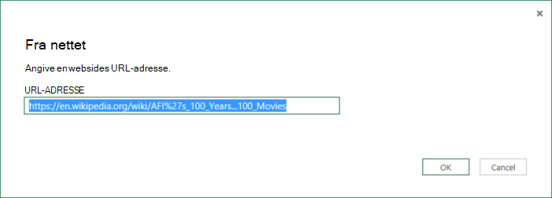

<properties 
    pageTitle="Flytte data fra Webtabel | Azure Data Factory" 
    description="Få mere at vide om, hvordan til at flytte data fra det lokale en tabel i en webside i Azure Data Factory." 
    services="data-factory" 
    documentationCenter="" 
    authors="linda33wj" 
    manager="jhubbard" 
    editor="monicar"/>

<tags 
    ms.service="data-factory" 
    ms.workload="data-services" 
    ms.tgt_pltfrm="na" 
    ms.devlang="na" 
    ms.topic="article" 
    ms.date="09/26/2016" 
    ms.author="jingwang"/>

# Flytte data fra et websted i tabel, der bruger Azure Data Factory
I denne artikel beskrives, hvordan du kan bruge den kopi aktivitet på en Azure data fabrik for at kopiere data fra en tabel i en webside til en anden datalager. I denne artikel bygger på artiklen [data bevægelse aktiviteter](data-factory-data-movement-activities.md) , som indeholder en generel oversigt over flytning af data med kopi aktivitet og understøttede data store kombinationer.

Data factory understøtter i øjeblikket kun flytte data fra en webtabel til andre data butikker, men ikke flytte data fra andre data gemmer til en Web tabel destination.

> [AZURE.NOTE] Web forbindelsen understøtter i øjeblikket kun og tabelindhold fra en HTML-side.

## Eksempel: Kopiere data fra webtabel til Azure Blob

Eksemplet nedenfor viser:

1.  En sammenkædet tjeneste af typen [Web](#web-linked-service-properties).
2.  En sammenkædet tjeneste af typen [AzureStorage](data-factory-azure-blob-connector.md#azure-storage-linked-service-properties).
3.  En input [datasæt](data-factory-create-datasets.md) af typen [WebTable](#WebTable-dataset-properties).
4.  En output [datasæt](data-factory-create-datasets.md) af typen [AzureBlob](data-factory-azure-blob-connector.md#azure-blob-dataset-type-properties).
4.  En [rørledning](data-factory-create-pipelines.md) med kopi aktiviteter, der bruger [WebSource](#websource-copy-activity-type-properties) og [BlobSink](data-factory-azure-blob-connector.md#azure-blob-copy-activity-type-properties).

Eksemplet kopierer data fra en webtabel til en Azure blob hver time. De JSON egenskaber, der bruges i disse eksempler er beskrevet i følge eksemplerne sektioner. 

I følgende eksempel viser, hvordan du kopierer data fra en webtabel til en Azure blob. Dog kan kopieres data direkte til en af de dræn, der er angivet i artiklen [Data bevægelse aktiviteter](data-factory-data-movement-activities.md) ved hjælp af den kopi aktivitet i Azure Data Factory. 

**Web sammenkædet service** I dette eksempel bruges webtjenesten, der er sammenkædet med anonym godkendelse. Se [Web sammenkædet service](#web-linked-service-properties) afsnittet for forskellige typer godkendelse, kan du bruge. 

    {
        "name": "WebLinkedService",
        "properties":
        {
            "type": "Web",
            "typeProperties":
            {
                "authenticationType": "Anonymous",
                "url" : "https://en.wikipedia.org/wiki/"
            }
        }
    }

**Azure sammenkædet lagringstjeneste**

    {
      "name": "AzureStorageLinkedService",
      "properties": {
        "type": "AzureStorage",
        "typeProperties": {
          "connectionString": "DefaultEndpointsProtocol=https;AccountName=<accountname>;AccountKey=<accountkey>"
        }
      }
    }

**WebTable input datasæt** Angive **eksterne** til **Sand** oplyser tjenesten Data Factory, datasættet er ekstern i forhold til data fabrik og er ikke oprettet med en aktivitet i data factory.

> [AZURE.NOTE] Se [få indekset for en tabel i en HTML-side](#get-index-of-a-table-in-an-html-page) afsnittet for trin for at få indeks i en tabel i en HTML-side.  

    
    {
        "name": "WebTableInput",
        "properties": {
            "type": "WebTable",
            "linkedServiceName": "WebLinkedService",
            "typeProperties": {
                "index": 1,
                "path": "AFI's_100_Years...100_Movies"
            },
            "external": true,
            "availability": {
                "frequency": "Hour",
                "interval":  1
            }
        }
    }

**Azure Blob output datasæt**

Data skrives til en ny blob hver time (frekvens: time, interval: 1). 

    {
        "name": "AzureBlobOutput",
        "properties":
        {
            "type": "AzureBlob",
            "linkedServiceName": "AzureStorageLinkedService",
            "typeProperties":
            {
                "folderPath": "adfgetstarted/Movies"
            },
            "availability":
            {
                "frequency": "Hour",
                "interval": 1
            }
        }
    }

**Rørledning med kopi aktiviteter**

Pipeline indeholder en kopi aktivitet, der er konfigureret til at bruge den ovenstående input og output datasæt og er planlagt til at køre hver time. **Kildetypen** er indstillet til **WebSource** i pipeline JSON definition, og **sink** type er indstillet til **BlobSink**. 

Se [Egenskaber for WebSource](#websource-copy-activity-type-properties) til listen over egenskaber, der understøttes af WebSource. 
    
    {  
        "name":"SamplePipeline",
        "properties":{  
        "start":"2014-06-01T18:00:00",
        "end":"2014-06-01T19:00:00",
        "description":"pipeline with copy activity",
        "activities":[  
          {
            "name": "WebTableToAzureBlob",
            "description": "Copy from a Web table to an Azure blob",
            "type": "Copy",
            "inputs": [
              {
                "name": "WebTableInput"
              }
            ],
            "outputs": [
              {
                "name": "AzureBlobOutput"
              }
            ],
            "typeProperties": {
              "source": {
                "type": "WebSource"
              },
              "sink": {
                "type": "BlobSink"
              }
            },
           "scheduler": {
              "frequency": "Hour",
              "interval": 1
            },
            "policy": {
              "concurrency": 1,
              "executionPriorityOrder": "OldestFirst",
              "retry": 0,
              "timeout": "01:00:00"
            }
          }
          ]
       }
    }

## Egenskaber for Web sammenkædede Service

Den følgende tabel indeholder en beskrivelse til JSON-elementer, der er specifikke for sammenkædede webtjeneste.

| Egenskaben | Beskrivelse | Påkrævet |
| -------- | ----------- | -------- | 
| type | Typeegenskaben skal være angivet til: **Web** | Ja | 
| URL-adresse | URL-adressen til webstedet | Ja |
| authenticationType | Anonym eller grundlæggende. | Ja |
| Brugernavn | Brugernavn til basisgodkendelse. | Ja (for basisgodkendelse)
| adgangskode | Adgangskode til basisgodkendelse. | Ja (for basisgodkendelse)

### Ved hjælp af anonym godkendelse

    {
        "name": "web",
        "properties":
        {
            "type": "Web",
            "typeProperties":
            {
                "authenticationType": "Anonymous",
                "url" : "https://en.wikipedia.org/wiki/"
            }
        }
    }

### Ved hjælp af grundlæggende godkendelse
    
    {
        "name": "web",
        "properties":
        {
            "type": "Web",
            "typeProperties":
            {
                "authenticationType": "basic",
                "url" : "http://myit.mycompany.com/",
                "userName": "Administrator",
                "password": "password"
            }
        }
    }

## WebTable datasæt egenskaber

En komplet liste over sektioner og egenskaber, der er tilgængelige til at definere datasæt, findes i artiklen [oprette datasæt](data-factory-create-datasets.md) . Afsnit som struktur, tilgængelighed og politik for et datasæt JSON er de samme for alle datasæt typer (Azure SQL Azure blob, Azure table osv.).

Afsnittet **typeProperties** er forskellige for hver type datasæt og indeholder oplysninger om placeringen af data i lageret med data. Sektionen typeProperties for dataset af typen **WebTable** har følgende egenskaber

Egenskaben | Beskrivelse | Påkrævet
:-------- | :----------- | :--------
type    | type af datasættet. være indstillet til **WebTable** | Ja
sti | En relativ URL-adressen til den ressource, der indeholder tabellen. | Nej. Når der ikke angives sti, bruges kun den angivne URL-adresse i definitionen af sammenkædede tjenesten. 
indeks | Indekset for tabellen i ressourcen. Se [få indekset for en tabel i en HTML-side](#get-index-of-a-table-in-an-html-page) afsnittet for trin for at få indeks i en tabel i en HTML-side. | Ja

**Eksempel:**

    {
        "name": "WebTableInput",
        "properties": {
            "type": "WebTable",
            "linkedServiceName": "WebLinkedService",
            "typeProperties": {
                "index": 1,
                "path": "AFI's_100_Years...100_Movies"
            },
            "external": true,
            "availability": {
                "frequency": "Hour",
                "interval":  1
            }
        }
    }

## WebSource - kopi aktivitet typeegenskaber

En komplet liste over sektioner og egenskaber, der er tilgængelige til at definere aktiviteter, findes i artiklen [Oprette rørledninger](data-factory-create-pipelines.md) . Egenskaber som navn, beskrivelse, input og output tabeller og politik er tilgængelige for alle typer aktiviteter. 

Tilgængelige egenskaber i sektionen typeProperties aktivitetens afhænger på den anden side af hver aktivitetstype. De varierer afhængigt af typerne datakilder og dræn for kopi aktivitet.

Ingen yderligere egenskaber, der understøttes i øjeblikket, når der er kilde i kopi aktivitet af typen **WebSource**. 

## Få indeks i en tabel i en HTML-side

1. Start **Excel 2016** , og Skift til fanen **Data** .  
2. Klik på **Ny forespørgsel** på værktøjslinjen, peg på **Fra andre kilder** , og klik på **Fra Web**.
    
     
3. Angiv **URL-adresse** , du vil bruge i sammenkædede tjeneste JSON i dialogboksen **Fra Web** (for eksempel: https://en.wikipedia.org/wiki/) sammen med stien, du vil angive for datasættet (for eksempel: AFI % 27s_100_Years... 100_Movies), og klik på **OK**. 

     

    URL-adresse i dette eksempel bruges: https://en.wikipedia.org/wiki/AFI%27s_100_Years...100_Movies 
4.  Hvis du får vist dialogboksen **Access Web-indhold** , vælge den rigtige **URL-adresse**, **godkendelse**, og klik på **Opret forbindelse**. 

    
5.  Klik på en **tabel** elementet i træstrukturen for at se indhold fra tabellen og derefter klikke på knappen **Rediger** nederst.  

     

5. Klik på **Avanceret Editor** knap på værktøjslinjen i vinduet **Query Editor** .

    

6. I dialogboksen Avanceret Editor er antallet ud for "Kilde" indekset.

     

Hvis du bruger Excel 2013, kan du bruge [Microsoft Power-forespørgsel til Excel](https://www.microsoft.com/download/details.aspx?id=39379) til at få indekset. Se [oprette forbindelse til en webside](https://support.office.com/article/Connect-to-a-web-page-Power-Query-b2725d67-c9e8-43e6-a590-c0a175bd64d8) artikel for at få mere at vide. Trinene er de samme, hvis du bruger [Microsoft Power BI til skrivebordet](https://powerbi.microsoft.com/desktop/). 

[AZURE.INCLUDE [data-factory-column-mapping](../../includes/data-factory-column-mapping.md)]

[AZURE.INCLUDE [data-factory-structure-for-rectangualr-datasets](../../includes/data-factory-structure-for-rectangualr-datasets.md)]

## Ydeevne og tilpasning  
Se [kopi aktivitet ydeevne og justering af vejledning](data-factory-copy-activity-performance.md) til at få mere at vide om vigtige faktorer, der virkning ydeevnen for flytning af data (kopi aktivitet) i Azure Data Factory og forskellige måder at optimere den.
