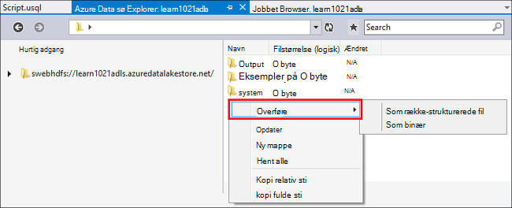
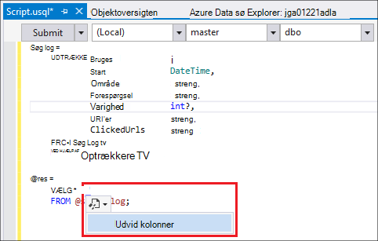
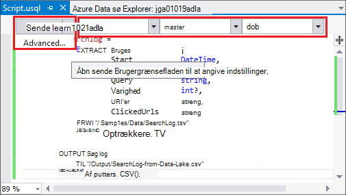
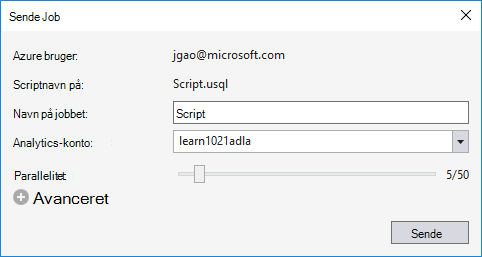
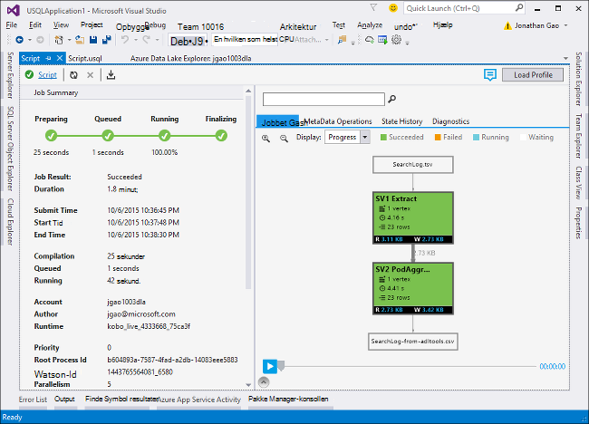
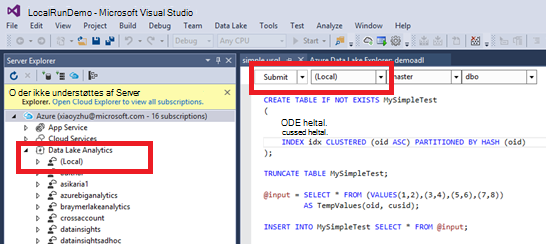
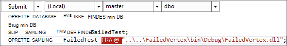

<properties
   pageTitle="Udvikle U-SQL-scripts ved hjælp af Data sø Tools til Visual Studio | Azure"
   description="Få mere at vide, hvordan du installerer Data sø Tools til Visual Studio, hvordan du udvikler og U-SQL-testscripts. "
   services="data-lake-analytics"
   documentationCenter=""
   authors="edmacauley"
   manager="jhubbard"
   editor="cgronlun"/>

<tags
   ms.service="data-lake-analytics"
   ms.devlang="na"
   ms.topic="get-started-article"
   ms.tgt_pltfrm="na"
   ms.workload="big-data"
   ms.date="05/16/2016"
   ms.author="edmaca"/>

# Selvstudium: udvikle U-SQL-scripts ved hjælp af Data sø Tools til Visual Studio

[AZURE.INCLUDE [get-started-selector](../../includes/data-lake-analytics-selector-get-started.md)]

Lær, hvordan du installerer Data sø Tools til Visual Studio og bruger Data sø Tools til Visual Studio til at skrive og teste U-SQL-scripts.

U-SQL er et hyper-SVG, med fleksible udvidelsesmuligheder sprog til forberedelse af, at transformere og analyse af alle data i data sø og fremover. Du kan finde yderligere oplysninger finder [U-SQL Reference] (http://go.microsoft.com/fwlink/p/?LinkId=691348).

##Forudsætninger

- **Visual Studio 2015, Visual Studio 2013 Opdater 4 eller Visual Studio 2012. Enterprise (Ultimate/Premium), professionel, Community udgaver understøttes. Hurtig edition understøttes ikke. Visual Studio "15" understøttes ikke i øjeblikket, og vi arbejder på.**
- **Microsoft Azure SDK til .NET version 2.7.1 eller derover**.  Installere det ved hjælp af [Web platform installer](http://www.microsoft.com/web/downloads/platform.aspx).
- **[Data sø Tools til Visual Studio](http://aka.ms/adltoolsvs)**.

    Når Data sø Tools til Visual Studio er installeret, kan du får vist en "Data sø Analytics" node i Server Explorer under noden "Azure" (du kan åbne Server explorer ved at trykke på Ctrl + Alt + S).

- **Gennemgå de følgende to afsnit i [Introduktion til Azure Data sø Analytics Azure portalen](data-lake-analytics-get-started-portal.md)**.

    - [Opret en Azure Data sø Analytics-konto](data-lake-analytics-get-started-portal.md#create_adl_analytics_account).
    - [Overføre SearchLog.tsv til lagring af Data sø standardkonto](data-lake-analytics-get-started-portal.md#update-data-to-the-default-adl-storage-account).

    Et eksempel på et PowerShell-script for at oprette en Data sø analytisk tjeneste og overføre kilde-datafil kan gøre arbejdet lettere findes i [Appx-A PowerShell eksempel til forberedelse af selvstudiet](data-lake-analytics-data-lake-tools-get-started.md#appx-a-powershell-sample-for-preparing-the-tutorial).

    Sø Dataværktøjer understøtter ikke oprettelse af Data sø Analytics-konti. Så skal du oprette den ved hjælp af portalen Azure, Azure PowerShell, .NET SDK eller Azure CLI. Hvis du vil køre et Data sø Analytics-job, skal du nogle data. Selvom sø Dataværktøjer understøtter blive overført data, skal bruge du portalen til at overføre eksempeldata for at gøre det nemmere at følge dette selvstudium.

## Oprette forbindelse til Azure

**Oprette forbindelse til Data sø Analytics**

1. Åbne Visual Studio.
2. Menuen **Vis** , klik på **Server Explorer** til at åbne Server Explorer. Eller tryk på **[CTRL] + [ALT] + S**.
3. Højreklik på **Azure**, skal du klikke på "Oprette forbindelse til Microsoft Azure abonnement", og følg vejledningen.
4. Udvid **Azure**fra **Server Explorer**, og udvid derefter **Data sø Analytics**. Du skal se en liste over dine Data sø Analytics-konti, hvis der ikke er nogen. Du kan ikke oprette Data sø Analytics konti fra Visual Studio. For at oprette en konto skal du se [Introduktion til Azure Data sø Analytics Azure portalen](data-lake-analytics-get-started-portal.md) eller [Komme i gang med Azure Data sø analyser ved hjælp af Azure PowerShell](data-lake-analytics-get-started-powershell.md).

## Overføre kilde-datafiler

Du har overført nogle data i afsnittet **nødvendige** tidligere i selvstudiet.  

Hvis du vil bruge dine egne data, er her procedurerne for overførsel af data fra sø Dataværktøjer.

**At overføre filer til kontoen afhængige Azure Data sø**

1. Fra **Server Explorer**, udvid **Azure**, udvide **Data sø Analytics**, udvide din Data sø Analytics-konto, udvid **Lagerplads konti**. Du skal se sø datalagring standardkonto, og de sammenkædede sø datalagring konti, og de sammenkædede Azure-lager-konti. Data sø standardkontoen har et navn "Standardkonto lagerplads".
2. Højreklik på sø datalagring standardkontoen, og klik derefter på **Stifinder**.  Sø Data Tools til Visual Studio Stifinder-ruden åbnes.  I venstre viser den en træstruktur visningen indhold er til højre.
3. Gå til den mappe, hvor du vil overføre filer
4. Højreklik på et tomt område, og klik derefter på **Send**.

    

**At overføre filer til en sammenkædet Azure Blob storage konto**

1. Fra **Server Explorer**, udvid **Azure**, udvide **Data sø Analytics**, udvide din Data sø Analytics-konto, udvid **Lagerplads konti**. Du skal se sø datalagring standardkonto, og de sammenkædede sø datalagring konti, og de sammenkædede Azure-lager-konti.
2. Udvid kontoen Azure-lager.
3. Højreklik på den beholder, hvor du vil overføre filer, og klik derefter på **Stifinder**. Hvis du ikke har en objektbeholder, skal du først oprette en ved hjælp af portalen Azure, Azure PowerShell eller andre værktøjer.
4. Gå til den mappe, hvor du vil overføre filer
5. Højreklik på et tomt område, og klik derefter på **Send**.

## Udvikle U-SQL-scripts

Data sø Analytics-job skrives på sproget, U-SQL. Hvis du vil vide mere om U-SQL, skal du se [komme i gang med U-SQL sprog](data-lake-analytics-u-sql-get-started.md) og [U-SQL language reference](http://go.microsoft.com/fwlink/?LinkId=691348).

**Oprette og sende et Data sø Analytics-job**

1. Klik på **Ny**i menuen **filer** , og klik derefter på **projekt**.
2. Vælg projekttype **U-SQL** .

    

3. Klik på **OK**. Visual studio opretter en løsning med en **Script.usql** fil.
4. Angiv følgende script i **Script.usql**:

        @searchlog =
            EXTRACT UserId          int,
                    Start           DateTime,
                    Region          string,
                    Query           string,
                    Duration        int?,
                    Urls            string,
                    ClickedUrls     string
            FROM "/Samples/Data/SearchLog.tsv"
            USING Extractors.Tsv();

        @res =
            SELECT *
            FROM @searchlog;        

        OUTPUT @res   
            TO "/Output/SearchLog-from-Data-Lake.csv"
        USING Outputters.Csv();

    Dette U-SQL-script læser kildefilen data ved hjælp af **Extractors.Tsv()**og opretter derefter en CSV-fil ved hjælp af **Outputters.Csv()**.

    Undlad at ændre de to stier, medmindre du har kopieret kildefilen til en anden placering.  Data sø Analytics vil oprette outputmappen, hvis den ikke findes.

    Det er nemmere at bruge relative stier efter filer, der er lagret i data sø konti. Du kan også bruge absolutte stier.  For eksempel

        adl://<Data LakeStorageAccountName>.azuredatalakestore.net:443/Samples/Data/SearchLog.tsv

    Du skal bruge absolutte stier til at få adgang til filer i sammenkædede lagerplads konti.  Syntaksen for filer, der er gemt i sammenkædede Azure-lager-konto er:

        wasb://<BlobContainerName>@<StorageAccountName>.blob.core.windows.net/Samples/Data/SearchLog.tsv

    >[AZURE.NOTE] Azure Blob-objektbeholder med offentlige BLOB eller offentlige beholdere adgangstilladelser understøttes ikke i øjeblikket.  

    Bemærk følgende funktioner:

    - **IntelliSense**

        Navn automatisk fuldførte og medlemmerne kan ses af rækkesættet, klasser, databaser, ved hjælp af skemaer og brugerdefineret objekter (UDOs).

        IntelliSense for katalog objekter (databaser, skemaer, tabeller, UDOs osv.) er relateret til kontoen Beregn. Du kan kontrollere aktuelle aktive Beregn konto, database og skema i den øverste værktøjslinje, og Skift dem via rullelisten.

    - **Udvid* kolonner**

        Klik på højre for *, skal du se en blå understregning under den *. Holder musemarkøren på den blå understregning, og klik derefter på pil ned.
        

        **Udvid kolonner**, skal du klikke på værktøjet erstatter den * med kolonnenavnene.

    - **Automatisk Format**

        Brugere kan ændre indrykning af det U-SQL-script, der er baseret på koden-struktur under Rediger > Avanceret:

        - Formatere dokument (Ctrl + E, D): Formater hele dokumentet   
        - Formatér markering (Ctrl + K, Ctrl + F): Formaterer markeringen. Hvis der er foretaget en markering, formaterer denne genvej den linje, hvor markøren er placeret.  

        Al formatering regler kan konfigureres under Værktøjer -> Indstillinger -> tekst Editor - > SIP -> formatering.  
    - **Smart indrykning**

        Data sø Tools til Visual Studio kan indrykke udtryk automatisk, mens du skriver scripts. Denne funktion er som standard deaktiveret, brugere skal aktivere dem via kontrollere U-SQL -> Indstillinger og Indstillinger -> Parametre -> Aktivér Smart indrykning.

    - **Gå til Definition, og Find alle referencer**

        Højreklik på navnet på en rækkesættet/parameter/kolonne/UDO osv., og klikke på Gå til Definition (F12) kan du gå til dens definition. Ved at klikke på Find alle referencer (Skift + F12), vises alle referencerne.

    - **Indsæt Azure sti**

        I stedet for at skulle huske Azure filsti, og skriv det manuelt, når du skriver et script, Data sø Tools til Visual Studio er en nem måde: Højreklik på i editoren skal du klikke på Indsæt Azure kurve. Gå til filen i dialogboksen Azure Blob webbrowser. Klik på **OK**. stien til filen bliver indsat i din kode.

5. Angiv Data sø Analytics-konto, Database og skemaet. Du kan vælge **(lokalt)** til at køre scriptet lokalt til test formål. Du kan finde flere oplysninger, se [Køre U-SQL lokalt](#run-u-sql-locally).

    

    Du kan finde yderligere oplysninger finder [Brug U-SQL-katalog](data-lake-analytics-use-u-sql-catalog.md).

5. Højreklik på **Script.usql**fra **Solution Explorer**, og klik derefter på **Opret Script**. Kontrollér resultatet i ruden Output.
6. Højreklik på **Script.usql**fra **Solution Explorer**, og klik derefter på **Send Script**. Du kan også du kan også klikke på **Send** fra Script.usql rude.  Se forrige skærmbillede.  Klik på pil ned ud for knappen Send til at sende ved hjælp af avancerede indstillinger:
7. Angive **Jobnavn**, Bekræft **Analytics-konto**, og klik derefter på **Send**. Resultater for afsendelse og joblink er tilgængelige i sø Data Tools til Visual Studio, medfører det vindue, når bidrag er fuldført.

    

8. Skal du klikke på knappen Opdater for at se de seneste jobstatus og opdatere skærmen. Når gunstige udfald job vises den du **Job Graph** **Metakoden datahandlinger**, **Oversigten over**, **diagnosticering**:

    

    * Oversigt over job. Få vist oversigtsoplysningerne i sagen, f.eks.: tilstand fremdrift kørselstid, Runtime navn, og afsenderen osv.   
    * Oplysninger om job. Detaljerede oplysninger om dette job leveres, herunder script, ressource, knudepunkt udførelse af visningen.
    * Jobbet Graph. Der findes fire grafer til visualisering af det job oplysninger: status, Data læst, skrives Data, kørselstid, gennemsnitlige kørselstid Per Node, Input overførselshastighed, Output overførselshastighed.
    * Metadata handlinger. Det viser alle metadata handlinger.
    * Stat historik.
    * Diagnosticering. Data sø Tools til Visual Studio diagnosticere automatisk udførelse af jobbet. Du vil modtage beskeder, når der er nogle fejl eller problemer med ydeevnen i deres arbejde. Se tingene diagnosticering (link TBD) del kan finde flere oplysninger.

**Kontrollere jobstatus tilstand**

1. Fra Server Explorer Udvid **Azure**, udvide **Data sø Analytics**, udvid kontonavnet Data sø Analytics
2. Dobbeltklik på **Jobs** for at få vist job.
2. Klik på et job for at se status.

**Se tingene output**

1. Udvid **Azure**fra **Server Explorer**, udvide **Data sø Analytics**, udvide din Data sø Analytics-konto, udvide **Lagerplads konti**, skal du højreklikke på sø datalagring standardkontoen, og klik derefter på **Stifinder**.
2.  Dobbeltklik på **output** for at åbne mappen
3.  Dobbeltklik på **SearchLog fra adltools.csv**.

###Afspilning af job

Jobbet afspilning gør det muligt at se tingene udførelse af fremskridt og registrere visuelt ydeevne afvigelser og flaskehalse. Denne funktion kan bruges, før jobbet er udført (det vil sige på det tidspunkt, jobbet kører aktivt) samt når udførelsen er fuldført. At gøre afspilning under kørsel af jobbet, så brugerne for at afspille status op til det aktuelle klokkeslæt.

**At få vist jobbet udførelse af status**  

1. Klik på **Indlæs profil** i øverste højre hjørne. Se forrige skærmbillede.
2. Klik på knappen Afspil i det nederste venstre hjørne til at få vist jobbet udførelse af status.
3. Under afspilning, skal du klikke på **Pause** for at stoppe det, eller træk direkte statuslinjen til specifikke placeringer.

###Varmekort

Data sø Tools til Visual Studio indeholder brugerindstillinger, der kan farve-overlejrer job View til at angive status data I/O kørselstid, og i/o-overførsel af hvert enkelt trin. Brugere kan gennem dette skal finde ud af potentielle problemer og fordelingen af jobegenskaber direkte og intuitivt. Du kan vælge en datakilde, der skal bruges, på rullelisten.  

## Køre U-SQL lokalt

Du kan bruge den U-SQL-lokale køre oplevelse i Visual Studio til at:

- Køre U-SQL-scripts lokalt, sammen med C# Assemblies.
- Foretage fejlfinding af C# assemblies lokalt.
- Opret/Slet/visning lokale databaser, assemblies, ved hjælp af skemaer og tabeller i Server Explorer samme måde som du kan gøre for Azure Data sø Analytics-tjenesten.

Du får vist en *lokal* konto i Visual Studio og installationsprogrammet opretter en *DataRoot* mappen placeret *C:\LocalRunRoot*. Mappen DataRoot bruges:

- Store metadata herunder tabeller, DBs, TVFs osv.
- For et bestemt script: Hvis en relativ sti der refereres til i input/output stier, vi ser op på DataRoot (samt det script sti Hvis it input)
- Mappen DataRoot kan ikke refereres til, hvis du prøver at registrere en samling og bruge en relativ sti (se "Brug assemblies når at gøre lokale Kør" del få mere at vide)

Den følgende video viser den lokale køre U-SQL-funktion:

>[AZURE.VIDEO usql-localrun]

### Kendte problemer og begrænsninger

- Kan ikke oprette tabel/DB osv. i Server Explorer til den lokale konto.
- Hvis er en relativ sti refererer til:

    - I script input (UDTRÆKKE * fra "/ sti/abc")-både DataRoot stien og script stien der skal søges i.
    - I script output (OUTPUT til "sti/abc"): DataRoot stien, der skal bruges som outputmappe.
    - I samling registrering (oprette samling xyz fra "/ sti/abc"): der skal søges script stien, men ikke DataRoot.
    - I registreret TVF/visning eller andre metadata enheder: DataRoot stien søger, men ikke Scriptsti.

    For scripts kørte om Data sø-tjenesten, lagerplads standardkontoen bruges som rodmappen og der skal søges i overensstemmelse hermed.

### Teste lokalt U-SQL-scripts
Du kan finde instruktioner til udvikling af U-SQL-scripts, [udvikle U-SQL-scripts](#develop-and-test-u-sql-scripts). Vælg **(lokalt)** i rullelisten klynge, og klik derefter på **Send**for at oprette og køre U-SQL scripts lokalt. Sørg for, at du har de rigtige data, der refereres til – enten referere til den fulde sti, eller flytte data under mappen DataRoot.

Du kan også højreklikke på et script og derefter klikke på **Kør lokale Plan** i genvejsmenuen eller trykke på **CTRL + F5** på udløser lokalt køre.

### Bruge assemblies på lokale køre

Der er to måder til at køre de tilpassede C#-filer:

- Skriv samlinger i koden bag ved fil og enheder, som automatisk registreret og sluppet når scriptet er færdigt.
- Oprette et C# samling projekt og registrere output DLL-filen til den lokale konto gennem et script som nedenfor. Vær opmærksom på, at stien er i forhold til scriptet i stedet for mappen DataRoot.

### Fejlfinding af scripts og C# assemblies lokalt

Du kan foretage fejlfinding C# assemblies uden at sende og registrere den til Azure Data sø Analytics-tjenesten. Du kan angive pausepunkter i koden bag fil og i et der refereres til C#-projekt.

**Foretage fejlfinding af lokale koden i koden bag fil**
1.  Angive pausepunkter i koden bag ved filen.
2.  Tryk på **F5** for at foretage fejlfinding af script lokalt.

Følgende procedure fungerer kun i Visual Studio-2015. I ældre Visual Studio skal du kan manuelt tilføje pdb filerne.

**Foretage fejlfinding af lokal kode i et der refereres til C#-projekt**
1.  Oprette et C# samling projekt og oprette den for at generere output DLL-filen.
2.  Registrere DLL-filen ved hjælp af en U-SQL-sætning:

        CREATE ASSEMBLY assemblyname FROM @"..\..\path\to\output\.dll";
3.  Angive pausepunkter i C#-kode.
4.  Tryk på **F5** for at foretage fejlfinding af script med henvisninger til C# dll lokalt.  

##Se også

For at komme i gang med Data sø analyser ved hjælp af forskellige værktøjer skal du se:

- [Komme i gang med Data sø analyser ved hjælp af Azure-portalen](data-lake-analytics-get-started-portal.md)
- [Komme i gang med Data sø analyser ved hjælp af Azure PowerShell](data-lake-analytics-get-started-powershell.md)
- [Komme i gang med Data sø analyser ved hjælp af .NET SDK](data-lake-analytics-get-started-net-sdk.md)
- [Fejlfinding af C#-kode i U-SQL-job](data-lake-analytics-debug-u-sql-jobs.md)

For at se flere udviklingsemner i:

- [Analysere weblogs ved hjælp af Data sø Analytics](data-lake-analytics-analyze-weblogs.md)
- [Udvikle U-SQL-scripts ved hjælp af Data sø Tools til Visual Studio](data-lake-analytics-data-lake-tools-get-started.md)
- [Introduktion til Azure Data sø Analytics U-SQL-sprog](data-lake-analytics-u-sql-get-started.md)
- [Udvikle U-SQL brugerdefinerede operatorer til Data sø Analytics-job](data-lake-analytics-u-sql-develop-user-defined-operators.md)

##Appx-A PowerShell eksempel til forberedelse af selvstudiet

Følgende PowerShell-script laver en Azure Data sø Analytics-konto og kildedataene for dig, så du kan springe til [udvikle U-SQL-scripts](data-lake-analytics-data-lake-tools-get-started.md#develop-u-sql-scripts).

    #region - used for creating Azure service names
    $nameToken = "<Enter an alias>"
    $namePrefix = $nameToken.ToLower() + (Get-Date -Format "MMdd")
    #endregion

    #region - service names
    $resourceGroupName = $namePrefix + "rg"
    $dataLakeStoreName = $namePrefix + "adas"
    $dataLakeAnalyticsName = $namePrefix + "adla"
    $location = "East US 2"
    #endregion

    # Treat all errors as terminating
    $ErrorActionPreference = "Stop"

    #region - Connect to Azure subscription
    Write-Host "`nConnecting to your Azure subscription ..." -ForegroundColor Green
    try{Get-AzureRmContext}
    catch{Login-AzureRmAccount}
    #endregion

    #region - Create an Azure Data Lake Analytics service account
    Write-Host "Create a resource group ..." -ForegroundColor Green
    New-AzureRmResourceGroup `
        -Name  $resourceGroupName `
        -Location $location

    Write-Host "Create a Data Lake account ..."  -ForegroundColor Green
    New-AzureRmDataLakeStoreAccount `
        -ResourceGroupName $resourceGroupName `
        -Name $dataLakeStoreName `
        -Location $location

    Write-Host "Create a Data Lake Analytics account ..."  -ForegroundColor Green
    New-AzureRmDataLakeAnalyticsAccount `
        -Name $dataLakeAnalyticsName `
        -ResourceGroupName $resourceGroupName `
        -Location $location `
        -DefaultDataLake $dataLakeStoreName

    Write-Host "The newly created Data Lake Analytics account ..."  -ForegroundColor Green
    Get-AzureRmDataLakeAnalyticsAccount `
        -ResourceGroupName $resourceGroupName `
        -Name $dataLakeAnalyticsName  
    #endregion

    #region - prepare the source data
    Write-Host "Import the source data ..."  -ForegroundColor Green
    $localFolder = "C:\Tutorials\Downloads\" # A temp location for the file.
    $storageAccount = "adltutorials"  # Don't modify this value.
    $container = "adls-sample-data"  #Don't modify this value.

    # Create the temp location  
    New-Item -Path $localFolder -ItemType Directory -Force

    # Download the sample file from Azure Blob storage
    $context = New-AzureStorageContext -StorageAccountName $storageAccount -Anonymous
    $blobs = Azure\Get-AzureStorageBlob -Container $container -Context $context
    $blobs | Get-AzureStorageBlobContent -Context $context -Destination $localFolder

    # Upload the file to the default Data Lake Store account    
    Import-AzureRmDataLakeStoreItem -AccountName $dataLakeStoreName -Path $localFolder"SearchLog.tsv" -Destination "/Samples/Data/SearchLog.tsv"

    Write-Host "List the source data ..."  -ForegroundColor Green
    Get-AzureRmDataLakeStoreChildItem -Account $dataLakeStoreName -Path  "/Samples/Data/"
    #endregion
