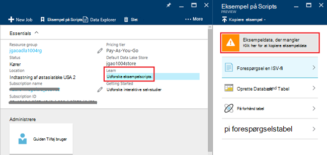
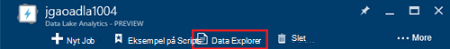
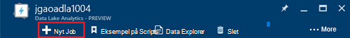
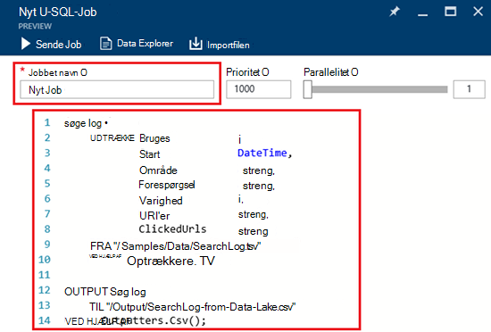
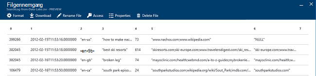

<properties 
   pageTitle="Introduktion til Azure Data sø analyser ved hjælp af Azure portal | Azure" 
   description="Lær, hvordan du bruger portalen Azure til at oprette en Data sø Analytics-konto, skal du oprette et Data sø Analytics-job fra U-SQL, og Send jobbet. " 
   services="data-lake-analytics" 
   documentationCenter="" 
   authors="edmacauley" 
   manager="jhubbard" 
   editor="cgronlun"/>
 
<tags
   ms.service="data-lake-analytics"
   ms.devlang="na"
   ms.topic="hero-article"
   ms.tgt_pltfrm="na"
   ms.workload="big-data" 
   ms.date="10/06/2016"
   ms.author="edmaca"/>

# Selvstudium: Introduktion til Azure Data sø analyser ved hjælp af Azure-portalen

[AZURE.INCLUDE [get-started-selector](../../includes/data-lake-analytics-selector-get-started.md)]

Lær, hvordan du bruger portalen Azure til at oprette Azure Data sø Analytics-konti, definere Data sø Analytics job i [U-SQL](data-lake-analytics-u-sql-get-started.md)og sende job til Data sø Analytics-tjenesten. Se [Oversigt over Azure Data sø Analytics](data-lake-analytics-overview.md)kan finde flere oplysninger om Data sø analyser.

I dette selvstudium udvikle du et job, som læser en fane adskilt fil værdier (TSV) og konverterer det til en fil med kommaseparerede værdier (CSV). For at gå gennem samme selvstudiet ved hjælp af andre understøttede værktøjer skal du klikke på fanerne øverst på denne sektion. Når din første opgave lykkes, kan du begynde at skrive mere komplekse datatransformationer med U-SQL.

##Forudsætninger

Inden du starter selvstudiet, skal du have følgende elementer:

- **En Azure-abonnement**. Se [få Azure gratis prøveversion](https://azure.microsoft.com/pricing/free-trial/).

##Oprette Data sø Analytics-konto

Du skal have en Data sø Analytics-konto, før du kan køre et job.

Hver Data sø Analytics-konto har en [Azure datalager sø]() konto afhængighed.  Denne konto kaldes sø datalager standardkontoen.  Du kan oprette kontoen sø datalager, på forhånd, eller når du opretter kontoen Data sø analyser. I dette selvstudium opretter du kontoen sø datalager med Data sø Analytics-kontoen.

**Oprette en Data sø Analytics-konto**

1. Log [Azure-portalen](https://portal.azure.com).
2. Klik på **Ny**, klik **Intelligence + analytics**, og klik derefter på **Data sø analyser**.
3. Skriv eller Vælg følgende værdier:

    

    - **Navn**: navngive Data sø Analytics-kontoen.
    - **Abonnement**: Vælg Azure abonnementet bruges til Analytics-kontoen.
    - **Ressourcegruppe**. Vælg en eksisterende Azure ressourcegruppe eller Opret en ny. Azure ressourcestyring gør det muligt at arbejde med ressourcer i dit program som en gruppe. Du kan finde yderligere oplysninger finder [Azure ressourcestyring oversigt](resource-group-overview.md). 
    - **Placering**. Vælg en Azure datacenter for Data sø Analytics-kontoen. 
    - **Sø datalager**: hver Data sø Analytics-konto har en afhængige sø datalager-konto. Data sø Analytics-kontoen og afhængige sø datalager kontoen skal være placeret i den samme Azure datacenter. Følg instruktionerne til at oprette en ny sø datalager-konto, eller Vælg en eksisterende.

8. Klik på **Opret**. Det tager dig til startskærmbilledet i portalen. Et nyt felt føjes til StartBoard med det navn, der viser "Implementerer Azure Data sø Analytics". Det tager et øjeblik på at oprette en Data sø Analytics-konto. Når kontoen er oprettet, åbnes på portalen på kontoen på en ny blade.

Når en Data sø Analytics-konto er oprettet, kan du tilføje yderligere sø datalager kontiene og Azure-lager. Flere oplysninger under [administrere Data sø Analytics kontoindstillinger datakilder](data-lake-analytics-manage-use-portal.md#manage-account-data-sources).

##Forberede kildedata

I dette selvstudium behandle du nogle Søg logfiler.  Søg loggen kan være gemt i enten dData sø store eller Azure Blob-lager. 

Azure-portalen indeholder en brugergrænseflade til kopiering nogle eksempeldatafilerne til sø datalager standardkonto, der indeholder en søgning logfil.

**Kopiere eksempeldatafilerne**

1. Åbn din Data sø Analytics-konto fra [Azure-portalen](https://portal.azure.com).  Se [administrere Data sø Analytics-konti](data-lake-analytics-get-started-portal.md#manage-accounts) , for at oprette en og åbne kontoen i portalen.
3. Udvid ruden **Essentials** , og klik derefter på **Gå på opdagelse eksempelscripts**. En anden blade kaldet **Eksempelscripts**åbnes.

    

4. Klik på **Eksempel der mangler Data** for at kopiere eksempeldatafilerne. Når guiden er fuldført, viser portalen **eksempeldata, der er blevet opdateret**.
7. Klik på **Data Explorer** øverst bladet Data sø analytics-konto. 

    

    To blade åbnes. En er **Data Explorer**, og den anden er sø datalager standardkontoen.
8. Klik på **eksempler** for at udvide mappen, og klik på **Data** for at udvide mappen i bladet standard sø datalager konto. Du skal du se følgende filer og mapper:

    - AmbulanceData /
    - AdsLog.tsv
    - SearchLog.tsv
    - version.txt
    - WebLog.log
    
    I dette selvstudium bruger du SearchLog.tsv.

I øvelsen, kan du enten programmere dine programmer for at skrive data i en sammenkædet lagerplads konti eller overføre data. Overførsel af filer, finde [overføre data til datalager sø](data-lake-analytics-manage-use-portal.md#upload-data-to-adls) eller [overføre data til Blob-lager](data-lake-analytics-manage-use-portal.md#upload-data-to-wasb).

##Oprette og sende Data sø Analytics-job

Når du har forberedt kildedataene, kan du begynde at udvikle et U-SQL-script.  

**Sende et job**

1. Data sø analytics konto bladet på portalen, klik på **Nyt Job**. 

    

    Hvis du ikke kan se bladet, kan du se [åbne en Data sø Analytics-konto fra portalen](data-lake-analytics-manage-use-portal.md#access-adla-account).
2. Angiv **Jobnavn**og følgende U-SQL-script:

        @searchlog =
            EXTRACT UserId          int,
                    Start           DateTime,
                    Region          string,
                    Query           string,
                    Duration        int?,
                    Urls            string,
                    ClickedUrls     string
            FROM "/Samples/Data/SearchLog.tsv"
            USING Extractors.Tsv();
        
        OUTPUT @searchlog   
            TO "/Output/SearchLog-from-Data-Lake.csv"
        USING Outputters.Csv();

    

    Dette U-SQL-script læser kildefilen data ved hjælp af **Extractors.Tsv()**og opretter derefter en CSV-fil ved hjælp af **Outputters.Csv()**. 
    
    Undlad at ændre de to stier, medmindre du kopiere kildefilen til en anden placering.  Data sø Analytics opretter outputmappen, hvis den ikke findes.  I dette tilfælde bruger vi enkel, relative stier.  
    
    Det er nemmere at bruge relative stier til filer, der er gemt i standard Data sø konti. Du kan også bruge absolutte stier.  For eksempel 
    
        adl://<Data LakeStorageAccountName>.azuredatalakestore.net:443/Samples/Data/SearchLog.tsv
      

    Yderligere oplysninger om U-SQL, i afsnittet [Introduktion til Azure Data sø Analytics U-SQL sprog](data-lake-analytics-u-sql-get-started.md) og [U-SQL language reference](http://go.microsoft.com/fwlink/?LinkId=691348).
     
3. Klik på **Send Job** fra toppen.   
4. Vent, indtil jobstatus ændres til **lykkedes**. Du kan se jobbet tog omkring et minut for at fuldføre.
    
    I tilfælde af jobbet mislykkedes, se [skærm og foretage fejlfinding af Data sø Analytics job](data-lake-analytics-monitor-and-troubleshoot-jobs-tutorial.md).

5. Klik på fanen **Output** nederst i bladet, og klik derefter på **SearchLog fra-Data Lake.csv**. Du kan få vist et eksempel, hente, omdøbe og slette outputfilen.

    

##Se også

- For at se en mere kompleks forespørgsel skal du se [analysér websted logfiler, der bruger Azure Data sø analyser](data-lake-analytics-analyze-weblogs.md).
- For at komme i gang U-SQL udviklingsprogrammer skal du se [udvikle U-SQL-scripts ved hjælp af Data sø Tools til Visual Studio](data-lake-analytics-data-lake-tools-get-started.md).
- Få U-SQL under [Introduktion til Azure Data sø Analytics U-SQL-sprog](data-lake-analytics-u-sql-get-started.md).
- Se [administrere Azure Data sø Analytics Azure-portalen](data-lake-analytics-manage-use-portal.md)til af administrationsopgaver.
- For at få et overblik over Data sø Analytics skal du se [Oversigt over Azure Data sø analyser](data-lake-analytics-overview.md).
- For at se det samme selvstudium ved hjælp af andre værktøjer skal du klikke på fanen vælgere øverst på siden.
- Hvis du vil logge diagnosticeringsoplysninger, se [adgang til diagnosticering logfiler for Azure Data sø analyser](data-lake-analytics-diagnostic-logs.md)
