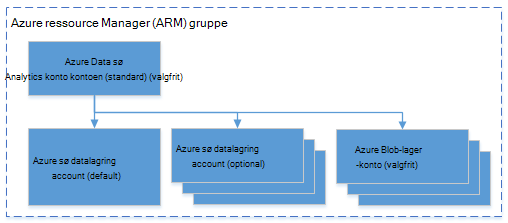

<properties 
   pageTitle="Administrere Azure Data sø analyser ved hjælp af Azure kommandolinjen | Azure" 
   description="Lær at administrere Data sø Analytics-konti, datakilder, job og brugere ved hjælp af Azure CLI" 
   services="data-lake-analytics" 
   documentationCenter="" 
   authors="edmacauley" 
   manager="jhubbard" 
   editor="cgronlun"/>
 
<tags
   ms.service="data-lake-analytics"
   ms.devlang="na"
   ms.topic="article"
   ms.tgt_pltfrm="na"
   ms.workload="big-data" 
   ms.date="05/16/2016"
   ms.author="edmaca"/>

# Administrere Azure Data sø analyser ved hjælp af Azure kommandolinjen (CLI)

[AZURE.INCLUDE [manage-selector](../../includes/data-lake-analytics-selector-manage.md)]

Få mere at vide, hvordan du administrerer Azure Data sø Analytics-konti, datakilder, brugere og job ved hjælp af Azure. Klik på fanen Vælg ovenfor for at få vist management emne ved hjælp af andre værktøjer.

**Forudsætninger**

Inden du starter selvstudiet, skal du have følgende:

- **En Azure-abonnement**. Se [få Azure gratis prøveversion](https://azure.microsoft.com/pricing/free-trial/).
- **Azure CLI**. Se [installere og konfigurere Azure CLI](../xplat-cli-install.md).
    - Hent og Installer **foreløbige** [Azure CLI værktøjer](https://github.com/MicrosoftBigData/AzureDataLake/releases) for at fuldføre denne demo.
- **Godkendelse**ved hjælp af følgende kommando:

        azure login
    Du kan finde flere oplysninger om godkendelse af med en arbejds- eller skolekonto, [Opret forbindelse til et Azure-abonnement fra Azure CLI](../xplat-cli-connect.md).
- **Skift til Azure ressourcestyring-tilstand**, som med følgende kommando:

        azure config mode arm

**Til at få vist kommandoerne sø datalager og Data sø Analytics:**

    azure datalake store
    azure datalake analytics

<!-- ################################ -->
<!-- ################################ -->
## Administrere konti

Før du kører en hvilken som helst Data sø Analytics-job, skal du have en Data sø Analytics-konto. I modsætning til Azure HDInsight betaler ikke du for en Analytics-konto, når den ikke kører et job.  Du betaler kun for den tid, når den kører et job.  Se [Oversigt over Azure Data sø Analytics](data-lake-analytics-overview.md)kan finde flere oplysninger.  

###Oprette konti

    azure datalake analytics account create "<Data Lake Analytics Account Name>" "<Azure Location>" "<Resource Group Name>" "<Default Data Lake Account Name>"

###Opdatere konti

Følgende kommando opdaterer egenskaberne for en eksisterende Data sø Analytics-konto
    
    azure datalake analytics account set "<Data Lake Analytics Account Name>"

###Liste over konti

Listen Data sø Analytics-konti 

    azure datalake analytics account list

Listen Data sø Analytics konti inden for en bestemt ressourcegruppe

    azure datalake analytics account list -g "<Azure Resource Group Name>"

Få oplysninger om en bestemt Data sø Analytics-konto

    azure datalake analytics account show -g "<Azure Resource Group Name>" -n "<Data Lake Analytics Account Name>"

###Slette Data sø Analytics-konti

    azure datalake analytics account delete "<Data Lake Analytics Account Name>"

<!-- ################################ -->
<!-- ################################ -->
## Administrer konto datakilder

Data sø Analytics understøtter aktuelt følgende datakilder:

- [Azure sø datalager](../data-lake-store/data-lake-store-overview.md)
- [Azure-lager](../storage/storage-introduction.md)

Når du opretter en Analytics-konto, skal du angive en Azure datalagring sø konto skal være standardkontoen lagerplads. Standardkontoen ADL lagerplads bruges til at gemme jobbet metadata og job overvågningslogge. Når du har oprettet en Analytics-konto, kan du tilføje flere sø datalagring konti og/eller Azure-lager-konto. 

### Finde standardkontoen ADL lagerplads

    azure datalake analytics account show "<Data Lake Analytics Account Name>"

Værdien, der er angivet under egenskaber: datalakeStoreAccount:name.

### Tilføje flere Azure Blob storage konti

    azure datalake analytics account datasource add -n "<Data Lake Analytics Account Name>" -b "<Azure Blob Storage Account Short Name>" -k "<Azure Storage Account Key>"

>[AZURE.NOTE] Kun Blob storage korte navne understøttes.  Brug ikke fulde Domænenavn, for eksempel "myblob.blob.core.windows.net".

### Tilføje flere sø datalager konti

    azure datalake analytics account datasource add -n "<Data Lake Analytics Account Name>" -l "<Data Lake Store Account Name>" [-d]

[-d] er en valgfri parameter, der angiver, om den Data sø føjes er Data sø standardkontoen. 

### Opdatere eksisterende datakilde

Sådan angives en eksisterende konto sø datalager være standard:

    azure datalake analytics account datasource set -n "<Data Lake Analytics Account Name>" -l "<Azure Data Lake Store Account Name>" -d
      
Sådan opdaterer en eksisterende kontonøgle til Blob-lager:

    azure datalake analytics account datasource set -n "<Data Lake Analytics Account Name>" -b "<Blob Storage Account Name>" -k "<New Blob Storage Account Key>"

### Listedatakilder:

    azure datalake analytics account show "<Data Lake Analytics Account Name>"
    

### Slette datakilder:

Sådan slettes en sø datalager konto:

    azure datalake analytics account datasource delete "<Data Lake Analytics Account Name>" "<Azure Data Lake Store Account Name>"

Sådan slettes en Blob storage konto:

    azure datalake analytics account datasource delete "<Data Lake Analytics Account Name>" "<Blob Storage Account Name>"

## Administrere job

Du skal have en Data sø Analytics-konto, før du kan oprette en sag.  Yderligere oplysninger finder du se [administrere Data sø Analytics konti](#manage-accounts).

### Vis job

    azure datalake analytics job list -n "<Data Lake Analytics Account Name>"

### Få oplysninger om job

    azure datalake analytics job show -n "<Data Lake Analytics Account Name>" -j "<Job ID>"
    
### Sende job

> [AZURE.NOTE] Standardprioriteten af en sag er 1000, og standard graden af parallelitet for en sag er 1.

    azure datalake analytics job create  "<Data Lake Analytics Account Name>" "<Job Name>" "<Script>"

### Annullere job

Brug kommandoen liste til at finde job-id, og brug derefter Annuller for at annullere jobbet.

    azure datalake analytics job list -n "<Data Lake Analytics Account Name>"
    azure datalake analytics job cancel "<Data Lake Analytics Account Name>" "<Job ID>"

## Administrere katalog

U-SQL-kataloget bruges til at strukturere data og kode, så de kan deles af U-SQL-scripts. Kataloget gør det muligt med data i Azure Data sø højeste ydeevne. Du kan finde yderligere oplysninger finder [Brug U-SQL-katalog](data-lake-analytics-use-u-sql-catalog.md).
 
###Katalog listeelementer

    #List databases
    azure datalake analytics catalog list -n "<Data Lake Analytics Account Name>" -t database

    #List tables
    azure datalake analytics catalog list -n "<Data Lake Analytics Account Name>" -t table
    
Typerne medtage database, skema, samling, ekstern datakilde, tabel, værdi tabelfunktion eller tabel statistik.

###Oprette katalog hemmeligt

    azure datalake analytics catalog secret create -n "<Data Lake Analytics Account Name>" <databaseName> <hostUri> <secretName>

### Ændre katalog hemmeligt

    azure datalake analytics catalog secret set -n "<Data Lake Analytics Account Name>" <databaseName> <hostUri> <secretName>

###Slette katalog hemmeligt

    azure datalake analytics catalog secrete delete -n "<Data Lake Analytics Account Name>" <databaseName> <hostUri> <secretName>

<!-- ################################ -->
<!-- ################################ -->
## Bruge ARM grupper

Programmer består normalt af mange komponenter, for eksempel en WebApp, database, databaseserver, lager og 3 part services. Azure ressource Manager (ARM) gør det muligt at arbejde med ressourcer i dit program som en gruppe, kaldes en Azure ressourcegruppe. Du kan installere, opdatere, overvåge eller slette alle ressourcerne for dit program i en enkelt, koordineret handling. Du bruger en skabelon til installation og denne skabelon kan arbejde for forskellige miljøer som test, test- og. Du kan få overblik over fakturering for din organisation ved at få vist de akkumulerede omkostninger for hele gruppen. Du kan finde yderligere oplysninger finder [Azure ressourcestyring oversigt](../azure-resource-manager/resource-group-overview.md). 

En Data sø Analytics-tjenesten kan omfatte følgende komponenter:

- Azure Data sø Analytics-konto
- Påkrævet standardkonto for Azure sø datalagring
- Ekstra Azure Data sø lagerplads konti
- Flere Azure-lager-konti

Du kan oprette alle disse komponenter under én ARM gruppe for at gøre dem nemmere at administrere.

En Data sø Analytics-konto og afhængige lagerplads konti skal være placeret i den samme Azure datacenter.
Gruppen ARM kan dog være placeret i et andet datacenter.  

##Se også 

- [Oversigt over Microsoft Azure Data sø Analytics](data-lake-analytics-overview.md)
- [Komme i gang med Data sø analyser ved hjælp af Azure-portalen](data-lake-analytics-get-started-portal.md)
- [Administrere Azure Data sø analyser ved hjælp af Azure-portalen](data-lake-analytics-manage-use-portal.md)
- [Overvåge og foretage fejlfinding af Azure Data sø Analytics job ved hjælp af Azure-portalen](data-lake-analytics-monitor-and-troubleshoot-jobs-tutorial.md)

