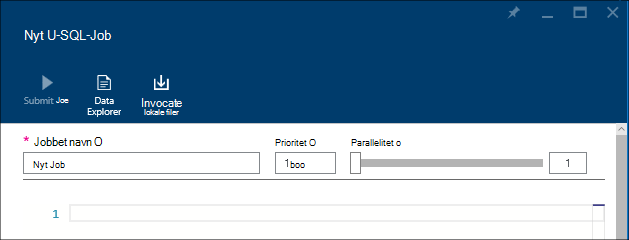
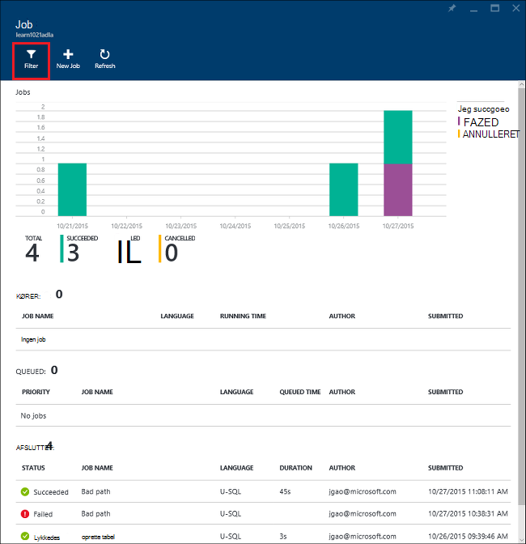

<properties 
   pageTitle="Administrere Azure Data sø analyser ved hjælp af portalen Azure | Azure" 
   description="Lær at administrere Data sø Analytics acounts, datakilder, brugere og job." 
   services="data-lake-analytics" 
   documentationCenter="" 
   authors="edmacauley" 
   manager="jhubbard" 
   editor="cgronlun"/>
 
<tags
   ms.service="data-lake-analytics"
   ms.devlang="na"
   ms.topic="article"
   ms.tgt_pltfrm="na"
   ms.workload="big-data" 
   ms.date="10/06/2016"
   ms.author="edmaca"/>

# Administrere Azure Data sø analyser ved hjælp af Azure-portalen

[AZURE.INCLUDE [manage-selector](../../includes/data-lake-analytics-selector-manage.md)]

Få mere at vide, hvordan du administrerer Azure Data sø Analytics-konti, konto-datakilder, brugere og job ved hjælp af portalen Azure. Klik på tabulatorvælgeren øverst på siden for at få vist management emner ved at bruge andre værktøjer.

**Forudsætninger**

Inden du starter selvstudiet, skal du have følgende elementer:

- **En Azure-abonnement**. Se [få Azure gratis prøveversion](https://azure.microsoft.com/pricing/free-trial/).

<!-- ################################ -->
<!-- ################################ -->
## Administrere konti

Før du kører en hvilken som helst Data sø Analytics-job, skal du have en Data sø Analytics-konto. I modsætning til Azure HDInsight betaler du kun for en Data sø Analytics-konto når du kører en sag.  Du betaler kun for den tid, når den kører et job.  Se [Oversigt over Azure Data sø Analytics](data-lake-analytics-overview.md)kan finde flere oplysninger.  

**Oprette en Data sø Analytics-konto**

1. Log [Azure-portalen](https://portal.azure.com).
2. Klik på **Ny**, klik **Intelligence + analytics**, og klik derefter på **Data sø analyser**.
3. Skriv eller Vælg følgende værdier:

    

    - **Navn**: navngive Data sø Analytics-kontoen.
    - **Abonnement**: Vælg Azure abonnementet bruges til Analytics-kontoen.
    - **Ressourcegruppe**. Vælg en eksisterende Azure ressourcegruppe eller Opret en ny. Azure ressourcestyring gør det muligt at arbejde med ressourcer i dit program som en gruppe. Du kan finde yderligere oplysninger finder [Azure ressourcestyring oversigt](resource-group-overview.md). 
    - **Placering**. Vælg en Azure datacenter for Data sø Analytics-kontoen. 
    - **Sø datalager**: hver Data sø Analytics-konto har en afhængige sø datalager-konto. Data sø Analytics-kontoen og afhængige sø datalager kontoen skal være placeret i den samme Azure datacenter. Følg instruktionerne til at oprette en ny sø datalager-konto, eller Vælg en eksisterende.

8. Klik på **Opret**. Det tager dig til startskærmbilledet i portalen. Et nyt felt føjes til StartBoard med det navn, der viser "Implementerer Azure Data sø Analytics". Det tager et øjeblik på at oprette en Data sø Analytics-konto. Når kontoen er oprettet, åbnes på portalen på kontoen på en ny blade.

Når en Data sø Analytics-konto er oprettet, kan du tilføje yderligere sø datalager kontiene og Azure-lager. Flere oplysninger under [administrere Data sø Analytics kontoindstillinger datakilder](data-lake-analytics-manage-use-portal.md#manage-account-data-sources).

**Til access eller Åbn en Data sø Analytics-konto**

1. Log [Azure-portalen](https://portal.azure.com/).
2. Klik på **Data sø Analytics** i menuen til venstre.  Hvis du ikke kan se den, skal du klikke på **flere tjenester**, og klik **Data sø Analytics** under **Intelligence + analyser**.
3. Klik på Data sø Analytics-kontoen, som du vil have adgang til. Kontoen åbnes i en ny blade.

**Slette en Data sø Analytics-konto**

1. Åbn den Data sø Analytics-konto, du vil slette. Flere oplysninger under [Access Data sø Analytics-konti](#access-adla-account).
2. Klik på **Slet** fra menuen til knappen øverst på bladet.
3. Skriv navnet på konto, og klik derefter på **Slet**.

Sletning af en Data sø Analytics-konto sletter ikke de afhængige sø datalager-konti. Du kan finde instruktioner af sletning af sø datalagring konti, [Slet sø datalager konto](data-lake-store-get-started-portal.md#delete-azure-data-lake-store-account).

<!-- ################################ -->
<!-- ################################ -->
## Administrer konto datakilder

Data sø Analytics understøtter aktuelt følgende datakilder:

- [Azure sø datalager](../data-lake-store/data-lake-store-overview.md)
- [Azure-lager](../storage/storage-introduction.md)

Når du opretter en Data sø Analytics-konto, skal du angive en Azure datalager sø konto skal være standardkontoen lagerplads. Sø datalager standardkontoen bruges til at gemme jobbet metadata og job overvågningslogge. Når du har oprettet en Data sø Analytics-konto, kan du tilføje flere sø datalager konti og/eller Azure-lager-konto. 

**Finde standardkontoen Data sø lagerplads**

- Åbn den Data sø Analytics-konto, du vil administrere. Flere oplysninger under [Access Data sø Analytics-konti](#access-adla-account). Standard Data sø store vises i **væsentlige**:

    

**Tilføje flere datakilder**

1. Åbn den Data sø Analytics-konto, du vil administrere. Flere oplysninger under [Access Data sø Analytics-konti](#access-adla-account).
2. Klik på **Indstillinger** , og klik derefter på **Datakilder**. Du skal se standardkontoen sø datalager vises der. 
3. Klik på **Tilføj datakilde**.

    

    Hvis du vil tilføje en sø datalager til Azure-konto, du har brug for kontoen navn og adgang til kontoen, der kan forespørge den.
    Hvis du vil tilføje en Azure Blob-lager, skal du lagerplads kontoen og tasten konto, som kan findes ved at navigere til kontoen lagerplads på portalen.

**For at undersøge datakilder**  

1. Åbn den Analytics-konto, du vil administrere. Flere oplysninger under [Access Data sø Analytics-konti](#access-adla-account).
2. Klik på **Indstillinger** , og klik derefter på **Stifinder Data**. 
 
    
    
3. Klik på en sø datalager konto for at åbne kontoen.

    
    
    For hver sø datalager-konto kan du
    
    - **Ny mappe**: Tilføj ny mappe.
    - **Overføre**: overføre filer til kontoen lagerplads fra computeren.
    - **Access**: konfigurere access tilladelser.
    - **Omdøb mappe**: omdøbe en mappe.
    - **Mappeegenskaber**: Vis egenskaber for fil eller mappe, som WASB stien, WEBHDFS stien, senest har ændret tid og så videre.
    - **Slet mappe**: slette en mappe.

**At overføre filer til sø datalager konto**

1. Klik på **Gennemse** fra menuen til venstre på portalen, og klik derefter på **Sø datalager**.
2. Klik på den sø datalager-konto, du vil overføre data til. Datalagring sø standardkontoen finder du [her](#default-adl-account).
3. Klik på **Data Explorer** fra den øverste menu.
4. Klik på **Ny mappe** for at oprette en ny mappe, eller klik på et mappenavn for at ændre mappe.
6. Klik på **Overfør** fra den øverste menu til at overføre filer.

**At overføre filer til Azure Blob storage konto**

Se [overføre data til Hadoop-job i HDInsight](../hdinsight/hdinsight-upload-data.md).  Oplysningerne gælder for Data sø analyser.

## Administrere brugere

Data sø Analytics bruger rollebaseret adgangskontrol med Azure Active Directory. Når du opretter en Data sø Analytics-konto, føjes en "Abonnement administratorer" rolle til kontoen. Du kan tilføje flere brugere og sikkerhedsgrupper med følgende roller:

|Rolle|Beskrivelse|
|----|-----------|
|Ejer|Kan du administrere alt, herunder adgang til ressourcer.|
|Bidragyder|Få adgang til portalen; sende og overvåg job. Hvis du vil kunne sende job, skal en bidragyder tilladelsen læse- eller skrivetilladelser til sø datalager brugerkonti.|
|DataLakeAnalyticsDeveloper | Send, overvåge og annullere job.  Disse brugere kan kun annullere deres egen job. De ikke kan administrere deres egen konto for eksempel tilføje brugere, ændre tilladelser eller slette kontoen. Hvis du vil kunne køre job, de skal bruge som læst eller skrive-adgang til sø datalager kontiene     | 
|Reader|Kan du få vist alt, men ikke foretage ændringer.|  
|DevTest øvelser bruger|Kan du få vist alt, og Opret forbindelse, start, genstart og lukning virtuelle computere.|  
|Access Brugeradministrator|Kan du administrere brugeradgang til Azure ressourcer.|  

Oplysninger om oprettelse af Azure Active Directory-brugere og -sikkerhedsgrupper, kan du se [Hvad er Azure Active Directory](../active-directory/active-directory-whatis.md).

**Sådan føjes brugere eller sikkerhedsgrupper til en Data sø Analytics-konto**

1. Åbn den Analytics-konto, du vil administrere. Flere oplysninger under [Access Data sø Analytics-konti](#access-adla-account).
2. Klik på **Indstillinger**, og klik derefter på **brugere**. Du kan også klikke på **Access** på titellinjen **Essentials** som vist på følgende skærmbillede:

    
3. Klik på **Tilføj**fra bladet **bruger** .
4. Vælg en rolle og tilføje en bruger, og klik derefter på **OK**.

**Bemærk: Hvis denne bruger eller sikkerhedsgruppe brug for at sende job, de skal tildeles tilladelse på sø Store Data samt. Du kan finde yderligere oplysninger finder [sikker data, der er gemt i sø datalager](../data-lake-store/data-lake-store-secure-data.md).**

<!-- ################################ -->
<!-- ################################ -->
## Administrere job

Du skal have en Data sø Analytics-konto, før du kan køre en hvilken som helst U-SQL-job.  Yderligere oplysninger finder du se [administrere Data sø Analytics konti](#manage-data-lake-analytics-accounts).

**Sådan oprettes en sag**

1. Åbn den Analytics-konto, du vil administrere. Flere oplysninger under [Access Data sø Analytics-konti](#access-adla-account).
2. Klik på **nyt Job**.

    

    Du skal se en ny blade ligner:

    

    For hver sag, kan du konfigurere

  	|Navn|Beskrivelse|
  	|----|-----------|
  	|Jobbet navn|Skriv navnet på sag.|
  	|Prioritet|Lavere tal har højere prioritet. Hvis to job er begge i kø, én med lavere kører prioritet først|
  	|Parallelitet |Maksimalt antal Beregn processer, der kan udføres på samme tid. Øge dette nummer kan forbedre ydeevnen, men kan også øge omkostninger.|
  	|Script|Angiv U-SQL-scriptet til opgaven.|

    I den samme brugergrænseflade, kan du også udforske datakilder link og føje flere filer til tilknyttede datakilder. 
3. Klik på **Send jobbet** , hvis du vil sende jobbet.

**Sende et job**

Se [oprette Data sø Analytics job](#create-job).

**Til at overvåge job**

1. Åbn den Analytics-konto, du vil administrere. Flere oplysninger under [Access Data sø Analytics-konti](#access-adla-account). Panelet sagsstyring viser de grundlæggende job oplysninger:

    

3. Klik på **Administration af udskriftsjob** , som vist i det forrige skærmbillede.

    

4. Klik på et job fra listerne. Eller klik på **Filter** for at hjælpe dig med at finde job:

    

    Du kan filtrere job ved **Tidsinterval** **Jobnavn**og **forfatter**.
5. Klik på **Send igen** , hvis du vil sende igen jobbet.

**At sende igen et job**

Få vist [skærm Data sø Analytics sager](#monitor-jobs).

##Overvåge brugen af konto

**Til at overvåge brugen af konto**

1. Åbn den Analytics-konto, du vil administrere. Flere oplysninger under [Access Data sø Analytics-konti](#access-adla-account). Panelet brugen viser, hvordan du kan bruge:

    

2. Dobbeltklik på ruden for at se flere oplysninger.

##Vis U-SQL-katalog

[U-SQL-katalog](data-lake-analytics-use-u-sql-catalog.md) bruges til at strukturere data og kode, så de kan deles af U-SQL-scripts. Kataloget gør det muligt med data i Azure Data sø højeste ydeevne. Fra Azure-portalen er du kan se U-SQL-katalog.

**Gennemse U-SQL-katalog**

1. Åbn den Analytics-konto, du vil administrere. Flere oplysninger under [Access Data sø Analytics-konti](#access-adla-account).
2. Klik på **Data Explorer** fra den øverste menu.
3. Udvid **kataloget**, udvide **mastersider**, udvid **tabeller, eller **valgmuligheder tabelfunktioner**, eller **Assemblies **. Følgende skærmbillede viser én værdi af tabelfunktion.

    

<!-- ################################ -->
<!-- ################################ -->
## Bruge Azure ressourcestyring grupper

Programmer består normalt af mange komponenter, for eksempel en WebApp, database, -databaseserver, lager og tredjepartstjenester. Azure ressourcestyring gør det muligt at arbejde med ressourcer i dit program som en gruppe, kaldes en Azure ressourcegruppe. Du kan installere, opdatere, overvåge eller slette alle ressourcerne for dit program i en enkelt, koordineret handling. Du bruger en skabelon til installation og denne skabelon kan arbejde for forskellige miljøer som test, midlertidige og fremstilling. Du kan få overblik over fakturering for din organisation ved at få vist de akkumulerede omkostninger for hele gruppen. Du kan finde yderligere oplysninger finder [Azure ressourcestyring oversigt](../azure-resource-manager/resource-group-overview.md). 

En Data sø Analytics-tjenesten kan omfatte følgende komponenter:

- Azure Data sø Analytics-konto
- Påkrævet standard Azure datalager sø konto
- Ekstra Azure sø datalager konti
- Flere Azure-lager-konti

Du kan oprette alle disse komponenter under én Ressourcestyring gruppe for at gøre dem nemmere at administrere.

En Data sø Analytics-konto og afhængige lagerplads konti skal være placeret i den samme Azure datacenter.
Gruppen ressourcestyring kan dog være placeret i et andet datacenter.  

##Se også 

- [Oversigt over Microsoft Azure Data sø Analytics](data-lake-analytics-overview.md)
- [Komme i gang med Data sø analyser ved hjælp af Azure-portalen](data-lake-analytics-get-started-portal.md)
- [Administrere Azure Data sø analyser ved hjælp af Azure PowerShell](data-lake-analytics-manage-use-powershell.md)
- [Overvåge og foretage fejlfinding af Azure Data sø Analytics job ved hjælp af Azure portal](data-lake-analytics-monitor-and-troubleshoot-jobs-tutorial.md)

