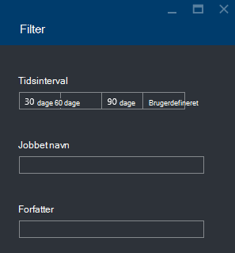

<properties 
   pageTitle="Fejlfinding i forbindelse med Azure Data sø Analytics job portalen til Azure | Azure" 
   description="Lær at bruge Azure-portalen til fejlfinding i forbindelse med Data sø Analytics job. " 
   services="data-lake-analytics" 
   documentationCenter="" 
   authors="edmacauley" 
   manager="jhubbard" 
   editor="cgronlun"/>
 
<tags
   ms.service="data-lake-analytics"
   ms.devlang="na"
   ms.topic="article"
   ms.tgt_pltfrm="na"
   ms.workload="big-data" 
   ms.date="05/16/2016"
   ms.author="edmaca"/>

# Fejlfinding i forbindelse med Azure Data sø Analytics job ved hjælp af Azure-portalen

Lær at bruge Azure-portalen til fejlfinding i forbindelse med Data sø Analytics job.

I dette selvstudium, du konfigurerer en fil problemet med manglende kilde og bruge Azure Portal til at foretage fejlfinding af problemet.

**Forudsætninger**

Inden du starter selvstudiet, skal du have følgende:

- **Grundlæggende kendskab til Data sø Analytics job proces**. Se [Introduktion til Azure Data sø analyser ved hjælp af Azure-portalen](data-lake-analytics-get-started-portal.md).
- **A Data sø Analytics-konto**. Se [Introduktion til Azure Data sø analyser ved hjælp af Azure-portalen](data-lake-analytics-get-started-portal.md#create-adl-analytics-account).
- **Kopiér eksempeldataene til sø datalager standardkonto**.  Se [forberede kildedata](data-lake-analytics-get-started-portal.md#prepare-source-data)

##Sende et Data sø Analytics-job

Nu kan du oprette et U-SQL-job med et forkert kildefilnavn.  

**Til at sende jobbet**

1. Azure-portalen, klik på **Microsoft Azure** i øverste venstre hjørne.
2. Klik på feltet med navnet på din Data sø Analytics konto.  Det er fastgjort her, da kontoen, der blev oprettet.
Hvis kontoen ikke er fastgjort der, kan du se [åbne en Analytics-konto fra portalen](data-lake-analytics-manage-use-portal.md#access-adla-account).
3. Klik på **Nyt Job** fra den øverste menu.
4. Angiv et jobnavn og følgende U-SQL-script:

        @searchlog =
            EXTRACT UserId          int,
                    Start           DateTime,
                    Region          string,
                    Query           string,
                    Duration        int?,
                    Urls            string,
                    ClickedUrls     string
            FROM "/Samples/Data/SearchLog.tsv1"
            USING Extractors.Tsv();
        
        OUTPUT @searchlog   
            TO "/output/SearchLog-from-adls.csv"
        USING Outputters.Csv();

    Kildefilen, der er defineret i scriptet er **/Samples/Data/SearchLog.tsv1**, hvor det skal være **/Samples/Data/SearchLog.tsv**.
     
5. Klik på **Send Job** fra toppen. Et nyt Job detaljeruden åbnes. På titellinjen viser den jobstatus. Det tager et par minutter at afslutte. Du kan klikke på **Opdater** for at få den seneste status.
6. Vent, indtil jobstatus ændres til **mislykket**.  Hvis sagen er **lykkedes**, skyldes det, at du ikke fjerne mappen /Samples. I afsnittet **nødvendige** i starten af selvstudiet.

Du tænker muligvis - hvorfor det tager så lang tid for en lille sag.  Husk, at dataene sø Analytics er udviklet til at behandle stor data.  Det fantastisk ved behandling af en stor mængde data ved hjælp af dens distribueret system.

Lad os antage du sendt jobbet, og Luk på portalen.  I næste afsnit lærer du at foretage fejlfinding af jobbet.

## Fejlfinding i forbindelse med jobbet

I det sidste afsnit, du har sendt en sag og jobbet mislykkedes.  

**Se alle job**

1. Fra Azure-portalen, skal du klikke på **Microsoft Azure** i øverste venstre hjørne.
2. Klik på feltet med navnet på din Data sø Analytics konto.  Jobbet oversigt vises i feltet **Sagsstyring** .

    
    
    Jobbet administration giver dig et hurtigt overblik over af jobstatus. Bemærk der er en mislykkede job.
   
3. Klik på feltet **Sagsstyring** for at få vist sagerne. Job er kategoriseret i **kører**, **i kø**og **afsluttet**. Du skal se mislykkedes tingene i sektionen **afsluttet** . Det skal være første en på listen. Når du har en masse job, kan du klikke på **Filter** for at hjælpe dig med at finde job.

    

4. Klik på det mislykkede job fra listen for at åbne jobbet detaljerne i en ny blade:

    
    
    Bemærk knappen **Send igen** . Når du løser problemet, kan du sende jobbet igen.

5. Klik på fremhævede del fra det forrige skærmbillede til at åbne oplysninger om fejlen.  Du skal se noget i retning af:

    

    Det fortæller dig, kildemappen ikke blev fundet.
    
6. Klik på **Dupliker Script**.
7. Opdatere **fra** stien til følgende:

    "/ Samples/Data/SearchLog.tsv"

8. Klik på **Send Job**.

##Se også

- [Azure Data sø Analytics oversigt](data-lake-analytics-overview.md)
- [Introduktion til Azure Data sø analyser ved hjælp af Azure PowerShell](data-lake-analytics-get-started-powershell.md)
- [Introduktion til Azure Data sø analyser og U-SQL ved hjælp af Visual Studio](data-lake-analytics-u-sql-get-started.md)
- [Administrere Azure Data sø analyser ved hjælp af Azure-portalen](data-lake-analytics-manage-use-portal.md)

