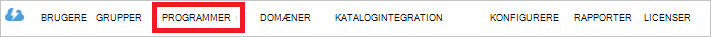

<properties
   pageTitle="Godkende med datalager sø ved hjælp af Active Directory | Microsoft Azure"
   description="Lær, hvordan du vil godkende med datalager sø ved hjælp af Active Directory"
   services="data-lake-store"
   documentationCenter=""
   authors="nitinme"
   manager="jhubbard"
   editor="cgronlun"/>

<tags
   ms.service="data-lake-store"
   ms.devlang="na"
   ms.topic="article"
   ms.tgt_pltfrm="na"
   ms.workload="big-data"
   ms.date="10/17/2016"
   ms.author="nitinme"/>

# Service-serivce godkendelse med datalager sø ved hjælp af Azure Active Directory

> [AZURE.SELECTOR]
- [Tjeneste til godkendelse](data-lake-store-authenticate-using-active-directory.md)
- [Slutbrugere godkendelse](data-lake-store-end-user-authenticate-using-active-directory.md)

Azure datalager sø bruger Azure Active Directory for godkendelse. Før du opretter et program, der fungerer med Azure datalager sø eller Azure Data sø Analytics, skal du først beslutte, hvordan du vil have til at godkende dit program med Azure Active Directory (Azure AD). De to primære indstillinger er:

* Slutbrugere godkendelse, og 
* Tjeneste til godkendelse. 

Begge disse indstillinger resulterer i dit program, der leveres med token OAuth 2.0, som bliver knyttet til hver anmodninger om at Azure datalager sø eller Azure Data sø analyser.

I denne artikel taler om, hvordan oprette et webprogram, Azure AD-tjenester godkendelse af. Flere oplysninger på Azure AD programkonfiguration til slutbrugere godkendelse under [Slutbrugerlicensaftale godkendelse med sø datalager ved hjælp af Azure Active Directory](data-lake-store-end-user-authenticate-using-active-directory.md).

## Forudsætninger

* Et Azure-abonnement. Se [få Azure gratis prøveversion](https://azure.microsoft.com/pricing/free-trial/).
* Dit abonnement-ID. Du kan hente det fra Azure-portalen. For eksempel er den tilgængelig fra bladet sø datalager konto.

    

* Domænenavnet Azure AD. Du kan hente den ved at holde musen musen i øverste højre hjørne af portalen Azure. Domænenavnet er **contoso.microsoft.com**fra skærmbilledet nedenfor, og GUID kantede parenteser er lejer-ID. 

    

## Tjeneste til godkendelse

Dette er den anbefalede fremgangsmåde, hvis du vil have programmet til automatisk godkende med Azure AD uden brug af en slutbruger til at levere deres legitimationsoplysninger. Dit program kan godkende sig selv for længe dens legitimationsoplysninger er gyldige, som kan tilpasses skal være i den rækkefølge, år.

### Hvad skal jeg bruge denne metode?

* Azure AD-domænenavn. Dette er allerede vises i påkrævede i denne artikel.

* Azure AD **-webprogrammet**.

* Klient-ID for Azure AD-webprogrammet.

* Klient hemmeligt for Azure AD-webprogrammet.

* Token slutpunkt for Azure AD-webprogrammet.

* Aktivere adgang til Azure AD-webprogrammet på den sø datalager fil/mappe eller den Data sø Analytics-konto, du vil arbejde med.

Vejledning i at oprette en Azure AD-webprogrammet og konfigurere det til de krav, der er anført ovenfor, i afsnittet [oprette en Active Directory-program](#create-an-active-directory-application) nedenfor.

>[AZURE.NOTE] Azure AD-programmet er som standard konfigureret til at bruge klienten hemmeligt, som du kan hente fra Azure AD-programmet. Hvis du vil Azure AD-programmet til at bruge et certifikat i stedet, skal du oprette Azure AD-webprogrammet med Azure PowerShell, som beskrevet på [Opret en tjeneste vigtigste med certifikat](../resource-group-authenticate-service-principal.md#create-service-principal-with-certificate).

## Oprette en Active Directory-program

I dette afsnit vi få mere at vide om, hvordan du konfigurerer et Azure AD-webprogram til godkendelse af-tjenester med Azure datalager sø ved hjælp af Azure Active Directory. 

### Trin 1: Oprette et Azure Active Directory-program

>[AZURE.NOTE] Nedenstående trin bruge Azure-portalen. Du kan også oprette et Azure AD-program ved hjælp af [Azure PowerShell](../resource-group-authenticate-service-principal.md) eller [Azure CLI](../resource-group-authenticate-service-principal-cli.md).

1. Log på kontoen Azure via [Klassisk portal](https://manage.windowsazure.com/).

2. Vælg **Active Directory** i venstre rude.

     
     
3. Vælg Active Directory, du vil bruge til at oprette det nye program. Hvis du har mere end én Active Directory, vil du som regel oprette programmet i den mappe, hvor dit abonnement er placeret. Du kan kun give adgang til ressourcen i dit abonnement på programmer i den samme mappe som dit abonnement.  

     
    
    
3. For at få vist programmerne i mappen, klik på **programmer**.

     

4. Hvis du ikke har oprettet et program i mappen før skal du se afsnittet noget svarende til følgende billede. Klik på **Tilføj et program**

     

     Eller klik på **Tilføj** i den nederste rude.

     

6. Angiv et navn til programmet, og vælg typen program, du vil oprette. Oprette en **WEB APPLICATION og/eller WEB API** selvstudiet, og klik på knappen Næste.

     

7. Udfyld egenskaberne for din app. **Log på URL-adressen**til at give URI til et websted, der beskriver dit program. Eksistensen af webstedet valideres ikke. Angiv den URI, der identificerer dit program til **APP ID URI**.

     

    Klik på afkrydsningsfeltet for at fuldføre guiden og oprette programmet.

### Trin 2: Gøre klient-id, klienten hemmeligt og token slutpunkt

Når logføring fra et program i, skal du id'et for dit program. Hvis programmet kører under sin egen legitimationsoplysninger, skal du også en godkendelsesnøgle.

1. Klik på fanen **Konfigurer** for at konfigurere dit program adgangskode.

     

2. Kopiere **klient-ID**.
  
     

3. Hvis programmet kører under sin egen legitimationsoplysninger, Rul ned til sektionen **taster** , og vælg, hvor lang tid du vil have din adgangskode skal gælde.

     

4. Vælg **Gem** til at oprette din nøgle.

    

    Den gemte nøgle vises, og du kan kopiere den. Du vil ikke kunne hente tasten senere, så skal kopiere den nu.

    

5. Hente token slutpunktet ved at vælge **Vis slutpunkter** nederst på skærmen og hentning af værdien for **OAuth 2.0 Token slutpunkt** felt, som vist nedenfor.  

    

### Trin 3: Tildele Azure AD-programmet til Azure datalager sø kontofil eller mappe (kun for-tjenester godkendelse)

1. Log den nye [Azure-portalen](https://portal.azure.com) , og Åbn den Azure datalager sø-konto, du vil knytte til det Azure Active Directory-program, du oprettede tidligere.

1. Klik på **Data Explorer**i din sø datalager konto blade.

    ![Opret mapper i sø datalager konto] (./media/data-lake-store-authenticate-using-active-directory/adl.start.data.explorer.png "Opret mapper i Data sø konto")

2. Klik på den fil eller mappe, du vil give adgang til Azure AD-programmet i bladet **Data Explorer** , og klik derefter på **Access**. Hvis du vil konfigurere adgang til en fil, skal du klikke på **Access** fra bladet **Filgennemgang** .

    ![Angive ACLs på Data sø filsystem] (./media/data-lake-store-authenticate-using-active-directory/adl.acl.1.png "Angive ACLs på Data sø filsystem")

3. Bladet **Access** viser de standard adgang og brugerdefinerede access, der allerede er tildelt til i roden. Klik på ikonet **Tilføj** for at tilføje brugerdefineret niveau ACLs.

    ![Listen standardfarver og brugerdefinerede access] (./media/data-lake-store-authenticate-using-active-directory/adl.acl.2.png "Listen standardfarver og brugerdefinerede access")

4. Klik på ikonet **Tilføj** for at åbne bladet **Tilføje brugerdefineret Access** . I denne blade, skal du klikke på **Vælg bruger eller gruppe**og derefter se i **Vælg bruger eller gruppe** blade for den sikkerhedsgruppe, du oprettede tidligere i Azure Active Directory. Hvis du har en masse grupper at søge i, kan du bruge tekstfeltet øverst til at filtrere på gruppenavnet. Klik på den gruppe, du vil tilføje, og klik derefter på **Vælg**.

    ![Tilføj en gruppe] (./media/data-lake-store-authenticate-using-active-directory/adl.acl.3.png "Tilføj en gruppe")

5. Klik på **Select-tilladelser**, Vælg tilladelserne, og adgang til ACL eller begge dele, uanset om du vil tildele tilladelserne, der som standard ACL. Klik på **OK**.

    ![Tildele tilladelser til gruppe] (./media/data-lake-store-authenticate-using-active-directory/adl.acl.4.png "Tildele tilladelser til gruppe")

    Du kan finde flere oplysninger om tilladelser i sø datalager og standard/adgang til ACL, [Adgangskontrol i sø datalager](data-lake-store-access-control.md).

6. Klik på **OK**i bladet **Tilføje brugerdefineret Access** . Gruppen nyligt tilføjede med de tilknyttede tilladelser, vises nu i bladet **adgang** .

    ![Tildele tilladelser til gruppe] (./media/data-lake-store-authenticate-using-active-directory/adl.acl.5.png "Tildele tilladelser til gruppe") 

## Næste trin

Du har oprettet en Azure AD-webprogrammet og indsamlet de oplysninger, du har brug for i din klientprogrammer, du opretter ved hjælp af .NET SDK, Java SDK osv i denne artikel. Nu kan du fortsætte til de følgende artikler, der taler om, hvordan du bruger Azure AD-webprogrammet til at godkende først med sø datalager og derefter udføre andre handlinger på store.

- [Introduktion til Azure Data sø Store ved hjælp af .NET SDK](data-lake-store-get-started-net-sdk.md)
- [Introduktion til Azure Data sø Store ved hjælp af Java SDK](data-lake-store-get-started-java-sdk.md)
