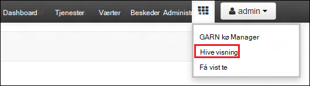
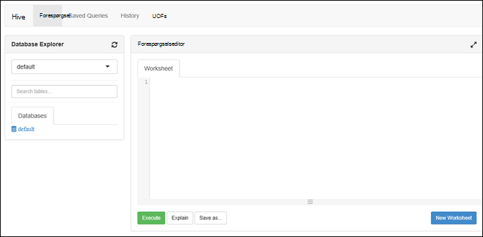

<properties
   pageTitle="Oprette HDInsight klynger med Azure Data sø Store ved hjælp af portalen | Azure"
   description="Bruge Azure Portal til at oprette og bruge HDInsight klynger med Azure sø datalager"
   services="data-lake-store,hdinsight" 
   documentationCenter=""
   authors="nitinme"
   manager="jhubbard"
   editor="cgronlun"/>

<tags
   ms.service="data-lake-store"
   ms.devlang="na"
   ms.topic="article"
   ms.tgt_pltfrm="na"
   ms.workload="big-data"
   ms.date="10/21/2016"
   ms.author="nitinme"/>

# Oprette en HDInsight klynge med datalager sø portalen til Azure

> [AZURE.SELECTOR]
- [Ved hjælp af portalen](data-lake-store-hdinsight-hadoop-use-portal.md)
- [Ved hjælp af PowerShell](data-lake-store-hdinsight-hadoop-use-powershell.md)
- [Brug af Ressourcestyring](data-lake-store-hdinsight-hadoop-use-resource-manager-template.md)

Lær at bruge Azure Portal til at oprette en HDInsight klynge (Hadoop, HBase, gnister eller Storm) med adgang til Azure sø datalager. Nogle vigtige overvejelser i forbindelse med denne version:

* **For gnister klynger (Linux) og Hadoop klynger (Windows og Linux)**, sø datalager kan kun bruges som en ekstra lagerplads konto. Lagerplads standardkontoen for sådanne klynger kan stadig Azure lagerplads BLOB (WASB).

* **For Storm klynger (Windows og Linux)**, sø datalager kan bruges til at skrive data fra en Storm topologi. Sø datalager kan også bruges til at lagre referencedata, der kan derefter læses ved en Storm topologi. Du kan finde yderligere oplysninger finder [Brug sø datalager i en Storm topologi](#use-data-lake-store-in-a-storm-topology).

* **For HBase klynger (Windows og Linux)**, sø datalager kan bruges som en standard-lager, samt ekstra lagerplads. Du kan finde flere oplysninger [Brug sø datalager med HBase klynger](#use-data-lake-store-with-hbase-clusters).

> [AZURE.NOTE] Nogle vigtige punkter du Bemærk. 
> 
> * Muligheden for at oprette HDInsight klynger med adgang til sø datalager er kun tilgængelig for HDInsight version 3.2 og 3.4 (for Hadoop, HBase og Storm klynger på Windows samt Linux). Denne indstilling er kun tilgængelig på HDInsight 3.4 klynger for gnister klynger på Linux.
>
> * Som nævnt ovenfor, er sø datalager tilgængeligt som standard lager til visse typer af klynge (HBase) og yderligere lagerplads til andre klynge typer (Hadoop, gnister, Storm). Brug af sø datalager som en ekstra lagerplads konto påvirker ikke ydeevnen eller muligheden for at læse-og skriveadgang til opbevaring fra klyngen. I et scenarie, hvor sø datalager bruges som ekstra lagerplads, skrives klynge-relaterede filer (såsom logfiler, osv.) til standard-lager (Azure BLOB), mens de data, du vil behandle kan gemmes i en sø datalager-konto.

## Forudsætninger

Inden du starter selvstudiet, skal du have følgende:

- **En Azure-abonnement**. Se [få Azure gratis prøveversion](https://azure.microsoft.com/pricing/free-trial/).

- **Azure sø datalager konto**. Følg vejledningen på [Introduktion til Azure Data sø Store ved hjælp af portalen Azure](data-lake-store-get-started-portal.md). 

- **Overføre nogle eksempeldata til kontoen Azure sø datalager**. Når du har oprettet kontoen, kan du udføre følgende opgaver for at overføre nogle eksempeldata. Disse data skal du senere i selvstudiet for at køre job fra en HDInsight klynge, få adgang til data i lageret med sø Data.

    * [Opret en mappe i dit sø datalager](data-lake-store-get-started-portal.md#createfolder).
    * [Overføre en fil til dit sø datalager](data-lake-store-get-started-portal.md#uploaddata). Hvis du leder efter nogle eksempeldata for at overføre, kan du få mappen **Ambulance Data** fra [Azure Data sø ciffer lager](https://github.com/Azure/usql/tree/master/Examples/Samples/Data/AmbulanceData).

- **Azure Active Directory Service hovedstolen**. Trinnene i dette selvstudium viser instruktioner til, hvordan du opretter en tjeneste hovedstolen i Azure AD. Skal du være administrator Azure AD lov til at oprette en tjeneste sikkerhedskonto. Hvis du er Azure AD-administrator, kan du springe over disse krav og fortsætte med selvstudiet.
    
    **Hvis du er ikke Azure AD-administrator**, kan du ikke kan udføre de trin, der er nødvendige for at oprette en tjeneste sikkerhedskonto. I så fald skal administratoren Azure AD først oprette en tjeneste sikkerhedskonto før du kan oprette en HDInsight klynge med sø datalager. Desuden skal service hovedstolen oprettes ved hjælp af et certifikat, som det er beskrevet i [oprette en tjeneste vigtigste med certifikat](../resource-group-authenticate-service-principal.md#create-service-principal-with-certificate).

## Du hurtigere at lære med videoer?

Se i de følgende videoer for at forstå, hvordan du klargør HDInsight klynger med adgang til Data sø Store.

* [Oprette en HDInsight klynge med adgang til sø datalager](https://mix.office.com/watch/l93xri2yhtp2)
* Når klyngen er konfigureret, [Access-data i datalager sø ved hjælp af Hive og gris scripts](https://mix.office.com/watch/1n9g5w0fiqv1q)

## Oprette en HDInsight klynge med adgang til Azure sø datalager

I dette afsnit, skal oprette du en HDInsight Hadoop-klynge, der bruger sø datalager som en ekstra lagerplads. I denne udgave, kan til et Hadoop-klynge, sø datalager kun bruges som en ekstra lagerplads for-klyngen. Standard lagerplads kan stadig Azure lagerplads BLOB (WASB). Så vil vi først oprette lagerplads konto og objektbeholdere, der kræves til klyngen.

1. Log den nye [Azure-portalen](https://portal.azure.com).

2. Følg trinnene i [oprette Hadoop klynger i HDInsight](../hdinsight/hdinsight-provision-clusters.md#create-using-the-preview-portal) til at starte klargøring af en HDInsight klynge.

3. Klik på **Datakilden**på bladet **Valgfri konfiguration** . Angive detaljerne for lagerplads konto og objektbeholder til lagring, Angiv **placering** som **Af US 2**bladet **Datakilde** , og klik derefter på **Klynge AAD identitet**.

    ![Tilføj tjenesten vigtigste til HDInsight klynge] (./media/data-lake-store-hdinsight-hadoop-use-portal/hdi.adl.1.png "Tilføj tjenesten vigtigste til HDInsight klynge")

4. Du kan vælge at vælge en eksisterende Service hovedstolen eller oprette en ny på bladet **Klynge AAD identitet** .

    * **Oprette en ny tjeneste sikkerhedskonto**

        * Klik på **Opret ny**i bladet **Klynge AAD identitet** , skal du klikke på **Hovedstolen for tjenesten**, og giv dernæst værdier for at oprette en ny tjeneste hovedstolen i bladet **oprette en tjeneste sikkerhedskonto** . Som en del af den der et certifikat og en Azure Active Directory-programmet oprettes også. Klik på **Opret**.

            ![Tilføj tjenesten vigtigste til HDInsight klynge] (./media/data-lake-store-hdinsight-hadoop-use-portal/hdi.adl.2.png "Tilføj tjenesten vigtigste til HDInsight klynge")

        * Klik på **Administrer ADLS Access**bladet **Klynge AAD identitet** . Ruden viser kontiene sø datalager, der er knyttet til abonnementet. Du kan dog angive tilladelser kun for den konto, du har oprettet. Vælg læse/skrive/EXECUTE tilladelser for den konto, du vil knytte til HDInsight klyngen, og klik derefter på **Gem tilladelser**.

            ![Tilføj tjenesten vigtigste til HDInsight klynge] (./media/data-lake-store-hdinsight-hadoop-use-portal/hdi.adl.3.png "Tilføj tjenesten vigtigste til HDInsight klynge")

        * Klik på **Hent certifikat** for at hente det certifikat, der er knyttet til tjenesten vigtigste du har oprettet i bladet **Klynge AAD identitet** . Dette er nyttigt, hvis du vil bruge den samme service hovedstolen fremover, mens du opretter flere HDInsight klynger. Klik på **Vælg**.

            ![Tilføj tjenesten vigtigste til HDInsight klynge] (./media/data-lake-store-hdinsight-hadoop-use-portal/hdi.adl.4.png "Tilføj tjenesten vigtigste til HDInsight klynge")

    * **Vælg en eksisterende Service hovedstolen**

        * I bladet **Klynge AAD identitet** , klik på **Brug eksisterende**, skal du klikke på **Service hovedstolen**og søg derefter efter en eksisterende service hovedstolen i bladet **Vælg en sikkerhedskonto Service** . Klik på en tjenestens hovednavn, og klik derefter på **Vælg**.

            ![Tilføj tjenesten vigtigste til HDInsight klynge] (./media/data-lake-store-hdinsight-hadoop-use-portal/hdi.adl.5.png "Tilføj tjenesten vigtigste til HDInsight klynge")

        * Upload det certifikat (.pfx), der er knyttet til tjenesten hovedstolen du har valgt på bladet **Klynge AAD identitet** , og derefter angive adgangskoden, certifikat.

5. Klik på **Administrer ADLS adgang** , og klik derefter på **Vælg filtilladelser**. 

    ![Tilføj tjenesten vigtigste til HDInsight klynge] (./media/data-lake-store-hdinsight-hadoop-use-portal/hdi.adl.5.existing.save.png "Tilføj tjenesten vigtigste til HDInsight klynge")

6. Vælg kontoen sø datalager, du vil der er knyttet til HDInsight klyngen i bladet **Vælg filtilladelser** fra rullemenuen **konto** . Bladet viser en liste over de filer og mapper, der er tilgængelige i den valgte sø datalager-konto. 
 
    ![Angiv adgang til sø datalager] (./media/data-lake-store-hdinsight-hadoop-use-portal/hdi-adl-permission-1.png "Angiv adgang til sø datalager")

    Hvilke tilladelser der skal udføres herefter på de markerede filer og mapper. For mapper, også angive, om tilladelserne, der gælder for mappen kun eller til mappen og alle de underordnede elementer i mappen. Du kan gøre dette ved at vælge den relevante værdi i feltet **Anvend på** rullelisten. Hvis du vil fjerne et tilladelsesniveau, skal du klikke på ikonet **Slet**

    ![Angiv adgang til sø datalager] (./media/data-lake-store-hdinsight-hadoop-use-portal/hdi-adl-permission-2.png "Angiv adgang til sø datalager")

    Gentag disse trin for at tilknyttede filer og mapper fra andre sø datalager konti. Klik på **Markér** i bunden af bladet, når du er færdig med at tildele tilladelser.

7. Gennemse de tilladelser, som du angav i bladet **tildele valgte tilladelser** og derefter klikke på **Kør** for at give disse tilladelser.

    ![Angiv adgang til sø datalager] (./media/data-lake-store-hdinsight-hadoop-use-portal/hdi-adl-permission-3.png "Angiv adgang til sø datalager")

    Statuskolonnen viser status. Når alle tilladelser er blevet tildelt, kan du klikke på **færdig**. 

6. Klik på **Vælg** på **Klynge AAD identitet** og **Datakilde** blade og derefter fortsætte med klynge kreationer, som beskrevet på [oprette Hadoop klynger i HDInsight](../hdinsight/hdinsight-hadoop-create-linux-clusters-portal.md).

7. Når klyngen er klargjort, kan du kan kontrollere, at tjenesten hovedstolen er knyttet til HDInsight klyngen. Hvis du vil gøre det, skal du fra bladet klynge, skal du klikke på **Klynge AAD identitet** for at få vist tilknyttede Service hovedstolen.

    ![Tilføj tjenesten vigtigste til HDInsight klynge] (./media/data-lake-store-hdinsight-hadoop-use-portal/hdi.adl.6.png "Tilføj tjenesten vigtigste til HDInsight klynge")

## Køre testjob på HDInsight-klyngen for at bruge Azure sø datalager

Når du har konfigureret en HDInsight klynge, kan du køre testjob på klynge for at teste, HDInsight klynge kan få adgang til data i Azure sø datalager. For at gøre det, vil vi gennemgå nogle hive-forespørgsler, der target sø datalager.

### For en Linux klynge

1. Åbn bladet klynge for den klynge, du lige har klargjort, og klik derefter på **Dashboard**. Dette åbner Ambari for Linux klynge. Når du åbner Ambari, bliver du bedt om at godkende til webstedet. Angiv administrator (standard-administrator) navn og en adgangskode, du brugte, når du opretter klyngen-konto.

    ![Start klynge dashboard] (./media/data-lake-store-hdinsight-hadoop-use-portal/hdiadlcluster1.png "Start klynge dashboard")

    Du kan også gå direkte til Ambari ved at gå til https://CLUSTERNAME.azurehdinsight.net i en webbrowser (hvor **CLUSTERNAME** er navnet på din HDInsight klynge).

2. Åbne visningen Hive. Vælg sæt af kvadrater fra sidemenuen (ved siden af det link, **administrator** og knappen til højre på siden) til listen tilgængelige visninger. Vælg **Hive** visningen.

    

3. Du burde se en side, der ligner følgende:

    

4. I sektionen **Forespørgselseditor** på siden, kan du indsætte følgende HiveQL-sætning i regnearket:

        CREATE EXTERNAL TABLE vehicles (str string) LOCATION 'adl://mydatalakestore.azuredatalakestore.net:443/mynewfolder'

5. Klik på knappen **Udfør** nederst i **Query Editor** til at starte forespørgslen. En **Proces forespørgselsresultater** sektion skal vises under **Query Editor** og få vist oplysninger om jobbet.

6. Når forespørgslen er færdig, vises sektionen **Proces forespørgselsresultater** resultaterne af handlingen. Fanen **resultater** skal indeholde følgende oplysninger:

7. Køre følgende forespørgsel for at bekræfte, at tabellen blev oprettet.

        SHOW TABLES;

    Fanen **resultater** bør vise følgende:

        hivesampletable
        vehicles

    **køretøjer** er den tabel, du oprettede tidligere. **hivesampletable** er et eksempel på tabellen tilgængelig i alle HDInsight klynger som standard.

8. Du kan også køre en forespørgsel for at hente data fra tabellen **køretøjer** .

        SELECT * FROM vehicles LIMIT 5;

### Til en Windows-klynge

1. Åbn bladet klynge for den klynge, du lige har klargjort, og klik derefter på **Dashboard**.

    ![Start klynge dashboard] (./media/data-lake-store-hdinsight-hadoop-use-portal/hdiadlcluster1.png "Start klynge dashboard")

    Når du bliver bedt om det, kan du angive legitimationsoplysninger for administrator for-klyngen.

2. Dette åbner konsollen Microsoft Azure HDInsight forespørgsel. Klik på **Hive Editor**.

    ![Åbn Hive editor] (./media/data-lake-store-hdinsight-hadoop-use-portal/hdiadlcluster2.png "Åbn Hive editor")

3. Angiv følgende forespørgsel i redigeringsprogrammet Hive, og klik derefter på **Send**.

        CREATE EXTERNAL TABLE vehicles (str string) LOCATION 'adl://mydatalakestore.azuredatalakestore.net:443/mynewfolder'

    I denne Hive-forespørgsel, skal vi oprette en tabel med data, der er gemt i sø datalager på `adl://mydatalakestore.azuredatalakestore.net:443/mynewfolder`. Her er et eksempel-datafil, du bør har overført tidligere.

    Tabellen **Job Session** nederst viser status for jobbet skifter fra **initialiserer**til **kører**, til **afsluttet**. Du kan også klikke på **Vis detaljer** for at se flere oplysninger om den afsluttede sag.

    ![Opret en tabel] (./media/data-lake-store-hdinsight-hadoop-use-portal/hdiadlcluster3.png "Opret en tabel")

4. Køre følgende forespørgsel for at bekræfte, at tabellen blev oprettet.

        SHOW TABLES;

    Klik på **Vis detaljer** svarer til denne forespørgsel og output skal vise følgende:

        hivesampletable
        vehicles

    **køretøjer** er den tabel, du oprettede tidligere. **hivesampletable** er et eksempel på tabellen tilgængelig i alle HDInsight klynger som standard.

5. Du kan også køre en forespørgsel for at hente data fra tabellen **køretøjer** .

        SELECT * FROM vehicles LIMIT 5;

## Access Data sø Store ved hjælp af HDFS kommandoer

Når du har konfigureret HDInsight klynge for at bruge sø datalager, kan du bruge kommandoerne HDFS shell til at få adgang til store.

### For en Linux klynge

I dette afsnit, du vil SSH i klyngen og køre kommandoerne HDFS. Windows indeholder ikke en indbygget SSH-klient. Det anbefales at bruge **trykfarver**, som kan hentes fra [http://www.chiark.greenend.org.uk/~sgtatham/putty/download.html](http://www.chiark.greenend.org.uk/~sgtatham/putty/download.html).

Finde flere oplysninger om brug af trykfarver, [Brug SSH med Linux-baserede Hadoop på HDInsight fra Windows](../hdinsight/hdinsight-hadoop-linux-use-ssh-windows.md).

Når forbindelse, kan du bruge følgende HDFS filsystemet kommando til at få vist filerne i sø datalager.

    hdfs dfs -ls adl://<Data Lake Store account name>.azuredatalakestore.net:443/

Dette skal indeholde den fil, du tidligere har overført til sø datalager.

    15/09/17 21:41:15 INFO web.CaboWebHdfsFileSystem: Replacing original urlConnectionFactory with org.apache.hadoop.hdfs.web.URLConnectionFactory@21a728d6
    Found 1 items
    -rwxrwxrwx   0 NotSupportYet NotSupportYet     671388 2015-09-16 22:16 adl://mydatalakestore.azuredatalakestore.net:443/mynewfolder

Du kan også bruge den `hdfs dfs -put` kommandoen til at overføre nogle filer til sø datalager, og brug derefter `hdfs dfs -ls` til at kontrollere, om filerne er blevet overført.

### Til en Windows-klynge

1. Log den nye [Azure-portalen](https://portal.azure.com).

2. Klik på **Gennemse**, klik på **HDInsight klynger**, og klik derefter på den HDInsight-klynge, du har oprettet.

3. Klik på **Fjernskrivebord**i bladet klynge, og klik derefter på **Tilslut**i bladet **Fjernskrivebord** .

    ![Remote i HDI klynge] (./media/data-lake-store-hdinsight-hadoop-use-portal/ADL.HDI.PS.Remote.Desktop.png "Oprette en Azure ressourcegruppe")

    Når du bliver bedt om det, kan du angive de legitimationsoplysninger, du har angivet for remote desktop brugeren.

4. Start Windows PowerShell i fjernsession, og bruge kommandoerne HDFS filsystemet for at vise filerne i Azure sø datalager.

        hdfs dfs -ls adl://<Data Lake Store account name>.azuredatalakestore.net:443/

    Dette skal indeholde den fil, du tidligere har overført til sø datalager.

        15/09/17 21:41:15 INFO web.CaboWebHdfsFileSystem: Replacing original urlConnectionFactory with org.apache.hadoop.hdfs.web.URLConnectionFactory@21a728d6
        Found 1 items
        -rwxrwxrwx   0 NotSupportYet NotSupportYet     671388 2015-09-16 22:16 adl://mydatalakestore.azuredatalakestore.net:443/mynewfolder

    Du kan også bruge den `hdfs dfs -put` kommandoen til at overføre nogle filer til sø datalager, og brug derefter `hdfs dfs -ls` til at kontrollere, om filerne er blevet overført.

## Brug sø datalager med knallertmotor klynge

I dette afsnit, skal bruge du Jupyter notesbog tilgængelig med HDInsight Spark klynger til at køre et job, der læser data fra en sø datalager-konto, som du har knyttet til en HDInsight Spark klynge, i stedet for Azure lagerplads Blob standardkontoen.

1. Kopiér over nogle eksempeldata fra lagerplads standardkontoen (WASB) der er knyttet til knallertmotor klynge til kontoen Azure Data sø store, der er knyttet til klyngen. Du kan bruge [ADLCopy værktøj til](http://aka.ms/downloadadlcopy) at gøre dette. Hent og Installer værktøjet link.

2. Åbn en kommandoprompt, og gå til den mappe, hvor AdlCopy er installeret, typisk `%HOMEPATH%\Documents\adlcopy`.

3. Kør følgende kommando for at kopiere en bestemt blob fra objektbeholderen kilde til et datalager sø:

        AdlCopy /source https://<source_account>.blob.core.windows.net/<source_container>/<blob name> /dest swebhdfs://<dest_adls_account>.azuredatalakestore.net/<dest_folder>/ /sourcekey <storage_account_key_for_storage_container>

    Dette selvstudium skal du kopiere data **HVAC.csv** eksempelfilen på **/HdiSamples/HdiSamples/SensorSampleData/VVS-/** til kontoen Azure sø datalager. Kodestykket skal se sådan ud:

        AdlCopy /Source https://mydatastore.blob.core.windows.net/mysparkcluster/HdiSamples/HdiSamples/SensorSampleData/hvac/HVAC.csv /dest swebhdfs://mydatalakestore.azuredatalakestore.net/hvac/ /sourcekey uJUfvD6cEvhfLoBae2yyQf8t9/BpbWZ4XoYj4kAS5Jf40pZaMNf0q6a8yqTxktwVgRED4vPHeh/50iS9atS5LQ==

    >[AZURE.WARNING] Sørg for, at filen og stien navnene er til stort forbogstav.

4. Du bliver bedt om at angive legitimationsoplysninger for Azure abonnementet under, du har kontoen sø datalager. Der vises en output, der ligner følgende:

        Initializing Copy.
        Copy Started.
        100% data copied.
        Copy Completed. 1 file copied.

    Datafilen (**HVAC.csv**), kopieres under mappen **/hvac** i kontoen sø datalager.

4. Klik på feltet for din knallertmotor klynge fra [Azure-portalen](https://portal.azure.com/), fra startboard (hvis det fastgjort til startboard). Du kan også gå til din klynge under **Gennemse alle** > **HDInsight klynger**.   

2. Klik på **Hurtige Links**fra bladet knallertmotor klynge, og klik derefter på **Jupyter notesbog**fra bladet **Klynge Dashboard** . Hvis du bliver bedt om det, kan du angive Administratoroplysninger for-klyngen.

    > [AZURE.NOTE] Du kan også når Jupyter notesbogen til din klynge ved at åbne følgende URL-adressen i din browser. Erstat __CLUSTERNAME__ med navnet på din klynge:
    >
    > `https://CLUSTERNAME.azurehdinsight.net/jupyter`

2. Oprette en ny notesbog. Klik på **Ny**, og klik derefter på **PySpark**.

    ![Opret en ny Jupyter notesbog] (./media/data-lake-store-hdinsight-hadoop-use-portal/hdispark.note.jupyter.createnotebook.png "Opret en ny Jupyter notesbog")

3. En ny notesbog er oprettet og åbnes med navnet **Untitled.pynb**. 

4. Fordi du har oprettet en notesbog ved hjælp af PySpark kernen, behøver du ikke at oprette en hvilken som helst kontekster eksplicit. Tænding og Hive kontekster oprettes automatisk for dig, når du kører den første celle i kode. Du kan starte ved at importere de typer, der kræves til dette scenario. Indsæt følgende kodestykke i en celle for at gøre det, og tryk på **SKIFT + ENTER**.

        from pyspark.sql.types import *
        
    Hver gang du kører en sag i Jupyter, vises din webbrowser-vinduestitel statussen **(optaget)** sammen med titlen notesbog. Du kan også se en udfyldt cirkel ud for **PySpark** teksten i det øverste højre hjørne. Når jobbet er fuldført, ændres til en tom cirkel.

     ![Status for et Jupyter notesbog job] (./media/data-lake-store-hdinsight-hadoop-use-portal/hdispark.jupyter.job.status.png "Status for et Jupyter notesbog job")

4. Indlæse eksempeldata i en midlertidig tabel ved hjælp af den **HVAC.csv** -fil, du kopierede til kontoen sø datalager. Du kan få adgang til dataene i den sø datalager konto ved hjælp af følgende URL-adressen mønster.

        adl://<data_lake_store_name>.azuredatalakestore.net/<path_to_file>

    I en tom celle, Indsæt følgende kodeeksempel, erstatte **MYDATALAKESTORE** med dit sø datalager kontonavn og trykke på **SKIFT + ENTER**. Denne kodeeksempel registrerer dataene til en midlertidig tabel kaldet **VVS**.

        # Load the data
        hvacText = sc.textFile("adl://MYDATALAKESTORE.azuredatalakestore.net/hvac/HVAC.csv")
        
        # Create the schema
        hvacSchema = StructType([StructField("date", StringType(), False),StructField("time", StringType(), False),StructField("targettemp", IntegerType(), False),StructField("actualtemp", IntegerType(), False),StructField("buildingID", StringType(), False)])
        
        # Parse the data in hvacText
        hvac = hvacText.map(lambda s: s.split(",")).filter(lambda s: s[0] != "Date").map(lambda s:(str(s[0]), str(s[1]), int(s[2]), int(s[3]), str(s[6]) ))
        
        # Create a data frame
        hvacdf = sqlContext.createDataFrame(hvac,hvacSchema)
        
        # Register the data fram as a table to run queries against
        hvacdf.registerTempTable("hvac")

5. Fordi du bruger en PySpark kerne, du kan nu direkte køre en SQL-forespørgsel på midlertidig tabel **VVS** , du lige har oprettet ved hjælp af den `%%sql` magisk. Du kan finde flere oplysninger om den `%%sql` magisk samt andre magics, der er tilgængelige med kernen PySpark se [kerner, der er tilgængelige på Jupyter notesbøger med knallertmotor HDInsight klynger](hdinsight-apache-spark-jupyter-notebook-kernels.md#why-should-i-use-the-new-kernels).
        
        %%sql
        SELECT buildingID, (targettemp - actualtemp) AS temp_diff, date FROM hvac WHERE date = \"6/1/13\"

5. Når jobbet er fuldført, vises følgende tabelformat output som standard.

    ![Tabel output fra forespørgselsresultatet] (./media/data-lake-store-hdinsight-hadoop-use-portal/tabular.output.png "Tabel output fra forespørgselsresultatet")

    Du kan også få vist resultaterne i andre visualiseringer samt. For eksempel vil en område graph til samme output ligne følgende.

    ![Området graf over resultat af forespørgslen] (./media/data-lake-store-hdinsight-hadoop-use-portal/area.output.png "Området graf over resultat af forespørgslen")

6. Når du er færdig med at køre programmet, skal du lukke notesbogen for at frigøre ressourcerne. Hvis du vil gøre det, skal du fra menuen **filer** på notesbogen, skal du klikke på **Luk og standse**. Denne blive lukket, og Luk notesbogen.

## Brug sø datalager i en Storm topologi

Du kan bruge sø datalager til at skrive data fra en Storm topologi. Du kan finde oplysninger om, hvordan du kan opnå dette scenario, [Brug Azure sø datalager med Apache Storm med HDInsight](../hdinsight/hdinsight-storm-write-data-lake-store.md).

## Brug sø datalager med HBase klynger

Du kan bruge sø datalager med HBase klynger, som en standard-lager, samt ekstra lagerplads. Gør følgende:

1.  Vælg **Sø datalager** for **Placering af HBase**i bladet **Datakilde** .
2.  Vælg navnet på det sø datalager, som du vil bruge, eller Opret en ny.
3.  Til sidst skal du angive **HBase rodmappen** i sø datalager. Hvis sø datalager konto ikke har en rodmappe, kan du oprette en ny.

    ![HBase med sø datalager] (./media/data-lake-store-hdinsight-hadoop-use-portal/hbase-data-lake-store.png "Oprette en Azure ressourcegruppe")

### Overvejelser ved brug af sø datalager som standard lagerplads til HBase klynger

* Du kan bruge den samme konto sø datalager for mere end én HBase klynge. Dog skal **HBase rodmappe** , du angiver for klynge (trin 4 i skærmbilledet ovenfor) være entydige. Du **skal ikke** bruge den samme rodmappen på tværs af to forskellige HBase klynger.
* Selvom du bruger sø datalager konto som standard lagerplads, gemmes loggene HBase klynge stadig i Azure lagerplads BLOB (WASB) der er knyttet til klyngen. Dette er fremhævet i den blå boksen i skærmbilledet ovenfor.

## Se også

* [PowerShell: Oprette en HDInsight klynge for at bruge sø datalager](data-lake-store-hdinsight-hadoop-use-powershell.md)

[makecert]: https://msdn.microsoft.com/library/windows/desktop/ff548309(v=vs.85).aspx
[pvk2pfx]: https://msdn.microsoft.com/library/windows/desktop/ff550672(v=vs.85).aspx
