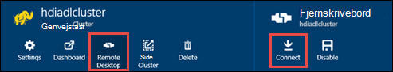

<properties
   pageTitle="Oprette HDInsight klynger med Azure Data sø Store ved hjælp af Ressourcestyring skabeloner | Microsoft Azure"
   description="Brug Azure ressourcestyring skabeloner til at oprette og bruge HDInsight klynger med Azure sø datalager"
   services="data-lake-store,hdinsight"
   documentationCenter=""
   authors="nitinme"
   manager="jhubbard"
   editor="cgronlun"/>

<tags
   ms.service="data-lake-store"
   ms.devlang="na"
   ms.topic="article"
   ms.tgt_pltfrm="na"
   ms.workload="big-data"
   ms.date="10/21/2016"
   ms.author="nitinme"/>

# <a name="create-an-hdinsight-cluster-with-data-lake-store-using-azure-resource-manager-template"></a>Oprette en HDInsight klynge med datalager sø ved hjælp af Azure ressourcestyring skabelon

> [AZURE.SELECTOR] - [Ved hjælp af portalen](data-lake-store-hdinsight-hadoop-use-portal.md) - [ved hjælp af PowerShell](data-lake-store-hdinsight-hadoop-use-powershell.md) - [ved hjælp af Ressourcestyring](data-lake-store-hdinsight-hadoop-use-resource-manager-template.md)

Lær at bruge en skabelon til Azure ressourcestyring til at konfigurere en HDInsight klynge med adgang til Azure sø datalager. Nogle vigtige overvejelser i forbindelse med denne version:

-   **For gnister klynger (Linux), og Hadoop/Storm klynger (Windows og Linux)**, sø datalager kan kun bruges som en ekstra lagerplads konto. Lagerplads standardkontoen for sådanne klynger kan stadig Azure lagerplads BLOB (WASB).

-   **For HBase klynger (Windows og Linux)**, sø datalager kan bruges som standard lagerplads eller ekstra lagerplads.

> [AZURE.NOTE] Nogle vigtige punkter du Bemærk.
>
> - Muligheden for at oprette HDInsight klynger med adgang til sø datalager er kun tilgængelig for HDInsight version 3.2 og 3.4 (for Hadoop, HBase og Storm klynger på Windows samt Linux). Denne indstilling er kun tilgængelig på HDInsight 3.4 klynger for gnister klynger på Linux.
>
> - Som nævnt ovenfor, er sø datalager tilgængeligt som standard lager til visse typer af klynge (HBase) og yderligere lagerplads til andre klynge typer (Hadoop, gnister, Storm). Brug af sø datalager som en ekstra lagerplads konto påvirker ikke ydeevnen eller muligheden for at læse-og skriveadgang til opbevaring fra klyngen. I et scenarie, hvor sø datalager bruges som ekstra lagerplads, skrives klynge-relaterede filer (såsom logfiler, osv.) til standard-lager (Azure BLOB), mens de data, du vil behandle kan gemmes i en sø datalager-konto.
>

I denne artikel klargøre vi en Hadoop klynge med sø datalager som ekstra lagerplads.

## <a name="prerequisites"></a>Forudsætninger

Inden du starter selvstudiet, skal du have følgende:

-   **En Azure-abonnement**. Se [få Azure gratis prøveversion](https://azure.microsoft.com/pricing/free-trial/).

-   **Azure PowerShell 1.0 eller større**. Se, [hvordan du installerer og konfigurerer Azure PowerShell](../powershell-install-configure.md).

- **Azure Active Directory Service hovedstolen**. Trinnene i dette selvstudium viser instruktioner til, hvordan du opretter en tjeneste hovedstolen i Azure AD. Skal du være administrator Azure AD lov til at oprette en tjeneste sikkerhedskonto. Hvis du er Azure AD-administrator, kan du springe over disse krav og fortsætte med selvstudiet.
    
    **Hvis du er ikke Azure AD-administrator**, kan du ikke kan udføre de trin, der er nødvendige for at oprette en tjeneste sikkerhedskonto. I så fald skal administratoren Azure AD først oprette en tjeneste sikkerhedskonto før du kan oprette en HDInsight klynge med sø datalager. Desuden skal service hovedstolen oprettes ved hjælp af et certifikat, som det er beskrevet i [oprette en tjeneste vigtigste med certifikat](../resource-group-authenticate-service-principal.md#create-service-principal-with-certificate).

## <a name="create-an-hdinsight-cluster-with-azure-data-lake-store"></a>Oprette en HDInsight klynge med Azure sø datalager

Skabelonen ressourcestyring og forudsætninger for ved hjælp af skabelonen, er tilgængelige på GitHub på [Implementer en HDInsight Linux klynge med nye Data sø Store](https://github.com/Azure/azure-quickstart-templates/tree/master/201-hdinsight-datalake-store-azure-storage). Følg instruktionerne på dette link for at oprette en HDInsight klynge med Azure sø datalager som den ekstra lagerplads.

Vejledningen på det link, der er nævnt ovenfor kræver PowerShell. Før du går i gang med disse instruktioner, Kontroller, at du logger på din Azure-konto. Åbn et nyt vindue Azure PowerShell fra din computer, og Angiv følgende kodestykker. Når du bliver bedt om at logge på, skal du kontrollere du logger på som et af admininistrators/ejeren af abonnementet:

```
# Log in to your Azure account
Login-AzureRmAccount

# List all the subscriptions associated to your account
Get-AzureRmSubscription

# Select a subscription
Set-AzureRmContext -SubscriptionId <subscription ID>
```

## <a name="upload-sample-data-to-the-azure-data-lake-store"></a>Overføre eksempeldata til Azure sø datalager

Skabelonen ressourceleder, der opretter en ny konto sø datalager og knytter den til HDInsight klyngen. Nu skal du overføre nogle eksempeldata til sø datalager. Disse data skal du senere i selvstudiet for at køre job fra en HDInsight klynge, få adgang til data i lageret med sø Data. Flere oplysninger om at overføre data, under [overføre en fil til dit sø datalager](data-lake-store-get-started-portal.md#uploaddata). Hvis du leder efter nogle eksempeldata for at overføre, kan du få mappen **Ambulance Data** fra [Azure Data sø ciffer lager](https://github.com/Azure/usql/tree/master/Examples/Samples/Data/AmbulanceData).

## <a name="set-relevant-acls-on-the-sample-data"></a>Sæt relevante ACLs af eksempeldataene

For at sikre, at de eksempeldata, du overfører er tilgængelig fra HDInsight klynge, skal du sikre, at det Azure AD-program, der bruges til at etablere identitet mellem HDInsight klynge og sø datalager har adgang til filen eller mappen du forsøger at få adgang til. For at gøre dette skal du udføre følgende trin.

1.  Finde navnet på det Azure AD-program, der er knyttet til HDInsight klynge og sø datalager. En metode til at søge efter navnet på er at åbne bladet HDInsight klynge, du har oprettet ved hjælp af skabelonen Ressourcestyring, klik på fanen **Klynge AAD identitet** og se efter værdien af **Tjenesten hovedstolen vist navn**.

2.  Nu, Giv adgang til dette Azure AD-program på filen eller mappen, som du vil have adgang til fra HDInsight klynge. For at angive de rigtige ACLs på filen eller mappen i sø datalager, skal du se [sikring af data i sø datalager](data-lake-store-secure-data.md#assign-users-or-security-group-as-acls-to-the-azure-data-lake-store-file-system).

## <a name="run-test-jobs-on-the-hdinsight-cluster-to-use-the-data-lake-store"></a>Køre testjob på HDInsight-klyngen for at bruge sø datalager

Når du har konfigureret en HDInsight klynge, kan du køre testjob på klynge for at teste, HDInsight klynge kan få adgang til sø datalager. Hvis du vil gøre det, vil vi gennemgå et eksempel Hive-job, der opretter en tabel med eksempeldata, som du tidligere har overført til dit sø datalager.

### <a name="for-a-linux-cluster"></a>For en Linux klynge

I dette afsnit kan du SSH i klynge og Kør på en stikprøve Hive forespørgsel. Windows indeholder ikke en indbygget SSH-klient. Det anbefales at bruge **trykfarver**, som kan hentes fra [http://www.chiark.greenend.org.uk/~sgtatham/putty/download.html](http://www.chiark.greenend.org.uk/~sgtatham/putty/download.html).

Finde flere oplysninger om brug af trykfarver, [Brug SSH med Linux-baserede Hadoop på HDInsight fra Windows ](../hdinsight/hdinsight-hadoop-linux-use-ssh-windows.md).

1.  Når forbindelse, kan du begynde på Hive CLI ved hjælp af følgende kommando:

    ```
    hive
    ```

2.  Angiv følgende udtalelser for at oprette en ny tabel med navnet **køretøjer** ved hjælp af eksempeldataene i lageret med sø Data ved at bruge CLI:

    ```
    DROP TABLE vehicles;
    CREATE EXTERNAL TABLE vehicles (str string) LOCATION 'adl://<mydatalakestore>.azuredatalakestore.net:443/';
    SELECT * FROM vehicles LIMIT 10;
    ```

    Du burde se output ligner følgende:

    ```
    1,1,2014-09-14 00:00:03,46.81006,-92.08174,51,S,1
    1,2,2014-09-14 00:00:06,46.81006,-92.08174,13,NE,1
    1,3,2014-09-14 00:00:09,46.81006,-92.08174,48,NE,1
    1,4,2014-09-14 00:00:12,46.81006,-92.08174,30,W,1
    1,5,2014-09-14 00:00:15,46.81006,-92.08174,47,S,1
    1,6,2014-09-14 00:00:18,46.81006,-92.08174,9,S,1
    1,7,2014-09-14 00:00:21,46.81006,-92.08174,53,N,1
    1,8,2014-09-14 00:00:24,46.81006,-92.08174,63,SW,1
    1,9,2014-09-14 00:00:27,46.81006,-92.08174,4,NE,1
    1,10,2014-09-14 00:00:30,46.81006,-92.08174,31,N,1
    ```

### <a name="for-a-windows-cluster"></a>Til en Windows-klynge

Brug følgende cmdletter til at køre forespørgslen Hive. I denne forespørgsel vi oprette en tabel ud fra data i lageret med sø Data og derefter køre en udvælgelsesforespørgsel på den oprettede tabel.

```
$queryString = "DROP TABLE vehicles;" + "CREATE EXTERNAL TABLE vehicles (str string) LOCATION 'adl://$dataLakeStoreName.azuredatalakestore.net:443/';" + "SELECT * FROM vehicles LIMIT 10;"

$hiveJobDefinition = New-AzureRmHDInsightHiveJobDefinition -Query $queryString

$hiveJob = Start-AzureRmHDInsightJob -ResourceGroupName $resourceGroupName -ClusterName $clusterName -JobDefinition $hiveJobDefinition -ClusterCredential $httpCredentials

Wait-AzureRmHDInsightJob -ResourceGroupName $resourceGroupName -ClusterName $clusterName -JobId $hiveJob.JobId -ClusterCredential $httpCredentials
```

Dette får følgende output. **ExitValue** på 0 i outputtet foreslår, at jobbet blev fuldført.

```
Cluster         : hdiadlcluster.
HttpEndpoint    : hdiadlcluster.azurehdinsight.net
State           : SUCCEEDED
JobId           : job_1445386885331_0012
ParentId        :
PercentComplete :
ExitValue       : 0
User            : admin
Callback        :
Completed       : done
```

Hente output fra jobbet ved hjælp af følgende cmdlet:

```
Get-AzureRmHDInsightJobOutput -ClusterName $clusterName -JobId $hiveJob.JobId -DefaultContainer $containerName -DefaultStorageAccountName $storageAccountName -DefaultStorageAccountKey $storageAccountKey -ClusterCredential $httpCredentials
```

Jobbet output ligner følgende:

```
1,1,2014-09-14 00:00:03,46.81006,-92.08174,51,S,1
1,2,2014-09-14 00:00:06,46.81006,-92.08174,13,NE,1
1,3,2014-09-14 00:00:09,46.81006,-92.08174,48,NE,1
1,4,2014-09-14 00:00:12,46.81006,-92.08174,30,W,1
1,5,2014-09-14 00:00:15,46.81006,-92.08174,47,S,1
1,6,2014-09-14 00:00:18,46.81006,-92.08174,9,S,1
1,7,2014-09-14 00:00:21,46.81006,-92.08174,53,N,1
1,8,2014-09-14 00:00:24,46.81006,-92.08174,63,SW,1
1,9,2014-09-14 00:00:27,46.81006,-92.08174,4,NE,1
1,10,2014-09-14 00:00:30,46.81006,-92.08174,31,N,1
```

## <a name="access-data-lake-store-using-hdfs-commands"></a>Access Data sø Store ved hjælp af HDFS kommandoer

Når du har konfigureret HDInsight klynge for at bruge sø datalager, kan du bruge kommandoerne HDFS shell til at få adgang til store.

### <a name="for-a-linux-cluster"></a>For en Linux klynge

I dette afsnit, du vil SSH i klyngen og køre kommandoerne HDFS. Windows indeholder ikke en indbygget SSH-klient. Det anbefales at bruge **trykfarver**, som kan hentes fra [http://www.chiark.greenend.org.uk/~sgtatham/putty/download.html](http://www.chiark.greenend.org.uk/~sgtatham/putty/download.html).

Finde flere oplysninger om brug af trykfarver, [Brug SSH med Linux-baserede Hadoop på HDInsight fra Windows ](../hdinsight/hdinsight-hadoop-linux-use-ssh-windows.md).

Når forbindelse, kan du bruge følgende HDFS filsystemet kommando til at få vist filerne i sø datalager.

```
hdfs dfs -ls adl://<Data Lake Store account name>.azuredatalakestore.net:443/
```

Dette skal indeholde den fil, du tidligere har overført til sø datalager.

```
15/09/17 21:41:15 INFO web.CaboWebHdfsFileSystem: Replacing original urlConnectionFactory with org.apache.hadoop.hdfs.web.URLConnectionFactory@21a728d6
Found 1 items
-rwxrwxrwx   0 NotSupportYet NotSupportYet     671388 2015-09-16 22:16 adl://mydatalakestore.azuredatalakestore.net:443/mynewfolder
```

Du kan også bruge den `hdfs dfs -put` kommandoen til at overføre nogle filer til sø datalager, og brug derefter `hdfs dfs -ls` til at kontrollere, om filerne er blevet overført.

### <a name="for-a-windows-cluster"></a>Til en Windows-klynge

1.  Log den nye [Azure-portalen](https://portal.azure.com).

2.  Klik på **Gennemse**, klik på **HDInsight klynger**, og klik derefter på den HDInsight-klynge, du har oprettet.

3.  Klik på **Fjernskrivebord**i bladet klynge, og klik derefter på **Tilslut**i bladet **Fjernskrivebord** .

    

    Når du bliver bedt om det, kan du angive de legitimationsoplysninger, du har angivet for remote desktop brugeren.

4.  Start Windows PowerShell i fjernsession, og bruge kommandoerne HDFS filsystemet for at vise filerne i Azure sø datalager.

    ```
    hdfs dfs -ls adl://<Data Lake Store account name>.azuredatalakestore.net:443/
    ```

    Dette skal indeholde den fil, du tidligere har overført til sø datalager.

    ```
    15/09/17 21:41:15 INFO web.CaboWebHdfsFileSystem: Replacing original urlConnectionFactory with org.apache.hadoop.hdfs.web.URLConnectionFactory@21a728d6
    Found 1 items
    -rwxrwxrwx   0 NotSupportYet NotSupportYet     671388 2015-09-16 22:16 adl://mydatalakestore.azuredatalakestore.net:443/vehicle1_09142014.csv
    ```

    Du kan også bruge den `hdfs dfs -put` kommandoen til at overføre nogle filer til sø datalager, og brug derefter `hdfs dfs -ls` til at kontrollere, om filerne er blevet overført.

## <a name="next-steps"></a>Næste trin

-   [Kopiere data fra Azure-lager BLOB til sø datalager](data-lake-store-copy-data-wasb-distcp.md)
