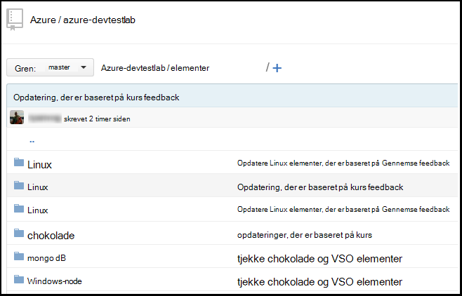
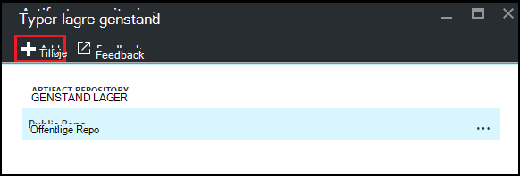
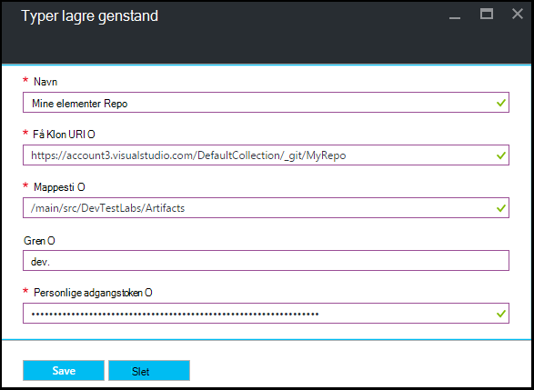

<properties
    pageTitle="Føje et ciffer genstand lager til en øvelse i Azure DevTest øvelser | Microsoft Azure"
    description="Føje et GitHub eller Visual Studio Team Services ciffer lager til din brugerdefinerede elementer kilde i Azure DevTest øvelser"
    services="devtest-lab,virtual-machines,visual-studio-online"
    documentationCenter="na"
    authors="tomarcher"
    manager="douge"
    editor=""/>

<tags
    ms.service="devtest-lab"
    ms.workload="na"
    ms.tgt_pltfrm="na"
    ms.devlang="na"
    ms.topic="article"
    ms.date="09/06/2016"
    ms.author="tarcher"/>

# Føje et ciffer genstand lager til en øvelse i Azure DevTest øvelser

> [AZURE.VIDEO how-to-add-your-private-artifacts-repository-in-a-devtest-lab]

Elementer er i Azure DevTest øvelser *Handlinger* - som installation af software eller kører scripts og kommandoer - når der oprettes en VM. Som standard omfatter en øvelse elementer fra officielle Azure DevTest øvelser genstand lager. Du kan føje et ciffer genstand lager til din øvelse medtage de elementer, som dit team opretter. Lageret kan bruges på [GitHub](https://github.com) eller [Visual Studio Team Services (VSTS)](https://visualstudio.com).

- Hvis du vil lære at oprette et GitHub lager, skal du se [GitHub Bootcamp](https://help.github.com/categories/bootcamp/).
- Hvis du vil lære at oprette et Team Services-projekt med et ciffer lager, skal du se [oprette forbindelse til Visual Studio Team Services](https://www.visualstudio.com/get-started/setup/connect-to-visual-studio-online).

Følgende skærmbillede viser et eksempel på, hvordan et lager, der indeholder elementer kan se i GitHub:  

## Få oplysninger om lager og legitimationsoplysninger

For at tilføje en genstand lager til din øvelse, skal du først få visse oplysninger fra din lager. De følgende afsnit fører dig gennem få disse oplysninger til genstand typer lagre hostes på GitHub og Visual Studio Team Services.

### Få GitHub lager Klon URL-adresse og personlig access token

For at få GitHub lager Klon URL-adresse og personlig adgangstoken, skal du følge disse trin:

1. Gå til startsiden for det GitHub lager, der indeholder genstand definitionerne.

1. Vælg **Klon eller download**.

1. Vælg knap for at kopiere den **HTTPS klone URL-adresse** til Udklipsholder, og Gem URL-adressen til senere brug.

1. Vælg billedet profil i øverste højre hjørne af GitHub, og vælg **Indstillinger**.

1. Vælg **personlige access tokens**i menuen **personlige indstillinger** i venstre side.

1. Vælg **Opret nyt id**.

1. Angiv en **Beskrivelse af Token**på siden **Ny personlige adgangstoken** , acceptere standardelementer i **Vælg områder**, og derefter vælge **Generere Token**.

1. Gemme det oprettede token, som du vil have den senere.

1. Du kan lukke GitHub nu.   

1. Gå videre til afsnittet [forbinde dine øvelse til genstand lager](#connect-your-lab-to-the-artifact-repository) .

### Få Visual Studio Team Services lager Klon URL-adresse og personlig access token

For at få Visual Studio Team Services lager Klon URL-adresse og personlig adgangstoken skal du følge disse trin:

1. Åbn startsiden for gruppen af websteder (for eksempel `https://contoso-web-team.visualstudio.com`), og vælg derefter genstand projektet.

1. Vælg **kode**på startsiden i project.

1. Vælg **Klon**for at få vist URL-adressen Klon på siden projekt **kode** .

1. Gem URL-adressen, som du vil have den senere i dette selvstudium.

1. For at oprette en personlig Access Token skal du vælge **min profil** i menuen bruger konto ned.

1. Vælg **sikkerhed**på siden profil oplysninger.

1. Vælg **Tilføj**på fanen **sikkerhed** .

1. På siden **Opret en personlig adgangstoken** :

    - Angiv en **Beskrivelse** til tokenet.
    - Vælg **180 dage** på listen **Udløber i** .
    - Vælg **alle tilgængelige konti** fra listen over **konti** .
    - Vælg indstillingen **alle områder** .
    - Vælg **Opret Token**.

1. Når du er færdig, vises det nye token på listen **Personlige Access Tokens** . Vælg **Kopiér Token**, og Gem det token til senere brug.

1. Gå videre til afsnittet [forbinde dine øvelse til genstand lager](#connect-your-lab-to-the-artifact-repository) .

##Forbinde dine øvelse til genstand lager

1. Log på [Azure-portalen](http://go.microsoft.com/fwlink/p/?LinkID=525040).

1. Vælg **Flere tjenester**, og vælg derefter **DevTest øvelser** på listen.

1. Vælg den ønskede øvelse på listen over øvelser.   

1. Vælg **konfiguration**på den øvelse blade.

1. Vælg **Typer lagre elementer**på den øvelse **konfiguration** blade.

1. Vælg **+ Tilføj**bladet **Typer lagre elementer** .

    
 
1. Angiv følgende under bladet anden **Elementer typer lagre** :

    - **Navn** - Angiv et navn til lageret.
    - **Ciffer Klon Url** - Angiv Git HTTPS Klon URL-adressen, som du kopierede tidligere fra GitHub eller Visual Studio Team Services. 
    - **Mappesti** – Angiv stien til mappen i forhold til Klon URL-adressen, der indeholder dine genstand definitioner.
    - **Gren** - Angiv gren for at få dine genstand definitioner.
    - **Personlige Access Token** - Angiv personlige adgangstoken, som du tidligere har hentet fra GitHub eller Visual Studio Team Services. 
     
    

1. Vælg **Gem**.

[AZURE.INCLUDE [devtest-lab-try-it-out](../../includes/devtest-lab-try-it-out.md)]

## Relaterede blogindlæg
- [Sådan foretages fejlfinding af problemer med elementer i AzureDevTestLabs](http://www.visualstudiogeeks.com/blog/DevOps/How-to-troubleshoot-failing-artifacts-in-AzureDevTestLabs)
- [Deltage i et VM til eksisterende AD domæne ved hjælp af ARM skabelon i Azure-Udviklingscenter testmiljø](http://www.visualstudiogeeks.com/blog/DevOps/Join-a-VM-to-existing-AD-domain-using-ARM-template-AzureDevTestLabs)