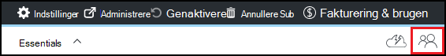

<properties
    pageTitle="Tilføje ejere og brugere i Azure DevTest øvelser | Microsoft Azure"
    description="Tilføje ejere og brugere i Azure DevTest øvelser ved hjælp af Azure portal eller PowerShell"
    services="devtest-lab,virtual-machines"
    documentationCenter="na"
    authors="tomarcher"
    manager="douge"
    editor=""/>

<tags
    ms.service="devtest-lab"
    ms.workload="na"
    ms.tgt_pltfrm="na"
    ms.devlang="na"
    ms.topic="article"
    ms.date="09/12/2016"
    ms.author="tarcher"/>

# Tilføje ejere og brugere i Azure DevTest øvelser

> [AZURE.VIDEO how-to-set-security-in-your-devtest-lab]

Access i Azure DevTest øvelser styres af [Azure Role-Based Access kontrolelement (RBAC)](../active-directory/role-based-access-control-what-is.md). Brug af RBAC, kan du udskille opgaver i dit team til *roller* , hvor du giver kun mængden af access, der er nødvendige for at kunne udføre deres arbejde. Tre af disse RBAC roller er *ejer*, *DevTest øvelser bruger*og *bidragyder*. I denne artikel kan du lære, hvilke handlinger kan udføres i hver af de tre vigtigste RBAC roller. Derfra kan lære du at føje brugere til en øvelse - både via portalen og via en PowerShell-script, og hvordan du tilføjer brugere på niveauet for abonnement.

## Handlinger, der kan udføres i hver rolle

Der er tre primære roller, kan du tildele en bruger:

- Ejer
- DevTest øvelser bruger
- Bidragyder

Tabellen nedenfor viser de handlinger, der kan udføres af brugere i hver af disse roller:

| **Handlinger brugerne i denne rolle kan udføre** | **DevTest øvelser bruger**            | **Ejer** | **Bidragyder** |
|---|---|---|---|
| **Øvelse opgaver**                          |                              |       |             |
| Føje brugere til en øvelse                     | Nej                           | Ja   | Nej          |
| Opdatere indstillinger for omkostninger                   | Nej                           | Ja   | Ja         |
| **VM grundlæggende opgaver**                      |                              |       |             |
| Tilføje og fjerne brugerdefinerede billeder           | Nej                           | Ja   | Ja         |
| Tilføje, opdatere og slette formler       | Ja                          | Ja   | Ja         |
| Whitelist Azure Marketplace billeder     | Nej                           | Ja   | Ja         |
| **VM opgaver**                           |                              |       |             |
| Oprette FOS                             | Ja                          | Ja   | Ja         |
| Starte, stoppe og slette FOS            | Kun VM'er, der er oprettet af brugeren | Ja   | Ja         |
| Opdatere VM politikker                     | Nej                           | Ja   | Ja         |
| Tilføj/fjern datadisce til/fra FOS      | Kun VM'er, der er oprettet af brugeren | Ja   | Ja         |
| **Genstand opgaver**                     |                              |       |             |
| Tilføje og fjerne genstand typer lagre   | Nej                           | Ja   | Ja         |
| Anvende elementer                        | Ja                          | Ja   | Ja         |

> [AZURE.NOTE] Når en bruger opretter en VM, tildeles brugeren automatisk rollen **ejeren** af oprettede VM.

## Tilføje en ejer eller bruger på niveauet for øvelse

Ejere og brugere kan tilføjes på niveauet øvelse via Azure-portalen. Dette omfatter eksterne brugere med en gyldig [Microsoft-konto (MSA)](devtest-lab-faq.md#what-is-a-microsoft-account).
Følgende trin fører dig gennem processen med at tilføje en ejer eller bruger til en øvelse i Azure DevTest øvelser:

1. Log på [Azure-portalen](http://go.microsoft.com/fwlink/p/?LinkID=525040).

1. Vælg **flere tjenester**, og vælg derefter **DevTest øvelser** på listen.

1. Vælg den ønskede øvelse på listen over øvelser.

1. Vælg **konfiguration**på den øvelse blade. 

1. Vælg **brugere**på bladet **konfiguration** .

1. Vælg **+ Tilføj**bladet **brugere** .

    

1. Vælg den ønskede rolle på bladet **Vælg en rolle** . Sektionen [Handlinger, der kan udføres i hver rolle](#actions-that-can-be-performed-in-each-role) viser de forskellige handlinger, der kan udføres af brugere på siden ejer, DevTest bruger og bidragyder roller.

1. Angiv den mailadresse eller navnet på den bruger, du vil tilføje i den rolle, du har angivet på bladet **Tilføj brugere** . Hvis brugeren ikke blev fundet, beskriver en fejlmeddelelse om problemet. Hvis brugeren er fundet, er denne bruger angivet og valgt. 

1. Vælg **Marker**.

1. Vælg **OK** for at lukke bladet **Tilføj adgang** .

1. Når du vender tilbage til bladet **brugere** , er blevet føjet brugeren.  

## Føje en ekstern bruger til en øvelse ved hjælp af PowerShell

Foruden at tilføje brugere i portalen Azure, kan du føje en ekstern bruger til din øvelse ved hjælp af en PowerShell-script. I eksemplet nedenfor blot ændre parameterværdier under **værdier for at ændre** kommentaren.
Du kan hente den `subscriptionId`, `labResourceGroup`, og `labName` værdier fra bladet øvelse i portalen Azure.

> [AZURE.NOTE]
> Eksempelscriptet antages det, at den angivne bruger er blevet tilføjet som gæst til Active Directory, og mislykkes, hvis det ikke er sag. For at tilføje en bruger ikke i Active Directory til en øvelse skal du bruge Azure portal tildele brugeren til en rolle som vist i afsnittet [føje en ejer eller bruger på niveauet for øvelse](#add-an-owner-or-user-at-the-lab-level).   

    # Add an external user in DevTest Labs user role to a lab
    # Ensure that guest users can be added to the Azure Active directory:
    # https://azure.microsoft.com/en-us/documentation/articles/active-directory-create-users/#set-guest-user-access-policies

    # Values to change
    $subscriptionId = "<Enter Azure subscription ID here>"
    $labResourceGroup = "<Enter lab's resource name here>"
    $labName = "<Enter lab name here>"
    $userDisplayName = "<Enter user's display name here>"

    # Log into your Azure account
    Login-AzureRmAccount
    
    # Select the Azure subscription that contains the lab. 
    # This step is optional if you have only one subscription.
    Select-AzureRmSubscription -SubscriptionId $subscriptionId
    
    # Retrieve the user object
    $adObject = Get-AzureRmADUser -SearchString $userDisplayName
    
    # Create the role assignment. 
    $labId = ('subscriptions/' + $subscriptionId + '/resourceGroups/' + $labResourceGroup + '/providers/Microsoft.DevTestLab/labs/' + $labName)
    New-AzureRmRoleAssignment -ObjectId $adObject.Id -RoleDefinitionName 'DevTest Labs User' -Scope $labId

## Tilføje en ejer eller bruger på niveauet for abonnement

Azure tilladelser overføres fra overordnede omfang til underordnet omfang i Azure. Ejere af et Azure-abonnement, der indeholder øvelser er derfor automatisk ejere af disse øvelser. De ejer også FOS og andre ressourcer, der er oprettet af den øvelse brugere og Azure DevTest øvelser-tjenesten. 

Du kan føje flere ejere til en øvelse via den øvelse blade i [Azure-portalen](http://go.microsoft.com/fwlink/p/?LinkID=525040). Tilføjede ejerens omfanget af administration er dog smallere end ejeren abonnement omfang. For eksempel har tilføjede ejerne ikke fuld adgang til nogle af de ressourcer, der er oprettet i abonnement af tjenesten DevTest øvelser. 

Hvis du vil tilføje en ejer et Azure-abonnement, skal du følge disse trin:

1. Log på [Azure-portalen](http://go.microsoft.com/fwlink/p/?LinkID=525040).

1. Vælg **Flere tjenester**, og vælg derefter **abonnementer** på listen.

1. Vælg det ønskede abonnement.

1. Vælg **Access** -ikonet. 

    

1. Vælg **Tilføj**på bladet **brugere** .

    

1. Vælg **ejer**bladet **Vælg en rolle** .

1. Angiv den mailadresse eller navnet på den bruger, du vil tilføje som en ejer på bladet **Tilføj brugere** . Hvis brugeren ikke kan findes, får du vist en fejlmeddelelse, som oplyser om problemet. Hvis brugeren er fundet, vises denne bruger under tekstboksen **bruger** .

1. Vælg placeret brugernavnet.

1. Vælg **Marker**.

1. Vælg **OK** for at lukke bladet **Tilføj adgang** .

1. Når du vender tilbage til bladet **brugere** , kan brugeren er blevet tilføjet som en ejer. Denne bruger er nu en ejer af enhver øvelser oprettes under dette abonnement, og dermed kunne udføre ejer opgaver. 

[AZURE.INCLUDE [devtest-lab-try-it-out](../../includes/devtest-lab-try-it-out.md)]
