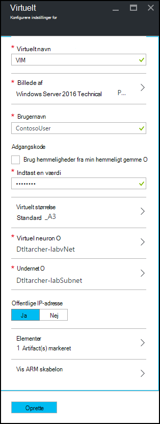

<properties
    pageTitle="Føje en VM med elementer til en øvelse i Azure DevTest øvelser | Microsoft Azure"
    description="Lær, hvordan du føjer en VM med elementer i Azure DevTest øvelser"
    services="devtest-lab,virtual-machines"
    documentationCenter="na"
    authors="tomarcher"
    manager="douge"
    editor=""/>

<tags
    ms.service="devtest-lab"
    ms.workload="na"
    ms.tgt_pltfrm="na"
    ms.devlang="na"
    ms.topic="article"
    ms.date="08/30/2016"
    ms.author="tarcher"/>

# Føje en VM med elementer til en øvelse i Azure DevTest øvelser

> [AZURE.VIDEO how-to-create-vms-with-artifacts-in-a-devtest-lab]

Du kan oprette en VM i en øvelse fra en *grundlæggende* , der er enten et [brugerdefineret billede](./devtest-lab-create-template.md), [formel](./devtest-lab-manage-formulas.md)eller [Marketplace billede](./devtest-lab-configure-marketplace-images.md).

DevTest øvelser *elementer* kan du angive *Handlinger* , der udføres, når VM oprettes. 

Genstand handlinger kan udføre procedurer, som kører Windows PowerShell-scripts, kører fest kommandoer og installere software. 

Genstand *parametre* kan du tilpasse genstand for scenariet bestemt.

I denne artikel beskrives, hvordan du opretter en VM i din øvelse med elementer.

## Tilføje en VM med elementer

1. Log på [Azure-portalen](http://go.microsoft.com/fwlink/p/?LinkID=525040).

1. Vælg **Flere tjenester**, og vælg derefter **DevTest øvelser** på listen.

1. På listen over øvelser, Vælg den øvelse, hvor du vil oprette VM.  

1. Vælg **+ virtuelt**på den øvelse **Oversigt** blade.  
    

1. Vælg en base af VM på bladet **Vælg udgangspunkt** .

1. Angiv et navn til den nye virtuelle maskine i tekstfeltet **virtuelt navn** på bladet **virtuelt** .

    

1. Angiv et **Brugernavn** , der skal tildeles administratorrettigheder på den virtuelle maskine.  

1. Hvis du vil bruge en adgangskode, der er gemt i din *hemmeligt store*, Vælg **Brug hemmeligheder fra min hemmeligt store**, og Angiv en nøgleværdi, der svarer til din hemmeligt (adgangskode). Ellers skal blot angive en adgangskode i tekstfeltet, der er mærket **Skriv en værdi**.
 
1. Vælg **virtuelt størrelse** , og vælg en af de foruddefinerede varer, angiver processorer, RAM størrelse og harddisk størrelsen af VM til at oprette.

1. Vælg **virtuelle netværk** , og vælg det ønskede virtuelle netværk.

1. Vælg **undernet** , og vælg undernet.

1. Hvis politikken øvelse er indstillet til Tillad offentlige IP-adresser for det valgte undernet, kan du angive, om du vil IP-adressen, der skal være offentlig ved at vælge enten **Ja** eller **Nej**. Ellers skal er denne indstilling deaktiveret og valgt som **ingen**. 

1. Vælg **elementer** og - vælg fra listen over elementer - og Konfigurer de elementer, du vil føje til den grundlæggende afbildning. 
**Note:** Hvis du er ny bruger af DevTest øvelser eller konfiguration af elementer, gå til afsnittet [tilføje en eksisterende genstand til en VM](#add-an-existing-artifact-to-a-vm) , og derefter returnere her, når du er færdig.

1. Hvis du vil se eller kopiere skabelonen Azure Ressourcestyring, gå til afsnittet [gemme Azure ressourcestyring skabelon](#save-arm-template) og returnere her, når du er færdig.

1. Vælg **Opret** for at føje den angivne VM til øvelse.

1. Bladet øvelse viser status for oprettelse af den VM; først som **opretter**, derefter som **kører** efter VM er blevet startet.

1. Gå til afsnittet [Næste trin](#next-steps) . 

## Føje en eksisterende genstand til en VM

Mens du opretter en VM, kan du tilføje eksisterende elementer. Hvert laboratorium indeholder elementer fra den offentlige DevTest øvelser genstand lager samt elementer, du har oprettet og føjet til din egen genstand lager.
For at se, hvordan du kan oprette elementer, skal du se artiklen [lære, hvordan du opretter dine egne elementer til brug med DevTest øvelser](devtest-lab-artifact-author.md).

1. Vælg **elementer**på bladet **virtuelt** . 

1. Vælg den ønskede genstand på bladet **Tilføj elementer** .  

    

1. Angiv de nødvendige parameterværdier og eventuelle valgfrie parametre, du skal bruge.  

1. Vælg **Tilføj** til at tilføje genstand og vende tilbage til bladet **Tilføje elementer** .

1. Fortsæt med at tilføje elementer efter behov for din VM.

1. Når du har tilføjet din elementer, kan du [ændre den rækkefølge, hvori elementer er kørt](#change-the-order-in-which-artifacts-are-run). Du kan også gå tilbage til at [få vist eller ændre en genstand](#view-or-modify-an-artifact).

## Ændre den rækkefølge, hvori elementer er kørt

Som standard udføres af handlingerne for elementer i den rækkefølge, hvori de føjes til VM. Følgende trin viser, hvordan du kan ændre den rækkefølge, hvori elementer er kørt.

1. Vælg det link, der angiver antallet af elementer, der er føjet til VM øverst i bladet **Tilføje elementer** .

    

1. Hvis du vil angive den rækkefølge, hvori elementer er kørt, træk og slip elementer til den ønskede rækkefølge. **Note:** Hvis du har problemer med at trække genstand, skal du kontrollere, at du trækker fra venstre side af genstand. 

1. Vælg **OK** , når du er færdig.  

## Få vist eller ændre en genstand

Følgende trin viser, hvordan du kan få vist eller rediger parametrene for en genstand:

1. Vælg det link, der angiver antallet af elementer, der er føjet til VM øverst i bladet **Tilføje elementer** .

    

1. Vælg den genstand, du vil have vist eller redigere bladet **Markerede elementer** .  

1. Foretag de nødvendige ændringer, og vælg **OK** for at lukke bladet **Tilføje genstand** på bladet **Tilføje genstand** .

1. Vælg **OK** for at lukke bladet **Markerede elementer** .

## Gemme Azure ressourcestyring skabelon

En Azure ressourcestyring skabelon udgør en deklarativ måde til at definere en gentaget installation. Følgende trin beskriver, hvordan til at gemme skabelonen Azure ressourcestyring VM der oprettes.
Når du har gemt, kan du bruge skabelonen Azure ressourcestyring til at [installere nye FOS med Azure PowerShell](../azure-resource-manager/resource-group-overview.md#template-deployment).

1. Vælg **Vis ARM skabelon**på bladet **virtuelt** .

1. Markér skabelon teksten på **Vis Azure ressourcestyring skabelon blade**.

1. Kopiér den markerede tekst til Udklipsholder.

1. Vælg **OK** for at lukke **Vis Azure ressourcestyring skabelon blade**.

1. Åbn et tekstredigeringsprogram.

1. Indsæt skabelontekst fra Udklipsholder.

1. Gem filen til senere brug.

[AZURE.INCLUDE [devtest-lab-try-it-out](../../includes/devtest-lab-try-it-out.md)]

## Næste trin

- Når VM er blevet oprettet, kan du oprette forbindelse til VM ved at vælge **Opret forbindelse** på den VM blade.
- Lær, hvordan du kan [oprette brugerdefinerede elementer til din DevTest øvelser VM](devtest-lab-artifact-author.md).
- Gå på opdagelse i [skabelongalleriet DevTest øvelser ARM Hurtig start](https://github.com/Azure/azure-devtestlab/tree/master/ARMTemplates)