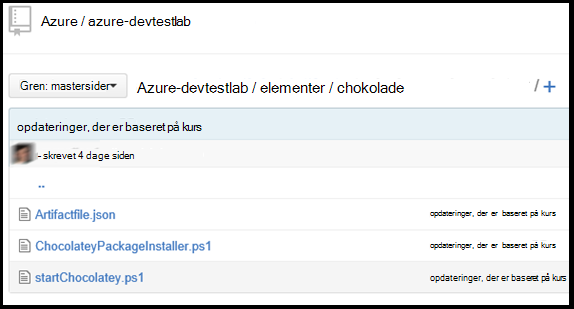

<properties 
    pageTitle="Oprette brugerdefinerede elementer til din DevTest øvelser VM | Microsoft Azure"
    description="Lær, hvordan du opretter dine egne elementer til brug med DevTest øvelser"
    services="devtest-lab,virtual-machines"
    documentationCenter="na"
    authors="tomarcher"
    manager="douge"
    editor=""/>

<tags
    ms.service="devtest-lab"
    ms.workload="na"
    ms.tgt_pltfrm="na"
    ms.devlang="na"
    ms.topic="article"
    ms.date="08/25/2016"
    ms.author="tarcher"/>

#Oprette brugerdefinerede elementer til din DevTest øvelser VM

> [AZURE.VIDEO how-to-author-custom-artifacts] 

## Oversigt
**Elementer** , der bruges til at installere og konfigurere dit program, når en VM er klargjort. En genstand består af en genstand definitionsfil og andre scriptfiler, der er gemt i en mappe i et ciffer lager. Genstand definitionsfiler består af JSON og udtryk, som du kan bruge til at angive, hvad du vil installere på en VM. Du kan for eksempel definere navnet på genstand, kommandoen til at køre og parametre, der er gjort tilgængelige, når kommandoen køres. Du kan referere til andre scriptfiler i genstand definitionsfilen ved navn.

##Genstand definition-filformat
I følgende eksempel vises de sektioner, der udgør den grundlæggende struktur af en definitionsfil.

    {
      "$schema": "https://raw.githubusercontent.com/Azure/azure-devtestlab/master/schemas/2015-01-01/dtlArtifacts.json",
      "title": "",
      "description": "",
      "iconUri": "",
      "targetOsType": "",
      "parameters": {
        "<parameterName>": {
          "type": "",
          "displayName": "",
          "description": ""
        }
      },
      "runCommand": {
        "commandToExecute": ""
      }
    }

| Elementnavn | Påkrævet? | Beskrivelse
| ------------ | --------- | -----------
| $schema      | Nej        | Placeringen af den JSON-skemafil, der hjælper med at afprøve definitionsfilen gyldighed.
| titel        | Ja       | Navnet på den genstand, vises i øvelse.
| Beskrivelse  | Ja       | Beskrivelse af den genstand, vises i øvelse.
| iconUri      | Nej        | URI af ikonet vises i øvelse.
| targetOsType | Ja       | Operativsystem VM hvor genstand skal installeres. Understøttede indstillinger er: Windows og Linux.
| parametre   | Nej        | Værdier, der kan bruges, når genstand Installer kommandoen køres på en computer. Dette hjælper med at tilpasse din genstand.
| KørKommando   | Ja       | Genstand installere kommando, der udføres på en VM.

###Genstand parametre

I sektionen parametre i definitionsfilen skal angive du hvilke værdier, der er en bruger kan input, når du installerer en genstand. Du kan referere til disse værdier i kommandoen genstand Installer.

Definere parametre er følgende struktur.

    "parameters": {
        "<parameterName>": {
          "type": "<type-of-parameter-value>",
          "displayName": "<display-name-of-parameter>",
          "description": "<description-of-parameter>"
        }
      }

| Elementnavn | Påkrævet? | Beskrivelse
| ------------ | --------- | -----------
| type         | Ja       | Type af parameterværdi. Se på listen herunder for de tilladte typer:
| vist navn Ja       | Navnet på den parameter, der vises for en bruger i øvelse.
| Beskrivelse  | Ja       | Beskrivelse af den parameter, der vises i øvelse.

De tilladte typer er:

- streng – en gyldig JSON-streng
- int – en hvilken som helst gyldigt JSON heltal
- Boolesk – en hvilken som helst gyldigt JSON boolesk
- matrix – en hvilken som helst gyldigt JSON-matrix

##Genstand udtryk og funktioner

Du kan bruge udtryk og funktioner til at oprette genstand installere kommandoen.
Udtryk er omsluttet med parenteser ([og]), og evalueres, når genstand er installeret. Udtryk kan vises et vilkårligt sted i en JSON strengværdi og altid returnere et andet JSON-værdi. Hvis du vil bruge en strengkonstant, der starter med en højreparentes [, skal du bruge to kantede parenteser [[.
Typisk, skal du bruge udtryk med funktioner til at oprette en værdi. Ligesom i JavaScript, er funktionskald formateret som functionName(arg1,arg2,arg3)

Den nedenstående liste viser almindelige funktioner.

- parameters(parameterName) - returnerer en værdi, der leveres, når genstand kommandoen køres.
- Sammenkæd (arg1, arg2, arg3,...) - kombinerer flere strengværdier. Denne funktion kan tage et vilkårligt antal argumenter.

I følgende eksempel viser, hvordan du bruger udtryk og funktioner til at oprette en værdi.

    runCommand": {
         "commandToExecute": "[concat('powershell.exe -File startChocolatey.ps1'
    , ' -RawPackagesList ', parameters('packages')
    , ' -Username ', parameters('installUsername')
    , ' -Password ', parameters('installPassword'))]"
    }

##Oprette en brugerdefineret genstand

Oprette dit eget genstand ved at følge nedenstående trin:

1. Installere en JSON editor – du skal bruge en JSON-editor til at fungere sammen med genstand definitionsfiler. Vi anbefaler ved hjælp af [Visual Studio-kode](https://code.visualstudio.com/), som fås til Windows, Linux og OS X.

1. Få et eksempel artifactfile.json - se de elementer, der er oprettet af Azure DevTest øvelser team på vores [GitHub lager](https://github.com/Azure/azure-devtestlab) , hvor vi har oprettet et omfattende bibliotek med elementer, der hjælper dig med at oprette dine egne elementer. Hente en genstand definitionsfil og foretage ændringer i den til at oprette dine egne elementer.

1. Gøre brug af IntelliSense - udnyttelse IntelliSense til at se gyldige elementer, der kan bruges til at oprette en genstand definitionsfil. Du kan også få vist de forskellige indstillinger for værdier for et element. For eksempel IntelliSense viser dig de to valg af Windows eller Linux når du redigerer elementet **targetOsType** .

1. Gemme genstand i et ciffer lager
    1. Oprette en separat mappe til hver genstand, hvor navnet på den mappe er den samme som navnet på genstand.
    1. Gemme genstand definitionsfilen (artifactfile.json) i den mappe, du har oprettet.
    1. Gemme de scripts, der refereres til fra kommandoen genstand Installer.

    Her er et eksempel på, hvordan en genstand mappe kan se:

    

1. Tilføje elementer lager til øvelse - refererer til i artiklen, [tilføje et ciffer genstand lager til en øvelse](devtest-lab-add-artifact-repo.md).

[AZURE.INCLUDE [devtest-lab-try-it-out](../../includes/devtest-lab-try-it-out.md)]

## Relaterede blogindlæg
- [Sådan foretages fejlfinding af problemer med elementer i AzureDevTestLabs](http://www.visualstudiogeeks.com/blog/DevOps/How-to-troubleshoot-failing-artifacts-in-AzureDevTestLabs)
- [Deltage i et VM til eksisterende AD domæne ved hjælp af ARM skabelon i Azure-Udviklingscenter testmiljø](http://www.visualstudiogeeks.com/blog/DevOps/Join-a-VM-to-existing-AD-domain-using-ARM-template-AzureDevTestLabs)

## Næste trin

- Lær, hvordan du [tilføjer et ciffer genstand lager til en øvelse](devtest-lab-add-artifact-repo.md).
